2026-08-06
# F7 Hub: Personal MSP Assistant. Own customizable technician Workstation specialized in MSP. 

## Main Goals : 
• Create a launcher
• Create a ticket manager
• Create a clipboard manager


## I press F7 because I want a GUI to popup with a Ticket Dashboard and buttons. Every button opens another module.Each module owns its own data:


F7
↓
Dashboard
↓
Tickets
Clipboard
Websites
Scripts
Prompts
Knowledge Base
Settings

F7 Hub would be my first real software engineering project. We'd start by writing a comprehensive Database.md document that defines every table, every field, every relationship, and every planned feature. From that single source of truth, we could generate:
The ERD.
The SQL schema.
The PowerShell script that creates the SQLite database.
The AutoHotkey constants and helper functions.
Later, even Python ORM models if you decide to use one.

                    USER
                      │
                      ▼
         AutoHotkey v2 GUI (F7 Hub)
                      │
        ┌─────────────┼─────────────┐
        │             │             │
   PowerShell      SQLite        Python
 Automation      Data Storage    Intelligence
        │             │             │
        └─────────────┼─────────────┘
                      │
                Documentation
               (Markdown / ERD)

That way, the documentation and the code stay synchronized instead of drifting apart.
real software engineering project. We'd start by writing a comprehensive Database.md document that defines every table, every field, every relationship, and every planned feature. From that single source of truth, we could generate:
The ERD.
The SQL schema.
The PowerShell script that creates the SQLite database.
The AutoHotkey constants and helper functions.
Later, even Python ORM models if you decide to use one.
That way, the documentation and the code stay synchronized instead of drifting apart.


# Development Roadmap:
Define every feature of the F7 Hub.
Identify all the entities (Tickets, Prompts, Websites, Scripts, KB Articles, Clipboard Items, etc.).
Draw an Entity Relationship Diagram (ERD).
Create the SQLite schema.
Write PowerShell to automatically create the database and tables.
Build the AutoHotkey GUI against that schema.
Add Python later for advanced search, AI, reporting, or analytics.

Phase 0
Vision
Requirements
Roadmap
↓
Phase 1
Folder Structure
↓
Phase 2
GUI Wireframes
↓
Phase 3
ERD
↓
Phase 4
Database Schema
↓
Phase 5
PowerShell Database Builder
↓
Phase 6
AutoHotkey Framework
↓
Phase 7
Ticket Module
↓
Phase 8
Clipboard Module
↓
Phase 9
Prompt Module
↓
Phase 10
Knowledge Base
↓
Phase 11
AI Assistant
↓
Phase 12
Reports & Analytics


# Responsibilities:
🖥 AHK v2 = Interface
🗄 SQLite = Stores information
⚡ PowerShell = Windows & Microsoft 365 automation
🐍 Python = AI, search, analytics
📚 Markdown = Documentation


# Programs:

## 🖥 AutoHotkey v2: User interface GUI; Later = Python QT6 (PyQT6).
✔ Read database
✔ Display menus
✔ Add tickets
✔ Clipboard manager
✔ Launch applications

## 🐍 Python: Later = Advanced features (AI, reports, search, analytics).
✔ Search engine
✔ AI
✔ Reports
✔ Statistics
✔ Data analysis

## ⚡ PowerShell: Create/update the database schema automatically:
Create database
↓
Create Tables
↓
Insert default Categories
↓
Insert default Values and Settings
↓
Upgrade database version;
IT Support Scripts will be stored in the SQLite DB and be prompted by the program. 

## 🗄 SQLite: The actual SQL database.

## MarkDown: Describe the application, features, and database design.
Vision
 Goals
 Features
 Future Ideas
 Version 1
 Version 2
 Notes


## Excel: Plan tables, fields, data types, and sample data.


# Files:
INI:	User settings for AutoHotKey v.2 (IniRead)
TXT:	Logs, notes, exports
JSON:	Structured configuration, Menus (Comm.VS AHK/PS/Py
SQLite:	Permanent application data (SQLite)

## SQLite (ERD)
✔ Companies
✔ Ticket history
✔ Clipboard history
✔ Prompts
✔ KB articles
✔ Websites
✔ Applications
✔ User snippets
✔ Searchable notes

## INI
[Window]
Theme=Dark
Opacity=90
Language=French
StartMaximized=True
Small configuration for AHK v.2

 AutoHotkey v2
                    │
      ┌─────────────┼─────────────┐
      │             │             │
     INI          SQLite        JSON
      │             │             │
 Settings      Permanent      Import/Export
 Theme         Tickets        Menu Layout
 Font          KB             Button Lists
 Hotkeys       Clipboard      Backup
 Opacity       Prompts

 As the project grows, you could even add:
⭐ SQLite Full-Text Search (FTS5) to instantly search thousands of KB articles and snippets.
⭐ Python for advanced search, AI features, and analytics.
⭐ AutoHotkey v2 as the fast launcher and GUI.
⭐ PowerShell for Microsoft 365, Azure, Entra ID, Exchange, and Windows automation.
This architecture keeps each tool focused on what it does best while remaining easy to maintain.

# I would actually start the project with:
F7Hub
Documentation
Database
ERD
SQL
PowerShell
AutoHotkey
Python


# SQLite Tables 
Settings
Users
Categories
MenuItems
Applications
Folders
Websites
Prompts
ClipboardHistory
Tickets
TicketNotes
KnowledgeBase
Tags


# ERD: Database.md
Project overview
Features
Tables
Relationships
Future tables
Version history
*ASCII diagrams or Mermaid syntax inside Markdown.

Company
Ticket
Contact
KB Article
Website
Prompt
Clipboard
Application
Folder
Script
Category
Tag
User
Setting
Log

Company
   │
   ├────< Ticket
   │
   └────< Contact

Ticket
   │
   ├────< Ticket Notes
   ├────< Ticket Website
   ├────< Ticket KB
   ├────< Ticket Prompt
   └────< Attachments


# SQLite Normalization:
Settings
     │
     │
Categories
     │
 ┌───┴────────────┐
 │                │
Websites      Applications
 │                │
 └──────┐   ┌─────┘
        │   │
      MenuItems
           │
      Clipboard
           │
      Ticket Notes

## 1. Website
ID
Name
URL
CategoryID

## 2. IT Scripts

## 3. AI Prompt
ID
Title
PromptText
CategoryID

## 4. Ticket
TicketID
CompanyID
StatusID
PriorityID
AssignedTo
DateCreated
DateUpdated
Subject
Description
Resolution
Notes
TimeSpent
Closed

## 5. KB
KBID
Title
Summary
Article
Keywords
Created
Modified
Author
Difficulty
URL
CategoryID
* Ticket
    │
    ├──── TicketWebsite ──── Website
    │
    ├──── TicketKB ───────── KBArticle
    │
    ├──── TicketPrompt ───── Prompt
    │
    └──── TicketTag ──────── Tag


# SQLite Entities: 
F7 HUB
│
├── Settings
├── Menu
├── Tickets
├── Knowledge Base
├── Clipboard
├── Websites
├── Applications
├── PowerShell
├── AutoHotkey
├── Python
├── Files
├── Projects
├── Logs
├── Search
├── Tags
├── Categories
├── AI
└── Reports


# Architecture (each box can later become its own database are):
F7 HUB
│
├── Dashboard
│
├── Ticket Manager
│      │
│      ├── Companies
│      ├── Contacts
│      ├── Notes
│      ├── KB References
│      ├── Websites
│      └── Attachments
│
├── Clipboard Manager
│
├── Prompt Manager
│
├── Script Library
│
├── Website Launcher
│
├── Folder Launcher
│
├── Application Launcher
│
├── Knowledge Base
│
├── Settings
│
└── Search Everything


# Folder structure: 
C:\Users\Jo\OneDrive\Desktop\LAB\A F7 Hub:
│
├── Docs
│
├── Database
│
├── AutoHotkey
│
├── PowerShell
│
├── Python
│
├── Assets
│
├── Icons
│
├── Logs
│
├── Backup
│
└── Config


# Docs
│
├── 00_ProjectVision.md
├── 01_Project.md
├── 02_ProductRequirements.md
├── 03_Features.md
├── 04_UserWorkflows.md
├── 05_GUI.md
├── 06_SystemArchitecture.md
├── 07_Database.md
├── 08_ERD.md
├── 09_SQLSchema.md
├── 10_FolderStructure.md
├── 11_AHKArchitecture.md
├── 12_PowerShellArchitecture.md
├── 13_PythonArchitecture.md
├── 14_Roadmap.md
├── 15_Todo.md
├── 16_ChangeLog.md
│
├── Assets
│   ├── Diagrams
│   ├── Mockups
│   ├── Icons
│   └── Screenshots
│
├── Research
│   ├── AutoHotkey
│   ├── SQLite
│   ├── PowerShell
│   ├── Python
│   ├── GUI
│   ├── HaloPSA
│   ├── Microsoft365
│   ├── AI
│   └── Ideas
│
└── Archive


# Development order:
Vision
↓
Feature List
↓
Folder Structure
↓
GUI Sketches
↓
Database Design
↓
ERD
↓
SQL Schema
↓
PowerShell Builder
↓
SQLite Database
↓
AHK GUI
↓
Python AI/Search


# Dashboard with buttons and ticket infos:
           Personal MSP Assistant

               Dashboard
                    │
 ┌──────────────────┼──────────────────┐
 │                  │                  │
Tickets         Knowledge Base      Clipboard
 │                  │                  │
Scripts         Websites         Prompts
 │                  │                  │
PowerShell      AutoHotkey        Python
 │                  │                  │
Settings         Search           Reports
                    │
                 SQLite


# MVC Overall Architecture:
                    F7
                      │
                      ▼
              AutoHotkey v2 GUI
                 (View Layer)
                      │
                      ▼
            Controller (AHK/PowerShell)
                      │
        ┌─────────────┼─────────────┐
        │             │             │
        ▼             ▼             ▼
      SQLite     PowerShell      Python
      (Model)    Automation     AI/Search


# Model-View Controller (MVC) SystemArchitecture.md 
🎯 Project vision and goals.
🧩 List of every module (Tickets, Clipboard, KB, Websites, etc.).
🖼️ High-level GUI navigation map.
🗄️ Database overview (not individual fields yet).
🔗 Module relationships.
📁 Folder structure.
🚀 Development roadmap (v0.1, v0.2, v1.0...).

# MVC Model :
🗄 Database
📂 Files
⚙ Settings
📊 Business rules
Tickets
Companies
KB Articles
Clipboard entries
Prompts
Websites


# GUI :
F7 Dashboard
Tickets
Clipboard
KB
Settings


# Controller (Connects everything) :
Click:
"New Ticket"
↓
Controller
↓
Create Ticket
↓
Save to SQLite
↓
Refresh GUI


# Organization
I would actually expand it slightly.
Instead of only MVC, I'd organize it like this:
Presentation Layer
│
├── AutoHotkey GUI
├── Menus
└── Forms

Application Layer
│
├── Ticket Logic
├── Search Logic
├── Clipboard Logic
├── Import / Export
└── Validation

Data Layer
│
├── SQLite
├── INI
├── JSON
└── Logs

Automation Layer
│
├── PowerShell
├── Windows
├── Microsoft 365
└── Azure

AI Layer
│
├── Python
├── Embeddings
├── Search
└── Reports


# Modules:

F7 Hub
│
├── Ticket Module
├── KB Module
├── Prompt Module
├── Clipboard Module
├── Launcher Module
├── Automation Module
├── Settings Module
├── AI Module
└── Search Module

## Each module owns:
its GUI
its database tables
its SQL
its icons
its settings
its documentation
*This makes the project much easier to maintain.


# Software Blueprint: 
*From that blueprint, we could generate:

📁 The complete folder structure.
🗄️ The SQLite schema.
📊 The ERD.
⚡ PowerShell scripts to build and migrate the database.
🖥️ AutoHotkey v2 class skeletons.
🐍 Python package structure.


# Project structure: 
F7-Hub/
│
├── Docs/
├── AutoHotkey/
├── PowerShell/
├── Python/
├── Database/
├── Config/
├── Assets/
├── Logs/
├── Backup/
├── Releases/
└── Tests/
*Vision → Requirements → Design → Database → Code


# Mermaid Prompts:

## Favorite Diagram
flowchart TD

Vision["🎯 Vision"]

Requirements["📋 Requirements"]

Architecture["🏗 Architecture"]

GUI["🖥 GUI"]

Database["🗄 SQLite"]

PowerShell["⚡ PowerShell"]

Python["🐍 Python"]

Release["🚀 Release"]

Vision --> Requirements
Requirements --> Architecture
Architecture --> GUI
Architecture --> Database
Database --> PowerShell
Database --> Python
PowerShell --> Release
Python --> Release


## Overall System Architecture
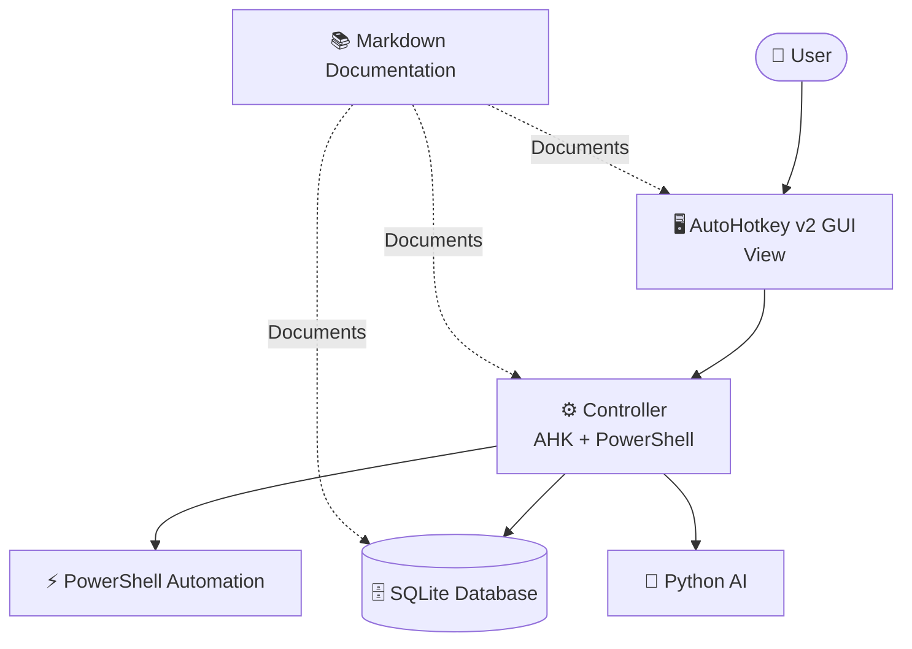

## MVC Architecture
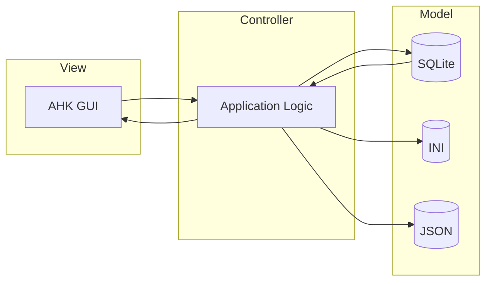

## Dashboard Navigation
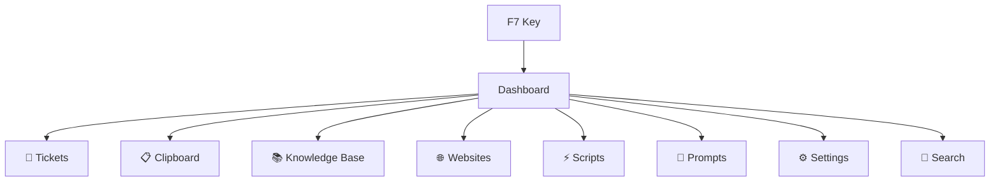

## Ticket Database ERD (Starter)
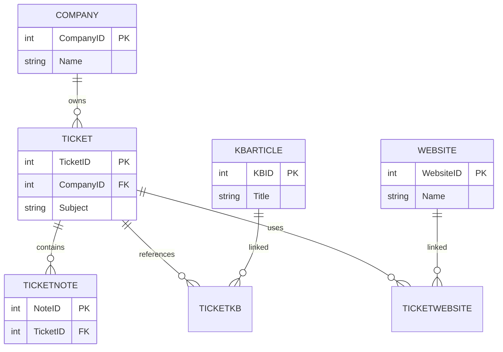

## Module Architecture
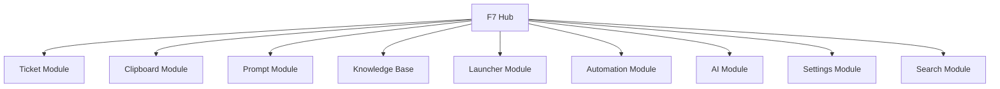

## Application Layers
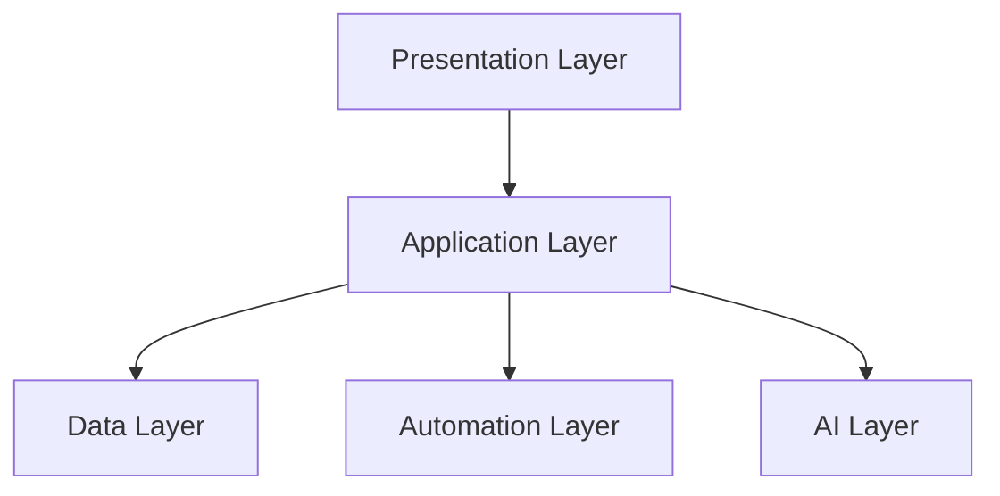

## Development Roadmap
```mermaid
flowchart LR

    Vision

    Requirements

    Features

    GUI

    Database

    ERD

    SQL

    PowerShell

    AutoHotkey

    Python

    Release

    Vision --> Requirements

    Requirements --> Features

    Features --> GUI

    GUI --> Database

    Database --> ERD

    ERD --> SQL

    SQL --> PowerShell

    PowerShell --> AutoHotkey

    AutoHotkey --> Python

    Python --> Release
```

## Future Database (High-Level)
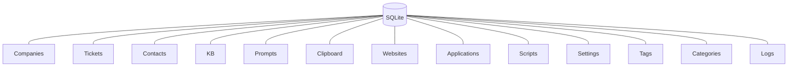

## 00_Vision.md
# Vision

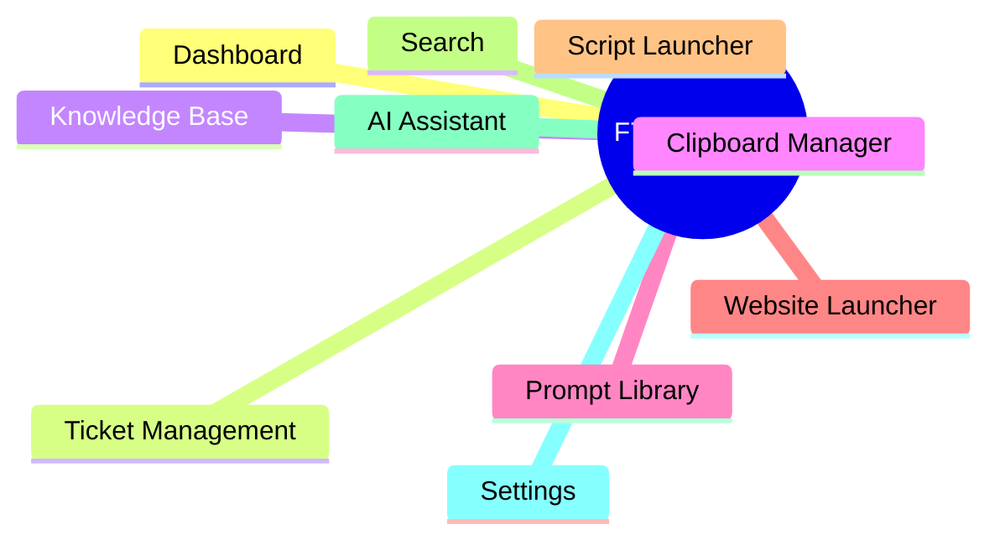

## 01_ProductRequirements.md
# Product Requirements

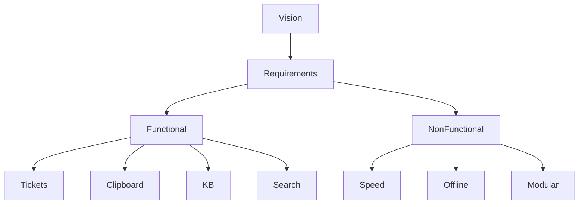

## 02_Features.md
# Features

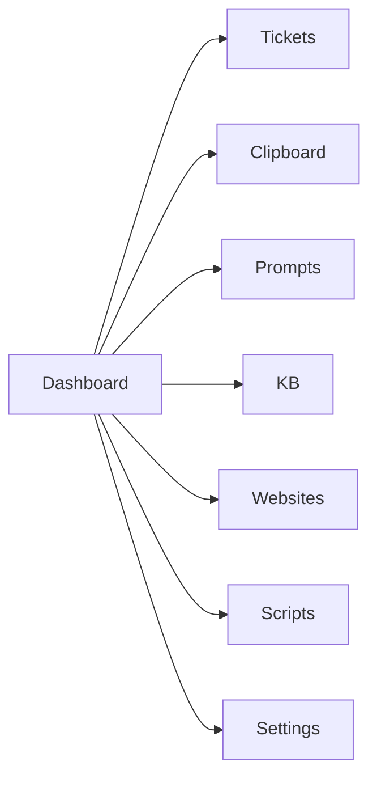

## 03_UserWorkflow.md
# User Workflow

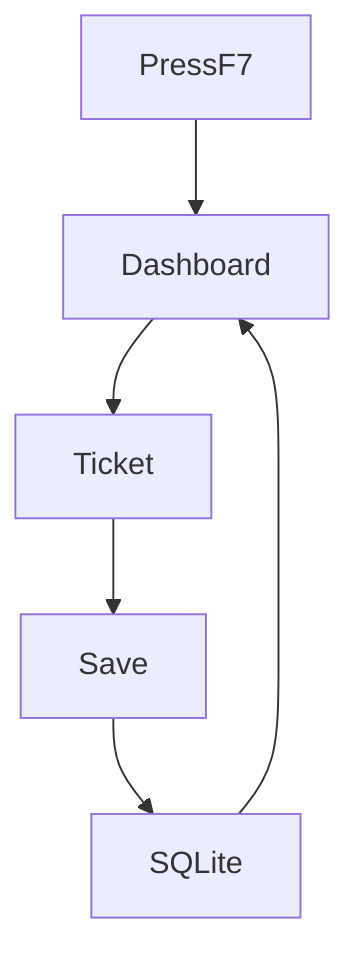

## 04_GUI.md
# GUI

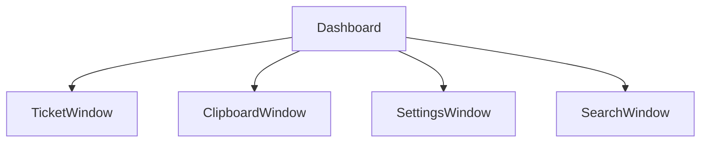


## 05_SystemArchitecture.md


# System Architecture
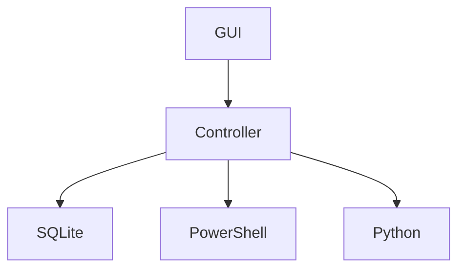


## 06_DatabaseDesign.md
# Database

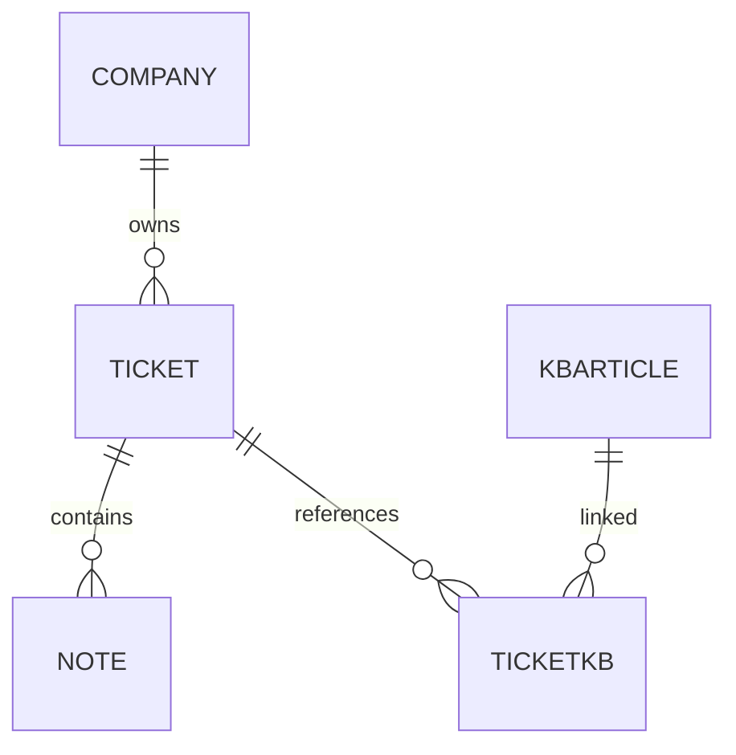

## 08_SQLSchema.md
# SQL Schema

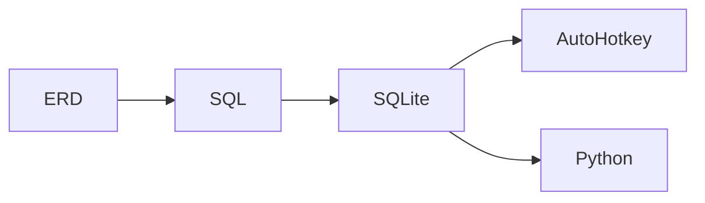

## 09_Modules.md
# Modules
```mermaid
mindmap

root((Modules))

Ticket

Clipboard

Knowledge Base

Prompt

Launcher

Automation

AI

Reports

Settings
```


## 09_Modules.md
# Modules

```mermaid
mindmap

root((Modules))

Ticket

Clipboard

Knowledge Base

Prompt

Launcher

Automation

AI

Reports

Settings
```

## 10_Roadmap.md
# Roadmap

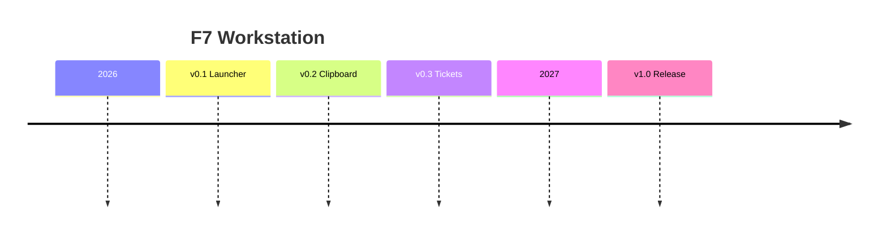


# OLD File structure :


F7Hub 
│
├── AutoHotkey
│   ├── Core
│   ├── GUI
│   ├── Modules
│   │   ├── Dashboard
│   │   ├── Tickets
│   │   ├── Clipboard
│   │   ├── KnowledgeBase
│   │   ├── Prompts
│   │   ├── Websites
│   │   ├── Applications
│   │   ├── Search
│   │   ├── Settings
│   │   └── AI
│   │
│   ├── Libraries
│   ├── Classes
│   ├── Includes
│   ├── Functions
│   ├── Helpers
│   ├── Themes
│   ├── Resources
│   ├── Hotkeys
│   ├── Icons
│   └── Templates
│
├── PowerShell
│   ├── Core
│   ├── Modules
│   │   ├── Microsoft365
│   │   ├── Azure
│   │   ├── EntraID
│   │   ├── ExchangeOnline
│   │   ├── SharePoint
│   │   ├── Teams
│   │   ├── Intune
│   │   ├── Windows
│   │   ├── ActiveDirectory
│   │   ├── SQL
│   │   └── Utilities
│   │
│   ├── Functions
│   ├── Templates
│   ├── Reports
│   └── Logs
│
├── Python
│   ├── Core
│   ├── AI
│   ├── Search
│   ├── OCR
│   ├── Reports
│   ├── Automation
│   ├── API
│   ├── Utilities
│   ├── GUI
│   └── Tests
│
├── Database
│   ├── SQLite
│   │   ├── Backups
│   │   ├── Migrations
│   │   ├── Seeds
│   │   ├── Queries
│   │   └── Views
│   │   └── Indexes
│   │   └── Triggers
│   │   └── ERD

│   │
│   ├── SQL
│   │   ├── Tables
│   │   ├── Views
│   │   ├── Indexes
│   │   ├── Triggers
│   │   ├── Procedures
│   │   └── Queries
│   │
│   └── ERD
│
├── Config
│   ├── INI
│   ├── JSON
│   ├── XML
│   ├── YAML
│   └── Templates
│
├── Data
│   ├── Clipboard
│   ├── Imports
│   ├── Exports
│   ├── Cache
│   ├── Temp
│   └── Samples
│
├── Assets
│   ├── Icons
│   ├── Images
│   ├── Logos
│   ├── Mockups
│   ├── Fonts
│   ├── Sounds
│   ├── Themes
│   └── Screenshots
│
├── Docs
│   ├── 00_ProjectVision.md
│   ├── 01_Project.md
│   ├── 02_ProductRequirements.md
│   ├── 03_Features.md
│   ├── 04_UserWorkflows.md
│   ├── 05_GUI.md
│   ├── 06_SystemArchitecture.md
│   ├── 07_Database.md
│   ├── 08_ERD.md
│   ├── 09_SQLSchema.md
│   ├── 10_FolderStructure.md
│   ├── 11_AHKArchitecture.md
│   ├── 12_PowerShellArchitecture.md
│   ├── 13_PythonArchitecture.md
│   ├── 14_Roadmap.md
│   ├── 15_Todo.md
│   ├── 16_ChangeLog.md
│   │
│   ├── Assets
│   │   ├── Diagrams
│   │   ├── Mockups
│   │   ├── Icons
│   │   └── Screenshots
│   │
│   ├── Research
│   │   ├── AutoHotkey
│   │   ├── SQLite
│   │   ├── Python
│   │   ├── PowerShell
│   │   ├── Microsoft365
│   │   ├── GUI
│   │   ├── AI
│   │   ├── HaloPSA
│   │   └── Ideas
│   │
│   └── Archive
│
├── Logs
│   ├── AutoHotkey
│   ├── PowerShell
│   ├── Python
│   ├── SQLite
│   └── Application
│
├── Tests
│   ├── AutoHotkey
│   ├── PowerShell
│   ├── Python
│   ├── Database
│   └── GUI
│
├── Releases
│   ├── Alpha
│   ├── Beta
│   ├── Stable
│   └── Archive
│
├── Tools
│   ├── SQLiteStudio
│   ├── DBBrowser
│   ├── Mermaid
│   ├── Scripts
│   └── Utilities
│
├── .gitignore
├── README.md
├── LICENSE
├── CHANGELOG.md
└── F7Hub.code-workspace


# File Structure : 

F7Hub
│
├── AutoHotkey
│   ├── Core
│   ├── GUI
│   ├── Modules
│   │   ├── Dashboard
│   │   ├── Tickets
│   │   ├── Clipboard
│   │   ├── KnowledgeBase
│   │   ├── Prompts
│   │   ├── Websites
│   │   ├── Applications
│   │   ├── Search
│   │   ├── Settings
│   │   ├── AI
│   │   └── Plugins
│   │
│   ├── Classes
│   ├── Functions
│   ├── Helpers
│   ├── Includes
│   ├── Lib
│   ├── Resources
│   ├── Themes
│   ├── Templates
│   ├── Hotkeys
│   └── Icons
│
├── PowerShell
│   ├── Core
│   ├── Modules
│   │   ├── Microsoft365
│   │   ├── Azure
│   │   ├── EntraID
│   │   ├── ExchangeOnline
│   │   ├── SharePoint
│   │   ├── Teams
│   │   ├── Intune
│   │   ├── ActiveDirectory
│   │   ├── Windows
│   │   ├── SQLite
│   │   └── Utilities
│   │
│   ├── Functions
│   ├── Templates
│   ├── Reports
│   └── Logs
│
├── Python
│   ├── Core
│   ├── AI
│   ├── Search
│   ├── OCR
│   ├── Automation
│   ├── API
│   ├── GUI
│   ├── Reports
│   ├── Utilities
│   └── Tests
│
├── Database
│   ├── SQLite
│   │   ├── F7Hub.db
│   │   ├── Backups
│   │   ├── Migrations
│   │   ├── Seeds
│   │   └── Temp
│   │
│   ├── Schema
│   │   ├── Tables
│   │   ├── Views
│   │   ├── Indexes
│   │   ├── Triggers
│   │   ├── Queries
│   │   └── Procedures
│   │
│   └── ERD
│
├── Config
│   ├── INI
│   ├── JSON
│   ├── YAML
│   ├── XML
│   ├── Defaults
│   └── Templates
│
├── Data
│   ├── Clipboard
│   ├── Cache
│   ├── Imports
│   ├── Exports
│   ├── Attachments
│   ├── Output
│   ├── Samples
│   └── Temp
│
├── Assets
│   ├── Icons
│   ├── Images
│   ├── Logos
│   ├── Mockups
│   ├── Fonts
│   ├── Sounds
│   ├── Themes
│   └── Screenshots
│
├── Docs
│   ├── 00_ProjectVision.md
│   ├── 01_Project.md
│   ├── 02_ProductRequirements.md
│   ├── 03_Features.md
│   ├── 04_UserWorkflows.md
│   ├── 05_GUI.md
│   ├── 06_SystemArchitecture.md
│   ├── 07_Database.md
│   ├── 08_ERD.md
│   ├── 09_SQLSchema.md
│   ├── 10_FolderStructure.md
│   ├── 11_AHKArchitecture.md
│   ├── 12_PowerShellArchitecture.md
│   ├── 13_PythonArchitecture.md
│   ├── 14_DesignPrinciples.md
│   ├── 15_NamingConventions.md
│   ├── 16_Roadmap.md
│   ├── 17_Todo.md
│   ├── 18_ChangeLog.md
│   │
│   ├── Assets
│   │   ├── Diagrams
│   │   ├── Mockups
│   │   ├── Icons
│   │   └── Screenshots
│   │
│   ├── Research
│   │   ├── AutoHotkey
│   │   ├── SQLite
│   │   ├── Python
│   │   ├── PowerShell
│   │   ├── Microsoft365
│   │   ├── GUI
│   │   ├── AI
│   │   ├── HaloPSA
│   │   ├── Copilot
│   │   ├── UX
│   │   └── Ideas
│   │
│   └── Archive
│
├── Plugins
│   ├── HaloPSA
│   ├── NinjaOne
│   ├── CIPP
│   ├── Microsoft365
│   └── Custom
│
├── Logs
│   ├── Application
│   ├── AutoHotkey
│   ├── PowerShell
│   ├── Python
│   ├── SQLite
│   ├── Debug
│   └── Installer
│
├── Tests
│   ├── Unit
│   ├── Integration
│   ├── Performance
│   ├── GUI
│   └── Database
│
├── Releases
│   ├── Alpha
│   ├── Beta
│   ├── Stable
│   └── Archive
│
├── Build
│
├── Installer
│
├── Tools
│   ├── DBBrowser
│   ├── Mermaid
│   ├── SQLiteStudio
│   ├── Scripts
│   └── Utilities
│
├── .gitignore
├── .editorconfig
├── README.md
├── LICENSE
├── CHANGELOG.md
├── Project.json
└── F7Hub.code-workspace


## File Relative PATH :

C:\Users\Jo\OneDrive\Desktop\LAB\F7Hub\
Name            RelativePath
----            ------------
Assets          Assets
AutoHotkey      AutoHotkey
Build           Build
Config          Config
Data            Data
Database        Database
Docs            Docs
Installer       Installer
Logs            Logs
Plugins         Plugins
PowerShell      PowerShell
Python          Python
Releases        Releases
Tests           Tests
Tools           Tools
zip             zip
Fonts           Assets\Fonts
Icons           Assets\Icons
Images          Assets\Images
Logos           Assets\Logos
Mockups         Assets\Mockups
Screenshots     Assets\Screenshots
Sounds          Assets\Sounds
Themes          Assets\Themes
Classes         AutoHotkey\Classes
Core            AutoHotkey\Core
Functions       AutoHotkey\Functions
GUI             AutoHotkey\GUI
Helpers         AutoHotkey\Helpers
Hotkeys         AutoHotkey\Hotkeys
Icons           AutoHotkey\Icons
Includes        AutoHotkey\Includes
Lib             AutoHotkey\Lib
Modules         AutoHotkey\Modules
Resources       AutoHotkey\Resources
Templates       AutoHotkey\Templates
Themes          AutoHotkey\Themes
AI              AutoHotkey\Modules\AI
Applications    AutoHotkey\Modules\Applications
Clipboard       AutoHotkey\Modules\Clipboard
Dashboard       AutoHotkey\Modules\Dashboard
KnowledgeBase   AutoHotkey\Modules\KnowledgeBase
Plugins         AutoHotkey\Modules\Plugins
Prompts         AutoHotkey\Modules\Prompts
Search          AutoHotkey\Modules\Search
Settings        AutoHotkey\Modules\Settings
Tickets         AutoHotkey\Modules\Tickets
Websites        AutoHotkey\Modules\Websites
Defaults        Config\Defaults
INI             Config\INI
JSON            Config\JSON
Templates       Config\Templates
XML             Config\XML
YAML            Config\YAML
Attachments     Data\Attachments
Cache           Data\Cache
Clipboard       Data\Clipboard
Exports         Data\Exports
Imports         Data\Imports
Output          Data\Output
Samples         Data\Samples
Temp            Data\Temp
ERD             Database\ERD
Schema          Database\Schema
SQLite          Database\SQLite
Indexes         Database\Schema\Indexes
Procedures      Database\Schema\Procedures
Queries         Database\Schema\Queries
Tables          Database\Schema\Tables
Triggers        Database\Schema\Triggers
Views           Database\Schema\Views
Backups         Database\SQLite\Backups
Migrations      Database\SQLite\Migrations
Seeds           Database\SQLite\Seeds
Temp            Database\SQLite\Temp
Archive         Docs\Archive
Assets          Docs\Assets
Research        Docs\Research
DocsOLD         Docs\Archive\DocsOLD
Archive         Docs\Archive\DocsOLD\Archive
Assets          Docs\Archive\DocsOLD\Assets
Research        Docs\Archive\DocsOLD\Research
Diagrams        Docs\Archive\DocsOLD\Assets\Diagrams
Icons           Docs\Archive\DocsOLD\Assets\Icons
Mockups         Docs\Archive\DocsOLD\Assets\Mockups
Screenshots     Docs\Archive\DocsOLD\Assets\Screenshots
AI              Docs\Archive\DocsOLD\Research\AI
AutoHotkey      Docs\Archive\DocsOLD\Research\AutoHotkey
GUI             Docs\Archive\DocsOLD\Research\GUI
HaloPSA         Docs\Archive\DocsOLD\Research\HaloPSA
Ideas           Docs\Archive\DocsOLD\Research\Ideas
Microsoft365    Docs\Archive\DocsOLD\Research\Microsoft365
PowerShell      Docs\Archive\DocsOLD\Research\PowerShell
Python          Docs\Archive\DocsOLD\Research\Python
SQLite          Docs\Archive\DocsOLD\Research\SQLite
Diagrams        Docs\Assets\Diagrams
Icons           Docs\Assets\Icons
Mockups         Docs\Assets\Mockups
Screenshots     Docs\Assets\Screenshots
AI              Docs\Research\AI
AutoHotkey      Docs\Research\AutoHotkey
Copilot         Docs\Research\Copilot
GUI             Docs\Research\GUI
HaloPSA         Docs\Research\HaloPSA
Ideas           Docs\Research\Ideas
Microsoft365    Docs\Research\Microsoft365
PowerShell      Docs\Research\PowerShell
Python          Docs\Research\Python
SQLite          Docs\Research\SQLite
UX              Docs\Research\UX
Application     Logs\Application
AutoHotkey      Logs\AutoHotkey
Debug           Logs\Debug
Installer       Logs\Installer
PowerShell      Logs\PowerShell
Python          Logs\Python
SQLite          Logs\SQLite
CIPP            Plugins\CIPP
Custom          Plugins\Custom
HaloPSA         Plugins\HaloPSA
Microsoft365    Plugins\Microsoft365
NinjaOne        Plugins\NinjaOne
Core            PowerShell\Core
Functions       PowerShell\Functions
Logs            PowerShell\Logs
Modules         PowerShell\Modules
Reports         PowerShell\Reports
Templates       PowerShell\Templates
ActiveDirectory PowerShell\Modules\ActiveDirectory
Azure           PowerShell\Modules\Azure
EntraID         PowerShell\Modules\EntraID
ExchangeOnline  PowerShell\Modules\ExchangeOnline
Intune          PowerShell\Modules\Intune
Microsoft365    PowerShell\Modules\Microsoft365
SharePoint      PowerShell\Modules\SharePoint
SQLite          PowerShell\Modules\SQLite
Teams           PowerShell\Modules\Teams
Utilities       PowerShell\Modules\Utilities
Windows         PowerShell\Modules\Windows
AI              Python\AI
API             Python\API
Automation      Python\Automation
Core            Python\Core
GUI             Python\GUI
OCR             Python\OCR
Reports         Python\Reports
Search          Python\Search
Tests           Python\Tests
Utilities       Python\Utilities
Alpha           Releases\Alpha
Archive         Releases\Archive
Beta            Releases\Beta
Stable          Releases\Stable
Database        Tests\Database
GUI             Tests\GUI
Integration     Tests\Integration
Performance     Tests\Performance
Unit            Tests\Unit
DBBrowser       Tools\DBBrowser
Mermaid         Tools\Mermaid
Scripts         Tools\Scripts
SQLiteStudio    Tools\SQLiteStudio
Utilities       Tools\Utilities

# IDE Layout Diagram
┌───────────────────────────────────────────────────────────────────────┐
│ Menu Bar                                                              │
├───────────────────────────────────────────────────────────────────────┤
│ Toolbar                                                               │
├──────────────┬──────────────────────────────┬──────────────────────────┤
│ Navigation   │ Ticket Workspace             │ AI Assistant             │
│              │                              │                          │
│ • Dashboard  │ Ticket Details               │ Suggestions              │
│ • Tickets    │ Notes                        │ Root Cause               │
│ • KB         │ Timeline                     │ KB Matches               │
│ • Scripts    │ Attachments                  │ Prompt Builder           │
│ • Companies  │                              │                          │
├──────────────┼──────────────────────────────┼──────────────────────────┤
│ Status       │ Embedded PowerShell Terminal │ Output                   │
└──────────────┴──────────────────────────────┴──────────────────────────┘