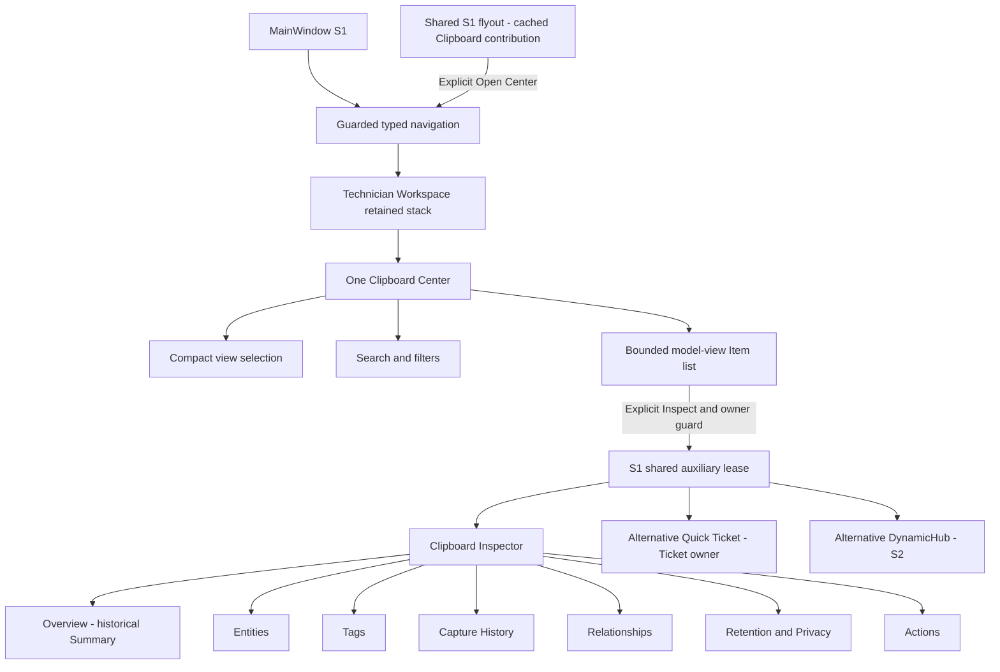
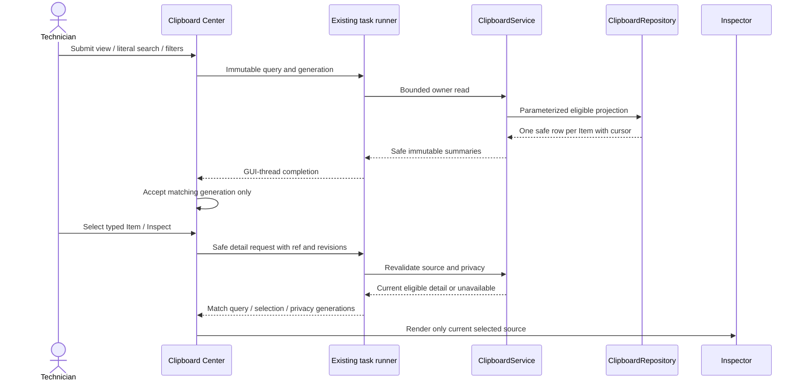
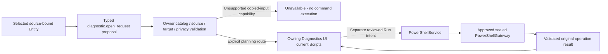
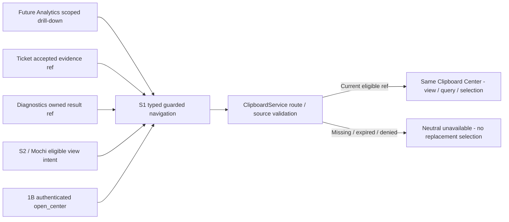
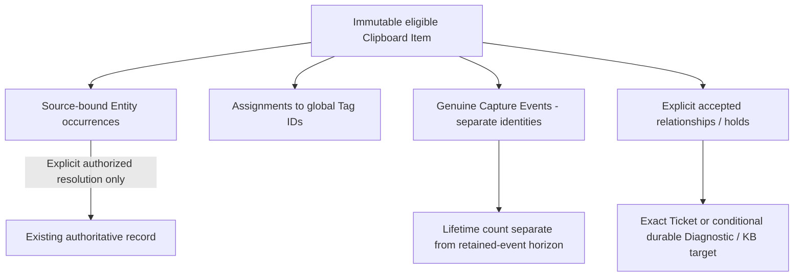
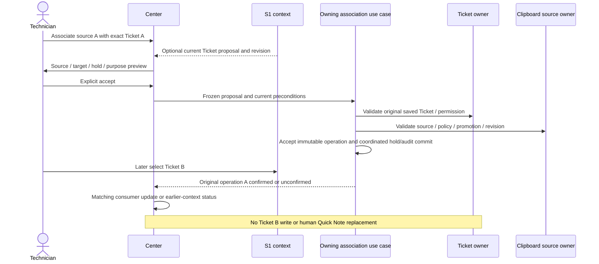
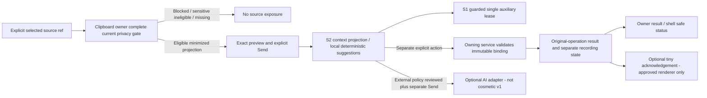

# F7Hub Phase 1C
# PySide6 Clipboard Center Architecture Planning Instructions
Existing MainWindow/workspace/navigation conventions; reusable Qt components; Clipboard Center shell integration; internal views; query semantics; search/filter model; list/read models; table columns; pagination; Inspector architecture; Entities, Tags, Capture History, Relationships, Retention/Privacy and Actions tabs; deep links; keyboard/accessibility; async loading; stale-result handling; error/empty states; large-dataset strategy; responsive layout; future Mochi-sidebar coexistence; vertical-slice implementation decomposition.

## Dependency Gate

Required approved architecture:

- Phase 0A: APPROVED
- Phase 0B: APPROVED
- Phase 0C: APPROVED
- Phase 0D: APPROVED
- Phase 0E: APPROVED
- Phase 1A: APPROVED
- Phase 1B: APPROVED
- Workspace S1 / S2: APPROVED
- Semantic Model 2A / 2B / 2C: APPROVED architecture inputs

Architecture input is distinct from runtime dependency. 2A-2C govern semantic
presentation/interpretation; opening, browsing or inspecting existing eligible
Clipboard Items requires no SemanticModel runtime engine or online service.
The reconciliation addendum below records current input provenance and gates.

If any required dependency is not approved:

RESULT = BLOCKED

Do not compensate by inventing missing architecture locally.


## GUI Ownership

Clipboard Center owns:

- Clipboard navigation
- Clipboard list presentation
- Clipboard item inspection
- Clipboard filters
- Clipboard contextual actions presentation

Clipboard Center does NOT own:

- Tag Catalog
- Ticket business logic
- Diagnostic execution
- Knowledge Base persistence
- Mochi reasoning
- PowerShell invocation
- Analytics calculations
- AHK capture

## Must remain visible

GUI
 ↓
Application Service
 ↓
Domain
 ↓
Repository
 ↓
SQLite


## Mode

`@ARCHITECT @PLAN`

GUI architecture and interaction planning only.

Do not implement production code.

Do not create PySide6 classes.

Do not create `.ui` files.

Do not modify `MainWindow`.

Do not create SQLite migrations.

Do not modify repositories or services.

Do not modify AHK integration.

Do not implement IPC.

Do not implement Diagnostics.

Do not implement Statistical Analytics.

Do not implement Mochi.

Do not perform unrelated GUI redesign.

---

# 1. Objective

Design the complete PySide6 Clipboard Center architecture for F7Hub.

The Clipboard Center must become the primary persistent operational interface for captured Clipboard intelligence.

It must allow the technician to:

```text
find
filter
inspect
understand
tag
save
pin
link
search
launch approved actions
manage retention
review privacy state
```

for Clipboard Items already processed by the Clipboard domain.

This phase must define the complete GUI architecture without reimplementing Clipboard business rules inside PySide6.

---

# 2. Required Foundation Inputs

Before planning the GUI, read the approved outputs from:

```text
Phase 0A
Master Foundation Architecture

Phase 0B
Global JSON / Interoperability Contract

Phase 0C
Classification / Taxonomy / Entities / Tags

Phase 0D
Settings / Configuration Architecture

Phase 1A
Clipboard Domain & Data Lifecycle

Phase 1B
AHK ↔ Python Clipboard Capture / IPC / Quick HUD

Phase 0E
Foundation Architecture Reconciliation

Workspace S1 / S2
Shell / Technician Workspace / DynamicHub Context Actions

Semantic Model 2A / 2B / 2C
Foundation / Troubleshooting Concepts and Relationships / Lexical Model
```

These plans establish:

```text
domain semantics
contract semantics
taxonomy
retention
privacy
settings
AHK responsibilities
transport boundary
```

Phase 1C must not redefine them silently.

---

# 3. Mandatory Existing GUI Inspection

Inspect the current PySide6 F7Hub implementation before recommending the Clipboard GUI.

At minimum inspect:

```text
MainWindow
navigation
toolbars
menus
workspace layout
ticket workspace
Knowledge Base workspace
dialog conventions
table models
proxy models
selection behavior
async/background-loading patterns
error presentation
retry behavior
empty states
keyboard shortcuts
status bar
theme
icons
spacing
font usage
window geometry
DPI handling
testing conventions
```

Identify reusable components.

Use:

```text
SEARCH
  ↓
IDENTIFY
  ↓
REUSE / EXTEND
  ↓
CREATE ONLY IF NECESSARY
```

Do not introduce an independent Clipboard visual framework if F7Hub already has usable patterns.

---

# 4. Current State Classification

For every relevant GUI capability classify it as:

```text
FACT
ASSUMPTION
INFERENCE
RECOMMENDATION
NOT VERIFIED
```

Do not invent current widgets, services, models, or navigation APIs.

---

# 5. Clipboard Center Responsibility

Clipboard Center should answer:

```text
What have I captured?

What kind of information is it?

What Entities were detected?

What Tags apply?

Where did it come from?

How often was it captured?

What is it linked to?

How long will it remain?

What safe actions are available?
```

---

# 6. Clipboard Center Must Not Become

Clipboard Center must not become:

```text
a second Statistical Analytics dashboard
a PowerShell console
a ticket editor
a Knowledge Base editor
a diagnostic implementation layer
a Mochi conversation engine
an AHK configuration screen
```

It may navigate to or invoke those systems through approved services.

---

# 7. Main Workspace Concept

Preferred high-level composition:

```text
┌──────────────────────────────────────────────────────────────┐
│ Toolbar                                                      │
├───────────────┬─────────────────────────────┬────────────────┤
│ Navigation    │ Clipboard Items             │ Inspector      │
│ / Views       │                             │                │
│               │ Search + Filters            │ Summary        │
│ Recent        │                             │ Entities       │
│ Saved         │ Table                       │ Tags           │
│ Pinned        │                             │ History        │
│ URLs          │                             │ Relationships  │
│ Commands      │                             │ Retention      │
│ Errors        │                             │ Actions        │
│ Networking    │                             │                │
├───────────────┴─────────────────────────────┴────────────────┤
│ Status / result summary                                      │
└──────────────────────────────────────────────────────────────┘
```

The plan must validate this against current F7Hub GUI architecture.

---

# 8. Three-Pane Model

Evaluate a three-pane model:

```text
LEFT
Navigation / saved views

CENTER
Clipboard operational list

RIGHT
Selected-item inspector
```

Benefits:

```text
high information density
fast keyboard workflow
persistent context
minimal dialog hopping
consistent technician workflow
```

---

# 9. Responsive Collapse

The design must support smaller application widths.

Potential behavior:

```text
Wide
Left + Center + Inspector

Medium
Center + Inspector
Navigation collapsible

Narrow
Center
Inspector opens drawer/panel
```

Exact breakpoints must follow current F7Hub resizing conventions.

---

# 10. Navigation Views

Proposed primary views:

```text
Recent
Saved
Pinned
URLs
Commands
PowerShell
Errors & Logs
Networking
Ticket Evidence
Diagnostic Evidence
Mixed Content
```

These are primarily filtered views.

They must not represent duplicate storage tables.

---

# 11. Recent

Default operational view.

Potential semantics:

```text
active Clipboard Items
sorted by most recent capture
```

Exact retention and state definitions come from Phase 1A.

---

# 12. Saved

Shows items explicitly preserved by the user.

Do not interpret every Ticket-linked item as manually Saved unless Phase 1A defines that behavior.

---

# 13. Pinned

Shows items with:

```text
is_pinned = true
```

or the approved equivalent.

Pinning is a presentation/importance dimension, not necessarily a separate persistence model.

---

# 14. URLs

Filter based on canonical Kind / Entity taxonomy.

Potential:

```text
primary_kind = url
OR
contains URL entity
```

The plan must decide exact query semantics.

---

# 15. Commands

Potential filter for:

```text
PowerShell commands
CMD commands
other recognized command lines
```

Do not conflate Commands and approved Scripts.

---

# 16. PowerShell View

Potential:

```text
PowerShell Kind
OR
PowerShell Tag
OR
PowerShell-specific Entities
```

Use canonical taxonomy rather than raw string matching.

---

# 17. Errors & Logs

Potential:

```text
error Kind
log Kind
error-code Entity
event Entity
```

Exact semantics must be documented.

---

# 18. Networking

Potential:

```text
Networking Tag
OR
network Entity Types
```

Examples:

```text
IPv4
IPv6
CIDR
MAC
FQDN
domain
port
```

---

# 19. Ticket Evidence

Shows Clipboard Items with explicit Ticket relationships.

Do not infer evidence merely because text contains a ticket number.

---

# 20. Diagnostic Evidence

Shows Clipboard Items explicitly related to Diagnostic Sessions.

---

# 21. Mixed Content

Items whose primary Kind is:

```text
mixed_text
```

or approved equivalent.

Useful for complex copied troubleshooting notes.

---

# 22. Smart Filters

Consider secondary smart filters:

```text
Sensitive
Large Items
Unlinked
This Week
Recently Used
Duplicate-heavy
```

Only include filters with operational value.

Avoid visual clutter.

---

# 23. Navigation Counts

Evaluate optional counts:

```text
Recent            836
Pinned             14
URLs               92
Ticket Evidence    47
```

Counts must be efficient.

Do not execute expensive full-table counts every repaint.

---

# 24. Navigation Selection

Selecting a view should update:

```text
filter state
table query
status text
```

without losing unrelated selected context unnecessarily.

---

# 25. Toolbar

Recommended top-level actions:

```text
Capture
Save
Pin
Delete
Attach to Ticket
Search KB
Run Diagnostic
Ask Mochi
```

Do not expose actions that are not implemented by their owning subsystem.

Unavailable future actions should not appear as fake working controls.

---

# 26. Capture Button

Potential behavior:

```text
Process current Windows Clipboard
```

through the same Clipboard application service as AHK capture.

Do not duplicate processing logic inside PySide6.

---

# 27. Save

Explicitly preserves the selected Clipboard Item according to Phase 1A retention semantics.

---

# 28. Pin

Toggles selected item's pinned state.

The plan should define:

```text
single-selection behavior
multi-selection behavior
visual feedback
```

---

# 29. Delete

Delete semantics must follow Phase 1A.

The GUI must clearly differentiate:

```text
remove temporary item
unlink evidence
delete preserved item
```

when behavior differs.

---

# 30. Attach to Ticket

Must invoke the approved Ticket relationship workflow.

The GUI must not write relationship rows directly.

---

# 31. Search KB

Should derive a meaningful search query from:

```text
selected item
selected entity
selected error
selected tags
```

depending on context.

---

# 32. Run Diagnostic

Must route through DiagnosticService.

Clipboard Center only supplies validated context.

---

# 33. Ask Mochi

Future behavior should route selected-item context through the approved ContextService.

The Clipboard Center should not build its own conversational prompt.

---

# 34. Toolbar Context Sensitivity

Actions should enable/disable according to selection.

Example:

```text
Nothing selected
Save              disabled
Pin               disabled
Attach to Ticket  disabled

IPv4 selected
Run Diagnostic    enabled
Search KB         enabled
```

Disabled states should include useful tooltip explanations where appropriate.

---

# 35. Global Search Field

Clipboard Center should have fast search.

Potential search domains:

```text
content
preview
Tags
Entities
source application
relationships
```

Search architecture should reuse existing F7Hub search conventions where possible.

---

# 36. Search Semantics

Evaluate:

```text
free-text search
structured filters
combined search
```

Example:

```text
0x80070005
```

may match:

```text
content
Error Code Entity
```

---

# 37. Search Should Not Replace Structured Filters

Use:

```text
text search
+
Type filter
+
Application filter
+
Sensitivity filter
+
Relationship filter
+
Date filter
```

rather than forcing everything into one query language initially.

---

# 38. Filter Bar

Recommended filters:

```text
Kind / Type
Source Application
Sensitivity
Relationship
Date Range
Tag
Entity Type
```

Avoid exposing all advanced filters simultaneously if space becomes crowded.

---

# 39. Filter Chips

Applied filters may appear as removable chips:

```text
[PowerShell ×]
[Last 7 Days ×]
[Unlinked ×]
```

Evaluate consistency with existing F7Hub UI.

---

# 40. Clear Filters

Provide one clear action:

```text
Clear Filters
```

to return to current navigation view defaults.

---

# 41. Filter Persistence

Decide whether filter selections survive:

```text
view changes
module changes
application restart
```

Recommended initial behavior:

```text
session-local
```

unless Settings architecture indicates otherwise.

---

# 42. Center Table

Clipboard Center's operational table should be optimized for scanning.

Candidate columns:

```text
Time
Preview
Kind
Entities
Tags
Source
Seen
Linked
Pinned
```

The plan must recommend final default columns.

---

# 43. Time Column

Likely:

```text
last_seen_at
```

for the Recent view.

Tooltip/detail may show:

```text
first_seen
last_seen
```

---

# 44. Preview Column

Display a short one-line or two-line preview.

Must:

```text
truncate safely
support Unicode
avoid exposing secret content
```

Sensitive items may show:

```text
[Redacted]
```

instead.

---

# 45. Kind Column

Show canonical display name:

```text
PowerShell Command
URL
Mixed Text
Error Message
```

not raw internal key unless developer mode.

---

# 46. Entities Column

Do not render all Entities inline.

Potential:

```text
6
```

or:

```text
IPv4 +5
```

with detailed inspection in Inspector.

---

# 47. Tags Column

Potentially show:

```text
DNS · PowerShell +2
```

or small chips.

Avoid excessively widening the table.

---

# 48. Source Column

Potential:

```text
PowerShell
Outlook
Edge
Notepad
```

Source display must respect privacy decisions from Phase 1B.

---

# 49. Seen Column

Represents capture frequency.

Example:

```text
8×
```

If count is derived rather than persisted, model design must remain efficient.

---

# 50. Linked Column

Potential summary:

```text
Ticket
Diagnostic
KB
2 links
```

Avoid listing full relationships in the table.

---

# 51. Pinned Column

Use a compact icon or boolean marker.

Must be keyboard-accessible.

---

# 52. Hidden / Optional Columns

Potential optional columns:

```text
Sensitivity
Size
First Seen
Last Seen
Retention
```

Do not make the default table too wide.

---

# 53. Column Configuration

Evaluate whether users should be able to:

```text
show/hide columns
resize columns
reorder columns
```

If existing F7Hub tables support this, reuse it.

Otherwise defer customizable layout until needed.

---

# 54. Table Model Architecture

Prefer Qt model/view architecture.

Potential:

```text
QTableView
+
custom QAbstractTableModel
+
QSortFilterProxyModel
```

or existing project equivalents.

Do not populate large datasets using ad-hoc widget-per-row approaches.

---

# 55. Repository Pagination

If Clipboard history may become large, avoid loading all items at startup.

Evaluate:

```text
database pagination
incremental loading
query limits
```

rather than only client-side filtering.

---

# 56. Sorting

Common sorting:

```text
Last Seen
First Seen
Kind
Source
Capture Count
```

Default:

```text
Last Seen descending
```

for Recent.

---

# 57. Stable Selection

When rows refresh, preserve selection by:

```text
clipboard_item_id
```

not row number.

---

# 58. Refresh Behavior

After:

```text
new capture
tag update
pin
link
retention change
```

refresh affected data without unnecessarily resetting:

```text
scroll
filters
selection
inspector tab
```

---

# 59. Auto-Refresh

If AHK captures new content while Clipboard Center is open, evaluate:

```text
automatic update
```

through existing application signals/events.

Do not use aggressive polling.

---

# 60. New Item Visibility

If current view includes the new item:

```text
insert/update row
```

without forcibly stealing current selection.

Potential subtle indication:

```text
New item captured
```

---

# 61. Table Row Selection

Recommended:

```text
single selection
```

for initial Clipboard inspection.

Evaluate whether multi-select is genuinely needed for:

```text
bulk delete
bulk tag
bulk save
```

Do not add complexity prematurely.

---

# 62. Multi-Select

Likely defer until:

```text
bulk workflows
```

have concrete requirements.

---

# 63. Double Click

Potential behavior:

```text
open/focus Inspector
```

or:

```text
open detailed item dialog
```

Prefer keeping inspection in the right panel.

---

# 64. Enter Key

With row selected:

```text
Enter
→ focus/open Inspector
```

or primary item action.

Define consistently.

---

# 65. Context Menu

Right-click row may expose:

```text
Save
Pin
Attach to Ticket
Run Diagnostic
Search KB
Copy
Delete
```

Only show valid actions.

Do not duplicate every toolbar action mechanically if menu becomes too large.

---

# 66. Inspector Purpose

The Inspector provides full operational details for one selected Clipboard Item.

Recommended tabs:

```text
Summary
Entities
Tags
Capture History
Relationships
Retention & Privacy
Actions
```

Potential optional:

```text
Raw
```

only if needed.

---

# 67. Summary Tab

Show:

```text
content preview
primary Kind
source
first seen
last seen
capture count
size
sensitivity
retention
saved/pinned state
```

Avoid overwhelming detail.

---

# 68. Full Content

The Summary or dedicated content area should allow:

```text
view full text
select text
copy text
```

subject to privacy restrictions.

Do not make raw content editable by default.

---

# 69. Content Viewer

Prefer:

```text
read-only text widget
```

with:

```text
monospace option for technical content
line wrapping
find within content
```

where justified.

---

# 70. Syntax Highlighting

Potential future highlighting for:

```text
JSON
PowerShell
logs
```

but do not require it for initial implementation.

Entity highlighting is more important.

---

# 71. Entity Highlighting

The content viewer should eventually highlight detected Entity ranges.

Example:

```text
john@contoso.com
PC-1042
10.0.0.87
0x80070005
```

Use offsets defined in Phase 1A.

---

# 72. Overlapping Entities

The GUI architecture must anticipate overlapping Entity occurrences.

Example:

```text
https://10.0.0.87:443
```

contains:

```text
URL
IPv4
Port
```

Do not assume every character can have only one Entity classification.

---

# 73. Entity Highlight Interaction

Clicking highlighted Entity could:

```text
select Entity in Entities tab
```

or open context actions.

Avoid hidden hover-only functionality.

---

# 74. Entities Tab

Display structured Entity occurrences.

Candidate columns/cards:

```text
Type
Raw Value
Normalized Value
Confidence
Provenance
Occurrence Count
```

Do not expose internal metadata unnecessarily.

---

# 75. Entity Actions

Context-sensitive actions:

### IPv4

```text
Ping
DNS Lookup
Search Tickets
Run Network Diagnostic
```

### Error Code

```text
Search Tickets
Search KB
Run relevant diagnostic
```

### Ticket ID

```text
Open Ticket
Link Item
```

### PowerShell Command

```text
Search Script Registry
Save Snippet
Search KB
```

---

# 76. Entities Are Not Editable Taxonomy

Users may correct a detection later if designed, but the Entities tab should not become Entity Type administration.

Entity Type meaning belongs to taxonomy/domain architecture under 0C and its
owning domains. Clipboard Center consumes approved definitions; Settings may
govern supported presentation/preferences under 0D, but does not own semantic
truth. This tab is not Entity Type administration or a new Entity catalog.

---

# 77. Tags Tab

Show assigned Tags with provenance.

Example:

```text
PowerShell
RULE

Networking
RULE

DNS
Technician assignment
```

Potential visual distinction:

```text
manual
automatic
suggested
```

without relying only on color.

Assigned and suggested Tags are separate sections/states. SYSTEM versus USER
is catalog stewardship, not the detection method or assignment actor. Show
origin/method and acceptance separately where supplied by the owner.

---

# 78. Add Tag

Reuse the global Tag Selector architecture from Phase 0C.

Potential:

```text
[PowerShell ×]
[DNS ×]

+ Add Tag
```

---

# 79. Suggested Tags

Potential section:

```text
Suggested
+ Networking
+ Troubleshooting
```

Only if Tag suggestion infrastructure exists.

Do not fake AI suggestions. Detection, RULE/AI suggestions and lexical matches
do not assign Tags. Explicit owner-authorized assignment validates existing
global identity, eligibility and current target; acceptance retains origin.

---

# 80. Remove Tag

Manual/user-removable Tags may support:

```text
×
```

System-required classifications may be protected according to taxonomy rules.

---

# 81. Tag Management Link

Potential:

```text
Manage Tags…
```

may navigate to the owning global Tag administration surface when delivered.
The exact future route is not established here. A Settings navigation entry,
if later approved, would not transfer taxonomy meaning to Settings. Until the
owner surface exists, report unavailable; do not build duplicate management.

---

# 82. Capture History Tab

Show Capture Events.

Candidate fields:

```text
Captured At
Source Application
Capture Method
Source Context
```

Potential:

```text
14:31 PowerShell   Manual
14:42 PowerShell   Manual
15:05 Outlook      Manual
```

---

# 83. Capture History Privacy

Window titles and source metadata should obey Phase 1B privacy policy.

Potential:

```text
redacted
truncated
not persisted
```

must display accordingly.

---

# 84. Capture Event Pagination

A repeatedly copied item may have many events.

Do not render thousands of capture events in one widget.

Use:

```text
limited recent events
Load More
pagination
```

if needed.

---

# 85. Relationships Tab

Show explicit relationships.

Potential sections:

```text
Tickets
Diagnostics
Knowledge Base
Scripts
Automation
```

Only display relationship types actually implemented.

---

# 86. Ticket Relationship

Example:

```text
Ticket #41872
EVIDENCE_FOR
Outlook cannot send
```

Possible actions:

```text
Open Ticket
Unlink
View relationship details
```

based on permissions/retention semantics.

---

# 87. Diagnostic Relationship

Example:

```text
Diagnostic Session #55
INPUT_TO

Network Diagnostic
WARNING
```

Possible:

```text
Open Diagnostic
```

---

# 88. KB Relationship

Example:

```text
KB-NET-014
RELATED_TO
DNS Troubleshooting
```

or:

```text
SOURCE_FOR
Draft #17
```

Use labels supplied by the relationship owner: 0C shared principles/common
predicates, 2B typed troubleshooting profiles and eligible 2C lexical wording
where applicable. Show only available owner-created/accepted links with
compatible endpoint types; the nine 2B predicates are not generic Item links.

---

# 89. Relationship Creation

Clipboard Center may provide:

```text
Attach to Ticket
Create KB Draft
```

through services.

Creation/removal is only through an explicitly authorized owning workflow
with its endpoint, acceptance, privacy and lifecycle checks. Merely displaying
a predicate grants no creation authority; no generic graph editor is implied.

---

# 90. Retention & Privacy Tab

Show:

```text
Sensitivity
Retention state
Expiration
Saved
Pinned
Evidence preservation
Content size
Privacy restrictions
```

This tab should explain *why* an item is retained.

---

# 91. Retention Explanation

Example:

```text
Temporary item

Scheduled expiry:
Oct 7, 2026

Preserved because:
Linked to Ticket #41872
```

This makes retention behavior understandable.

---

# 92. Save Action

Potential:

```text
Save Item
```

should visibly update:

```text
retention state
status
toolbar
navigation counts
```

---

# 93. Pin Action

Potential:

```text
Pin
Unpin
```

with immediate feedback.

---

# 94. Expiry

If item is eligible for automatic cleanup:

```text
Expires in 18 hours
```

may be useful.

Avoid countdown timers continuously repainting the UI.

Display coarse relative time.

---

# 95. Sensitive Content

If content is:

```text
SECRET_POSSIBLE
BLOCKED
```

the GUI may display:

```text
Sensitive content was not persisted.
```

rather than raw value.

---

# 96. Privacy Override

If architecture permits manual override:

```text
Save Anyway
```

must require deliberate confirmation and audit.

Do not assume such override should exist.

Phase 1A decision is authoritative.

---

# 97. Actions Tab

Actions should be generated from:

```text
Kind
Entities
Tags
Relationships
available subsystem capabilities
```

not hard-coded solely by GUI.

---

# 98. Candidate Actions

Potential:

```text
Ping IP
DNS Lookup
Search Tickets
Search KB
Run Diagnostic
Save Snippet
Attach as Evidence
Create KB Draft
Ask Mochi
```

Only expose actions supported by actual services.

---

# 99. Action Availability

Example:

```text
IPv4 detected
→ Ping / DNS Lookup available

Error Code detected
→ Search KB available

No ticket selected
→ Attach to Active Ticket unavailable
```

---

# 100. Primary Action

The GUI may emphasize one recommended safe action.

Example:

```text
Run DNS Diagnostic
```

but should not execute it automatically.

---

# 101. Action Confirmation

Potentially low-risk:

```text
Search KB
Open Ticket
```

may not need confirmation.

Potentially state-changing:

```text
Create KB Draft
Attach Evidence
Delete
```

may need explicit action/confirmation.

Diagnostics should follow Diagnostic architecture.

---

# 102. No Arbitrary Command Execution

Clipboard Center must never expose:

```text
Run copied command
```

as a generic unrestricted action.

Copied commands remain untrusted.

---

# 103. Clipboard Copy Actions

Allow:

```text
Copy raw text
Copy normalized text
Copy Entity value
```

where safe.

Do not replace Windows Clipboard automatically unless user chooses the action.

---

# 104. Keyboard Shortcuts

Plan an initial shortcut map.

Potential:

```text
Ctrl+F
Focus Clipboard search

Ctrl+P
Pin / Unpin selected item

Ctrl+S
Save selected item

Ctrl+L
Link selected item to Ticket

Delete
Delete selected item

Enter
Inspect selected item

Ctrl+M
Ask Mochi

Escape
Close secondary interaction / clear focus
```

Must be checked against existing F7Hub shortcuts.

---

# 105. Global vs Module Shortcut

Clipboard Center shortcuts should usually apply only when:

```text
Clipboard Center has focus
```

Do not register these as global AHK hotkeys.

Global hotkeys belong to Phase 1B.

---

# 106. Shortcut Discoverability

Expose shortcuts via:

```text
tooltips
menus
context menu
optional shortcut legend
```

Do not make essential functionality keyboard-secret.

---

# 107. Keyboard Navigation

Technician should be able to:

```text
focus search
move through rows
open Inspector
move between Inspector tabs
activate actions
return to table
```

without a mouse.

---

# 108. Accessibility

Plan:

```text
accessible names
logical tab order
visible focus
non-color-only states
keyboard activation
tooltips
readable contrast
```

Follow Qt accessibility conventions.

---

# 109. Empty State

Example:

```text
No Clipboard items yet.

Use Ctrl+Alt+C to send the current Clipboard
to F7Hub.
```

Only mention the actual approved hotkey.

Potential button:

```text
Capture Current Clipboard
```

---

# 110. Filter Empty State

Different from no-data state.

Example:

```text
No Clipboard items match these filters.

[Clear Filters]
```

---

# 111. Loading State

Loading should not block the entire application.

Potential:

```text
skeleton/placeholder
progress indicator
disabled list
```

Reuse existing F7Hub conventions.

---

# 112. Error State

Example:

```text
Clipboard history could not be loaded.

[Retry]
```

The draft/filter state should remain where possible.

---

# 113. Independent Retry

If:

```text
Items load
Tags fail
```

avoid blocking the entire Clipboard Center.

Use independent recoverable components where appropriate.

This follows the successful pattern used elsewhere in F7Hub.

---

# 114. Refresh

Provide explicit:

```text
Refresh
```

only if auto-refresh is insufficient.

Do not rely on constant polling.

---

# 115. Background Queries

Potential heavier operations:

```text
FTS search
relationship counts
large history
```

should not freeze the GUI.

Reuse existing async worker infrastructure if available.

---

# 116. Stale Results

If search/filter query changes while background work is running:

```text
discard stale result
```

rather than replacing newer UI state.

---

# 117. Retry Loop Guard

Explicit rule:

```text
No automatic infinite retries.
```

A failed GUI load may:

```text
retry once automatically if transient
```

only if established project conventions support it.

Otherwise expose:

```text
Retry
```

to user.

---

# 118. Search Debounce

For text search, evaluate a short debounce.

Example target:

```text
150 to 300 ms
```

Avoid SQL/FTS query on every keystroke instantaneously if unnecessary.

Exact value can be implementation-specific.

---

# 119. Database Query Responsibility

GUI should request data through:

```text
ClipboardService / Query Service
```

or approved architecture.

No SQL inside widgets.

---

# 120. Read Models

Evaluate whether Clipboard Center needs GUI-specific read models.

Example:

```text
ClipboardListItem
ClipboardInspectorDetail
CaptureHistoryEntry
RelationshipSummary
```

These may improve separation from domain entities.

Do not create DTO proliferation without need.

---

# 121. List Query

Potential conceptual request:

```text
ClipboardListQuery
  view
  search
  filters
  sort
  page
  page_size
```

This allows efficient database-backed lists.

---

# 122. Pagination

Potential:

```text
50
100
```

items per page or incremental chunk.

Recommend based on existing F7Hub table conventions.

---

# 123. Infinite Scroll

Do not introduce infinite scroll if F7Hub already uses explicit pagination.

Consistency matters more than novelty.

---

# 124. Selection Detail Loading

List result should not need to carry:

```text
full raw content
all entities
all events
all relationships
```

for every row.

Potential:

```text
list summary query
```

then:

```text
selected-item detail query
```

This is more scalable.

---

# 125. Inspector Lazy Loading

Potentially load:

```text
Capture History
Relationships
```

when corresponding tab is first opened.

Evaluate complexity vs actual expected data size.

---

# 126. Search Result Highlighting

Search matches may highlight:

```text
matching preview text
matching Entity
matching Tag
```

but avoid expensive rich rendering initially.

---

# 127. FTS Search Result Context

If FTS returns a snippet:

```text
use it as temporary search-result preview
```

without overwriting stored `preview_text`.

---

# 128. Tag Filtering

Tag selector should query canonical Tag Catalog.

Filtering selects existing eligible canonical Tag IDs; it cannot create or
assign free-text Tags. Any future USER Tag creation belongs to the separately
authorized global Tag workflow, outside this filter. Suggestions are not
assigned-Tag filter matches.

---

# 129. Entity Type Filter

Potential:

```text
IPv4
Error Code
URL
PowerShell Command
```

from approved 0C/owning-domain Entity Type definitions. Matching a source-bound
occurrence or type label does not resolve a canonical concrete Entity.

---

# 130. Entity Value Filter

Potential advanced filter:

```text
Entity Type = IPv4
Value = 10.0.0.87
```

Likely useful for investigation.

May be deferred from MVP GUI.

---

# 131. Source Application Filter

Source applications should be derived from stored capture metadata.

Avoid requiring a separate global application taxonomy initially.

---

# 132. Date Filter

Potential presets:

```text
Today
Last 7 Days
Last 30 Days
Custom
```

Use local display while preserving canonical timestamp semantics.

---

# 133. Sensitivity Filter

Potential:

```text
Normal
Personal
Confidential
Sensitive/Blocked
```

Use Phase 1A canonical vocabulary.

---

# 134. Relationship Filter

Potential:

```text
Any
Linked
Unlinked
Ticket
Diagnostic
KB
```

---

# 135. Saved / Pinned Filter

These may remain navigation views rather than filter controls to reduce duplication.

---

# 136. Filter State Model

Recommend one central immutable or explicit state representation.

Conceptually:

```text
ClipboardViewState
```

containing:

```text
view
search
filters
sort
page
selected_item_id
```

Exact implementation follows current PySide6 architecture.

---

# 137. Navigation State

When user leaves Clipboard Center and returns, evaluate preserving:

```text
current view
filters
search
selected item
```

for the current application session.

This would improve workflow continuity.

---

# 138. Deep Linking

Other modules may navigate into Clipboard Center with context.

Examples:

```text
Open Clipboard Item #901

Open Clipboard Center filtered by:
Tag = DNS

Open Ticket Evidence for Ticket #41872
```

Plan navigation parameters.

---

# 139. Analytics Drill-Down

Future Statistical Analytics should be able to open:

```text
Clipboard Center
with filters already applied
```

Example:

```text
Tag = PowerShell
Date = Last 30 Days
```

Clipboard Center remains the source/detail presentation surface. Evidence
status requires an explicit scoped Claim/use association accepted by its
owning workflow; a drill-down does not make Clipboard Center that authority.

---

# 140. Mochi Deep Link

Mochi may say:

```text
I found 8 related Clipboard Items.
```

Action:

```text
View Items
```

should open Clipboard Center with the appropriate filter/query.

---

# 141. Ticket Deep Link

Ticket workspace could open:

```text
Clipboard Center
Ticket Evidence
ticket_id = 41872
```

---

# 142. Diagnostic Deep Link

Diagnostic Center could open:

```text
Clipboard Center
Diagnostic Evidence
diagnostic_session_id = 55
```

---

# 143. Navigation Contract

Use existing application navigation mechanisms.

Do not implement module-to-module widget coupling.

Avoid:

```text
TicketWidget directly manipulating ClipboardWidget
```

Prefer:

```text
NavigationService / MainWindow routing
```

or current equivalent.

---

# 144. Status Bar

Clipboard module may expose concise status:

```text
Items: 836
View: Recent
Selected: 1
Search indexed
```

Avoid showing too many transient metrics.

---

# 145. Capture Notification

When AHK captures while Clipboard Center is visible:

```text
New Clipboard item captured
```

may appear briefly in status.

No modal dialog.

---

# 146. Duplicate Capture Feedback

If item already exists:

```text
Existing item updated
Seen 9 times
```

could be surfaced unobtrusively.

---

# 147. Delete Confirmation

Potential rules:

### Temporary unlinked item

```text
simple confirmation or immediate delete
```

depending on project convention.

### Saved / pinned item

```text
confirmation
```

### Evidence-linked item

```text
stronger explanation
```

Example:

```text
This item is linked to Ticket #41872.
Remove the relationship first?
```

Final behavior must follow Phase 1A.

---

# 148. Undo

Evaluate whether immediate Delete needs Undo.

Potential value:

```text
accidental user deletion
```

Potential issue:

```text
privacy-sensitive content should disappear immediately
```

Do not add soft-delete/Undo if domain architecture rejected it.

---

# 149. Export

Clipboard export should be deferred unless requirement exists.

Potential risks:

```text
sensitive content
customer data
large histories
```

Do not create CSV export automatically just because Analytics exists.

---

# 150. Drag and Drop

Likely not required in MVP.

Do not add drag-to-ticket or drag-to-KB until explicit workflow benefits are proven.

---

# 151. Visual Language

Clipboard Center should reuse:

```text
F7Hub spacing
buttons
toolbar patterns
table styling
dialog styling
icons
theme
status colors
```

Do not create an isolated neon Clipboard application inside F7Hub.

---

# 152. Semantic Color

Use color carefully for:

```text
warning
error
selected
sensitive
```

Do not encode Kind solely by color.

---

# 153. Tag Chips

Tags may use restrained chips.

Avoid assigning arbitrary permanent colors to hundreds of Tags unless taxonomy architecture defines them.

---

# 154. Entity Chips

Likewise:

```text
IPv4
ERROR CODE
URL
```

can use consistent visual tokens.

Avoid rainbow overload.

---

# 155. Sensitive Indicator

Use:

```text
icon + text
```

not red alone.

Example:

```text
🔒 Confidential
```

according to actual icon conventions.

---

# 156. Tooltips

Useful for:

```text
truncated preview
disabled action
retention explanation
source application
tag provenance
```

Do not hide essential information only in tooltips.

---

# 157. Contextual Action Density

Limit the main Inspector to a small set of highest-value actions.

Potential:

```text
4 to 8
```

depending on context.

Additional actions may live in:

```text
More…
```

if necessary.

---

# 158. Action Ranking

Potential prioritization:

```text
1. highly relevant deterministic action
2. search/investigation action
3. relationship action
4. assistant action
```

Do not use opaque AI ranking initially.

---

# 159. Action Provenance

If an action is suggested because of an Entity:

```text
Ping
Because IPv4 10.0.0.87 was detected
```

may improve explainability.

---

# 160. No Auto-Execution

The UI must never automatically execute technical actions merely because an Entity is selected.

All execution requires user action.

---

# 161. Clipboard Center + Right Mochi Sidebar

If F7Hub later has a global Mochi sidebar:

```text
Clipboard Center Inspector
```

must not become a duplicate assistant sidebar.

Potential layout:

```text
Main Navigation
Clipboard Workspace
Clipboard Inspector
Global Mochi Sidebar
```

Four columns may be too dense.

Phase 1C should note that when Mochi sidebar is introduced, the Clipboard Inspector may need responsive/collapsible behavior.

Do not redesign Mochi here.

---

# 162. Inspector Collapse

Consider:

```text
Ctrl+I
```

or toolbar toggle to collapse Inspector.

Exact shortcut should be checked globally.

This may help future Mochi-sidebar coexistence.

---

# 163. Persistence of Panel Sizes

Consider preserving:

```text
navigation width
inspector width
```

in UI settings if current F7Hub does this.

Do not make it required for MVP.

---

# 164. Large Dataset Target

Plan usability for at least:

```text
10,000 Clipboard Items
100,000 Capture Events
```

without loading all records.

These are planning targets, not measured claims.

---

# 165. Table Performance

Avoid:

```text
one QWidget per table cell
```

where model/delegate rendering can suffice.

Use Qt's model/view system.

---

# 166. Inspector Performance

Only selected item should load full content.

Do not pre-load all raw Clipboard contents into memory.

---

# 167. Search Performance

Plan indexes/FTS capable of interactive search.

Performance goals should be measurable later.

Candidate UX target:

```text
common filtered query < 250 ms
```

subject to dataset/test environment.

---

# 168. Entity Highlight Performance

For huge content:

```text
do not highlight thousands of Entities synchronously
```

Potential:

```text
limit highlights
lazy render
large-content mode
```

---

# 169. Large Item UX

For large content:

```text
show preview first

[Load Full Content]
```

if Phase 1A permits persisted full content.

Avoid freezing UI.

---

# 170. Read-Only Content Safety

Use a read-only viewer that does not accidentally mutate Clipboard Item content.

If future editing is desired, create a separate explicit transformation workflow.

---

# 171. Copy Selection

Standard:

```text
Ctrl+C
```

inside read-only content viewer should preserve normal copy behavior.

Do not globally hijack it.

---

# 172. Global Clipboard Capture Shortcut

Phase 1B owns:

```text
Ctrl+Alt+C
```

or final chosen hotkey.

Phase 1C should only display/help document the current configured binding.

---

# 173. Search Shortcut

`Ctrl+F` within Clipboard Center should focus local Clipboard search.

This is consistent with standard desktop expectations, subject to existing F7Hub behavior.

---

# 174. Delete Shortcut

`Delete` should only act when Clipboard table/Inspector selection context is appropriate.

It must not trigger while typing in:

```text
search
tag input
other editable fields
```

---

# 175. Escape Behavior

Potential priority:

```text
close popup
clear context menu
cancel inline editing
return focus
```

Avoid Escape unexpectedly closing the entire F7Hub application.

---

# 176. Focus Management

After:

```text
save
pin
tag assignment
link
```

preserve selected item and sensible focus.

Do not force mouse re-navigation.

---

# 177. Dialog Usage

Prefer inline panels for lightweight tasks.

Dialogs may be appropriate for:

```text
Attach to Ticket
Delete evidence confirmation
Manage retention override
```

Reuse existing F7Hub dialogs when possible.

---

# 178. Attach to Ticket Dialog

Potential content:

```text
Search Ticket
Recent Tickets
Current Ticket
relationship note optional
```

But TicketService owns validation.

Do not implement full ticket search inside Clipboard module if reusable selector exists.

---

# 179. Tag Selector Popup

Reuse global TagSelector.

Do not create Clipboard-only Tag management.

---

# 180. Diagnostic Selector

If multiple Diagnostics apply:

```text
Run Diagnostic…
```

may open a chooser.

If exactly one obvious approved diagnostic applies:

```text
Run DNS Diagnostic
```

could be direct.

Final behavior belongs partly to Diagnostic architecture.

---

# 181. Search KB Action

Potential flow:

```text
selected Entity/Tag
   ↓
Knowledge Search
   ↓
KB results
```

Clipboard Center should not embed an entire duplicate KB browser unless current F7Hub architecture supports integrated results.

---

# 182. Create KB Draft

Potential future action.

Must create:

```text
DRAFT
```

through KB service.

Never auto-publish.

---

# 183. Save Snippet

If F7Hub has a Snippet/Hotstring feature:

```text
Save Snippet
```

must route through that subsystem.

Do not duplicate snippet storage in Clipboard tables.

---

# 184. Copy Normalized Value

For certain Entities:

```text
email
IPv4
GUID
MAC
```

copy normalized representation may be useful.

Make it explicit.

---

# 185. Context Menu on Entity

Possible:

```text
Copy
Copy Normalized
Search Tickets
Search KB
Run Diagnostic
Add Tag
```

depending on Entity Type.

---

# 186. Context Menu on Tag

Potential:

```text
Filter by this Tag
Search F7Hub for Tag
View Tag Details
Remove Tag
```

---

# 187. Tag Detail Navigation

Future global Tag detail could open from Clipboard Center.

Phase 0C owns that eventual architecture.

---

# 188. Source Application Action

Potential future:

```text
Filter by PowerShell
```

when clicking source.

Useful, low-risk.

---

# 189. Capture History Action

Potential:

```text
Filter by source application
```

from a capture event.

No need for complex editing.

---

# 190. Table Row Badges

Avoid excessive visual noise.

Recommended visible semantic indicators:

```text
Pinned
Sensitive
Linked
```

only when useful.

---

# 191. Selection Summary

When an item is selected, Inspector header may show:

```text
Mixed Text
Normal
Recent
```

or:

```text
PowerShell Command
Saved
Pinned
```

---

# 192. Item ID

Internal IDs should normally remain hidden.

Developer/details mode may expose:

```text
clipboard_item_id
content_hash
```

if needed for troubleshooting.

---

# 193. Content Hash

Do not display hash prominently in normal GUI.

Useful only in:

```text
Advanced Details
```

or diagnostics.

---

# 194. Advanced Details

Potential expandable section:

```text
Item ID
Content Hash
Contract Version
Processing Status
Created At
Updated At
```

Only if useful for support/development.

---

# 195. GUI Error Boundaries

A failure loading:

```text
Capture History
```

should not erase:

```text
Summary
Entities
Tags
```

where independent loading is possible.

---

# 196. Draft Preservation

If user is:

```text
adding tags
choosing ticket
changing retention
```

and background refresh occurs, preserve the in-progress interaction.

---

# 197. Optimistic Updates

Evaluate whether:

```text
Pin
Save
```

should update visually before persistence completes.

Given F7Hub's emphasis on integrity, conservative approach may be:

```text
perform service operation
then update UI on success
```

while showing brief progress.

---

# 198. Failed Save/Pin

On failure:

```text
retain selection
show error
do not pretend state changed
```

---

# 199. Notifications

Use non-modal notification/toast/status where appropriate.

Examples:

```text
Pinned
Saved
Linked to Ticket #41872
```

Do not show confirmation dialogs for every successful action.

---

# 200. Confirmation Threshold

Reserve modal confirmations for:

```text
destructive actions
sensitive overrides
meaningful state changes with risk
```

---

# 201. Statistical Analytics Link

Potential toolbar/menu action:

```text
View Statistics
```

could later navigate to Analytics scoped by:

```text
selected Kind
Tag
Entity Type
```

Do not embed charts inside Clipboard Center.

---

# 202. Operational vs Statistical Boundary

Clipboard Center may show:

```text
Seen 47×
```

because this directly describes the selected item.

It should not show full historical dashboards such as:

```text
PowerShell captures increased 37% this quarter.
```

That belongs in Statistical Analytics.

---

# 203. Local Item Statistics

Allowed operational summaries may include:

```text
first seen
last seen
capture count
relationship count
```

because they help understand the current item.

---

# 204. Analytics Deep Link

Potential:

```text
View Statistics for PowerShell
```

opens Statistical Analytics.

---

# 205. Mochi Integration Placeholder

When available:

```text
Ask Mochi
```

may request:

```text
Explain this item
Suggest next troubleshooting step
Summarize related evidence
```

through approved context/action contracts.

---

# 206. Mochi Privacy

If item sensitivity forbids assistant context:

```text
Ask Mochi
```

should be disabled with explanation.

---

# 207. Right Sidebar Future Compatibility

The Clipboard workspace must remain usable if F7Hub later adds:

```text
global Mochi right sidebar
```

Plan:

```text
collapsible Clipboard Inspector
minimum center-table width
responsive panel sizing
```

---

# 208. Settings Integration

Clipboard Center may consume Settings such as:

```text
default view
page size
retention display
hotkey display
HUD settings reference
sensitive preview behavior
```

Avoid module-specific GUI settings unless they add real value.

---

# 209. Appearance Settings

Respect global:

```text
theme
font scaling
accent
```

where F7Hub supports them.

Clipboard Center should not introduce its own theme system.

---

# 210. Privacy Settings

Potential behavior affected by:

```text
show sensitive previews
source-window persistence
```

subject to approved policy.

Settings may tighten behavior.

They must not violate hard privacy invariants.

---

# 211. Status Messages

Standardize messages:

```text
Item saved.
Item pinned.
Tag added.
Linked to Ticket #41872.
Clipboard history refreshed.
```

Failures:

```text
Could not save item.
Could not load Tags.
```

Keep details in logs where appropriate.

---

# 212. Error Detail

User-facing errors should be concise.

Optional:

```text
Show Details
```

may reveal safe technical information.

Do not expose sensitive raw payloads.

---

# 213. Search Failure

If FTS/search subsystem fails:

```text
table browsing should remain available
```

where possible.

Graceful degradation.

---

# 214. Tag Service Failure

If Tag service is unavailable:

```text
Clipboard content remains inspectable
```

Tag editing can display:

```text
Tags unavailable
Retry
```

---

# 215. Diagnostic Service Unavailable

Disable:

```text
Run Diagnostic
```

with explanation.

Clipboard module should remain functional.

---

# 216. Mochi Unavailable

Hide or disable:

```text
Ask Mochi
```

according to overall product convention.

Do not treat it as Clipboard failure.

---

# 217. Relationship Service Failure

Existing links may remain visible from loaded detail.

Creation/removal actions should fail safely.

---

# 218. Database Failure

If core Clipboard data cannot load:

```text
show module-level error state
```

with:

```text
Retry
```

and do not crash MainWindow.

---

# 219. Threading

GUI thread must not perform long-running:

```text
SQL searches
FTS queries
entity-detail loads
diagnostics
```

if they can block responsiveness.

Reuse existing worker/task abstractions.

---

# 220. Cancellation of Background Queries

When new search replaces an old one:

```text
cancel if supported
or
ignore stale completion
```

No queue buildup.

---

# 221. Query Generation

Search/filter requests should be parameterized through repository/service code.

No dynamic SQL concatenation inside GUI.

---

# 222. Pagination State

Pagination should reset appropriately when:

```text
view changes
search changes
filter changes
```

but not when:

```text
Inspector tab changes
Pin state changes
```

unless row ordering changes.

---

# 223. Result Count

If total count is expensive:

```text
show loaded count
```

or defer full count.

Do not degrade search responsiveness solely to compute exact totals.

---

# 224. Table Empty Preview

Long content should not expand row height wildly.

Use:

```text
fixed/default row height
elided text
```

with full content in Inspector.

---

# 225. Monospace Content

Technical content viewer should use the existing approved monospace font strategy.

Do not bundle new fonts unnecessarily.

---

# 226. Clipboard Item Kinds in GUI

Clipboard Item Kind labels come from approved Clipboard/domain display
metadata under 0C. Shared Tag/Entity vocabulary follows 0C and its owner;
troubleshooting concept wording follows eligible owner-reviewed 2C mappings.
Machine semantic identity differs from display label: label changes never
change the key. Lexical aliases do not belong in GUI widget code.

Do not hard-code dozens of Kind names into widget code where avoidable.

---

# 227. Entity Type Labels

Use approved 0C/owning-domain Entity Type display metadata, preserving stable
type identity and source-bound occurrence semantics. Localization changes
wording, not type identity or canonical resolution.

---

# 228. Tags

Reuse global Tag IDs/catalog reads and shared selector patterns through the
delivered owning service. The generic TagService name is a planned boundary,
not proof of an installed API; Clipboard assignments remain Clipboard-owned.

---

# 229. Relationship Names

Use the owning relationship profile's labels and eligible lexical mapping.
Preserve its predicate key, direction, endpoint types, modality and accepted
scope; a display label or inverse view creates no new predicate or authority.

---

# 230. Retention Labels

Use domain-approved labels.

Do not invent GUI-only meanings.

---

# 231. GUI View Configuration

Navigation definitions may be declarative.

Conceptually:

```text
Recent:
query definition

URLs:
Kind/entity filter

Ticket Evidence:
relationship filter
```

Do not create one repository method per sidebar button if a reusable query model works better.

---

# 232. Saved Views Future

User-defined saved filters could be a future feature.

Do not implement in MVP unless explicitly required.

---

# 233. Search History

Likely defer.

---

# 234. Recent Filters

Potential future convenience.

Not necessary for first Clipboard Center.

---

# 235. Favorites

Use:

```text
Pinned
```

rather than introducing another "Favorite" concept.

Avoid semantic duplication.

---

# 236. Archive

Clipboard history should use retention/lifecycle semantics.

Do not introduce:

```text
Archived
```

unless Phase 1A requires it.

---

# 237. Trash

Likewise do not automatically create a Trash system.

Privacy-sensitive deletion may favor hard deletion.

---

# 238. Batch Actions

Likely defer:

```text
bulk tag
bulk delete
bulk pin
bulk link
```

until actual use justifies multi-selection.

---

# 239. Dragging Items

Defer.

Keyboard and explicit buttons provide clearer, testable flows.

---

# 240. Visual Density

Clipboard Center is technician software.

Prefer:

```text
compact
readable
information-dense
```

over oversized consumer-style cards.

Use cards selectively in Inspector.

---

# 241. Window Size Validation

Native Windows testing should include the project's supported minimum size.

Previous F7Hub testing often uses:

```text
1000 × 700
```

Verify current requirement before adopting it.

---

# 242. DPI Validation

Test at least project-standard Windows DPI settings.

Potential:

```text
96 DPI
125%
```

and others where established.

---

# 243. Inspector Minimum Width

Ensure:

```text
Entity values
URLs
file paths
```

remain usable through wrapping/elision.

---

# 244. Horizontal Table Scrolling

Avoid if possible for default columns.

If unavoidable, keep:

```text
Time
Preview
```

visible/usable.

---

# 245. Column Stretch Strategy

Likely:

```text
Preview → stretch
Time → fixed/compact
Kind → content
Entities → compact
Source → content
Seen → compact
Linked → compact
Pinned → compact
```

Final widths should be validated natively.

---

# 246. Table Header

Allow sorting where meaningful.

Do not expose sorting on columns with undefined semantics.

---

# 247. Row Tooltips

Preview tooltip may show more text for normal items.

Sensitive items must remain redacted.

---

# 248. Selection Highlight

Use theme-aware selection.

Do not rely on custom colors that break dark/light themes.

---

# 249. Loading Indicator

Avoid blocking modal spinner for table refresh.

Use inline progress.

---

# 250. Initial Module Load

Potential flow:

```text
Open Clipboard Center
    ↓
Restore session view/filter
    ↓
Load first page
    ↓
Display
```

Inspector remains blank until selection.

---

# 251. Default Selection

Evaluate:

```text
auto-select first row
```

versus:

```text
no selection until user chooses
```

A default first-row selection may improve information density.

Inspect current F7Hub conventions.

---

# 252. Inspector Empty State

If nothing selected:

```text
Select a Clipboard item to inspect its
Entities, Tags, relationships and actions.
```

---

# 253. Navigation Keyboard

Potential:

```text
Alt+1 etc.
```

likely unnecessary initially.

Prefer standard tab/focus navigation.

---

# 254. Main F7Hub Module Shortcut

If F7Hub has module navigation shortcuts, Clipboard Center should integrate into the same system.

Do not invent a global shortcut without inspecting existing mappings.

---

# 255. Menus

Potential main menu integration:

```text
View → Clipboard Center
Clipboard → Capture Current
Clipboard → Search
```

only if consistent with current MainWindow.

---

# 256. Toolbar Integration

Main F7Hub toolbar may have:

```text
Clipboard
```

module button.

Phase 1C should recommend integration point after inspection.

---

# 257. Navigation Sidebar Integration

If F7Hub already has left main-navigation:

```text
Dashboard
Tickets
Knowledge Base
...
```

Clipboard becomes a first-class module there.

Do not confuse application navigation with Clipboard's internal view navigation.

---

# 258. Two Navigation Levels

Conceptually:

```text
F7Hub Main Navigation
    ↓
Clipboard Center

Clipboard Internal Navigation
    ├── Recent
    ├── Saved
    └── ...
```

These must be visually distinguishable.

---

# 259. Nested Sidebar Risk

If F7Hub already uses a persistent sidebar, adding another full sidebar may consume excessive width.

Phase 1C must evaluate alternatives:

```text
compact internal rail
dropdown view selector
collapsible secondary sidebar
```

based on inspected current GUI.

This is an important architecture decision.

---

# 260. Recommended Decision Criterion

If current MainWindow already permanently consumes left-side navigation width:

```text
prefer compact Clipboard internal navigation
```

rather than another wide sidebar.

---

# 261. Inspector vs Existing Right Pane

If F7Hub already has a global right-side Assistant area, inspect whether:

```text
Clipboard Inspector
```

should use:

```text
central split pane
bottom detail panel
tabbed right region
```

instead of assuming a third permanent pane.

---

# 262. GUI Must Follow Existing Shell

The visualization created during brainstorming is conceptual.

Do not force the repository to match the mockup if current F7Hub architecture provides a better consistent pattern.

---

# 263. Loading Relationships

Relationship counts in table should preferably use efficient summary queries.

Full relationship records belong in Inspector.

---

# 264. Tags in List Queries

Avoid joining huge Tag strings into every row if it causes query duplication/performance issues.

Possible:

```text
top tag summary
count
```

or secondary lookup.

Plan based on SQLite query architecture.

---

# 265. Entity Counts

Likewise:

```text
entity_count
```

may be derived efficiently through aggregate query/view.

---

# 266. Capture Count

Should reflect true Capture Events, not arbitrary GUI access.

---

# 267. Seen

The label:

```text
Seen
```

must be defined as:

```text
number of captured occurrences
```

if that is the approved semantic.

Avoid ambiguous "Views."

---

# 268. Search Indexing Status

Developer/status UI may show:

```text
Search indexed
```

only if meaningful.

Not required for normal user UI.

---

# 269. Refresh After Capture

New capture of existing item may update:

```text
Last Seen
Seen count
source history
```

without creating new table row.

GUI should animate/update subtly if useful but not required.

---

# 270. Table Ordering After Update

If sorted by Last Seen, duplicate recapture may move existing row to top.

Preserve selection where practical.

---

# 271. Inspector Update

If selected item's count changes due to a new capture:

```text
update inspector
```

without resetting active tab.

---

# 272. Concurrency

Possible simultaneous changes:

```text
AHK capture
user pins item
background cleanup
```

GUI must tolerate records changing underneath it.

---

# 273. Optimistic Concurrency

Inspect existing repository/service patterns.

If records include:

```text
updated_at
version
```

reuse stale-write protections.

Do not introduce a new concurrency mechanism solely for Clipboard without need.

---

# 274. Deleted Item While Selected

If cleanup removes a temporary selected item:

```text
clear Inspector
refresh list
show concise status
```

---

# 275. Evidence Protection

Cleanup should not remove preserved evidence according to Phase 1A.

GUI should not need to fight cleanup logic.

Domain owns that invariant.

---

# 276. Query Service

Evaluate whether read-heavy Clipboard GUI benefits from:

```text
ClipboardQueryService
```

separate from command-oriented ClipboardService.

Only recommend if consistent with current architecture and complexity.

---

# 277. CQRS

Do not introduce formal CQRS framework merely because reads and writes differ.

Use lightweight separation if useful.

---

# 278. GUI Presentation Models

Potential models:

```text
ClipboardListRow
ClipboardInspectorModel
ClipboardEntityRow
ClipboardCaptureEventRow
ClipboardRelationshipRow
```

Keep them read-focused and immutable where practical.

---

# 279. Testability

GUI presentation logic should be independently testable from actual Windows Clipboard and IPC.

Phase 1C tests use persisted/service data.

Phase 1B tests Windows capture.

---

# 280. Unit Tests

Future tests should cover:

```text
view-state changes
filter construction
action enablement
selection handling
retention labels
sensitivity display
shortcut routing
```

---

# 281. GUI Tests

Future Qt tests should cover:

```text
module navigation
default view
row selection
Inspector updates
search
filters
Tag selector
Pin
Save
Delete confirmation
relationship dialog
error states
retry
```

---

# 282. Integration Tests

Future integration tests should cover:

```text
database → service → GUI
new capture appears
duplicate capture updates row
Tag assignment persists
Ticket link appears
retention state changes
search returns expected item
```

---

# 283. Native Windows Validation

Validate real F7Hub window for:

```text
layout
DPI
resizing
keyboard navigation
context menus
dialogs
focus
table scrolling
Inspector
```

---

# 284. Screenshot Validation

Codex should inspect screenshots for:

```text
clipping
overlap
truncation
bad contrast
empty space
incorrect alignment
incorrect disabled states
unreadable tags/entities
```

---

# 285. Screenshot Test Loop Guard

Explicitly prevent repeated validation loops.

Rule:

```text
If the same native test fails twice without
a code/state change, STOP and diagnose.
```

Future implementation agent should produce:

```text
BLOCKED
```

rather than rerunning indefinitely.

---

# 286. Performance Tests

Future performance validation should include:

```text
10k Clipboard Items
search
filter
sort
select
Inspector load
```

and, where practical:

```text
100k Capture Events
```

---

# 287. Search Performance

Measure:

```text
first search
warm search
rapid query changes
```

No claims without actual test results.

---

# 288. Memory Usage

Ensure list loading does not retain:

```text
full raw text for thousands of rows
```

in memory unnecessarily.

---

# 289. Privacy Tests

Future GUI tests should confirm:

```text
sensitive preview redacted
secret-like content not surfaced
Mochi disabled where prohibited
logs do not contain raw content
```

---

# 290. Accessibility Tests

Validate:

```text
Tab order
keyboard actions
accessible labels
focus visibility
screen scaling
non-color-only status
```

---

# 291. Error-Handling Tests

Cover:

```text
list load failure
Inspector load failure
Tag load failure
relationship failure
Pin failure
Save failure
Delete failure
search failure
```

---

# 292. No Fake Success

If persistence fails:

```text
do not update UI to successful state
```

unless using a fully managed optimistic pattern with rollback.

---

# 293. Documentation Impact

Future implementation likely updates:

```text
04_UserWorkflows.md
05_GUI.md
06_SystemArchitecture.md
13_PythonArchitecture.md
03_Features.md
```

Database changes from earlier Clipboard slices may additionally affect:

```text
07_Database.md
08_ERD.md
09_SQLSchema.md
```

Do not update them during Phase 1C planning unless explicitly requested.

---

# 294. Required GUI Architecture Diagram

Produce a Mermaid diagram representing:

```text
MainWindow
   ↓
ClipboardWorkspace
   ├── View Navigation
   ├── Search / Filters
   ├── Clipboard Table
   └── Inspector
          ├── Summary
          ├── Entities
          ├── Tags
          ├── Capture History
          ├── Relationships
          ├── Retention
          └── Actions
```

Adapt names to existing architecture.

---

# 295. Required Interaction Diagram

Produce:

```text
User selects row
   ↓
Clipboard Workspace
   ↓
Clipboard Query/Service
   ↓
Load selected detail
   ↓
Inspector renders
```

---

# 296. Required Action Diagram

Example:

```text
User selects IPv4 Entity
   ↓
Actions
   ↓
Run Network Diagnostic
   ↓
DiagnosticService
   ↓
Diagnostic Center
```

Clipboard GUI must not call PowerShell directly.

---

# 297. Required Deep-Link Diagram

Show:

```text
Analytics
Ticket
Diagnostic
Mochi
      ↓
Navigation Service
      ↓
Clipboard Center
      ↓
View / Filter / Selected Item
```

---

# 298. Required Layout Variants

Document:

```text
wide
medium
minimum supported
```

with recommendations for:

```text
navigation
center table
Inspector
```

No pixel-perfect mockup required unless helpful.

---

# 299. Required Navigation Inventory

For every Clipboard view provide:

```text
display name
purpose
query semantics
default sort
empty state
```

---

# 300. Required Table Column Matrix

For every candidate column provide:

```text
column
meaning
source
sortable?
default visible?
width strategy
privacy risk
```

---

# 301. Required Filter Matrix

For:

```text
search
Kind
Tag
Entity Type
Source
Sensitivity
Relationship
Date
```

define:

```text
query semantics
combinability
default
clear behavior
```

---

# 302. Required Inspector Tab Matrix

For each tab:

```text
purpose
data required
load strategy
actions
error state
empty state
```

---

# 303. Required Action Matrix

For each action define:

```text
action key
owner subsystem
required selection
required Entity/Tag
confirmation?
sync/async?
available in toolbar?
available in Inspector?
available in context menu?
```

---

# 304. Required Keyboard Shortcut Matrix

For each shortcut:

```text
binding
scope
action
conflicts
editable-widget behavior
```

Do not approve conflicts silently.

---

# 305. Required Privacy Matrix

For GUI surfaces:

```text
table preview
full content
Entity tab
Capture History
status messages
tooltips
Mochi action
```

define behavior for each sensitivity class.

---

# 306. Required Loading/Error Matrix

For:

```text
list
search
Inspector
Tags
Entities
Capture History
Relationships
Actions
```

define:

```text
loading
empty
partial
failure
retry
```

---

# 307. Required Performance Strategy

Document:

```text
pagination
lazy detail loading
FTS search
structured filtering
async query execution
stale-result rejection
large-content handling
```

---

# 308. Required Reuse Assessment

Identify current GUI elements as:

```text
REUSE
EXTEND
NEW
NOT NEEDED
NOT VERIFIED
```

Potential:

```text
main navigation
table model
filter widgets
async worker
Tag selector
Ticket selector
status notification
dialogs
splitters
search box
```

---

# 309. Required Settings Inputs

List settings used directly by Clipboard Center.

Mark:

```text
CORE
LIKELY
FUTURE
NOT NEEDED
```

Avoid turning layout details into excessive settings.

---

# 310. Required Integration Inputs

Document dependencies on:

```text
ClipboardService
TagService
TicketService
DiagnosticService
Knowledge Base Service
Navigation Service
SettingsService
ContextService / Mochi future
```

Mark unavailable systems as future/deferred.

---

# 311. Required Dependency Rules

Clipboard GUI may depend on:

```text
application/query services
shared GUI components
navigation
settings
```

It must not depend on:

```text
AHK internals
PowerShell process details
analytics implementation
raw database connection
```

---

# 312. Required Decision Register

At minimum evaluate:

```text
three-pane vs existing F7Hub shell adaptation
secondary navigation style
default view
default columns
single vs multi-select
pagination model
Inspector tab set
full-content viewer
Entity highlighting
Tag editing
relationship UI
retention UI
search/filter interaction
keyboard shortcuts
deep-link model
async loading
panel-collapse behavior
future Mochi sidebar coexistence
```

For each:

```text
Decision
Options
Recommendation
Reason
Consequences
Status
```

Statuses:

```text
RECOMMENDED
REQUIRES_USER_DECISION
DEFERRED
NOT_VERIFIED
```

---

# 313. Required Risk Register

Include:

```text
GUI density
nested navigation
too many actions
slow search
loading full content
FTS latency
stale async results
sensitive content exposure
Tag clutter
Entity clutter
relationship coupling
keyboard conflicts
Mochi sidebar width conflict
large-data table performance
testing loops
```

Provide mitigation.

---

# 314. Planning Depth

Classify:

```text
DECIDE NOW
DESIGN DURING SLICE
DEFER
```

Likely `DECIDE NOW`:

```text
workspace composition
navigation semantics
table/read-model structure
Inspector architecture
search/filter behavior
privacy presentation
deep-link behavior
service boundaries
```

Likely `DESIGN DURING SLICE`:

```text
exact icon
column pixel width
minor spacing
tooltip wording
```

Likely `DEFER`:

```text
bulk actions
drag/drop
user-created views
search history
advanced syntax highlighting
custom column layouts
```

---

# 315. MVP Clipboard Center Boundary

Recommended first useful Clipboard Center should include:

```text
module navigation entry

Recent
Saved
Pinned
URLs

search

basic filters:
Kind
Source
Date
Tag

table:
Time
Preview
Kind
Entities
Source
Seen
Linked
Pinned

Inspector:
Summary
Entities
Tags
Capture History
Relationships
Retention & Privacy
Actions

Save
Pin
Delete
Attach to Ticket
Search KB
Open related record
```

Actions depending on unfinished subsystems should be introduced only when their owning feature exists.

---

# 316. Later Clipboard GUI Features

Defer:

```text
bulk editing
drag/drop
custom saved views
advanced column customization
complex syntax highlighting
AI-generated actions
binary/image previews
OCR
full analytics widgets
automatic remediation
```

---

# 317. Recommended Implementation Sequence After Approval

Phase 1C may recommend implementation slices, but must not implement them.

Potential sequence:

```text
Clipboard GUI Slice A
Module shell + Recent list

Clipboard GUI Slice B
Selection + Summary Inspector

Clipboard GUI Slice C
Search + filters

Clipboard GUI Slice D
Entities Inspector

Clipboard GUI Slice E
Tags integration

Clipboard GUI Slice F
Capture History

Clipboard GUI Slice G
Ticket relationships

Clipboard GUI Slice H
Retention / Save / Pin / Delete

Clipboard GUI Slice I
Contextual actions

Clipboard GUI Slice J
Deep links + native polish
```

Final slicing must be based on actual repository inspection and current Slice numbering.

---

# 318. Do Not Bundle the Whole GUI

Explicit prohibition:

```text
Do not implement Clipboard Center in one giant slice.
```

Each implementation slice must:

```text
have one user-visible vertical outcome
have bounded files
have focused tests
have regression tests
be independently reviewable
be reversible
```

---

# 319. Completion Gate Before Implementation

After Phase 1C, verify all Clipboard architecture documents agree:

```text
1A
Domain / lifecycle

1B
Windows capture / IPC / HUD

1C
PySide6 operational GUI
```

If they conflict, resolve architecture before implementation.

---

# 320. Phase 1C Acceptance Criteria

Phase 1C is acceptable when:

1. Existing PySide6 shell and GUI conventions have been inspected.
2. Reusable GUI components are identified.
3. Clipboard Center has a clear place in MainWindow.
4. Internal navigation semantics are defined.
5. Default Clipboard views are defined.
6. Search semantics are defined.
7. Filter architecture is defined.
8. Table columns are defined conceptually.
9. Large-data table strategy is defined.
10. Selection behavior is defined.
11. Inspector architecture is defined.
12. Summary content is defined.
13. Entity presentation is defined.
14. Entity actions are bounded.
15. Tag integration uses global Tag architecture.
16. Capture History behavior is defined.
17. Relationship display and actions are defined.
18. Retention/privacy display is defined.
19. Contextual actions route through owning services.
20. No arbitrary command execution is possible.
21. Keyboard behavior is defined.
22. Accessibility requirements are defined.
23. Sensitive-content presentation is defined.
24. Loading/error/partial states are defined.
25. Async stale-result handling is defined.
26. Deep-link architecture is defined.
27. Analytics drill-down compatibility is defined.
28. Mochi sidebar compatibility is considered.
29. Native Windows validation is planned.
30. Testing-loop guard is explicit.
31. No production implementation occurred.
32. Clipboard feature architecture is complete enough to begin vertical implementation planning.

---

# 321. Validation

Return:

```text
Current GUI inspection                 PASS / FAIL / BLOCKED
MainWindow integration                 PASS / FAIL / BLOCKED
Workspace composition                  PASS / FAIL / BLOCKED
Navigation model                       PASS / FAIL / BLOCKED
Search/filter architecture             PASS / FAIL / BLOCKED
Table architecture                     PASS / FAIL / BLOCKED
Inspector architecture                 PASS / FAIL / BLOCKED
Entity presentation                    PASS / FAIL / BLOCKED
Tag integration                        PASS / FAIL / BLOCKED
Relationship UX                        PASS / FAIL / BLOCKED
Retention/privacy UX                   PASS / FAIL / BLOCKED
Contextual actions                     PASS / FAIL / BLOCKED
Keyboard/accessibility                 PASS / FAIL / BLOCKED
Async/error handling                   PASS / FAIL / BLOCKED
Large-data strategy                    PASS / FAIL / BLOCKED
Deep-link architecture                 PASS / FAIL / BLOCKED
Native validation plan                 PASS / FAIL / BLOCKED
Scope control                          PASS / FAIL / BLOCKED
Production changes                     MUST BE NONE
Database changes                       MUST BE NONE
```

---

# 322. Required Final Report

Return the report in this order:

## Summary

Recommended Clipboard Center GUI architecture.

## Inspected Current GUI

Existing F7Hub patterns and components.

## MainWindow Integration

Where Clipboard Center belongs in the application shell.

## Workspace Composition

Navigation, center list and Inspector arrangement.

## Navigation Views

Purpose and query semantics for every view.

## Toolbar

Available actions and ownership.

## Search & Filters

Search behavior, filter model and state.

## Clipboard Table

Columns, sorting, pagination and selection.

## Inspector

Tabs and data ownership.

## Entities

Presentation, highlighting and actions.

## Tags

Global Tag integration and selector behavior.

## Capture History

Capture-event UX and privacy.

## Relationships

Ticket, Diagnostic, KB and other links.

## Retention & Privacy

Save, Pin, Evidence, expiry and sensitive content.

## Contextual Actions

Action-generation and routing.

## Keyboard & Accessibility

Shortcut and navigation model.

## Loading / Empty / Error States

Independent failure behavior.

## Async Architecture

Background loading, stale-result rejection and GUI responsiveness.

## Large Dataset Strategy

Pagination, read models and performance.

## Deep Links

Ticket, Diagnostic, Analytics and Mochi navigation.

## Future Mochi Sidebar Compatibility

Panel-layout implications.

## Settings Inputs

Phase 0D configuration used by the GUI.

## Reuse Assessment

REUSE / EXTEND / NEW / NOT VERIFIED.

## Testing Strategy

Unit, GUI, integration, regression and native Windows validation.

## Decision Register

Resolved, deferred and user-review decisions.

## Risk Register

Clipboard GUI architectural risks.

## Recommended Vertical Implementation Slices

Small sequential slices only.

## Clipboard Architecture Closure

Explicitly confirm whether Phases 1A, 1B and 1C form a coherent implementation-ready feature architecture.

## Result

Return exactly one:

```text
READY_FOR_CLIPBOARD_SLICE_PLANNING
REQUIRES_CLIPBOARD_GUI_DECISIONS
BLOCKED
```

Do not return:

```text
READY_FOR_IMPLEMENTATION
```

Phase 1C closes Clipboard architecture planning, not implementation.

# EXECUTION REPORT

## Summary

RECOMMENDATION: one retained Clipboard Center inside S1's Technician Workspace stack, with compact internal view selection, bounded database-backed history/search, stable Item selection and a seven-section Inspector occupying S1's single shared auxiliary region. Quick Ticket and DynamicHub use that same region under owner guards. Clipboard services own eligibility, queries, lifecycle and source access; the Center renders safe projections and explicit intent. Existing Qt model/view, task runner, plain-text viewer and owner-bound dialog patterns are reused or extended.

Execution date: 2026-10-08, America/Toronto. Planning status: READY_FOR_REVIEW. Architecture coverage: 32/32 PASS. Result: READY_FOR_CLIPBOARD_SLICE_PLANNING. This is an author-side architecture candidate awaiting independent review, not approval, implementation or runtime verification. Requires User Decision: NONE at this depth. All architectural recommendations below are PLANNED unless explicitly classified FACT about inspected source.

The original contract remains historical input, including its older dependency, sidebar, example-hotkey, sensitivity-label and action examples. The execution report specializes those examples using the now-approved Foundation, 1A, 1B, S1 and S2. It does not change any owning decision or historical byte. No production classes, migrations, runtime behavior or dependencies are created.

## Baseline / Candidate Identity

| Field | FRESH observation / boundary |
| --- | --- |
| Workspace | C:\Dev\F7Hub; existing checkout, no separate worktree |
| Initial branch | main |
| Initial HEAD = main = origin/main | 254f3c79b301bec0e9099b8835e98330dd50dd9d |
| Origin | https://github.com/JDecelles1990/F7Hub.git |
| Baseline 1C Git blob | f13445ed06b15a40d718a4175f67c14d5e6eafef |
| Original raw checkout | 79,039 bytes; SHA256 31ab1957fadc77efb02989c9e478c60fe19a803fba56aa17c5a36f60dbae4e56 |
| Original encoding/newlines | UTF-8 without BOM; CRLF (5,594 terminators); no final newline |
| Baseline check | Raw checkout equals baseline git cat-file --filters output; no tracked/staged modifications; git diff --check clean |
| Protected unrelated state | Only untracked pathname AutoHotkey/Troubleshooting_Sections/GuideSettings.ini, observed through Git inventory only; no read, hash, metadata inspection or management |
| Execution branch | docs/clipboard-1c-execution-20261008, created from verified main |
| Sole authorized tracked edit | Docs/Planning/Clipboard/1C_PySide6_Clipboard_Center.md; append after complete original contract |
| ORIGINAL CONTRACT PREFIX | PASS: first 79,039 raw bytes equal original checkout and baseline filtered bytes; LF-normalized prefix also equals baseline Git blob |
| Candidate lifecycle | UNAPPROVED, UNSTAGED, UNCOMMITTED, UNPUSHED; HEAD remains baseline |
| Final identity | Final response records raw SHA256, Git blob, bytes, encoding, newlines, final newline and diff counts after last edit; deliberately no self-referential final hash here |

Initial commands executed: branch, HEAD/main/origin-main rev-parse, status --short, diff --cached --name-only, diff --check, target blob and remote inventory. Final checks repeat the requested scope/index/whitespace inventory. No fetch or assertion of live remote-ref equality is needed for the user's local baseline gate; live remote main is NOT VERIFIED. Read-only PR inspection corroborates input closure.

## Approved Inputs

FACT: the USER explicitly supplies Foundation 0A-0E, Clipboard 1A/1B and Workspace S1/S2 as approved inputs. Local merge ancestry corroborates integration. Fresh gh pr view 77 reports MERGED at the exact baseline, independent APPROVED, S2 55/55 and S1/S2 reconciliation 25/25; approval provenance is that integration record plus USER direction, not a separate chat-history audit. Earlier authors' next-review/unapproved wording is historical.

| Input / evidence key | Exact baseline Git blob | Consumed authoritative sections / closure evidence |
| --- | --- | --- |
| [0A](../Foundation/0A_Master_Foundation_Architectural_Contract.md#execution-report), F-A | b2bfc2f330ea582a224cd6d2c72eb899160725e2 | Data/technology ownership, trust, approved D1 DynamicHub and D2 ticket-optional Journal; integrated PR 66 |
| [0B](../Foundation/0B_Global_JSON_Contract_Interoperability_Grammar.md#execution-report), F-B | e21c854055ff48a2b4775445ea8438722a0b7cb4 | In-process services versus new envelopes, identities, refs, privacy/inline limits, unchanged legacy contracts; integrated PR 67 and filename normalization |
| [0C](../Foundation/0C_Taxonomy_Information_Vocabulary.md#execution-report), F-C | 1f830e08bfae472bb1e17db4459dec0b4191abd7 | Occurrence versus canonical Entity, Tags/assignment, relationship predicates, provenance/confidence; integrated PR 68 and normalization |
| [0D](../Foundation/0D_Settings_Architecture.md#execution-report), F-D | fb63ffa0000169acb4a180e71e62173024b44c90 | Principles, ownership, definitions, validated snapshots, runtime exclusions, activation/secret boundary; integrated PR 70 and normalization |
| [0E](../Foundation/0E_Foundation_Architecture_Reconciliation.md#execution-report), F-E | 9c150bedd5e759371d502fc3b9cc934e8744433a | Ownership/settings/security/offline, selected context, Evidence, Journal and DynamicHub reconciliation/downstream rules; integrated PR 71 and normalization |
| [1A](1A_Clipboard_Domain_Data_Lifecycle.md), A | 1ca286e8658dd1a1eca11954e9ff2b9986005532 | Invariants, domain vocabulary, Item/Event, Entities/Tags, sensitivity, retention, relationships, FTS, service/failure and Mochi boundaries; integrated PR 72 |
| [1B](1B_AHK_Python_Clipboard_Capture_IPC_Quick_HUD_Architecture.md#execution-report), B | 9073b664b3e97552862557507ecc57a00ca23aa1 | Manual snapshot/capture ownership, typed refs, disposition, Quick HUD, action routing/privacy and 1C handoff; integrated PR 73 |
| [S1](../Workspace/S1_Main_Shell_Technician_Workspace_Navigation.md#execution-report), S1 | c730bbef38de22edab3ed5671ff0954d7a6e8164 | Retained stack, routing, flyouts, context, Quick Ticket, status, drafts, responsive/focus/restoration and downstream 1C; integrated PR 76, merge 7c99b4b1326cf52ca565f51258fc6332040b6a29 |
| [S2](../Workspace/S2_Mochi_DynamicHub_Context_Actions.md#execution-report), S2 | c7da0ed852b32689964bf19edc64ca0aa1c563a7 | Single-slot reconciliation, immutable binding/late result, Action Catalog, privacy, recording/outcome separation and downstream 1C; [PR 77](https://github.com/JDecelles1990/F7Hub/pull/77), merge 254f3c79b301bec0e9099b8835e98330dd50dd9d |

Dependency gate: PASS at architecture depth. No input approval establishes the existence of its proposed runtime components. Diagnostics 2A, Analytics and provider implementation are not substituted as approved authority inputs.

## Repository Areas Inspected

FACT: source inspection establishes code structure, not runtime behavior. All searches are bounded to named source/docs/migration/test trees; no operational database or live Clipboard is read. No Python-scoped AGENTS.md/override was found under the inspected Python tree, and no Clipboard/Workspace-scoped guidance exists in the inspected planning directories.

| Key | Inspected current source / material | Evidence use / limits |
| --- | --- | --- |
| G | [AGENTS](../../../AGENTS.md), [ROOT](../../../ROOT.md), [documentation router](../../19_DocumentationIndex.md), [Planning](../AGENTS.md), [Foundation guidance](../Foundation/AGENTS.md); actual .agents/skills inventory | Scope, dependency owners, labels; only delivery skill found, inspected for applicability, no implementation lifecycle imposed on architecture-only work |
| M | [MainWindow](../../../Python/f7hub/gui/main_window.py), entire source | Singleton stack, menu/toolbar, status, routes/busy/draft/close guards; no implemented rail/flyout/Quick Ticket |
| C | [bootstrap](../../../Python/f7hub/app/bootstrap.py), entire source | Explicit repositories/services/gateways; frozen dependency ApplicationContext, not selected context |
| R | [ServiceTaskRunner](../../../Python/f7hub/gui/service_task_runner.py), entire source | Single QThread work item, submit refusal, GUI-thread callback, idle-before-callback gap |
| T | [TicketWorkspace](../../../Python/f7hub/gui/ticket_workspace.py), model/layout/filter/paging/open/draft/note/reload paths; [creation widget](../../../Python/f7hub/gui/ticket_create_widget.py) inventory | QAbstractTableModel, row identity, explicit paging, detail tabs, current Ticket draft and operation guards |
| K | [KnowledgeWorkspace](../../../Python/f7hub/gui/knowledge_workspace.py), table/search/filter/selection/task/detail/error paths; [tag filter](../../../Python/f7hub/gui/knowledge_tag_filter_dialog.py), [article tags](../../../Python/f7hub/gui/article_tags_dialog.py), [new](../../../Python/f7hub/gui/new_article_dialog.py)/[edit article](../../../Python/f7hub/gui/edit_article_dialog.py) relevant editor/lifecycle source | Existing global-Tag UI, ANY/ALL selection, safe text, independent filter runners, version tokens; dialogs are article-specific, not universal Tag components |
| S | [ScriptWorkspace](../../../Python/f7hub/gui/script_workspace.py), layout/catalog/selection/copy/run/result/pending paths | Model/view/readonly plain text, current-selection generation guards, explicit parameterless diagnostic controls |
| D | [TagRepository](../../../Python/f7hub/repositories/tag_repository.py), taxonomy migration; KnowledgeService literal FTS/filter methods and KnowledgeRepository MATCH/EXISTS query paths; migration inventory 0001-0012 | Global Tag identity and existing search patterns; no Clipboard schema or shared Settings store established |
| P | [PowerShell guidance](../../../PowerShell/AGENTS.md), [execution architecture](../../12_PowerShellArchitecture.md), [PowerShellService](../../../Python/f7hub/services/powershell_service.py) approved identities/signatures | Fixed local diagnostic boundary; no arbitrary copied text/target parameter API |
| O | [Mochi guidance](../../../Mochi/AGENTS.md), current bootstrap/control integration and S2 inspected runtime inventory | Current cosmetic controls versus future context/acknowledgement; no cosmetic v1 payload extension |
| V | [MainWindow tests](../../../Tests/GUI/test_main_window.py), [script execution tests](../../../Tests/GUI/test_script_execution.py), [script catalog flow](../../../Tests/Integration/test_script_catalog_flow.py) relevant assertions; GUI/Integration/Database filename inventory | 1000x700, pending gap, stale completion, verified copy and read-after-write failures; source only, NOT RUN |
| N | [GUI](../../05_GUI.md), [system](../../06_SystemArchitecture.md), [Python](../../13_PythonArchitecture.md), relevant current slice notes and conceptual Clipboard/Settings headings | Distinguish canonical proposals from delivered behavior; no canonical modification |
| Q | Official Qt model/thread/plain-text and SQLite FTS5 references checked 2026-10-08 | API cautions only; installed-version/native performance NOT VERIFIED |

SEARCH -> IDENTIFY found existing table/search/dialog/worker/status patterns before recommending new presentation models. Tracked Python/f7hub class/filename searches and migration content searches did not establish ClipboardService/Repository/Workspace, generic TagService/TagSelector/TicketSelector, shared SettingsService, DynamicHub, S1 flyout/auxiliary coordinator or application selected-context implementation. Absence claims are limited to those inspected tracked areas; external/untracked prototypes are NOT VERIFIED. No AutoHotkey guide source is analyzed; protected pathname inventory does not become guide-content inspection.

## Verified Current GUI State

### CURRENT IMPLEMENTATION

| Statement | Classification / evidence |
| --- | --- |
| MainWindow is QMainWindow with retained Ticket, optional Knowledge and Scripts pages in QStackedWidget | FACT M/C; existing services centrally injected |
| File/menu/toolbar expose Tickets, Knowledge, Scripts, guide and backup; Settings currently opens Mochi controls | FACT M; no Clipboard entry currently composed |
| Ticket has a custom table model, split queue/detail, explicit Previous/Next with bounded page+sentinel query, internal detail/creation stack and detail tabs | FACT T; existing offset paging is a precedent for controls, not a mandate for mutable Clipboard history |
| Knowledge/Scripts use QTableView with QStandardItemModel, single readonly row selection and plain-text details; Knowledge has independent category/tag runners | FACT K/S; no shared proxy/table factory found |
| Search uses QLineEdit/Enter/buttons; Tag filtering supports ANY/ALL using global Tag IDs; article Tag editor is specifically Knowledge-owned | FACT K/D; no generic Tag-management API inferred |
| Task runner clears busy before callback; owner pending flags protect writes/diagnostics through callback and refresh | FACT R/M/T/S; runner.busy alone is insufficient |
| Ticket departure currently prompts Discard/Cancel and clears drafts; full S1 retained-draft navigation is planned | FACT M/T; approved architecture does not waive existing guards |
| Existing dialogs preserve entered fields on save failure/block close while submitting; a general idle dirty-draft coordinator is absent in inspected source | FACT K/T; extend guards during delivery |
| StatusBar and module feedback labels exist; native Qt styling/layouts, plain labels and accessible names are used | FACT M/K/T/S; no common custom icon/theme/proxy framework found in GUI searches; complete asset/style audit NOT VERIFIED |
| Future shell bands, Narrator/high DPI/mixed-monitor behavior, responsive fit and keyboard collisions | NOT VERIFIED runtime; source 1000x700 assertions are not new native acceptance |

### PLANNED 1C ARCHITECTURE

Use the approved S1/S2 seams once independently delivered. The Center-specific view state, readonly list projection/model and Inspector presentation are NEW feature UI responsibilities; they are not present classes. No formal CQRS, event bus, parallel shell, new Settings store or generic relationship graph is justified.

## Current Clipboard Implementation State

FACT within inspected tracked source: Scripts can copy service-verified source into Qt Clipboard after a current visible selection/generation check (S); this is outbound copy, not Clipboard capture/history. Migrations 0001-0012 contain no Item/Capture Event structures; taxonomy permits CLIPBOARD Category scope and provides global tags (D). Bootstrap has no Clipboard service or Center (C). Current local diagnostic results are in Scripts; generic evidence attachment is not an established runtime API.

INFERENCE: future Clipboard GUI requires separately delivered 1A domain/storage/query and 1B capture capabilities plus S1 shell consumers, rather than inventing persistence/capture inside widgets. Readonly persisted history can be delivered without launching AHK; capture affordances remain unavailable until their authentic owner ingress exists. History off/temporary memory-only work is valid, not a failed database history. Durable and transient refs are different types; never put a transient handle into a durable Item-ID query.

## Foundation Compatibility

| Owner | Required 1C behavior / specialization | Conflict? / assessment |
| --- | --- | --- |
| 0A | GUI -> application services -> domain -> repositories/gateways; source owners retain records/effects; DynamicHub coordinates, Ticket optional | No; PASS |
| 0B | Direct in-process services/signals; consume existing 1B typed ingress without new envelope/transport; request, operation, Item/Event and GUI generation identities distinct | No; PASS |
| 0C | Kind/Entity/Tag/sensitivity/retention/relationships distinct; source occurrences require explicit owner resolution; no automatic master data or invented confidence | No; PASS |
| 0D | Shared validated preferences only; view selection/query/lease/draft/pending binding remain runtime state; caps/authorization/secret rules not settings | No; PASS |
| 0E | Extend named owner seams; no duplicate taxonomy/context/settings/action/execution/persistence authority; missing implementation is a delivery prerequisite | No; PASS |

Foundation compatibility = PASS at architecture depth. A real owner conflict stops that decision for owner review; it cannot be solved by a local service/widget or by editing another input.

## Clipboard 1A Compatibility

| 1A invariant | 1C consumption | Assessment |
| --- | --- | --- |
| Item versus genuine Capture Event versus replay | One content row per Item, separate paged occurrence history, explicit lifetime count/horizon; replay adds no GUI capture | PASS |
| Immutable content and typed durable/transient identity | Readonly source; explicit reassessed derivative only; ref+revision, never row/preview/hash identity | PASS |
| Mandatory complete assessment; PERMITTED / NEEDS_REVIEW / POSSIBLE_SECRET | Concealed defaults; explicit local raw access if owner permits; blocked/failure has no secret Item/preview/hash or Save Anyway | PASS |
| TEMPORARY/SAVED; pin implies Save; evidence holds independent | Display intent, pin and each effective hold separately; Unpin stays Saved; deletion requires owner release/transfer first | PASS |
| Exact identity differs from search normalization | FTS derivative not equality/raw offsets; no case-fold dedup by GUI | PASS |
| Occurrence scalar offsets, provenance/confidence and global Tags | Validated source-specific highlights; optional method confidence; global IDs, manual assignment through Clipboard owner | PASS |
| Source expiry, held occurrence metadata, bounded memory/caps | Expired ref unavailable; 64-KiB source/128-KiB ingress ceilings unchanged; event pruning doesn't erase evidence claim | PASS |
| Eligible FTS and locally required operation | Relational browse independent of FTS; excluded/disabled indexing disclosed; no hidden sensitive fallback | PASS |
| Domain commands/relationships/audit | Source/target/privacy/revision rechecks through owners; required audit capability gates activation; no direct SQL | PASS |

Clipboard 1A compatibility = PASS; no physical schema or persistence API is approved by 1C.

## Clipboard 1B Compatibility

| 1B decision | 1C consumption | Assessment |
| --- | --- | --- |
| Manual current text/plain snapshot; AHK trigger/HUD, Python domain | Capture button requests the same reviewed capture use case/adapter; no new clipboard monitor or widget parsing; source context not fabricated | PASS |
| Win+Alt+C final chosen capture action | Display actual applied configured binding; historical Ctrl+Alt+C example is not installed by 1C | PASS |
| Authenticated bounded app ingress and GUI-thread open_center | Adapt clipboard.open_center through S1 guarded typed route; no IPC redesign or raw payload argv | PASS |
| MEMORY_ONLY/PERSISTED/REDACTED_PERSISTED/BLOCKED and completeness | Truthful local storage/partial/unconfirmed states; HUD acknowledgement is not evidence attachment | PASS |
| Typed actions/pin/attach/KB/diagnostic.open_request/mochi.ask | Resolve known profile into owning service/navigation; input diagnostics and contextual Mochi unavailable until owner delivery | PASS |
| No title/process-path/browser-source history; no raw fallback | Source column uses admitted coarse application class; History never reconstructs omitted metadata | PASS |
| Capture/replay/unknown action outcome | Post-capture UI failure cannot undo capture; receipt reconciliation belongs to 1B/1A, no blind GUI recapture/retry | PASS |
| Quick HUD separate from full Center | Full history/Inspector only in PySide6; HUD transient ref resolution tolerates expiry and unavailable Center | PASS |

Clipboard 1B compatibility = PASS. Capture runtime and hotkey registration remain NOT RUN.

## S1 / S2 / 1C Architecture Reconciliation

### M01 — S1 + S2 -> Clipboard 1C Architecture Reconciliation

This matrix consumes approved decisions before final recommendations. No upstream decision change is required. Example refinements in the historical 1C contract are consumer specializations, not owning-contract conflicts. PASS below means architecture agreement only.

| Architecture Decision | Owner | Clipboard 1C Consumer | Required Clipboard Behavior | Conflict? | Resolution / Specialization | Evidence | Status |
| --- | --- | --- | --- | --- | --- | --- | --- |
| MainWindow ownership | S1 / composition | Center host | Internal child, services injected, shell stays owner | No | Extend existing QMainWindow route adapter | S1 MainWindow Integration; M/C | PASS |
| Technician Workspace hosting | S1 | Center | Substantial module tool, no domain authority | No | Module list/views via owner services | S1 Technician Workspace; F-A | PASS |
| QStackedWidget / singleton | S1 | Center lifecycle | One retained instance, no MDI/unbounded tabs | No | Lazy once after capability admission; safe retain/hide | S1 Workspace Hosting; M | PASS |
| Navigation routing | S1 | Item/view/return routes | Closed typed intents, guards and GUI-thread activation | No | clipboard.center plus typed Item/query specialization | S1 MainWindow Integration; B Action Routing | PASS |
| Navigation flyout | S1 | Clipboard contribution | Reuse one host, no hover/open work or inference | No | Cached generic disposition plus bounded safe refs/actions only | S1 Flyout Mechanics; S2 flyout distinction | PASS |
| Active Technician Context | S1 application selection | Inspector/action intent | Minimal optional owner refs/revision; browsing doesn't publish identity | No | Local selected Item ref separate from global Ticket | S1 Active Technician Context; S2 Context Architecture | PASS |
| Active Ticket Context | S1 / Ticket | Associate/Open | Optional exact saved target; none valid; content cannot choose Ticket | No | Explicit target preview and revalidation | S1 Active Ticket; A Relationships | PASS |
| Quick Ticket | S1 container / Ticket presenter | Quick Note/evidence intent | One shared Ticket draft; never duplicate editor/auto-note | No | Ask shell to replace inspector only after guards | S1 Quick Ticket; S2 Ticket reconciliation | PASS |
| Shared auxiliary region | S1 | Inspector container | One expanded occupant, no permanent second rail | No; historical illustrative three/four-column model only | Compact view selector and one leased Inspector | S1 Reserved Region; S2 DynamicHub Surface | PASS |
| Module inspector occupancy | S1 / 1C presenter | Seven-section detail | Retain safe owner state; refuse unsafe replacement | No | One bounded return descriptor, revalidate on restoration | S2 single-slot reconciliation | PASS |
| DynamicHub occupancy | S1 shell / S2 | Explicit context handoff | Same region; cues cannot displace draft or steal focus | No | Send/request distinct from slot acquisition; indicators first | S2 Trigger/Cooldown; Responsive | PASS |
| Mochi acknowledgement | S2 / existing companion | Safe action feedback | Optional tiny output, outside lease; no assistant rail | No | App status equivalent, cosmetic v1 unchanged | S2 Mochi acknowledgement; Foundation | PASS |
| Status/background surface | S1 / operation owner | Query/write outcomes | Safe state/detail route, pending through callback gap | No | Module-specific inline feedback plus shell safe summary | S1 Status; R/T/S | PASS |
| Focus behavior | S1 | Open/close/completion | Explicit focus only; respect newer intentional focus | No | Origin widget+generation; callback never activateWindow | S1 Focus; B HUD; S2 late results | PASS |
| Keyboard behavior | S1 / 1B | Center scoped actions | Text editing/modal precedence; Win+Alt+C owner unchanged | No; historical example chords only | Table-scoped Save/Pin/Associate/Delete; no new global hook | S1 Keyboard; B Hotkey; K/T | PASS |
| Accessibility | S1 / 1C | All controls/content | Non-hover access, names/focus/order/plain states | No | Inspect/menu/keyboard alternatives, concealed accessible labels | S1 Accessibility; V | PASS |
| Responsive layout | S1 | List/Inspector/filter controls | WIDE/MEDIUM/MINIMUM budgets; primary workflow first | No; historical speculative four columns only | Single selector/table and alternating temporary panels | S1 Responsive; S2 Responsive | PASS |
| Dirty-draft protection | S1 / feature presenter | Tags/target/retention intent | Bind source/target; don't overwrite draft during refresh | No | Retain only if owner adapter safe, otherwise Apply/Discard/Cancel/refuse | S1 Draft Preservation; K/T | PASS |
| Workspace restoration | S1 / 0D | View/selection/Inspector | Session-only safe state; no sensitive restart restoration | No | Revalidate refs, clear query/raw on privacy/exit | S1 Restoration; F-D | PASS |
| Async/background execution | S1 / runner / Clipboard | Reads and commands | Worker service calls, GUI callbacks, finite coalescing | No | Reuse runner instances; generations/owner pending, no scheduler | R; S1 Status; S2 Binding | PASS |
| Settings boundary | 0D / S1 shared preferences | Presentation defaults | Definitions/snapshots only, no local store/domain truth | No | Safe static defaults until shared owner exists | F-D Settings Ownership; S1 Settings | PASS |
| Clipboard privacy/sensitivity | 1A / 1B | Every surface/projection | Mandatory complete gate before exposure; no secret overrides | No; historical sensitivity examples only | Use 1A handling labels and generic blocked states | A Sensitivity; B Privacy; S2 Privacy | PASS |
| Invocation-time operation binding | S2 / effect owner | Copy/association/handoff | Validate and freeze source/action/target/revision at acceptance | No | Selection before acceptance invalidates proposal; later change cannot retarget | S2 Invocation-Time Binding; T note precedent | PASS |
| Late-result behavior | S2 / source result owner | Action/query callbacks | Reject stale display; preserve original accepted outcome | No | Earlier-context indicator/explicit origin route, no focus/selection overwrite | S2 Late-result reconciliation; S generation | PASS |
| Ticket association | 1A source + Ticket use case / S2 | Evidence dialog | Separate confirmed association; no human-note substitution | No | Exact source+Ticket+policy, holds/audit and duplicate reconciliation | A Relationships; S2 Ticket Association | PASS |
| Action Catalog routing | S2 application / source owners | Actions tab/handoffs | Known key/schema/adapter; available UI not permission | No | Consume statically composed definitions, not Clipboard action registry | S2 Action Catalog; B diagnostic.open_request | PASS |
| Offline / provider unavailable | Foundation / S2 | Local queries/actions | Local operation useful; only invoked online action unavailable | No | No provider-on-open/queued stale action; local deterministic path | F-E Offline; S2 Offline/Failures | PASS |

S1 compatibility = PASS; S2 compatibility = PASS. 1C changes no approved S1/S2/1A/1B decision. If future implementation needs such a change, stop that local decision, identify exact owner/decision/evidence and return REQUIRES_CLIPBOARD_GUI_DECISIONS for architecture review. Missing runtime owner capability instead disables that action and creates a delivery prerequisite.

## Reuse Assessment

### M02 — Workspace / Surface Ownership and Reuse

| Planned primitive / owner | Current equivalent, layer/dependencies/consumers | Treatment | Specialization / reason; testing evidence |
| --- | --- | --- | --- |
| Workspace host / S1 | MainWindow QStackedWidget, injected services; all workspaces | REUSE | Singleton central host; M/C/V source tests, no duplicate shell |
| Navigation action / S1 | QAction and MainWindow show/open methods | EXTEND | Approved typed/guarded S1 adapter; old Ticket discard path cannot be bypassed |
| Flyout host / S1 | Approved S1 concept, absent in current GUI | DEFERRED | Shared shell delivery prerequisite; Clipboard adds pure safe contribution only |
| Center workspace / 1C | Ticket/Knowledge/Scripts composition patterns | NEW | Clipboard-specific view/controller only; no equivalent Item history UI |
| Table/list / 1C | TicketTableModel, QTableView in all workspaces | EXTEND | Reuse model/view pattern; NEW small Item projection model, not Ticket model's domain fields |
| Search input / 1C | QLineEdit/Enter/Search/Clear in Knowledge/Scripts | REUSE | Scoped input/debounce/query state added; no search framework |
| Filter controls / 1C | Knowledge combo boxes, ANY/ALL Tag dialog | EXTEND | Extract service-neutral selector only if needed; compact disclosure and stable IDs |
| Task runner / GUI | ServiceTaskRunner; main/shared and Knowledge local runners | REUSE | Bounded owner-local read runner, command lifecycle guard; no new thread pool/job registry |
| Inspector container / S1 | Approved shared auxiliary lease; current module splitters/tabs | DEFERRED | Deliver S1 arbiter first; 1C NEW seven-section content, no permanent independent right rail |
| Plain-text viewer / 1C | Readonly QPlainTextEdit in Knowledge/Scripts | REUSE | Explicit load/full access, wrapping/find and bounded highlights; source mapping tested later |
| Status / S1 + 1C | QStatusBar/module QLabel | EXTEND | Safe keyed outcomes and accessible errors; no raw content/tooltips/logs |
| Confirmation / 1C | Cancel-default QMessageBox and focused dialogs | REUSE | Source/target/effect summary, disable uncertain/destructive paths; no generic confirmation framework |
| Ticket selector / Ticket presentation | Existing queue and get-by-number; no generic picker established | NEW | Thin bounded owner-read selector/target preview only when association exists; no Ticket editor/search engine |
| Tag picker / taxonomy presentation | KnowledgeTagFilterDialog and article-specific editor | EXTEND | Reuse global-ID choice UI; ClipboardService owns its assignment, not KnowledgeService.set_article_tags |
| Shared Settings / 0D | Approved future service, current Mochi controls only | DEFERRED | Consume once delivered; no local JSON/INI/store |
| Action discovery / S2 | Planned static Action Catalog, existing source registries/policy | DEFERRED | Consume exact keys/adapters; local lifecycle buttons use existing owner use cases, no competing catalog |
| Generic query service / infrastructure | 1A ClipboardService/Repository design | DEFERRED | Use list/detail methods on cohesive service initially; separate read facade only with measured need, no CQRS framework |
| Bulk/export/drag/drop/Undo/custom theme | No justified initial Clipboard requirement | DEFERRED | No soft-trash (rejected by 1A), no new icon/font dependency, no speculative infrastructure |

NEW means only an architectural responsibility justified after search, not a created production component. Facts/reuse fitness are limited to named inspected source; native suitability is NOT VERIFIED.

## Clipboard Center Role

The Center is the substantial internal operational surface for history, search/filter, classification presentation, inspection, Entities, global Tags, Capture History, relationships, retention/privacy and explicit actions. It renders owner facts/availability. It owns presentation state and local drafts, not Clipboard domain/capture/IPC, Ticket, Diagnostics, DynamicHub, Mochi, Analytics or Settings persistence. Classification correction, if later supported, is a versioned Clipboard command; editing raw source in-place is prohibited.

## MainWindow / Workspace Integration

RECOMMENDATION: clipboard.center is S1's primary route/module key clipboard. Bootstrap later injects approved services and the shell adapters; construct one Center on first valid activation and retain it to application close. Use the same QAction intent for menu, module rail/toolbar and flyout Open Center. A direct request with missing capability gets Center unavailable and a safe existing-tool return, not an empty fake working page.

Activation negotiates affected dirty/pending owners, closes transient flyout, commits shell route and loads one page asynchronously. Module hide invalidates consumer callbacks and pauses irrelevant subscriptions; it retains permitted query/view/selection/drafts in memory, never destroys pending operations. On return, ref/policy revalidation precedes detail/action enablement. Current conservative MainWindow write/close guards remain until separately tested S1 adapters exist. No competing MDI, shell tab strip, second app window or widget-to-widget manipulation.

Context propagation is deliberate: table browsing changes local selected Item only. The application may expose an eligible typed source ref via S1/S2 projection; it never guesses global Company/Device/Tenant/Ticket from detected literals. Active Ticket remains globally reachable. List reads do not acquire auxiliary occupancy; explicit Inspect uses the lease. Clear loading/command status is local with safe shell summaries.

Restoration: session retains bounded view/filter/sort/page anchor/typed selection/tab if still eligible. Restart restores only separately approved nonsensitive module/layout preferences through 0D; not Item IDs, raw/search/Entity values, Ticket choice, drafts or operation queue. Privacy/lock transitions clear raw/query/sensitive cached projections and invalidate generations; return requires explicit eligible reload. Safe owner drafts follow their policy and are not discarded merely by resize.

## Navigation Flyout

Consume S1's reusable H/C/K, focus, finite 275-ms dwell/400-ms leave, clamp and accessibility contract without redefining it. 1C tightens its contribution: opening by hover, click or keyboard never initiates a read, OS capture, expensive count, provider work, AI, Diagnostics/PowerShell or domain persistence. Cache population is from already completed owner events/explicit Center Refresh; absent cache says Not loaded with Open Center. This is compatible with S1's optional small explicit-open local read permission; Clipboard does not exercise that option.

Content order: generic current/recent disposition (Captured, Not saved, Partial, Unconfirmed without raw); up to five combined eligible recent/saved/pinned refs with generic Kind/storage labels; at most three eligible safe actions; Open Clipboard Center. Coalesce current capture/recent duplicates by typed identity. Raw previews, Entity literals, source title/path, sensitive labels and total behavior counts excluded. Unknown availability is not zero. Stale/expired refs disable actions immediately and revalidate on explicit invocation.

Safe quick actions are Open/Inspect route and eligible Save/Pin when domain capability/audit exists; Capture Current is separate explicit 1B intent with real ingress capability. Never expose direct Run or Send AI. Pin/Save/Inspect cannot act on cached label text. Primary Clipboard click routes Center; chevron/Alt+Down opens flyout; hover takes no focus. Disable/omit unavailable actions with reachable plain reasons. Quick HUD remains a separate 1B-owned acknowledgement surface.

## Primary Views

### M03 — View Inventory / Navigation Views

All views are predicates over the same owner query, no duplicate storage/screens. Initial visible choices Recent, Saved, Pinned, URLs; other justified views under More views. Search results use the current view plus text and chips. Owner availability controls each choice; no fake zero for unsupported relationships. Default sort last_received_at descending with stable typed Item-ID tie-break, except separately identified alternative sorts.

| Display name | Purpose / query semantics | Default sort | Empty / capability state |
| --- | --- | --- | --- |
| Recent | All eligible unexpired Items in current storage scope, including Saved/held; transient collection separately labelled Not saved | Latest service-received capture, ID | No eligible history; explain history off and transient scope, show applied capture shortcut only when available |
| Saved | retention_intent=SAVED, independent of holds; Pin implies Saved | Latest capture, ID | No saved Items; accepted Evidence not silently labelled manual Save |
| Pinned | is_pinned=true; saved invariant | Latest capture, ID | No pinned Items |
| URLs | primary_kind=url OR validated url occurrence; preserve disjunction as one grouped predicate | Latest capture, ID | No URL Items; no opening on selection |
| Commands | primary_kind in implemented command-line/powershell_command profiles | Latest capture, ID | No commands; recognition is not Script approval |
| PowerShell | powershell_command Kind OR accepted mapped PowerShell Tag OR powershell_command_name occurrence | Latest capture, ID | No qualifying Items; no raw keyword substring or invented Tag ID |
| Errors & Logs | error_message/log Kind OR error_code occurrence; event profile only if delivered | Latest capture, ID | No error/log Items; detected error isn't verified diagnosis |
| Networking | Accepted mapped Networking Tag OR implemented ipv4_address/ipv6_address/hostname/fqdn occurrences | Latest capture, ID | No networking Items; MAC/CIDR/port added only through owner profiles |
| Ticket Evidence | Accepted EVIDENCE_FOR Ticket association, optional exact Ticket target chip | Latest capture, ID | No accepted evidence; unavailable until association owner exists |
| Diagnostic Evidence | Accepted EVIDENCE_FOR durable Diagnostic-owned target only | Latest capture, ID | Unavailable until durable target/association exists; INPUT_TO is distinct Relationships filter |
| Mixed Content | primary_kind=mixed_text | Latest capture, ID | No mixed Items; Kind from 1A, not arbitrary multi-Entity presence |
| Privacy review | Deliberate NEEDS_REVIEW eligible local scope, previews concealed | Latest capture, ID | No review-eligible Items; no blocked-secret history store |
| Retention review | Effective temporary expiry/saved/pinned/held facets; optionally expiry ascending when selected | Latest capture initially; explicit expiry sort | No eligible expiry candidates; held excluded from cleanup eligibility |
| Unlinked / This Week / size | Secondary chips: no implemented relationships / local week-start UTC interval / >16-KiB to <=64-KiB eligible source | Inherit current view | No matches; larger-than-cap source remains rejected |
| Recently Used / duplicate-heavy / custom saved views | DEFERRED; no invented usage/read state or new stores | Not enabled | Later proven requirement; capture count already inspectable |

A persistent second wide sidebar is rejected. Wide may offer a bounded compact selector/list only if width survives; default uses a labelled view combo/dropdown at all bands. Switching view clears ad-hoc search/filters and resets paging/selection after draft guard; returning from another module retains current session query. Clear Filters resets only ad-hoc predicates to current view; Clear Search resets text only; Reset to Recent clears both/view/sort. Counts show loaded rows/has-more, not expensive all-view totals on repaint.

## Toolbar / Commands

### M04 — Toolbar / Action Ownership

One action definition/adapter per known intent reused across toolbar, Inspector and context menu. Initial top commands: Refresh, Inspect, Copy, Save, Pin and More; Attach appears once owning association exists. At most five direct commands at minimum width; overflow remains keyboard reachable. No mutation from button enablement alone. Item ref/revision and selected occurrence are captured, never reconstructed from row position/preview.

| Action key / label | Classification / owner | Selection / Entity or Tag prerequisite | Confirmation? | Sync / async | Toolbar? | Inspector? | Context menu? |
| --- | --- | --- | --- | --- | --- | --- | --- |
| clipboard.center / Open Center | Presentation-only / S1 | None; optional eligible typed ref | Guard only | GUI route + async read | Shell entry | Return/full view | Flyout |
| clipboard.refresh / Refresh | Query / ClipboardService | Query state, no item required | No | Async | Yes | Tab retry | No |
| clipboard.inspect / Inspect | Query + presentation / 1C/S1 | One current Item ref | Lease/draft guard | Async read | Yes | Overview | Yes |
| clipboard.copy / Copy full item | Explicit OS write / Clipboard read owner + GUI adapter | One freshly eligible full-source ref | Explicit intent; privacy gate | Async eligible read then GUI copy | Yes | Overview/Actions | Yes |
| clipboard.copy_entity / Copy normalized value | Explicit OS write / Clipboard profile | Exact occurrence/source revision; valid normalized value | Explicit distinct normalized choice | Async check then GUI copy | More | Entities | Entity menu |
| clipboard.capture_current / Capture Current | Domain admission / 1B adapter -> ClipboardService | Authentic current snapshot capability, no selected Item | Explicit capture; no fake source title | Bounded async | More when available | No | Flyout separate intent |
| clipboard.save / Save | Domain command / ClipboardService | Eligible current Item/typed transient handle | Explicit Save; sensitive purpose review if permitted | Async | Yes | Retention/Actions | Yes |
| clipboard.unsave / Unsave | Domain command, confirmation-required / ClipboardService | Current Saved; original source+revision | Yes, new TTL/holds; pinned combined Unpin+Unsave explicit | Async | More | Retention | Yes |
| clipboard.pin_selected / Pin | Domain command / ClipboardService | Current eligible ref; promotion if memory-only | Explicit Pin; sensitive review if required | Async | Yes | Retention/Actions | Yes |
| clipboard.unpin / Unpin | Domain command / ClipboardService | Current pinned Item | No ordinary confirmation; remains Saved | Async | Same Pin control | Retention/Actions | Yes |
| clipboard.tags_edit / Add/remove Tag | Domain command / ClipboardService + global catalog | Item+revision, existing eligible Tag ID(s) | Apply reviewed changes; removal explicit | Async | More | Tags | Item/Tag menu |
| clipboard.attach_to_ticket / Associate / accept Evidence | Ticket association, confirmation-required / owning Ticket-Clipboard use case | Source+exact saved Ticket; accepted relationship kind; eligible durable promotion | Yes: source, target, purpose/hold/independent copy if any | Async | When available | Relationships/Actions | Yes |
| clipboard.release_evidence / Release hold | Destructive preservation change, confirmation-required / association owner | Exact accepted association+source/revisions | Yes, all holds and post-release retention; never inline Delete substitute | Async | No | Relationships/Retention | No |
| clipboard.delete / Delete item | Destructive, confirmation-required / ClipboardService | Current unheld eligible ref, latest state | Always Cancel-default; saved/pinned warn; held disabled | Async | More | Retention/Actions | Yes |
| clipboard.expire / Expire temporary now | Destructive / ClipboardService | Unheld unpinned TEMPORARY; explicit scope | Yes, same protection as Delete; ordinary cleanup not a GUI loop | Async | No initial duplicate | Retention later | No |
| clipboard.open_url / Open source URL | External-open / approved navigation/URL owner | Selected content url occurrence; safe HTTP(S), no credentials/unsafe scheme | Explicit destination review; privacy gate | Async validation then approved open | More | Overview/Entities/Actions | Entity menu |
| tickets.open / Open linked Ticket | Presentation + owner query / S1/TicketService | Authoritative association/resolved Ticket ref | Draft guard, ambiguity resolution | Async | More | Relationships | Yes |
| kb.search / Search KB | Query/navigation / KnowledgeService + S1 | Explicit safe Entity/error/Tag query proposal, user can edit | Explicit submitted query, privacy gate | Async | More | Entities/Actions | Yes |
| scripts.search / Search registry | Query/navigation / ScriptService + S1 | Safe bounded literal command name, not executable text | Explicit query | Async | No | Entities/Actions | Entity menu |
| diagnostic.open_request / Send to Diagnostics | Diagnostics handoff / diagnostic owner via approved PowerShellService | Approved key + independently valid input/target; no current arbitrary-Entity API | Preview/planning; separate explicit Run per owner | Async route; no direct execute | More only available | Actions/Entities | Yes if available |
| mochi.ask / Send to DynamicHub | DynamicHub handoff / source projection + S2 | Eligible selected source/ref; policy-filtered projection; sharing initially off | Explicit projection preview/Send; external policy independently required | Async | More only available | Actions | Yes if available |
| clipboard.analytics / View Statistics | Presentation / Analytics owner + S1 | Safe scope, aggregate capability | Explicit route; no raw feed | Async owner read | No MVP | More later | No |
| kb.create_draft / snippets.save / export / bulk | DEFERRED owning domains | Reviewed explicit derivation/independent artifact capability | Own privacy/effect review | Not enabled | No | Future | No |

Keys not already fixed by 1B/S1 are conceptual closed adapter names for future review, not newly registered catalog entries. S2's Action Catalog supplies cross-owner discoverability when delivered; Clipboard's domain buttons do not create a second catalog. Unimplemented actions are omitted from normal primary controls or disabled with accessible reason in the Actions inventory. A current parameterless network diagnostic never becomes Ping/DNS against a detected address by label change.

## Search / Filters

### M05 — Search / Filter Semantics

RECOMMENDATION: one explicit immutable Clipboard view/query state contains view key, storage scope, bounded literal text, structured predicates, allowed sort/direction, page cursor and separate selected ref/Inspector state. Do not put SQL/FTS grammar in widgets. Default text search is literal token search over 1A-eligible FTS content, not preview-only, every column, Tag names or source metadata. Multi-token input uses an explicit ALL-token policy; phrase/operator interpretation is not exposed. Exact Entity-value lookup is a separately named filter with profile-specific normalization. Match beyond preview may use a bounded safe temporary snippet; it cannot overwrite source preview or supply raw highlight offsets.

| Filter | Query semantics | Combinability | Default | Clear / persistence |
| --- | --- | --- | --- | --- |
| Search | Owner-escaped literal FTS, ALL tokens; nonempty requires index capability/eligibility | AND current view and every structured family | Empty=no text predicate | Clear Search empties only text; no durable history/logs |
| Kind | One or multiple delivered canonical keys; OR within chosen Kinds | AND other families; view's grouped predicate stays intact | All admitted Kinds | Clear chip restores All |
| Saved/pinned | Independent predicates; chosen Saved/Pinned view already supplies base | AND others; no duplicate redundant toggles in primary bar | Any unless view says otherwise | Clear ad-hoc state cannot erase view predicate |
| Tag | Existing canonical IDs; explicit ANY (default)/ALL mode; Untagged exclusive | OR selected IDs for ANY; ALL each assignment; AND other families | All tags; empty set removes predicate | Canonical choice dialog, no free-text creation; keep valid IDs session-only |
| Entity Type | EXISTS supported type occurrence; OR selected types | AND families | Any | Type clear removes value constraint too |
| Entity value | Advanced exact normalized value+declared type/profile; raw exact alternative named if supported | AND selected type/view/families | None | Clear removes literal; sensitive local query purpose-gated, never automatic FTS |
| Source | Coarse admitted application class from genuine capture Events; EXISTS qualifying Event | OR selected classes; AND others | Any; unknown is real class | Clear removes source predicate; no window/process/browser titles |
| Date/time | Half-open UTC range over matching capture occurrences, Today/7/30 days/custom/local week; validated local boundaries incl. DST | When Source + Date set, same Event must satisfy both; Item returned once, ordered by Item latest accepted capture | No date bound | Clear dates; changing timezone invalidates converted query |
| Sensitivity | PERMITTED default browse/search; deliberate NEEDS_REVIEW local structured scope; no POSSIBLE_SECRET rows | AND other eligible predicates; text search cannot widen policy | PERMITTED; sensitive view explicit | Clear tightens to default, never raw disclosure |
| Relationship | EXISTS supported predicate/qualified target; Any/Linked/Unlinked/Ticket/Diagnostic/KB modes; Evidence specifically accepted EVIDENCE_FOR | OR chosen target classes where admitted; AND families; Unlinked exclusive | Any | Clear removes ad-hoc target; missing owner capability says unavailable |
| Size/retention | Byte size admitted <=64 KiB; medium >16 KiB; effective expiry/hold state | AND families | Any | Clear restores view defaults; no index-only retention authority |

No filters means current view defaults, not all raw/expired records. Contradictory predicates yield honest No matches. View predicates OR only inside their declared group; family composition AND. Repository uses bound values/allowlisted sort and EXISTS/grouped bounded summaries to prevent duplicate Item rows. No arbitrary user FTS/SQL syntax, client-only filtering of one page masquerading as full search, or implicit broad LIKE fallback.

Text typing increments query generation immediately and coalesces a 250-ms single-shot debounce (within original 150-300-ms range). Enter/Search cancels timer and submits latest once. Structured changes submit one latest query; burst notifications coalesce. Exact debounce is DESIGN DURING SLICE. Changing text/view/filter/sort/storage scope resets cursors; Inspector tab does not. State survives module hide within current session; view switch clears ad-hoc predicates after draft guard. Privacy/exit clears literals/results; only a nonsensitive default view preference may later survive restart.

FTS failure/disabled indexing gives Search unavailable or Only indexed eligible Items searchable, never a full-history success claim. Explicit Clear Search returns relational browse without altering Item data. Sensitive structured scope reports its limitations; Tag/Entity match is not content-search evidence. FTS/source synchronization and eligibility remain 1A repository responsibilities. Official [SQLite FTS5 external-content guidance](https://www.sqlite.org/fts5.html#external_content_tables) requires keeping derived index and source consistent; implementation correctness/benchmarks are NOT VERIFIED.

## Read Model

### M06 — Table / Read Model

Three boundaries: 1A domain Item/Event/hold/occurrence semantics; repository bounded query projection keyed by typed ref/revision; GUI immutable row with safe display strings/status/enablement. GUI rows do not contain full raw bodies/all Events/Entities/links, database connections or execution authority. Owner queries include only admitted facts, top two safe topic labels plus count if justified, type/count/link summaries and completeness/freshness. No one DB column -> one UI column mapping.

| Column | Meaning | Source | Sortable? | Default visible? | Width strategy | Privacy risk / guard |
| --- | --- | --- | --- | --- | --- | --- |
| Captured | Item last_received_at, not GUI view time; local display, UTC owner truth | Item operational summary | Yes, server key+ID | Yes | Compact, meaningful date/time | Timestamp can identify behavior; concise eligible scope only |
| Preview | Eligible <=240-scalar safe excerpt, truncation explicit; Not saved/masked state | Privacy-filtered Item projection | No | Yes | Stretch, fixed row height/elide/wrap only in detail | Never secret; NEEDS_REVIEW generic; no fuller hover/accessibility bypass |
| Kind | Canonical delivered Kind label | Clipboard profile metadata | Later validated server sort | Yes | Compact readable label | Classification is advisory, not authorization |
| State | Temporary/Saved + Pinned + held icon/text, with sensitivity/completeness warning | Source intent/pin/effective hold + assessment | No compound sort | Yes | Compact named badges/text | Mandatory privacy/preservation warnings cannot be hidden by column prefs |
| Source | Coarse class of most recent accepted Event; unknown/omitted explicit | Owner event summary | Later only defined class sort | Wide yes; compact detail | Compact | No full app path/title, browser source URL or customer label |
| Entities | Bounded type summary + occurrence count/partial indicator | Derived-generation projection | No initial sort | Wide yes; compact detail | Compact type/count | No literal IP/email/host in default row |
| Tags | Top two eligible topic names + remaining count | Global Tag assignments | No initial sort | Optional | Elided safe summary | No sensitive literals disguised as Tags; avoid join multiplication |
| Captures (historical Seen) | Lifetime accepted captured_total; genuine duplicates count; retained horizon distinct | 1A maintained operational counter | Later indexed count+ID | Optional | Numeric compact | Never user read count; no fabricated totals if unavailable |
| Linked / Evidence | Bounded relationship types/count + effective hold indicator | Accepted owner association summary | No | Optional; hold always in State | Compact | No Ticket subject/customer identifiers by default; unavailable distinct from none |
| Sensitivity | PERMITTED/NEEDS_REVIEW and assessment state | Source policy projection | Optional defined order later | Detail; warning always visible | Text+icon | No GUI legal classes/confidence-as-permission |
| Size / First captured / Retention / Expiry | Eligible UTF-8 bytes, lifetime first receipt, independent intent/holds/effective deadline | Owner summaries/policy | Only first time/size/expiry once indexed semantics delivered | Detail/optional later | Compact | Absolute + coarse relative expiry; no per-row countdown timers |
| Item ID/revision/hash/contract details | Diagnostic support metadata | Validated owner projection | No | Hidden; hash omitted initial support view | Dedicated safe details if justified | ID not permission; no raw hash/title debug/log dump; no secret fingerprint |

Initial server sorts: latest capture descending and first capture descending with stable identity tie-break; expiry ascending only in explicit retention review when owner supports it. No proxy-local sort of one page advertised as dataset order. Reuse QTableView/custom QAbstractTableModel pattern and delegates, not QWidget-per-cell or a new proxy framework. Header sort resets cursor/generation through service allowlist. Logical display/accessible state roles are updated only on GUI thread, consistent with official [Qt QAbstractTableModel threading requirements](https://doc.qt.io/qtforpython-6/PySide6/QtCore/QAbstractTableModel.html#thread-safety). All full-source loading is selected-item-only.

## Selection Semantics

### M07 — Selection / Refresh

Single Item selection initially; multi-select/bulk tags/delete/save DEFERRED pending real outcome/atomicity/partial-result requirements. Stable key is owner-qualified durable Item ID or explicitly separate transient handle, plus source/derived revision. Row number/index, preview, hash and last capture message are never command identity. Initial load has no selection/raw detail; an explicit deep link may select only the validated target. Enter/double-click means Inspect, never Copy/Open URL/Run.

| Situation | Selection / Inspector / draft behavior |
| --- | --- |
| First load | No automatic first-row selection; safe Select an Item prompt; raw loading waits deliberate inspect/access |
| Single row choice | Set local ref/generation, read safe Overview; request auxiliary only on explicit Inspect or keep already-owned Inspector bound after its draft guard |
| Successful refresh | Restore same typed ref if in current query/page and current revision; preserve scroll anchor/tab; revalidate actions; no first-row replacement |
| New capture / duplicate | Indicator or safe row metadata update; same Item identity, genuine count only; avoid row reorder while technician reads/edits |
| Filtering / view switch | Guard affected drafts; new query resets page; absent selected key clears visible selection/action/detail, never follows same row index |
| Paging | Explicit Next/Previous; guard source-bound draft; deselect if ref not on page, preserve no hidden actionable row; return revalidates original key |
| Delete / expiry | Clear deleted ref and raw caches immediately on known invalidation; no adjacent-row auto-selection; concise Deleted/Expired status |
| Archive | DEFERRED; 1A has hard deletion/no trash, no invented archive lifecycle |
| Async search/detail race | Accept only matching query and selection/source/tab generations; retain original operation outcome separately |
| Dirty Tag/target/retention interaction | Freeze original ref/token; refresh cannot overwrite draft; safe hide/retain or Apply/Discard/Cancel with Cancel default |
| External source change | Mark details stale/unavailable, disable effects; conflict refresh is explicit, preserving original drafts/values where still policy-eligible |

Known expiry/privacy invalidation removes raw projections even if a draft is open; retain only permitted safe draft choices and original IDs, explain why Apply is unavailable. An ordinary network/database read failure is not proof of deletion. Showing previous rows is allowed only with explicit Stale/as-of state and disabled effect controls; it is never current truth.

## Seen / Read Semantics

DECIDE NOW: REJECT new seen/read/unread/viewed persistence. Historical Seen in original sections 49/267 means capture frequency, implemented presentation label Captures. Viewing, hover, Inspector opening and copy do not add Capture Events or increment captured_total. A genuine duplicate accepted capture does; transport replay does not. Inspector labels Lifetime accepted captures and Retained capture events with available horizon separately. No recently-used history or hidden per-user tracking is created.

## Async / Stale Results

### M08 — Concurrency / Stale Results

RECOMMENDATION: reuse ServiceTaskRunner with a bounded Clipboard-owned read instance (Knowledge already demonstrates owner-local instances), rather than route typing through a runner that globally disables the shell. Integrate its work/pending state into S1 close/draft participants. One active read and one latest queued immutable intent per read consumer; separate overview/tab consumer only if a delivery slice proves need, capped at two simultaneous Clipboard reads overall. Commands initially serialize through existing owning dispatch with a stable presenter/pending guard. No new pool/scheduler/global event bus.

| Identity / phase | Required behavior |
| --- | --- |
| Query request | Unique request token + monotonically increasing generation + activation/privacy generation; bind full query fingerprint, storage scope, sort/cursor/page-size |
| Selection/detail request | Capture typed ref, source/derived revision, selection generation, tab key/generation; list generation alone insufficient |
| User edits during active read | Increment generation immediately, overwrite one pending latest intent; don't enqueue every keystroke; submit once after active settles and debounce due |
| Result application | GUI-thread compare all relevant tokens/query/ref/policy generation; obsolete success AND failure cannot replace current state or clear a newer loading/error |
| Loading indicator | Inline delayed ~150-ms indicator for current request; previous display explicitly stale/nonactionable; latest request alone owns indicator dismissal |
| Cancellation / hide | Cancel timer/queued unaccepted intent and obsolete callbacks; running QThread remains retained until finish; no unsafe terminate or assumed SQLite interruption |
| Deadline / shutdown | Owner read uses existing 5000-ms busy timeout and future tested query limits; overdue request marked unavailable/obsolete, not physically cancelled. Keep runner until it settles; close guard reports finishing. Finite performance/native test deadline diagnoses hung query, no relaunch loop |
| Read failure / retry | Current request gets safe component error + explicit Retry. No automatic retry initially; retry latest accepted query, never all stale queue entries |
| Mutation proposal | Freeze source, expected token, action definition, explicit target/Ticket including none, privacy/selection revision; reject pre-acceptance changed intent |
| Accepted command | Owning service establishes immutable operation binding; preserve original refs across hide/context change; pending spans idle-before-callback and post-write refresh |
| Committed then failed refresh | Saved/Pinned/Associated succeeded; refresh unavailable. Retry read only; never resubmit committed write |
| Unknown accepted effect | Unconfirmed, reconcile owner operation identity before enabling retry; no fake rollback/cancel/success |
| Late command result after context B | Preserve owner result for A; safe earlier-context indicator/explicit origin route; never write into B, clear B draft or steal focus |

No heavier synchronous SQL, FTS, entity enumeration or diagnostics on the GUI thread. Workers return immutable safe data; GUI callbacks own all widgets/model API. Superseding a read is presentation obsolescence, not cancellation of a domain effect. Current runner has no timeout/cancellation API; this plan does not claim one. Service query complexity and worker connection lifetime must be verified during delivery before responsive promises.

## Pagination / Performance

### M09 — Performance / Pagination

| Area | Strategy / resource bound | Future validation / limit |
| --- | --- | --- |
| Initial history page | 50 visible rows, owner reads page_size+1 sentinel; service maximum 100 per page recommendation | 1k/10k Item fixtures; no SELECT-all |
| Navigation | Explicit Previous/Next, reusing Ticket control pattern; keyset cursor for mutable capture ordering | Stable tuple last_received_at + Item ID; inverse query for Previous, reverse on return; no OFFSET deep scan for default history |
| Cursor state | Owner-qualified opaque typed cursor bound to query fingerprint/sort/scope/generation; current boundaries plus at most 20 session anchors | Reject incompatible/stale cursor, explain reset; not an external bearer ref |
| Mutable ordering | Frozen page display + New captures indicator; structural invalidation on capture/delete/sort mutation resets traversal on explicit Refresh | No perfect cross-transaction snapshot promise; cursor becomes stale, selection restored by ID if still query-eligible |
| Sort variants | Keyset tuple per approved indexed sort; no arbitrary column SQL/local-page global sorting | Validate indexes/query plans during owning data slice; unsupported header sort disabled |
| Search | Bounded FTS literal result IDs plus relational predicates; initial chronological order among matches | Relevance sorting DEFERRED to stable ranking/snapshot design, avoiding unstable score cursors |
| Count | Loaded rows + has_more, optional qualified cached count only | No COUNT-all per repaint/capture; unknown isn't zero |
| Detail | One selected source <=64-KiB eligible content, <=240-scalar list preview; full content explicit load | No all-row bodies; privacy generation clears viewer/copy/export state |
| History/relationships | Lazy independent tab reads, 50 Events/links + sentinel, own stable time/ID cursor | 100k Events fixtures, Event horizon/pruning truth; never all occurrences |
| Entities/Tags | Bound selected source response/profile caps; occurrence cap 1A 1024, paged/grouped display; Tag catalog choices bounded service reads | Avoid N+1 per row and arbitrary Tag-assignment cap; dense values wrap/elide safe |
| Highlighting | Plain viewer first, selected occurrence highlight; optional first 100 visible validated ranges/chunk initially | Full overlapping decoration DEFERRED; disable highlights on invalid mapping/completeness; plain source remains usable |
| Live refresh | One coalesced dirty/new-items indicator; metadata patch only for known same ID without reorder; explicit page refresh | No every-capture full reload or polling, bounded subscription lifecycle |
| Benchmarks | Measure cold/warm/rapid query p50/p95, GUI responsiveness, peak memory, Inspector/event paging and invalidation | <250-ms common warm query is a target to evaluate, not measured PASS; fixture hardware/version recorded |

Keyset paging is an intentional extension of existing explicit paging controls, justified by recapture-driven history ordering and large-data target. A generation invalidated mid-paging must not silently omit/duplicate items while claiming snapshot continuity. Re-fetch first page on explicit Refresh; if owner revision notifies late, revalidation remains mandatory. Infinite scroll, full-data proxy filtering and long-lived DB transactions spanning user interaction are rejected initially.

## Inspector Architecture

One reusable 1C Inspector presenter/content widget with Overview (historical Summary), Entities, Tags, Capture History, Relationships, Retention / Privacy and Actions. No second permanent right rail. Overview is safe summary; full-source access is explicit within it, not a mandatory separate Raw tab/window. Deep work can replace central list with full-width item detail inside the SAME Clipboard singleton via Open Full Tool/detail route; no new shell host or lease bypass.

Occupancy request uses S1 arbiter. If slot is free, explicit Inspect binds it. If Quick Ticket/DynamicHub owns it, retain/hide only after that owner's guard approves; otherwise refuse or offer guarded route/full-width Center detail. Dirty Tag edits, Ticket target selection and retention intent have source/target-bound local drafts; Apply/Discard/Cancel as supported, never fake Save. Pending effects may hide only with retained presenter; cannot dispose or report cancelled.

Replacement keeps one safe return descriptor (module/ref/tab/generation/focus), no raw/draft copy or unbounded panel history. Close restores valid original owner once; context/module/privacy/source drift invalidates restoration without changing global selection. Explicit new replacement supersedes return. Resize collapses presentation only; guards, refs/drafts and pending outcomes survive. Open Full Tool failure/Cancel retains current panel. Focus return only to live enabled origin if no newer intentional focus; modal/editor Escape first, then panel close. Inspector never updates another occupant merely because its source query finished.

## Inspector Tabs

### M10 — Inspector Tabs

| Tab / purpose | Read source / data required | Load strategy | Mutation owner / actions | Empty | Loading / error |
| --- | --- | --- | --- | --- | --- |
| Overview (Summary) | Safe Item projection: Kind/size/first/latest/lifetime count, disposition/intent/pin/holds/sensitivity/completeness/source class; full source separately eligible | Safe metadata on selection; Load Full Text explicit fresh read | ClipboardService Save/Pin/Copy; source immutable | Select an Item; unknown field says Not available | Inline metadata/full-text independently; error doesn't load raw fallback |
| Entities | Source-bound occurrences/type/profile/raw or normalized permitted value, spans, method/version/confidence, accepted canonical links | Lazy, bounded grouped values and paged occurrences; selected-source mapping only | Clipboard/resolution owner confirms existing candidate; safe Copy/Search; Diagnostics only eligible owner handoff | No detected Entities vs extraction incomplete distinguished | Current generation spinner; bad span suppressed; Retry owner read/reprocess only if supported |
| Tags | Global IDs/labels, assignments/provenance, available eligible catalog and separate suggestions | Lazy independent catalog/assignment reads; choices use shared UI pattern | ClipboardService assign/remove; catalog lifecycle remains global owner; Apply intent | No assigned Tags is valid; no suggestions if unavailable | Catalog unavailable disables new assignment, existing readable assignments marked stale as needed; independent Retry |
| Capture History | Genuine Event ID, captured/received time, coarse source class/method, retained horizon and lifetime count | Lazy 50+1 Event keyset page | Readonly; Filter by source/date only, no event edits | No retained Events; horizon expired does not mean never captured | Independent paging/loading/error; no erased other tabs |
| Relationships | Explicit predicate, qualified target/ref/revision/provenance/acceptance/hold state and target availability | Lazy bounded page; summary counts don't load all targets | Owning association service attach/release; S1 Open target; no generic graph edit | No accepted links vs target unavailable distinct | Target read failure labels unavailable, never releases hold; independent Retry |
| Retention / Privacy | Source assessment/method/completeness, user intent, pin, every hold/reason, nominal/effective expiry, storage/capability | Small safe projection with owner revalidation on mutation | Clipboard/association owner Save/Unsave/Pin/Unpin/Delete; global policy editor via Settings route only when available | Transient Not saved; no permanent hold possible until promotion | Unknown policy/holds disables destructive controls; error/read refresh distinct from write result |
| Actions | Source-approved eligible keys/reasons, definitions/availability, exact source/target proposal and binding/outcome refs | Deterministic bounded local metadata, lazy; no inference/provider-on-open | Compiled owning adapters; S2 catalog later; 3-5 primary safe choices + More | No eligible actions; no hidden default execution | Capability unknown disabled; explicit owning-tool refresh; no retry on tab/hover |

Every tab has independent safe retry; dependency failure disables only dependent actions. A private full-source load failure cannot erase current safe metadata or expose stale source. Changing tabs preserves local source identity/drafts and never writes read/seen state.

## Entities

### M11 — Entity / Tag Ownership

| Concept | Authority | Center behavior / limits |
| --- | --- | --- |
| Detected occurrence | Clipboard source/profile under 0C | Type + source/method/time, optional defined confidence, permissible raw/normalized value; no fabricated score |
| Canonical record | Existing Company/User/Device/Ticket/Tenant owner | Explicit owner-scoped candidate resolution and technician confirmation; ambiguity/no match stays unlinked; never auto-create/select |
| Accepted canonical link | Owning resolution/association use case | Navigate only authoritative existing qualified ref after freshness/guards; missing resolver means unavailable |
| Entity highlight | 1C projection over validated raw snapshot | Scalar half-open offsets, revision/profile checked; convert to Qt document positions with tested scalar/UTF-16/newline mapping; no reused NFC/FTS offsets |
| Overlap/grouping | Clipboard occurrences remain facts | Group display by type/profile/normalized value with occurrence count; keep each source span. Selected nested occurrence wins decoration; chooser lists others, no loss of provenance |
| Tag identity / catalog | Existing global taxonomy (0C, tags) | Reuse canonical IDs, aliases/legacy slug mapping only reviewed; no Clipboard-only catalog/master-data editor |
| Tag assignment/suggestion | ClipboardService/domain | Manual Apply/remove; suggestions separate with RULE/AI/import origin retained after acceptance; no secret/literal/lifecycle Tags |

Readonly full content uses explicit plain-text API and never auto-opens links or rich content. Qt recommends explicit [setPlainText rather than format-guessing setText](https://doc.qt.io/qtforpython-6/PySide6/QtWidgets/QTextEdit.html#PySide6.QtWidgets.QTextEdit.setText). Viewer document normalization may differ from immutable source (especially CRLF); keep source for exact full-item copy and require a validated position map before enabling highlights. Emoji/combining mark/CRLF/bidi/overlap fixtures must prove both map and slice. If mapping is unavailable, Entities table remains usable without misleading highlights.

Manual confirmation resolves a detected hostname/Ticket code through its owner; equal text/normalized value is insufficient identity. IPv4/IP/search/URL/Error actions stay eligible typed data; no Ping/DNS/remote target or provider identity fabricated by parser. Entity Type governance and confidence calibration remain upstream, not editable UI Settings.

## Tags

View assignments with provenance and separate suggestions. Add selects existing eligible IDs via adapted global choice UI; remove is explicit. Search/filter uses canonical IDs and ANY/ALL/Untagged semantics; never free-text Tag creation in the search box. Batch Tag changes DEFERRED with multi-select. Each draft binds Item/revision and initial set; a background catalog/assignment refresh cannot discard checked changes. Apply requires current owner checks; conflict preserves draft for explicit refresh/review instead of overwriting newer assignments. No automatic readdition after manual removal due to duplicate capture/reprocessing.

A global taxonomy management route is DEFERRED until real owner presentation exists; 0C makes Tags reference data, not ordinary Settings. Existing article-specific editor/service cannot save Clipboard assignments. Inactive/merged Tag indications follow delivered owner lifecycle; current schema has no such state, so never claim this UI proves that lifecycle implemented.

## Capture History

One row per genuine accepted Event: source-declared captured_at when admitted, authoritative received_at, capture method and coarse application class; if observation time missing, display Unknown and service receipt separately. Repeated exact content may reuse Item yet adds distinct Events/captured_total; replay returns prior receipt and adds none. Use 1A owner counters for lifetime frequency, not COUNT of only retained Events or Inspector visits.

History has paged recent Events/horizon. Event expiry can coexist with a Saved/held Item: No Events retained for this period is not No captures. Minimal occurrence metadata accepted as Evidence stays protected/promoted through owner association policy even if ordinary Event retention prunes history. No repeated full raw body per event. Omitted titles/process paths/browser URLs stay Not collected, never reconstructed from OS or source label. Click source/date offers a query chip, not launch. Related captures means events of the same Item; cross-Item similarity is DEFERRED unless a justified explicit owner relation exists.

## Relationships

Display typed target sections only for delivered profiles: Item EVIDENCE_FOR Ticket, conditional durable Diagnostic evidence, INPUT_TO Diagnostic as confirmed/requested input distinction, neutral RELATES_TO KB/Script and explicit DERIVED_FROM lineage/inverse. Existing Ticket-KB RELATED is not renamed or repurposed. A source copy/observation isn't evidence until accepted for an explicit claim/workflow. Show original source/time/acceptance and hold reason without customer detail in row/tooltips.

Open target uses S1 route/owner lookup. Missing/deleted/unavailable target is explicit; read error is not deletion. Unreleased orphan Evidence holds remain protected until owning reconciliation; no automatic unlink/transfer. Relationship creation/removal is exact supported intent via owners, never a graph editor or raw junction write. Future diagnostic/input/result/KB derivation remains unavailable until stable target/privacy/lifecycle APIs are delivered. Clipboard deletion never deletes Ticket/Knowledge/Diagnostic records or independently copied artifacts.

## Retention / Privacy

### M12 — Retention / Privacy Lifecycle

| Source state / action | UI truth and permitted intent | Protection / owner gate |
| --- | --- | --- |
| MEMORY_ONLY transient | Not saved; bounded idle/session expiry, no durable ID/link | Explicit eligible Save/Pin/promotion; handle expires, no restart recovery |
| TEMPORARY | Accepted expiry absolute/local + coarse remaining duration | No countdown reloads; query excludes expired unheld source before cleanup |
| SAVED | User-preserved, ordinary expiry not applicable | Unsave explicitly creates new temporary lifetime; never silent eviction |
| Pin / Unpin | Pin implies Save; Unpin stays Saved | Service atomic promotion/pin; UI never derives TTL from old history |
| EVIDENCE protected | User intent independent; list every effective hold/reason | Ordinary Delete/clear/expiry disabled; target disappearance doesn't release |
| Unsave while pinned | Offer explicit combined Unpin+Unsave preview or refuse | Original source/current revision, new TTL and hold effects; Cancel default |
| Last hold release | Explicit reviewed accepted association lifecycle | Saved stays Saved; otherwise fresh TTL from release, no immediate cleanup surprise |
| Delete eligible temporary | Always explicit Cancel-default confirmation | Current source/revision/no holds rechecked atomically by owner |
| Delete Saved/pinned | Warn permanent removal of preservation intent | Only unheld source; separate approval/owner policy; no undo/raw trash cache |
| Held Evidence deletion | Disabled, Explain protection/Open association owner | Release/transfer as separate reviewed workflow; no checkbox to bypass hold |
| NEEDS_REVIEW | Concealed preview; local memory-only baseline, purpose-reviewed persistence if owner permits | Save/Pin/Attach/raw access don't authorize FTS/AI; policy/audit missing disables action |
| POSSIBLE_SECRET / assessment failed | Generic blocked/error acknowledgement, no source row/body/hash/history | No Save Anyway/reveal override/quarantine; separately sanitized new candidate assessed anew |
| Later privacy escalation | Immediately hide raw/unsafe projection, disable exposure | Source-governed privacy repair/deletion can require association review; no ordinary cleanup workaround |

### M13 — Surface Privacy Matrix

NEEDS_REVIEW is a feature handling finding, not a legal confidentiality class. Explicit local source access, where owner policy permits it, is separate from onward disclosure. POSSIBLE_SECRET and assessment failure/incompleteness have no inspectable raw snapshot. Full mandatory sensitivity assessment always precedes projection. Defaults below are stricter minimized display, not new domain semantics.

| Surface | PERMITTED, eligible | NEEDS_REVIEW | POSSIBLE_SECRET / failed assessment | Independently reassessed derivative |
| --- | --- | --- | --- | --- |
| Table preview | Generic by default; <=240-scalar preview only approved user display preference; safe controls/truncation | Generic Sensitive item, no literals | No Item preview/row; content-free blocked status only | Derivative only, follows its new assessment |
| Full content | Explicit Load Full Text via current owner eligibility | Explicit purpose-reviewed local access only if permitted; otherwise denied | Never raw reveal/Save Anyway | Only retained derivative; no original backreference/secret offsets |
| Entities | Type/count summary by default; values only deliberate eligible detail | Type-only/concealed unless authorized local detail | None | Only derivative-bound occurrences |
| Capture History | Time/method/coarse class within policy; no source title/path | Same minimized metadata if eligible, no raw content | No secret Event history | New derivative provenance; original value/hash omitted |
| Relationships | Safe type/ref/hold reason, details on explicit guarded route | Minimize identifying target labels | No secret source link | New eligible source association, not old secret persistence |
| Status / logs | Safe code/outcome/qualified loaded count only; no text/hash/query | Generic state; no identities by default | Generic blocked/check failed, no detector span/value | Safe derivative disposition only |
| Tooltips / accessible names | Same safe text bounds as visible surface, no full raw hover reveal | Concealed; disabled explanation without literals | Generic only | Same new eligibility |
| Flyout / HUD | Generic storage/outcome + eligible typed refs; no raw automatic feed | Generic/no source action if forbidden | Generic status/no ref | Separate eligible new ref only |
| DynamicHub / Mochi / external AI | Minimized selected projection, sharing off, explicit preview/Send | Blocked default, reviewed derivative reassessed; no raw forwarding | Blocked, no hash/value/type leakage from secret | New assessment/purpose; external policy/consent still required |

No source body, Entity value, query, title, URL/path, content hash or provider exception in ordinary logs. Display/action/cache lifetime follows source and current privacy policy. Privacy lock clears transient raw/query/viewer/copy pending data and generations; no automatic raw reopening on unlock. Detector false negatives and physical memory/OS Clipboard/WAL/backup erasure remain residual risks; this architecture makes no perfect detection/zeroization claim.

## Actions

M04 is the complete command classification and surface inventory. Owner-approved deterministic relevance/availability bounds Actions to 3-5 prominent choices with More, not an AI-ranked command wall. A suggested action shows its source/type reason without exposing denied literals; no selection/hover/tab event runs it. Save/Pin/Tag updates appear after owner success, with progress before it; optimistic domain-state presentation rejected initially.

Copy full item requests exact eligible immutable source, captures privacy/selection/activation generation, then writes Qt Clipboard on GUI thread only if still current and explicitly accepted. Failure/stale/privacy transition preserves current OS Clipboard; no automatic paste or restoration over a newer deliberate copy. Viewer Ctrl+C copies deliberately selected displayed text, subject to source-access lifetime; explicit Copy full item uses original source to avoid newline/normalization ambiguity. Copy normalized Entity value is separate and labelled, never overwrites immutable raw. No copied command -> shell -> PowerShell, command interpolation, arbitrary executable path/URL, or script registration by copying. Open URL is deliberate safe HTTP(S) through reviewed owner scheme/destination validation; file/registry/custom schemes are not executable actions.

## Active Ticket / Quick Ticket

### M14 — Ticket / Evidence Actions

| Intent / case | Required behavior / ownership |
| --- | --- |
| No Active Ticket | Clipboard local work continues; Associate may select saved target via bounded Ticket read UI; no fabricated Ticket/Quick Note |
| Associate with Active Ticket | Preview selected source and EXACT saved owner target with freshness/hold/purpose; current context is only proposal |
| Select another target | TicketService lookup/search through thin picker; namespace/ambiguity validation, no automatic first match or master-data creation |
| Accept Evidence | Owning association use case validates source/revision/sensitivity, target/permission, durable promotion/hold/audit and duplicate protection; no assumed current API |
| Open Ticket | S1 guarded route to singleton full Ticket; preserves other drafts or returns Cancel/refusal |
| Open Quick Ticket | Request shared slot, negotiate 1C draft, reuse one Ticket-owned note draft; no copied content injected automatically |
| Context A -> B before acceptance | Stale confirmation invalidated, request explicit new source/target preview; never retarget silently |
| Context A -> B after accepted association O | Original O binds source A/Ticket A including no-Ticket choice; completion updates only matching consumer; B untouched |
| Source/target missing or privacy invalidated | Refuse effect; hold/original result truth retained where required; no substitute row/Ticket |
| Commit succeeded / refresh failed | Association confirmed, read retry only; no second insert/note or false Failed |
| Association unknown / failed recording | Owner reconciliation/recording-only retry using original target/result; no capture/diagnostic/provider rerun |
| Later association to B | New explicit owner operation, not rewrite of invocation binding or B's human Quick Note |

Clipboard-service and Ticket association implementation is a prerequisite, not a claim that TicketService.add_note creates Evidence. Source/target writer revalidation and hold/audit transaction design belong to 1A/Ticket delivery. Existing TicketKnowledgeService may inform patterns but cannot attach Clipboard through its KB junction. Quick Ticket's input is human-authored; generated observations/accepted evidence retain separate provenance/recording meaning.

## Diagnostics Handoff

### M15 — Diagnostics / DynamicHub Handoff

| Destination | Eligible projection / explicit intent | Validation / target / return | Unavailable behavior |
| --- | --- | --- | --- |
| Diagnostics planning | Typed selected source/occurrence ref+revision, eligible approved input value only when owner profile admits it; selected action key | Owner validates profile/source/privacy/target/capability and explicit run preview; diagnostic.open_request opens planning, separate Run; original result owns outcome and route | Current fixed local parameterless operations do not accept copied-IP/host/command inputs; disable input-derived actions, offer guarded existing Scripts diagnostic view |
| Local registered diagnostic | Known approved current identity, genuine local-machine scope; no copied command or arbitrary arguments | Existing PowerShellService -> ScriptService/approved gateway, not a fabricated DiagnosticService; result/run identity retained in owning tool, collection versus infrastructure outcome distinct | Explain actual runtime/policy unavailability; no fallback terminal or capability-by-checksum |
| DynamicHub local context | Selected eligible typed Item/revision, Kind, completeness, permitted coarse Entity Types/Tag IDs and relation refs; no raw history/literals/hash by default | Explicit projection preview and Send/Open, S2 validates projection and catalog keys; slot lease separate, deterministic local suggestions; binding frozen on actual action acceptance | Sharing off/unimplemented projection disabled; local Clipboard remains usable |
| Mochi acknowledgement | Safe truthful generic action/storage/recording state only | Optional tiny output/app equivalent, no focus; current cosmetic v1 has no arbitrary acknowledgement-text transport | App status/result route remains; no new IPC command or sidebar |
| External AI | Only separately approved minimized selected payload; no baseline raw/NEEDS_REVIEW/secret content | Exact outbound preview + explicit Send + verified employer/provider/credential boundary; advisory output untrusted and limited to catalog candidates | Policy/provider unavailable disables Send, no hidden retry or scrape; local deterministic paths remain |

Diagnostics supplies its result, not Clipboard classification proof or automatic EVIDENCE_FOR. Current result is memory-only and not a durable Session target. Future selected-input diagnostic relation must distinguish requested input from confirmed use, source eligibility from execution authority, and operation completion from Ticket recording. No new Diagnostics runtime/result schema or parameter API is designed here.

## DynamicHub / Mochi Handoff

Consume S2 context/binding/catalog/late-result/recording rules in M01/M08/M14/M15. Local row selection merely provides a possible source; it is not permission for auto-send/inference or a source-service dependency on Mochi. Purpose projection revalidates source/policy each time. Selected-context ref/revision and safe coarse facts are initial permitted candidate fields; literal Entity values or bounded redacted preview need distinct delivered source policy and explicit preview. Raw History, source titles, hashes, customer/Ticket bodies and all secret/failure content excluded.

Opening DynamicHub or a navigation flyout initiates no AI/provider call. Explicit context Send may open/focus the shared surface after owner guards, then deterministic suggestions are local. Actual action acceptance has its own validated immutable binding; later selection changes suggestions only. A late result for source/Ticket A remains identified as earlier-context A and accessible by explicit route, never relabelled B, lost because Inspector closed, or automatically saved to current Ticket B. Provider result/recording state are separate; recording retry cannot rerun provider/diagnostic. No competing AI panel, new context store, current companion text transport or DynamicHub implementation.

## Deep Links

### M16 — Deep Links / Routing

Internal typed route DTOs adapt through S1's navigation seam, not untrusted URIs, SQL, widget references or arbitrary callbacks. Names below specialize clipboard.center; serialization remains 0B/1B owner responsibility only where an existing boundary uses it.

| Intent | Validated arguments | Resolution / missing target |
| --- | --- | --- |
| clipboard.center | Optional delivered view key, nonsensitive focus intent | Activate singleton; reject unknown/unavailable view without creating second page |
| Clipboard specific Item | Owner-qualified durable ID OR typed transient handle; expected revision when needed | Resolve current owner, then select/detail; hidden/missing/expired returns neutral unavailable without revealing existence/body; no adjacent substitute |
| Filtered Center / search | Bounded allowlisted query DTO: canonical Tag IDs, Entity Type/profile, UTC interval, relationship predicate+qualified target, storage/sort | Validate owner capability/eligibility; explicit route replaces session query after draft guard, resets cursor; no arbitrary FTS expression |
| Ticket Evidence destination | Explicit accepted Ticket ref plus EVIDENCE_FOR filter | Revalidate target and association capability; no Ticket-number-to-PK guess; missing target safe state |
| Existing authoritative Entity | Source occurrence plus accepted owner link, not literal | Guarded owning record route; ambiguity/ref expiry prompts resolution/unavailable |
| Diagnostic/result/Evidence destination | Owner run/result/association ref and exact initiating binding | Current result-in-Scripts route only if retained; durable history route unavailable until owning persistence |
| Analytics drill-down | Eligible source-owned aggregate scope translated into normal 1C filters/date+Tag/Kind; no raw dataset dump | Owner privacy/target query revalidated; Event grain/horizon versus current Item view explained |
| S2 / 1B Open Center return | Validated typed source/query ref from existing owner adapter | Same shell guard/GUI-thread activation; missing Center capability returns unavailable; navigation ACK not domain completion |

Routes preserve context unless a separate explicitly accepted owner action changes it. A Ticket evidence filter doesn't select that Ticket globally. Refusal/Cancel preserves previous route/draft/focus. No raw query/customer identifiers in durable navigation history; bounded session only. Restart links revalidate from their owner, no pending operation replay.

## Live Refresh

RECOMMENDATION: owner post-commit targeted notification/ref invalidation through existing signals/adapters, no global bus and no polling. Each relevant accepted capture marks one coalesced New captures / Refresh indicator. Update bounded metadata of a currently visible same Item without reordering or changing selection/tab; count updates use authoritative summaries only. Structural changes mark page cursor stale and require explicit refresh to reconcile latest order. A replay receipt changes no row/counter.

Auto-refresh preference default off. If later enabled, only a clean visible top first page with no selection/draft/pending owner may refresh a bounded page once per coalesced event; it never turns every capture into reload. Hidden pages invalidate safe cache/revalidate on activation, no background full reads. Scroll anchor is typed top-visible Item plus offset; restore if still eligible, otherwise retain closest visual position without selecting new source. Notifications for expiry/privacy invalidate raw and effects immediately, unlike optional new-capture presentation. Missed notifications are handled by operation-time revalidation.

## Loading / Empty / Error States

### M17 — Loading / Error / Empty States

| Surface / condition | Loading | Empty | Partial / stale | Failure | Retry / safe action |
| --- | --- | --- | --- | --- | --- |
| List / initial history | Inline current-request spinner; controls accept latest intent | No eligible stored history, distinguish history off/transient Not saved | Explicit as-of label, effects disabled; loaded count qualified | History unavailable, preserve safe view state | Explicit latest list read only |
| Search | Latest generation owns indicator | No indexed eligible matches, not No history | Index eligibility/horizon limits explicit; never entire-history success | Search unavailable/invalid query | Correct query/Retry or Clear Search to browse; no hidden fallback |
| Inspector/Overview | Selected safe metadata and full-source load separate | Select an Item / no longer available | Policy/revision stale clears raw/disable effects | Detail unavailable, keep other valid safe views | Retry same current ref; no stale cached raw |
| Tags | Choices/assignment loaders independent | Zero assignments/suggestions valid | Retired/missing choices explicit only if delivered | Tags unavailable, pending draft preserved | Catalog/assignment read retry separately; never automatic Apply |
| Entities | Bounded occurrence generation | No Entities vs not processed distinguished | Extraction incomplete/profile unavailable/bad spans suppressed | Entities unavailable | Owner read/reprocess explicitly if supported; no detector bypass |
| Capture History | Paged current request | No retained Events for horizon | Partial/horizon pruning, lifetime summary separate | History tab unavailable | Page/read retry only, other tabs intact |
| Relationships | Lazy links/target statuses | No accepted links | Target unknown/orphan hold preserved, not no link | Links unavailable, mutations disabled | Owner read/reconciliation route, not release-on-error |
| Actions / capability | Safe cached capability check, no providers | No eligible actions | Stale/unknown disabled, reason reachable | Owning action unavailable | Explicit owner recovery route; no tab/hover retry |
| Item deleted elsewhere | No body load | Requested item no longer available | Clear ref/body, no adjacent selection | Missing != unavailable read | Refresh list, preserve permitted source-bound safe draft |
| Item expired | No raw fallback | Expired source / no longer retained | Held source must be resolved by owner, not assume expired | Expiry/source unavailable explicit | Return/Refresh; new capture explicit new intent |
| Privacy-restricted | Generic protected placeholder | No eligible visible content | Clear unsafe projections immediately | Access denied/check failed, no secret echo | Owner privacy review, never Reveal Anyway |
| Database unavailable | Core read error, no app crash | Do not show fabricated zero | Safe previous data clearly stale/nonactionable | Source unavailable | Explicit bounded read retry, unrelated tools unaffected |
| Feature disabled | Neutral owner capability/enablement state | Disabled is not empty history | Persisted eligible access follows owner policy, no automatic erase | Controls disabled with applied-state reason | Owning Settings route only when available |
| Capture subsystem unavailable | History browse can remain local | No capture ready state | Existing saved history not capture health | Capture unavailable/unconfirmed; no fake success | 1B owner recovery, no auto-launch/retry mutation |
| Save/Pin/Tag/association/delete | Pending original intent, double submit blocked | Not applicable | Success + failed read distinct; original target labelled | Failed vs unconfirmed effect separate | Fresh explicit effect only after owner reconciliation; read retry otherwise |

Errors are concise safe codes/owner guidance, not raw exceptions/SQL/payload. A component error cannot erase independent tabs or unrelated Ticket/Knowledge work. Old request failure cannot clear newer loading state. Disabled actions have adjacent readable reasons, including unavailable future owner, missing selection/target, expired ref, protected Evidence and denied privacy. No transient status word implies saved/recorded/cancelled without authoritative outcome.

## Keyboard / Accessibility

### M18 — Keyboard / Accessibility

Current inspected bindings include Ticket editor Ctrl+Enter/scoped Escape, creation Ctrl+S, app Quit and local Enter searches; approved S1 proposes Ctrl+K global search and rail/Quick Ticket chords. 1B owns Win+Alt+C; configured applied binding is displayed, no new AHK/global shortcut. Proposed table chords below are architecture recommendations requiring installed collision/keyboard-layout validation, not registered or proven collision-free.

| Binding / alternative | Scope / action | Conflicts / editable-widget behavior |
| --- | --- | --- |
| Clipboard menu/rail QAction; Tab+Enter/Space | S1 guarded Open Clipboard Center | No new global chord; current menus/rail share action when delivered |
| Ctrl+F; visible Search | Active Center, focus local search; within full-text viewer focus Find in content | Never overrides another module/editor's Find; explicit scope and current owner focus |
| Up/Down/Home/End/Page keys | Table rows / view selector standard navigation | No capture when search/tag/target editor focused |
| Enter / double-click; Inspect button | Current table row, open/focus Inspector through lease | Never triggers URL/diagnostic/AI/Copy implicitly |
| Ctrl+C; Copy full item button | Table explicit eligible full-item Copy; viewer selection uses normal Copy | Search/tag/target editing retains standard text Copy, no global hijack |
| Ctrl+S; Save button | Table focus only, eligible source Save | Ticket creation/editor binding preserved outside table; no Ctrl+S capture in nested editors |
| Ctrl+P; Pin button | Table focus only, eligible Pin/Unpin | Doesn't override text print/other tool behavior; disable on pending/privacy |
| Ctrl+L; Associate button | Table focus only, choose/preview exact Ticket | Browser/text/address focus outside Center unaffected; unavailable association explanation |
| Delete; More -> Delete | Table focus only with current unheld source, confirmation | Editable widget Delete remains text deletion; Inspector readonly viewer Delete is not item delete |
| Ctrl+I / Inspect toggle | Table focus only, request/hide current Inspector | No shell global chord; inner control formatting shortcuts unaffected; menu fallback always |
| Ctrl+M | NOT ENABLED initial | Historical Ask Mochi candidate DEFERRED until owner availability/collision/privacy review |
| Tab/Shift+Tab; Ctrl+Tab where standard tabs own it | Search -> view/filter -> commands -> table -> active Inspector sections/actions -> return/status | Do not steal shell/ticket tab navigation; overflow and Close always reachable |
| Escape / visible Back or Close | Innermost popup/modal/editor first, then current auxiliary panel | Hide/retain or negotiate dirty/pending owner; never global app Exit or auto-clear drafts |
| Flyout Alt+Down/chevron; Enter/Space | Focused S1 trigger, open/focus cached content | Hover enhancement only, editable combos retain their own Alt+Down |
| Win+Alt+C help | Display 1B actual applied manual capture binding | 1C does not register/reassign it; historical Ctrl+Alt+C help rejected as current value |

All icons have names/action state and text fallback. Table row/cell accessible descriptions use the same privacy-filtered content, named storage/hold/sensitivity/completeness and current selection; no hidden full-text accessibility bypass. Logical focus order follows shell/active content/active auxiliary, visible focus and keyboard-only operation. Disabled reasons focusable/readable adjacent text, not tooltip-only. Use Qt palette/style/global font if actually supported; no custom rainbow Tag/Kind theme or bundled font. Non-color-only warnings, high contrast/opaque fallback, large font/zoom and mixed DPI must be validated later with Windows Narrator and physical keyboard. Full text is plain readonly, wrapping/find; no HTML/link launch on read. Accessible status announces safe generic outcomes, not customer/source literals. Completion never forces focus from another app or newer interaction.

## Responsive Layout

### M19 — Responsive Layout

Consume S1 usable logical-client bands; exact fit depends on native font/DPI/owner minima. No invented supported size below S1. At every band the single auxiliary lease applies to Inspector, Quick Ticket and DynamicHub; only one expanded surface. No permanent blank AI reservation or second right dock.

| Region | WIDE >=1440, height >=700 | MEDIUM 1180-1439, height >=700 | MINIMUM 1000-1179, height >=700 |
| --- | --- | --- | --- |
| Main navigation / global Ticket/Search | S1 labelled rail and compact top context | S1 icon rail/compact context | S1 compact rail and globally reachable Ticket/Search affordances; no clipped target |
| Internal view navigation | Labelled combo/optional compact bounded choice strip if budget | Combo/dropdown, no second left sidebar | Combo + More views; keyboard labels intact |
| Main table/list | Stretch Preview, compact Captured/Kind/State; Source/Entities if fit | Core columns only, optional summaries in detail | Core accessible list/table; hide secondary columns, no full raw row tooltip |
| Inspector | Shared side split ~320-400 only when central approximately >=700 survives | Temporary internal slide-over or explicit full-width same-Center detail | Explicit full available-width internal detail/task panel with Back/Close; list retained |
| Quick Ticket | Alternative occupant after guards; one Ticket editor | Alternative guarded slide-over, never both | Alternative internal task panel, exact Ticket binding/draft retained |
| DynamicHub | Alternative occupant, collapsed cue when busy/dirty | Collapsed cue; explicit guarded temporary open | Collapsed cue by default; explicit internal task panel/owning-tool fallback |
| Toolbar | <=5 primary commands, More | Wrap/reduce to primary + More | Inspect/Copy/Save/Pin/Refresh via compact actions/overflow; all keyboard reachable |
| Filters | Compact base Kind/Tag/Source/Date; advanced disclosure | Filters popover/internal row, applied chip summary | Filters button -> bounded internal controls; scroll vertically, not narrow clipped inputs |
| Draft/pending/focus | Preserve owner state on slot/size changes | Collapse cannot submit/discard; focus origin validated | Visible Back/Close, inner editor guard and no focus behind temporary task; completion doesn't steal focus |

Below 1000x700 or when large-font owner minimum exceeds available area: report unsupported/unverified fit or use separately validated compact fallback, never claim success by clipping. Resize/monitor loss clamps/dismisses transient geometry safely and preserves refs/pending outcomes; no domain mutation or automatic new window. Critical privacy/hold state cannot disappear when Source/Entities optional columns hide. Global defaults/theme apply only where delivered, with readable Qt fallback.

## Settings

### Settings Inputs Matrix

Potential semantic definitions, not registered keys or a new configuration source. 0D USER resolution default -> stored override -> explicitly admitted session override; feature owns bounds/meaning, shared Settings owns admission/persistence/effective snapshots. Safe static defaults until that owner exists. Saved preference versus applied consumer state distinguished. A display choice cannot permit secrets/authorization or claim discovered capability.

| Candidate input | Original priority | Classification / default recommendation | Activation / owner boundary |
| --- | --- | --- | --- |
| Default view | LIKELY | Nonsensitive preference, Recent | Next activation; allowed delivered view key only |
| Page size | LIKELY | Bounded 50 default, 100 service maximum recommendation | Next query resets cursor; service hard cap independent |
| Preview truncation / disclosure | CORE privacy consumer; preference LIKELY | Generic concealed preview default; <=240 scalar ceiling; optional eligible permitted excerpt | Next projection/clear stale cached text; not a secret/sensitive bypass |
| Auto-refresh | LIKELY | Off, manual indicator baseline | Next eligible clean visible page only; can't change bindings/replay effects |
| Default sort | LIKELY | Latest capture desc | Next query; fixed allowlisted indexed sorts, no SQL string |
| Column visibility / order | FUTURE | Secondary nonsensitive layout only; core safety states cannot hide | Next layout, custom layout DEFERRED until need; clamp width |
| Splitter/panel width | FUTURE | Optional shared UI preference; not required MVP | S1 width budgets override unusable sizes; lease occupancy not persisted |
| Retention display | LIKELY | Absolute expiry + coarse relative text | Presentation only; TTL/hold/domain changes stay 1A Settings consumer |
| Current capture hotkey / enablement / history state | CORE read-only owner inputs | Display desired/applied binding/storage truth | 1B/1A/0D owns activation/policy, Center doesn't register/edit files |
| Flyout enabled/dwell/background opacity | LIKELY global S1 preference | Reuse S1 defaults/high-contrast fallback | Shared shell consumer; no Clipboard-specific duplicate opacity preference |
| Full-content wrap/monospace/font | LIKELY existing/global where supported | Platform/global font fallback, readonly wrap | Presentation next view; no bundled fonts/theme subsystem |
| Search history / saved custom views | FUTURE | Off / DEFERRED | Requires separate privacy/domain requirement; not hidden Settings dump |
| Filter literals/current selection/Item ref/target draft/lease/operation result | NOT NEEDED as Settings | SESSION / RUNTIME STATE | Owner lifetime; no restart replay or sensitive identity restoration |
| Authorization/capability/safety/retention holds/catalog meanings | NOT NEEDED as Settings | DOMAIN / DERIVED CAPABILITY / INVARIANT | Owners validate; flags may suppress only |
| Credentials/provider handles/source bodies | NOT NEEDED | SECRET or private domain/runtime; excluded | Reviewed credential boundary only, no ordinary preference store |

Settings change invalidates affected presentation/query generations; accepted operation retains start binding/policy snapshot with current security checks at effect boundary. TTL setting changes neither purge old Items nor release Evidence; no Settings notification triggers domain work.

## Analytics Boundary

Only explicit navigation to future owner aggregate summaries or translated drill-down filters. Clipboard owns operational per-Item first/latest/lifetime accepted count, links and retention facts; no dashboards, rates, comparative trends, reporting store or calculations in Center. Source permissions/retention define what future Analytics may read; 1A coarse eligible projection applies, raw/literals/hashes excluded, NEEDS_REVIEW default excluded. Availability doesn't depend on Analytics/network.

Drill-down states grain/horizon: accepted Event aggregates versus distinct current Item results can differ because Event/source expiry, dedup and current retention. Do not imply 100 capture Events equal 100 Items or a missing old source means historical count was false. Typed Tag/Kind/date/predicate scope enters M16 query and is revalidated. Export, statistical widgets and universal graph are DEFERRED, never created by this plan.

## Concurrency

M07/M08/M09 are the authority for presentation generations, source binding and paging. Capture changes latest time/count; retention can remove unheld Item; Tag/association/another UI can change source revision. Owner invalidation marks affected query/detail stale and clears unsafe data. Every command uses original typed ref/revision and current owner checks; a replacement row at the same position is never target. Missing current transaction/concurrency API is a prerequisite for the mutation slice, not a widget lock masquerading as data integrity.

Tag/target/retention drafts preserve initial token and user changes, block Apply on conflict/known missing source, and offer explicit review/refresh without overwriting. Mutation confirmation freezes exact source/action/target/policy; context change before acceptance invalidates it, after acceptance never retargets. Cleanup versus Save/Attach is decided atomically by 1A writer invariant: if preservation wins, hold blocks cleanup; if cleanup won, source missing and no invented replacement. An orphan hold survives target disappearance for owner reconciliation. Hide/Escape/timeout is never cancellation of committed work.

## Required Matrices

Preserve the original exact inventory (sections 299-310), with mappings to the single detailed owners above rather than duplicate tables. Additional user matrix concerns share these same tables.

| Original requirement | Completed report owner / exact fields | Additional requested concern |
| --- | --- | --- |
| 299 Navigation Inventory | M03 display/purpose/query/sort/empty | View Inventory |
| 300 Table Column Matrix | M06 column/meaning/source/sortable/default/width/privacy | Table / Read Model |
| 301 Filter Matrix | M05 semantics/combinability/default/clear | Search / Filter Semantics |
| 302 Inspector Tab Matrix | M10 purpose/data/load/actions/empty/error plus mutation owner | Inspector Tabs |
| 303 Action Matrix | M04 key/owner/selection/Entity-Tag/confirmation/async/three surfaces | Toolbar/Action Ownership; M14 Ticket/Evidence and M15 handoffs specialize |
| 304 Keyboard Shortcut Matrix | M18 binding/scope/action/conflicts/editable behavior | Keyboard / Accessibility |
| 305 Privacy Matrix | M13 all named surfaces x actual sensitivity classes, M12 lifecycle | Retention / Privacy |
| 306 Loading/Error Matrix | M17 loading/empty/partial/failure/retry incl. all eight original areas | Loading / Error / Empty States |
| 307 Performance Strategy | M09 pagination/lazy detail/FTS/filters/async/stale/large-content plus M08 | Performance / Pagination; Concurrency / Stale Results |
| 308 Reuse Assessment | M02 current equivalents/treatment/reason/consumers/test source | Workspace / Surface Ownership |
| 309 Settings Inputs | Settings Inputs Matrix CORE/LIKELY/FUTURE/NOT NEEDED and classifications | Settings |
| 310 Integration Inputs | Integration Inputs Matrix below, each actual/future owner/capability | Diagnostics / DynamicHub handoff M15; Ticket actions M14 |
| Additional reconciliation | M01 all 27 requested concerns and eight required columns | S1/S2/1C Compatibility |
| Additional selection | M07 scenario/selection/draft/refresh rules | Selection / Refresh |
| Additional identity | M11 Entity/Tag authority/limits | Entity / Tag Ownership |
| Additional responsive | M19 all shell/content/auxiliary/filter/command regions x three bands | Responsive Layout |
| Additional routes | M16 intents/arguments/resolution/missing | Deep Links |

### Integration Inputs Matrix

| Required input | Current implementation / planned capability | 1C boundary / unavailable behavior |
| --- | --- | --- |
| ClipboardService / query methods | PLANNED 1A cohesive domain service/repository, not current | List/detail/commands/ref/privacy through same owner; no SQL/read service invented in widgets |
| TagService / global catalog | Global TagRepository CURRENT; generic TagService not established | Proposed Clipboard assignment owner consumes catalog; extend generic GUI choice pattern only, never article Tag writer |
| TicketService | CURRENT saved Ticket read/note/status | Exact target read; Clipboard-Evidence association future; no note fallback or fabricated attach API |
| DiagnosticService | Generic name PLANNED; current approved PowerShellService/ScriptWorkspace real | Existing fixed local identities for explicit owner Run; copied-input operations unavailable |
| Knowledge Base Service | KnowledgeService CURRENT literal search/Tag filters/drafts | Guarded explicit safe query adapter; no duplicate KB browser or publication |
| Navigation Service | MainWindow methods CURRENT; S1 typed guarded seam PLANNED | Same host/owner intent adapter, no new independent router |
| SettingsService | 0D PLANNED, current Mochi control dialog isn't general Settings | Validated snapshots later; static safe defaults meanwhile, no local store |
| ContextService / Mochi | S1 selected context + S2 projection PLANNED; cosmetic MochiService CURRENT | Privacy-filtered source ref, sharing off; no sensitive cosmetic transport |
| DynamicHub / Action Catalog | S2 approved PLANNED | Shared auxiliary slot and known owner metadata; unavailable until delivered, no parallel coordinator/catalog |
| Analytics / durable diagnostic associations | FUTURE | Typed route/read only once owners exist, no invented result/history store |

Dependency rule: presentation imports permitted application/query services, shared GUI/nav/Settings adapters, not AHK internals, PowerShell process internals, raw SQLite, provider SDKs or Analytics implementation. Source services do not depend on Center/S2/Mochi. Authentication/IPC redesign, destructive migrations and major dependencies stay separately reviewed owner work.

## Required Diagrams

Mermaid SOURCE only. Rendering/compilation: NOT RUN; no tooling installed. D01-D04 fulfill original 294-297, D05-D08 explicitly show additional requested flows. These are planned responsibilities, not implemented classes/APIs.

### D01 — MainWindow / workspace / flyout / Inspector (original 294)



### D02 — Query/read-model and selection detail (original 295)



### D03 — Entity action / Diagnostics owner (original 296)



### D04 — Deep links / owner routing (original 297)



### D05 — Item / Entities / Tags / Events / relationships



### D06 — Exact Ticket / Evidence binding



### D07 — Privacy-filtered DynamicHub / Mochi handoff



### D08 — Async stale-result rejection

```mermaid
sequenceDiagram
    actor U as Technician
    participant C as Query presenter
    participant W as Single active read runner
    U->>C: Query A generation 1
    C->>W: Read A token 1
    U->>C: Query B generation 2
    C->>C: Invalidate token 1; retain only latest B
    W-->>C: Late A success or error
    C->>C: Reject token 1; do not alter B state
    C->>W: Submit latest B once after debounce/idle
    W-->>C: B result token 2
    C->>C: Check query / activation / privacy / source tokens
    C->>C: Apply B on GUI thread; restore matching Item only
```

## Decision Register

All decisions are recommendations for independent review; no user approval manufactured. Architectural invariants are DECIDE NOW; exact icons/spacing/widths/wording and optional worker decomposition are DESIGN DURING SLICE. Deferred features cannot masquerade as material unresolved decisions preventing bounded slice planning.

| ID / decision | Options considered | Recommendation / rationale | Evidence | Consequences / depth | Status |
| --- | --- | --- | --- | --- | --- |
| 1C-D01 shell/composition | Standalone three-pane shell, MDI, existing S1 stack | Single retained Center in S1; existing composition fits | S1/M/C | No parallel shell; DECIDE NOW | RECOMMENDED |
| 1C-D02 secondary navigation | Wide permanent sidebar, compact selector, tabs | Compact view selector, bounded More views; distinguish shell routes | S1 Responsive; original 258-262 | Preserve center budget; DECIDE NOW | RECOMMENDED |
| 1C-D03 default view | All raw, Recent, Saved | Eligible Recent, no initial selection; off-history truth | A Search/Privacy; M03 | No raw auto-load; DECIDE NOW | RECOMMENDED |
| 1C-D04 columns | All schema columns, sparse list, safe core | Captured/Preview/Kind/State; Source/Entities wide, rest detail | M06; T/K/S | Privacy and width budget; DECIDE NOW | RECOMMENDED |
| 1C-D05 selection | Single, bulk multi-select | Single stable typed ref; bulk deferred | Original 61-62; M07 | Simple per-source outcome/draft; DECIDE NOW | RECOMMENDED |
| 1C-D06 pagination | SELECT-all, infinite, offset, keyset | 50+1 keyset with explicit Previous/Next, structural invalidation | A scale/order; Ticket control precedent | No snapshot promise; owning data slice validates cursors; DECIDE NOW | RECOMMENDED |
| 1C-D07 Inspector tabs | Every feature dialog, one giant pane, seven sections | Overview/Entities/Tags/History/Relationships/Retention-Privacy/Actions | A/B; M10 | Lazy independent errors; DECIDE NOW | RECOMMENDED |
| 1C-D08 full-content viewer | Rich editable, dedicated raw window, readonly plain | Explicit eligible readonly Load Full Text inside Overview/full-width same module | S/K; A immutable source | Exact full-item Copy source kept distinct from display; DECIDE NOW | RECOMMENDED |
| 1C-D09 Entity highlighting | Auto all overlaps, selected bounded map, none | Selected validated occurrence first; overlap chooser; decoration capped | A scalar spans; F-C | No invalid FTS/raw map; advanced styling deferred; DECIDE NOW | RECOMMENDED |
| 1C-D10 Tag editing | Clipboard catalog, article writer, global IDs through Clipboard owner | Adapt choice UI, explicit existing-ID assignment/provenance | K/D; F-C/A | No competing Tag system; DECIDE NOW | RECOMMENDED |
| 1C-D11 relationship UI | Generic graph/editor, typed list | Typed target/accepted hold list, owner actions only | A Relationships; F-C | Durable Diagnostic links unavailable pending owner; DECIDE NOW | RECOMMENDED |
| 1C-D12 retention/privacy | GUI TTL/secret override, domain projections | Intent/pin/every hold displayed, Cancel-default protected deletion | A Retention/Sensitivity | No Undo/trash/persist-secret; DECIDE NOW | RECOMMENDED |
| 1C-D13 search/filter | One DSL, column text scan, literal FTS+predicates | AND families, grouped OR, Tag ANY/ALL, owner escaping | D/A/M05 | Clear/search/view modes explicit; DECIDE NOW | RECOMMENDED |
| 1C-D14 keyboard | Global hooks/chords, scoped table/editor | M18 scoped actions and menu/Tab alternatives | S1/B/T/K | Actual collisions/layout/Narrator future tests; DECIDE NOW | RECOMMENDED |
| 1C-D15 deep links | Widget coupling, arbitrary URI, closed typed routes | S1 adapter with current owner refs/bounded query | S1/B/M16 | Missing safely unavailable, no context retarget; DECIDE NOW | RECOMMENDED |
| 1C-D16 async | Main-thread reads, new pool, existing runner | Bounded owner-read runner with generations/latest coalescing | R/K/S | Pending gap protected, no physical cancellation claim; DECIDE NOW | RECOMMENDED |
| 1C-D17 collapse / Mochi coexistence | Multiple rails, tabs, one coordinated slot | S1 lease/guarded alternate/full-width detail | S1/S2/M19 | One return descriptor, primary workflow priority; DECIDE NOW | RECOMMENDED |
| 1C-D18 flyout | Automatic raw/prefetch, cache-only | Generic bounded cached contribution, no work on any opening | S1/S2/A/B | Missing cache -> Open Center; DECIDE NOW | RECOMMENDED |
| 1C-D19 seen/read | Persistent unread/views, capture count only | REJECT new read state; Captures label / horizon separate | A counts; original 49/267 | Viewing has no domain effect; DECIDE NOW | RECOMMENDED |
| 1C-D20 operation/Ticket binding | Current-at-completion, original accepted intent | Freeze validated source/target including none; independent recording | S2/T/A | No B misassociation, read-only retry after commit; DECIDE NOW | RECOMMENDED |
| 1C-D21 Settings/restoration | Local store/raw restart, shared nonsensitive prefs | 0D definitions; session state separated, static defaults until delivery | F-D/S1 | No hidden sensitive restoration; DECIDE NOW | RECOMMENDED |
| 1C-D22 enhancements | Bulk/export/drag/custom views/AI actions now, later | Defer until owning use case/capabilities and separate review | Original 314/316; S2 | No scope expansion | DEFERRED |
| 1C-D23 physical schema/read facade | Duplicate tables/CQRS, cohesive 1A owner | 1A data slices determine projections/indexes/tokens; no new query service now | A/D searches | Future independently reviewed storage before GUI mutation | DEFERRED |
| 1C-D24 exact native fit/performance | Assume static PASS certifies runtime, measure later | Record unknown native fit/collisions/query latency | Q/V; M09/M19 | Required bounded native/performance gates; no implementation claim | NOT_VERIFIED |

## Requires User Decision

NONE at architecture-planning depth. No material unresolved owner conflict, security mechanism choice, technology replacement or large dependency is required to make this candidate reviewable. Future implementation/provider/association/credential capability remains gated by its own plan/review and tests; this recommendation does not grant those authorities.

## Assumptions

| ID | Bounded assumption | Owner / consequence if invalid |
| --- | --- | --- |
| AS-01 | Initial 1C consumes text/plain eligible sources within 1A/1B inline limits, not binary/OCR/external file refs | 1A/1B; new format requires owner review, not UI workaround |
| AS-02 | Domain/query and S1 shell prerequisites can be delivered independently before dependent GUI commands | Source/S1 slice planners; unresolved implementation delays action availability, not fabricates runtime |
| AS-03 | Initial use is one local technician application session with owner-qualified local refs | Foundation/S1; multi-actor/profile/remote mapping requires relevant owner design |
| AS-04 | Target 10k Items/100k Events is a meaningful synthetic validation scale within 1A storage policy | Clipboard owner; measurements may require bounded index/presentation extension |

These premises are not FACT about deployed behavior and do not change Foundation semantics.

## Not Verified

Actual Clipboard/S1/S2/Settings/Tag-management/association/Action Catalog runtime availability; operational DB content/integrity; installed Qt/SQLite/FTS build behavior, query plans and latency; compiled/rendered Mermaid; visual layout/fonts/icons/contrast; keyboard collisions/AltGr/Narrator/accessibility; mixed DPI/multi-monitor/pet geometry; real capture/hotkey/IPC; provider permissions/authentication/licenses/outbound policy; employer privacy policy, required audit implementation and physical erase guarantees. External/untracked prototypes are outside the inspected scope. No new runtime readiness follows from approved architecture inputs or static source tests.

## Risk Register

Likelihood is UNKNOWN unless measured evidence exists; impact is qualitative architectural consequence. OPEN mitigations below are requirements/future tests, not deployed safeguards.

| Risk | Likelihood | Impact | Mitigation | Residual Risk | Owner | Status |
| --- | --- | --- | --- | --- | --- | --- |
| Large history table / GUI density | UNKNOWN | High responsiveness/readability loss | 50-row model/delegate, safe core columns, M09 benchmarks/compact layout | Actual hardware/font cost unmeasured | 1C / Clipboard query | OPEN |
| Blocking SQLite query / FTS latency | UNKNOWN | High frozen UI/close | Owner runner, bounded query/page, indexes/plans, finite busy timeout and test deadline | Long CPU query has no current cancellation API | Clipboard data / GUI | OPEN |
| Stale async success/error | UNKNOWN | High wrong view/privacy | Full query/selection/privacy generations, latest-only queue, both callback paths guarded | Missed invalidation still requires revalidation | 1C presenter | OPEN |
| Wrong-row mutation | UNKNOWN | High data loss/association | Typed ref+revision captured, never row index, writer current checks | Transaction API not delivered | Clipboard service | OPEN |
| Raw preview/tooltip/accessibility leakage | UNKNOWN | High customer/secret exposure | Concealed default, purpose-filtered projection, same accessible/tooltip policy | Detector false negatives/screen observation | Clipboard privacy / 1C | OPEN |
| Sensitive Clipboard AI exposure | UNKNOWN | High external disclosure | Sharing off, no history/raw feed, exact preview/Send and verified policy | Provider/employer policy unknown | Source privacy / S2 | OPEN |
| Copied-command execution | UNKNOWN | Critical uncontrolled administration | Closed keys, owner adapters, no text->shell path; unavailable input APIs | Future adapters require independent review | Diagnostics / S2 / security | OPEN |
| Evidence deletion / orphan target hold | UNKNOWN | Critical lost provenance | Writer hold checks, release separate, target loss not release, protected occurrence claim | Future coordinated association lifecycle untested | Source + Ticket/Diagnostics association | OPEN |
| Ticket misassociation / preacceptance drift | UNKNOWN | High wrong customer record | Exact source+Ticket preview/token; accepted binding frozen incl. none | New owner transaction/reconcile contract required | Association owner / S2 | OPEN |
| Selection/scroll/tab loss | UNKNOWN | Medium lost workflow | Typed restore/no auto-first selection, anchors, guard drafts | Source may expire; ref unavailable must be honest | 1C | OPEN |
| Flyout overload / hover side effects | UNKNOWN | High privacy/hidden work | Five refs/three actions, cache-only all opening, no raw/providers | Future contributors must obey bounds | S1 / Clipboard contribution | OPEN |
| Auxiliary / DynamicHub / Inspector conflict | UNKNOWN | High obscured draft/action | One lease/guard/return descriptor, primary budget/collapsed cue | Shared shell implementation not established | S1 / S2 / 1C | OPEN |
| Focus theft / keyboard collision | UNKNOWN | High wrong input/action | Scoped chords, inner editor precedence, no callback focus, explicit origin generation | Native layouts/AltGr/apps untested | S1 / 1C accessibility | OPEN |
| Responsive collapse / DPI/large-font failure | UNKNOWN | High unreachable controls | Three bands, single panel/full-width fallback, native 1000x700+fonts/monitors | Actual minima and geometry unknown | S1 / 1C | NOT_VERIFIED |
| FTS/query inconsistency / duplicate joins | UNKNOWN | High incorrect search/exposure | 1A atomic eligibility/index sync, EXISTS, literal query, no hidden fallback | Migration/index plan not implemented | Clipboard data/search | OPEN |
| Retention race / unknown source | UNKNOWN | High wrong deletion/promotion | Save/hold/cleanup writer checks, source missing explicit, no substitute | External changes can race read; owner enforces | Clipboard lifecycle | OPEN |
| Duplicate capture / Event horizon confusion | UNKNOWN | Medium misleading provenance | Item/Event/replay distinct, lifetime versus retained labels | Users may misread expired Event history | Clipboard / 1C | OPEN |
| Unbounded live refresh / paging drift | UNKNOWN | High churn/missed Items | Coalesced indicator, frozen page, structural cursor invalidation, explicit Refresh | Notification missed/delayed; operation rechecks | Clipboard / 1C | OPEN |
| Loading full bodies / Entity clutter | UNKNOWN | High memory/latency/privacy | Selected <=64-KiB body only, 1024 owner cap, lazy/grouped/paged detail, highlight bound | Qt mapping/highlight performance unmeasured | Source parser / 1C | OPEN |
| Tag clutter / duplicate taxonomy | UNKNOWN | Medium confusing wrong assignments | Global IDs, compact summary, assignment vs suggestion, shared selector pattern | Catalog governance APIs absent | Taxonomy / Clipboard | OPEN |
| Relationship coupling / fake capabilities | UNKNOWN | High authority bypass | Typed owner profiles, current/future inventory, disable unsupported APIs | Multiple owner delivery prerequisites | Source / integration planners | OPEN |
| Too many actions / nested navigation | UNKNOWN | Medium usability/unsafe intent | Compact views and 3-5 relevant Actions, More, menus/accessibility | Relevance/usability not measured | 1C / S2 | OPEN |
| Committed write shown failed / unsafe retry | UNKNOWN | High duplicate/lost truth | Pending through callback gap, separate commit/read outcomes, reconcile unknown | Owner operation receipts/retry API absent | Effect owner / 1C | OPEN |
| Testing loops | UNKNOWN | High wasted time/uncontrolled native automation | Two unchanged failures stop; bounded assertions/deadline/owned cleanup | New harness must honor contract | Validation owner | OPEN |
| Protected state / scope drift | UNKNOWN | High unrelated-state damage | Sole tracked allowlist, pathname-only INI, byte prefix/index guards | User may change checkout during task; stop on new drift | Author/reviewer | MITIGATED for this task |

## Recommended Vertical Slices

Planning decomposition only, no assigned repository Slice numbers or implementation authorization. Prerequisites: separately delivered 1A eligible source/query/persistence, 1B capture for capture actions, S1 routes/auxiliary/draft contracts, and each owning mutation/audit API. Reinspect/search current implementation at each slice; don't restart completed delivery or bundle all prerequisites into GUI.

| Label | Independently testable user outcome | Prerequisites / bounded validation / exclusion |
| --- | --- | --- |
| CC-01 | Reach read-only Clipboard workspace shell/route with truthful unavailable state | S1 route seam; guard/cancel/singleton/current-tool regression; no database/capture implementation |
| CC-02 | Browse one bounded readonly Recent page | 1A query source; typed rows/privacy/empty/failure/paging tests; no mutations/raw all-row load |
| CC-03 | Submit literal search + Kind/source/date filters | Owner FTS/filter APIs; ALL-token/AND/exact Event semantics/rapid stale/cursor reset; no Tag authoring |
| CC-04 | Stable single selection + leased Inspector shell | S1 shared arbiter; selection/ref/dirty Quick Ticket/replace/return tests; no second rail |
| CC-05 | Overview with explicit eligible full-text/copy | Owner raw eligibility; exact Copy, expiry/privacy/stale/CRLF tests; no rich execution |
| CC-06 | Readonly Entities and safe typed Copy/Search | Owner occurrence profiles; Unicode spans/overlap/provenance/no canonical auto-create; no diagnostics inputs |
| CC-07 | Global Tag filter and explicit Item assignment | Catalog+Clipboard assignment/token/audit APIs; ANY/ALL/remove/conflict/draft tests; no competing catalog |
| CC-08 | Paged Capture History | Owner Events/horizon/counters; genuine duplicate/replay/pruning/held claim tests; no Event editing |
| CC-09 | Retention/privacy projection then one lifecycle command at a time | Owner Save/Pin/Unsave/Delete invariants/audit separately; hold/race/failure/unknown/cancel; no combined giant mutation slice |
| CC-10 | Exact Ticket association/Evidence projection | Reviewed source/Ticket coordinated use case; A->B binding/no-note fallback/hold/duplicate/record-only retry; no Ticket redesign |
| CC-11 | One remaining safe owner handoff per slice | KB/URL/registry owner adapter; privacy/input/guard/cancel tests; no arbitrary copied command |
| CC-12 | Clipboard cached navigation flyout | S1 shared host + eligible cache; open/hover zero work, five/three bounds, keyboard/stale/privacy; no capture/AI hidden work |
| CC-13 | Native responsive/accessibility refinement for exact delivered UI | Three bands, 100/125/150% DPI/large font/Narrator/high contrast/mixed screens/focus; no source-semantic changes |
| CC-14 | Privacy-filtered DynamicHub context handoff | Delivered S2 projection/catalog/lease and source policy; exact preview, no raw/default send, late A result/B draft intact; external AI separately gated |
| CC-15 | Diagnostic input handoff or Analytics routes later | Exact owner input/durable result/report capabilities must first exist; portable/native owner tests; no new executor/analytics domain |

Each slice needs its own objective/path allowlist/acceptance criteria, failure/cancel/recovery tests, affected canonical docs, independent review and separately authorized integration. Windows-dependent slices require WINDOWS_NATIVE evidence, not only offscreen. No implementation of these recommendations occurred.

## Testing Strategy

Future unit/contract checks: pure query composition and allowed sorts, scope/ref types, privacy projections, row/action enablement, Tag modes, capture versus read count, typed route validation, cursor invalidation, query/detail/operation generation mismatches, source+Ticket A->B and all partial/unknown outcome distinctions. No tests are written/run in this architecture task.

Future isolated SQLite integration: eligible FTS/source sync, literal tokens/diacritics/Unicode, relational Tag/Entity/source-date/relationship filtering without duplicate Items, cursor limits/order/recapture/deletion, source revision conflicts, hold/Save/cleanup races and transactional association/audit failure. Where schema/data is actually changed, integrity_check=ok and zero foreign_key_check violations required; no operational DB opened here.

Future Qt/headless: empty/loading/partial/failure independence, stale success AND failure, submit refusal/busy-to-callback gap, precise selection/no default raw, draft preservation/Cancel, single slot/return descriptor, Copy failed/stale preserving OS Clipboard, no executed copied command and no provider-on-open. Regression covers existing Ticket creation/note/status/classification, Knowledge drafts/tags/search and Script copy/run/close guards. Headless runtime evidence never becomes WINDOWS_NATIVE presentation evidence.

Future WINDOWS_NATIVE: real shell bands incl. 1000x700 usable window, 100/125/150% DPI, large fonts/high contrast/Narrator, physical keyboard/edit shortcuts/AltGr, source Copy/clipboard behavior, flyout accessible open/close/placement, Inspector/Quick Ticket/DynamicHub single occupancy, dirty/pending targets, long URLs/values, mixed-monitor/negative-coordinate/work-area changes and privacy/focus return. Synthetic fixture screenshots inspected for clipping/overlap/truncation/contrast/incorrect disabled state; no renderer/native automation installed or launched now.

Loop guard: finite assertion/input count, success condition, per-case deadline and maximum total run time recorded before native automation; initial planning recommendation <=60 seconds per focused GUI case and <=5 minutes per bounded smoke run, adjusted only by its reviewed contract. Cleanup only owned process/fixture resources. Same test/check with unchanged candidate/code/hypothesis maximum twice; two identical native/screenshot failures -> STOP, diagnose, record NOT VERIFIED or BLOCKED. No blind rerun/poll/relaunch/focus/screenshot loops. Query performance 10k Items/100k Events benchmarks record cold/warm p50/p95, memory and physical environment, never guessed PASS.

## Documentation Impact / Downstream Contract

Only this 1C append changes tracked content. No canonical docs/ROOT/CURRENT_STATE/ChangeLog/S1/S2/1A/1B/Foundation/AGENTS edits. Later approved validated GUI delivery assesses Docs03/04/05/06/13 and Status/ChangeLog; actual storage changes assess Docs07/08/09, actual capture changes Docs11/1B, execution changes Docs12 only if specifically authorized, Settings/privacy owner docs as relevant. Documentation approval is separate from implementation/native verification.

After independent 1C review, explicit USER approval and separately authorized integration, later slice planning may rely on M01 ownership, single retained Center/slot, M03 views, M05 query semantics, M06 safe models, M07/M08 stable identities/generations, M10 Inspector, M12/M13 privacy/lifecycle, M14 original-target association, M15 handoffs and M16 routes. It may not infer current runtime classes/APIs, bypass upstream policy, execute Clipboard text, invent providers/audit/Settings or build all features in one operation. Owner conflict -> stop, record exact source/decision/impact and request owner architecture review.

## Clipboard Architecture Closure

INFERENCE: approved 1A domain/lifecycle, 1B capture/IPC/HUD and proposed 1C operational presentation form a coherent architecture with approved S1 shell/S2 action-context inputs. No material cross-owner conflict remains at architecture depth; all missing owner runtime capabilities are explicit prerequisites, not local authority substitutions. This author-side closure assessment makes 1C ready for independent architecture review only. The complete Clipboard feature is neither implemented nor runtime verified; independent review/USER approval/integration still precede authoritative downstream use.

## Acceptance Criteria

Every original section-320 criterion is evaluated independently, unchanged, at architecture-planning depth. PASS requires the named design/evidence, not merely repeat of a requirement. Architecture coverage = 32/32 PASS; no runtime PASS implied.

| ID | Original acceptance criterion | Result | Concrete report evidence |
| --- | --- | --- | --- |
| AC-01 | Existing PySide6 shell and GUI conventions have been inspected. | PASS | M/C/R/T/K/S actual source; Verified Current GUI State records current stack/menu/dialog/task differences |
| AC-02 | Reusable GUI components are identified. | PASS | M02 current equivalent/layer/dependency/treatment and source tests; generic missing primitives explicitly bounded |
| AC-03 | Clipboard Center has a clear place in MainWindow. | PASS | MainWindow Integration clipboard.center retained singleton, injected services and guarded activation |
| AC-04 | Internal navigation semantics are defined. | PASS | M03 compact selector/current-view predicate and clear/switch/session rules distinct from shell routes |
| AC-05 | Default Clipboard views are defined. | PASS | M03 Recent/Saved/Pinned/URLs and other bounded views with query/sort/empty/availability |
| AC-06 | Search semantics are defined. | PASS | M05 eligible literal ALL-token FTS, excluded fields/index truth, separate exact Entity lookup, no raw fallback |
| AC-07 | Filter architecture is defined. | PASS | M05 AND families/grouped OR/Tag ANY-ALL/same-Event source-date/clear and immutable query |
| AC-08 | Table columns are defined conceptually. | PASS | M06 every candidate's meaning/source/sort/default/width/privacy, core safety state always visible |
| AC-09 | Large-data table strategy is defined. | PASS | M09 50+1 keyset/explicit paging/cursor invalidation/10k-100k targets/no all bodies |
| AC-10 | Selection behavior is defined. | PASS | M07 stable typed identity, initial none, refresh/filter/page/delete/draft/async outcomes |
| AC-11 | Inspector architecture is defined. | PASS | Single S1 lease, dirty/pending replacement, bounded return and full-width same-Center fallback |
| AC-12 | Summary content is defined. | PASS | M10 Overview identifies exact safe metadata, explicit full-text eligibility/load, no default raw |
| AC-13 | Entity presentation is defined. | PASS | M11 occurrence/provenance/confidence/source spans/grouping and tested mapping plan |
| AC-14 | Entity actions are bounded. | PASS | M04/M11/M15 safe typed copy/search/resolution, no automatic canonical creation or unsupported Ping |
| AC-15 | Tag integration uses global Tag architecture. | PASS | M11/global catalog identities, Tags Apply/remove/token/conflict and existing choice UI adaptation |
| AC-16 | Capture History behavior is defined. | PASS | Genuine Events, separate lifetime versus retained horizon, 50+1 paging/coarse source/privacy/held occurrence |
| AC-17 | Relationship display and actions are defined. | PASS | M10/M14 typed accepted targets/provenance/holds, no graph editor/missing-target release |
| AC-18 | Retention/privacy display is defined. | PASS | M12 user intent/pin/all holds/effective expiry/demotion/delete and M13 source-safe display |
| AC-19 | Contextual actions route through owning services. | PASS | M04 exact owners/adapters and Integration Inputs current-versus-future inventory |
| AC-20 | No arbitrary command execution is possible. | PASS | Planned architecture excludes text->shell, closed catalog/adapters, M15 parameterless current diagnostic limitation; runtime proof NOT RUN |
| AC-21 | Keyboard behavior is defined. | PASS | M18 scope/action/conflicts/editor behavior; no global hook, actual 1B binding display |
| AC-22 | Accessibility requirements are defined. | PASS | M18 named state/privacy parity/keyboard/focus/plain warnings and future Narrator/high contrast tests |
| AC-23 | Sensitive-content presentation is defined. | PASS | M13 every original surface x 1A actual classes, blocked no source/secret override, explicit raw/outbound separation |
| AC-24 | Loading/error/partial states are defined. | PASS | M17 independent loaders/empty/stale/failure/retry plus deleted/expired/disabled/capture unavailable |
| AC-25 | Async stale-result handling is defined. | PASS | M08 query/selection/privacy generations, latest-only coalescing, stale success and failure, accepted outcomes preserved |
| AC-26 | Deep-link architecture is defined. | PASS | M16 typed guarded Item/filter/Ticket/Entity/result paths with unavailable/refusal semantics; D04 |
| AC-27 | Analytics drill-down compatibility is defined. | PASS | Analytics Boundary and M16 scoped query translation/grain/horizon, no Analytics ownership |
| AC-28 | Mochi sidebar compatibility is considered. | PASS | M01/M19 single slot/S2 acknowledgement distinct, explicit handoff/privacy/late-result M15 and D07 |
| AC-29 | Native Windows validation is planned. | PASS | Testing Strategy real bands/DPI/Narrator/physical keys/focus/monitors/screenshots, all runtime NOT RUN |
| AC-30 | Testing-loop guard is explicit. | PASS | Finite case/total budgets, owned cleanup, two unchanged failures stop/diagnose, no repeated relaunch |
| AC-31 | No production implementation occurred. | PASS | Sole-file Git scope/index/baseline checks; no F7Hub imports/runtime/DB/tools installation or production edit |
| AC-32 | Clipboard feature architecture is complete enough to begin vertical implementation planning. | PASS | M01 upstream compatibility, original 299-310 inventory mapping, D01-D08, decisions/risks/prerequisites/bounded slices; independent review still next |

## Validation

Environment: WINDOWS_NATIVE workstation, documentation/source/Git inspection only. Provenance: FRESH author-side static checks; retained source/approval descriptions are identified, no historical runtime suite promoted to fresh PASS. Original section-321 assessment below is architecture coverage, not application execution.

| Original architecture validation | Result | Evidence / limit |
| --- | --- | --- |
| Current GUI inspection | PASS | M/C/R/T/K/S/D/V inspected, classified current versus future |
| MainWindow integration | PASS | S1 clipboard.center guarded singleton/availability/context/focus |
| Workspace composition | PASS | Compact view/list, single shared leased Inspector; no MDI/second shell |
| Navigation model | PASS | M03/M16/S1 flyout mechanical contract |
| Search/filter architecture | PASS | M05 eligibility/literal/structured semantics/debounce/generations |
| Table architecture | PASS | M06 safe projections/columns/model/view/service sort |
| Inspector architecture | PASS | M10 + occupancy/draft/return/full-tool rules |
| Entity presentation | PASS | M11 source-bound values/confidence/provenance/offset/overlap |
| Tag integration | PASS | Global IDs and owner assignment, shared choice pattern |
| Relationship UX | PASS | Typed accepted predicates/targets/holds, no generic editor |
| Retention/privacy UX | PASS | M12/M13 no secret override/hold destruction |
| Contextual actions | PASS | M04 owners and M14/M15 binding/availability/handoff |
| Keyboard/accessibility | PASS | M18 scope/non-hover/privacy/contrast/native future matrix |
| Async/error handling | PASS | M08/M17 latest-only safe callbacks/independent retry/outcome truth |
| Large-data strategy | PASS | M09 bounded keysets/lazy detail/memory/benchmark plan |
| Deep-link architecture | PASS | M16 validated owner intents/missing targets |
| Native validation plan | PASS | Testing Strategy finite physical/native cases; execution NOT RUN |
| Scope control | PASS | Only 1C appended, baseline HEAD retained/index empty/protected pathname untouched |
| Production changes | NONE | No production file edits, imports or application startup |
| Database changes | NONE | No schema/data/DB access or migrations |

| Additional check | Result | FRESH evidence / limitation |
| --- | --- | --- |
| Expected baseline branch/SHAs/target blob/index | PASS | Required Git commands match explicit USER identities before branch |
| Approved input pinning | PASS | Nine baseline blobs and local merged ancestry; USER approval plus fresh PR77 record |
| Foundation / 1A / 1B / S1 / S2 compatibility | PASS | Named matrices, no unresolved owning decision change |
| ORIGINAL CONTRACT PREFIX | PASS | Exact first 79,039 raw bytes against baseline checkout-filter bytes and original SHA256; normalized Git blob equality |
| Original/additional matrix inventory | PASS | 299-310 mapping/all specified fields plus M01-M19 and Settings/Integration tables |
| Required diagram source presence / fences | PASS | D01-D04 originals and D05-D08 additional; balanced Mermaid fences, ownership self-check |
| Original acceptance inventory | PASS | AC-01..AC-32 exact source criterion text and individual design evidence; 32/32 architecture coverage |
| Report sections/registers/local links | PASS | Static required heading/matrix/table/register/link resolution checks; source diagrams not compiled |
| Whitespace / sole tracked path / empty staging index | PASS | git diff --check, status, diff --name-status, diff --cached --name-only |
| Candidate immutable identity | PASS | Final raw/Git digest and format/diff record outside file; no hash-object -w or index mutation |
| Independent 1C architecture review | NOT RUN | Required next gate; author's self-assessment is not independent approval |
| Application runtime | NOT RUN | Planning only |
| Database tests / integrity checks | NOT RUN | No operational or test DB opened |
| GUI tests | NOT RUN | Test source inspection only |
| Integration tests | NOT RUN | Test source inspection only |
| AHK tests | NOT RUN | No capture/host/hotkey execution |
| Clipboard runtime | NOT RUN | No live Clipboard read/write or capture |
| Native Windows GUI | NOT RUN | No product/screenshot/physical-input validation |
| PowerShell / Diagnostics runtime | NOT RUN | No approved operation run |
| Mochi / DynamicHub / Analytics runtime | NOT RUN | No feature/renderer/provider run |
| Mermaid rendering / compilation | NOT RUN | Source sufficient; no rendering tooling installed |
| Git stage / commit / push / PR / merge | NOT RUN | Explicit stop boundary; branch-only operation authorized |

Static PASS covers document preservation/structure/scope and author-side architecture agreement, not rendering, performance, source privacy enforcement, database validity or native usability. Checks use standard-library byte/text inspection and Git; no dependencies, F7Hub imports or operational state. Fresh final identity is reported separately after all edits. No runtime evidence is retained as a 1C PASS.

## Result

READY_FOR_CLIPBOARD_SLICE_PLANNING

Original contract prefix PASS; Foundation/1A/1B/S1/S2 architecture compatibility PASS; all original and requested matrix/diagram inventories complete; decision/risk registers complete; 32/32 architecture criteria PASS; Requires User Decision NONE; no material unresolved owner conflict. Only 1C modified; unstaged, uncommitted, unpushed, unapproved. No production implementation, database or runtime changes.

Next gate: INDEPENDENT CLIPBOARD 1C ARCHITECTURE REVIEW of the exact candidate identity. STOP. Review record NOT RUN; approval NONE. 2026-10-08 change history: this architecture execution report appended only. No implementation, staging, commit, push, PR, merge, next-phase execution or new AGENTS file is authorized by this result.


---

# SEMANTIC / TAXONOMY RECONCILIATION ADDENDUM — 2026-10-08

## Reconciliation Control / Scope

Status: READY_FOR_REVIEW. This is a documentation reconciliation candidate of
existing integrated 1C, not a new architecture phase or runtime delivery.
Independent review: NOT RUN. USER reconciliation approval: NONE. Integration:
NOT AUTHORIZED. No implementation slice is started by this task.

Targeted corrections above address current ownership conflicts. The prior
EXECUTION REPORT, its baseline facts, AC-01 through AC-32, decisions/risks and
review-pending result remain historical records of the original candidate.
Its claim of an unchanged 79,039-byte prefix applies to that earlier execution;
this reconciliation intentionally makes the enumerated targeted corrections.
This addendum specializes current semantic consumption without rewriting that
history. The retained singleton, S1 shared auxiliary lease, async generations,
typed selection, bounded queries, accessibility and 1A/1B lifecycle/IPC design
remain reused. CC-01 through CC-15 remain numbered and scoped as before.

Authority order for this reconciliation: explicit USER requirement → approved
Foundation → approved Semantic Model → approved Clipboard/Workspace → existing
owning-domain architecture → inspected implementation → engineering inference.
Missing owning decisions require owner review, not a local semantic workaround.

## Integrated Authorities / Current Evidence

FRESH baseline: live remote main and fetched origin/main both equal
`ae838de651127694c3003fad981b5a649b40f26c`. The isolated documentation branch is
`docs/clipboard-1c-semantic-reconciliation`. Canonical main remains
`8b92fd13dfe340563044acd41ef15c0b905243db`; it was not synchronized or repaired.
Only this 1C path is authorized for repository edits. Final candidate identity,
static evidence and review handoff are external to the repository to avoid
self-referential hashes and additional candidate paths.

| Architecture authority | Inspected owner sections / consumption |
| --- | --- |
| [0A](../Foundation/0A_Master_Foundation_Architectural_Contract.md#execution-report) | Data ownership/trust; DynamicHub coordination and ticket-optional Journal; source and case owners distinct |
| [0B](../Foundation/0B_Global_JSON_Contract_Interoperability_Grammar.md#execution-report) | Contract principles, identities and Clipboard boundary; no new JSON, IPC or transport |
| [0C](../Foundation/0C_Taxonomy_Information_Vocabulary.md#execution-report) | Entity profiles/resolution, Tag stewardship/assignment/lifecycle, relationships, aliases/localization, provenance/confidence |
| [0D](../Foundation/0D_Settings_Architecture.md#execution-report) | Non-Settings classification, ownership and localization; preferences never semantic truth |
| [0E](../Foundation/0E_Foundation_Architecture_Reconciliation.md#execution-report) | Authority matrix, taxonomy/Settings and Evidence/provenance reconciliation, downstream contract |
| [1A](1A_Clipboard_Domain_Data_Lifecycle.md#execution-report) | Source Item/Event identity, occurrences, Tags, privacy/retention/holds, relationship and eligible FTS ownership |
| [1B](1B_AHK_Python_Clipboard_Capture_IPC_Quick_HUD_Architecture.md#execution-report) | Capture/transport/HUD, action and privacy boundaries, unchanged 1C handoff |
| [S1](../Workspace/S1_Main_Shell_Technician_Workspace_Navigation.md#execution-report) | Retained workspace, single auxiliary region and guarded navigation |
| [S2](../Workspace/S2_Mochi_DynamicHub_Context_Actions.md#execution-report) | Immutable invocation binding, purpose projection, late results and separate recording |
| [Semantic 2A](../SemanticModel/2A_Semantic_Model_Foundation.md) | Object/acceptance ownership; source, claim, evidence; identity, uncertainty and privacy |
| [Semantic 2B](../SemanticModel/2B_Troubleshooting_Concept_Relationship_Model.md) | Concern/occurrence, Finding/Evidence, nine typed predicates, F-01 causal roles, Result/Validation/Resolution |
| [Semantic 2C](../SemanticModel/2C_Troubleshooting_Lexical_Model.md) | Target/expression/mapping, lexical eligibility, seven mechanisms, language fallback and 2D handoff |

FACT: explicit USER authority supplies approved inputs. Fresh Git ancestry
and read-only PR records corroborate integrated 1C [PR #78](https://github.com/JDecelles1990/F7Hub/pull/78),
2A [PR #85](https://github.com/JDecelles1990/F7Hub/pull/85), corrected/rereviewed
2B [PR #86](https://github.com/JDecelles1990/F7Hub/pull/86), and 2C
[PR #87](https://github.com/JDecelles1990/F7Hub/pull/87).
PR bodies report review/USER approval; raw independent review records were not
separately retrieved. Historical pending-review prose is not current rejection.
Architecture approval does not install records, enums or lexical mappings:
2C's individual alternate expressions/predicate wording remain candidates and
French language review remains unresolved where its matrix says so.

Additional inspected owners: [system architecture](../../06_SystemArchitecture.md)
Knowledge/Search sections; [Python architecture](../../13_PythonArchitecture.md)
Knowledge Tag/search boundaries; [features](../../03_Features.md) Ticket,
Knowledge, Search and Diagnostics; [schema](../../09_SQLSchema.md) and tracked
migrations; [Diagnostics planning](../Diagnostics/2A_Diagnostic_Domain_Registry_Architecture.md)
execution gate. Diagnostics 2A is distinct from Semantic 2A and is not promoted
from a planning input to approved/delivered capability by this task.

FACT from current source inspection: [TagRepository](../../../Python/f7hub/repositories/tag_repository.py)
reads global IDs/names; [taxonomy migration](../../../Database/Migrations/0002_taxonomy.sql)
stores name/slug/description without stewardship or lifecycle fields.
[KnowledgeService](../../../Python/f7hub/services/knowledge_service.py) owns
article-specific assignment and literal search; its writer is not a Clipboard
writer. Existing article Tag dialogs offer reuse patterns, not a delivered
universal selector. [ClipboardService](../../../Python/f7hub/services/clipboard_service.py)
and [repository](../../../Python/f7hub/repositories/clipboard_repository.py)
provide bounded Recent reads; [0013](../../../Database/Migrations/0013_clipboard_items_capture_events.sql)
stores Items/Events; [ClipboardWorkspace](../../../Python/f7hub/gui/clipboard_workspace.py)
provides shell/Recent presentation. Earlier no-Clipboard-runtime facts remain
historical. Searches of tracked Python/f7hub, migrations and Tests did not
establish a SemanticModel engine, canonical Entity resolver, generic TagService,
Clipboard Tag assignment/occurrence tables or lexical runtime catalog.
Operational data, external prototypes and runtime enforcement are NOT VERIFIED.
No completed slice is restarted; decomposition below is an impact assessment.

## Consumption Rules / Runtime Prerequisites

### Taxonomy, Entity and Tag Presentation

0C and owning domains define Entity Type meaning. Settings under 0D can govern
supported display/language preferences, never semantic truth. The Center is
neither Entity Type administration nor a second Entity/Tag catalog.

Recognition ≠ canonical Entity resolution. Display a source-bound occurrence
with permitted value, Entity Type candidate, source revision, parser/rule/method,
provenance and optional task-specific confidence/uncertainty. Preserve no match,
ambiguity and resolver unavailable honestly. A highlight, value filter or
normalized/fuzzy match cannot create/link a canonical Company/User/Device/Ticket/
Tenant. An existing resolver/workflow must independently accept a qualified link.

Tags retain global identity, SYSTEM/USER stewardship, eligibility and lifecycle.
Suggestion ≠ assignment. Detection, RULE or AI advice does not assign or create
a Tag. The Clipboard assignment owner validates target, intent, authorization
and eligible global ID; origin survives later acceptance. Read-only assigned-Tag
filters use canonical IDs, not suggested labels. Reuse shared choice patterns
when available; no free-text canonical creation or article-writer reuse. Owner
administration navigation remains unavailable until delivered; a future Settings
entry would be navigation only. Current source does not prove lifecycle support.

### Labels, Localization, Search and Visual State

Machine semantic identity ≠ display label. 0C/owning domains govern shared
Tag/Entity and Clipboard Kind vocabulary; 2C governs eligible troubleshooting
lexical mapping. Where the reusable `troubleshooting_issue_definition` concept
is displayed, follow the approved English direction **Troubleshooting Concern**
with that unchanged key. No ordinary English issue/problem, case concern,
Ticket issue/problem or Ticket Type PROBLEM is renamed. Do not hard-code aliases
in widgets or assume candidate alternate wording is approved equivalence.

Language-neutral identity can have reviewed EN/FR expressions. Missing French
detail is allowed. Fallback is eligible approved exact-locale → base-language →
canonical label, with actual language attribution; otherwise missing label or
known technical key. Switching language creates no second concept/Tag/Entity.
Introduce en-CA/fr-CA variants only with evidence of a meaningful difference.
0D owns supported preference mechanics; no localization engine/key is installed.

Search may consume approved preferred labels, aliases, abbreviations, shorthand,
eligible Search Cues and Tag/Entity Type labels where owning infrastructure
exists and admits that use. Existing M05 literal FTS, exact occurrence-value
filters and 1A eligibility remain Search/data responsibilities. This does not
add lexical terms to an index or change current query behavior. Search match ≠
semantic acceptance; fuzzy similarity ≠ canonical identity; Search Cue ≠
synonym/equivalence; query expansion ≠ assignment. A Search KB route or related
article likewise proves no finding, causal claim or Resolution.

Highlights, colors and chips denote declared occurrence, assignment, candidate,
owner state or safety facts using non-color text as well. They must not visually
promote a source, suggested Tag, search hit or possible cause to accepted truth.
Existing literal text search needs no 2D extraction. Unavailable label/mapping
capability degrades honestly while core eligible browse remains usable offline.

### Relationships, Causality and Semantic Roles

The Relationships tab may present multiple domains' available owner-created/
accepted relationships, preserving profile, typed endpoints, direction, revision,
scope, modality, provenance and current eligibility. 0C supplies shared principles
and common predicates; 1A/Ticket/Knowledge/Diagnostics retain their own links.
2B owns exactly the following troubleshooting predicates, not generic Clipboard
Item link choices:

| 2B predicate | Compatible conceptual endpoints / acceptance boundary |
| --- | --- |
| `has_symptom` | Troubleshooting Concern definition → Symptom Definition; reusable association, not a case diagnosis |
| `possible_cause_of` | Cause Definition → Symptom/Concern definition; conditioned possibility, not accepted case cause |
| `investigated_by` | Explicit Symptom/Concern/Cause definition → Diagnostic Step Definition; method relevance, not execution |
| `supports_claim` | Admitted source/Observation/Finding/Result → scoped Claim; owner-accepted relevance, not proof |
| `contradicts_claim` | Same admitted material union → scoped Claim; scoped conflict, not automatic rejection |
| `informs_claim` | Same admitted material union → scoped Claim; relevant unresolved context |
| `accepted_cause_of` | Accepted causal Claim → bound case concern/Symptom Occurrence; accountable case causal acceptance |
| `candidate_remediation_for` | Remediation-intent Action Definition → Cause/Concern definition; suitability, not Run or guaranteed cure |
| `validation_method_for` | Validation Definition → Action Definition; criteria-bearing relevance, not performed/passed |

Full 2B profiles control; the table is a consumption limit, not a replacement
catalog. An Item is not a Cause Definition or accepted causal Claim merely by
containing text. Display only when compatible endpoints, owning creation/
acceptance and an actual available relation are established. Any proposal remains
labelled separately. Existing EVIDENCE_FOR Ticket/workflow associations retain
1A meaning; they do not manufacture a 2B Claim or supports_claim association.
Creation/removal requires separately authorized owner use cases; no graph editor.

F-01: `accepted_cause_of` is the sole accepted case-level causal predicate.
`ROOT_CAUSE` and `CONTRIBUTING_CAUSE` are owner-designated roles on accepted
causal claims. Infer neither role from clipboard text, keyword match, Entity
detection, Search hit, Tag, related Knowledge, successful action or Validation.
`contributes_to` is not an active predicate or machine alias. Possibility and
accepted case cause stay separate; uncertainty and contradictory material remain
visible where available. No copied text or UI confirmation substitutes for the
owning case causal acceptance criteria.

Clipboard content/detected text can be source material or an attributable
Observation. It is not automatically Finding, Evidence, Cause, Root Cause or
Resolution. Finding requires producer/owning criteria and identified inputs.
Evidence requires source/use admission and explicit association with a scoped
Claim/use, revision, relevance and owning acceptance. Clipboard can supply the
source without becoming case-evidence authority. Capture/source origin, accepted
Ticket association and accepted evidence for a Claim are distinct facts.

Result ≠ Validation ≠ Resolution. A copied diagnostic/script result remains
Clipboard source text; presentation cannot certify its producer identity or
validate a condition. A successful result proves no causality. Validation needs
actual evaluation of declared criteria/scope/coverage; it does not automatically
establish Resolution. Resolution requires owning case acceptance and does not
close a Ticket. Context actions open/propose through owners, without rewriting
producer results, accepting claims or bypassing execution/recording authority.

### Provenance, Privacy and Future Extraction

Inspector distinguishes source origin, detection/production method, suggestion
mechanism, assignment mechanism, reviewer/acceptance, and semantic target
identity/revision where applicable and supplied. TECHNICIAN, RULE, PARSER,
IMPORT, AI_SUGGESTED and RESOLVER are conceptual roles unless an owning runtime
contract supplies values; no enum is invented. One generic Source badge cannot
collapse materially different authorities. The table Source application column
can remain coarse admitted source origin; it is not complete semantic provenance.
Retain AI/import/rule origin after technician acceptance. Optional confidence is
method/task-specific, missing differs from zero, and no score transfers authority.

1A owns source privacy, retention and holds. Semantic classification, Entity/Tag
matches or accepted lexical wording authorize no additional raw-content access
or disclosure. Search, suggestions, DynamicHub and future extraction independently
respect source admission, processing permission, retention, indexing, disclosure
and external-provider rules. Metadata/relationships can themselves be sensitive.
Protect raw content independently; no secret/raw-history feed, hidden log or
semantic metadata bypass. S2 exact preview/Send and immutable invocation binding
still apply; a sent proposal is not owner acceptance or execution permission.

Semantic Model 2D is NOT required for initial slices merely browsing existing
Items, showing existing Tags/Entity occurrences, filtering/searching existing
approved fields, displaying provenance/available relationships, or performing
owner-approved lifecycle actions. Each capability still needs its actual owner
API; architectural permission does not prove it exists. Existing 1A source-profile
occurrence presentation is not silently expanded into semantic concept extraction.

2D becomes relevant to automatic extraction of candidate semantic interpretations
from Clipboard text. Until separately approved and implemented, no automatic
semantic concept extraction, no automatic Troubleshooting Concern matching
presented as authoritative, no automatic RCA inference and no lexical similarity
promoted to accepted mappings. 2C is architecture authority, not a mandatory
runtime engine/online service; no 2D work is bundled into an early CC slice.

| Separate future mechanism | Input → output / uncertainty | Owner / acceptance limit |
| --- | --- | --- |
| Query expansion | Admitted labels/aliases/cues + query context → extra expressions with relevance limits | Search; no assignment or semantic acceptance |
| Fuzzy discovery | Eligible expressions/comparison context → similar candidates, ambiguity | Search/discovery; similarity never identity approval |
| Typo tolerance | Reviewed variants/lookup profile → broader retrieval, multiple possibilities | Search; spelling proximity does not approve aliases |
| Entity recognition | Permitted source + owning type profiles → source-bound occurrence candidates, syntax/profile uncertainty | Source/type owner; resolver/workflow accepts concrete links separately |
| Tag suggestion | Eligible global Tag refs/governed cues → annotation candidates and rationale | Taxonomy identity; target-domain owner authorizes assignment |
| Troubleshooting Concern matching | Approved target/revision + eligible wording/case context → relevant candidates, not case truth | Semantic target owner + case workflow; automatic text interpretation waits for 2D |
| RCA inference | Admitted case evidence + 2B meaning/proposals → possible explanations, contradictions and causal uncertainty | Case owner accepts cause/role; automatic inference remains deferred |

Each mechanism has its own input, output, uncertainty, provenance, owner and
acceptance authority; none is a generic “AI semantic search” permission. Source,
method/version and target/context revisions must remain attributable. No common
score, model, engine, provider, threshold, schema or implementation is selected.

## Bounded Reconciliation Matrix

Status COVERED means author-side architecture treatment, not implementation or
independent approval. Runtime prerequisites apply only to the named capability;
missing capability does not block unrelated eligible Clipboard browse.

| Existing 1C concern | Approved owner | 0C / 2A / 2B / 2C rule | 1C treatment | Runtime prerequisite | Implementation slice impact | Status |
| --- | --- | --- | --- | --- | --- | --- |
| Entity Type meaning | 0C + type domain | Meaning outside Settings | Consume approved definitions, no administration | Owner display/type metadata | CC-06, CC-03 | COVERED |
| Concrete Entity resolution | Concrete domain/resolver | Recognition ≠ canonical identity | Unlinked/ambiguous/unavailable explicit | Resolver + owner acceptance for links only | CC-06, CC-11 | COVERED |
| Tag catalog | Global taxonomy | One identity, SYSTEM/USER stewardship | Reuse IDs/choices, owner-neutral administration | Eligible catalog reads; lifecycle only when delivered | CC-07 | COVERED |
| Tag suggestion | Producer + target domain | Candidate ≠ assignment | Separate proposal and origin | Approved suggestion contract if shown | CC-07, CC-14 | COVERED |
| Tag assignment | Clipboard workflow | Intent/authorization/eligibility separate | Explicit Apply/remove, provenance retained | Clipboard assignment/token/audit API | CC-07 | COVERED |
| Display labels | Domain/0C; SemanticModel lexical owner | Identity ≠ label; Concern keeps key | Owner metadata; no widget aliases | Eligible owner label projection | CC-03, CC-05..07, CC-10..15 | COVERED |
| Multilingual labels | Vocabulary/lexical owner; 0D preference | Reviewed EN/FR mappings, honest fallback | Same identity; missing detail allowed | Approved wording/fallback where available | CC-05..07, CC-13 | COVERED |
| Lexical aliases | 0C / 2C target steward | Direct scoped reviewed mapping | Consume eligible aliases only | Owner-approved mapping/query adapter | CC-03, CC-11 | COVERED |
| Search Cues | 2C + Search | Discovery cue ≠ synonym | Explain cue match, no equivalence | Eligible discovery mapping if supported | CC-03 | COVERED |
| Semantic search | Search + semantic/source owners | Retrieval accepts no facts | Literal/structured baseline retained; mechanisms separate | Actual owner query APIs; no engine for basic search | CC-03, CC-14 | COVERED |
| Relationship labels | 0C/domain; 2B/2C troubleshooting | Typed endpoints/modality/direction | Available owner links only; no generic nine-type menu | Owner profile/link read projection | CC-10, CC-11, CC-15 | COVERED |
| Possible cause | SemanticModel + case workflow | Definition possibility ≠ case cause | Display conditioned possibility only if available | Approved definition/relationship reference | CC-14, CC-15 | COVERED |
| Accepted cause | Case/Journal | P07 only; roles independently designated | No text/Tag/result-derived causal badge | Accepted case claim/role projection | CC-10, CC-14, CC-15 | COVERED |
| Observation | Source/producer | Attributable statement, not interpretation | Source/method/time/scope, uncertainty honest | Admitted source projection | CC-05, CC-06, CC-08, CC-15 | COVERED |
| Finding | Producer/investigative owner | Criteria-supported interpretation | Only actual owner Finding, never raw-copy relabel | Inputs/criteria/revision projection | CC-10, CC-15 | COVERED |
| Evidence | Source + scoped Claim/use owner | Explicit admitted association, not proof | Preserve original source/claim/acceptance/hold distinction | Reviewed association + source policy | CC-10 | COVERED |
| Result | Diagnostics/operation producer | Outcome not Validation/causality | Preserve producer provenance; copied text remains source | Actual owner run/result reference if claimed | CC-05, CC-15 | COVERED |
| Validation | Criteria/producer + case workflow | Actual scoped evaluation required | No PASS inherited from success/display | Owner evaluation/coverage projection | CC-15 | COVERED |
| Resolution | Case workflow; Ticket lifecycle separate | Accepted scoped treatment ≠ Ticket closure | No automatic Resolution or status action | Owner acceptance/criteria, separate Ticket API | CC-10, CC-14, CC-15 | COVERED |
| Provenance | Source/method/assignment/acceptance owners | Orthogonal dimensions, target revision | Inspector separates supplied roles; no invented enums | Minimal owner metadata, unknown remains unknown | CC-05..08, CC-10, CC-14, CC-15 | COVERED |
| DynamicHub semantic handoff | Clipboard source + S2 + target owner | Proposal ≠ acceptance; source admission | Minimized preview/Send, immutable binding | Delivered S2 projection/catalog and source policy | CC-14 | COVERED |
| Future automatic extraction | 2D + source/target owners | Interpretation candidates only; later gate | Deferred; no early CC extraction/RCA | Separately approved/implemented 2D capability | Future authorization only | COVERED |

## CC-01 through CC-15 Semantic Impact

Original outcome/prerequisite rows above are retained. These are added acceptance
constraints, not renumbering, delivery status or expanded implementation scope.

| Slice | Semantic/taxonomy effect | Bounded treatment / 2D requirement |
| --- | --- | --- |
| CC-01 shell | Little/no semantic dependency | Same retained route/unavailable behavior; no engine or 2D |
| CC-02 Recent | No extraction requirement | Existing eligible page/projection; no semantic dependency or 2D |
| CC-03 search/filter | Owner labels, Tag IDs, occurrence Type/value when supported | Preserve literal/structured Search behavior; matches accept nothing; no 2D for ordinary search |
| CC-04 selection/Inspector shell | Stable owner-qualified identity | Selection is not semantic acceptance; no engine/2D |
| CC-05 Overview/copy | Source/Observation, Result and label provenance | Plain eligible copy does not certify Finding/Evidence/Validation; no 2D |
| CC-06 Entities | Occurrence versus concrete Entity | Type/method/uncertainty; resolver unavailable explicit; no automatic canonical linking or semantic extraction |
| CC-07 Tags | Global stewardship/eligibility, proposal/assignment | Existing-ID filters and explicit owner assignment; suggestions separate; no 2D for existing Tags |
| CC-08 Capture History | Source origin/method/time and dependent copies | Genuine occurrence history is not accepted Evidence; no 2D |
| CC-09 lifecycle | Privacy/retention/holds remain 1A | Semantic metadata grants no raw access, deletion or release; no 2D |
| CC-10 Ticket/Evidence | Observation/Finding/Evidence/Claim, owner acceptance | Exact source/use/target and hold; no causal/Resolution/Ticket-status shortcut; no 2D for available associations |
| CC-11 safe handoff | Search hits, owner labels and typed actions | KB/URL/resource routes accept no identity/cause; no 2D for existing owner routes |
| CC-12 cached flyout | Safe coarse labels/provenance | Cache does not infer/accept semantics or expand disclosure; no 2D |
| CC-13 native refinement | Readable labels/chips and honest language fallback | No color-only promotion or new identity through localization; no semantic extraction |
| CC-14 DynamicHub | Proposal versus acceptance, target revision/privacy | S2 minimized source handoff; no automatic Concern matching/RCA; no 2D for reference-only handoff |
| CC-15 Diagnostics/Analytics | Producer Result/Finding, Validation and separate Resolution | Owner routes/criteria/execution and grain retained; no copied-result causal proof; no 2D for existing routes |

## Reconciliation Decision / Risk Delta

Existing D09-D13, D20-D21 and Tag clutter/duplicate taxonomy, relationship coupling,
raw disclosure and wrong-target risks already cover source profiles, assignment,
owner links and privacy. Reuse them with these constraints; do not rebuild the
registers. New decisions below are recommendations for this reconciliation's
independent review, not newly approved architecture or runtime mechanisms.

| ID | Options considered | Recommendation / rationale and owner evidence | Consequence | Status |
| --- | --- | --- | --- | --- |
| 1C-SD01 | Require SemanticModel/2D for Center; consume architecture independently | Consume 0C + 2A-2C rules without mandatory engine; 2C/1A source-owner gates | Basic reads/actions stay independently deliverable; extraction separate | RECOMMENDED |
| 1C-SD02 | Settings taxonomy ownership; domain truth with preferences | 0C/domain meaning, 0D mechanics; owner-neutral management navigation | No new catalog or invented administration route | RECOMMENDED |
| 1C-SD03 | Generic semantic labels; owner/revision-aware presentation | Eligible lexical mapping, unchanged keys and distinct source/claim/result roles; 2A-2C | Honest missing labels/acceptance, no stronger badge from a match | RECOMMENDED |

| ID / incremental risk | Likelihood | Impact | Mitigation / owner | Residual risk | Status |
| 1C-SR01 lexical/Settings authority drift | UNKNOWN | HIGH wrong identity or truth | SD02/SD03, reviewed wording and same-key fallback; taxonomy/lexical/presentation owners | Owner metadata/localization APIs not established | OPEN |
| 1C-SR02 search/detection/proposal promoted to acceptance | UNKNOWN | HIGH wrong Entity/Tag/case assertion | Extend existing Tag/relationship risks with explicit candidate states and seven mechanism limits; source/target owners | Later UI/adapter enforcement not runtime verified | OPEN |
| 1C-SR03 role collapse or premature RCA | UNKNOWN | HIGH false evidence/cause/Resolution | Scoped Claim/use gate, F-01/P07, separate Result/Validation/Resolution; case/Diagnostics owners | Case acceptance projection unavailable until owning delivery | OPEN |
| 1C-SR04 provenance collapsed into generic Source | UNKNOWN | HIGH misleading authority | Separate origin/method/suggestion/assignment/acceptance/target revision; Inspector owners | Missing fields remain unknown, not fabricated | OPEN |

## Reconciliation Acceptance Criteria

Original AC-01 through AC-32 and their historical evidence remain unchanged.
These additional criteria are author-side documentation checks; PASS requires
inspection of the named rule and static candidate preservation, not runtime.

| ID | Additional criterion | Author-side result / evidence |
| --- | --- | --- |
| RC-01 | 0C/domain taxonomy authority; Settings never semantic truth | PASS — Taxonomy rules, SD02; corrected sections 76/81 |
| RC-02 | Architecture input differs from runtime dependency | PASS — Dependency Gate, SD01; no engine/online prerequisite |
| RC-03 | Entity occurrence ≠ canonical identity; unavailable resolver honest | PASS — Entity rules and matrix; CC-06 |
| RC-04 | Global Tag stewardship/eligibility, suggestion ≠ authorized assignment | PASS — Tag rules; corrected 77/79/128; CC-07 |
| RC-05 | Search Cue ≠ synonym/equivalence | PASS — Search rules, cue matrix and mechanism rows |
| RC-06 | Search hit/fuzzy/expansion accepts no identity, Tag or case fact | PASS — Search rules and CC-03/11 |
| RC-07 | Troubleshooting Concern uses unchanged troubleshooting_issue_definition | PASS — Labels; no Ticket PROBLEM/case/ordinary-issue rename |
| RC-08 | Nine 2B predicates remain endpoint/owner-bound, not generic Item types | PASS — Nine-row table and relationship creation gate |
| RC-09 | P07 sole accepted case-causal predicate; causal roles never inferred | PASS — F-01; contributes_to excluded, CC-14/15 |
| RC-10 | Observation/Finding/Evidence/Claim retain source and acceptance owners | PASS — Semantic roles; evidence matrix and CC-10 |
| RC-11 | Result/Validation/Resolution and Ticket closure remain distinct | PASS — Semantic roles, matrix and CC-15 |
| RC-12 | Provenance dimensions and task-specific uncertainty distinguishable | PASS — Provenance rules and SR04; no invented enums |
| RC-13 | EN/FR fallback preserves identity and actual language; regional evidence | PASS — Localization rules; no duplicate concepts |
| RC-14 | Privacy/source admission applies independently to raw and metadata | PASS — 1A/S2 retained gates; classification grants no access |
| RC-15 | Basic browse/Tags/occurrences/search/provenance/links/lifecycle need no 2D | PASS — Explicit 2D boundary and all fifteen slice rows |
| RC-16 | Automatic extraction/Concern authority/RCA/mapping promotion deferred | PASS — 2D boundary and seven mechanism owners |
| RC-17 | All CC-01..CC-15 scopes/labels retained with semantic constraints | PASS — Original decomposition plus impact table |
| RC-18 | Reuse GUI design, original AC/register history; targeted changes only | PASS — Reconciliation control, delta and static preservation checks |
| RC-19 | One unstaged documentation path; no production/test/schema/upstream edit | PASS — External exact candidate/scope/static evidence; review NOT RUN |

## Validation / Downstream Contract / Result

Environment: WINDOWS_NATIVE host. Evidence scope: documentation/static only;
no Windows-native application behavior is validated. Provenance: FRESH author
self-checks, not independent review; historical results remain historical.
External evidence records the final raw SHA-256, Git-normalized blob, manifest
aggregate and reproducible checks: sole tracked path, empty index/no untracked
candidate additions, Markdown fences/local links, original headings/AC/CC
inventory, unchanged historical execution report and unchanged authorities.

Database, GUI, Integration, Windows-native application, PowerShell, AHK and
ML/vector/extraction suites: NOT RUN — NOT REQUIRED for documentation-only
reconciliation. Mermaid rendering: NOT RUN — NOT REQUIRED; existing source
diagrams remain unchanged. Operational database integrity is NOT VERIFIED.

No unresolved upstream architectural conflict requires a new decision at this
depth. Actual lexical mappings/French review, resolver/assignment/association
APIs, native presentation and source/employer/provider policy remain owner gates
for future separately authorized implementation. No new catalog, schema, enum,
service, algorithm, execution route or online dependency is selected.

After independent review, explicit USER reconciliation approval and separately
authorized integration, downstream slice planning may consume these presentation
constraints with original 1C. Reading them grants no implementation authority.
Reinspect live owner availability and do not restart completed CC-01/CC-02 work.
A semantic source/match/proposal cannot become an accepted owner fact through UI
wording, a Settings preference, confidence or successful operation.

Result: CLIPBOARD_1C_SEMANTIC_RECONCILIATION_READY_FOR_REVIEW.
Next gate: independent architecture review of the exact one-file candidate.
USER approval NONE; integration NOT AUTHORIZED; implementation slices NOT STARTED
by this task. No staging, commit, push, PR or merge. STOP at review preparation.

Change history: 2026-10-08 — targeted semantic/taxonomy ownership corrections and
this bounded reconciliation addendum; historical execution report retained.
