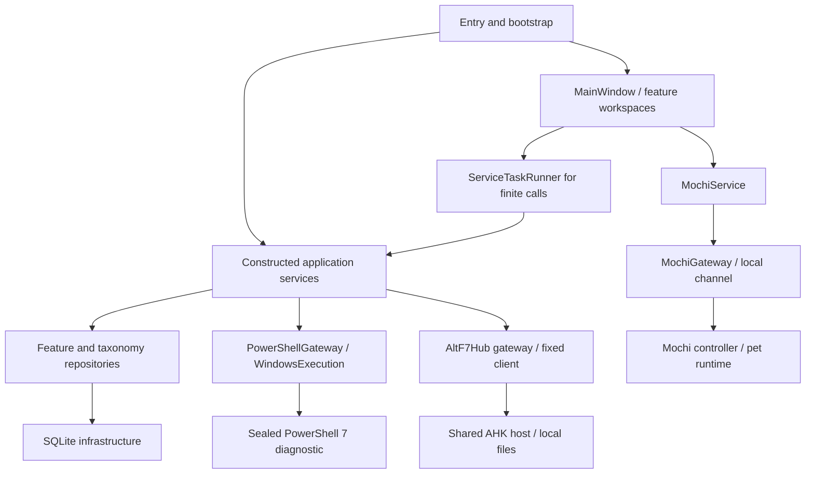
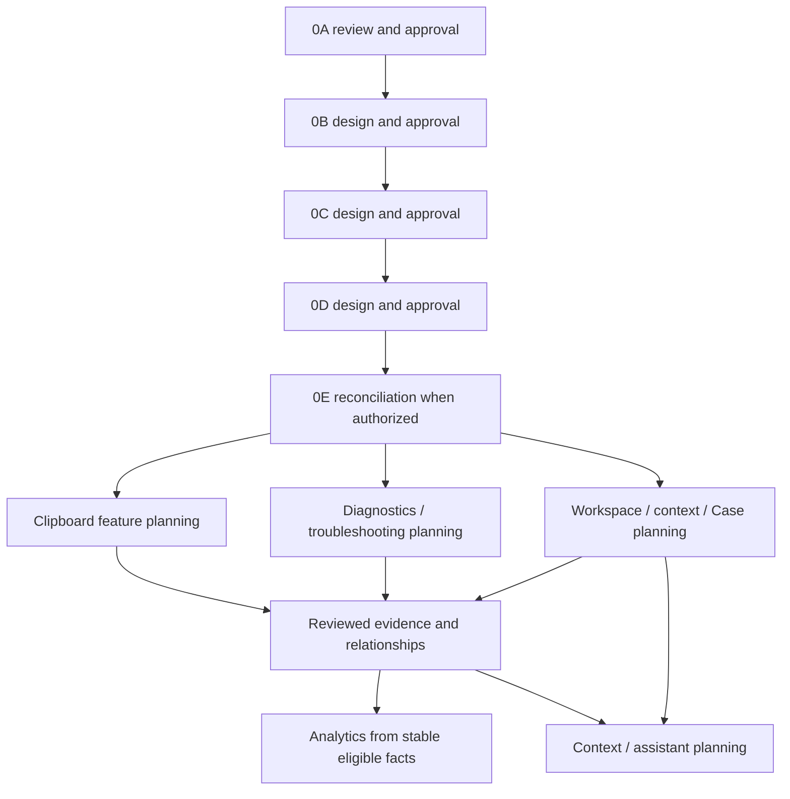

# F7Hub Phase 0A

## Cross-Subsystem Planning Note

Register DynamicHub as a subsystem; establish authoritative selected-ticket context as a shared application concept; define one authority per business concept; add evidence-flow boundaries; show DynamicHub ↔ Diagnostics ↔ Analytics ↔ Clipboard ↔ Mochi dependencies

# Master Foundation Architecture Planning Instructions
Current subsystem inventory; existing application/service/domain/repository/infrastructure boundaries; technology ownership matrix for Python/PySide6, AHK, PowerShell, SQLite and Mochi; dependency graph; permitted and prohibited dependency directions; existing cross-language infrastructure; trust/security boundaries; data-ownership matrix; application module map; architectural decision register; circular-dependency risks; canonical source-of-truth rules; explicit foundation handoff to 0B/0C/0D.

I want Codex to inspect existing:
taxonomy migration
categories
tags
tag repository
category repository
Knowledge Base tags/categories
Ticket categories
existing constraints
existing scopes

Then produce:
## Existing Taxonomy Reuse Matrix

Concept | Existing Mechanism | Used By | Reuse? | Required Change

The desired outcome is not necessarily “build Global Tags.”
It may instead be:
Existing tag system
        ↓
extend carefully
        ↓
becomes Global Tag Catalog


## Existing Foundation Components

For each potentially reusable foundation component:

Component:
Current responsibility:
Layer:
Consumers:
Dependencies:
Public API:
Tests:
Documentation:
Architectural fitness:
Recommendation:
  REUSE
  EXTEND
  REPLACE
  DEPRECATE
  NOT RELATED
  NOT VERIFIED


## Mode

`@ARCHITECT @PLAN`

Planning and architecture analysis only.

Do not implement features.

Do not create migrations.

Do not modify production code.

Do not perform unrelated refactoring.

Do not make irreversible architectural decisions silently.

---

# 1. Objective

Produce a comprehensive but implementation-neutral Master Foundation Architecture Plan for the next major F7Hub development cycle.

The purpose of this plan is to give future Codex sessions and feature plans a shared architectural model before implementation begins.

The plan must establish:

- subsystem boundaries
- responsibility ownership
- shared terminology
- cross-module relationships
- cross-language communication boundaries
- data ownership
- persistence ownership
- configuration ownership
- taxonomy responsibilities
- event and contract boundaries
- dependency order
- security boundaries
- testing boundaries
- implementation sequencing constraints

The plan must reduce the risk that future features:

- duplicate functionality
- create competing taxonomies
- create incompatible JSON schemas
- bypass service boundaries
- duplicate persistent data
- mix analytics with operational workflows
- allow AHK, PowerShell, Python, PySide6, Mochi, or SQLite to absorb responsibilities belonging to another subsystem

This is a foundation-planning exercise.

It is not an instruction to build the features.

---

# 2. Planned Feature Domains

The Master Plan must account for these upcoming areas:

1. Cross-language JSON / interoperability contracts
2. F7Hub Settings architecture
3. Global Tags and taxonomy
4. Entity classification and extraction
5. Clipboard Center
6. Diagnostic Engine
7. Diagnostic Center GUI
8. Statistical Analytics
9. Mochi Python Automation Assistant
10. Optional Mochi right sidebar
11. AHK integration
12. PowerShell integration
13. SQLite persistence
14. Cross-module search and relationships

These are related systems.

Do not plan them as isolated applications.

---

# 3. Existing Architecture Is Authoritative

Before proposing architecture:

```text
UNDERSTAND
    ↓
INSPECT
    ↓
MAP EXISTING CAPABILITIES
    ↓
IDENTIFY GAPS
    ↓
PLAN
```

Do not invent current project state.

For every relevant capability classify it as:

```text
FACT
ASSUMPTION
INFERENCE
RECOMMENDATION
NOT VERIFIED
```

When something has not been inspected, explicitly state:

```text
Not verified.
```

---

# 4. Mandatory Repository Inspection

Inspect relevant current F7Hub implementation and documentation before proposing new foundational components.

At minimum inspect relevant material covering:

```text
Project Vision
Project Requirements
Features
User Workflows
GUI
System Architecture
Database
ERD
SQL Schema
Folder Structure
AHK Architecture
PowerShell Architecture
Python Architecture
Roadmap
Todo
ChangeLog
```

Also inspect existing implementation for:

```text
Database migrations
Repositories
Application services
Domain models
Settings/configuration
Categories/taxonomy
Tags, if any
Ticket references
Knowledge Base relationships
PowerShell script registry
Diagnostic infrastructure
JSON result structures
FTS5/search
Application bootstrap
Event handling
Cross-language integration
```

Do not create a proposed subsystem until the repository has been searched for something that can be reused or extended.

Use:

```text
SEARCH
    ↓
IDENTIFY
    ↓
REUSE / EXTEND
    ↓
CREATE ONLY IF NECESSARY
```

---

# 5. Primary Architecture Principle

Preserve F7Hub's modular-monolith architecture.

Preferred application direction:

```text
GUI
 ↓
Application / Services
 ↓
Domain Logic
 ↓
Repositories
 ↓
Database / Infrastructure
```

External integration layers may communicate with Application Services through explicit contracts.

Do not allow GUI components to become business-logic owners.

Do not allow AHK to become a database client.

Do not allow PowerShell to become a business-domain layer.

Do not allow Mochi to become a second system of record.

Do not allow Statistical Analytics to mutate operational data.

---

# 6. Technology Responsibilities

The Master Plan must explicitly define and preserve technology ownership.

## Python / PySide6

Primary responsibilities:

- main F7Hub application
- business/application orchestration
- parsing
- classification
- entity extraction
- data normalization
- analytics
- diagnostic orchestration
- context aggregation
- validation
- service layer
- GUI
- optional offline assistant behavior

## SQLite

Primary responsibilities:

- canonical relational persistence
- relationships
- integrity
- historical operational records
- FTS5 where justified
- analytical source data
- durable settings where appropriate

## AutoHotkey v2

Primary responsibilities:

- global hotkeys
- lightweight desktop interaction
- Windows clipboard triggers
- quick HUDs
- focused window context
- paste/injection actions
- launcher-like interaction

AHK must not directly modify F7Hub database state.

## PowerShell

Primary responsibilities:

- Windows administration
- Microsoft administration
- diagnostics
- system inspection
- approved automation
- structured evidence collection

PowerShell must not define F7Hub domain rules.

## Mochi

Primary responsibilities:

- context presentation
- explanations
- recommendations
- deterministic offline assistant output
- optional speech
- future AI-enhanced assistance

Mochi must consume approved F7Hub context through services/contracts.

Mochi must not independently bypass business or security boundaries.

## JSON

Primary responsibilities:

- language-neutral contracts
- structured IPC payloads
- diagnostic results
- automation results
- assistant context payloads

JSON is a communication format, not the system of record.

---

# 7. Required Conceptual Separation

The Master Plan must formally distinguish the following concepts.

## Category

Formal structured classification.

Example:

```text
Microsoft 365 → Outlook
```

## Type / Kind

Describes what a record fundamentally is.

Example:

```text
powershell_error
url
mixed_text
```

## Entity

A specific object/value discovered in content.

Example:

```text
10.0.0.87
john@contoso.com
PC-1042
0x80070005
```

## Tag

Flexible reusable concept associated with records across F7Hub.

Example:

```text
DNS
Outlook
Authentication
Networking
PowerShell
```

## Status

Workflow state.

Example:

```text
OPEN
RESOLVED
PUBLISHED
ARCHIVED
```

## Relationship

Explicit connection between records.

Example:

```text
Clipboard Item
    ↓ EVIDENCE_FOR
Ticket
```

## Metric

Calculated measurement.

Example:

```text
31 DNS-related tickets in the last 30 days
```

## Insight

Derived interpretation of metrics.

Example:

```text
DNS-related activity increased significantly this month.
```

These concepts must not be collapsed into one generic taxonomy mechanism.

---

# 8. Global Tag Architecture Principle

The Master Plan should evaluate a single global F7Hub Tag Catalog.

Target conceptual model:

```text
Global Tags
    │
    ├── Tickets
    ├── Knowledge Base
    ├── Clipboard
    ├── Diagnostics
    ├── Scripts
    ├── Automation
    └── Other eligible modules
```

The same canonical `DNS` tag should be reusable across modules.

The Master Plan must determine whether existing F7Hub taxonomy infrastructure can support or be extended for this purpose.

Do not automatically create a parallel taxonomy engine.

---

# 9. Entity Architecture Principle

Entities are different from Tags.

Example clipboard content:

```text
User: john@contoso.com
Device: PC-1042
IP: 10.0.0.87
Error: 0x80070005
```

Possible extracted entities:

```text
EMAIL
HOSTNAME
IPV4
ERROR_CODE
```

Possible tags:

```text
Networking
Windows
Troubleshooting
```

The Master Plan must define:

- ownership of entity taxonomy
- entity normalization
- source/provenance
- confidence
- offsets in source content
- optional metadata
- entity reuse across modules
- whether entities should be global concepts or module-owned records
- how entity values should relate to future structured F7Hub records such as devices, contacts, companies, tickets, or diagnostics

Do not assume every detected entity becomes a permanent business entity.

---

# 10. Cross-Language Contract Boundary

The Master Plan must reserve a dedicated follow-up architecture phase for the Global F7Hub JSON Contract.

Do not fully design the JSON contract during this Master Plan.

Instead identify:

- contract families required
- producers
- consumers
- trust boundaries
- validation points
- payload-size considerations
- versioning requirements
- error-handling needs
- asynchronous vs synchronous usage
- security requirements

Expected contract families may include:

```text
clipboard.capture
clipboard.process
clipboard.result

diagnostic.request
diagnostic.result

automation.request
automation.result

mochi.context
mochi.message

application.event
```

These are conceptual names only.

The detailed contract should be designed in Phase 0B after this Master Plan is approved.

---

# 11. Do Not Confuse Contract With Transport

The Master Plan must explicitly separate:

```text
CONTRACT
```

from:

```text
TRANSPORT
```

For example:

```text
JSON Contract
```

may later travel over:

```text
Named Pipe
localhost HTTP
local socket
process stdin/stdout
```

Transport decisions should not leak into domain models unnecessarily.

The Master Plan should identify which transport decisions must be made now and which can safely be deferred.

---

# 12. Settings Architecture

The Master Plan must identify Settings as shared infrastructure.

Expected future consumers include:

```text
Clipboard
Tags
Diagnostics
PowerShell
Automation
Analytics
Mochi
Appearance
Privacy
```

Plan responsibility boundaries for:

```text
Settings GUI
SettingsService
SettingsRepository
configuration defaults
validation
persistence
```

Determine conceptually which settings belong in:

```text
SQLite
```

versus configuration files or runtime configuration.

Do not design every individual setting yet.

---

# 13. Clipboard Domain Boundary

Clipboard Center should be treated as an operational module.

Conceptual responsibilities:

```text
capture
classification
entity extraction
normalization
sensitivity handling
deduplication
retention
search
pin/save
relationships
actions
```

Clipboard Center should answer:

```text
What information did I capture?
What does it contain?
What can I do with it?
```

Clipboard Center should not own historical statistical analysis.

---

# 14. Diagnostic Domain Boundary

Diagnostic Engine should transform technical context into structured technical evidence.

Conceptual model:

```text
DiagnosticSession
    ↓
DiagnosticExecution
    ├── Findings
    ├── Evidence
    └── Recommendations
```

The Master Plan must inspect existing F7Hub diagnostic and PowerShell infrastructure before proposing additions.

Diagnostics should initially favor:

```text
READ-ONLY
DETERMINISTIC
APPROVED
STRUCTURED
```

operations.

---

# 15. Statistical Analytics Boundary

Statistical Analytics is a read-oriented subsystem.

It should consume operational facts from modules such as:

```text
Tickets
Clipboard
Diagnostics
Knowledge Base
Tags
Automation
Scripts
Companies
Devices
```

Conceptual rule:

```text
Operational modules WRITE facts.

Analytics READS facts
and derives measurements.
```

Analytics should not become another source of operational truth.

Plan eventual layering:

```text
SQLite operational data
        ↓
SQLite views
        ↓
Python aggregation
        ↓
optional persisted aggregates
        ↓
Statistical Analytics GUI
```

---

# 16. Mochi Boundary

Mochi should sit above structured F7Hub context.

Conceptually:

```text
                 Mochi
                   │
             Context Service
                   │
        ┌──────────┼──────────┐
        │          │          │
    Clipboard  Diagnostics  Analytics
        │          │          │
      Tickets      KB        Tags
```

Mochi should not become:

- a second database owner
- an unrestricted PowerShell executor
- a direct SQLite client
- an independent ticket workflow engine
- an autonomous remediation engine

The Master Plan must distinguish:

```text
Mochi UI shell
```

from:

```text
Mochi assistant behavior
```

The right-sidebar shell may be planned earlier than advanced assistant functionality.

---

# 17. Data Ownership Matrix

The Master Plan must produce a data ownership matrix.

At minimum include:

| Data | Canonical Owner | Writers | Readers | Persistence |
|---|---|---|---|---|
| Clipboard item | TBD | TBD | TBD | TBD |
| Clipboard entity | TBD | TBD | TBD | TBD |
| Tag | TBD | TBD | TBD | TBD |
| Diagnostic session | TBD | TBD | TBD | TBD |
| Finding | TBD | TBD | TBD | TBD |
| Evidence | TBD | TBD | TBD | TBD |
| Recommendation | TBD | TBD | TBD | TBD |
| Metric | TBD | TBD | TBD | TBD |
| Mochi context | TBD | TBD | TBD | TBD |
| Settings | TBD | TBD | TBD | TBD |

Do not fill this from assumptions alone.

Ground it in inspected architecture and clearly mark recommendations.

---

# 18. Responsibility Matrix

Produce a matrix for:

```text
PySide6
Python Services
AHK
PowerShell
SQLite
JSON Contracts
Mochi
Statistical Analytics
```

For each major responsibility classify:

```text
OWNS
MAY USE
MUST NOT OWN
```

Example:

```text
SQLite Persistence

Python Repository Layer     OWNS ACCESS
SQLite                     OWNS DATA
PySide6                     MAY USE THROUGH SERVICES
AHK                         MUST NOT OWN
Mochi                       MUST NOT OWN
PowerShell                  MUST NOT OWN
```

---

# 19. Cross-Module Relationship Map

Produce a conceptual relationship map covering at least:

```text
Tickets
Companies
Contacts
Knowledge Base
Clipboard
Entities
Tags
Diagnostics
Scripts
Automation
Analytics
Mochi
```

Identify relationships such as:

```text
Clipboard → Ticket Evidence
Clipboard → Diagnostic Input
Diagnostic → Ticket
Diagnostic → KB
Script → Diagnostic
Tag → Clipboard
Tag → Ticket
Tag → KB
Tag → Diagnostic
Analytics → reads all eligible modules
Mochi → reads approved context
```

Do not create database schemas yet.

The purpose is to establish semantics.

---

# 20. Events and State Changes

Identify which future interactions are:

```text
COMMAND
EVENT
QUERY
```

Examples:

```text
COMMAND:
Run diagnostic.

EVENT:
Clipboard item captured.

QUERY:
Find KB articles tagged DNS.
```

This distinction should help prevent inappropriate coupling.

Do not implement an event bus unless inspection proves one is needed.

---

# 21. Security Boundaries

The Master Plan must explicitly identify trust boundaries.

Treat as untrusted:

```text
Clipboard content
AHK payloads
PowerShell output
URLs
Files
External APIs
User-entered text
AI output
Imported content
```

Define architectural safeguards for:

- schema validation
- payload size limits
- parameterized SQL
- command allowlists
- PowerShell script registry
- no arbitrary execution endpoint
- secret detection
- sensitive clipboard handling
- localhost IPC exposure
- auditability
- least privilege

No destructive action should be executed solely because clipboard or AI text requests it.

---

# 22. Privacy Boundaries

The Master Plan must identify privacy-sensitive data flows involving:

```text
Clipboard
Tickets
Contacts
Diagnostic evidence
Mochi
Analytics
```

Determine which systems:

- persist raw content
- persist normalized content
- persist only aggregates
- receive redacted context
- may receive AI context in the future
- must never receive secrets automatically

---

# 23. Analytics Vocabulary Must Be Stable

Before Statistical Analytics implementation, define the difference between:

```text
Raw Data
Event
Metric
Dimension
Insight
Recommendation
```

Example:

```text
Raw:
Get-Service Spooler

Event:
Clipboard captured at 14:31

Metric:
47 PowerShell commands captured this week

Insight:
PowerShell commands increased 18%

Recommendation:
Consider creating a reusable automation
```

The Master Plan should ensure that operational modules do not prematurely store derived insights as facts.

---

# 24. Shared Vocabulary Document

Produce a proposed glossary covering at least:

```text
Category
Type
Kind
Entity
Tag
Status
Priority
Relationship
Evidence
Finding
Recommendation
Diagnostic
Automation
Event
Command
Query
Metric
Dimension
Insight
Context
Contract
Payload
Transport
```

Every later architecture plan should reuse these meanings.

---

# 25. Dependency Graph

Produce a dependency graph for the planned systems.

Expected high-level direction should be evaluated against the repository:

```text
Existing F7Hub
      ↓
Shared Foundation Decisions
      ↓
JSON Contract
      ↓
Settings + Taxonomy
      ↓
Clipboard
      ↓
Diagnostics
      ↓
Analytics
      ↓
Mochi
```

Identify where dependencies may run in parallel.

Identify prohibited circular dependencies.

---

# 26. Prohibited Dependency Examples

Evaluate and explicitly guard against structures such as:

```text
ClipboardService
    ↓
MochiService
    ↓
ClipboardService
```

or:

```text
Analytics
    ↓ writes into
TicketRepository
```

or:

```text
AHK
    ↓
SQLite
```

or:

```text
PowerShell
    ↓
business workflow decisions
```

or:

```text
Mochi
    ↓
arbitrary PowerShell execution
```

---

# 27. Planning Depth Classification

For every architectural topic classify it as one of:

```text
DECIDE NOW
DESIGN NEXT
DEFER UNTIL FEATURE PLAN
DEFER UNTIL IMPLEMENTATION
```

Examples:

Potential `DECIDE NOW`:

```text
Module responsibility boundaries
Canonical data ownership
Tags vs Entities distinction
Analytics read-only rule
Mochi security boundary
```

Potential `DESIGN NEXT`:

```text
JSON Contract details
Entity taxonomy
Tag taxonomy
Settings persistence
```

Potential `DEFER`:

```text
Exact GUI pixel dimensions
Every diagnostic type
Every analytics KPI
Every classifier
Every Mochi phrase
```

This is important.

Do not over-design details whose requirements are not yet stable.

---

# 28. Required Master Plan Deliverables

Produce the following deliverables.

## A. Executive Architecture Summary

Explain the intended system in plain language.

## B. Verified Current-State Inventory

Show what already exists and what was inspected.

Use:

```text
FACT
NOT VERIFIED
```

appropriately.

## C. Proposed Domain Map

Show major F7Hub domains.

## D. Dependency Graph

Show foundational and feature dependencies.

## E. Data Ownership Matrix

Identify canonical owners.

## F. Technology Responsibility Matrix

Define Python, PySide6, SQLite, AHK, PowerShell, JSON, Analytics, and Mochi responsibilities.

## G. Classification Vocabulary

Define:

```text
Categories
Types
Entities
Tags
Statuses
Relationships
Metrics
```

## H. Cross-Module Relationship Map

Describe semantic relationships.

## I. Security / Trust Boundary Map

Identify untrusted data and execution boundaries.

## J. Configuration Ownership Model

Describe Settings responsibilities.

## K. Contract Inventory

List required JSON contract families without designing their full schemas.

## L. Decision Register

For every major choice include:

```text
Decision
Reason
Alternatives considered
Consequences
Status
```

Use statuses:

```text
PROPOSED
RECOMMENDED
REQUIRES USER DECISION
DEFERRED
```

## M. Open Questions

Only include questions that materially affect architecture.

Do not ask questions whose answer can be obtained by repository inspection.

## N. Risk Register

Identify:

```text
duplication risk
coupling risk
migration risk
security risk
privacy risk
performance risk
schema-growth risk
taxonomy drift
contract drift
analytics inconsistency
```

## O. Recommended Planning Sequence

Recommend the order of the next detailed planning exercises.

---

# 29. Expected Next Planning Sequence

The Master Plan should evaluate this proposed sequence:

```text
Phase 0A
Master Foundation Architecture

Phase 0B
Global JSON / Interoperability Contract

Phase 0C
Classification & Taxonomy Architecture
- Categories
- Types / Kinds
- Entities
- Tags
- Relationships

Phase 0D
Settings Architecture

Phase 1
Clipboard Architecture

Phase 2
Diagnostic Architecture

Phase 3
Statistical Analytics Architecture

Phase 4
Mochi Context & Assistant Architecture
```

Do not treat these phase numbers as implementation slice numbers.

They are architecture/planning phases.

---

# 30. No Implementation Slices Yet

The Master Plan may identify probable future implementation slices.

However, do not create detailed implementation slice instructions until the corresponding architecture plan is approved.

Use:

```text
MASTER ARCHITECTURE
        ↓
DETAILED DOMAIN PLAN
        ↓
IMPLEMENTATION SLICES
```

not:

```text
MASTER ARCHITECTURE
        ↓
100 files changed at once
```

---

# 31. Architecture Decision Gates

Identify decisions that require explicit review before proceeding.

At minimum flag:

- new global taxonomy architecture
- new IPC transport
- major settings persistence design
- new cross-module foreign-key patterns
- major diagnostic execution boundary
- new background service
- new authentication/security mechanism
- destructive migrations
- plugin architecture changes
- major repository restructuring
- new cross-language dependency direction

---

# 32. Documentation Impact Plan

Identify which existing documentation will eventually require synchronization.

Examples:

```text
GUI changes
→ GUI + System Architecture docs

Database changes
→ Database + ERD + SQL Schema docs

Python architecture changes
→ Python Architecture

AHK integration
→ AHK Architecture

PowerShell contracts
→ PowerShell Architecture

Major feature sequencing
→ Roadmap + Todo + ChangeLog
```

Do not update documentation during this planning task unless explicitly requested.

Only identify expected impact.

---

# 33. Testing Strategy at Architecture Level

Do not write detailed tests yet.

Define required future validation categories:

```text
unit
repository
database migration
contract/schema
integration
cross-language
GUI
security
privacy
regression
native Windows
performance
retention/cleanup
analytics correctness
```

Map test categories to future domains.

---

# 34. Performance Considerations

Identify likely performance-sensitive areas:

```text
clipboard capture frequency
large clipboard payloads
FTS indexing
entity extraction
tagging rules
diagnostic subprocess execution
analytics aggregation
large historical datasets
GUI filtering
Mochi context assembly
```

Do not prematurely optimize.

Identify where measurement will be required.

---

# 35. Acceptance Criteria

The Master Foundation Architecture Plan is acceptable when:

1. Existing relevant architecture has been inspected.
2. Existing reusable capabilities have been identified.
3. No project state has been invented.
4. Major domains have explicit responsibilities.
5. Canonical data ownership is clear.
6. Tags, Entities, Categories, Types, and Statuses are clearly distinguished.
7. Analytics is separated from operational ownership.
8. Mochi's boundary is explicit.
9. AHK and PowerShell responsibilities are constrained.
10. Required JSON contract families are identified.
11. Settings dependencies are identified.
12. Cross-module relationships are mapped.
13. Security and privacy boundaries are documented.
14. Dependency direction is clear.
15. Circular dependencies are identified and prevented.
16. Decisions that require user review are flagged.
17. Deferred decisions are explicitly documented.
18. The next architecture-planning sequence is clear.
19. No implementation is performed.
20. F7Hub is easier to reason about after the plan than before it.

---

# 36. Validation

Before declaring the plan complete:

```text
Architecture inspection       PASS / FAIL / BLOCKED
Existing capability mapping   PASS / FAIL / BLOCKED
Dependency analysis           PASS / FAIL / BLOCKED
Data ownership analysis       PASS / FAIL / BLOCKED
Security review               PASS / FAIL / BLOCKED
Taxonomy boundary review      PASS / FAIL / BLOCKED
Contract inventory            PASS / FAIL / BLOCKED
Scope control                 PASS / FAIL / BLOCKED
Implementation changes        MUST BE NONE
```

---

# 37. Final Report Format

Return:

## Summary

What was inspected and the recommended architecture direction.

## Current-State Findings

Verified existing capabilities relevant to the plan.

## Domain Map

Major subsystem boundaries.

## Dependency Map

Direction of dependencies.

## Data Ownership

Canonical ownership matrix.

## Classification Model

Categories vs Types vs Entities vs Tags vs Statuses vs Relationships.

## Communication Boundaries

Required contract families and producers/consumers.

## Settings Architecture

Shared configuration responsibility.

## Security & Privacy

Trust and execution boundaries.

## Decision Register

Recommended, deferred, and user-review decisions.

## Risks

Architectural risks and mitigations.

## Recommended Planning Sequence

Exact recommended order for subsequent detailed architecture plans.

## Result

Use one:

```text
READY_FOR_FOUNDATION_DESIGN
BLOCKED
REQUIRES_ARCHITECTURE_DECISIONS
```

Do not return `READY_FOR_IMPLEMENTATION`.

This Phase 0 task is intentionally upstream of implementation.

# Cross-subsystem context and evidence map
Ticket Workspace
      │
      │ authoritative ticket selection
      ▼
Application Context
      │
      ├──────────────► DynamicHub
      │                    │
      │                    ├── actions
      │                    ├── observations
      │                    └── workflow state
      │
      ├──────────────► Diagnostics
      │                    │
      │                    └── structured results
      │
      ├──────────────► Clipboard
      │                    │
      │                    └── optional technician input
      │
      └──────────────► Mochi
                           │
                           └── advisory context

Actions + Results + Observations
              │
              ▼
        Evidence Model
              │
              ├── Case Notes
              ├── Closure
              └── Analytics

F7Hub owns ticket identity.
Diagnostics own diagnostic execution.
DynamicHub owns interactive workflow presentation.
Analytics owns derived measurement.
Clipboard owns clipboard lifecycle.
Mochi owns advisory pet interaction.

None of them become alternative ticket authorities.

---

## Additional Mandatory Cross-Cutting Architecture Questions

During repository inspection, determine whether F7Hub requires shared
architectural concepts for the following.

Do not assume that each item requires a new service, table, registry,
module or abstraction.

For each item:

1. search for existing implementation;
2. identify current ownership;
3. classify as REUSE / EXTEND / NEW / FEATURE-OWNED / NOT NEEDED /
   NOT VERIFIED;
4. identify the appropriate architectural layer;
5. identify downstream Foundation impact.

Evaluate:

- Technician Workspace
- Active Technician Context
- Case Journal / Case Activity
- offline Case Note generation
- Evidence
- Attachments / binary content
- Audit / Application Events
- Approved Actions / Remediation
- Background Jobs
- External Systems of Record
- Integration Gateway / Adapter boundaries
- Integration Capability / Permission model
- Credential Broker boundary
- Synchronization Outbox
- Remote Identity Mapping
- Connectivity state
- Privacy / redaction
- provenance of externally sourced information

### Offline-First Requirement

Determine which architectural capabilities must be:

- LOCAL_REQUIRED
- ONLINE_OPTIONAL
- ONLINE_REQUIRED

F7Hub must support core local technician workflows without requiring an
external API or AI provider.

In particular, Case Journal storage, Case Note draft creation and Case
Note editing must remain possible offline.

External synchronization may be unavailable while those local workflows
continue.

### Vendor-Neutral Integration Requirement

Foundation architecture must allow future employer-approved APIs without
making any current vendor mandatory.

Potential providers may include PSA, RMM, Microsoft administration,
credential-management and AI systems.

Do not design Foundation architecture around a specific vendor unless
the current repository already contains an approved vendor-specific
integration.

Vendor-specific behavior should normally terminate at an integration
gateway or adapter boundary.

### External System-of-Record Boundary

Determine how F7Hub distinguishes:

- local working state;
- locally generated drafts;
- synchronized external state;
- authoritative external records.

Example architectural question:

F7Hub may own a local Case Journal and offline Case Note draft while a
future PSA owns the official published ticket note.

The specific PSA must remain replaceable.

### Sensitive Information and Secrets

Determine trust and data-handling boundaries without requiring real
employer or customer information.

Planning examples and test data must be synthetic.

Secrets must not become ordinary domain data, taxonomy data, application
settings, logs, analytics input or assistant context.

Any future credential integration must have a clearly defined security
boundary and least-privilege model.

---

# EXECUTION REPORT

## Document control and baseline

| Field | Value |
|---|---|
| Phase / mode | Foundation 0A; architecture investigation and planning only |
| Date | 2026-10-07 (America/Toronto) |
| Planning status | APPROVED — Phase 0A architecture/planning approval by USER |
| Result | READY_FOR_INTEGRATION_REVIEW |
| Verified base / candidate HEAD | `33a246ee5c760356775ed2c31a887f30d82bed42` (PR #65 merge) |
| Worktree | `C:\Dev\F7Hub-Foundation-0A-20261007` |
| Branch | `docs/foundation-0a-execution-20261007` |
| Write allowlist | This document only; preserve original planning instructions |
| Approval | Phase 0A architecture: APPROVED; approved by: USER; includes 0A-D1/D01 and 0A-D2/D02 |
| Independent review | APPROVE_WITH_NOTES; blocking findings: NONE; major findings: NONE |
| Minor finding | Provenance-label correction resolved before integration |

FACT: `git ls-remote --exit-code origin refs/heads/main` and local `origin/main` both identified the base above. Origin is `https://github.com/JDecelles1990/F7Hub.git`. The candidate was clean at creation; HEAD remains the base and report changes are unstaged.

FACT: Canonical `C:\Dev\F7Hub` is dirty on `feature/disk-space-assessment`, HEAD `aea520323cce4d38cf1d7ebff3da28810f3bb4cf`, with unrelated edits, deletions and untracked work. Those inputs are excluded from current-state findings. In particular, the canonical spelling-adjusted/deleted Foundation files and untracked DynamicHub directory are not architecture evidence for integrated main.

FACT: The suggested `C:\Dev\F7Hub-Foundation-0A` already existed, clean on `docs/foundation-0a-execution`, HEAD `adb0189304d547387f27c71dcb77bf09175c6df3`, two commits behind main. It was inspected and preserved. A distinct branch/worktree was created without switching, resetting, stashing, cleaning or restoring either existing checkout.

The instruction chain was read: root `AGENTS.md`, `ROOT.md`, `Docs/19_DocumentationIndex.md`, Planning/Foundation scoped instructions and the original 0A contract. PowerShell, Mochi and AltF7Hub instructions were read before their source inspection. The available delivery skill was inspected for applicability; implementation/slice lifecycle machinery was not applied to documentation-only architecture work. No optional project architecture skill was found.

Evidence discipline: FACT means inspected source or specification at the pinned base, not fresh runtime acceptance. INFERENCE means a conclusion from those facts. RECOMMENDATION identifies direction proposed in the original inspection report; its Phase 0A architectural boundaries are now approved by USER. Deferred detailed designs remain subject to their owning phase and approval. ASSUMPTION is an explicit planning premise. NOT VERIFIED means insufficient evidence. A documented future capability is not implemented merely because its design or schema appears in a canonical document. Test sources were inspected; historical results were not claimed as fresh execution.

## A. Executive Architecture Summary

RECOMMENDATION: Retain the Python/PySide6 modular monolith, explicit composition root, existing feature services, SQLite repositories and process gateways. Extend those mechanisms when a reviewed requirement needs them. Do not create a parallel taxonomy, ticket identity system, general execution endpoint, event bus, persistent scheduler or speculative provider framework.

FACT: Tickets, Companies/Contacts, Knowledge, Scripts, local diagnostic execution, a narrow AltF7Hub show/focus bridge and Mochi cosmetic controls have implementation. Scoped categories and flat global tags already exist. Knowledge uses FTS5 and article-tag associations. Ticket notes/status history/timeline provide durable local activity. Diagnostic results remain in memory.

RECOMMENDATION: Workspace owns presentation/lifecycle; feature services retain workflow and data ownership. A future application-owned active context selects references to existing records. Clipboard owns capture lifecycle; Diagnostics owns collection/execution; Analytics reads eligible facts; Mochi receives minimal approved advisory context. These proposals do not expand the current pet-control or guide-open contracts.

APPROVED DECISION 0A-D1 (register D01): DynamicHub is the application-level owner of the interactive troubleshooting workflow. It consumes selected technician context, coordinates approved application services, sequences technician-facing actions and presents structured results through established service/gateway boundaries. Diagnostics retains diagnostic definitions, execution and result authority; other feature authorities remain unchanged.

APPROVED DECISION 0A-D2 (register D02): Case Journal / Case Activity must support local technician work before a Ticket association and may remain ticketless. Ticket association is optional; the journal must not become a second competing Ticket Timeline. Existing ticket activity retains its current authority. Later domain/database planning must assess reuse or extension before new infrastructure; no table, repository or service is mandated. Local storage, draft creation and editing remain possible without an external PSA or AI provider. Both user-review scope decisions are resolved; L records their approval. Detailed envelope, taxonomy, settings, schema, transport and provider decisions stay with their later owners. No infrastructure is implemented here.

## B. Verified Current-State Inventory

Evidence keys refer to inspected files at the pinned base. Repository-relative paths and named symbols/sections make the findings inspectable. Documentation status prose was not treated as runtime proof.

| Key | Inspected evidence | FACT established / limit |
|---|---|---|
| E01 | [bootstrap](../../../Python/f7hub/app/bootstrap.py), `ApplicationContext:40`, `bootstrap_application:60`; [entry](../../../Python/f7hub/app/main.py), `main:20` | Explicit construction; database bootstrap precedes GUI. Default database is development-relative; CLI accepts an override. ApplicationContext contains dependencies, not active business selection. |
| E02 | [MainWindow](../../../Python/f7hub/gui/main_window.py), constructor; [TicketWorkspace](../../../Python/f7hub/gui/ticket_workspace.py), `begin_creation`, `open_ticket:656`, `_display_details:711`; Knowledge/Script workspace source | QStackedWidget hosts Tickets, Knowledge and Scripts. Ticket details/selection/drafts are local presentation state. Creation clears saved-ticket identity. No global active-context service found. |
| E03 | [database](../../../Python/f7hub/infrastructure/database.py), connection/bootstrap functions; [migrations](../../../Python/f7hub/infrastructure/migrations.py); [paths](../../../Python/f7hub/infrastructure/database_paths.py); migrations 0001–0012 | Foreign keys, validated 5000 ms busy timeout, tracked/checksummed migration history and bootstrap integrity checks exist. No database was opened/migrated in this task. |
| E04 | [0002 taxonomy](../../../Database/Migrations/0002_taxonomy.sql); [CategoryRepository](../../../Python/f7hub/repositories/category_repository.py); [TagRepository](../../../Python/f7hub/repositories/tag_repository.py); taxonomy/category/Knowledge tag tests | Scoped hierarchical category schema and flat global tags exist. Read APIs are shared. Tests contain constraints/scope/failure assertions; NOT RUN here. |
| E05 | [0004 tickets](../../../Database/Migrations/0004_tickets.sql); [TicketRepository](../../../Python/f7hub/repositories/ticket_repository.py), records/`transaction:320`; [TicketService](../../../Python/f7hub/services/ticket_service.py), `add_note:447`, reference validation; activity tests | Local ticket identity, notes/history/timeline; service coordinates atomic writes, repository owns SQL. No general Case Journal or generated-note pipeline found. |
| E06 | [0003 companies/contacts](../../../Database/Migrations/0003_companies_contacts.sql); repositories/services; TicketReferenceService; ticket-reference integration tests | Local company/contact identity and associations exist. Service creation/reference APIs are narrow. No device/tenant domain repository/migration found. |
| E07 | [0005 Knowledge](../../../Database/Migrations/0005_knowledge.sql), [0006 FTS](../../../Database/Migrations/0006_knowledge_search.sql); KnowledgeRepository/Service; TicketKnowledgeRepository/Service; associated test sources | Versioned articles, category/global-tag associations, lifecycle, current-article FTS and explicit ticket/KB links. Universal search and other operational tag bridges are unimplemented. |
| E08 | [0007 scripts](../../../Database/Migrations/0007_script_registry.sql); ScriptRepository/Service, `prepare_verified_script:157`; registry/verified-copy tests | Metadata registration/visibility and exact-source verification. Catalog availability/enabled state is distinct from execution permission. Script source stays in files. |
| E09 | [PowerShellService](../../../Python/f7hub/services/powershell_service.py), literal specs, `execute_diagnostic:109`, `execute_diagnostic_pack:117`, validators; [results](../../../Python/f7hub/domain/diagnostic_results.py); three Diagnostics sources; 0008–0012; pack/execution tests | Three parameterless local snapshots and fixed sequential pack. Execution classification differs from collection severity. Valid collection ERROR continues; boundary failure aborts. No durable sessions/history, ticket links, remediation, remote targets or general DiagnosticService. |
| E10 | [PowerShellGateway](../../../Python/f7hub/infrastructure/powershell_gateway.py), `execute:54`; [WindowsExecution](../../../Python/f7hub/infrastructure/windows_execution.py), protected reads/`SealedScript:254`; execution test source | Private verified copy, held file/path guards, trusted non-elevated 64-bit PowerShell 7, owned Job Object, output/deadline bounds and cleanup quarantine. Native behavior NOT VERIFIED here. |
| E11 | [ServiceTaskRunner](../../../Python/f7hub/gui/service_task_runner.py); workspace pending guards; execution reservation; GUI/integration tests | One finite service call per runner; completion on GUI thread. Operation ownership spans callback presentation after runner idle. No durable scheduler/cancellation API in this runner. |
| E12 | [logging](../../../Python/f7hub/app/logging_config.py); application logging test source; Mochi/core/logging.py | Bounded process-local F7Hub logging in LocalAppData with stderr fallback; separate Mochi logger. Ticket timeline is activity, not universal security audit. No generic audit repository found. |
| E13 | MochiService/Gateway/[channel](../../../Python/f7hub/infrastructure/mochi_channel.py)/[protocol](../../../Python/f7hub/domain/mochi_protocol.py); Mochi app, LocalController, PetRuntime, config loader; `test_local_control.py`, `test_config.py` | Cosmetic controls use user/checkout-scoped Qt local IPC and bounded JSON lines. Renderer imports shared protocol/channel infrastructure, not business services/SQLite. Guides, recognition, business context, Luna/provider and sidebar remain planned. |
| E14 | AutoHotkey/F7Hub.ahk, launcher/controller, GuideHost/GuideRequest and GuideCore settings entry points; AltF7HubService/gateway; scoped README/tests | Shared AHK v2 host owns hotkeys and guide/editor files. Fixed show/focus message and outcome text; not JSON business-context IPC. No ticket-to-topic automation. |
| E15 | Tracked files and scoped source/migration searches for context, journal, evidence, audit, credentials, settings, outbox, mappings, devices and DynamicHub | No tracked DynamicHub implementation at this base. No generic SettingsService/Repository, Clipboard Center store/classifier, Analytics implementation, credential broker, outbox or remote mappings found. Bounded repository evidence, not a claim about external installations. |
| E16 | Relevant canonical 00–04 product/workflow excerpts; 05 current workspaces; 06 layering/AI/clipboard; 07 persistence; 08 mappings; 09 taxonomy/attachments/scope/deferred mappings; 10 paths; 11 guide IPC; 12 execution; 13 context/settings/events; 14–15 purpose; 16–18 current/history excerpts; CURRENT_STATE opening history; Mochi README/spec/Architecture | Intended future capabilities exceed applied migrations/code. Some candidate/review prose is stale. No approval inferred from a file or historical pass count. |

INFERENCE: This is an existing reusable foundation. Domain rules largely live in application services; the current domain package holds diagnostic results and Mochi protocol. Moving every record/rule into new domain classes is not needed for 0A.

Authority reconciliation: Doc-01 §29 says local-first where practical rather than strictly offline-first. Explicit user/ROOT/Foundation offline requirements settle this phase without another user decision. Doc-01's absent-Git-baseline claim, several pending-review candidate descriptions, and Mochi README's statement that the renderer imports no F7Hub code are stale relative to current source/Git. It now imports shared protocol/channel infrastructure. Record canonical follow-ups; do not edit those owners in 0A.

### Existing Foundation Components

Responsibility/API/dependency facts are inspected source. Fitness/treatment are RECOMMENDATION. The two tables join by component ID and together supply the required component analysis; test references are evidence of coverage intent, not executed validation.

| Component | Current responsibility / layer | Consumers | Dependencies | Public API examples |
|---|---|---|---|---|
| FC01 Composition/ApplicationContext | Dependency construction; application/bootstrap | Entry/integration fixtures | Qt app, database, services/repos, MainWindow | `bootstrap_application(project_root, database_path)` |
| FC02 Database/migrations/paths | Connections, history, integrity, path resolution; infrastructure | Repositories, bootstrap, backup | sqlite3, files, LocalAppData runtime resolver | `database_connection`, `bootstrap_database`, `run_migrations`, path resolvers |
| FC03 CategoryRepository | Scoped ordered reference reads; repository | TicketReferenceService, KnowledgeService | categories, configured connection | `list_categories(scope, active_only)` |
| FC04 TagRepository | Global catalog/article-tag reads; repository | KnowledgeService | tags, article bridge, connection | `list_tags`, `list_article_tags` |
| FC05 TicketService/Repository | Ticket use cases/atomic activity; service/repository | TicketWorkspace/create/edit widgets | Ticket/activity and reference records, connection | `create_ticket`, `get_ticket_details`, `add_note`, `change_status`, `update_ticket_classification`, `transaction` |
| FC06 Company/Contact services/repos | Local reference identity and creation; service/repository | References/quick-create dialogs | companies/contacts, connection | `create_company`, `create_contact`, `get_company`, `list_contacts_for_company` |
| FC07 KnowledgeService/Repository | Article lifecycle/version/metadata/search; service/repository | KnowledgeWorkspace/dialogs | Categories/tags/articles/versions, FTS | `search_articles`, `set_article_tags`, `set_article_category`, `update_article` |
| FC08 TicketKnowledgeService/Repository | Explicit ticket/KB links; service/repository | TicketKnowledgeWidget | Tickets/articles/junction | `link_related_article`, `unlink_related_article`, `list_linked_articles` |
| FC09 ScriptService/Repository | Catalog, registration, verified source; service/repository | Scripts, execution service | scripts, files/protected reads | `register_script`, `set_script_enabled`, `prepare_verified_script` |
| FC10 PowerShellService/results | Literal policy, pack reservation, run/collection values; service/domain | ScriptWorkspace | ScriptService, gateway, validators | `execution_approved`, `pack_readiness`, diagnostic/pack execution |
| FC11 PowerShellGateway/WindowsExecution | Sealing, trusted launch, containment, cleanup; infrastructure | Execution service | Win32 token/ACL/file/job APIs, approved runtime | `execute(candidate, timeout_seconds, revalidate)`, `protected_read`, `SealedScript` |
| FC12 ServiceTaskRunner/pending state | Finite work and GUI callbacks; presentation infrastructure | MainWindow/workspaces/dialogs | QThread, signals, callback owner | `submit(work, on_success, on_error)`, `busy` |
| FC13 Logging/backup | Technical logger / local snapshot use case | Entry/backup action | RotatingFileHandler; SQLite backup/checks | logging configure/close, `create_backup` |
| FC14 Mochi service/gateway/protocol | Session intent, async cosmetic controls, bounded channel; service/infrastructure/pure contract | MainWindow/settings, LocalController | Qt local sockets/timers, checkout identity | `automatic_start`, `start_show`, `command`, `subscribe`; gateway start/send/close; validators |
| FC15 Mochi config/PetRuntime | Read-only validated defaults / cosmetic states; core/behavior | Mochi composition/UI | JSON/defaults, local animation values | `load_settings`, runtime controls/snapshot |
| FC16 AltF7Hub service/gateway/host | Fixed show/focus / reference editor; service/Windows/AHK | MainWindow/hotkeys/client | AHK v2, fixed message/readiness/mutex, topics/settings | `show_guide`, `RequestGuide`, `InitializeGuideHost` |

| Component | Tests inspected or located | Documentation inspected | Fitness / recommendation |
|---|---|---|---|
| FC01 | application bootstrap integration | Docs 06/13, ROOT | REUSE composition; distinguish stable dependencies from active record selection. |
| FC02 | connection/migration/integrity/path/backup tests | Docs 07/09/13 | REUSE history/paths. Installed resolver exists but default desktop bootstrap still uses development path; distribution planning must settle composition. |
| FC03 | taxonomy/category references, Knowledge category tests | Docs 09 §32/174, 13 | REUSE; EXTEND hierarchy/management validation only after 0C. Read API is not category-edit policy. |
| FC04 | Knowledge tags/filters | Docs 09 §33, 13 | REUSE global identity; EXTEND approved feature bridges later. Article-read specialization does not justify replacement. |
| FC05 | Ticket activity/classification/reference/workspace tests | Docs 04/05/09/13 | REUSE existing ticket responsibilities; evaluate reuse/extension for approved ticket-optional Case Journal in later domain/database planning. No duplicate Ticket Timeline or mandated infrastructure. Note fields are not a privacy/extraction pipeline. |
| FC06 | Company/contact and reference-flow tests | Docs 08/09/13 | REUSE identities; detected hostnames do not automatically become device records. |
| FC07 | Knowledge metadata/lifecycle/history/search tests | Docs 06/09/13 | REUSE conflicts/FTS; current KB retrieval is not universal search. |
| FC08 | Ticket/Knowledge database/integration tests | Docs 08/09/13 | REUSE explicit relationship integrity; no generic polymorphic relationship schema. |
| FC09 | Registry/management/verified-copy tests | Docs 06/12/13 | REUSE visibility/permission separation; metadata registration cannot grant arbitrary execution. |
| FC10 | diagnostic pack/service/execution integration tests | Docs 06/12/13 | REUSE/EXTEND approved composition; no duplicate executor/pack runner. |
| FC11 | windows-execution/integration tests | Docs 12, PowerShell instructions | REUSE fail-closed security boundary; native behavior NOT VERIFIED in this task. |
| FC12 | GUI/integration pending-callback tests | Docs 05/13 | REUSE finite calls; not a persistent job scheduler or cancellation model. |
| FC13 | logging/backup tests | Docs 07/13; logging source | REUSE logs/snapshots; logs are neither audit nor evidence store. |
| FC14 | Mochi local-control/GUI-control tests | Docs 06/13; Mochi Architecture | REUSE pet-only protocol; expansion needs 0B/security review. Endpoint identity is not privileged authorization. |
| FC15 | Mochi config/runtime/control tests | Mochi README/Architecture | REUSE read-only defaults/cosmetic states; not shared settings or assistant engine. |
| FC16 | Guide launch/host/request tests | Docs 11; local instructions/README | REUSE narrow request/protected state; NOT RELATED to ticket authority or global JSON grammar. |

No replacement or deprecation is justified by this inspection.

### Existing Taxonomy Reuse Matrix

| Concept | Existing mechanism (FACT) | Used by | Reuse? (RECOMMENDATION) | Required change / later owner |
|---|---|---|---|---|
| Category/scope | 0002; CategoryRepository; GENERAL/TICKET/KNOWLEDGE/SCRIPT/PROMPT/CLIPBOARD/DIAGNOSTIC | Ticket/Knowledge; script schema has optional FK | REUSE | 0C governs extension; no parallel per-module taxonomy. |
| Hierarchy | Parent FK, self-parent rejection, unique case-insensitive slug | Shared schema; selectors return flat scoped rows | EXTEND when edits are needed | Canonical §32 requires compatible scope and cycle rejection. SQL does not reject multi-node cycles; no hierarchy-management API found. |
| Ticket category | Active TICKET options and transactional validation | Ticket creation/references | REUSE | Preserve null/historical inactive semantics; category is not active context. |
| Knowledge category | Active KNOWLEDGE options, guarded draft update | Knowledge/filter workflows | REUSE | Lifecycle rules stay Knowledge-owned; no incidental history changes. |
| Global Tag | Flat tags, case-insensitive unique name/slug; TagRepository | Knowledge; reusable identity | REUSE | No new Global Tags table. 0C decides normalization/aliases/extension. |
| Knowledge tag links | Composite PK/FKs; guarded replacement, any/all filters | Knowledge/search | REUSE | Current metadata semantics: tag changes do not create content versions. |
| Ticket/Clipboard/Diagnostic/Script tag links | No association implementation in applied migrations | Proposed consumers | EXTEND later | Approve feature-owned links/schema; no universal taggable-record design in 0A. |
| Type/Status/Priority | Domain enums/checks; six Script types plus risk/privilege | Owning features | REUSE | Reconcile terms in 0C; no universal workflow engine. |
| Entity types/occurrences | Business IDs exist; extraction pipeline/catalog not found | Reference records now; extraction proposed | NOT VERIFIED for extraction | 0C owns semantics; later feature parser owns values/spans/provenance/confidence. No automatic business-record creation. |
| Relationships | Explicit ticket/KB and Knowledge structures | TicketKnowledge and Knowledge schema | REUSE/EXTEND by feature | Preserve FK integrity/owner; new patterns need review. |
| Provenance | Source/actor/AI flags, KB author metadata, diagnostic code/digest | Local records/results | EXTEND alignment | 0C defines origins/derivations without replacing source owners. |

## C. Proposed Domain Map

DynamicHub ownership is APPROVED under 0A-D1 (register D01); ticket-optional local Case Journal / Case Activity is APPROVED under 0A-D2 (register D02). Other proposed Phase 0A boundaries are now approved by USER; these architecture approvals do not imply implemented packages/tables/services/processes.

| Domain | Responsibility/owner | Current footing and boundary |
|---|---|---|
| Application shell / Technician Workspace | Navigation, hosting, layout/lifecycle; Python/PySide6 | FACT: MainWindow/stacked pages. No QMdiArea or business-owner commitment. |
| Active Technician Context | Application-selected references/projections with freshness | FACT: TicketWorkspace details, dependency-only ApplicationContext. Shared coordination is proposed; no duplicated records. |
| Tickets / existing ticket activity | Local ticket use cases, notes/history/timeline | FACT: durable ticket-bound activity remains authoritative for current responsibilities. Later reuse analysis may recommend extension; no competing Ticket Timeline. |
| Case Journal / Case Activity | APPROVED 0A-D2: technician working/investigative record with optional Ticket association | Must support pre-association work and records that remain ticketless; local storage, draft creation/editing without external PSA/AI. Later domain/database planning evaluates reuse/extension before new infrastructure; no table/repository/service mandated. |
| Companies / Contacts | Local reference identity/validation | FACT: services/repos. Devices/Tenants remain feature requirements, not implicit extraction records. |
| Knowledge | Lifecycle/revisions/metadata/retrieval | FACT: services/FTS. Reference topics and KB are not ticket authorities. |
| Taxonomy/extraction semantics | Shared meaning/catalog; feature associations/occurrences | FACT: categories/tags. 0C owns semantics; later Python features parse/normalize. |
| Clipboard | Capture, classification, sensitivity, retention, search/actions | Planned operational domain; AHK OS triggers, Python service lifecycle/persistence. Source-copy action is not Clipboard Center. |
| Diagnostics / Scripts | Technical collection/orchestration through existing boundary | FACT: snapshots/pack/registry. Later sessions/findings may extend services; scripts do not compose workflows. |
| DynamicHub | APPROVED 0A-D1: application-level interactive troubleshooting workflow owner | May consume selected context, coordinate approved services, sequence technician-facing actions and present structured results. Uses established service/gateway boundaries; no alternate execution/persistence layer. No tracked implementation at base. |
| Analytics | Read eligible facts; derive metrics/insights | Planned Python read-oriented domain; aggregates are derived/rebuildable. |
| Mochi | Pet shell now; later advisory assistance/context | FACT: cosmetic controls. No SQL/admin authority; sidebar/provider are proposals. |
| Settings/configuration | Application-owned validated configuration; GUI preference input | Current constructors/constants, scoped JSON/INI. 0D designs shared access/store. |
| Integrations | Provider translation/validation and explicit operations | FACT: local process adapters. No external provider verified; add only validated use cases. |
| Technical infrastructure | Connections/migrations/paths/logs/workers/process safeguards | Reuse current mechanisms; no new platform service process. |

## D. Dependency Graph

FACT: The graph summarizes current invocation/dependency direction; arrows do not grant execution approval.



Mochi persistent IPC uses gateway event callbacks, not ServiceTaskRunner. Qt belongs in GUI/transport infrastructure; services/domain remain independent of Qt imports. Services currently depend on repository types and infrastructure-facing exceptions. Do not manufacture interfaces solely to make the diagram look more layered.

APPROVED 0A-D1: DynamicHub owns interactive workflow coordination at the application level and depends on approved owning services/gateways. Diagnostics owns diagnostic definitions, execution and results; it does not depend on DynamicHub for diagnostic authority. DynamicHub consumes selected technician context and structured results without becoming an alternate execution or persistence layer.

APPROVED 0A-D2: the local Case Journal / Case Activity working/investigative record supports optional Ticket association. Local storage, draft creation and editing cannot require a saved Ticket association, external PSA or AI provider. Any Ticket association uses the established Ticket authority; Case Journal must not become a second competing Ticket Timeline. Existing ticket-bound activity retains its current authority unless later reuse analysis recommends extension; no new persistence layer is mandated here.

RECOMMENDATION: Other consumers depend on owning services/contracts; source features never depend on Analytics/Mochi for authority. Context aggregation reads approved feature interfaces; those features do not depend on context consumers. Detailed workflow state, context contracts and sequencing mechanics remain later design.



The Foundation execution order remains 0A → review/approval → 0B → review/approval → 0C → review/approval → 0D → review/approval → 0E. No 0E file exists at the base; this task does not create it. Draft preparation may overlap; authoritative execution cannot precede required approvals. After reconciliation, independent feature plans may proceed separately. Local diagnostics do not require Clipboard/Analytics; cosmetic Mochi does not require an assistant. The original linear feature sketch is not a mandatory runtime dependency chain.

Prohibited: GUI → raw SQL/arbitrary shell; domain → Qt/provider SDK; AHK/PowerShell → core database writes; operational service → Analytics/Mochi for permission; Analytics → operational mutation; Mochi → arbitrary execution; ClipboardService ↔ MochiService; context ↔ feature circular ownership; Diagnostics ↔ DynamicHub competing policy authority.

Original Phase 0A inspection evidence, RETAINED during continuation and independently corroborated by a FRESH static check in the completed architecture review: AST inspection of 59 `Python/f7hub/**/*.py` files found no cycles among resolved absolute intra-package imports and no GUI/PySide6 imports in services/repositories/domain. This does not prove absence of callback/signal cycles, relative/dynamic-import cycles or future data-flow coupling.

## E. Data Ownership Matrix

Current rows are FACT; proposed Phase 0A ownership boundaries are now approved by USER, including DynamicHub workflow ownership (0A-D1) and the ticket-optional local Case Journal boundary (0A-D2). An absent store does not imply a proposed schema.

| Data | Canonical owner | Writers/readers | Persistence/status |
|---|---|---|---|
| Ticket identity/details | Tickets | TicketService/Repository; approved service readers | FACT: local tickets. Future remote IDs do not replace local identity. |
| Company/contact | Reference domains | Their services/repos; ticket references | FACT: local relational identity. |
| Device/tenant | Future reference/integration domain | Approved services; context/diagnostics | No current domain/store found; computerName is not authoritative device identity. |
| Ticket notes/status/timeline | Tickets / existing ticket activity | Atomic TicketService writes; details/workspace reads | FACT: persistent ticket-bound activity; current authority preserved under 0A-D2, not replaced by the Case Journal or treated as universal security audit. |
| Case Journal / Case Activity | Local technician working/investigative record boundary, APPROVED 0A-D2 | Technician use cases; approved draft/context consumers; optional Ticket association | Supports records before association and records that remain ticketless; local storage without PSA/AI. Later reuse analysis determines persistence; no new table/repository/service mandated and no competing Ticket Timeline. |
| Case Note draft | Case Activity use case/technician | Local draft creation/editing; optional reviewed enhancement | APPROVED 0A-D2: creation/editing possible without external PSA/AI or mandatory Ticket association. Current ticket-bound Quick Note draft is GUI memory; broader generated/durable draft unimplemented. |
| Knowledge/versions | Knowledge | KnowledgeService/Repository; retrieval/linked readers | FACT: articles/versions. |
| Category/Tag | Shared taxonomy | Current repository reads; future approved catalog management | FACT: categories/tags. Features own associations/eligibility. |
| Clipboard item | Clipboard | Approved capture/processing; technician/search | Proposed; no item store found. |
| Clipboard entity | Source feature/Clipboard occurrence; 0C shared meaning | Parser candidate → feature validation → approved consumers | Proposed; not automatic Company/Contact/Device creation. |
| Script source/registry | Reviewed files / Scripts metadata | Reviewed source changes; metadata service; execution reads | FACT: source filesystem, registry SQLite; registration is not permission. |
| Diagnostic session/execution/results | Diagnostics | Approved diagnostic services; DynamicHub/presentation/context consume structured results | FACT: typed run/pack values in memory; general durable sessions absent. APPROVED 0A-D1 preserves diagnostic execution/result authority here. |
| Interactive troubleshooting workflow | DynamicHub application-level owner | Coordinates approved services; technician-facing sequence/presentation | APPROVED 0A-D1 ownership; no implementation or persistence model selected. Ticket identity, Clipboard lifecycle, Knowledge persistence and Analytics calculations retain their owners. |
| Finding/Observation | Producing feature | Validated collector or technician; approved readers | General persisted model absent; observed statement differs from interpretation. |
| Evidence | Producer owns source; Case Activity association | Explicit accepted links through services; notes/Analytics/context | Proposed reference/provenance boundary; no global ledger found. |
| Attachments/binary content | Owning feature + filesystem boundary | Service coordinates metadata/file; authorized readers | Canonical design, no migration/API. Files normally outside SQLite. |
| Recommendation | Producing/advisory feature | Rules/assistant propose; technician accepts separately | Proposed advisory value; neither fact nor execution authority. |
| Metric/Dimension/Insight | Analytics | Read-only derivation/display | Proposed derived data; operational source remains authority. |
| Mochi context | Application projection / Mochi presentation | Approved assembly; advisory read only | Current payload is cosmetic snapshot; business context proposed/minimized. |
| Settings | Application config with feature validators | Future SettingsService; approved consumers | Current scoped files/defaults; no global settings store. |
| Logs/audit | Logging / future audit use case | Safe technical records / meaningful authorized actions | Logs/activity exist; generic audit persistence absent. |
| Remote mapping/sync state | Affected integration use case | Service/adapter records verified IDs/ack; local readers | Deferred; no external authority/outbox found. |
| Secrets | Future approved credential boundary | Explicit transient authorized use only | No selected store/broker. Excluded from ordinary data, settings, journal, evidence, clipboard persistence, logs, Analytics and Mochi. |

Future persistence must follow Docs 07/08/09, FK/transaction review and released-migration immutability in an authorized slice. Do not create a table for every row.

## F. Technology Responsibility Matrix

Approved Phase 0A direction preserving current ownership, including the explicitly approved DynamicHub application-level boundary:

| Technology/layer | OWNS | MAY USE | MUST NOT OWN |
|---|---|---|---|
| PySide6 GUI | Rendering/input/navigation/drafts/signals | Services/bounded workers | SQL/domain authority/command construction/authentication |
| Python application/services/domain | Use cases/validation/context; future parsing/classification; approved composition | Repos/gateways/pure values | Autonomous unreviewed execution; provider details in unrelated domains |
| Python repositories | Normal relational access/record mapping | Configured SQLite | GUI/provider calls/workflow policy |
| SQLite | State/integrity/transactions/derived FTS | Approved migration/repository access | Process/network/AI authority or ordinary workflows in triggers |
| AHK v2 | Hotkeys/launch/focus/lightweight desktop/clipboard; guide files | Approved commands/IPC | Core SQLite writes, ticket workflow, primary GUI |
| PowerShell 7 | Approved technical operations/results | Known runtime/modules, reviewed arguments when authorized | Application orchestration/core persistence/script-chain workflows/self-elevation |
| JSON contracts | Boundary representation/validation under 0B | Approved transports | System of record/permission grants |
| DynamicHub (Python application level) | APPROVED 0A-D1: interactive troubleshooting workflow | Selected technician context, approved services/gateways, structured results | Diagnostic execution/definitions, PowerShell execution, ticket identity, Clipboard lifecycle, Knowledge persistence, Analytics calculations, AI execution authority; alternate execution/persistence layer |
| Analytics | Measurements/grouping/derived interpretations | Read-only eligible data | Operational writes/remediation/ticket authority |
| Mochi | Cosmetic presentation/behavior; later advice | Approved minimal context/optional adapter | SQL/duplicate records/capture/credentials/administration |

## G. Classification Vocabulary

RECOMMENDATION: ownership distinctions for 0A, not final 0C catalogs/fields/algorithms.

| Term | Architectural distinction/owner |
|---|---|
| Category | Structured scoped classification; shared semantics, feature eligibility; existing hierarchy. |
| Type/Kind | What a record is; owning domain defines values. Script Type is not execution permission. |
| Entity / Entity Type | Specific object/literal and its meaning; 0C semantics, feature identity/occurrence ownership. Extraction does not create a business record automatically. |
| Tag | Flat reusable conceptual label from current global catalog, not a secret/literal/status bucket. |
| Status/Priority | Domain state/urgency; collection PASS is not ticket state or network health. |
| Relationship | Explicit semantic association through feature services/approved integrity rules. |
| Evidence | Purpose-linked source information with provenance; not automatically trusted or safe to share. |
| Observation/Finding | Collected statement / domain interpretation; producing feature owns derivation/limits. |
| Result | Request/execution/collection outcome; preserve boundary failure versus valid diagnostic ERROR. |
| Event | Fact that occurred; feature meaning. Persisted timeline and transient notification differ. |
| Command/Query | Action request / read request; application service owns authorization/use case. |
| Diagnostic/Automation | Technical assessment / approved sequence; neither implies arbitrary execution. |
| Metric/Dimension | Derived measurement / grouping attribute; Analytics owns definitions. |
| Insight/Recommendation | Interpretation / suggested step; no source mutation or action authorization. |
| Context | Selected reference/projection; application selection, feature data authority. |
| Provenance/Confidence | Origin/derivation and uncertainty, not authorization or verification; 0C details. |
| Contract/Payload/Transport | Agreement/data/mechanism; 0B detailed interoperability. |

Later extraction must preserve source identity, source-relative spans, normalization, provenance/confidence when required. Offset units, fields/catalog/storage belong to 0C/feature design. Text matching alone cannot resolve an email/hostname to canonical Contact/Device. Secrets are ineligible taxonomy values.

## H. Cross-Module Relationship Map

| Flow | Current evidence/proposal | Ownership rule |
|---|---|---|
| Ticket → Company/Contact/Category | FACT: optional FKs/validation | Tickets associates; reference domains own identity. |
| Ticket ↔ Knowledge | FACT: explicit related-article service/schema | Validates both; no duplicated ticket/article authority. |
| Knowledge → Category/Tags | FACT: shared identities/associations | Knowledge lifecycle; taxonomy meaning. |
| Script → diagnostic run | FACT: literal policy/fixed pack | Application composition; no sibling-script workflow. |
| Clipboard → ticket evidence/diagnostic input | RECOMMENDATION | Explicit technician use/validation; capture never executes. |
| Tags → Tickets/Clipboard/Diagnostics/Scripts | RECOMMENDATION, bridges absent | Reuse catalog; feature/schema approval for links. |
| Entity occurrence → reference identity | RECOMMENDATION | Candidate resolution/provenance; no automatic merges. |
| Diagnostic → Ticket/KB | RECOMMENDATION, current links absent | Explicit service association; KB reference differs from evidence. |
| DynamicHub → approved application services, including Diagnostics | APPROVED 0A-D1 ownership/dependency boundary | DynamicHub coordinates interactive troubleshooting through owning services/gateways. Diagnostics retains definitions/execution/results; ticket identity, Clipboard, Knowledge, Analytics and AI authority are not transferred. Approved 0A-D2 permits Case Journal without Ticket association; current ticket activity remains authoritative. |
| Analytics → eligible facts | RECOMMENDATION | Read-only derivations; no operational writes. |
| Mochi → approved context | RECOMMENDATION beyond cosmetic snapshot | Minimal/read-only; no automatic customer/clipboard transfer. |
| Local journal/draft → external published note | RECOMMENDATION | Local draft versus verified remote official record; no provider assumed. |

Proposed evidence flow: producer → validated source result/observation → explicit Case Activity association → local editable draft. APPROVED 0A-D2: a Case Journal may exist before Ticket association and remain ticketless; the flow must not require a saved Ticket or create a competing Ticket Timeline. Analytics reads eligible facts; Mochi receives approved projections. This is data flow, not bidirectional service dependency. Any Ticket association refers to TicketService identity. Consumer work must reject stale selection; a bound draft/run must never silently retarget.

### Cross-Cutting Concept Assessment

Classifications recommend treatment, not implementation status. Foundation owns shared rules; features own detailed workflows.

| Concept | Current evidence / classification | Owner/layer/consumers/dependencies | Foundation impact / need |
|---|---|---|---|
| Technician Workspace | MainWindow/pages; REUSE | Application shell/presentation hosts feature tools/services | 0A lifecycle; 0D layout later. No new manager required. |
| Active Technician Context | Local selection; EXTEND | Application coordination; tools/Diagnostics/Mochi read source-service references | 0A single selection; 0B projections; 0C references. Selection alone does not require persistence. |
| Case Journal/Activity | APPROVED 0A-D2 local working/investigative record concept; existing ticket activity is reuse evidence | Technician use case; optional Ticket association; draft/context readers; implementation owner design deferred | Pre-association/ticketless support required; preserve existing Ticket Timeline authority. Later domain/database reuse analysis decides reuse/extension before new infrastructure; no table/repository/service mandated. |
| Offline Case Note generation | Manual draft only; FEATURE-OWNED | Local Case use case, technician editor; optional AI | LOCAL_REQUIRED; no template/algorithm/store in Foundation. |
| Evidence | Results/activity; EXTEND | Producer source, Case association; eligible readers | 0A trust; 0C provenance; 0B boundaries. No global ledger by default. |
| Attachments/binary | Canonical design only; FEATURE-OWNED | Feature service/filesystem boundary; authorized readers | Shared trust/persistence constraints; coordinated failure design later. |
| Audit/Application Events | Logs/activity/signals; EXTEND | Technical logger; feature event; future meaningful audit use case | Separate records; no event bus/audit table now. |
| Approved Actions/Remediation | Read-only literal permissions; FEATURE-OWNED | Application use case + execution boundary | Reuse diagnostic approval; mutation requires reviewed safeguards/current technician control. |
| Background Jobs | Finite runner/event-driven IPC; REUSE | Presentation worker + service reservations | No durable scheduler required; cancellation/lifetime feature-owned. |
| External Systems of Record | No external provider; FEATURE-OWNED | Domain integration use case/adapter | 0A authority/draft/cache distinction; vendor-neutral. |
| Gateway/Adapter | Local gateways; REUSE | Infrastructure behind service | 0A direction, 0B contracts; no generic provider framework. |
| Capability/Permission | Eligibility/command allowlists; EXTEND conceptually | Integration service validates capabilities/permissions/runtime | Not a setting or universal implemented model; vocabulary deferred. |
| Credential Broker | No implementation/provider; NOT VERIFIED | Future reviewed security/integration boundary | Reserve exclusions; real requirement/security review before design. |
| Synchronization Outbox | Absent; NOT NEEDED currently | Future domain sync when delayed publication required | 0B identity/retries; never replay stale remediation. |
| Remote Identity Mapping | Explicit canonical deferral; NOT NEEDED now | Affected domain/integration provider-qualified identity | Real provider/FK review; no premature polymorphic map. |
| Connectivity state | No global monitor; FEATURE-OWNED | Provider gateway availability → consumer | Network configuration is not reachability; no global flag/poller. |
| Privacy/redaction | Cosmetic IPC/fixed errors/path guards; EXTEND | Collection and outbound-context services | Shared invariants; no universal filter proven. Pattern detection cannot certify safety. |
| External provenance | Local source/author/digest; EXTEND | Producer/adapter → eligible case/Analytics/context | 0C meaning, 0B payload; retain origin/uncertainty, no secrets. |

### Offline / Online Classification

RECOMMENDATION constrained by the explicit offline requirement; current availability is separate.

| Capability | Class | Current status/failure boundary |
|---|---|---|
| Local technician work | LOCAL_REQUIRED | Implemented local ticket/reference workflows; DB failures are not remote prerequisites. |
| Case Journal storage | LOCAL_REQUIRED | APPROVED 0A-D2: local pre-association/ticketless working record without external PSA/AI. Existing ticket activity exists; broader persistence design awaits reuse analysis. |
| Deterministic Case Note draft | LOCAL_REQUIRED | APPROVED 0A-D2: local draft creation without external PSA/AI or mandatory Ticket association. Generator absent; later design uses eligible local activity. |
| Case Note editing | LOCAL_REQUIRED | APPROVED 0A-D2: editing without external PSA/AI or mandatory Ticket association. Ticket-bound manual draft UI exists; broader generated/durable lifecycle absent. |
| Current local diagnostics | LOCAL_REQUIRED | Local runtime/modules/permissions required; no internet/AI/credentials needed. Missing runtime fails clearly. |
| Future remote diagnostic | ONLINE_REQUIRED for that operation | Unimplemented; must not disable local pack/work. |
| Local search | LOCAL_REQUIRED | KB FTS, ticket subject/script catalog filters exist; universal search proposed. |
| Clipboard workflows | LOCAL_REQUIRED | Source copy exists; capture/history/classification planned and persistence optional/privacy-aware. |
| External sync/publication | ONLINE_REQUIRED for remote confirmation | No provider; local draft intent remains usable, acknowledgment required for success. |
| AI enhancement | ONLINE_OPTIONAL product capability | Absent; a remote AI request itself is ONLINE_REQUIRED. Local deterministic work remains LOCAL_REQUIRED. |
| Credential-provider access | ONLINE_REQUIRED for remote provider | No broker/provider; no promise of offline credential cache. Other local work unaffected. |
| Pet controls/local guide | LOCAL_REQUIRED | Cosmetic controls exist; local guide planned. Pet/provider failure does not own ticket work. |

### External System-of-Record Boundary

FACT: Local Tickets is the current implemented authority; no PSA/RMM/Microsoft/AI/credential integration is verified. RECOMMENDATION: Adopt external official-record authority only through a reviewed integration-specific decision, without replacing local IDs.

| State | Owner/rule |
|---|---|
| Local work | Feature services own records/activity; Workspace hosts/selects. APPROVED 0A-D2: Case Journal is a local technician working record with optional Ticket association, not a competing Ticket Timeline or official remote ticket. |
| Local draft | Case use case/technician; APPROVED 0A-D2 creation/editing without external PSA/AI. Current ticket-bound manual UI draft is memory-only; ticketless persistence remains later reuse design. |
| Synchronized state | Integration projection + verified remote identity/confirmation; queued intent is not confirmed. |
| Official external record | Adopted provider owns remote publication; adapter translates vendor DTOs. |

Future publication: local save → explicit intent → service/gateway validation → remote acknowledgment → local confirmation. Failure preserves draft and reports unconfirmed state. Reviewed content publication may be queued; restart/disable/reset/remediation needs fresh context/authorization and cannot auto-replay. Conflict/idempotency/retry details belong to 0B and the provider feature.

## I. Security / Trust Boundary Map

Phase 0A safeguard direction is now approved by USER, preserving current invariants. Current guards are source facts, not a certification of future flows.

| Boundary | Untrusted input/current guard | Required ownership/safeguard |
|---|---|---|
| User/clipboard/import → service | User validation/literal search; no general Clipboard privacy filter | Validate type/size/purpose; separate data from instructions; no text-triggered execution; minimize capture/persistence. |
| GUI/service → SQLite | Parameterized repos, short atomic writes/reference rechecks | No SQL in GUI or external waits inside transactions. |
| DynamicHub → owning application services/gateways | Approved ownership, no implemented DynamicHub at base | APPROVED 0A-D1: coordinate technician-facing workflow; never bypass diagnostic/PowerShell execution, ticket identity, Clipboard lifecycle, Knowledge persistence, Analytics or AI authority. No alternate execution/persistence layer. |
| File/registry → PowerShell | Exact-source/literal policy/private sealed copy | Availability is not permission; non-elevated trusted runtime/owned job/bounded output/cleanup fail closed. |
| Process output → Python | Strict operation-specific validators | Malformed output is boundary failure; never invent diagnostic evidence or remediate automatically. |
| Mochi local IPC → renderer | Schema/version/checkout/size/queue/deadline guards, user-scoped socket | Cosmetic only; endpoint IDs do not authorize privileged actions. Expansion needs security/0B review. |
| Fixed client → AHK host | Message parameters/path/runtime/readiness and visible ACK | No arbitrary payload/commands; timeout is unconfirmed, no second dispatched toggle; preserve editor state. |
| Files/URLs/attachments → feature | Script paths guarded; general ingestion absent | Containment/collision/size/hash and coordinated metadata/file failures; no default executable use. |
| API → adapter → domain | Provider absent | Validate/translate DTOs, least privilege; external IDs/provenance never grant authority. |
| Context → Analytics/Mochi/AI | Current pet payload excludes business data; general projections absent | Purpose-limited access/minimization; approved preview/explicit Send when external; exclude secrets/raw logs/unrestricted history. |
| Credential reference → broker/provider | NOT VERIFIED | Transient authorized use; approved boundary before implementation; no normal settings/context/log persistence. |

Privacy flow inventory: technician-entered ticket/KB text persists locally; current KB content is searchable through FTS. Ticket notes carry source/AI-generation metadata. Diagnostic machine/network/service information remains in memory but may still be sensitive. Source/result presentation does not establish outbound safety. Pet IPC is cosmetic; guide topics/preferences are feature-local. General retention/deletion/redaction/secret detection and employer/provider policy are NOT VERIFIED.

No operational database, live clipboard, credential or customer content was inspected/captured for this report. Use synthetic examples/fixtures. Sensitive operational values and secrets are different categories, but neither may automatically enter logs/Analytics/assistant payloads. Settings cannot override hard invariants. Future Analytics must define eligible facts/provenance/retention rather than ingest raw case text by default.

## J. Configuration Ownership Model

FACT: Current mechanisms are Python constructor/CLI inputs, database path resolvers, literal security policy, Mochi read-only validated JSON and guide INI preferences. No Config tree or global SettingsService/Repository was found. Application metadata is not preferences. Mochi settings dialog controls runtime state and persists no preferences.

RECOMMENDATION: Python owns application configuration access; Settings GUI collects approved values, a future SettingsService validates use cases and delegates persistence under 0D. Features validate specialized values. Preserve existing guide/Mochi settings bytes/defaults; no consolidation migration is authorized.

| Concern | Boundary/disposition |
|---|---|
| Startup/runtime paths | Composition/path infrastructure; installed-default choice remains distribution planning. |
| User/module preferences | 0D defines shared access, definition/value/default/effective value, store/resolution; no algorithm here. |
| Catalogs/registries/status meanings | Taxonomy/feature domain, not Settings. |
| Execution/security rules | Reviewed invariant, not casual toggle. |
| Provider configuration/capability | Integration validates config and actual capability/permissions independently. |
| Secrets | Approved future credential boundary; reference only if approved. |
| JSON/INI state today | Feature-owned current mechanisms; no automatic global rewrite. |

SQLite, files or a hybrid are alternatives for 0D; no store/schema/precedence/override algorithm is selected in 0A. Restart/runtime-change semantics remain later design.

## K. Contract Inventory / Communication Boundaries

FACT rows describe existing agreements; proposed families are conceptual, not schema/transport design.

| Family/status | Producer → consumer | Transport/validation or later need |
|---|---|---|
| App commands/queries — FACT | GUI/worker → feature services | In-process values/validation; no global envelope for every function. |
| Diagnostic result — FACT | Three approved PowerShell operations → service → Scripts | Owned stdout/stderr, schemaVersion 1 operation-specific bounded JSON; preserve current exits/severity. |
| Diagnostic request — FACT narrow; broader proposed | Scripts → execution service/gateway | Approved code/pack; no arbitrary parameters. Session/correlation details deferred. |
| DynamicHub workflow coordination — APPROVED ownership; detailed contract deferred | DynamicHub → approved application services/gateways → structured results | Selected context and technician-facing sequencing; Diagnostics retains diagnostic authority. No new endpoint, envelope, execution permission or persistence contract approved; details belong to 0B/feature planning. |
| Mochi controls/state — FACT | Gateway ↔ LocalController | Qt local sockets, bounded UTF-8 JSON lines v1; existing agreement pet-specific. |
| Guide show/focus — FACT | Fixed AHK client → shared host → outcome | Registered Windows message + fixed text, not JSON; no topic/business payload. |
| Clipboard capture/process/result — RECOMMENDATION | OS/AHK adapter → Clipboard service → approved consumer | 0B size/sensitivity/source, async failures/correlation; transport unselected. |
| Automation request/result — RECOMMENDATION | Technician use case → approved action/gateway | Current context/capability/preconditions/authorization and truthful cancellation; no generic executor. |
| Mochi context/message — RECOMMENDATION | Approved projection → advisory consumer | Privacy/provenance/size; explicit external Send; existing cosmetic contract unchanged. |
| Application event — RECOMMENDATION | Feature committed outcome → independent readers | Source meaning; notifications cannot claim uncommitted success. Direct calls/Qt signals before event bus. |
| Integration query/publication/result — RECOMMENDATION | Application ↔ adapter ↔ provider | Validate DTO/authority/ack; bounded failure/retry; 0B/provider owns detailed idempotency/errors. |

Contract is not transport. 0B must inspect existing diagnostic/pet contracts and the non-JSON guide bridge before choosing compatibility/extensions. Breaking transport/contract/auth changes require review. Bound or reference large content through approved access; no automatic binary embedding. Finite calls and persistent event-driven IPC differ; completed/unconfirmed actions cannot be declared cancelled by UI alone.

## L. Decision Register

D01 and D02 retain explicit user approvals as 0A-D1 and 0A-D2. USER has approved the overall Phase 0A architecture, including D03–D08 direction; D09–D12 detailed decisions remain DEFERRED. Architecture approval grants no implementation readiness or implementation authority. Owners denote review responsibility, not new components.

| ID / decision / status | Evidence | Recommendation/reason | Alternatives/consequences | Owner/downstream impact |
|---|---|---|---|---|
| D01 / 0A-D1 DynamicHub ownership — APPROVED | Explicit user architecture decision, 2026-10-07; E02/E09/E14/E15 remain implementation evidence | Application-level owner of interactive troubleshooting; selected context, approved service coordination, technician-facing sequencing and structured results | Resolves the previous ownership alternatives. Diagnostics retains execution/definitions/results; PowerShell, Tickets, Clipboard, Knowledge, Analytics and AI retain their authority. No alternate execution/persistence layer | User approval recorded; authoritative ownership input for 0B and later DynamicHub planning; overall Phase 0A architecture approved by USER |
| D02 / 0A-D2 Case Journal ownership — APPROVED | Explicit user architecture decision, 2026-10-07; E05/E06 remain existing-implementation evidence | Local technician working record before Ticket association, optionally remaining ticketless; local storage/draft creation/editing without external PSA/AI | Resolves ticket-bound-only scope. Existing ticket activity retains current authority; no competing Ticket Timeline. Later domain/database planning evaluates reuse/extension before new infrastructure; no table/repository/service mandated | User approval recorded; authority for Workspace/Case, 0B boundaries, 0C optional relationships and later domain/database reuse analysis; overall Phase 0A architecture approved by USER |
| D03 Existing monolith/layers — APPROVED | E01/E03/E09/E10, root/Docs 06/13 | Reuse composition/services/repos/gateways; sufficient current boundaries | Replacement/service processes add unneeded migration/security cost | 0A reviewer; all phases; DECIDE NOW |
| D04 Reuse taxonomy/identity — APPROVED | E04–E07, Doc-09 | Existing tags/categories/business IDs retain authority; features own associations | New universal taxonomy/entity store duplicates authority | 0A/0C reviewer; semantics DESIGN NEXT |
| D05 One active selection authority — APPROVED | E01/E02; Doc-13 §100/101 | Application reference projection when consumers need it; freshness/draft binding | Independent widget selection drifts; global record container leaks ownership; persistence not justified by selection alone | 0A/Workspace reviewer; 0B projection/0D restoration later |
| D06 Evidence source ownership — APPROVED | E05/E09/E15 | Producer source + explicit Case association; reuse current values/activity | Global ledger/opaque timeline dump adds uncertain lifecycle/schema/security | 0A reviewer; 0C provenance, 0B payload, feature persistence later |
| D07 Offline/local versus external authority — APPROVED | Explicit task/ROOT/E01/E05/E09 | Local save/draft/edit/search/collection independent; remote confirmation separate | Cloud-required case work violates scope; local IDs do not claim future provider authority | 0A reviewer; all features/integrations; DECIDE NOW |
| D08 Analytics read-only / Mochi advisory — APPROVED | Contract/E13/Mochi instructions | Operational facts written by features; minimal projections/advice | DB/admin shortcuts or AI authority violate boundaries | 0A reviewer; Analytics/Mochi, 0B/0C |
| D09 Execution/IPC extension — DEFERRED | E09/E10/E13/E14 | Reuse current approved operations; 0B compatibility review | New transport/arbitrary parameters/merged business-pet protocol unneeded now | 0B/security; DESIGN NEXT |
| D10 Settings store/resolution — DEFERRED | E03/E13/E14/E15, Doc-13 §85–88 | 0D compares mechanisms; preserve local state, separate safety/catalog/secrets | SQLite/file/hybrid unselected; consolidation carries migration cost | 0D reviewer; DESIGN NEXT |
| D11 Providers/credentials/outbox/mapping — DEFERRED | E15; Doc-09 explicit deferral/Doc-08 warning | Wait for approved provider/use case; preserve adapter/secret boundaries | Generic framework/broker/cache/outbox has no current need | Integration/security; feature gate, 0B/0C semantics |
| D12 New links/jobs/plugins/schema — DEFERRED | E03/E07/E11/E15, escalation gates | Actual need + separate review before implementation | Universal graph/scheduler/plugin adds integrity/process costs; destructive/FK/process changes need review | Feature/database/security owners; DEFER UNTIL FEATURE PLAN |

D01 and D02 are settled by explicit user decisions 0A-D1 and 0A-D2. No user-review scope decision remains unresolved in this register. Detailed storage/IPC/provider choices and Case Journal reuse/extension analysis are deferred to their proper phases rather than prematurely escalated. The recorded approvals grant no implementation authority.

### Approved decision 0A-D1 — DynamicHub ownership

Approval source: explicit user direction in this conversation, 2026-10-07. This is the approval for register entry D01; the identifiers refer to the same decision.

> DynamicHub is the application-level owner of the interactive troubleshooting workflow.
>
> DynamicHub may consume selected technician context, coordinate approved application services, sequence technician-facing troubleshooting actions and present structured results.
>
> DynamicHub does not own diagnostic execution, diagnostic definitions, PowerShell execution, ticket identity, Clipboard lifecycle, Knowledge Base persistence, Analytics calculations or AI execution authority.
>
> Diagnostics remains authoritative for diagnostic execution and diagnostic results.
>
> DynamicHub must use established service/gateway boundaries rather than becoming an alternate execution or persistence layer.

### Approved decision 0A-D2 — Case Journal ownership

Approval source: explicit user direction in this conversation, 2026-10-07. This is the approval for register entry D02; the identifiers refer to the same decision.

> F7Hub architecture must support Case Journal / Case Activity that can exist before a Ticket association and may remain ticketless.
>
> Ticket association is optional at the architectural level.
>
> Case Journal represents the technician working/investigative record and must not become a second competing Ticket Timeline.
>
> Existing ticket-bound activity mechanisms remain authoritative for their current responsibilities unless a later reuse analysis explicitly recommends extension.
>
> Phase 0A does not mandate a new table, repository or service.
>
> Later domain/database planning must SEARCH → IDENTIFY → REUSE/EXTEND before creating new persistence.
>
> Local Case Journal storage, draft creation and editing must remain possible without an external PSA or AI provider.

## M. Open Questions / Assumptions / Not Verified

D01 ownership and D02 ticket-optional Case Journal scope are resolved by approved 0A-D1/0A-D2. Remaining design questions belong to later phases: workflow lifecycle/state, optional association semantics and whether existing persistence can be reused or extended while preserving ticket activity authority. No specific table/repository/service is selected.

ASSUMPTION: Contextual tools need selected references/approved projections unless reviewed requirements prove otherwise. ASSUMPTION: Analytics can start from explicitly eligible stable facts rather than unrestricted raw content. Neither premise authorizes access; feature review can revise it.

NOT VERIFIED: provider/API availability/permissions, employer policy, authentication/retention terms, packaging, operational database health, installed runtime/ACL/cleanup behavior, physical UI/DPI acceptance, extraction/redaction accuracy, sustained indexing/aggregation/capture performance. Canonical untracked DynamicHub content is not integrated evidence and remains uninspected.

APPROVED NOW: overall Phase 0A architecture, including DynamicHub ownership/authority boundary (0A-D1/D01), ticket-optional local Case Journal boundary (0A-D2/D02) and remaining Phase 0A ownership/security/offline/read-write direction. Final exact-candidate integration review remains pending; no unresolved user-review scope decision. DESIGN NEXT: 0B communication, 0C vocabulary/occurrences/provenance, 0D configuration. DEFER UNTIL FEATURE PLAN: operations/templates/classifiers/KPIs/context projections/attachment retention. DEFER UNTIL IMPLEMENTATION: exact widget sizes/thread counts/benchmark thresholds/index tuning/packaging mechanics after approved requirements.

## N. Risk Register

Likelihood is engineering assessment, not measured incidence. All risks remain OPEN.

| Risk | Likelihood/impact | Mitigation | Residual risk/status |
|---|---|---|---|
| Proposals/dirty work treated as integrated facts | High/High | Pinned evidence keys; explicit labels/exclusions | Stale handoffs still possible; OPEN |
| Duplicate taxonomy/identity; extraction creates business records | Medium/High | Reuse catalogs/IDs; 0C extension and candidate-resolution rules | Aliases/confidence undesigned; OPEN |
| Context retargets draft/run after selection change | Medium/High | Single reference authority, generations, explicit binding | Shared implementation/tests absent; OPEN |
| Circular feature dependencies/Analytics writeback | Medium/High | Consumer→owner service, read-only projections | Static imports do not prove callback/data-flow safety; OPEN |
| Journal/evidence duplicated in opaque metadata/universal graph or competing Ticket Timeline | Medium/High | Approved 0A-D2 optional association and working/investigative record boundary; preserve ticket activity authority; SEARCH → IDENTIFY → REUSE/EXTEND and producer/association separation | Persistence/retention unresolved; OPEN |
| Execution/IPC expansion bypasses trust | Medium/Critical | Approved 0A-D1: DynamicHub coordinates established services/gateways, never alternate diagnostic/PowerShell execution; sealed/literal/finite execution; cosmetic IPC; review expansion | Same-user IDs cannot secure credentials/admin by themselves; OPEN |
| Sensitive content enters logs/Analytics/AI | High/High | Minimize, purpose-limit, preview/Send, no secrets in ordinary stores | No universal redaction/policy verified; OPEN |
| Draft/cache claimed official; stale remediation replay | Medium/Critical | Distinct states/ACK; no automatic delayed administration | Real provider conflicts/idempotency deferred; OPEN |
| New FKs/migration/setting consolidation loses integrity/state | Medium/High | Docs 07–09 review, forward migrations, short transactions/tests; preserve settings | Future schema unapproved; OPEN |
| UI blocks/payload/history grows/diagnostic preparation slow | Medium/High | Finite workers/bounds; measure extraction/FTS/aggregation/context/preparation | No scale benchmark; OPEN |
| Contract/taxonomy drift | Medium/High | 0B existing-contract inventory, 0C semantics, 0E reconciliation | Compatibility/extensions unapproved; OPEN |
| Analytics inconsistent grain/derived facts counted as observations | Medium/Medium | Eligible stable facts/provenance; explicit computation/rebuild tests | Metric populations/definitions deferred; OPEN |
| Historical review prose overrides current source | High/Medium | Pinned Git/source, stale examples recorded, no recycled test claims | Canonical owners read-only; OPEN |

### Testing / performance / database / documentation implications

Future checks follow the approved feature; no broad suite is needed for this planning task.

| Area | Future validation categories / meaningful cases |
|---|---|
| Taxonomy/identity | Repository/migration/integrity; scope/hierarchy/cycles, uniqueness/associations, normalization/provenance, no duplicate identity |
| Workspace/context/Case | GUI/integration/database; approved pre-association/ticketless records and optional later association, existing Ticket Timeline authority, freshness, cancel/draft preservation, atomic activity, local storage/draft creation/editing without PSA/AI, committed-write vs refresh failure |
| Clipboard/evidence/attachments | Security/privacy/retention; bounds, no secret persistence, explicit linkage, coordinated file/metadata failure/deletion, FTS/retention impact |
| Diagnostics/actions | Contract/cross-language/native; source/metadata drift, negative collection, timeout/containment/quarantine, cancellation truth, no remediation escalation |
| Settings/integrations | Unit/integration/security; malformed config/preserved values, secret separation, capability/permissions, provider failure/unconfirmed writes/conflicts/idempotency, offline continuity |
| Analytics | Correctness/performance; grain/population/provenance, read-only source, repeatable derivation/cache rebuild |
| Mochi | Contract/GUI/native/privacy/offline; approved context only, unknown screen, bounded IPC/no side effects, preview/Send/local fallback |

Measure before optimization: capture bursts/large content, source-span extraction, FTS updates/queries, diagnostic preparation/runtime, historical aggregation and context assembly. Current bounds/workers are safeguards, not benchmarks.

No physical database design is produced. Possible future journal/draft/evidence/association/attachment/integration persistence is conceptual, not a new table/column/migration. After approved changes, synchronize relevant Docs 03/04 (workflow), 05 (UI), 06/13 (ownership), 07/08/09 (persistence), 11 (AHK), 12 (execution), 16/17/18 and CURRENT_STATE (sequence/status/history). Doc-01 and Mochi README/spec/Architecture have identified stale descriptions requiring owner follow-up with historical meaning preserved. All remain unchanged here.

## O. Recommended Planning Sequence / Downstream Contract

1. Phase 0A independent architecture review completed with APPROVE_WITH_NOTES; USER approved the overall architecture, including 0A-D1/D01 and 0A-D2/D02. Final exact-candidate integration review remains pending. No downstream phase is executed or authorized by this documentation finalization.
2. Execute/review/approve 0B: inventory existing process agreements, commands/queries/events/results, contract versus transport, bounded compatibility/error/cancellation/idempotency requirements.
3. Execute/review/approve 0C: reuse categories/tags/business identity; controlled extension, occurrences/resolution, normalization/provenance/confidence and relationships.
4. Execute/review/approve 0D: compare Python defaults/paths, Mochi JSON, guide INI; access/storage/resolution/security distinction and local-state preservation.
5. Create/execute 0E only with separate authorization and upstream approvals; reconcile, do not concatenate 0A–0D.
6. Plan DynamicHub using approved 0A-D1 ownership and established service/gateway boundaries; plan Workspace/context/Case and Clipboard/Diagnostics using resolved scope and actual dependencies. Independent feature plans may overlap after reconciliation; Clipboard is not a prerequisite for existing local collection.
7. Plan Analytics once eligible facts stabilize; Mochi assistance once projections/privacy are approved; cosmetic pet remains independent. Plan providers only after availability/security/data authority review.
8. Derive small implementation slices only from approved feature plans with success/failure evidence and independent review.

Downstream may rely on current-state inventory as pinned evidence, approved 0A-D1/D01 as DynamicHub ownership authority and approved 0A-D2/D02 as the ticket-optional local Case Journal boundary. The remaining Phase 0A ownership/security/offline direction is now explicitly user-approved architectural input; deferred detailed designs still require their owning phase review/approval. Preserve existing catalogs/local identities/service layers/sealed execution/narrow pet-guide contracts. DynamicHub must consume approved services rather than become another executor or persistence layer; Diagnostics retains diagnostic authority. Approved 0A-D2 requires optional Ticket association and pre-association/ticketless local work, preserving existing ticket activity authority. Later domain/database planning must SEARCH → IDENTIFY → REUSE/EXTEND before creating new persistence; no new table, repository or service is mandated. Local storage, draft creation and editing cannot require external PSA/AI. 0B cannot redefine ownership; 0C cannot create a second taxonomy; 0D cannot turn catalog/safety/capability/secret data into preferences. Genuine gaps return to their owner, not parallel infrastructure.

## Validation / scope control

PASS below describes source/document analysis and narrow static checks, not application acceptance or approval. Canonical preservation compares branch/HEAD/status, index/working binary-diff identities and SHA-256 of modified/untracked files plus missing deleted paths. Creating the authorized worktree necessarily adds branch/worktree metadata.

| Check | Result/evidence |
|---|---|
| Architecture inspection | PASS — E01–E16 and scoped instructions |
| Existing capability mapping | PASS — FC01–FC16, taxonomy and cross-cutting matrices |
| Dependency analysis | PASS — graphs/prohibited directions/static-import limitations |
| Data ownership analysis | PASS — source/association/draft/derived/external authority separated |
| Security review | PASS — source-based trust/privacy assessment; unresolved gates explicit |
| Taxonomy boundary review | PASS — reuse; 0C detail deferred |
| Contract inventory | PASS — current/proposed separated; no envelope/transport design |
| Scope control | PASS — one allowed document; original contract/canonical/prior worktree preserved |
| Implementation changes | NONE — no source/tests/migration/config changes |
| Remote/base check | PASS — remote main/local origin/main/candidate HEAD agree |
| Narrow AST source check | PASS — 59 files; no resolved absolute-import cycles or GUI/Qt imports in services/repos/domain |
| Diagnostic source identity | PASS — three raw CRLF SHA-256 values match service policy and migration 0012 replacement values; no runtime permission inferred |
| git diff --check | PASS |
| Status/complete final diff | PASS — only unstaged authorized file; empty index; other source matches base |
| Application/migration/native/provider tests | NOT RUN — architecture/documentation-only; test sources inspected |
| Independent architecture review | Completed — APPROVE_WITH_NOTES against pre-finalization Git blob `17e1155fe1c3b7dc9dde9f491452c6c767deeb04`; blocking/major findings NONE; one minor provenance-label inconsistency |
| Approval status | Phase 0A architecture APPROVED by USER, including 0A-D1/D01 and 0A-D2/D02; minor provenance-label correction resolved before integration |

Continuation document validation (2026-10-07): the original 20 Phase 0A acceptance criteria were reassessed against A–O, the component/taxonomy/cross-cutting matrices, approved D01/D02, trust/offline boundaries and downstream handoff. All remain satisfied for independent review. D01/D02 have no remaining REQUIRES USER DECISION state. Original planning bytes, report completeness, evidence links, write scope and preservation were rechecked; application tests remain NOT RUN — architecture/documentation-only. Earlier AST, diagnostic-source identity and remote-main checks were RETAINED evidence during continuation, not rerun runtime acceptance. The subsequent independent architecture review freshly corroborated the AST conclusion; this documentation finalization does not rerun that analysis. No 0B/0C/0D/0E execution occurred.

Narrow AST procedure: read all f7hub `.py` sources as UTF-8 with optional BOM, use standard-library `ast.parse`, resolve absolute imports naming package files, check service/repository/domain imports for Qt/GUI, and depth-first cycle-detect that graph. No module import/bytecode/application startup. Source identity procedure: SHA-256 raw bytes of three Diagnostics files compared to inspected literal policy and migration 0012. No production function, diagnostic, GUI, initialization utility or broad suite ran.

Review record: completed independent architecture review, APPROVE_WITH_NOTES; blocking findings NONE; major findings NONE; one minor provenance-label inconsistency, resolved by this documentation correction before integration. Review applied to Git blob `17e1155fe1c3b7dc9dde9f491452c6c767deeb04`, raw SHA-256 `eaac740725a8996c01737b5a5b4aa525d7e899dcfac081ef8a5ada793d8b35cf`. Approval record: Phase 0A architecture APPROVED by USER, including 0A-D1/D01 DynamicHub ownership and 0A-D2/D02 Case Journal ownership. Final exact-candidate integration review remains pending. Change history: 2026-10-07 execution report appended; original planning instructions preserved. 2026-10-07 approved 0A-D1 recorded and related ownership/dependency/data/technology/trust/contract/open-question/downstream sections reconciled. 2026-10-07 approved 0A-D2 recorded; Case Journal optional association, reuse-first persistence, existing ticket authority and local storage/drafts/editing without external PSA/AI reconciled; both scope decisions resolved and readiness updated. 2026-10-07 continuation reaffirmed both explicit approvals, clarified the working/investigative record and SEARCH → IDENTIFY → REUSE/EXTEND requirement, and revalidated the report without changing unrelated architecture. 2026-10-07 documentation finalization corrected AST provenance labels and recorded explicit USER approval of the overall Phase 0A architecture; architecture content and both approved decisions preserved. Candidate unstaged/uncommitted; no push/PR/merge.

## Final Result

READY_FOR_INTEGRATION_REVIEW

Phase 0A architecture is APPROVED by USER, including 0A-D1/D01 DynamicHub ownership and 0A-D2/D02 ticket-optional local Case Journal. Independent review returned APPROVE_WITH_NOTES, with no blocking or major findings; the minor provenance-label correction is resolved before integration. APPROVED architecture is not IMPLEMENTED functionality or VERIFIED RUNTIME BEHAVIOR. Remaining design questions stay with their owning phases. This approval grants no feature implementation or downstream phase execution authority; final exact-candidate integration review remains pending.
