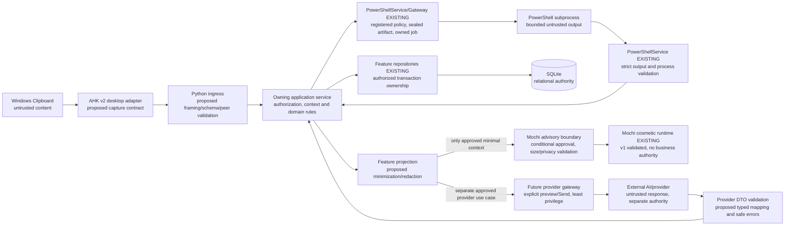

# F7Hub Phase 0B

## Cross-Subsystem Planning Note

Add shared rules for schema_version, producer/consumer ownership, correlation IDs, ticket_id, session_id, atomic replacement, explicit null/unknown semantics, stale-state detection, and event/result separation

# Global JSON & Interoperability Contract Planning Instructions
Inventory of existing JSON, DTO, protocol and IPC structures; producer/consumer matrix; common envelope; command/query/event/result/error semantics; message IDs and correlation; timestamp rules; naming and serialization rules; versioning and backwards compatibility; common error/status vocabulary; PowerShell structured-output contract; AHK/Python contract boundary; Mochi context/action contracts; transport comparison; local IPC security; contract test strategy; schema/fixture strategy.

## Existing Interoperability Inventory

### AltF7Hub
Current transport:
Current message format:
Current producer:
Current consumer:
Validation:
Error behavior:
Versioning:
Tests:

### Mochi
Current transport:
Current protocol:
Current producer:
Current consumer:
Validation:
Versioning:
Tests:

### PowerShell
Invocation mechanism:
Input model:
stdout model:
stderr model:
exit-code semantics:
structured result model:
tests:

### Other Existing Contracts
...


## Mode

`@ARCHITECT @PLAN`

Architecture and contract design only.

Do not implement production code.

Do not create IPC servers.

Do not create PowerShell scripts.

Do not create AHK transport code.

Do not create SQLite migrations.

Do not refactor unrelated components.

Do not select a major transport mechanism without documenting alternatives and consequences.

---

# 1. Objective

Design the Global F7Hub Interoperability Contract Architecture.

The purpose is to define how structured information is exchanged safely and consistently between:

```text
Python
PySide6
AutoHotkey v2
PowerShell
Mochi
Clipboard
Diagnostic Engine
Automation
future F7Hub integrations
```

The result must establish a common communication language before individual feature contracts are implemented.

The architecture must prevent every subsystem from inventing its own incompatible JSON conventions.

---

# 2. Relationship to Phase 0A

Phase 0A established the Master Foundation Architecture.

Phase 0B must operate inside those approved boundaries.

Before designing contracts:

1. Read the approved Phase 0A Master Foundation Architecture.
2. Inspect relevant current F7Hub code and documentation.
3. Identify any existing JSON conventions.
4. Identify existing PowerShell result formats.
5. Identify existing Python models or DTOs.
6. Identify existing IPC mechanisms.
7. Identify existing script-registry conventions.
8. Identify current error-handling patterns.
9. Reuse existing conventions when they remain suitable.

Do not assume that F7Hub currently has no interoperability conventions.

If something was not inspected, state:

```text
NOT VERIFIED
```

---

# 3. Primary Contract Principle

Separate:

```text
WHAT IS COMMUNICATED
```

from:

```text
HOW IT IS TRANSPORTED
```

The JSON contract defines:

```text
structure
meaning
validation
version
identity
context
errors
results
security expectations
```

The transport defines:

```text
how bytes move
```

Possible transports may eventually include:

```text
localhost HTTP
Named Pipes
local sockets
stdin/stdout
process execution
file exchange
```

A contract should not be redesigned merely because transport changes.

---

# 4. Contract Architecture Goal

Preferred conceptual structure:

```text
F7Hub Interoperability Contract
│
├── Common Envelope
│
├── Common Metadata
│
├── Common Context
│
├── Common Error Model
│
├── Common Status Model
│
├── Common Execution Metadata
│
│
├── Clipboard Contracts
├── Diagnostic Contracts
├── Automation Contracts
├── PowerShell Result Contracts
├── Mochi Context Contracts
└── Application/Event Contracts
```

Feature-specific payloads should reuse the common foundation.

---

# 5. Do Not Create One Giant Universal Payload

Avoid:

```json
{
  "clipboard": {},
  "ticket": {},
  "diagnostic": {},
  "powershell": {},
  "analytics": {},
  "mochi": {},
  "automation": {},
  "everything_else": {}
}
```

Instead use:

```text
Common Envelope
       +
Domain-Specific Payload
```

For example:

```text
Envelope
    ↓
clipboard.capture payload
```

or:

```text
Envelope
    ↓
diagnostic.result payload
```

This preserves strong boundaries.

---

# 6. Contract Families to Design

Phase 0B must define the architecture for at least these contract families.

## Clipboard

```text
clipboard.capture
clipboard.process
clipboard.result
clipboard.action_request
clipboard.action_result
```

## Diagnostics

```text
diagnostic.request
diagnostic.started
diagnostic.result
diagnostic.failed
diagnostic.cancelled
```

## PowerShell

```text
powershell.execution_request
powershell.execution_result
```

PowerShell should preferably sit behind approved diagnostic or automation abstractions rather than become a public arbitrary-command interface.

## Automation

```text
automation.request
automation.started
automation.result
automation.failed
```

## Mochi

```text
mochi.context
mochi.message
mochi.action_request
mochi.action_result
```

## General Application Events

Potential examples:

```text
application.event
context.updated
ticket.selected
clipboard.selected
diagnostic.selected
```

The final naming convention must be recommended during this planning phase.

---

# 7. Message Classes

Classify every contract as one of:

```text
COMMAND
QUERY
EVENT
RESULT
ERROR
```

## Command

Requests an intentional action.

Example:

```text
diagnostic.run
```

## Query

Requests information without changing operational state.

Example:

```text
clipboard.lookup
```

## Event

Reports something that already occurred.

Example:

```text
clipboard.captured
```

## Result

Returns the outcome of an earlier request.

Example:

```text
diagnostic.result
```

## Error

Communicates contract or execution failure.

Example:

```text
contract.validation_failed
```

The plan must define which classes require responses.

---

# 8. Recommended Common Envelope

Evaluate an envelope concept similar to:

```json
{
  "contract_version": "1.0",
  "message_id": "uuid",
  "message_type": "command",
  "event": "clipboard.process",
  "timestamp": "2026-10-04T23:30:00-04:00",
  "source": {},
  "context": {},
  "payload": {}
}
```

Do not treat this exact shape as approved automatically.

Phase 0B must evaluate and refine it.

---

# 9. Required Common Envelope Fields

Determine whether every message requires:

```text
contract_version
message_id
message_type
event / operation
timestamp
source
payload
```

Determine which fields are optional:

```text
correlation_id
causation_id
context
target
metadata
trace
```

Avoid adding fields without a clear purpose.

---

# 10. Message Identity

Every message should have a unique identifier.

Recommended concept:

```text
message_id
```

Likely format:

```text
UUID
```

Example:

```text
f43cf246-5e9b-42a2-a867-b31db09c44dc
```

Use cases:

- logging
- troubleshooting
- duplicate detection
- response matching
- auditing

---

# 11. Correlation ID

For workflows involving multiple messages, define:

```text
correlation_id
```

Example:

```text
AHK capture
    ↓
Python classification
    ↓
Diagnostic request
    ↓
PowerShell result
    ↓
Mochi explanation
```

All may belong to one:

```text
correlation_id
```

This allows F7Hub to reconstruct the workflow.

---

# 12. Causation ID

Consider:

```text
causation_id
```

Example:

```text
Message A
clipboard.captured

causes

Message B
clipboard.process
```

Then:

```text
Message B.causation_id
=
Message A.message_id
```

This is especially useful for:

```text
debugging
automation tracing
audit
event-chain reconstruction
```

Phase 0B should determine whether F7Hub needs this now or should reserve it for later.

---

# 13. Timestamp Standard

All interoperable contracts should use one timestamp standard.

Recommended:

```text
ISO 8601
```

Example:

```text
2026-10-04T23:30:00-04:00
```

The plan must decide:

- whether messages preserve local timezone offsets
- whether persistence normalizes to UTC
- precision requirements
- whether durations use milliseconds

Avoid ambiguous timestamps such as:

```text
10/04/26 11:30
```

---

# 14. Source Metadata

Design a common `source` structure.

Potential fields:

```json
{
  "component": "altf7hub",
  "technology": "ahk_v2",
  "application": "OUTLOOK.EXE",
  "window_title": "Inbox - Outlook"
}
```

Different contracts may populate different fields.

Do not require source metadata that cannot reliably be obtained.

---

# 15. F7Hub Context

Contracts should be able to carry optional contextual identifiers without embedding entire domain records.

Possible context:

```json
{
  "ticket_id": 41872,
  "company_id": 42,
  "contact_id": 88,
  "device_id": 103,
  "clipboard_item_id": 901,
  "diagnostic_session_id": 55
}
```

Important rule:

```text
Context references identifiers.

Context should not become a copy
of the entire F7Hub database record.
```

This reduces payload size and stale duplicated state.

---

# 16. Context Ownership

Determine:

```text
who may add context
who may modify context
who validates context
```

Example:

AHK may provide:

```text
source application
active window
clipboard content
```

But should not be trusted to assert:

```text
company_id = 42
```

without Python validating that reference.

---

# 17. Payload Design

Each contract must define a specific payload schema.

Example conceptual clipboard payload:

```json
{
  "content": {
    "format": "text/plain",
    "value": "0x8004010F",
    "size_bytes": 10
  }
}
```

Example diagnostic request payload:

```json
{
  "diagnostic_key": "network.dns",
  "parameters": {
    "hostname": "microsoft.com"
  }
}
```

Different domain payloads should not share fields merely because they happen to be JSON.

---

# 18. Contract Naming Convention

Define one naming system.

Recommended candidate:

```text
domain.action
```

Examples:

```text
clipboard.capture
clipboard.classify
diagnostic.run
diagnostic.result
automation.run
mochi.context
```

Alternative:

```text
domain.resource.action
```

Example:

```text
diagnostic.dns.run
```

Phase 0B must evaluate the naming depth that best balances clarity and stability.

---

# 19. Versioning Strategy

Contract versioning must be planned before implementation.

Determine whether version lives:

```text
globally
per contract family
per schema
```

Candidate:

```json
{
  "contract_version": "1.0"
}
```

Versioning rules should define:

```text
PATCH
non-semantic documentation clarification

MINOR
backward-compatible optional additions

MAJOR
breaking structural/semantic change
```

Do not casually bump versions for every internal code change.

---

# 20. Backward Compatibility

Plan how older components behave when receiving:

```text
new optional fields
unknown fields
new enum values
unsupported major versions
```

Recommended principle:

```text
Unknown optional fields:
ignore safely where permitted.

Unsupported major version:
reject explicitly.
```

Do not silently interpret incompatible contracts.

---

# 21. Schema Validation

Every external or cross-language payload must be validated before domain use.

Conceptual boundary:

```text
AHK / PowerShell / external process
             ↓
        JSON payload
             ↓
       Schema Validation
             ↓
      Application Service
```

Not:

```text
External JSON
     ↓
Repository
```

Phase 0B should recommend the Python validation strategy.

Potential options include:

```text
dataclasses
Pydantic
JSON Schema
custom validation
```

Do not add a dependency without evaluating current F7Hub conventions.

---

# 22. JSON Schema

Evaluate whether formal JSON Schema definitions should become the language-neutral source of contract documentation.

Possible advantages:

```text
cross-language validation
documentation
test fixture generation
contract versioning
PowerShell validation
AHK interoperability reference
```

Potential cost:

```text
additional tooling
duplication with Python models
maintenance burden
```

Recommend whether F7Hub should use:

```text
JSON Schema
Python models only
hybrid approach
```

and explain why.

---

# 23. Serialization Rules

Define global serialization rules.

At minimum determine:

```text
UTF-8
null handling
empty strings
booleans
numbers
timestamps
enum casing
property naming
line endings
Unicode
```

Recommended property convention:

```text
snake_case
```

because Python and current database naming are likely to align naturally.

Do not mix:

```text
sourceApp
source_app
SourceApplication
```

without a deliberate boundary adapter.

---

# 24. Enum Conventions

Define consistent enum representation.

Recommended:

```text
UPPER_SNAKE_CASE
```

or:

```text
lower_snake_case
```

Choose one.

Example:

```text
SUCCESS
WARNING
FAILURE
```

or:

```text
success
warning
failure
```

Consistency matters more than the exact choice.

---

# 25. Status Model

Define whether all contract families share a minimal common status vocabulary.

Possible base:

```text
success
warning
failure
error
cancelled
timeout
```

Be careful:

```text
failure
```

may mean a valid diagnostic finding,

while:

```text
error
```

may mean the diagnostic itself could not execute.

Example:

```text
DNS Diagnostic

status = failure
```

could mean:

```text
DNS genuinely failed.
```

Whereas:

```text
status = error
```

could mean:

```text
PowerShell crashed before DNS could be tested.
```

This semantic distinction should be explicit.

---

# 26. Common Error Model

Design a standard error structure.

Conceptual example:

```json
{
  "error": {
    "code": "CONTRACT_VALIDATION_FAILED",
    "message": "Required property 'payload' is missing.",
    "details": {},
    "retryable": false
  }
}
```

Potential fields:

```text
code
message
details
retryable
origin
```

Do not expose:

```text
secrets
stack traces
full internal paths
credentials
```

to consumers unnecessarily.

---

# 27. Error Categories

Consider a stable set such as:

```text
CONTRACT_ERROR
VALIDATION_ERROR
SECURITY_ERROR
NOT_FOUND
CONFLICT
TIMEOUT
EXECUTION_ERROR
UNSUPPORTED_VERSION
PERMISSION_ERROR
INTERNAL_ERROR
```

Feature domains may define additional specific codes.

Avoid using free-form text as the only machine-readable failure indication.

---

# 28. PowerShell Result Contract

This deserves special care.

PowerShell scripts should ideally return machine-readable structured output.

Conceptual architecture:

```text
Python
  ↓
Approved Script Registry
  ↓
PowerShell
  ↓
JSON Result
  ↓
Schema Validator
  ↓
Diagnostic / Automation Service
```

The result should distinguish:

```text
execution metadata
status
findings
evidence
recommendations
warnings
errors
```

---

# 29. Diagnostic Findings

A Finding answers:

```text
What was discovered?
```

Conceptual structure:

```json
{
  "code": "DNS_RESOLUTION_FAILED",
  "severity": "warning",
  "title": "DNS resolution failed",
  "message": "The requested hostname could not be resolved."
}
```

Findings should be structured enough to:

```text
display
search
persist
aggregate
tag
analyze
```

---

# 30. Evidence

Evidence answers:

```text
What facts support the finding?
```

Example:

```json
{
  "query": "microsoft.com",
  "dns_server": "192.168.1.1",
  "response": null,
  "timeout_ms": 5000
}
```

Evidence should preserve factual output without mixing interpretation into it.

---

# 31. Recommendations

Recommendations answer:

```text
What might the technician consider next?
```

Example:

```json
{
  "priority": 1,
  "action_key": "compare_dns_configuration",
  "message": "Compare configured DNS servers with a working device."
}
```

Recommendations are not findings.

They must remain semantically separate.

---

# 32. Execution Metadata

Potential common execution structure:

```json
{
  "execution_id": "uuid",
  "started_at": "...",
  "completed_at": "...",
  "duration_ms": 742
}
```

Additional fields may include:

```text
script_id
script_version
runtime
host
exit_code
```

Only include fields relevant to the contract.

---

# 33. PowerShell stdout / stderr

Plan strict handling.

Preferred:

```text
structured JSON
```

should be distinct from:

```text
human-readable console output
debug output
stderr
```

A script writing decorative text around JSON can corrupt machine parsing.

The planning document must define conventions such as:

```text
stdout = contract JSON only
stderr = diagnostic/process errors
```

if compatible with current architecture.

---

# 34. Clipboard Contract

Clipboard contracts should support:

```text
raw clipboard text
source metadata
capture method
requested action
context
```

Example conceptual request:

```json
{
  "contract_version": "1.0",
  "message_id": "uuid",
  "message_type": "command",
  "operation": "clipboard.process",
  "timestamp": "...",
  "source": {
    "component": "altf7hub",
    "application": "powershell.exe"
  },
  "payload": {
    "content": {
      "format": "text/plain",
      "value": "Get-Service Spooler"
    }
  }
}
```

The detailed Clipboard schema can later be refined during Clipboard architecture planning.

---

# 35. Clipboard Result

Conceptually:

```json
{
  "classification": {
    "primary_kind": "powershell_command",
    "confidence": 1.0
  },
  "entities": [],
  "suggested_tags": [],
  "available_actions": []
}
```

Phase 0B should define the boundary, not the entire future taxonomy.

Entity and Tag vocabularies belong primarily to Phase 0C.

---

# 36. Avoid Contract/Taxonomy Coupling

The contract should be able to carry:

```text
entity_type_key
tag_key
primary_kind
```

without embedding the complete taxonomy definition.

Example:

```json
{
  "entity_type_key": "ipv4",
  "value": "10.0.0.87"
}
```

not:

```json
{
  "entity_type": {
    "key": "ipv4",
    "display_name": "IPv4 Address",
    "family": "network",
    "description": "...",
    "all_related_tags": []
  }
}
```

Contracts should transmit references and required facts, not duplicate catalog data.

---

# 37. Mochi Context Contract

Mochi should receive a curated context object.

Avoid:

```text
dump entire database record
dump entire Clipboard history
dump full raw logs
```

Prefer:

```json
{
  "ticket": {
    "ticket_id": 41872,
    "summary": "Outlook cannot send"
  },
  "clipboard": {
    "kind": "smtp_error",
    "entities": []
  },
  "diagnostic": {
    "status": "warning",
    "findings": []
  }
}
```

The plan must define:

```text
what Mochi may receive
what must be redacted
what is optional
what has size limits
```

---

# 38. Mochi Action Contract

Mochi should request actions through structured contracts.

Example:

```json
{
  "operation": "diagnostic.run",
  "payload": {
    "diagnostic_key": "network.dns"
  }
}
```

Mochi should not produce:

```text
"Run this arbitrary PowerShell command..."
```

that is automatically executed.

All actions must pass normal F7Hub service/security boundaries.

---

# 39. Automation Contract

Automation requests need clear ownership.

Conceptually:

```text
automation.request
```

may specify:

```text
automation_key
approved parameters
context
```

It must never become:

```text
arbitrary executable content
```

Avoid:

```json
{
  "command": "whatever the caller wants"
}
```

Prefer:

```json
{
  "automation_key": "network.flush_dns",
  "parameters": {}
}
```

where the key maps to an approved registry entry.

---

# 40. Request / Response Pattern

Define how synchronous requests correlate with results.

Example:

```text
Request:
message_id = A

Response:
correlation_id = A
```

or another clearly documented convention.

Do not make each integration invent response matching.

---

# 41. Event Pattern

Events should describe completed facts.

Example:

```text
clipboard.captured
```

means:

```text
the capture happened
```

not:

```text
please capture something
```

That would instead be a command.

This distinction should be enforced in naming conventions.

---

# 42. Asynchronous Operations

Some operations may take longer:

```text
diagnostics
PowerShell
automation
large parsing tasks
```

The contract architecture should support:

```text
request
started
progress optional
completed
failed
cancelled
```

without requiring progress messages for every operation.

---

# 43. Cancellation

Determine how cancellable operations are represented.

Potential command:

```text
diagnostic.cancel
```

with:

```text
execution_id
```

Define what cancellation means:

```text
requested
acknowledged
completed
```

Do not assume process termination equals safe cancellation.

---

# 44. Idempotency

Consider which commands should be safe against accidental duplicates.

For example:

```text
clipboard.process
```

may be naturally idempotent if keyed by:

```text
content_hash
```

But:

```text
automation.execute
```

may not be.

Determine whether certain requests need:

```text
idempotency_key
```

or whether message IDs plus service-level protections are sufficient.

---

# 45. Duplicate Message Handling

AHK or IPC retries could result in duplicate messages.

Plan how F7Hub detects:

```text
same message_id received twice
```

Possible behavior:

```text
return original result
ignore duplicate event
reject duplicate
```

depending on message class.

---

# 46. Payload Size Limits

Define architectural limits.

Especially relevant for:

```text
Clipboard
logs
PowerShell output
diagnostic evidence
Mochi context
```

Phase 0B should recommend:

```text
global maximum
contract-specific maximum
large-content strategy
```

For example:

```text
inline content
preview only
external managed file reference
```

Do not pass unbounded multi-megabyte content through every layer.

---

# 47. Large Content References

Future contracts may need to reference rather than embed large content.

Conceptual structure:

```json
{
  "content_reference": {
    "type": "managed_file",
    "id": "..."
  }
}
```

Do not design the entire file-storage system here.

Identify the boundary and defer implementation.

---

# 48. Sensitive Content

Contracts must support privacy handling.

Clipboard and Mochi flows especially may encounter:

```text
passwords
tokens
MFA codes
API keys
private keys
connection strings
PII
customer data
```

Plan:

```text
sensitivity classification
redaction indicators
blocked payload behavior
audit behavior
```

Never automatically route secrets to Mochi or future cloud AI.

---

# 49. Trust Boundary

Treat these producers as untrusted until validated:

```text
AHK
PowerShell
clipboard content
external APIs
imported files
future plugins
AI output
```

Even localhost traffic must be validated.

Local does not equal trusted.

---

# 50. Local IPC Security

If a localhost bridge is later selected, the contract plan should identify security requirements such as:

```text
bind only to loopback
authentication token
action allowlist
payload limits
rate limits
schema validation
no arbitrary execution endpoint
audit logging
```

Do not implement the transport in this phase.

---

# 51. Contract Registry

Consider a central contract inventory.

Conceptually:

```text
Contracts/
├── common/
├── clipboard/
├── diagnostics/
├── automation/
└── mochi/
```

or whatever location matches the inspected architecture.

Possible contents:

```text
schema
examples
version history
documentation
```

Exact repository location must follow current conventions.

---

# 52. Contract Documentation

Every contract should eventually document:

```text
name
purpose
producer
consumer
message class
schema version
required fields
optional fields
validation
size limits
security classification
expected responses
error codes
example payload
```

This prevents hidden assumptions.

---

# 53. Contract Test Fixtures

Plan reusable fixtures.

Example:

```text
valid/
clipboard_capture_basic.json

invalid/
clipboard_capture_missing_payload.json

compatibility/
clipboard_capture_v1_optional_field.json
```

These can later be consumed by:

```text
Python tests
PowerShell tests
AHK integration tests
```

---

# 54. Cross-Language Contract Tests

Future validation should confirm:

```text
AHK produces valid contract
Python consumes it

Python produces valid result
AHK consumes it

Python launches PowerShell
PowerShell returns valid result
Python validates it
```

Contract compatibility should become independently testable.

---

# 55. PowerShell Contract Tests

Future tests should cover:

```text
valid result
warning result
diagnostic failure
execution error
timeout
invalid JSON
missing field
wrong contract version
extra optional field
Unicode content
large evidence payload
```

---

# 56. Clipboard Contract Tests

Future tests should cover:

```text
plain text
URL
PowerShell command
large content
Unicode
empty clipboard
invalid encoding
secret-like content
duplicate message
unknown optional field
unsupported major version
```

---

# 57. Logging

Determine what contract metadata is appropriate for logs.

Safe candidates:

```text
message_id
correlation_id
contract name
version
status
duration
source component
```

Avoid blindly logging:

```text
clipboard payload
tokens
customer data
PowerShell evidence
Mochi context
```

Logging policy must respect sensitivity.

---

# 58. Observability

The contract architecture should make future troubleshooting possible.

A diagnostic flow might be traceable:

```text
Clipboard Capture
message_id A
        ↓
Classification
message_id B
correlation A
        ↓
Diagnostic
message_id C
correlation A
        ↓
PowerShell
execution X
        ↓
Result
message_id D
correlation A
```

This is especially useful when diagnosing cross-language failures.

---

# 59. Persistence Boundary

Do not automatically persist every contract.

Contracts are communication objects.

Domain repositories decide what becomes durable.

Example:

```text
clipboard.capture contract
        ↓
ClipboardService
        ↓
validation
        ↓
Clipboard domain model
        ↓
Repository
```

Do not store raw interchange messages as the primary domain model unless explicitly justified.

---

# 60. Domain Model ≠ Transport DTO

The plan must explicitly distinguish:

```text
Transport DTO
```

from:

```text
Domain Model
```

For example:

```text
ClipboardCaptureRequest
```

is not automatically the same object as:

```text
ClipboardItem
```

This prevents transport concerns from leaking into the domain.

---

# 61. Analytics Boundary

Statistical Analytics should consume persisted domain facts.

Avoid making analytics depend directly on transient IPC payloads.

Preferred:

```text
JSON
 ↓
Application Service
 ↓
Domain
 ↓
SQLite
 ↓
Analytics
```

Not:

```text
JSON event
 ↓
Analytics calculates permanent truth immediately
```

unless a future event architecture explicitly requires it.

---

# 62. Tag and Entity Boundary

Phase 0B should only define how contracts carry taxonomy references.

Example:

```json
{
  "entity_type_key": "ipv4",
  "normalized_value": "10.0.0.87",
  "confidence": 1.0
}
```

and:

```json
{
  "tag_key": "networking",
  "confidence": 0.97,
  "source": "RULE"
}
```

The authoritative catalog definitions belong to Phase 0C.

---

# 63. Settings Boundary

Some contract behavior may depend on Settings.

Examples:

```text
payload size limits
clipboard capture enabled
Mochi enabled
diagnostic timeout
```

Contract schemas should not embed configuration values unnecessarily.

Services resolve current settings.

---

# 64. AHK Responsibilities

AHK should generally:

```text
capture
package
send
receive
display quick result
perform allowed UI actions
```

AHK should not:

```text
perform domain validation
write SQLite
decide taxonomy truth
interpret complex diagnostic evidence
```

The contract design should keep AHK payload generation reasonably simple.

---

# 65. Python Responsibilities

Python should generally:

```text
validate
normalize
authorize
route
orchestrate
convert DTO → domain
convert domain result → response DTO
```

Python becomes the primary contract boundary inside F7Hub.

---

# 66. PowerShell Responsibilities

PowerShell should:

```text
receive approved parameters
execute approved task
return structured results
```

PowerShell should not:

```text
invent ticket workflow
write arbitrary F7Hub DB records
control Mochi
define global taxonomy
```

---

# 67. Mochi Responsibilities

Mochi should consume:

```text
curated context
structured findings
approved recommendations
historical insights
```

and produce:

```text
messages
explanations
optional action requests
```

not unrestricted executable instructions.

---

# 68. Transport Evaluation

Phase 0B should compare likely transport mechanisms.

At minimum evaluate:

| Transport | Strengths | Weaknesses | Likely Use |
|---|---|---|---|
| localhost HTTP | simple/debuggable | listener/security overhead | AHK ↔ Python |
| Named Pipes | Windows-native/local | more implementation complexity | local IPC |
| stdin/stdout | simple process boundary | request-oriented only | Python ↔ PowerShell |
| file exchange | easy prototype | latency/race/cleanup problems | generally avoid for live IPC |

Do not select a transport solely because one snippet is easy to write.

---

# 69. Likely Transport Direction

Evaluate whether F7Hub should eventually use different transports for different boundaries.

Example:

```text
AHK ↔ Python
Named Pipe or localhost service

Python → PowerShell
process invocation + structured stdout

PySide6 ↔ Python
in-process service calls
```

A single transport is not required everywhere.

The contract conventions can remain shared.

---

# 70. Contract Evolution

Define how contract changes are proposed.

Recommended process:

```text
Need identified
    ↓
Contract change proposed
    ↓
Compatibility reviewed
    ↓
Schema updated
    ↓
Fixtures updated
    ↓
Producer tests
    ↓
Consumer tests
    ↓
Documentation updated
```

Do not allow silent schema drift.

---

# 71. Contract Ownership

Recommend an owner for global interoperability conventions.

Conceptually:

```text
F7Hub Application / Infrastructure Boundary
```

Individual modules own their payload semantics.

Example:

```text
Clipboard module owns clipboard payload fields.

Global contract architecture owns:
versioning
envelope
errors
timestamps
identity
common conventions
```

---

# 72. Contract Registry Table?

Evaluate whether contract definitions need SQLite persistence.

Default recommendation should probably be:

```text
No.
```

Contract schemas are application/versioned source artifacts, not user data.

Only choose database persistence if a concrete requirement exists.

---

# 73. Contract Security Classification

Consider documenting contract sensitivity:

```text
PUBLIC_LOCAL
INTERNAL
SENSITIVE
SECRET_POSSIBLE
```

or a simpler model.

This could influence:

```text
logging
persistence
Mochi eligibility
analytics eligibility
```

Do not over-engineer if sensitivity is already governed elsewhere.

---

# 74. Required Contract Matrix

Produce a matrix like:

| Contract | Class | Producer | Consumer | Sync/Async | Sensitive? |
|---|---|---|---|---|---|
| clipboard.capture | Event | AHK | Python | Async | Possible |
| clipboard.process | Command | AHK/PySide6 | Python | Request | Possible |
| diagnostic.run | Command | Python/UI | Diagnostic Service | Async | Contextual |
| diagnostic.result | Result | Diagnostic Service | UI/Ticket/Mochi | Async | Possible |
| powershell.result | Result | PowerShell | Python | Request | Possible |
| mochi.context | Context | Python | Mochi | Request | Yes |

Do not populate unverified producers/consumers as FACT.

Use recommendations where appropriate.

---

# 75. Required Sequence Diagrams

Produce conceptual sequence diagrams for at least:

## AHK Clipboard Flow

```text
Windows
→ AHK
→ Python
→ ClipboardService
→ response
→ AHK HUD
```

## Clipboard → Diagnostic Flow

```text
Clipboard Center
→ DiagnosticService
→ PowerShell
→ DiagnosticService
→ SQLite
→ Diagnostic Center
```

## Diagnostic → Mochi Flow

```text
Diagnostic Center
→ ContextService
→ Mochi
→ message
```

## Contract Failure Flow

```text
Producer
→ Validator
→ rejection
→ structured error
```

Use Mermaid if existing project documentation supports it.

---

# 76. Required Trust Diagram

Map:

```text
Windows Clipboard
AHK
Python boundary
PowerShell subprocess
SQLite
Mochi
future AI
```

Mark where:

```text
validation
authorization
redaction
persistence
```

occur.

---

# 77. Required Decision Register

At minimum evaluate these decisions:

```text
Common envelope?
Version format?
Naming convention?
Timestamp convention?
Enum convention?
Formal JSON Schema?
Validation library?
Correlation IDs?
Causation IDs?
Idempotency support?
Large-payload handling?
PowerShell stdout convention?
Local IPC transport?
Mochi context limits?
Error taxonomy?
```

For each:

```text
Decision
Status
Options
Recommendation
Reason
Consequences
Deferred work
```

Statuses:

```text
RECOMMENDED
REQUIRES USER DECISION
DEFERRED
NOT VERIFIED
```

---

# 78. Decisions That Should Likely Be Made Now

Phase 0B should aim to settle:

```text
contract naming convention
common envelope
message identity
timestamps
versioning model
error structure
status semantics
serialization conventions
validation boundary
PowerShell structured-output rule
contract/domain separation
security principles
```

---

# 79. Decisions That May Be Deferred

Likely candidates:

```text
final AHK ↔ Python transport
progress-message protocol
large-file reference implementation
future plugin contract
remote/cloud transport
AI provider contracts
binary clipboard contract
```

The report should confirm whether these can safely remain deferred.

---

# 80. Acceptance Criteria

The Phase 0B plan is acceptable when:

1. Existing interoperability mechanisms have been inspected.
2. Existing JSON structures have been inventoried.
3. Contract and transport are clearly separated.
4. A common envelope has been recommended or explicitly rejected with rationale.
5. Contract naming conventions are defined.
6. Versioning rules are defined.
7. Message identity rules are defined.
8. Request/result correlation is defined.
9. Error semantics are defined.
10. Status semantics are defined.
11. Serialization conventions are defined.
12. Validation ownership is defined.
13. PowerShell result requirements are defined.
14. AHK responsibilities are constrained.
15. Mochi action boundaries are constrained.
16. Clipboard contract boundaries are defined.
17. Large and sensitive payload handling is addressed.
18. Security/trust boundaries are mapped.
19. Contract families are inventoried.
20. Future compatibility strategy is documented.
21. Contract tests are planned.
22. No implementation has occurred.
23. Phase 0C can safely build taxonomy contracts on top of this architecture.

---

# 81. Validation Status

Final validation must include:

```text
Repository inspection                PASS / FAIL / BLOCKED
Existing contract inventory          PASS / FAIL / BLOCKED
Envelope architecture                PASS / FAIL / BLOCKED
Versioning model                     PASS / FAIL / BLOCKED
Error/status semantics               PASS / FAIL / BLOCKED
PowerShell contract boundary         PASS / FAIL / BLOCKED
AHK contract boundary                PASS / FAIL / BLOCKED
Mochi security boundary              PASS / FAIL / BLOCKED
Payload/privacy review               PASS / FAIL / BLOCKED
Compatibility review                 PASS / FAIL / BLOCKED
Scope control                        PASS / FAIL / BLOCKED
Production code modifications        MUST BE NONE
Database modifications               MUST BE NONE
```

---

# 82. Required Final Report

Return the report in this order:

## Summary

Overall recommended interoperability architecture.

## Inspected Current State

Existing mechanisms and conventions found in F7Hub.

## Contract Principles

Global invariants.

## Common Envelope

Recommended common fields and responsibilities.

## Message Classes

Commands, queries, events, results, errors.

## Contract Families

Clipboard, Diagnostics, PowerShell, Automation, Mochi, Application.

## Status and Error Model

Shared semantics.

## Versioning & Compatibility

Evolution rules.

## Serialization Rules

JSON conventions.

## Security & Privacy

Trust boundaries and sensitive content handling.

## PowerShell Contract

Structured result requirements.

## AHK Contract

Producer/consumer responsibilities.

## Mochi Contract

Context and action boundaries.

## Contract Matrix

Producer/consumer mapping.

## Transport Evaluation

Options and deferred decisions.

## Sequence Diagrams

Primary interoperability workflows.

## Testing Strategy

Contract validation and cross-language compatibility.

## Decision Register

Approved recommendations, unresolved decisions, deferred choices.

## Risks

Contract drift, coupling, security, incompatible producers, large payloads, schema duplication.

## Phase 0C Inputs

Explicitly list what the Classification & Taxonomy architecture may now rely on.

## Result

Return exactly one:

```text
READY_FOR_TAXONOMY_DESIGN
REQUIRES_CONTRACT_DECISIONS
BLOCKED
```

Do not return:

```text
READY_FOR_IMPLEMENTATION
```

Phase 0B remains a foundation architecture task.

                 F7Hub Contract Layer
                        │
       ┌────────────────┼────────────────┐
       │                │                │
      AHK             Python         PowerShell
       │                │                │
       └──────── structured JSON ────────┘
                        │
                 Application Services
                        │
          ┌─────────────┼─────────────┐
          │             │             │
      Clipboard     Diagnostics     Automation
                                      │
                                   Mochi

I would not require every F7Hub JSON document to have ticket_id or session_id.
Instead, the grammar should say:
When a JSON contract is ticket-bound, the stable F7Hub ticket ID must be explicit.

And:
When a contract is session-bound, the stable session ID must be explicit.

Other global concepts worth moving upward:
schema versioning
UTF-8
producer ownership
consumer ownership
atomic file replacement
unsupported-version behavior
nullable vs missing fields
timestamps
stable identifiers
correlation
stale-state handling
temporary vs durable state

Particularly important
DynamicHub also revealed:
event ≠ result

That distinction should probably become global.
Diagnostics, Analytics, DynamicHub and Mochi could all eventually produce events.

---

## External Integration and Offline Interoperability Constraints

### Internal Contract vs Vendor Contract

The F7Hub interoperability grammar is an internal architectural contract.

Do not treat an external vendor's JSON schema as the F7Hub domain model.

Preferred conceptual boundary:

External API
→ Provider Gateway / Adapter
→ validated provider DTO
→ F7Hub application/domain representation

Vendor-specific payloads must not leak unnecessarily into GUI, domain,
database or unrelated modules.

### Vendor Neutrality

The global interoperability contract must not require any specific:

- PSA
- RMM
- credential manager
- Microsoft administration platform
- AI provider

Provider-specific adapters may be added later.

### Offline Behavior

Interoperability planning must distinguish operations that:

- execute locally;
- may be delayed until connectivity returns;
- require current online state and must not be replayed later.

Delayed synchronization must consider:

- message identity;
- correlation;
- idempotency;
- confirmation of remote success;
- retryability;
- stale-state detection;
- duplicate prevention.

Do not assume that state-changing technical actions are safe to queue.

Examples such as device restart, account disablement, password reset or
remediation execution should normally require fresh context and renewed
authorization rather than automatic delayed replay.

### Secret Handling

Global JSON envelopes, diagnostic results, errors and logs must not
contain credential material unless a narrowly scoped approved contract
explicitly requires secure handling.

Do not place authentication secrets in:

- ordinary payload examples;
- schema fixtures;
- debug logs;
- error details;
- correlation metadata.

Use synthetic values in architecture documentation and tests.

### Capability Discovery

Where appropriate, integrations should expose approved capabilities
rather than forcing callers to assume provider permissions.

Examples:

- READ_TICKET
- WRITE_TICKET_NOTE
- READ_DEVICE
- RUN_APPROVED_AUTOMATION
- READ_TENANT
- USE_CREDENTIAL
- AI_SUMMARIZE

Exact capability vocabulary remains subject to architecture review.

A configured provider does not imply that every capability is available.

---

# EXECUTION REPORT

## Summary

RECOMMENDATION: new cross-boundary contracts use a small common envelope, explicit COMMAND/QUERY/EVENT/RESULT/ERROR semantics and feature-owned payloads. Preserve existing PowerShell schemaVersion 1, Mochi cosmetic protocol v1 and AltF7Hub show/focus v1. Adapt validated outcomes at application boundaries when a reviewed consumer needs the new grammar; do not rewrite narrow working contracts merely for naming consistency.

Date: 2026-10-07 (America/Toronto). This is Foundation 0B architecture design only. All new shapes/rules below are RECOMMENDATION awaiting independent architecture review and USER approval. FACT means inspected source/specification at the pinned base, not fresh runtime acceptance. INFERENCE is derived from evidence; ASSUMPTION is explicit; NOT VERIFIED identifies gaps. No production contract, schema file, test, transport, service, database or dependency was implemented. Original planning instructions above are preserved.

Approved [Phase 0A](<0A _Master_Foundation_Architectural_Contract.md#execution-report>) remains authority. 0A-D1 keeps interactive troubleshooting coordination with DynamicHub and diagnostic definitions/execution/results with Diagnostics through existing services/gateways. 0A-D2 preserves pre-ticket/ticketless local Case Journal work, optional Ticket association, reuse-first persistence and existing Ticket activity authority. No envelope universally requires a ticket/session. Local journal storage, drafts and editing remain independent of PSA and AI.

## Baseline

| Item | Observed value |
|---|---|
| Repository | `C:\Dev\F7Hub` |
| Starting branch | `main` |
| HEAD / base / local origin/main | `1a7015b500fc0eccbab749e82585c7936d5cb478` |
| Origin | `https://github.com/JDecelles1990/F7Hub.git` |
| Initial status / untracked / diff against origin/main | All empty; baseline gate PASS |
| Authorized branch created | `docs/foundation-0b-execution-20261007`; existing checkout, no additional worktree |
| Authorized edit | This document only, appended report; unstaged |
| Original file identity | 44,131 bytes; SHA-256 `35253f8b147cb8fe05b8419ae31c6f6a2b93406312a4f03302e76df5acfae268`; Git blob `1e8092ca204bf275f478473a9dc2c59a5d59fa83` |
| Remote freshness | Local origin/main inspected; no fetch/live remote-ref query. Remote server freshness NOT VERIFIED. |

Executed initial gate: `git branch --show-current`, `git rev-parse HEAD`, `git rev-parse origin/main`, `git status --short`, `git diff --name-status origin/main --`, `git ls-files --others --exclude-standard`; remote configuration and index also inspected.

During read-only inspection, status briefly reported untracked `AutoHotkey/New shortcut.lnk`. Work paused; it disappeared before metadata capture. The agent took no action on it; cause/content NOT VERIFIED. A complete subsequent gate confirmed clean status, no untracked files, empty tracked diff and unchanged HEAD/origin/main before report editing resumed. This transient state is not part of the candidate.

A later resume check found untracked `AutoHotkey/Troubleshooting_Sections/GuideSettings.ini`. Further edits paused until the user explicitly instructed finishing this report while preserving that file exactly as found, taking no management action, excluding it from the candidate and disclosing its final untracked status. The agent did not read its contents or modify/delete/restore/stage/commit/manage it. Its creator/content/runtime changes are NOT VERIFIED. This authorized protected-state exception does not invalidate the clean initial gate and does not make it Phase 0B work.

## Repository Areas Inspected

Instruction chain: root AGENTS.md/ROOT.md, documentation index routing, Planning/Foundation guidance, original 0B requirements and approved 0A execution/decision/downstream sections. PowerShell, AltF7Hub and Mochi scoped instructions explicitly read before source. Project skill inventory contained vertical-slice-delivery; applicability inspected. Implementation/slice lifecycle machinery was not applied to documentation-only architecture. No subagent/independent review was performed.

Evidence keys refer to current source and named symbols at the base. Test sources were inspected for coverage intent; all referenced suites are NOT RUN here. Existence of assertions does not establish PASS.

| Key | Inspected evidence | FACT / limit |
|---|---|---|
| E01 | [bootstrap](../../../Python/f7hub/app/bootstrap.py), ApplicationContext/bootstrap_application; [runner](../../../Python/f7hub/gui/service_task_runner.py), submit/_finished; MainWindow action/workspace composition | In-process dependency construction and finite threaded service calls; ApplicationContext is not shared active-record selection. |
| E02 | [diagnostic models](../../../Python/f7hub/domain/diagnostic_results.py) | Frozen process/diagnostic/run/pack dataclasses; execution classification separate from collection severity; results in memory. |
| E03 | [PowerShellService](../../../Python/f7hub/services/powershell_service.py), eligible/_execute_member/_decode_output/validators/execute_diagnostic_pack | Literal three-operation policy; strict output validation; valid collection ERROR completes, execution failure aborts pack. |
| E04 | [gateway](../../../Python/f7hub/infrastructure/powershell_gateway.py), execute/_run/LAUNCHER; [Windows execution](../../../Python/f7hub/infrastructure/windows_execution.py), SealedScript/protected_read | Private verified artifact, trusted non-elevated 64-bit PowerShell 7, owned Job Object and bounded capture/deadline/cleanup; no caller-command endpoint. |
| E05 | [System](../../../PowerShell/Diagnostics/Get-SystemSnapshot.ps1), [Network](../../../PowerShell/Diagnostics/Get-NetworkSnapshot.ps1), [Services](../../../PowerShell/Diagnostics/Get-ServicesSnapshot.ps1) | Actual parameterless schemaVersion 1 producers; one JSON document; PASS/WARNING exit 0 and ERROR exit 1. |
| E06 | [ScriptService](../../../Python/f7hub/services/script_service.py), prepare_verified_script/_resolve_script_reference; [ScriptRecord](../../../Python/f7hub/repositories/script_repository.py) | Typed registry metadata, guarded paths and exact-source verification; catalog availability/visibility does not authorize execution. |
| E07 | [Mochi protocol](../../../Python/f7hub/domain/mochi_protocol.py), encode/decode/validators/Framer | Pure bounded cosmetic v1 grammar, exact fields, strict identifiers/enums, LF framing. |
| E08 | [channel](../../../Python/f7hub/infrastructure/mochi_channel.py), CheckoutIdentity/Channel; [gateway](../../../Python/f7hub/infrastructure/mochi_gateway.py), _request/_response/_uncertain; [service](../../../Python/f7hub/services/mochi_service.py) | User/checkout names, request/runtime/generation matching, bounded attach/startup, UNCERTAIN without mutation replay. |
| E09 | [LocalController](../../../Mochi/src/mochi/integrations/local_server.py), enqueue/drain/reply/broadcast; [IPC specification](../../../Mochi/docs/IPC.md) | UserAccessOption, registered controllers, bounded queues, last-request guard and unsolicited STATE; cosmetic only. |
| E10 | [Alt gateway](../../../Python/f7hub/infrastructure/altf7hub_gateway.py), show_guide; AltF7HubService; [GuideRequest](../../../AutoHotkey/Troubleshooting_Sections/GuideRequest.ahk), RequestGuideUnlocked; [GuideHost](../../../AutoHotkey/Troubleshooting_Sections/GuideHost.ahk), HandleGuideShowRequest; shared host/client entry | Fixed Windows-message show/focus plus text outcome; no JSON/context/general RPC. |
| E11 | [Mochi config](../../../Mochi/src/mochi/core/config.py), load_settings; settings.json; [config tests](../../../Mochi/tests/test_config.py) | Read-only bounded JSON settings with safe defaults; unknown settings preserved; no schema version or business-capability enablement. |
| E12 | [TicketService](../../../Python/f7hub/services/ticket_service.py), change_status/_append_note/timestamp; [ticket records](../../../Python/f7hub/repositories/ticket_repository.py); [activity tests](../../../Tests/Database/test_ticket_activity_service.py) | Feature-owned persisted metadata JSON, integer identities, UTC timestamps and atomic activity; no universal event wire grammar. |
| E13 | [service tests](../../../Tests/PowerShell/test_powershell_service.py); [pack tests](../../../Tests/PowerShell/test_diagnostic_pack.py); snapshot producer tests; [Windows tests](../../../Tests/PowerShell/test_windows_execution.py); [workflow tests](../../../Tests/Integration/test_script_execution_workflow.py) | Assertions for contract negatives, fixture-to-validator compatibility, containment/cleanup and database preservation; source inspection only. |
| E14 | [local control tests](../../../Mochi/tests/test_local_control.py); GUI Mochi tests; [Alt launch tests](../../../Tests/Integration/test_altf7hub_launch.py); AHK host/request-failure tests | Round-trip/invalid/frame/queue/lost-ACK/stale-generation and fixed-launch/no-retry assertions; source inspection only. |
| E15 | [system architecture](../../06_SystemArchitecture.md) §§20–21/53–55; [PowerShell architecture](../../12_PowerShellArchitecture.md) current slices/§§30–35; [Python architecture](../../13_PythonArchitecture.md) §§44/100–103; AHK architecture current bridge; [design principles](../../14_DesignPrinciples.md) §§110–112; Mochi README/spec/Architecture | Intended layering/DTO/events/dependency boundaries; historical candidate prose is not fresh implementation verification. |
| E16 | [requirements](../../../requirements.txt); tracked-file/serialization searches in Python/PowerShell/Mochi/AHK/Tools and Config/Plugins where present | Only declared production dependency is PySide6 6.11.2. No declared Pydantic/JSON Schema validator or implemented global envelope found in searched runtime areas. |

Searches used `rg --files`/`rg` for dataclasses, JSON parsing/serialization, versions, sockets/messages, identities/timestamps and Clipboard/context/journal/DynamicHub/automation/outbox/provider paths. Other located serialization: ScriptWorkspace pretty-prints validated diagnostic data; presentation is not IPC. Missing source matches do not establish absence of external installations. No operational database, live clipboard, secrets or customer records were inspected.

Official primary references verified 2026-10-07: [RFC 8259 JSON](https://www.rfc-editor.org/rfc/rfc8259), [RFC 3339 timestamps](https://www.rfc-editor.org/rfc/rfc3339), [JSON Schema core](https://json-schema.org/draft/2020-12/json-schema-core), [validation vocabulary](https://json-schema.org/draft/2020-12/json-schema-validation), [Qt 6.11 QLocalServer](https://doc.qt.io/qt-6.11/qlocalserver.html), [ConvertTo-Json](https://learn.microsoft.com/en-us/powershell/module/microsoft.powershell.utility/convertto-json?view=powershell-7.6). These are format/tool references, not runtime acceptance.

## Inspected Current State

FACT (E01–E16): Python uses frozen dataclasses, standard-library JSON, explicit validators and exceptions. PowerShell uses camelCase data/integer schemaVersion, Mochi snake_case IDs/integer version/lower-case commands/upper-case outcomes, and AltF7Hub a non-JSON bridge. Ticket metadata is persisted feature data. Several services/System serialize UTC milliseconds with Z; Knowledge update tokens may use microseconds. Frozen DiagnosticResult contains a mutable dict; freezing does not prove deep immutability or validate arbitrary construction.

INFERENCE: global semantics can coexist with narrow retained protocols. General ClipboardService/Center, DiagnosticService/durable sessions, DynamicHub messages, shared active selection, Automation, provider/AI adapters and a global registry were not established implementations by these searches. Conceptual names below never become FACT through use in a diagram.

NOT VERIFIED: installed runtimes, native ACL enforcement/focus/cleanup today, operational database integrity, external providers/permissions/retention, employer policy, throughput and future validator-library packaging.

## Existing Interoperability Inventory

This populated inventory corresponds to the original AltF7Hub/Mochi/PowerShell/Other placeholders; locating it in the execution report preserves the planning instructions. Behavior is FACT, treatment/fitness RECOMMENDATION. Tests are inspected, NOT RUN.

| Contract | Transport / format / version | Producer → consumer | Validation / error behavior | Tests / fitness / treatment |
|---|---|---|---|---|
| AltF7Hub show/focus | Fixed client process; registered `F7Hub.AltF7Hub.Show.v1`; wParam 1/lParam 0; ACK 1/2; SHOWN/FOCUSED_EDITOR text; v1 endpoint/message names | MainWindow → service/gateway → fixed client → shared host; outcome back | Runtime/files/checkout/interpreter/mutex checks; exact host params and visible target confirmation. 10 s coordination/readiness, 3 s send, Python 16 s client timeout; unconfirmed after dispatch, no second toggle; safe exception | E10/E14; fit for show/focus. REUSE; ADAPT typed application outcome only if needed. No ticket/topic/context payload. |
| Mochi cosmetics/state | Qt local IPC, strict UTF-8 JSON lines, integer v1, exact request/response keys, 4096 bytes including LF | Gateway → LocalController; reply/STATE → service/UI | Both endpoints validate; checkout/controller/session attach, runtime/generation/request matching. Invalid/unknown/version/overflow closes channel. Queue/connections 8, read buffer 8192, partial/command 2 s, startup 5 s. Lost mutation ACK UNCERTAIN; reconnect/status without replay | E07–E09/E14; fit for cosmetic control. REUSE; ADAPT outside v1 only when needed. Last-request guard is not durable exactly-once or full replay protection. |
| PowerShell snapshots | Sealed subprocess, one stdout JSON document, integer schemaVersion 1; operation/success/status/message/data/warnings/errors | Three approved collectors → gateway → service validator → run/pack → Scripts UI | Exact fields/types/operation/exit, UTF-8/duplicate/nonfinite/depth/size/content checks. Valid result requires empty stderr. PASS/WARNING exit 0; ERROR exit 1 completes collection. Boundary failure yields no diagnostic, aborts pack; cleanup failure blocks execution | E02–E06/E13; producer fixtures bridged to Python. REUSE wire/security; ADAPT validated projection later. Source changes require reviewed digest/registry/forward-migration updates. |
| Python records / registry | In-process dataclasses/service calls; ScriptRecord/VerifiedScriptCandidate; no wire schema version | GUI/worker ↔ services/repos; execution service consumes registry | Service/reference/current-metadata/path/hash checks; typed safe exceptions/classifications; no automatic dataclass schema enforcement/JSON serializer | E01/E02/E06/E12/E13; REUSE records/owners, EXTEND explicit boundary adapters. Registry script version is not contract version. |
| Ticket timeline metadata | metadata_json text with feature note/status IDs; no wire version/envelope | TicketService → transaction/repository → activity/detail readers | Validated source values, atomic writes/safe errors; no generic untrusted metadata importer/validator established; repository stores/returns text | E12 exact metadata/rollback assertions; NOT RELATED to universal IPC; REUSE feature metadata, no raw message ledger/competing Case Journal. |
| Mochi settings | Read-only JSON file, no schema version | Authored/local settings → loader → Settings/runtime | UTF-8 optional BOM, <=65536 text characters; bad root/fields use defaults; contained paths; unsupported sensitive flags disabled; no rewrite. Ordinary json.loads, not strict protocol duplicate-key parsing | E11; REUSE loader; NOT RELATED to message envelope; future config exchange ADAPT under 0D. |
| GUI diagnostic JSON display | In-process pretty-print of validated data | Diagnostic model → ScriptWorkspace | Upstream validator owns acceptance; printing adds no validation | E03/E16; NOT RELATED to new IPC, preserve presentation. |

## Contract Principles

RECOMMENDATION: 0B owns envelope/serialization/version/classes/error grammar; features own payload meanings, operations, response sets, sensitivity and persistence; transports own framing, peer binding, limits/deadlines and delivery uncertainty. Changing transport cannot silently change semantics or permissions.

Untrusted DTO → boundary validator → existing application/domain values → owning service → repository/gateway. Domain models are not transport DTOs or database dumps. Producer names, checksums, capability claims and correlation do not authorize effects. In-process work retains direct service calls/Qt signals. No event sourcing/bus, universal DTO, contract table or persistent scheduler is mandated. EVENT reports a fact; RESULT answers a request; neither implies persistence.

## Common Envelope

RECOMMENDATION for new messages: seven required fields, with metadata only when justified. Each contract's composite schema includes envelope/class/payload; no duplicate global/application version needed for decoding.

| Concept / field | Disposition | Meaning |
|---|---|---|
| `contract` | REQUIRED | Stable registered name, e.g. diagnostic.run; independent of filename/provider/transport. |
| `schema_version` | REQUIRED | Per-contract string MAJOR.MINOR, initially 1.0; selects full composite profile. |
| `message_class` | REQUIRED | COMMAND, QUERY, EVENT, RESULT or ERROR; contract definition fixes permitted class. |
| `message_id` | REQUIRED | UUID v4, canonical lowercase hyphenated string; this logical communication. |
| `created_at` | REQUIRED | Creation time in UTC milliseconds; not observation/execution/persistence time. |
| `producer` | REQUIRED | Object with stable `component` key, no path/username/authority claim; endpoint binding determines allowed producer. |
| `payload` | REQUIRED | Feature-specific object; empty only when the schema permits. |
| `correlation_id` | CONDITIONAL | Required on RESULT/ERROR responding to safe validated request identity; equals that request's message_id. Optional on request-scoped EVENT. |
| `causation_id` | OPTIONAL | Immediate antecedent message_id when a multi-step chain needs it; no authority semantics. |
| `context` | CONDITIONAL | Minimal authoritative references, requirements determined by binding contract. |
| `ticket_id` / `session_id` | NOT GLOBAL | Context members required only by ticket/session-bound profiles; session owner/meaning explicit. |
| status / error | NOT GLOBAL | RESULT/ERROR payload or feature outcome projection; absent on unrelated messages. |
| target / trace / arbitrary metadata / app version / technology / window title | NOT GLOBAL | Route/telemetry concerns or purpose-limited feature source metadata; no copied domain records. |
| producer instance / capability details / progress | DEFERRED | Add only for approved use cases with bounded lifetime and compatibility. |

Synthetic proposed request, not an endpoint or execution permission:

```json
{
  "contract": "diagnostic.run",
  "schema_version": "1.0",
  "message_class": "COMMAND",
  "message_id": "33475468-0263-4f08-b43a-7ea75d968d7c",
  "created_at": "2026-10-07T15:00:00.000Z",
  "producer": {"component": "f7hub.diagnostics"},
  "payload": {"diagnostic_key": "diagnostic.windows.system_snapshot"}
}
```

No parameter support is implied: approved operations stay parameterless. Future diagnostic.result has its own ID and correlation_id equal to this request, containing validated feature output. Existing script/Mochi v1 messages do not acquire these fields automatically.

New-profile header bounds: contract <=128 ASCII characters under the stated dotted-name grammar; producer.component <=64 under the same token grammar; schema_version canonical positive MAJOR/nonnegative MINOR without leading zeros, each <=2147483647, as a string. All message/correlation/causation IDs use the same UUID v4 grammar. Unknown header fields reject. Exact limits are proposed conservative admission rules, not current legacy limits.

## Message Classes

| Class | Meaning / mutation | Response / correlation | Replay / failure |
|---|---|---|---|
| COMMAND | Intentional action, including collection or cosmetic change; service authorizes effects | One logical terminal RESULT or ERROR expected; match request message_id | No automatic replay unless operation declares safe semantics/deduplication. Dispatched timeout is unconfirmed, not proof of cancellation. |
| QUERY | Information request; no operational/domain mutation, bounded read caches/telemetry allowed | Terminal RESULT or ERROR, matched to request | Bounded retry may obtain a new observation; does not promise identical snapshot; still authorized. |
| EVENT | Observed fact, not a mutation request | No business response; transport ACK is delivery only. Correlation optional | Feature owns duplicate/freshness policy; no uncommitted success or execution authority. |
| RESULT | Valid request outcome, including defined partial/cancelled outcomes | Required request correlation, no response to result | Duplicate delivery does not repeat effects. Valid diagnostic collection ERROR remains RESULT. |
| ERROR | Contract, permission, domain, provider or execution-boundary rejection/failure | Correlate only safe request ID; no response to error | Retryability is a hint, not replay permission. Bad framing/identity may require close instead of reply. |

Delivery/acceptance ACK is not completion. Optional started EVENT follows actual start, before terminal reply. Progress remains deferred. Late authoritative completion after caller timeout remains distinct from earlier unconfirmed observation. A command can yield a result and a separate committed-fact event; receivers must not execute the action twice.

Cancellation is a separate approved COMMAND with authoritative execution reference. Its RESULT reports cancellation-request disposition, not automatically that the original run stopped. The original run says CANCELLED only when proven by its owner; completed effects remain completed; uncertain effects/cleanup remain UNCERTAIN and block unsafe reuse. Current runner/diagnostic API has no general cancellation contract; these are future semantics.

## Contract Families

| Family | Proposed names / class | Owning payload boundary |
|---|---|---|
| Application | application.context.get QUERY; application.context.result RESULT; application.context.updated EVENT | Selected references/projection and revision; no database dump. Specific committed feature facts keep their owner. |
| Clipboard | clipboard.capture COMMAND for requested capture; clipboard.captured EVENT for occurred capture; clipboard.process COMMAND; clipboard.lookup QUERY; clipboard.result RESULT; clipboard.action_request COMMAND/action_result RESULT | Content, capture observation, processing result and action result separated; capture never grants execution. |
| Diagnostics | diagnostic.run/cancel COMMAND; diagnostic.started EVENT; diagnostic.result RESULT; diagnostic.failed/cancelled EVENT only after observed fact | Registered definitions/approved inputs; run/collection outcomes; request failure uses ERROR. Diagnostics retains authority. |
| PowerShell | powershell.execution_request COMMAND/execution_result RESULT; boundary ERROR | Private execution adapter around approved identities; no public arbitrary shell. Existing producer v1 validated first. |
| Automation | automation.request/cancel COMMAND; automation.started EVENT; automation.result RESULT; automation.failed EVENT for fact | Registered operation, typed allowlisted parameters, preconditions/fresh authorization; detailed remediation deferred. |
| Mochi | mochi.context COMMAND to accept projection; mochi.message EVENT for unsolicited advisory presentation or mochi.message_result RESULT for requested explanation; action_request COMMAND/action_result RESULT | Future context/actions remain PROPOSED/DEFERRED; context is not a sixth message class; cosmetic v1 remains separate. |
| Feature/provider | Feature QUERY/COMMAND/RESULT/ERROR, committed EVENT when needed | Provider DTO stops at adapter; no selected provider or exhaustive future payloads. |

Names establish grammar, not an implementation mandate. Prefer domain.action, with domain.resource.action only for distinct semantics. Tokens lower_snake_case separated by dots: `^[a-z][a-z0-9_]*(\.[a-z][a-z0-9_]*)+$`. Commands use verbs; events past facts; results explicit result names. No transport/vendor/version in contract name. Registry diagnostic keys remain feature-owned payload values. Retained spellings are adapted, never retroactively renamed.

## Identity / Correlation Rules

message_id identifies communication, not ticket/run/session or idempotent business operation. Response gets new ID. Retransmitting identical logical message retains ID; changed payload/context/version/intent gets new ID. Same ID with different validated content within bound producer/session is a conflict.

Correlation is per request: A → reply correlation A, B in same workflow → reply correlation B. Requests need no redundant correlation_id unless a profile requires it; it must not carry an unrelated workflow ID. Multi-step orchestration may add causation_id (immediate predecessor) and an existing feature workflow/session reference. This avoids ambiguous concurrent matching and an extra mandatory in_reply_to field. No global workflow-ID authority is created.

Independent EVENT needs neither correlation nor causation. Request-scoped started/failure event may reference A but never completes its pending reply. A payload/version-rejected request with safe parsed UUID can receive correlated ERROR; invalid identity/raw bytes are not echoed. Pinned supported contract.error is the failure reply profile when peer/channel permits; otherwise close and report safe local failure. Never silently downgrade.

For NEW wire DTOs, authoritative SQLite integer IDs serialize as canonical positive decimal strings without sign/whitespace/leading zeros, range checked to owner signed-64-bit identity and converted at service adapter. Existing in-process ints stay unchanged. UUID-owned run/session IDs follow their owner's representation; Mochi v1 hex IDs stay opaque v1 identities. Ticket numbers/hostnames/checkout digests/provider IDs never become local primary-key authority.

context.ticket_id required only if ticket-bound; ticketless journal omits it. An optional-association profile may expressly allow null for no association. context.session_id required only if session-bound; profile must specify whether Diagnostic Session or Mochi application session, never ambiguous. Other refs only when needed, with existence/association/authorization checks through owner. External refs provider/scope-qualified at adapter. Missing device/tenant/session authorities are not fabricated from machine name/correlation.

Bind context at request creation; later GUI selection cannot retarget pending result/draft. Application selection/use-case owner controls changes. Expected-state/revision tokens are conditional payload preconditions, distinct from created_at. No complete mutable records in context.

## Null / Missing / Unknown Semantics

| Representation | Meaning |
|---|---|
| Required missing | Reject; no language-default substitution. |
| Optional missing | Not supplied in this schema; only documented default applies; never implicitly clear/zero/false/redacted. |
| null | Explicit absence/unavailable only where field schema defines and permits it; no universal UNKNOWN sentinel. |
| Empty text/object/array | Actual empty value/collection if permitted, distinct from unavailable. |
| false / 0 | Genuine Boolean/numeric value; not missing. |
| Unknown value | Closed enum rejects; explicitly extensible observation vocabulary retains bounded unrecognized value for safe display, never execution. |
| Not applicable / not collected / redacted | If distinction matters, feature declares a reason/state with absent value; do not inject sentinel strings into typed fields. |

Optional nullable update field must separately define omit=leave unchanged versus null=clear, when applicable. No universal field-state wrapper. Preserve Network null/empty/false/zero distinctions. System warning with empty drives retains its documented legacy meaning rather than pretending it conveys a richer collection reason. Redaction indication is not a safety certificate.

## Status and Error Model

RECOMMENDATION: shared status semantics only for request/execution outcomes, inside applicable RESULT payload. Minimal terminal outcome vocabulary: COMPLETED (accepted valid outcome), CANCELLED (proven cancellation) and UNCERTAIN (cannot confirm dispatched effects). ERROR carries classified rejection/failure. Profiles may specialize explicit partial results but must state whether a terminal completion occurred. Started/progress notifications are not terminal statuses. No global PASS means business success. UNCERTAIN terminates only the caller-facing observation, not the authoritative operation lifecycle: subsequent confirmed completion remains separately reconcilable. A local transport failure with no valid peer response is a local typed failure, never a fabricated remote RESULT. Request profiles declare whether UNCERTAIN is a valid response; error details can preserve unconfirmed dispatch without claiming cancellation.

| Axis | Owner / example |
|---|---|
| Transport | Delivered/disconnected/timeout/unknown; gateway evidence, not domain status or completion proof. |
| Execution | Existing process/run COMPLETED, TIMEOUT, INVALID_OUTPUT, CLEANUP_FAILED and pack ABORTED retained; adapter maps without losing classification/cleanup uncertainty. |
| Collection | Current PASS/WARNING/ERROR, collection completeness/data availability; not device-health certification. |
| Business/domain | Ticket status, service state, findings/severity remain feature enums. Valid failed health check differs from failure to collect. |
| Workflow | DynamicHub step state, cancellation request/disposition, publication pending/confirmed remain owning use-case semantics. |

A completed run can contain collection_status ERROR. A boundary-failed run has no invented DiagnosticResult. An aborted pack keeps attempted results/failure position/skipped remainder and no aggregate collection_status. Finding (interpretation), evidence (supporting observation) and recommendation (advisory next step) remain separate feature fields, not a universal mandatory result shape.

ERROR payload uses required `code` (stable UPPER_SNAKE_CASE) and `message` (safe bounded text); optional `retryable` strict Boolean only when known and optional schema-specific `details` object. Missing retryable means unknown, not true. No null retry flag or arbitrary details bag. For pinned contract.error 1.0, code is <=64 ASCII UPPER_SNAKE_CASE characters, message <=512 Unicode scalar values, optional details is closed with optional violations array <=32 entries of closed {path, code} objects; path <=128 scalar values and only schema-known locations, code same bound/grammar. Full error document <=16 KiB UTF-8, including envelope. Feature ERROR profiles may define other bounded details, not silently extend the pinned common profile. Safe validation details can contain bounded `{path, code}` entries referring to schema-known paths; never offending values. Envelope already supplies producer/correlation; do not duplicate them in error.

Proposed shared codes: CONTRACT_VALIDATION_FAILED, UNSUPPORTED_VERSION, UNKNOWN_CONTRACT, AUTHORIZATION_DENIED, EXECUTION_BOUNDARY_FAILED, TIMEOUT, PAYLOAD_LIMIT_EXCEEDED, PROVIDER_UNAVAILABLE and INTERNAL_ERROR. Feature codes remain namespaced/documented, e.g. TICKET_STATE_CONFLICT; do not rename existing internal classification codes. Domain/business rejection is ERROR with owning feature code, not transport failure. Provider timeout can be known read failure or unconfirmed write; preserve that distinction. Error codes do not imply retries/elevation.

Never expose secrets, raw exceptions/stack traces, sensitive command lines, customer content, unnecessary local paths or security internals. Bound error document/details as carefully as input. After malformed framing/identity or unauthorized peer, safe close/local classification is permitted; no error-on-error/event reply loop. Authorized local logs contain minimal IDs/classification/timing, not rejected bytes.

## Versioning & Compatibility

RECOMMENDATION: per-contract `schema_version` string MAJOR.MINOR, e.g. 1.0; integers only in retained legacy profiles. No floating version, pre-release/build suffix or wire PATCH. Documentation clarification/internal refactor does not bump version. A composite schema pins envelope and class semantics; changing shared envelope incompatibly forces a major revision of affected contracts, not a hidden second version authority. Application release and script/domain/catalog versions are distinct.

Required addition/removal, type/nullability/default/units/meaning change, closed-enum new value, new permission semantics or formerly accepted inputs rejected are breaking MAJOR changes. Optional additive field is MINOR-compatible only in a location whose earlier consumer contract explicitly permits ignoring it, with no changed required behavior/authorization. Closed objects cannot claim optional unknown additions are transparent.

New envelope, commands, IDs/context and safety-sensitive objects reject unknown fields by default. Payload observations may explicitly declare extensible objects; consumers still enforce document/depth/field/count limits, ignore unknown optional members for domain use, and never execute/cache/log unknown data by default. Open observation enum must declare safe unrecognized behavior before first release; action enums remain closed.

Producer uses the exact mutually supported version configured/advertised for that endpoint; initial consumer support is explicit exact versions. Wider same-major minor ranges require tested forward-compatible profile, not assumption that every 1.x works. Unsupported version is rejected before payload interpretation. With no discovery channel, use pinned version or fail; do not auto-downgrade. A capable producer may emit an explicitly supported older shape after negotiation, not relabel new semantics as old.

Evolution procedure: owner proposes semantics → compatibility/security review → composite schema/fixtures and adapters → producer/consumer tests → affected documentation → explicit approval/release. Keep v1/next compatibility fixtures, supported-range records and deprecation plan; no flag-day rewrite. Existing strict PowerShell/Mochi exact-key validators remain strict. Global rollout uses adapters first; changing registered PS bytes also affects digest/policy/forward migrations and needs separately authorized slice.

## Serialization Rules

RECOMMENDATION for new contracts, retaining deliberate legacy adapters:

- Strict RFC 8259 JSON object, UTF-8 without BOM on wire; one complete document per transport frame. Reject duplicate keys, invalid UTF-8, nonfinite values, comments, trailing garbage and unpaired surrogate escapes. Property order/whitespace have no meaning; arrays remain arrays even empty/singleton. Framing/newline rules belong to transport.
- Fields snake_case, contract/component keys dotted lower_snake_case, protocol enums/error codes UPPER_SNAKE_CASE. Domain keys and external provider enums preserve their owner's spelling through adapters; no universal uppercasing of tags/service states.
- Booleans actual true/false, not 0/1/strings. Integer fields reject booleans and fractional/exponent lexical forms when integer identity semantics require canonical form. Measurements declare units/range; finite numeric values only. For portable new JSON numbers, use exact integers within ±(2^53−1); larger exact integer measurements use a field-declared canonical decimal string, never mixed string/number guessing. Existing PS signed-64-bit numeric profile retained.
- Strings preserve Unicode content; ordinary content normalization is feature/0C-owned. Length units explicit: new text budgets use Unicode scalar count plus serialized UTF-8 byte cap; existing PS UTF-16 bounds retained and converted/tested explicitly. Do not infer code-point/UTF-16/byte span equality.
- Timestamp serialization: RFC 3339 subset `YYYY-MM-DDTHH:mm:ss.fffZ`, UTC, exactly milliseconds, no local/naive offsets or leap-second representation in new profile; validate real calendar/time and UTC, not regex alone. Convert source time only when actual instant/timezone known. Date-only values `YYYY-MM-DD` only when field is a date. Durations nonnegative duration_ms measured monotonically where execution timing is needed.
- created_at is assembly time. observed_at, started_at/completed_at, source_timestamp and persisted_at only in payloads where meaningful, each with named meaning. Preserve original external text/timezone/precision as bounded provenance if needed; unknown source zone never guessed. Persisted revision/update tokens retain owner precision and are opaque preconditions, not rounded to milliseconds.
- Clock timestamps support display/provenance, not global ordering, anti-replay or authorization. Staleness uses authoritative revision/generation and monotonic receive/dispatch deadlines. No universal JSON canonicalization/signature/content-hash scheme; a duplicate check must compare validated semantic content or a reviewed stable serialization, not whitespace/property order.

RFC 8259 supplies JSON interoperability rules; the stricter bounds and duplicate/surrogate/number rules are F7Hub recommendations. [RFC 8259](https://www.rfc-editor.org/rfc/rfc8259) [RFC 3339](https://www.rfc-editor.org/rfc/rfc3339)

## Validation Architecture

RECOMMENDATION: transport admission bounds/peer binding → strict bounded decode → envelope/type/name/version → payload structural validation → permission/capability/precondition/reference checks at service → DTO-to-domain mapping → use case. Reject before domain use/persistence/execution. Sender validates outgoing shape, receiver independently validates incoming shape; that boundary duplication is intentional. Domain validation is still needed after structural validation because a UUID/existing ID/schema-valid action is not authorized/current/meaningful.

E02/E03/E07/E11/E16 show stdlib dataclasses/custom validators and one pinned PySide6 dependency. Dataclasses alone do not validate untrusted bytes; Pydantic could combine parsing/model validation but adds dependency/coercion/packaging choices and is not needed to preserve current conventions. Pure custom validators suffice for current narrow contracts but need shared fixtures to prevent language drift.

Recommend HYBRID: future versioned JSON Schema 2020-12 composite definitions as language-neutral structural specification/fixtures, plus explicit Python dataclasses/DTO mapping and existing-style validators for semantic, trust, process and domain checks. Schema owns shape/types/required/null/enum/range/closed-vs-open object rules. It does not own authorization, reference existence, execution identity/cleanup, byte framing/deadlines, privacy certification or persistence. No schema files created now; no new runtime library selected/installed. Reuse current stdlib validation for current operations. Select any later JSON Schema runtime validator in a bounded slice only after dialect, format enforcement, dependency maintenance/licensing/package cost and fixture parity are reviewed; do not casually adopt Pydantic or both stacks.

Formal schema can be consumed by development fixture tooling and languages with approved tooling; AHK need not host a general schema engine. Its serializer/consumer checks a narrow profile, with authoritative Python ingress checks and actual cross-language fixture comparison. Python/domain models stay separate rather than generated DB/Qt/provider types. schema_version chooses locally packaged known schema; input cannot select a URL/path or trigger network $ref retrieval. Contract inventory lives in versioned documentation/schema artifacts, not SQLite; exact source location deferred to a scoped implementation decision respecting repository structure.

JSON Schema format annotations are not automatically assertions; UUID/date/time grammar and semantic calendar/range checks must execute in validators or explicitly configured format enforcement, tested across languages. [JSON Schema validation vocabulary](https://json-schema.org/draft/2020-12/json-schema-validation)

## Security & Privacy

RECOMMENDATION: all cross-language/file/provider/AI/clipboard data untrusted until validated. Bind allowed producer/operation to actual endpoint/session and recheck technician intent/capability/preconditions at use case. Producer component/checkout ID or a successful local connection is not authentication or permission. Least privilege, no self-elevation, no unrestricted run_any_command, no direct GUI/process shortcut, no AI execution authority.

Ordinary envelope/payload/fixtures/errors/logs/Analytics/Mochi exclude credentials. An exceptional secure credential reference/transport requires separate approved security architecture, never this grammar as permission. Distinguish potentially sensitive operational observations from secrets; either can require minimization. Unknown employer/provider policy is NOT VERIFIED. Pattern filtering is additional protection, not certification. Block ineligible content before persistence/disclosure and return safe failure without echoing it.

Technical logs may record validated message/correlation IDs, contract/version, classified outcome, timing and safe component key. No raw clipboard, customer text, diagnostic evidence, window titles, command lines or rejected payloads by default. Meaningful audit events and persisted feature activity are separate from logging and transient notifications. Future Analytics reads explicitly eligible durable domain facts, not raw IPC as permanent truth. No new sensitivity catalog, retention store, event ledger or privacy settings system is created here; 0C/features/0D retain their roles and safety invariants cannot be disabled as preferences.

## PowerShell Contract

FACT (E02–E06/E13): ScriptWorkspace → PowerShellService → ScriptService/registry → PowerShellGateway → sealed private verified script, trusted 64-bit PowerShell 7 with Standard User token/owned Job Object → concurrent bounded capture → service-specific validation → in-memory run/pack result. Three fixed approved diagnostic codes, parameterless input, no stdin data contract (stdin is null device), no generic paths/arguments/commands. Launcher flags/environment are controlled, profileless/noninteractive, no arbitrary inherited application environment. Metadata/source is revalidated before launch. Registration/AVAILABLE/type/checksum alone is not permission.

| Boundary | Existing FACT | Recommendation for future contracts |
|---|---|---|
| Input | Literal approved script identity plus verified candidate, registry timeout <=60 s; no parameters | Owning service resolves approved key and typed parameter allowlist only when separately approved; never arbitrary command text or filename. Private execution profile, no new public endpoint. |
| stdout | Exactly one UTF-8 JSON object; trailing line ending tolerated; exact v1 keys | Machine result only, incidental pipeline output captured/suppressed. Preserve v1 until reviewed migration; translate after validation. |
| stderr | Separately captured <=64 KiB; valid current result requires empty stderr | Process failure channel, never merge with JSON. Safe classification, no raw display/log. Moving narration to stderr does not make it an accepted result. |
| Exit | PASS/WARNING 0; valid ERROR 1; launcher infrastructure error 125 | Interpret with approved operation/schema/status, not exit alone. Unknown exit/invalid combination is boundary failure. |
| Capture/document limits | Gateway stdout 1 MiB/stderr 64 KiB; _decode_output depth <=12. System validator <=1 MiB; Network/Services document <=512 KiB, with at most terminal LF/CRLF outside cap | Enforce byte/collection limits before trusting output; gateway clipping/overflow is execution failure, not truncated valid JSON. Feature-declared bounded collection with warning remains valid. Adapted envelope must fit its own cap. |
| Timeout/cleanup | Whole-process deadline, owned job termination, <=5 s cleanup budget; uncertain cleanup quarantines resources and blocks runs | Keep execution/collection/cleanup independent; no fabricated diagnostic after failure, no retry/elevation/remediation shortcut. |
| Output semantics | Existing DiagnosticResult operation/status/message/data/warnings/errors; pack preserves attempted/failure/skipped data | Future diagnostic result may specialize execution metadata, collection status/completeness, observations/findings/evidence/recommendations. Do not invent findings/health from snapshot state. |

PowerShell serializes explicit strings for enums/timestamps and actual arrays/booleans/numbers. Construct reviewed plain objects, not raw provider graphs. Explicit ConvertTo-Json depth and payload bounds are required: the default depth is 2 and depth overflow can emit warnings, so serialization alone cannot certify a contract. [Microsoft ConvertTo-Json](https://learn.microsoft.com/en-us/powershell/module/microsoft.powershell.utility/convertto-json?view=powershell-7.6)

A valid collection ERROR/exit 1 is a completed diagnostic result, continues the fixed pack and contributes severity; execution/contract failure aborts with no aggregate collection status. Preserve source bytes/digests/security policy and forward-only migration history. No scripts, inputs, validators or execution behavior changed here. PowerShell never owns business state, taxonomy, core database writes or workflow composition.

## AHK Contract

FACT (E10/E14): shared F7Hub.ahk owns hotkeys/host; GuideHost owns readiness; GuideRequest implements fixed show/focus and visible confirmation; Python only launches fixed client with argument array/no shell. Unknown wParam/lParam rejected. Endpoint path/interpreter/mutex checks are useful routing/coordination, not a privileged authenticated channel. After dispatch timeout, no automatic fallback/second toggle; preserve editor/user drafts and uncertain presentation.

RECOMMENDATION: REUSE this bridge unchanged. Future AHK Clipboard adapter may sense/capture/package a bounded observation or send technician-requested action and validate a narrow result before lightweight HUD presentation. Python ingress/service owns structural/domain/reference/privacy/authorization; AHK owns desktop interaction and truthful observation metadata. AHK does not assert authoritative ticket/company/device associations, resolve taxonomy truth, write core SQLite or execute arbitrary received commands. Source process/window identifiers are untrusted observations, and titles are privacy-sensitive. Keep v2 syntax; final AHK ↔ Python JSON transport deferred to Clipboard integration/security planning with native producer/consumer fixtures. Do not repurpose guide v1 for context or add bindings.

## Mochi Contract

FACT (E07–E09/E11/E14): present IPC carries only attach/status/show/hide/idle/wave/pause/resume/exit and cosmetic snapshot. Wire request IDs, session/controller IDs, checkout digest and connection generation are pet-control identities. Server validates requests, gateway responses; unknown command/version/payload closes channel before valid dispatch. STATE uses request_id event/outcome STATE, not a general result or global event format. Invalid input is disconnected, not a reflective structured error. Last-request guard is limited; generation/runtime/pending checks reject stale replies; lost mutation ACK remains uncertain without replay. No business context, advisory AI/provider or arbitrary actions are implemented by this wire.

RECOMMENDATION: keep cosmetic v1 at 4096 bytes including LF. Future advisory context is a separate reviewed contract, initially <=16 KiB complete JSON, bounded known app/screen identifiers, reviewed local guide text and technician question; no raw titles, screenshot/OCR, unrestricted clipboard/history, ticket/customer data, logs or credentials by default. Diagnostic projection is permitted only after a separately approved minimization/privacy use case, using safe feature outcome/finding summary, not full evidence. The required diagnostic→Mochi diagram below is conditional future design, not an approved payload expansion.

Context projection is read-only and feature/app-owned. Future provider Send requires exact payload preview and explicit technician Send under approved policy; local guidance survives provider failure. Mochi responses are advisory/untrusted; an action_request is a proposal to the normal application boundary, not authorization or execution. Any eventual accepted action needs technician control, registered operation, validation/permission/preconditions/audit/testing and separate approval; action_result must reflect authoritative service outcome. No direct database, PowerShell, silent remediation or duplicated records. Producer payload cannot grant capabilities by asserting them.

## Clipboard Boundary

RECOMMENDATION, no Phase 1 design executed: capture observation is not Clipboard Item identity and does not imply retention. Windows content → AHK/native adapter → validated Clipboard application owner; owner defines whether content is transient or eligible to become an item. Separate capture event (what occurred), content DTO (what was observed), processing RESULT (classification/reference proposals), action request (technician intent) and action RESULT (actual outcome).

Capture command and captured event have different semantics; observer event never automatically runs content. Processing/query results may carry bounded text/source observations, catalog/entity references and safe offered action keys. Extraction/tag suggestion is not authoritative entity resolution or permission. Precise categories/confidence/normalization belong to 0C/Clipboard feature planning. Empty text and unavailable format differ; schema must state them rather than use fabricated empty placeholders.

No unrestricted history persistence/logging/Mochi forwarding. Reject secret-ineligible content; minimize purpose/retention and preserve drafts on failure. Inline text only within declared budget; large/binary content becomes an authorized managed reference/preview when storage design exists, otherwise safe unsupported/too-large failure. Capture burst/replay deduplication belongs to Clipboard lifecycle; content hash alone cannot merge captures from distinct times/sources or establish safety.

## Large Payload Strategy

RECOMMENDATION for new grammar: hard maximum 1 MiB serialized UTF-8 JSON document including envelope; transport frame accounts separately for its explicitly bounded delimiter/header allowance. Feature profiles can impose smaller caps, never silently exceed global cap. Initial proposed limits: ordinary action/query request <=16 KiB; Clipboard text inline <=64 KiB UTF-8 content within <=128 KiB full message; future Mochi advisory <=16 KiB full message. Overall nesting <=16 containers including envelope, default <=128 members per object/<=1024 entries per array unless profile declares stricter bounds. These are conservative architecture recommendations, not measured performance thresholds or new Settings. Implementation must validate worst-case escaped size, memory/CPU and consumer behavior before release.

Retained stricter Mochi/PS limits remain unchanged. A near-1-MiB legacy System result may not fit once enveloped: adapter uses approved bounded projection/reference or rejects oversized response, never truncates JSON/evidence silently or enlarges existing security cap. Existing collector-declared truncation stays visible through warning/completeness.

| Content | Treatment |
|---|---|
| Small eligible text/structured observations | Inline, exact type/unit/collection limits, no implicit persistence. |
| Large Clipboard/log/diagnostic/evidence | Bounded marked preview + metadata/managed reference after owner approval; preview is not complete evidence. If no reference facility exists, safe rejection. |
| Attachments/binary/image formats | No routine base64 envelope inflation; metadata/reference under later feature/storage/security design. |
| Reference | Opaque owner-scoped ID, declared media type/size/revision and integrity digest if needed; not arbitrary caller path/URL or bearer permission. Consumer resolves through owning service with authorization/expiry/containment/hash checks. |

No binary subsystem/cache/table implemented or mandated. Expired/missing/unauthorized reference is explicit safe error, never substituted with stale content. Normal logs contain reference metadata only when safe. Capture/content owner controls access/retention/cleanup; passing a reference does not automatically authorize Mochi/AI access.

## File / IPC Boundary

FACT: settings JSON is read-only configuration (E11), not implemented live JSON exchange. Current structured message transport is Mochi Qt local IPC; PowerShell subprocess stdout; AltF7Hub fixed messages. No universal file exchange is proposed.

RECOMMENDATION if a future file exchange is justified: one declared writer or explicit concurrency mechanism; protected managed location/contained paths; UTF-8 no BOM for newly emitted documents; stage complete bounded document to writer-owned temporary file on same volume, flush/close, validate and atomically replace target using reviewed platform semantics. Reader gets a complete old/new generation, never partial writes, and validates size/version/schema/identity before use. Atomicity is not durability or multiple-writer conflict prevention; implementation tests Windows sharing/replace/crash behavior. Do not overwrite unrelated files.

Producer owns revision monotonically within a declared generation/epoch; restart changes generation, not hidden reset. Reader rejects stale generations/revisions and applies schema-defined freshness/expected-state checks, not filesystem mtime alone. Publish creation/observation timestamps only where meaningful. Temporary snapshots vs durable feature state have explicit owner/lifetime, stale detection and cleanup policy; delete only owned expired artifacts, never broad parent/state. No general file queue/outbox is introduced. Existing configuration files/settings semantics preserved under 0D.

Local IPC: same-user assumption is adequate only for the current cosmetic threat boundary, not strong producer authentication. Actual server sets UserAccessOption, but endpoint checkout/cache digests and lock are not secrets. Qt documents same-user access permissions and that Windows can have multiple servers listening on a pipe name; the cooperating singleton lock does not defeat a malicious same-user impersonator. [Qt 6.11 QLocalServer](https://doc.qt.io/qt-6.11/qlocalserver.html)

Preserve current input limits/attach/runtime-generation checks, asynchronous event-loop operation and bounded queues/deadlines. Unknown peers/commands never route to a privileged operation; same-user attacker denial/impersonation remains a residual risk. Any sensitive/admin context channel needs separate authenticated peer/security review, approved endpoint ownership, freshness/replay limits, authorization and native negative tests. Do not upgrade trust by declaring producer=f7hub. New channels have maximum connection/rate/queue/read/write bounds, finite partial-frame deadlines and no mutation before authorization. Never automatically delete a live endpoint/lock or reconnect/replay forever.

## External Provider / Offline Rules

RECOMMENDATION: External provider → provider gateway/adapter → validated provider DTO → F7Hub application/domain representation. Validate vendor types/identity/status/errors then translate; provider schema never becomes global envelope/domain model. No specific PSA/RMM/credential/Microsoft/AI vendor required. Local IDs retain authority; remote references provider/scope-qualified with confirmed acknowledgment only, no speculative mapping store.

LOCAL_REQUIRED operations (local work/search/collection, ticketless journal storage/drafts/editing) execute without provider availability. ONLINE_OPTIONAL enhancements fail independently and preserve local work. ONLINE_REQUIRED remote operation needs fresh connectivity/state. Future capability query reports actual adapter-supported/versioned operations plus current availability/permissions with observation/revision freshness; it never grants authorization, and a Settings toggle cannot fabricate support. Pattern RECOMMENDED, exact capability vocabulary DEFERRED to integration/feature owners and 0C where vocabulary semantics require it.

Message ID is delivery identity, not business idempotency. Potentially queueable reviewed note/evidence publication requires feature-owned operation/idempotency key, stable intent/content revision, destination/provider scope, bounded duplicate-retention window, conflict policy, authorization on dispatch, retries/backoff limits and remote confirmation. Same key with changed intent rejects. Never claim exactly-once remote effect from local memory cache; timeout after remote write preserves UNCERTAIN until provider-specific reconciliation. Draft/local save is not remote success. No outbox infrastructure or database schema is mandated.

Queries/known idempotent operations may retry only bounded plausibly transient failures: explicit trigger, maximum attempts/elapsed time, monotonic deadline, stop condition and classified result; never deterministic validation/permission errors. Event duplicate handling is feature-specific; consumers must not convert replay into mutation. State-changing restart/disable/password reset/remediation is not delayed auto-replay: require fresh context, current capability/permission, preconditions and renewed technician authorization under later reviewed design. No generic persistent retry scheduler.

## Contract Matrix

Current rows EXISTING are source facts; proposed rows are recommendations, not implemented endpoints. Persistence is a feature decision, never automatic raw-message storage. T=request message_id; no correlation means no business reply. Validators listed as conceptual owners do not imply new classes.

| Family/type | Producer → consumer | Class | Authority owner | Validation owner | Correlation | Persistence expectation | Transport status | Implementation status |
|---|---|---|---|---|---|---|---|---|
| Python service/registry values | GUI/worker ↔ owning service/repo | Command/query/result analogues, no wire classes | Feature service | Service/repository invariants | In-process call | Feature records; verified source transient | Direct calls/worker EXISTING | EXISTING E01/E06 |
| Alt show/focus | Fixed client → AHK host → Python | Command/result analogues | Shared host/presentation | Gateway/client/host | Single synchronous request | No interchange persistence | Fixed Windows-message v1 EXISTING | EXISTING E10 |
| PS collector v1 | Approved script → PowerShellService | Result analogue | Diagnostics/execution service | Per-operation service validator | Owned invocation, no wire ID | Results memory only | Sealed process stdout EXISTING | EXISTING E02–E05 |
| Mochi control | Gateway ↔ renderer | Command/query/result analogues | Cosmetic runtime/app intent | Both protocol validators | request_id/runtime/generation | Session/runtime only | Qt local IPC v1 EXISTING | EXISTING E07–E09 |
| Mochi STATE | Renderer → gateway | Event analogue | Cosmetic runtime | Response validator/current attachment | event sentinel; no pending match | Transient snapshot | Same channel EXISTING | EXISTING E09 |
| Settings JSON | File → Mochi loader | Configuration document, not message class | Mochi config, future 0D | load_settings | None | Authored file; loader read-only | File read EXISTING | EXISTING E11 |
| Ticket metadata | TicketService → repository/readers | Domain activity, not wire class | Tickets | Service/transaction | Ticket/note authority | Existing activity records | SQLite EXISTING | EXISTING E12 |
| contract.error | New boundary validator/service → permitted request peer | ERROR | Rejection/feature owner | Reply encoder plus consumer profile/correlation validator | Safe request T required for emitted reply | No raw failure ledger | Pinned supported request-response channel, otherwise safe close | PROPOSED |
| application.context.get/result | UI/tool ↔ approved application context boundary | QUERY/RESULT | Application selection | Ingress/service/reference owners | Reply T | Transient selection unless later justified | Direct call preferred; JSON if crossing boundary | PROPOSED |
| application.context.updated | Application owner → approved tool consumers | EVENT | Application selection | Projection/consumer freshness checks | Optional causing T | No default persistence | Qt signal/direct notification preferred | PROPOSED |
| clipboard.capture/captured | Technician/Windows adapter → Clipboard owner | COMMAND / EVENT distinct | Clipboard lifecycle | Python ingress/Clipboard; adapter egress | Reply T for command; event optional | Capture vs item eligibility later | AHK transport DEFERRED | PROPOSED, binary DEFERRED |
| clipboard.process/lookup/result | UI/AHK ↔ Clipboard owner | COMMAND/QUERY/RESULT | Clipboard | Boundary/feature | Reply T | Feature policy; no secret/history default | AHK transport DEFERRED | PROPOSED |
| clipboard.action_request/result | Technician adapter ↔ application/owning action service | COMMAND/RESULT | Requested feature, not capture | Ingress plus action authorization | Reply T | Feature approved activity only | Transport DEFERRED | PROPOSED |
| diagnostic.run/started/result/error | UI/DynamicHub ↔ Diagnostics | COMMAND/EVENT/RESULT/ERROR | Diagnostics; DynamicHub coordinates | Diagnostic/execution boundary | Reply T; started optional T | Current memory; durable design deferred | Existing private process path reused; JSON adapter proposed | PROPOSED grammar over existing execution |
| powershell.execution_request/result | Authorized service ↔ execution boundary | COMMAND/RESULT/ERROR | PowerShellService/Gateway | Service eligibility + process/result guards | Owned request T at adapter | No new run ledger | Controlled process EXISTING; common adapter PROPOSED | PROPOSED private profile |
| automation.request/result | Technician workflow ↔ approved action owner | COMMAND/RESULT/ERROR | Application action/execution owner | Authorization/preconditions/gateway | Reply T | Later reviewed effect/audit only | Process/service reuse subject to approval | DEFERRED detailed implementation |
| mochi.context/message | Approved projection ↔ advisory consumer | COMMAND/RESULT or advisory EVENT | Application projection/Mochi presentation | Privacy/projection/ingress/consumer | Reply T when requested | No ordinary raw context retention | Separate context contract/transport DEFERRED | PROPOSED, no business AI today |
| mochi.action_request/result | Advisory proposal ↔ technician/application owner | COMMAND/RESULT/ERROR | Target feature; technician authority | Normal action boundary | Reply T | Later feature/audit decision | DEFERRED, cosmetic v1 cannot execute | DEFERRED |
| provider query/publication/capabilities | Application ↔ adapter/provider | QUERY/COMMAND/RESULT/ERROR | Feature + external system of record | Adapter DTO/service/capability | Reply T; operation key conditional | Local drafts vs confirmed remote state | Provider transport DEFERRED | DEFERRED; provider availability NOT VERIFIED |

## Transport Evaluation

Contract semantics survive transport changes; security/framing/delivery profiles still require their own review. No major new transport selected.

| Option | Current use / suitability | Windows / cross-language | Request-response / event suitability | Security / complexity / operational burden |
|---|---|---|---|---|
| In-process calls/Qt signals | EXISTING GUI/services; default internal coordination | Python/PySide6; not AHK boundary | Calls for queries/commands/results; signals for observed notifications | Least added infrastructure; service checks/thread/lifetime ownership still needed; no JSON overhead by default. |
| Qt local IPC | EXISTING cosmetic Mochi | Existing Qt; Windows pipe-backed naming; AHK interoperability would need new tested client/framing | Persistent requests/replies/events | Existing bounded event-driven code; user ACL not strong identity; singleton/peer/replay review needed for expansion. Moderate debugging/lifetime burden. |
| Controlled process stdout | EXISTING PS diagnostics/fixed AHK client outcomes | Native Windows ownership; Python/PS/AHK process support | Finite terminal reply; not persistent subscription | Secure identity/private artifact/job/deadline/capture essential; reuse boundary. PS must not accept generic commands. Process startup/cleanup cost justified for operations. |
| stdin/stdout duplex | No current PS stdin contract; possible future bounded child protocol | Cross-language standard streams | Requests/replies; multi-message events require explicit framing/lifetimes | Less listener infrastructure, but launch/stream/partial-write/backpressure/cancellation complexity; adding inputs changes approved execution scope. DEFER. |
| File exchange | EXISTING config read, no verified live JSON exchange | Broad Python/PS/AHK support | Snapshot exchange; poor low-latency interactive events | ACL/containment/atomic replace/staleness/concurrency/cleanup requirements; easy inspection, race/recovery burden. Use only justified snapshots, not universal transport. |
| Native Named Pipes | Qt current implementation uses Windows pipe endpoints; new general AHK pipe protocol absent | Windows native, AHK Win32 client possible but unimplemented | Persistent request/response/events with framing | Explicit DACL/peer identity/impersonation risks, async I/O and lifecycle complexity; stronger reviewed local option, not automatically secure. Final AHK choice DEFERRED. |
| Localhost HTTP | No inspected runtime listener | Python/AHK/PS clients feasible after API/runtime verification | Familiar requests; events add streaming/subscription protocol | Loopback-only binding still needs auth/action allowlist/CSRF-origin handling as relevant/rate-size limits; port discovery/listener/dependency/debug burden. No choice made. |
| Local sockets/TCP | No generic inspected socket service beyond Qt local IPC | TCP broadly available; non-TCP platform-specific clients need verification | Explicit framing for requests/events | Loopback is not trust; auth/port/identity/queues required. Adds infrastructure with no current benefit over retained paths. DEFER. |
| Fixed Windows messages | EXISTING AltF7Hub narrow bridge | Windows/AHK native; Python fixed client adapter | One show/focus ACK, not JSON stream/events | Efficient narrow contract; window/interpreter checks not authority for admin; preserve. Do not stretch it into business RPC. |

RECOMMENDATION: reuse direct internal calls, Qt cosmetic IPC and controlled PS processes. Future AHK JSON transport requires Clipboard integration plan comparing pipe/Qt client/HTTP alternatives, payload privacy, authenticated operation boundary, existing hotkeys/host compatibility and native evidence. No transport selection blocks 0B vocabulary/DTO semantics.

## Sequence Diagrams

All four flows are conceptual RECOMMENDATIONS. Existing controlled PowerShell and cosmetic Mochi paths are labelled explicitly. ClipboardService/DiagnosticService/projection are use-case roles, not claims that those classes exist. Future durable Diagnostic persistence requires a separate approved reuse-first design; the diagram does not mandate a table.

### AHK Clipboard Flow

```mermaid
sequenceDiagram
    actor T as Technician
    participant W as Windows Clipboard (untrusted)
    participant A as AHK v2 adapter (proposed)
    participant P as Python ingress validator (proposed)
    participant C as ClipboardService role (proposed)
    participant H as AHK HUD (proposed)
    T->>A: Explicit capture/process intent
    A->>W: Read eligible supported content
    W-->>A: Content or unavailable format
    A->>P: clipboard.process COMMAND with bounded content
    P->>P: Validate frame, version, schema, peer and context
    P->>C: Typed DTO only after admission
    C->>C: Apply eligibility/privacy/domain rules
    Note over C: Capture does not imply retention or execution
    C-->>P: Processing outcome or safe rejection
    P-->>A: RESULT/ERROR, new ID, correlation = request ID
    A->>H: Match pending request; render safe bounded result
    opt Separately approved observation notification
        A->>P: clipboard.captured EVENT with observation identity
        P->>C: Validated observed fact; no business response
    end
```

The command and observed EVENT are alternatives/additional distinct facts, not aliases. A clipboard observation never grants action authority; later action_request goes through the normal owning service with technician intent. Future transport is intentionally unspecified.

### Clipboard to Diagnostic Flow

```mermaid
sequenceDiagram
    actor T as Technician
    participant CC as Clipboard Center (proposed)
    participant DS as DiagnosticService role (proposed)
    participant PS as PowerShellService (existing)
    participant G as PowerShellGateway (existing)
    participant X as Sealed PowerShell subprocess (existing)
    participant R as Diagnostic repository (conditional future)
    participant DB as SQLite (existing infrastructure)
    participant DC as Diagnostic Center (proposed)
    T->>CC: Choose approved diagnostic; confirm intent
    CC->>DS: diagnostic.run COMMAND and bound context
    DS->>DS: Validate request, registry identity and authority
    DS->>PS: Approved parameterless operation
    PS->>G: Revalidated identity and private verified artifact
    G->>X: Trusted PS7; owned job; finite capture/deadline
    X-->>G: Bounded JSON stdout, stderr, exit code
    G-->>PS: Process classification and cleanup evidence
    PS->>PS: Validate exact v1 operation result and consistency
    PS-->>DS: Valid diagnostic result OR boundary failure
    alt Separately approved durable Diagnostic design
        DS->>R: Persist approved result projection, not raw transport
        R->>DB: Transaction with authoritative owner references
        DB-->>R: Commit or safe persistence failure
        R-->>DS: Authoritative persistence disposition
    else Current execution treatment retained
        DS->>DS: Keep result in memory; no new persistence
    end
    DS-->>DC: Correlated result/error plus known persistence disposition
    DC->>DC: Render execution, collection and persistence separately
```

Valid collection ERROR is a completed structured diagnostic outcome; invalid output/timeout/cleanup failure supplies no fabricated collection result. A later persistence/read/refresh failure does not turn completed execution into cancellation. DynamicHub, when present, coordinates this established service path rather than replacing Diagnostics or the gateway. No SQLite transaction spans subprocess execution.

### Diagnostic to Mochi Flow

```mermaid
sequenceDiagram
    actor T as Technician
    participant D as Diagnostic Center (proposed)
    participant P as Approved context projection (conditional future)
    participant M as Mochi advisory boundary (conditional future)
    participant V as Mochi presentation (existing cosmetic runtime)
    T->>D: Request local explanation of selected result
    D->>P: Purpose-bound authoritative result reference
    P->>P: Check approved use case, access and current revision
    P->>P: Minimize/redact to reviewed bounded summary
    alt Diagnostic context expansion separately approved
        P->>M: Versioned minimal context, no raw evidence/customer data
        M->>M: Validate supported contract, size and privacy profile
        M-->>V: Safe advisory message only
        V-->>T: Display explanation/proposal
        Note over M,V: No execution, persistence or provider Send authority
    else Current approved cosmetic boundary
        P-->>D: Context forwarding unavailable; retain local result
    end
```

This flow does not route context through cosmetic protocol v1 or approve diagnostic forwarding by itself. A future AI-provider request requires a separately approved gateway and exact payload preview/explicit Send; provider failure must leave local Diagnostic and Journal work usable.

### Contract Failure Flow

```mermaid
sequenceDiagram
    participant P as Untrusted producer
    participant V as Boundary validator
    participant S as Owning application service
    P->>V: Bounded candidate frame/document
    V->>V: Decode; select supported profile; validate identity/schema
    V->>V: Verify channel-bound producer and allowed operation
    alt Rejected request with safe UUID and permitted reply channel
        V-->>P: contract.error ERROR, safe code/message, correlation=request ID
    else Unsafe frame/identity/peer or no compatible error profile
        V--xP: Close/reject; local safe failure classification
    end
    Note over V,S: No rejected DTO, mutation or raw payload reaches service/log
```

RECOMMENDATION: `contract.error` schema_version `1.0`, class ERROR, is the pinned common failure-reply profile for new request-response endpoints; it uses the common envelope and error payload above. Endpoints declare support before use. Known feature rejection may use a feature-owned ERROR profile with the same error grammar. Unknown schema is not decoded with an older payload schema. No response to ERROR/EVENT, and no unsafe reflected request identity. Rejection does not promise every malformed peer receives JSON.

## Trust Diagram

Existing safeguards are marked EXISTING; proposed safeguards require implementation/testing/approval. Arrows are allowed conceptual paths, not permission to transfer arbitrary data. The separate Mochi advisory and provider branches are conditional future approvals.



Do not conflate trust axes: structurally valid does not mean authorized, same-user does not authenticate a privileged peer, signed/hashed bytes do not authorize an operation, redacted does not prove safe, and a message/context reference is not database permission. Python ownership remains GUI → services → domain → repositories/gateways → infrastructure. Producer egress checks improve quality but never replace consumer admission. Ordinary technical logs retain safe classification/IDs only; feature audit records require separate reviewed purpose and persistence. Current Mochi v1 cosmetic channel remains outside the proposed advisory path.

## Testing Strategy

NOT RUN — architecture/documentation-only. Existing E13/E14 tests were read for producer/consumer and failure coverage, not executed or reclassified as passing. No fixtures, tests, schema files or validation libraries were created. Future authorized slices should implement only tests appropriate to the introduced boundary, using synthetic data and isolated stores/processes.

| Future test area | Required evidence / acceptance |
|---|---|
| Common profile and schema | Valid minimum COMMAND/QUERY/EVENT/RESULT/ERROR; correct seven required fields; closed envelope/producer/context; required/conditional field matrix; full composite schema selection; schema and Python semantic checks agree on fixture outcome. Explicitly enforce timestamp/UUID semantics rather than relying on schema format annotations. |
| Producer and consumer fixtures | Each profile/version has synthetic accepted/rejected fixtures plus expected code/classification; run actual Python, PS and AHK producers through real receiving validators when implemented. Test each consumer against valid independent-producer output, not only its own encoder. |
| JSON and Unicode negatives | Duplicate names at any depth, invalid UTF-8/BOM, trailing documents/garbage, nonfinite numbers, surrogate escapes, invalid calendars/offsets, numeric bools, mixed number/string types, integer limits, singleton/empty arrays. Check UTF-16/scalar/UTF-8 and escaping expansion boundaries across languages. No automatic normalization/lossy decoding at new boundaries. |
| Compatibility | Exact supported versions accepted; unknown/unsupported version rejected before payload interpretation; unsupported error-profile channel closes safely. Closed objects/enums reject extensions; explicitly open observation objects/enums preserve safe unknown behavior. Required/type/null/unit/meaning changes require major version fixtures; no silent downgrade. Retain old PS/Mochi/Alt fixtures. |
| Missing/null/unknown | Required missing rejects; optional omit/default, explicit null, empty array/text, false/zero and not-collected/redacted/unavailable semantics stay distinct; optional update omit versus clear is tested where defined. Ticketless Journal needs no fabricated ticket/session. |
| Correlation and freshness | Correct reply IDs/correlation, concurrent requests, stale/unknown/duplicate response, changed content under same ID, producer/session/generation binding, GUI selection changing while request runs, expected revision conflict. Events cannot complete pending results or trigger privileged effects. Monotonic deadlines tolerate wall-clock changes. |
| Cancellation/uncertainty | No claimed completion before actual completion; lost ACK/disconnect/late result preserve completed effects and uncertainty. Cancellation request disposition differs from proven run cancellation. No automatic replay or duplicate side effect; bounded deduplication retention and reconciliation tested only when implemented. |
| PowerShell | Actual approved fixtures validate schemaVersion/operation/summary/collection status/exit-code consistency. Strict stdout and bounded stderr, empty/malformed/extra output, UTF-8, cap edges, valid collection ERROR, no fake result after process failure, pack attempted/skipped behavior, timeout/owned-child cleanup/quarantine. Preserve trusted runtime/private sealed identity/no caller command/no elevation/no sensitive inheritance. |
| AHK and Clipboard | Actual v2 encoder/parser compatibility when approved, explicit capture vs fact, no secret/history default, ineligible/binary/oversize safe rejection, stale capture/reference and action intent/preconditions. Retain Alt show/focus success/editor focus/fixed arguments/no post-dispatch duplicate fallback and host compatibility. Native evidence must bound focus/input/readiness/owned process cleanup. |
| Mochi | Preserve cosmetic v1 round-trip/invalid/stale attachment/queue/connection/partial-frame/lost-ACK tests. Separate future context admission size/redaction and unknown contract/version; reject arbitrary actions, paths/SQL/shell, unapproved diagnostic evidence and provider Send. Denied context must leave local work/cosmetic runtime usable. |
| Bounds and references | Exact below/at/over serialized byte/depth/member/array caps, escaped worst cases, producer size before send and receiver streaming cap before full parse. Near-limit legacy-to-envelope adapter never truncates/expands cap silently. Opaque refs require authorized owner resolution, media/length/revision/hash/expiry/containment checks and explicit missing/expired failure. |
| File exchange and local IPC | Only when implemented: atomic old/new generations, interrupted writes/replace failure, Windows sharing/crash behavior, stale/reordered generation/revision, unauthorized writer/peer, endpoint collision and duplicate/stale requests, finite incomplete-frame/connection/queue limits; cleanup removes only owned artifacts. No broad endpoint deletion or infinite reconnect. |
| External/offline | Isolated fake adapter contracts: absent capability/permission, offline modes, safe provider failure, remote timeout after possible write, duplicate operation key/changed intent, stale remote preconditions, no deferred admin replay. Local journal/drafts/search/collection remain usable; cloud/AI absence cannot become prerequisite. |
| Privacy and observability | Assert errors/logs/screenshots/telemetry contain no raw clipboard/customer data, credentials, command lines, local sensitive paths or rejected values. Synthetic canary strings allow leak detection; no real employer/tenant data. Sender claims cannot bypass authorizer/redactor. |
| Persistence and GUI | If separately implemented: no SQL outside repositories, no transaction across IPC/process wait, successful effect distinguished from later refresh failure, drafts/cancellation/recovery, event-loop responsiveness/thread-only widget writes. Isolated database integrity_check=ok and foreign_key_check zero violations before claiming database validity. No operational database used. |

Suggested fixture organization is conceptual: shared valid/invalid/version cases with owner-specific payload and language-producer adapters, deterministic expected classification, retained legacy profiles and separate transport/security scenarios. Exact file paths, test runners and schema packaging belong to the implementation slice; no new directory or contract registry table is mandated. Bind review/runtime evidence to exact candidate bytes and state which checks are fresh, retained or NOT RUN. Performance budgets and sensitive-peer threat controls remain NOT VERIFIED until bounded Windows tests support them.

## Decision Register

All statuses below are proposals, not approval records. RECOMMENDED means a clear architecture recommendation exists; independent review and USER approval remain required. No genuine unresolved global alternative requires a user decision to complete this candidate. DEFERRED choices have an owner and invariant and do not block 0B grammar or 0C vocabulary representation. Evidence E01–E16 is inspection, not executed runtime acceptance.

| ID / decision | Status | Options | Recommendation | Reason | Consequences | Deferred work / owner | Evidence |
|---|---|---|---|---|---|---|---|
| 0B-D01 Common envelope | RECOMMENDED | No shared grammar; universal payload; small envelope | Seven required fields plus justified conditional metadata; feature payloads | Shared meaning without mixing authorities | New composite profiles; legacy adapters unchanged | Payload detail by feature slices | 0A; E02/E07/E12 |
| 0B-D02 Version format | RECOMMENDED | Integer; SemVer with patch; MAJOR.MINOR | Per-contract string MAJOR.MINOR, exact supported set initially | Separates wire compatibility from app/script release | Closed-shape additions need major; no silent downgrade | Negotiation/ranges and deprecation by owning endpoint | E03/E07; compatibility analysis |
| 0B-D03 Naming | RECOMMENDED | Existing mixed styles globally; vendor names; dotted names | domain.action or domain.resource.action; snake_case fields; stable dotted component | Portable and feature-owned | Legacy spellings stay behind adapters | Register reviewed new names in owner contract artifacts | E03/E07/E12 |
| 0B-D04 Timestamp | RECOMMENDED | Local/naive; arbitrary ISO precision; UTC milliseconds | RFC3339 UTC millisecond subset for new time fields; meanings explicit | Current service precedent and interoperability | Preserve opaque owner revision/source precision | Source-time provenance by provider/feature | E05/E12; RFC3339 |
| 0B-D05 Enums | RECOMMENDED | Free strings; universal status; scoped enums | Protocol enums upper snake; domain vocabulary owner spelling; closed actions and explicit open observations | Unknown observations must never become actions | Enum evolution classified before release | 0C catalogs/normalization/confidence | E02/E03/E07; 0A |
| 0B-D06 Formal JSON Schema | RECOMMENDED | Prose only; Python-only validators; hybrid | JSON Schema 2020-12 for future structural composite profiles plus semantic/domain validation | Language-neutral fixture/artifact contract | Schema is not authorization, persistence or full format enforcement | Approved schema files/packaging in bounded implementation | E03/E07; JSON Schema specifications |
| 0B-D07 Runtime validation library | DEFERRED | stdlib/custom; maintained Schema engine; Pydantic; hand-coded equivalents | Keep current dataclasses/custom validators; evaluate schema engine only when justified; no dependency selected | Existing strict validators work; a new library requires cost/security/runtime comparison | Architectural hybrid recommendation does not add dependency or replace domain models | Python implementation slice: evaluate pinned runtime support, constraints and fixture parity | E03/E07/E16; design principles |
| 0B-D08 Correlation IDs | RECOMMENDED | Global workflow root; per-request; extra reply field | RESULT/ERROR correlation_id equals immediate request message_id; response gets new ID | Concurrent requests match unambiguously | Workflow reference distinct; safe identity required before reflective error | Transport pending tables/lifetime limits by endpoint | E07/E08 |
| 0B-D09 Causation IDs | RECOMMENDED | Mandatory; none; conditional optional | Optional immediate antecedent for multi-step trace; no permission semantics | Useful chain without mandatory envelope bloat | Independent events need neither correlation nor causation | Feature orchestration decides use; no global event ledger | E01/E08; 0A |
| 0B-D10 Identity references | RECOMMENDED | Copied records; universal UUID rewrite; owner refs | Owner IDs; new SQLite ID decimal strings; ticket/session conditional | Prevents duplicate authority and cross-language numeric loss | Current in-process ints/legacy Mochi IDs retained; existence/access checked | Missing run/device/session identity designs by feature owners | E02/E07/E12; 0A-D2 |
| 0B-D11 Idempotency | RECOMMENDED | Message ID guarantees once; blanket retry; feature policy | Message ID for delivery, conditional feature operation key for reviewed effects, uncertainty/reconciliation | Remote success cannot be inferred from ACK loss | No generic outbox or queued stale administration | Provider/automation slices own key scope/retention/conflicts and renewed authority | E08/E09; 0A offline/security |
| 0B-D12 Large payloads | RECOMMENDED | Unlimited JSON/base64; silent truncation; capped inline/ref | Proposed global/feature caps, marked preview and authorized opaque refs; reject when no facility exists | Bounds memory/privacy without binary subsystem | Legacy stricter caps retained; near-cap adapters need explicit handling | Clipboard/evidence storage owns binary/reference facility and measured budgets | E03/E07/E11 |
| 0B-D13 PowerShell stdout | RECOMMENDED | Text parsing; generic JSON commands; retained v1 result | One bounded strict operation JSON; separate stderr/exit/process/collection axes; validated adapter only | Current approved boundary already narrow and tested in source | No script changes, input channel, elevation or registry-digest bypass | Registered execution slices own future approved parameters/versioned adapters | E02–E06/E13 |
| 0B-D14 Local AHK IPC transport | DEFERRED | Qt client; native pipe; localhost HTTP; file | Preserve fixed Alt bridge; choose general transport only in reviewed Clipboard/AHK integration | Contract semantics can be defined without listener selection | No new server or auth claim; finite framing/peer/action controls invariant | Clipboard/native integration owner: alternatives and Windows evidence | E07–E10/E14; Qt reference |
| 0B-D15 Mochi context limits | RECOMMENDED | Raw global context; cosmetic-only forever; minimal separately approved projection | Retain v1 cosmetic 4096-byte cap; proposed future context <=16KiB, no raw sensitive content/default execution | Respects current privacy and 0A boundaries | Diagnostic context/AI remain separately approved expansions | Mochi advisory/provider slices own purpose/privacy/preview-Send review | E07–E11/E14; 0A |
| 0B-D16 Error taxonomy | RECOMMENDED | Raw exceptions; one failure string; bounded common+feature codes | Stable code/safe message, optional known retryable/schema details; pinned contract.error 1.0 where supported | Consistent rejection without data leaks or infinite error loop | Malformed/unsafe peer may close; uncertainty and domain errors distinct | Feature code catalogs/endpoint reply budgets | E03/E07/E08/E10 |
| 0B-D17 Status axes | RECOMMENDED | One PASS/FAIL; combined state; separated owners | Transport/execution/collection/domain/workflow distinct; no global status field | Valid diagnostic ERROR is successful collection of failure report | No fabricated result after boundary failure; cancellation must be proven | Feature partial/progress/cancel payloads | E02/E03/E08 |
| 0B-D18 Progress protocol | DEFERRED | Polling; streaming EVENT; one reply | Keep terminal semantics and bounded started EVENT; no general progress stream now | Not needed for grammar/taxonomy; stream requires backpressure/lifecycle design | Progress cannot imply completion or authorize effects | Diagnostic/long-operation service slice | E01/E03; future test strategy |
| 0B-D19 Binary/reference implementation | DEFERRED | Inline base64; file path; managed reference | Opaque authorized bounded reference invariant; no arbitrary path/URL | Storage ownership not 0B implementation | If unsupported/expired, safe failure; no silent evidence loss | Clipboard/evidence/attachment owner with security/persistence approval | E03/E06; large payload analysis |
| 0B-D20 Plugins/cloud/AI contracts | DEFERRED | Global vendor schema; speculative generic bus; use-case adapters | Approved use-case adapters, validated DTOs and least privilege; no unrestricted DB/process context | 0A vendor neutrality and offline usefulness | No provider listener/SDK/capability assumed | Plugin/integration/provider architecture reviews | 0A; E15/E16 |
| 0B-D21 Exact capability vocabulary | DEFERRED | Example list as authority; boolean Settings; typed discovery | Pattern reports supported operation/version/availability/permissions with freshness, not grants | Config cannot invent capability/permission | Exact values are not approved by examples | Integration/feature owner; 0C when vocabulary meaning belongs there | 0A; E06/E11 |
| 0B-D22 File exchange | RECOMMENDED | Universal queue; uncontrolled overwrite; owned snapshots | Only justified owned bounded atomic snapshots; generation/revision and lifetime explicit | Avoids torn/stale state and competing writers | Not universal transport or new persistence; Settings owner remains 0D | Specific file use-case tests Windows replace/sharing/crash semantics | E11; transport analysis |
| 0B-D23 Production threat/performance assurance | NOT VERIFIED | Infer from design; run broad unrelated tests; targeted native acceptance later | Do not claim future runtime security/performance from this report | Architecture-only inspection cannot establish deployed controls | Release blocked for future boundary until its own checks pass, not 0B candidate | Each approved implementation slice's bounded native/security/performance checks | E13/E14 source only |

## Risks

Likelihood/impact are engineering estimates for future use, not measurements. Mitigations below are architecture requirements or later test work; unimplemented controls are not described as deployed safeguards.

| Risk | Likelihood / impact | Mitigation / owner | Residual / evidence status |
|---|---|---|---|
| Strict legacy protocols break if enveloped or renamed directly | High / High | Retain v1, validated application adapters and legacy producer-consumer fixtures; execution owner preserves script identity/digest | Adapter budget/version behavior needs later tests; E03/E07/E10 FACT |
| Schema and custom validators diverge | Medium / High | One versioned composite owner; shared acceptance/rejection fixtures; explicit format/domain/auth tests | Runtime library not selected; implementation NOT VERIFIED |
| Same-user IPC impersonation/endpoint collision/replay | Medium / High for sensitive expansion | Retain cosmetic scope; separate peer/security review, bounded framing/freshness and service authorization before sensitive channel | User ACL/checkout hash not strong auth; current malicious-peer resistance NOT VERIFIED |
| Clipboard/diagnostic/customer/secrets leak into Mochi/provider/log | High / High without minimization | Purpose-bound projection, eligibility/redaction, default exclusions, preview/explicit Send, leak-negative synthetic tests | Policy/provider permission and future controls NOT VERIFIED; no real data used |
| Byte/scalar/UTF-16/integer differences across languages | Medium / High | Explicit units/ranges, escaped-size caps, decimal identity strings and actual language fixtures | Existing profiles intentionally differ; don't change them implicitly |
| Legacy near-cap result cannot fit added envelope | Medium / Medium | Approved bounded projection/ref or explicit too-large rejection; no cap increase/truncation | Reference facility absent; future adapter must prove edge behavior |
| Timeout/lost ACK/retry duplicates effects or hides completed action | Medium / High | Distinguish uncertainty, late completion and cancellation; feature operation key/reconciliation; no stale admin replay | Remote confirmation depends on provider-specific support, not local claims |
| Stale selected context attaches result/draft to wrong ticket/session | Medium / High | Bind references at creation; owner checks associations/revisions; safe concurrent-result tests | Shared active context/session design remains feature work |
| File partial write/rollback/multiple writers/cleanup deletes unrelated state | Medium / High | Single owner or concurrency design; atomic generation/revision; owned managed paths and bounded cleanup | Windows durability/sharing/crash behavior not executed here |
| Planned JSON viewed as implemented or approved architecture | Medium / High | FACT vs proposal labels, explicit approval gate, no code/schema/db changes | Independent architecture review remains outstanding |
| Overgeneral grammar produces a bus/table/universal payload | Medium / Medium | Direct calls/signals retained; feature-owned DTOs; reuse-first persistence; registry is contract artifact, not table mandate | Future features must resist copying whole domain/database records |
| Source/test evidence mistaken for fresh runtime PASS | Medium / High | Source provenance E01–E16 and NOT RUN suites; bounded native checks in implementation slice | Current operational runtime/database validity NOT VERIFIED |
| Offline provider dependency displaces local Journal/Ticket authority | Medium / High | LOCAL_REQUIRED paths stay independent; external mappings/capabilities adapter-owned; preserve 0A-D2 | Actual future provider/offline behavior needs tests |
| Concurrent runtime creates protected untracked preferences during planning | Observed / Low to candidate, High if mishandled | User authorized preserving GuideSettings.ini untouched and excluding it from candidate; tracked diff allowlist/index checks | Final working tree intentionally contains unrelated untracked protected state; content/cause not inspected |

ASSUMPTIONS: internal service calls do not need JSON merely to conform; future reference/run/session identity decisions will reuse their feature's approved authority; conservative proposed budgets will be measured before implementation release. These do not claim current new components exist. NOT VERIFIED: live origin server freshness, future provider/capabilities/employer policy, malicious same-user resistance, final AHK JSON transport, proposed schema-library/runtime behavior, proposed performance limits and new contract runtime acceptance. None requires weakening current boundaries or guessing a catalog to complete 0B.

## Phase 0C Inputs

After independent 0B architecture review and USER approval, 0C may rely on these interoperability inputs (not before approval):

| 0C input | Stable proposed rule | 0C-owned work excluded here |
|---|---|---|
| Vocabulary representation | Field-specific typed values/catalog keys, explicit closed or safely extensible observation vocabulary; domain spelling preserved | Full Category/Type/Kind/Entity/Tag/relationship catalogs, aliases and extension governance |
| Evolution | Per-contract MAJOR.MINOR; closed enum additions breaking; open observation enums only if unrecognized-safe behavior established; fixture-driven compatibility | Which vocabulary is open, its semantic changes and review authority |
| Identity/reference representation | Authoritative owner refs; conditional context; canonical decimal strings for new local SQLite identity DTOs; external refs scoped, no duplicate ID authority | Entity resolution/provenance/relationship design and physical persistence |
| Null/unknown semantics | Missing/null/empty/false/zero distinct; feature defines not applicable/not collected/redacted; no universal sentinel | Confidence model, normalization rules and precise evidence/provenance vocabulary |
| Validation | Consumer boundary structural checks before domain use; schema does not grant execution/access; unknown data not auto-executed | Domain vocabulary invariants, confidence/provenance enforcement and catalog maintenance |
| Minimal payloads | Feature schemas/context projections, size/privacy bounds and no copied domain records | Clipboard taxonomy or exhaustive feature payloads |

0C must preserve approved 0A DynamicHub/Diagnostics ownership, optional Ticket association and local ticketless/pre-ticket Journal work. Findings/evidence/recommendations remain distinct concepts for later owner-specific fields; this report creates no taxonomy, confidence scales, normalization rules, Tag table or vocabulary registry implementation.

0D remains separate: settings storage/precedence/override hierarchy/GUI and secret-storage architecture were not selected. Existing config files were inspected only as current JSON evidence. 0B safety maxima/permission rules are not editable Settings authority. 0E reconciliation applies only when that phase exists and is reviewed; file presence alone is not approval or execution.

## Documentation Impact

Only this report is edited. The following downstream impacts are recommendations for later approved work, not changes performed or permission to rewrite current owners.

| Owner/document | Conditional impact |
|---|---|
| Foundation 0B (this file) | Authoritative candidate grammar/report; independent review records approval separately from implementation and runtime verification. |
| Foundation 0C / 0D / later 0E | Consume approved interoperability inputs; own vocabulary/configuration/reconciliation without silently changing 0B/0A. No phase executed here. |
| Docs/06_SystemArchitecture.md | After 0B approval, concise references for boundary/class/adapter rules; preserve approved layer and workflow authority. |
| Docs/11_AHKArchitecture.md and AltF7Hub scoped owners | Keep fixed bridge documented as current; update general AHK JSON transport only after separately approved implemented/verified integration. |
| Docs/12_PowerShellArchitecture.md / PowerShell guidance | Preserve current v1 producers/security/result semantics; document a new approved adapter/profile only when implemented, not change current script bytes from this report. |
| Docs/13_PythonArchitecture.md | Route new DTO/structural/semantic validation responsibilities; avoid describing ApplicationContext composition as implemented shared active selection. |
| Docs/14_DesignPrinciples.md | Existing dependency discipline sufficient; any runtime validator proposal needs bounded justification/review. No generic cleanup needed. |
| Clipboard/Diagnostics/DynamicHub/Automation feature owners | Use approved grammar, conditional references/privacy/uncertainty; own feature details and reuse-first persistence through services/gateways. |
| Mochi/docs/IPC.md and Mochi architecture/spec | Retain cosmetic v1; future advisory/provider context is separate purpose/approval/validation contract, not hidden capability expansion. |
| Docs/07_Database.md / 08_ERD.md / 09_SQLSchema.md | Only if later approved persistence changes require it; contract existence mandates no table/column/migration. No database validity asserted here. |
| Docs/19_DocumentationIndex.md | Assess routing after approval if new approved owner artifacts exist; no inventory expansion or index edit now. |
| Docs/Status/CURRENT_STATE.md / Docs/18_ChangeLog.md | Record implemented/verified status/history only at the applicable later authorized gate; do not rewrite historical planned semantics as though already deployed. |

Next gate: independent read-only architecture review of this exact candidate, then explicit USER architecture approval/decision record. No code/schema/transport implementation, 0C execution, integration or staging authority follows from this report. The candidate remains unstaged in the authorized branch.

## Validation

FRESH architecture/documentation evidence only. PASS below means the requested inspection/design deliverable was completed and reviewed against current source/0A; it does not mean contracts were approved, implemented or runtime-tested. No independent architecture reviewer was invoked in this task.

| Check | Result | Evidence / limit |
|---|---|---|
| Repository inspection | PASS | Initial six-command gate clean main at pinned base; E01–E16 source/dependency searches and scoped guidance. Local origin/main, not live remote server verification. |
| Existing contract inventory | PASS | AltF7Hub/Mochi/PowerShell plus Python records/registry, Ticket metadata, config and display serialization; producer/consumer/transport/validation/failure/version/test source/treatment identified. |
| Envelope architecture | PASS | Seven required fields; conditional correlation/context, optional causation, feature payloads and header bounds. No global ticket/session/status. |
| Versioning model | PASS | Per-contract canonical MAJOR.MINOR; exact supported versions, explicit extensibility, major/minor compatibility and legacy adapters. |
| Error/status semantics | PASS | Common bounded error profile; safe rejection/close; execution/collection/domain/workflow distinctions, proven cancellation and unconfirmed effects. |
| PowerShell boundary | PASS | Existing registered/private sealed execution retained; strict v1 output/exit/stderr/caps/cleanup; valid collection ERROR not execution failure. |
| AHK boundary | PASS | Existing fixed show/focus bridge retained; proposed desktop-only producer role; transport deferred, no persistence/domain/arbitrary execution authority. |
| Mochi boundary | PASS | Cosmetic v1 retained; advisory/context/provider expansion conditional on separate approval/minimization; no direct DB/PowerShell/remediation authority. |
| Payload/privacy review | PASS | Explicit sensitive exclusions, safe errors/logs, limits/previews/refs and trust diagram; employer policy and proposed runtime controls NOT VERIFIED. |
| Compatibility review | PASS | Retained strict legacy formats/identities/caps, consumer support/unknown-field rules and cross-language fixture strategy; no producer bytes changed. |
| Scope control | PASS | Only this authorized tracked document differs from base; original 44,131-byte prefix SHA-256 unchanged. User-authorized unrelated untracked GuideSettings.ini excluded from candidate and untouched by agent. |
| Production code modifications | NONE | No Python/PowerShell/AHK/Mochi production, dependency, schema-file or test implementation changes. |
| Database modifications | NONE | No database/store/schema/migration edits, operational data reads or integrity claims. |
| git diff --check | PASS | Executed during finalization; whitespace check only, not Markdown/runtime acceptance. |
| Complete diff inspection | PASS | Full append diff inspected, including final refinements and validation/result tail; original final line gains a newline, original bytes remain intact. |
| Document checks | PASS | Original prefix digest verified; all 37 relative file links resolve; 14 Markdown fences balanced (1 JSON example, 5 Mermaid sources and 1 final status text block); JSON example parsed with Python stdlib. Required report sections ordered; 23 decisions; four sequences and one trust diagram present. |
| Mermaid rendering/parser | NOT RUN | Mermaid source inspected conceptually; no renderer/compiler installed/invoked, no external or fallback artifacts generated. Rendering appearance is NOT VERIFIED. |
| Application/migration/native/security/performance suites | NOT RUN | Architecture/documentation-only. Test sources inspected; no fresh runtime PASS claimed. |
| Git integration | NOT RUN | No staging, commit, push, PR, merge or additional worktree. Final index empty; branch/base unchanged. |

Executed document checks used read-only Python stdlib (no F7Hub imports or bytecode files) and Git. Final closure checks include branch/HEAD/origin/main, git status --short, git diff --name-status origin/main --, empty staged diff, untracked inventory, original-prefix identity, local links/JSON/fences/section order and git diff --check. No broad regression was run solely to create activity.

Final observed Git status:

```text
 M "Docs/Planning/Foundation/0B _Global _JSON_Contract_Interoperability_Grammar.md"
?? AutoHotkey/Troubleshooting_Sections/GuideSettings.ini
```

GuideSettings.ini is protected unrelated user/runtime state, not a Phase 0B candidate file or scope failure. It was preserved by taking no management action; content/creator/runtime changes were not inspected. Final working-tree cleanliness is not claimed. The only Phase 0B tracked diff is the authorized document; index remains empty. This exception follows the user's explicit finish/preserve/disclose instruction, not an inferred permission to touch the file.

## Files Changed

Only `Docs/Planning/Foundation/0B _Global _JSON_Contract_Interoperability_Grammar.md`: original planning instructions preserved byte-for-byte; appended clearly separated execution report, current-contract inventory, proposed grammar, matrix, diagrams, decision/risk/test strategy and downstream/validation records. Candidate remains unstaged on `docs/foundation-0b-execution-20261007`, HEAD/base/local origin/main `1a7015b500fc0eccbab749e82585c7936d5cb478`.

Excluded protected state: untracked `AutoHotkey/Troubleshooting_Sections/GuideSettings.ini`. No other Phase 0B write was performed; no implementation or downstream document update is included.

## Result

`READY_FOR_TAXONOMY_DESIGN`

The architecture candidate appears complete enough for independent read-only architecture review and eventual 0C input after approval. This is not architecture approval, implementation readiness, permission to execute 0C/0D/0E/Clipboard design, or Git integration authority. Next required gate is independent architecture review of the exact candidate followed by explicit USER approval/decision record; safe implementation/transport/provider deferrals remain with their named owners.
