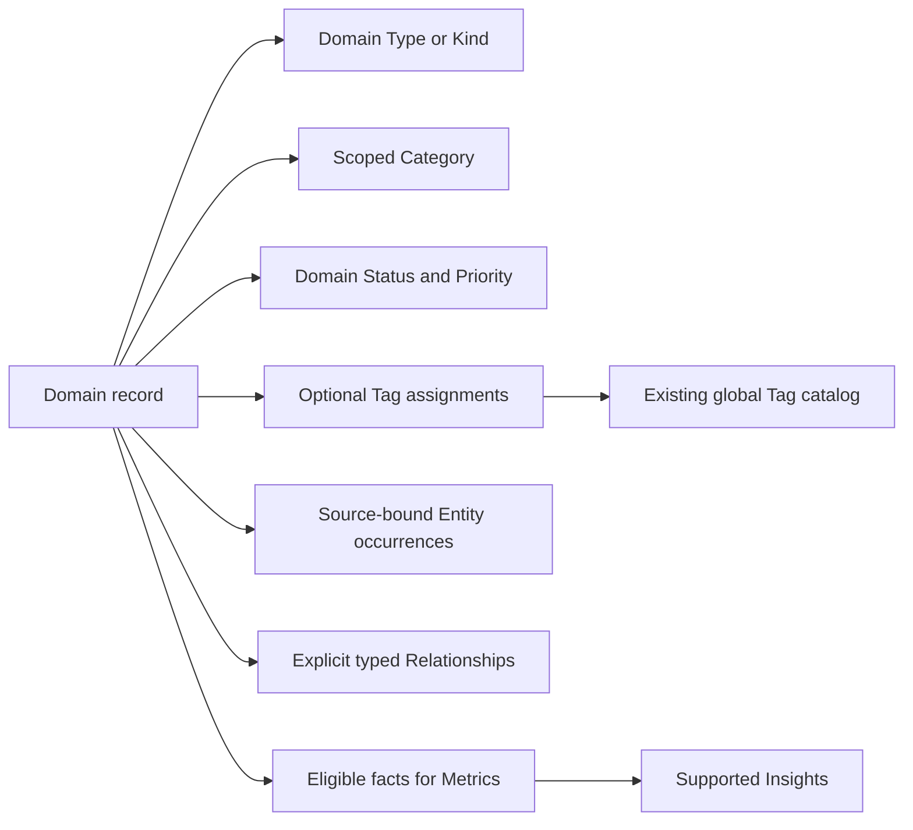
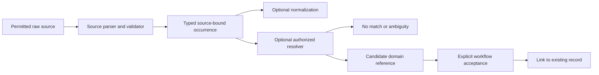
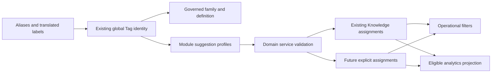
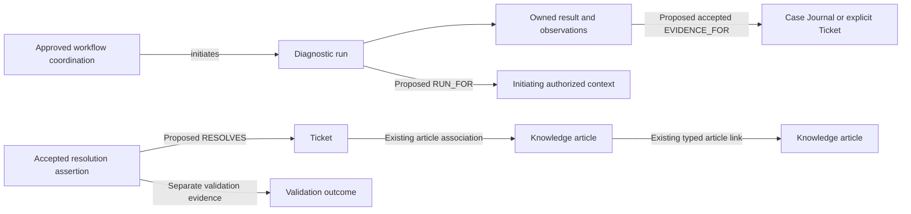

# F7Hub Phase 0C

## Cross-Subsystem Planning Note

Define shared terms such as action, event, result, observation, validation, evidence, session, resolution, selected context so Diagnostics, Analytics and DynamicHub do not invent competing meanings

# Classification, Taxonomy, Entities, Tags & Relationships Architecture
Existing taxonomy/category/tag inventory; exact distinction between Category, Type/Kind, Entity, Entity Type, Tag, Status, Priority, Relationship, Metric and Insight; initial Entity taxonomy; normalization rules; Entity occurrence vs canonical domain record; Tag Families; canonical Tags and aliases; tag scope; provenance; confidence; relationship vocabulary; multilingual-label strategy; search semantics; analytics dimensions; privacy rules; taxonomy governance and lifecycle.

I want Codex to inspect existing:
taxonomy migration
categories
tags
tag repository
category repository
Knowledge Base tags/categories
Ticket categories
existing constraints
existing scopes

Then produce:
## Existing Taxonomy Reuse Matrix

Concept | Existing Mechanism | Used By | Reuse? | Required Change

The desired outcome is not necessarily “build Global Tags.”
It may instead be:
Existing tag system
        ↓
extend carefully
        ↓
becomes Global Tag Catalog


## Mode

`@ARCHITECT @PLAN`

Architecture and taxonomy planning only.

Do not implement production code.

Do not create SQLite migrations.

Do not modify existing taxonomy tables.

Do not create repositories or services.

Do not seed taxonomy data.

Do not create GUI components.

Do not refactor unrelated F7Hub modules.

Do not make irreversible taxonomy decisions silently.

---

# 1. Objective

Design the global F7Hub Classification and Taxonomy Architecture.

This phase must establish a shared information vocabulary that future F7Hub modules can rely on consistently.

The design must clearly define and separate:

```text
Categories
Types / Kinds
Entities
Entity Types
Tags
Tag Families
Statuses
Priorities
Relationships
Classification Confidence
Provenance
Normalization
Aliases
Scopes
```

The architecture must prevent these concepts from becoming interchangeable.

The result should give future modules a stable vocabulary for:

```text
Clipboard
Tickets
Knowledge Base
Diagnostics
PowerShell Scripts
Automation
Statistical Analytics
Mochi
Search
Companies
Contacts
Devices
Websites
Prompts
```

---

# 2. Relationship to Earlier Foundation Phases

Phase 0C depends on:

```text
Phase 0A
Master Foundation Architecture

Phase 0B
Global JSON / Interoperability Contract
```

Before taxonomy design:

1. Read the approved Phase 0A architecture plan.
2. Read the approved Phase 0B interoperability plan.
3. Inspect current F7Hub taxonomy/category implementation.
4. Inspect existing database tables.
5. Inspect existing repositories/services.
6. Inspect existing ticket category behavior.
7. Inspect existing KB taxonomy behavior.
8. Inspect current search/filter conventions.
9. Identify any existing tags or tag-like structures.
10. Identify any existing entity/reference tables.

Do not create a competing taxonomy system if existing structures can be extended.

---

# 3. Existing F7Hub Taxonomy Is Authoritative

F7Hub already has implemented shared taxonomy/category concepts.

Their exact current scope must be inspected.

Do not assume:

```text
existing categories are insufficient
```

and do not assume:

```text
existing categories can serve every future taxonomy need
```

Determine both from evidence.

Classify findings as:

```text
FACT
ASSUMPTION
INFERENCE
RECOMMENDATION
NOT VERIFIED
```

---

# 4. Primary Principle

The architecture must answer:

```text
WHAT IS THIS RECORD?
WHAT FORMAL CLASSIFICATION DOES IT BELONG TO?
WHAT SPECIFIC OBJECTS DOES IT CONTAIN?
WHAT TOPICS IS IT ABOUT?
WHAT IS ITS WORKFLOW STATE?
HOW IS IT RELATED TO OTHER RECORDS?
```

These are different questions.

They require different data concepts.

---

# 5. Core Vocabulary

The following definitions are the initial conceptual baseline.

Phase 0C must verify, refine, and formalize them.

---

# 6. Category

A Category is a controlled formal classification used by a specific domain.

Example:

```text
Ticket Category:
Microsoft 365
```

or potentially:

```text
Knowledge Category:
Troubleshooting
```

Categories typically support:

```text
controlled classification
workflow
reporting
filtering
business rules
```

Categories may be scoped to particular modules.

They should not automatically become global Tags.

---

# 7. Type / Kind

Type or Kind describes what a record fundamentally is.

Examples:

```text
clipboard:
powershell_error
url
mixed_text

ticket:
incident
service_request

knowledge:
how_to
troubleshooting_article
reference
```

Type should answer:

```text
What kind of object is this?
```

It should not answer:

```text
What topic is this about?
```

---

# 8. Entity

An Entity is a specific identifiable value or object found in content or context.

Examples:

```text
10.0.0.87
john@contoso.com
PC-1042
outlook.office.com
0x80070005
INC0045211
C:\Windows\Temp\support.log
```

Entities are concrete.

Tags are conceptual.

---

# 9. Entity Type

Entity Type describes the class of detected entity.

Examples:

```text
ipv4
ipv6
email
upn
hostname
fqdn
url
file_path
registry_path
error_code
event_id
ticket_id
powershell_command
service_name
```

Example:

```text
Entity Type:
ipv4

Entity Value:
10.0.0.87
```

---

# 10. Tag

A Tag is a flexible reusable cross-module concept.

Examples:

```text
DNS
Outlook
Authentication
Networking
PowerShell
Security
VPN
Printer
Microsoft 365
```

Tags answer:

```text
What is this about?
```

Tags should be reusable across eligible F7Hub modules.

---

# 11. Status

Status represents workflow state.

Examples:

```text
OPEN
WAITING_CUSTOMER
RESOLVED

DRAFT
PUBLISHED
ARCHIVED

ACTIVE
DISABLED
```

Status is not a Tag.

Do not model workflow states as tags.

---

# 12. Priority

Priority represents urgency or operational importance.

Examples:

```text
P1
P2
P3
P4
```

Priority must remain separate from Tags and Categories.

---

# 13. Relationship

A Relationship explicitly connects two records.

Examples:

```text
Clipboard Item
    EVIDENCE_FOR
Ticket

Diagnostic Session
    RUN_FOR
Ticket

KB Article
    RESOLVES
Issue Pattern

Script
    USED_BY
Diagnostic
```

Relationships describe structure between records.

Tags describe shared concepts.

---

# 14. Metric

Metric is a calculated measurement.

Example:

```text
31 DNS-related tickets in the last 30 days.
```

Metrics must not become Tags.

---

# 15. Insight

Insight is a derived interpretation of data.

Example:

```text
DNS-related activity increased 42% this month.
```

Insights should not silently modify classification.

---

# 16. Classification Hierarchy

The plan should establish a conceptual classification stack such as:

```text
Record
│
├── Domain
├── Type / Kind
├── Formal Category
├── Status
├── Priority
│
├── Entities [0..many]
├── Tags [0..many]
└── Relationships [0..many]
```

Example:

```text
Ticket #41872

Domain:
Ticket

Type:
Incident

Category:
Microsoft 365

Status:
Open

Priority:
P2

Entities:
john@contoso.com
OUTLOOK.EXE
0x8004010F

Tags:
Outlook
Authentication
Microsoft 365
Recurring Issue

Relationships:
Clipboard Item #901
Diagnostic Session #55
KB Article #17
```

---

# 17. Master Taxonomy Inventory

Before designing schemas, produce a proposed master inventory of classifications needed across F7Hub.

The inventory must be organized by concept.

Example:

```text
Categories
Types
Entity Types
Tag Families
Tags
Statuses
Priorities
Relationship Types
```

Do not mix these lists.

---

# 18. Existing Category Inventory

Inspect all current category/taxonomy records.

Produce:

```text
Current category key
Display name
Scope
Active state
Used by
Repository/service owner
Current relationships
```

Identify:

```text
usable as-is
extendable
duplicate
legacy
unclear
```

Do not modify them during this phase.

---

# 19. Category Scope

Determine whether categories are currently:

```text
global
module-scoped
domain-scoped
hierarchical
flat
```

Recommend the future model.

Possible scopes may include:

```text
TICKET
KNOWLEDGE
SCRIPT
DIAGNOSTIC
```

Do not create duplicate category values solely because they are used in multiple modules unless semantic meaning actually differs.

---

# 20. Categories vs Tags Decision Rules

Create explicit rules.

Example:

Use a Category when:

```text
the classification is formal
the value set is controlled
the module relies on it operationally
workflow/reporting depends on it
one primary classification is expected
```

Use a Tag when:

```text
multiple labels may apply
cross-module discovery is useful
classification is topical
classification is flexible
workflow does not depend on it
```

---

# 21. Example

Ticket:

```text
Category:
Networking

Tags:
VPN
DNS
Fortinet
Remote Access
Recurring Issue
```

Do not create:

```text
Category:
Networking / VPN / DNS / Fortinet / Remote Access
```

unless there is a genuine business need for such hierarchy.

---

# 22. Type / Kind Inventory

Produce proposed type inventories per major domain.

At minimum evaluate:

```text
Clipboard
Ticket
Knowledge
Diagnostic
Script
Automation
Website
Prompt
```

Example Clipboard types:

```text
plain_text
mixed_text
url
powershell_command
powershell_output
powershell_error
log
json
xml
yaml
csv
markdown
ticket_data
error_message
unknown
```

Do not treat this example list as final.

Phase 0C must refine it.

---

# 23. Type Governance

Determine whether Types are:

```text
hard-coded enums
reference-table records
configuration
taxonomy records
```

Different domains may require different approaches.

The plan must recommend consistency without forcing unrelated domains into one generic Type table.

---

# 24. Global Entity Taxonomy

Design a proposed master inventory of Entity Types.

This should be comprehensive enough to support upcoming Clipboard and Diagnostic planning.

Organize by family.

---

# 25. Network Entity Types

Evaluate:

```text
ipv4
ipv6
cidr
mac_address
hostname
fqdn
domain
url
port
protocol
socket_endpoint
```

---

# 26. Identity Entity Types

Evaluate:

```text
email
upn
username
sid
guid
display_name
entra_object_id
tenant_id
```

Be careful with ambiguous natural-language names.

---

# 27. Windows Entity Types

Evaluate:

```text
file_path
directory_path
unc_path
registry_path
process_name
process_id
service_name
device_name
computer_name
event_id
windows_build
```

---

# 28. PowerShell / Command Entity Types

Evaluate:

```text
powershell_command
powershell_cmdlet
powershell_parameter
powershell_module
cmd_command
command_line
script_path
```

---

# 29. Error / Diagnostic Entity Types

Evaluate:

```text
error_code
hresult
win32_error
powershell_error_id
exception_type
stack_trace
smtp_status
ndr_code
http_status
event_id
```

Determine overlaps carefully.

Example:

```text
event_id
```

should not accidentally be defined in multiple incompatible families.

---

# 30. Ticketing Entity Types

Evaluate:

```text
ticket_id
incident_id
request_id
problem_id
change_id
task_id
```

Determine whether these should be generic or platform-specific.

---

# 31. Microsoft Entity Types

Evaluate:

```text
tenant_id
entra_object_id
intune_device_id
exchange_guid
message_id
mailbox_guid
azure_resource_id
subscription_id
```

Only include entities with realistic F7Hub use cases.

---

# 32. Security Entity Types

Evaluate:

```text
cve_id
md5
sha1
sha256
certificate_thumbprint
security_alert_id
```

Sensitive values such as passwords and tokens should not necessarily become normal Entities.

---

# 33. Structured Data Entity Types

Evaluate whether:

```text
json_object
xml_fragment
yaml_fragment
csv_data
key_value
```

are actually Entity Types or better represented as content Types.

Do not classify container formats as Entities unless justified.

---

# 34. Temporal Entity Types

Evaluate:

```text
date
time
datetime
timestamp
duration
```

Decide whether generic time values should normally become stored Entities.

Avoid clutter.

---

# 35. Software Entity Types

Evaluate:

```text
software_name
product_name
version
semantic_version
package_name
```

Define normalization expectations.

---

# 36. Entity Persistence Strategy

Not every detected entity must become a permanent database record.

Distinguish:

```text
detected entity occurrence
```

from:

```text
canonical domain entity
```

Example:

```text
Clipboard detects:
PC-1042
```

This does not automatically mean:

```text
create Device record PC-1042
```

Instead:

```text
Detected Entity
     ↓
Optional Resolver
     ↓
Existing Device Match?
```

Only explicit workflow should create or link a canonical Device.

---

# 37. Entity Occurrence Model

Evaluate an occurrence model containing:

```text
source_record
entity_type
raw_value
normalized_value
confidence
start_offset
end_offset
metadata
provenance
```

This is particularly relevant for Clipboard.

---

# 38. Canonical Entity Resolution

Plan for optional future entity resolution.

Concept:

```text
Detected:
john@contoso.com

        ↓

Resolver

        ↓

Contact #88
```

or:

```text
Detected:
PC-1042

        ↓

No canonical device exists

        ↓

Keep as detected entity only
```

Do not force resolution.

---

# 39. Entity Normalization

Each Entity Type may need normalization.

Examples:

```text
Email
JOHN@CONTOSO.COM
→ john@contoso.com
```

```text
IPv4
010.000.000.001
→ validated normalized representation
```

```text
URL
HTTP://EXAMPLE.COM
→ canonicalized where safe
```

```text
MAC
00-11-22-AA-BB-CC
→ normalized format
```

The plan must define:

```text
raw_value
normalized_value
```

semantics.

---

# 40. Never Normalize Away Meaning

Normalization must not silently change semantic content.

Example:

URL query strings may contain meaningful values.

File paths may be case-insensitive but still should retain original text for evidence.

Therefore preserve:

```text
raw_value
```

and separately store:

```text
normalized_value
```

when justified.

---

# 41. Classification Confidence

Automated classifications need confidence.

Conceptual model:

```text
0.0 → 1.0
```

Examples:

```text
IPv4 validated by ipaddress:
1.0

Probable hostname:
0.82

AI-suggested product:
0.65
```

Define which classifications are deterministic and do not need probabilistic semantics.

---

# 42. Provenance

Every automated classification should be able to answer:

```text
Where did this classification come from?
```

Proposed provenance values:

```text
USER
RULE
PARSER
IMPORT
SYSTEM
AI_SUGGESTED
RESOLVER
```

Do not treat AI suggestions as equivalent to deterministic parser results.

---

# 43. Provenance vs Assignment Source

Determine whether one common provenance vocabulary can cover:

```text
Entity extraction
Tag assignment
Category assignment
Relationship creation
```

or whether each domain requires its own constrained values.

Avoid one overly generic field whose semantics become unclear.

---

# 44. Tag Architecture

Evaluate a global shared Tag Catalog.

Conceptual:

```text
tags
tag_families
tag_aliases
tag_module_scopes
```

Do not finalize SQL yet.

---

# 45. Tag Families

Produce a proposed master Tag Family inventory.

At minimum evaluate:

```text
technology
product
platform
issue
networking
identity
security
workflow
knowledge
automation
protocol
hardware
custom
```

Determine whether some should be merged.

---

# 46. Proposed Technology Tags

Evaluate:

```text
PowerShell
Python
AutoHotkey
Microsoft Graph
SQLite
Windows
```

Only include tags relevant to F7Hub usage.

---

# 47. Product Tags

Evaluate:

```text
Outlook
Teams
OneDrive
SharePoint
Exchange Online
Intune
Entra ID
Defender
Purview
Fortinet
Windows 11
```

---

# 48. Networking Tags

Evaluate:

```text
DNS
DHCP
VPN
Wi-Fi
TCP/IP
Routing
Firewall
Proxy
Connectivity
```

---

# 49. Identity Tags

Evaluate:

```text
Authentication
Authorization
MFA
Password
Account Lockout
Conditional Access
SSO
```

---

# 50. Security Tags

Evaluate:

```text
Phishing
Malware
Spam
Safe Links
Safe Attachments
Endpoint Security
Email Security
```

Avoid duplicating Product Tags.

For example:

```text
Defender
```

may be Product.

```text
Malware
```

may be Security.

---

# 51. Workflow Tags

Evaluate:

```text
Needs Review
Follow-up
Escalation
Recurring Issue
Training
Documentation Needed
Automation Candidate
Knowledge Gap
```

These may be especially useful for Tickets, Clipboard, and Analytics.

---

# 52. Knowledge Tags

Evaluate:

```text
Troubleshooting
How-To
Reference
FAQ
Known Issue
Workaround
Best Practice
```

Determine whether these are better as KB Types instead.

Do not duplicate Type concepts as Tags unnecessarily.

---

# 53. Tag Aliases

Plan canonical aliases.

Example:

```text
PowerShell
Aliases:
PS
pwsh
Power Shell
```

Example:

```text
Microsoft 365
Aliases:
M365
Office 365
O365
```

Aliases should support:

```text
search
import cleanup
auto-tag resolution
```

but should not appear as separate analytics dimensions.

---

# 54. Tag Module Scopes

Tags should be global, but suggestion scope may differ.

Example:

```text
Tag:
PowerShell

Recommended for:
Clipboard
Diagnostics
Scripts
KB
Automation
Tickets

Not usually suggested for:
Contacts
Companies
```

Scope affects suggestion behavior.

Scope must not create duplicate Tags.

---

# 55. System Tags vs User Tags

Plan:

```text
SYSTEM
USER
```

System Tags:

```text
controlled
stable
possibly non-editable
used by rules
```

User Tags:

```text
flexible
user-created
editable
```

Determine how user-created tags interact with aliases and families.

---

# 56. Tag Lifecycle

Plan states such as:

```text
ACTIVE
INACTIVE
MERGED
```

Do not casually physically delete Tags used historically.

Preserve analytics integrity.

---

# 57. Tag Merge

Design the semantic behavior.

Example:

```text
Power Shell
PS
PowerShell
```

merge into:

```text
PowerShell
```

Required future behavior:

```text
reassign relationships
preserve aliases
prevent duplicate links
retain historical trace if needed
transactional change
```

Do not implement yet.

---

# 58. Tag Assignment

Tag assignment may be:

```text
manual
rule-based
imported
system-generated
AI-suggested
```

Determine which may auto-assign and which require approval.

---

# 59. Auto-Tag Rules

Do not design full implementation yet.

Define rule classes.

Possible:

```text
ENTITY_PRESENT
PRIMARY_KIND
KEYWORD
REGEX
SOURCE_APPLICATION
RELATIONSHIP
CATEGORY
COMPOSITE
```

Examples:

```text
Entity ipv4
→ Networking
```

```text
PowerShell cmdlet Resolve-DnsName
→ PowerShell
→ DNS
→ Networking
```

---

# 60. Auto-Tag Confidence

Create policy recommendations.

Potential:

```text
deterministic rule
→ auto-assign

strong heuristic
→ auto-assign or suggest

weak heuristic
→ suggest only

AI
→ suggest unless specifically trusted
```

Do not hard-code thresholds without evidence.

---

# 61. Categories vs Tags Examples

Produce a large comparison matrix.

Examples:

```text
Outlook
could be:
Category? Possibly in some module.
Tag? Yes, likely global product tag.

DNS
Category? Possibly diagnostic category.
Tag? Yes.
Entity? No.

10.0.0.87
Entity? Yes.
Tag? No.

P2
Priority? Yes.
Tag? No.

Resolved
Status? Yes.
Tag? No.

powershell_error
Kind? Yes.
Tag? No.

Recurring Issue
Tag? Yes.
Status? No.
```

This matrix should become a reference for future Codex work.

---

# 62. Relationship Architecture

Produce a master relationship vocabulary.

Relationships should be semantic.

Examples:

```text
EVIDENCE_FOR
RELATED_TO
RUN_FOR
GENERATED_FROM
USES
REFERENCES
RESOLVES
SUGGESTS
DERIVED_FROM
```

Do not create dozens prematurely.

---

# 63. Relationship Direction

Determine whether relationships are directional.

Example:

```text
Clipboard Item
EVIDENCE_FOR
Ticket
```

is not semantically identical to:

```text
Ticket
EVIDENCE_FOR
Clipboard Item
```

Plan directionality explicitly.

---

# 64. Explicit Link Tables vs Generic Relationships

Evaluate where F7Hub should use:

```text
dedicated foreign-key relationship tables
```

versus:

```text
generic relationship infrastructure
```

Default principle:

Use explicit relational tables when strong referential integrity is available.

Example:

```text
clipboard_ticket_links
```

may be better than:

```text
relationships(
    source_type,
    source_id,
    target_type,
    target_id
)
```

But inspect existing architecture before deciding.

---

# 65. Cross-Module Relationship Map

Produce a conceptual map including:

```text
Tickets
Companies
Contacts
Devices
KB
Clipboard
Diagnostics
Scripts
Automation
Tags
Entities
Analytics
Mochi
```

Example:

```text
Company
   ↓
Contact

Ticket
   ├── Company
   ├── Contact
   ├── Clipboard Evidence
   ├── Diagnostics
   └── KB Articles

Diagnostic
   ├── Script
   ├── Findings
   ├── Evidence
   └── Tags

Clipboard
   ├── Entities
   ├── Tags
   ├── Ticket Links
   └── Diagnostic Links
```

---

# 66. Relationship Provenance

Determine whether cross-module links should track:

```text
USER
SYSTEM
RULE
IMPORT
AI_SUGGESTED
```

Example:

```text
Clipboard linked to Ticket
```

may be:

```text
USER
```

while:

```text
Diagnostic linked to Ticket
```

may be:

```text
SYSTEM
```

because it was launched from that ticket.

---

# 67. Search Architecture Impact

Taxonomy must support future Global Search.

Examples:

```text
tag:DNS
entity:10.0.0.87
kind:powershell_error
category:Networking
status:Open
```

The plan should define canonical search semantics.

Do not implement search syntax yet.

---

# 68. Statistical Analytics Impact

Taxonomy becomes a dimension source.

Analytics should be able to measure:

```text
tickets by tag
clipboard entities by type
diagnostics by category
tag co-occurrence
category distribution
entity frequency
automation coverage by tag
KB coverage by tag
```

Stable taxonomy is necessary for reliable analytics.

---

# 69. Tag Analytics

Potential metrics:

```text
top tags
tag growth
tag co-occurrence
tag-module usage
tag-to-ticket resolution time
tag-to-diagnostic usage
tag-to-KB coverage
```

Do not store these metrics in the Tag catalog.

Analytics owns derived metrics.

---

# 70. Entity Analytics

Potential measurements:

```text
most frequent error codes
most frequent domains
most frequent PowerShell cmdlets
most frequent event IDs
```

Be careful with privacy.

Avoid analytics that expose unnecessary personal identifiers.

---

# 71. Privacy Rules for Entities

Certain Entity Types may contain sensitive data.

Examples:

```text
email
username
device_name
file_path
URL
```

Determine:

```text
which may be persisted
which may be normalized
which may appear in analytics
which should be aggregated only
which require redaction
```

---

# 72. Secret Detection

Secrets should generally not become ordinary Entities.

Examples:

```text
password
MFA code
API key
Bearer token
private key
connection string
```

Instead classify sensitivity.

Possible behavior:

```text
SECRET_POSSIBLE
```

then block or quarantine persistence.

---

# 73. Taxonomy and Mochi

Mochi should consume canonical classifications.

Example context:

```text
Tags:
DNS
Networking

Entities:
IPv4 10.0.0.87
FQDN outlook.office.com
```

This is much more reliable than giving Mochi only raw text.

Mochi should not create canonical Tags or Categories independently.

---

# 74. Taxonomy and JSON Contract

Phase 0B defines how taxonomy references travel.

Phase 0C defines what those references mean.

Example:

```json
{
  "entity_type_key": "ipv4",
  "normalized_value": "10.0.0.87",
  "confidence": 1.0,
  "provenance": "PARSER"
}
```

and:

```json
{
  "tag_key": "networking",
  "confidence": 1.0,
  "assignment_source": "RULE"
}
```

Contract schemas must refer to canonical taxonomy keys.

---

# 75. Naming Convention

Recommend naming rules for taxonomy keys.

Potential:

```text
lower_snake_case
```

Examples:

```text
microsoft_365
conditional_access
powershell_command
knowledge_gap
```

Display labels remain independent:

```text
Microsoft 365
Conditional Access
PowerShell Command
Knowledge Gap
```

---

# 76. Stable Machine Keys

Machine keys should not change casually.

Example:

```text
tag_key:
microsoft_365
```

Display:

```text
Microsoft 365
```

may evolve without breaking relationships.

---

# 77. Case Normalization

Define case behavior.

Examples:

```text
Tag keys:
lowercase normalized

Emails:
lowercase where appropriate

PowerShell cmdlets:
canonical display casing preserved

File paths:
raw casing preserved
```

Do not apply one global lowercasing rule to all entity values.

---

# 78. Duplicate Detection

Plan duplicate rules.

Tags:

```text
PowerShell
powershell
Power Shell
PS
```

should resolve appropriately.

Entities:

```text
10.0.0.87
```

may be identical after normalization.

But:

```text
URL
```

duplicate semantics may depend on fragment/query rules.

Entity-specific normalization is required.

---

# 79. Taxonomy Governance

Define who may create:

```text
system categories
user categories
system tags
user tags
entity types
relationship types
```

Likely:

```text
Entity Types:
system-controlled

Core Tags:
system-controlled

User Tags:
user-created

Relationship Types:
system-controlled

Statuses:
system-controlled

Categories:
module-governed
```

Phase 0C should recommend exact governance.

---

# 80. User-Editable Taxonomy

Avoid letting users modify structural concepts such as:

```text
entity_type = ipv4
```

into:

```text
entity_type = cat_picture
```

unless custom entity types are intentionally supported later.

Tags are the natural flexible extension mechanism.

---

# 81. Taxonomy Management GUI Scope

Plan eventual Settings UI:

```text
Settings
└── Tags & Taxonomy
```

Potential sections:

```text
Tag Families
Tags
Aliases
Module Scope
Categories
Auto-tag Rules
```

Entity Type management should probably be read-only initially.

---

# 82. Tag Management GUI

Future interface should support:

```text
search
family filter
active/inactive
system/user
aliases
module scopes
usage counts
rename
deactivate
merge
```

Do not implement in Phase 0C.

---

# 83. Module Tag Selector

Plan reusable component:

```text
[Outlook ×]
[Authentication ×]
[Microsoft 365 ×]

+ Add Tag
```

This component should eventually be shared across:

```text
Tickets
KB
Clipboard
Diagnostics
Scripts
Automation
```

---

# 84. Tag Suggestions

Future UI could show:

```text
Suggested
+ PowerShell
+ DNS
+ Networking
```

but preserve provenance and confidence.

User should be able to:

```text
accept
dismiss
```

where appropriate.

---

# 85. Classification Pipeline

Recommend general layering:

```text
Raw Content
    ↓
Content Type Detection
    ↓
Entity Extraction
    ↓
Entity Normalization
    ↓
Formal Classification
    ↓
Tag Rules
    ↓
Relationship Resolution
    ↓
Persistence
```

Not every module needs every step.

---

# 86. Deterministic Before AI

Prefer:

```text
parser
regex
validation library
rule
resolver
```

before:

```text
AI
```

AI may suggest uncertain classifications later.

---

# 87. Entity Extraction Example

Input:

```text
User john@contoso.com
PC-1042
10.0.0.87
Get-Service Spooler
0x80070005
```

Possible result:

```text
Primary Kind:
mixed_text

Entities:
EMAIL
john@contoso.com

HOSTNAME
PC-1042

IPV4
10.0.0.87

POWERSHELL_COMMAND
Get-Service Spooler

SERVICE_NAME
Spooler

ERROR_CODE
0x80070005
```

---

# 88. Tagging Example

From the same item:

```text
Tags:
PowerShell
Windows
Networking
Troubleshooting
```

If active ticket context indicates printer issue:

```text
Suggested:
Printing
```

Do not infer unrelated Tags merely from weak context.

---

# 89. Category Example

The active Ticket might have:

```text
Category:
Hardware / Printing
```

or whatever the existing F7Hub category model supports.

That Category is independent from the Clipboard Item's primary Kind.

---

# 90. Relationship Example

The system may create:

```text
Clipboard Item #901
    EVIDENCE_FOR
Ticket #41872
```

That relationship is separate from:

```text
Tags:
Printing
PowerShell
```

---

# 91. Classification Confidence Matrix

Produce a matrix.

Example:

| Classification | Method | Confidence |
|---|---|---:|
| IPv4 | strict parser | deterministic |
| Email | syntax parser | high |
| PowerShell command | parser/heuristic | high |
| Hostname | heuristic | medium |
| Outlook relevance | context/rule | medium |
| Root cause | not taxonomy | N/A |

Do not assign numerical confidence where deterministic true/false is more appropriate unless a unified API requires it.

---

# 92. Provenance Matrix

Produce a similar matrix:

| Item | Possible provenance |
|---|---|
| Entity | PARSER / USER / IMPORT |
| Tag | USER / RULE / AI_SUGGESTED |
| Category | USER / SYSTEM / IMPORT |
| Relationship | USER / SYSTEM / RULE |
| Normalized value | NORMALIZER |

---

# 93. Taxonomy Drift Risks

Identify risks such as:

```text
duplicate tags
near-synonyms
module-specific variants
uncontrolled custom tags
aliases treated as separate tags
categories reused as tags
statuses copied into tags
entities turned into tags
```

Define mitigations.

---

# 94. Example Drift Problem

Avoid:

```text
M365
Microsoft 365
Office 365
O365
Microsoft365
```

as separate analytics dimensions.

Use:

```text
Canonical:
Microsoft 365

Aliases:
M365
Office 365
O365
Microsoft365
```

---

# 95. Relationship Drift

Avoid:

```text
related
linked
associated
connects_to
has_relation
```

all meaning effectively the same thing.

Relationship vocabulary should be controlled.

---

# 96. Category Drift

Avoid creating categories just because a Tag exists.

Example:

```text
DNS
```

may be:

```text
Tag globally
Diagnostic category locally
```

This can be valid if semantics differ.

Document those differences explicitly.

---

# 97. Master Classification Decision Table

Produce a decision guide such as:

```text
Does this describe workflow state?
→ Status

Does this describe urgency?
→ Priority

Does this identify what kind of record it is?
→ Type / Kind

Does this represent a formal module classification?
→ Category

Is this a specific detected value?
→ Entity

Is this a reusable cross-module topic?
→ Tag

Does this connect two records?
→ Relationship

Is this calculated?
→ Metric / Insight
```

This should become one of the main outputs of Phase 0C.

---

# 98. Module-by-Module Classification Matrix

For each major module, identify which classification concepts apply.

Example:

| Module | Category | Type | Entity | Tag | Status | Relationship |
|---|---|---|---|---|---|---|
| Tickets | Yes | Yes | Yes | Yes | Yes | Yes |
| Clipboard | Maybe | Yes | Yes | Yes | Yes/retention state | Yes |
| KB | Yes | Yes | Yes | Yes | Yes | Yes |
| Diagnostics | Yes | Yes | Yes | Yes | Yes | Yes |
| Scripts | Maybe | Yes | Yes | Yes | Yes | Yes |
| Analytics | No | Metric type | Reads only | Reads only | N/A | Reads |
| Mochi | No | Message type | Reads | Reads | Interaction state | Reads |

Refine after inspection.

---

# 99. Database Impact Assessment

Do not design final SQL yet.

Instead identify likely structures required.

Potential:

```text
tag_families
tags
tag_aliases
tag_module_scopes

entity_types
entity_occurrences

module-specific tag link tables

relationship tables
```

Compare with existing schema.

Mark:

```text
REUSE
EXTEND
NEW
NOT NEEDED
NOT VERIFIED
```

---

# 100. Migration Principles

Future migrations must preserve:

```text
existing categories
existing ticket references
existing KB relationships
existing data integrity
existing analytics semantics
```

Do not silently convert existing categories to Tags.

Do not destroy historical taxonomy records.

---

# 101. Search Impact Assessment

Plan future query patterns.

Examples:

```text
Find everything tagged DNS.

Find clipboard items containing IPv4 entity 10.0.0.87.

Find open tickets tagged Outlook.

Find diagnostics with ERROR_CODE entity 0x80070005.

Find KB articles related to VPN.
```

The taxonomy architecture should support these without denormalized duplication.

---

# 102. Analytics Impact Assessment

Ensure future queries can answer:

```text
Top Tags
Top Entity Types
Top Error Codes
Tag Co-occurrence
Tags per Module
Diagnostic Coverage by Tag
KB Coverage by Tag
Ticket Resolution by Tag
```

Taxonomy storage should not be optimized solely for GUI display.

---

# 103. Mochi Context Impact

Mochi should receive:

```text
canonical keys
display labels where useful
normalized entity values
confidence
provenance where relevant
```

Mochi should not be required to reverse-engineer taxonomy from raw strings.

---

# 104. Settings Impact

Phase 0C must identify taxonomy-related settings that Phase 0D needs to support.

Examples:

```text
Enable automatic tag suggestions
Auto-assign deterministic tags
Show AI tag suggestions
User tag creation enabled
Maximum suggestions displayed
Sensitive entity redaction
```

Do not implement Settings here.

---

# 105. Required Diagrams

Produce conceptual Mermaid diagrams for:

## Classification Model

```text
Record
├── Type
├── Category
├── Status
├── Entities
├── Tags
└── Relationships
```

## Tag Architecture

```text
Tag Catalog
→ Modules
→ Analytics
```

## Entity Flow

```text
Raw Text
→ Parser
→ Entity Occurrence
→ Optional Canonical Resolver
```

## Cross-Module Relationships

Show Tickets, Clipboard, Diagnostics, KB, Scripts, Tags.

---

# 106. Required Taxonomy Inventory Deliverable

Produce a structured master inventory with sections:

```text
A. Category Scopes
B. Type / Kind Inventories
C. Entity Families
D. Entity Types
E. Tag Families
F. Initial System Tags
G. Statuses
H. Priorities
I. Relationship Types
J. Provenance Values
K. Confidence Rules
L. Alias Rules
M. Normalization Rules
```

Do not treat the inventory as final database seed data.

Mark entries:

```text
CORE
LIKELY
FUTURE
REJECTED
NEEDS REVIEW
```

---

# 107. Initial System Tag Inventory

Produce a proposed first-pass global System Tag catalog.

Keep it intentionally smaller than the universe of possible tags.

Prefer useful reusable concepts.

Potential domains:

```text
Microsoft 365
Outlook
Teams
Exchange Online
SharePoint
OneDrive
Entra ID
Intune
Defender
Purview

Windows
PowerShell
Active Directory
Group Policy
Windows Server

Networking
DNS
DHCP
VPN
Wi-Fi
Firewall
Proxy

Authentication
MFA
Password
Account Lockout
Conditional Access

Printing
Remote Desktop
Performance
Storage
Updates

Security
Phishing
Malware
Spam

Troubleshooting
Automation Candidate
Knowledge Gap
Recurring Issue
Training
Needs Review
```

Phase 0C should refine and reduce this list.

---

# 108. Avoid Over-Tagging

Do not create Tags for every noun.

Bad:

```text
Computer
User
Ticket
Error
Problem
Issue
Text
Command
```

unless they have a meaningful discovery or analytics use.

A Tag should earn its existence.

---

# 109. Tag Creation Criteria

A proposed system Tag should ideally satisfy one or more:

```text
useful across modules
useful for search
useful for filtering
useful for analytics
useful for automation rules
useful for knowledge discovery
```

Reject decorative Tags.

---

# 110. Entity Type Creation Criteria

An Entity Type should have:

```text
recognizable semantics
reliable detection or manual assignment
normalization rules
search value
workflow value
or analytics value
```

Avoid hyper-specific entity types with no practical use.

---

# 111. Relationship Type Creation Criteria

A relationship type should represent a meaningful semantic connection.

Not merely:

```text
RELATED
```

when a stronger term exists.

But also avoid creating dozens of overly narrow relationship types.

Balance semantic clarity and maintainability.

---

# 112. Open Questions

Only include architectural questions that inspection cannot answer.

Examples might include:

```text
Should global tags support hierarchy?
Should user-defined tag families be allowed?
Should detected entities persist by default?
Should Tags be attached to Companies/Contacts?
Should canonical entity resolution exist in MVP?
Should Tags support aliases across languages?
Should Categories remain completely separate from Tag catalog?
```

Do not ask questions merely because repository inspection was skipped.

---

# 113. Multilingual Consideration

F7Hub may eventually display taxonomy labels in English and French.

The plan should evaluate whether canonical keys should remain language-neutral:

```text
tag_key = account_lockout
```

while display labels may later support:

```text
English:
Account Lockout

French:
Verrouillage de compte
```

Do not implement localization yet.

Avoid encoding English display names as structural identifiers.

---

# 114. Bilingual Aliases

Evaluate whether search aliases may support:

```text
Account Lockout
Verrouillage de compte
```

without creating two canonical Tags.

This could become valuable for bilingual technician workflows.

---

# 115. Performance Considerations

Identify expected high-volume structures:

```text
entity occurrences
clipboard tags
capture relationships
search indexes
analytics queries
```

Plan indexing concepts without premature optimization.

---

# 116. Data Volume Considerations

Tags:

```text
low-volume catalog
```

Tag assignments:

```text
medium/high volume
```

Entity occurrences:

```text
potentially high volume
```

Analytics should not require scanning raw content unnecessarily.

---

# 117. Privacy and Analytics

Entity frequency analytics should prefer aggregation.

For example:

Useful:

```text
Error code 0x80070005 occurred 31 times.
```

Potentially inappropriate:

```text
john@contoso.com appeared 94 times.
```

unless specifically necessary.

The plan must distinguish operational search from analytics eligibility.

---

# 118. Retention Interaction

Detected entity occurrences tied to temporary Clipboard items may expire with the item.

Tags on durable records remain durable.

Analytics aggregates may outlive raw entity occurrences.

Document these lifecycle relationships.

---

# 119. Taxonomy Deactivation

When a Tag or classification becomes obsolete:

```text
deactivate
```

rather than deleting historical meaning.

Preserve existing relationships where appropriate.

---

# 120. Taxonomy Evolution

Define future process:

```text
Need identified
   ↓
Search existing taxonomy
   ↓
Alias existing concept?
   ↓
Extend existing?
   ↓
Create only if necessary
   ↓
Review analytics impact
   ↓
Document
```

Apply:

```text
SEARCH
IDENTIFY
REUSE / EXTEND
CREATE ONLY IF NECESSARY
```

---

# 121. Required Decision Register

At minimum decide or evaluate:

```text
Global Tags?
Tag Families?
Tag hierarchy?
User Tags?
Aliases?
Module scopes?
System vs User?
Entity type ownership?
Entity occurrence persistence?
Canonical entity resolution?
Confidence representation?
Provenance vocabulary?
Relationship architecture?
Category/Tag separation?
Type governance?
Multilingual labels?
```

For each provide:

```text
Decision
Options
Recommendation
Reason
Consequences
Status
```

Status:

```text
RECOMMENDED
REQUIRES_USER_DECISION
DEFERRED
NOT_VERIFIED
```

---

# 122. Required Risk Register

Include:

```text
taxonomy duplication
taxonomy drift
tag explosion
over-tagging
entity explosion
privacy leakage
ambiguous categories
relationship ambiguity
migration incompatibility
analytics fragmentation
bilingual synonym duplication
AI-generated taxonomy noise
weak normalization
cross-module coupling
```

Provide mitigation for each.

---

# 123. Planning Depth Classification

For every topic classify:

```text
DECIDE NOW
DESIGN NEXT
DEFER UNTIL FEATURE PLAN
DEFER UNTIL IMPLEMENTATION
```

Likely `DECIDE NOW`:

```text
Category vs Tag semantics
Entity vs Tag semantics
Global Tag catalog direction
Canonical key convention
Provenance concept
Relationship principles
```

Likely `DESIGN NEXT`:

```text
exact initial system tag inventory
entity taxonomy
tag aliases
normalization rules
```

Likely `DEFER`:

```text
every possible tag
every entity parser
AI auto-tagging
advanced graph visualization
```

---

# 124. Acceptance Criteria

Phase 0C is acceptable when:

1. Existing taxonomy architecture has been inspected.
2. Current categories have been inventoried.
3. Category, Type, Entity, Tag, Status, Priority, Relationship, Metric, and Insight are clearly distinguished.
4. A proposed global Entity Type inventory exists.
5. A proposed global Tag Family inventory exists.
6. A proposed initial System Tag inventory exists.
7. Tag aliases are defined conceptually.
8. Module scopes are defined conceptually.
9. System vs User Tags are defined.
10. Entity occurrence and canonical entity concepts are separated.
11. Normalization rules are defined conceptually.
12. Confidence rules are defined.
13. Provenance rules are defined.
14. Relationship semantics are defined.
15. Cross-module taxonomy use is mapped.
16. Search implications are mapped.
17. Analytics implications are mapped.
18. Privacy risks are addressed.
19. Mochi consumption rules are identified.
20. Settings requirements for Phase 0D are identified.
21. Database impact is assessed without implementing migrations.
22. Taxonomy drift risks have mitigations.
23. No production implementation has occurred.
24. Future Clipboard and Diagnostic plans can use this vocabulary without redefining it.

---

# 125. Validation

Return:

```text
Current taxonomy inspection          PASS / FAIL / BLOCKED
Existing category inventory          PASS / FAIL / BLOCKED
Classification vocabulary            PASS / FAIL / BLOCKED
Entity taxonomy                      PASS / FAIL / BLOCKED
Tag taxonomy                         PASS / FAIL / BLOCKED
Relationship model                   PASS / FAIL / BLOCKED
Normalization model                  PASS / FAIL / BLOCKED
Confidence/provenance model          PASS / FAIL / BLOCKED
Search impact review                 PASS / FAIL / BLOCKED
Analytics impact review              PASS / FAIL / BLOCKED
Privacy review                       PASS / FAIL / BLOCKED
Cross-module consistency review      PASS / FAIL / BLOCKED
Scope control                        PASS / FAIL / BLOCKED
Production changes                   MUST BE NONE
Database changes                     MUST BE NONE
```

---

# 126. Required Final Report

Return in this order:

## Summary

Recommended information architecture.

## Current-State Taxonomy

What already exists and how it currently works.

## Classification Vocabulary

Formal definitions.

## Classification Decision Tree

When to use Category, Type, Entity, Tag, Status, Priority, Relationship, Metric, or Insight.

## Category Architecture

Existing and recommended scope.

## Type / Kind Architecture

Per-domain type strategy.

## Entity Architecture

Families, types, normalization, occurrence model, resolution.

## Tag Architecture

Families, catalog, aliases, scopes, lifecycle, assignment.

## Relationship Architecture

Cross-module semantic links.

## Provenance & Confidence

Rules and ownership.

## Master Taxonomy Inventory

Categorized list marked CORE / LIKELY / FUTURE / NEEDS REVIEW.

## Module Classification Matrix

Which concepts each module uses.

## Search Impact

Expected query semantics.

## Analytics Impact

Dimensions and aggregation implications.

## Mochi Impact

How taxonomy becomes context.

## Settings Inputs

What Phase 0D must support.

## Database Impact Assessment

REUSE / EXTEND / NEW / NOT VERIFIED.

## Decision Register

Architectural decisions and unresolved choices.

## Risk Register

Taxonomy and data-quality risks.

## Recommended Next Planning Steps

Explicit downstream sequence.

## Result

Return exactly one:

```text
READY_FOR_SETTINGS_ARCHITECTURE
REQUIRES_TAXONOMY_DECISIONS
BLOCKED
```

Do not return:

```text
READY_FOR_IMPLEMENTATION
```

Phase 0C is still foundation architecture planning.

# Shared operational vocabulary

Context
Session
Action
Event
Result
Observation
Evidence
Diagnostic
Remediation
Validation
Resolution
Recommendation
Telemetry
Generated Output

The particularly valuable distinctions are:
Recommendation
≠ Action

Action
≠ Result

Result
≠ Resolution

Resolution
≠ Validation

Validation
≠ User Confirmation

Telemetry
≠ Ticket Evidence

The exact enum values such as:
pass
fail
partial

do not necessarily all belong globally yet.
The meaning of the concepts does.

---

# 127. Extension and sensitivity rules

## Extensible Vocabulary Requirement

0C must define the rules for extending F7Hub vocabulary without requiring
every future Tag, Entity Type, Category or Relationship Type to be known
before feature implementation.

Prefer:

stable vocabulary architecture
+
initial CORE vocabulary
+
controlled extension mechanism

over an exhaustive speculative dictionary.

Evaluate useful vocabulary classifications such as:

- CORE
- MODULE
- USER

Do not adopt these classifications without verifying that they fit the
existing taxonomy implementation.

Adding a new approved vocabulary entry through the established extension
mechanism is not automatically a Foundation architecture change.

Changing the meaning, identity, ownership or governance of a Foundation
taxonomy concept is a Foundation architecture change.

### Sensitive Values Are Not Tags

Do not use Tags as a convenient storage mechanism for:

- passwords
- tokens
- customer secrets
- credentials
- confidential free-form values

Named customers, users, devices, addresses and other concrete detected
values should be modeled according to Entity/reference-data rules rather
than converted into reusable Tags merely for convenience.

### Sensitivity Vocabulary

0C may define generic F7Hub sensitivity semantics where needed.

Do not invent or claim employer-specific legal, security or information
classification policy.

Future employer policy may be mapped onto F7Hub handling rules only when
that policy is actually known and authorized.

### Provenance

Taxonomy and Entity architecture should be capable of distinguishing
where information originated, such as:

- technician input
- local rule/parser
- F7Hub subsystem
- imported data
- external integration
- AI suggestion

Provider-specific provenance must not require Foundation taxonomy to be
redesigned every time a new integration is added.

---

# EXECUTION REPORT

Execution date: 2026-10-07. ARCHITECT / PLAN: documentation only.
Authority: architecture candidate awaiting independent review and explicit user approval.
The original planning text is preserved verbatim. This report evaluates its examples rather than automatically adopting them.

## Summary

RECOMMENDATION: reuse the existing scoped `categories` and flat global `tags` infrastructure. Extend the existing catalog through separately approved feature work when families, aliases, stewardship, lifecycle or additional assignments become necessary. Do not create a parallel Global Tags catalog, universal Type table, generic entity store or graph database.

Keep Category, domain Type/Kind, detected Entity Occurrence, canonical domain record, optional Tag, workflow Status, business Priority, explicit Relationship, derived Metric and explanatory Insight distinct. Shared meaning does not transfer domain ownership or grant execution, persistence, disclosure or workflow authority.

FACT: 0A and 0B are APPROVED / INTEGRATED / CLOSED under explicit task authority and integrated Git history. Their historical execution-report labels do not reopen approval. This 0C report is an unapproved candidate. CORE entries below are a proposed planning minimum, not seeds or implemented System stewardship.

No blocking semantic choice remains for the bounded Settings handoff. Parser implementation, physical persistence, UI, migrations and exact retention policies remain intentionally deferred to their owning plans.

## Baseline / Candidate Identity

| Item | Verified baseline |
| --- | --- |
| Canonical checkout / starting branch | `C:\Dev\F7Hub` / `main` |
| HEAD, local origin/main, live remote main | `41d49d6644727cb324be24e05fda6738cd782eb6` |
| Origin | `https://github.com/JDecelles1990/F7Hub.git` |
| Original target Git blob | `9dbf6f69d24d8edd52502a735afa095bb3ec2136` |
| Original raw checkout SHA-256 | `bae72b99e414dafd7043dc9440d8d42556c89c38959db8c64919c813b9d7174a` |
| Original bytes / lines | 50,089 / 3,457; UTF-8-sig decoding and splitlines |
| Baseline tracked/index changes | NONE; diff check clean |
| Authorized candidate branch | `docs/foundation-0c-execution-20261007`; created after baseline passed |
| Permitted unrelated untracked path | `AutoHotkey/Troubleshooting_Sections/GuideSettings.ini` |

The protected INI's contents, hash and metadata were not inspected; only its pathname was observed through Git. No backups, DynamicHub external material or mutable development database were opened. No staging or integration was performed.

The completion response records final whole-file raw SHA-256, filtered Git blob (`git hash-object --path`, without `-w`), byte size and line count after closing the file. Those identities bind this entire candidate; embedding a file's own final hash would change that hash. The baseline identity independently verifies the immutable original prefix.

## Repository Areas Inspected

FACT: evidence is tied to the baseline commit. Source inspection and reading test assertions do not establish runtime PASS.

| Evidence ID | Sources / bounded inspection | Purpose and limitation |
| --- | --- | --- |
| G | Branch, HEAD, status, remotes, live remote main, log, diff/index/untracked inventories, target blob | Baseline and preservation |
| A | AGENTS.md, ROOT.md, Docs/19_DocumentationIndex.md, Planning/Foundation scoped guidance | Routing, authority and lifecycle |
| F0A | [Approved 0A](<0A _Master_Foundation_Architectural_Contract.md>) | Ownership, context, Case Journal, DynamicHub and evidence |
| F0B | [Approved 0B](<0B _Global _JSON_Contract_Interoperability_Grammar.md>) | Wire grammar, identity, versioning and missing/null semantics |
| P0C | Complete original plan retained above | Requirements and all acceptance criteria |
| D | Relevant sections of [database strategy](../../07_Database.md), [ERD](../../08_ERD.md), [physical schema](../../09_SQLSchema.md) | Intended requirements versus migration availability |
| M2 | Database/Migrations/0002_taxonomy.sql | Exact category/tag keys, columns, constraints, FKs and indexes |
| M3-7 | Migrations 0003 through 0007: companies/contacts, tickets, Knowledge, FTS, scripts | Concrete domain records, enums and associations |
| MS | Repository seed/reference searches and later script-registration migrations through 0012 | No category/tag seed catalog found in migrations; script seeds are separate |
| RC | Python/f7hub/repositories/category_repository.py and tag_repository.py | Current read projections |
| RT | Ticket repository/service/reference-service category validation paths | Active TICKET scope, domain types/priorities and references |
| RK | Knowledge repository/service category/tag mutation and filtering/search | Guarded DRAFT metadata, any/all/untagged filters |
| RS | Script repository/service metadata consumers | Scoped reads, null category registration and literal metadata search |
| RD | Python/f7hub/domain/diagnostic_results.py; PowerShellService result/pack paths | Separate execution/collection outcomes and memory-only results |
| T | Tests/Database/test_taxonomy_migration.py, test_category_references.py, test_knowledge_categories.py, test_knowledge_tags.py, test_knowledge_tag_filter.py, test_script_registry.py | Synthetic fixtures and intended assertions; NOT RUN |
| C | Relevant Docs 03, 04_UserWorkflows, 06, 12, 13 and 14 sections | Current workflow/execution descriptions; no fresh runtime proof |
| Scoped | PowerShell/AGENTS.md, Mochi/AGENTS.md, AutoHotkey/Troubleshooting_Sections/AGENTS.md | Subsystem boundaries; no Alt source or protected preferences inspected |
| Skills | .agents/skills filename inventory | Only delivery skill found; implementation lifecycle machinery not applied here |
| External | Official SQLite and IETF email/URI/IPv6 references below | Narrow normalization facts verified |

NOT VERIFIED: mutable operational rows, live GUI/runtime behavior, employer policy and future feature availability. No historical tests are presented as fresh results.

## Current-State Taxonomy

FACT (M2): Category identity is `category_id`. Slug is globally unique NOCASE, not unique per scope; name is nonblank NOCASE but not unique. Scope is a closed CHECK. Optional parent FK uses SET NULL; direct self-parent CHECK exists, but longer-cycle and compatible-scope enforcement do not. Other fields include description, active flag, order and timestamps. Indexes cover parent and scope/active/order. The repository projection omits slug/parent and implements no hierarchy management.

FACT (M2): Tags are already global flat records: `tag_id`, independently unique NOCASE name and slug, description and creation timestamp. No family, alias, scope, active flag, System/User origin or merge target exists. Built-in NOCASE folds ASCII letters, not full Unicode. [SQLite collation documentation](https://www.sqlite.org/datatype3.html#collation).

FACT (M5/RK): `knowledge_article_tags` is the migrated assignment junction: unique article/tag primary key, cascade FKs, created timestamp and reverse tag/article index. Bounded source searches found no migrated ticket_tags or script_tags. Broader schema/ERD descriptions of those relations express intended architecture, not installed support. Ticket, Knowledge and Script records have optional category FKs.

FACT (RT/RK): new Ticket category selection requires active TICKET scope; Knowledge DRAFT category mutation requires active KNOWLEDGE scope. Current inactive assigned labels remain readable; clearing/replacement uses the owning workflow. DRAFT tag replacement validates unique positive IDs, existence, version and update token in an atomic metadata transaction. Category/tags do not create content revisions or historical classification snapshots.

FACT (RS): Script reads exclude non-SCRIPT category references, admit null categories and do not require category active in that join. Registration currently uses null category. Enabled, available and DIAGNOSTIC are not execution permission.

| Current Category scope | Repository-controlled fixture inventory / current consumer |
| --- | --- |
| GENERAL | General only; taxonomy constraint examples including VPN; no general assignment service established |
| TICKET | Networking, Microsoft 365, Hardware, Legacy Test Category (inactive), Ticket only; active selector/creation |
| KNOWLEDGE | Outlook KB, Networking, Microsoft 365, microsoft 365, Legacy (inactive); DRAFT assignment/current filters |
| SCRIPT | PowerShell Test; script fixture helper uses scope-title label; scoped registry read |
| PROMPT | Defined scope; implemented consumer not established by inspection |
| CLIPBOARD | Defined scope; implemented consumer not established by inspection |
| DIAGNOSTIC | Diagnostic Test fixture; defined scope, not persisted run classification |

Fixture IDs/slugs differ across isolated databases: `synthetic-<id>`, `kb-category-<id>`, `networking`, `microsoft-365`. They are not canonical seeds. Same name can exist in multiple scopes or within one scope with distinct slugs. No repository migration seed catalog for categories/tags was found; operational development rows remain NOT VERIFIED and were not needed for canonical architecture. Tag fixtures include Windows, Networking, VPN, Security and Unused; none proves System stewardship. No fixture or seed was executed.

## Existing Taxonomy Reuse Matrix

| Concept | Existing Mechanism | Current Storage / Representation | Used By | Current Owner | Current Scope | Current Constraints | Reuse Treatment | Required Future Change | Evidence | Confidence |
| --- | --- | --- | --- | --- | --- | --- | --- | --- | --- | --- |
| Category | Shared catalog | categories; domain FKs | Ticket/Knowledge/Script | Catalog plus assigning service | Seven scopes | Global slug unique; active/parent/self CHECK | REUSE / EXTEND | Management service scope/cycle checks when authorized | M2, RC, RT, RK, RS | High source confidence |
| Global Tag | Flat catalog | tags | Knowledge currently | Shared catalog semantics | Global | Unique name/slug; no lifecycle | REUSE / EXTEND | Justified governance on same identity | M2, RC, RK | High |
| Assignment | Explicit junction | knowledge_article_tags | Knowledge | Knowledge service/repository | Current metadata | Unique pair; cascade; DRAFT/token guards | REUSE / EXTEND per module | Owner junctions/history only when needed | M5, RK, T | High |
| Families/aliases/stewardship | None migrated found | No current representation | Future consumers | Catalog/domain steward | Proposed shared meaning | Not implemented | NEW CONCEPT REQUIRED; extend catalog | Feature design, no duplicate Tag identity | M2, MS | High bounded absence |
| Type/Kind | Domain enums | CHECKs/Python validation | Ticket/Script | Domain owner | Domain-specific | Unknown rejected | KEEP DOMAIN-SPECIFIC | Deliberate owner-contract extension | M4, M7 | High |
| Status/Priority/Risk | Owner fields | CHECKs/result profiles | Owner domains | Owner services | Separate semantics | Not interchangeable | KEEP DOMAIN-SPECIFIC | No generic state or P1-P4 conversion | M4-5, M7, RD | High |
| Canonical company/contact | Business records | companies/contacts; local IDs | Tickets | Domain services | Local | Email not unique identity | REUSE | Optional explicit resolver links | M3, RT | High |
| Occurrence/type profile | No general store found | Conceptual future values | Clipboard/Diagnostics future | Source feature/domain resolver | Source-bound | Privacy/lifetime needed | NEW CONCEPT REQUIRED | Feature proves persistence need | MS, F0A | Medium bounded absence |
| Relationship | Domain FKs/junctions | Ticket-KB, KB-KB | Ticket/Knowledge | Endpoint services | Typed endpoints | FK/unique/self checks | REUSE / ADAPT | Specific new predicates, no generic graph | M3-5 | High |
| Provenance | Partial owner metadata | note source/is_ai_generated, authors, linked_by | Existing domains | Producer/assigning workflow | Feature-specific | No universal ledger | EXTEND / ADAPT | Separate source/assignment/acceptance | M4-5, F0A | High |
| Metric/Insight | Approved consumer role | No implementation claimed | Analytics/advisory | Consumer service | Read-derived | Grain/time/uncertainty matter | NOT RELATED to Tag rows | Separate Analytics plan | F0A | Architectural |
| Settings/secrets | Existing boundary contracts | No 0C configuration | Future 0D | Settings/secret owners | Behavior/display only | Cannot redefine semantic truth | NOT RELATED | Requirements handoff only | F0A/F0B | Architectural |

Matrix confidence refers to evidence, not a probabilistic classification score.

## Classification Vocabulary

| Concept | Shared meaning | Example / boundary |
| --- | --- | --- |
| Category | Formal scoped organization of a record | TICKET Networking, not universal topic identity |
| Type / Kind | Domain discriminator affecting shape/behavior | INCIDENT; content format distinct from Status |
| Entity | Concrete referent, with occurrence versus canonical record distinguished | PC-1042 observed versus confirmed device reference |
| Entity Type | Recognition/interpretation profile for concrete values | ipv4_address, not customer/product catalog |
| Tag | Optional reusable topical annotation | VPN, never a specific user's email |
| Tag Family | Governed grouping of topic meanings | protocol; no permission/folder hierarchy |
| Status | State in an owner workflow/observation profile | WAITING or DRAFT; not topic tags |
| Priority | Owner business urgency/order | Ticket HIGH; Script risk HIGH means something different |
| Relationship | Explicit link with typed endpoints and predicate | Ticket APPLIED KB article; not shared labels |
| Metric | Derived quantity with grain/population/time definition | Distinct tickets with accepted VPN annotation |
| Insight | Supported interpretation with method/uncertainty | Trend conclusion, not taxonomy label or execution instruction |

Independent dimensions can coexist without collapsing. A Windows article may have a scoped Category, future how_to Kind and Windows Tag; a hostname found in its content remains a separate occurrence.



## Classification Decision Tree

Apply in order; a source can carry several independent dimensions.

1. Secret/prohibited value? Exclude from ordinary taxonomy/logs/AI context; route to the approved secure boundary.
2. Specific person/company/device/address/run/provider object? Use an authoritative domain reference if available; otherwise a source-bound typed occurrence. Never a reusable Tag or automatic new record.
3. Shape/behavior discriminator? Use owner Type/Kind. JSON/XML/CSV are formats/Kinds when useful, not Entities merely because a container exists.
4. Workflow state, urgency or operation outcome? Use the corresponding owner field. Pending, needs_review, escalated and resolved are not topical Tags. Successful collection is not verified resolution.
5. Formal organizational classification within a scope? Use Category with explicit scope/cardinality.
6. Reusable topic without workflow authority? Reuse a canonical Tag; evaluate alias/scope extension before a new entry. Product mention can suggest a topic without proving a concrete product-instance Entity.
7. Verifiable predicate between records? Use typed Relationship, not coincident labels.
8. Derived number/interpretation? Metric/Insight with grain/method/provenance; never taxonomy label.
9. AI/parser proposal? Advisory until authorized acceptance; retain original source/method provenance.
10. Ambiguous meaning? Preserve uncertainty, omit authoritative classification and route to owner clarification; do not invent an unknown canonical ID.

## Category Architecture

RECOMMENDATION: retain scoped formal classification and existing one-category-per-record cardinality. GENERAL is a scope, not an automatic wildcard. Future modules explicitly opt into approved scopes through services.

Same displayed label does not justify merging TICKET Networking with KNOWLEDGE Networking; organizational meaning may differ. Reuse the shared catalog rather than duplicating it. If genuinely one definition needs multiple modules, assess applicability extension on the existing catalog in a later feature plan: today's single-scope representation cannot express arbitrary multi-scope categories. A common topical Tag can coexist without converting categories into Tags.

Parents must exist, have compatible scope and form an acyclic tree; service validation owns this, not the current self CHECK alone. Current projections are effectively flat. Descendant expansion requires an explicit future query mode.

Active categories are eligible for new assignments under domain policy. Inactive assignments remain readable and can be replaced/cleared through their owner workflow. Avoid deleting assigned categories to retire them: SET NULL can erase classification. Current labels are current metadata, not historical names/hierarchy; historical reporting needs its own reviewed snapshots/history. Categories never grant execution/provider access. No seeds or management UI are implemented.

## Type / Kind Architecture

| Domain | Current / proposed mechanism | Decision and boundary |
| --- | --- | --- |
| Ticket | EXISTING closed CHECK/service INCIDENT, SERVICE_REQUEST, PROBLEM, TASK | REUSE; behavior extension reviewed by Ticket owner |
| Knowledge | EXISTING status, no article_kind field in M5 | PROPOSED how_to/reference/troubleshooting Kinds if justified; not global knowledge tags |
| Clipboard | FUTURE content shape/format profile | plain_text/image/file_list candidates; format validation owned by feature |
| Diagnostic | EXISTING fixed operation/result profiles | Snapshot collection differs from health_test; no health truth inferred |
| Script | EXISTING DIAGNOSTIC, REMEDIATION, ADMINISTRATIVE, REPORT, UTILITY, INTEGRATION | REUSE metadata enum; Type never grants execution |
| Automation | FUTURE controlled workflow/action discriminator | Contract/code-owned behavior; no arbitrary Settings Types |
| Website | FUTURE reference Kind | portal/documentation/tool candidates, not provider capability claims |
| Prompt | FUTURE task/template discriminator | explanation/summary/draft candidates; no unrestricted execution Kind |

Use closed enums for behavior-bearing discriminators. Controlled reference data can represent extensible documentary Kinds only with owner validation/fallback. A taxonomy catalog requires a real use case. Settings selects supported behavior; it cannot invent semantics. Do not create a universal Type table for symmetry.

## Entity Architecture

RECOMMENDATION: share meaning and versioned recognition/normalization profiles; source features own detection, context, lifetime and persistence. Domain services own canonical records and authorized resolution. This is not a requirement for a new universal Entity table/parser service.

Parser → occurrence → validation/optional normalization → optional authorized resolver → explicit workflow link. Resolver returns no match, one candidate or ambiguity. No parser/AI/PowerShell output creates records automatically. Product topics belong to Tags; installed software-instance observations can be Entities when source context establishes concrete meaning.

## Entity Type Inventory

Proposed new profile keys, not SQL fields or installed wire enums. CORE means reusable planning priority, not simultaneous parser implementation.

| Family | Proposed keys | Disposition | Ownership / interpretation boundary |
| --- | --- | --- | --- |
| Network | ipv4_address, ipv6_address, mac_address, hostname, fqdn, url | CORE | Source/network validator; no lookup/access implied |
| Identity | email_address, account_name | CORE | Identity profile; email alone not Contact equality |
| Identity | directory_object_id, tenant_id | LIKELY | Provider/object namespace required; GUID alone insufficient |
| Windows | file_path, registry_path, service_name | CORE | Windows source profile; no read/write/control authorization |
| Windows | device_name, event_id, process_id, security_identifier | LIKELY | Host/provider/time context; PID/event ID not global stable identity |
| PowerShell / Command | powershell_command_name, executable_name | LIKELY | Recognition only; arguments/commands remain untrusted text |
| Error / Diagnostic | error_code, diagnostic_operation_reference | CORE | Namespace/radix/profile required |
| Error / Diagnostic | error_message, diagnostic_finding_reference | NEEDS REVIEW | Prefer bounded text/observation until typed use justified |
| Ticketing | ticket_reference, knowledge_reference | CORE | Owner/database namespace; display number differs from PK |
| Ticketing | external_case_reference | FUTURE | Provider/account namespace; approved read-only integration first |
| Microsoft | microsoft_resource_reference | FUTURE | Specialist verified provider/type/tenant profile |
| Security | guid, content_hash | CORE | Syntax not referent; hash algorithm part of identity |
| Security | certificate_fingerprint, vulnerability_reference | LIKELY | Algorithm/catalog required; not credentials/compromise proof |
| Temporal | date, timestamp, duration | LIKELY | Locale/zone/unit; ambiguous time is not instant |
| Software | software_name, software_version | LIKELY | Concrete source observation; ecosystem version rules |
| Structured content | json, xml, csv, yaml | NEEDS REVIEW: reject as generic Entities | Format/Kind/parser input; nested values may yield occurrences |
| Authentication material | password, token, recovery_code | NEEDS REVIEW: exclude | Approved secret boundary; no normal extraction/history |

Families group interpretation ownership, not Tag Families or universal business-record types. Specialist additions require context, sensitivity and normalization profiles through controlled extension.

## Entity Occurrence vs Canonical Entity

| Conceptual field | FOUNDATION SEMANTIC REQUIREMENT | FEATURE-SPECIFIC / DEFERRED |
| --- | --- | --- |
| Source reference | Attributable bounded source; ephemeral handle allowed | Source kind, record/run identity, persistence |
| Entity Type | Identifiable interpretation/profile | Registry, exact contract/version representation |
| raw_value | Preserve permitted source representation separately | Whether raw may be retained; redact/omit before storage |
| normalized_value | Optional type-specific derived comparison | Exact algorithm/library/version |
| Provenance | Source/detection origin not fabricated | Minimal actor/method/time/version metadata |
| Confidence | Optional uncertainty, not forced number | Calibrated score or defined qualitative assessment |
| start/end offsets | If present, bind source snapshot/version, units and convention | Need for offsets; profile validation/representation |
| Metadata | Bounded typed allowlist, no secret/provider dump | Feature schema and size limit |
| Canonical match | Typed target, uncertainty and explicit acceptance | Existing reference/FK, resolver and UX |
| Lifetime / identity | Occurrence differs from domain PK and follows source policy | Persist only with durable purpose; no mandatory table |

RECOMMENDATION: if offsets are supplied, use an explicitly declared half-open range in the source profile. UTF-8 bytes, UTF-16 units and Unicode characters are not interchangeable; normalized text cannot reuse raw offsets. Expiry/redaction can remove raw evidence; a remaining justified reference must not imply replay is possible.

Synthetic example: PC-1042 in Clipboard is a possible device_name occurrence, not a Device record. Resolver needs authorized company/context, can be ambiguous, and cannot create anything. Only an existing approved device workflow can confirm a link; otherwise the occurrence remains unlinked or expires.



## Normalization Architecture

RECOMMENDATION: retain permitted raw evidence; derive comparison values only under declared profiles. Normalized equality is not ownership, reachability or authorization. Failed/ambiguous interpretation must not replace raw text with a guess. No slug renames or backfills occur here.

| Type | Conservative comparison rule | Caution / owner |
| --- | --- | --- |
| Email | Parse components, case-insensitive domain | Preserve local-part case; no full lowercase, dot/plus removal or automatic Contact equality; Identity profile |
| IPv4 | Validated address value in dotted decimal | No octal/noncanonical guess or network lookup; Network profile |
| IPv6 | Validated value, standard compressed lowercase presentation | Preserve zone/interface context separately; no cross-host scoped collapse |
| MAC | Validated byte sequence, consistent derived hex | EUI length, interface/randomization context; not permanent device identity |
| Hostname/FQDN | Declared DNS comparison profile | Short name differs from FQDN; trailing-dot/IDNA/Unicode rules need explicit profile |
| URL | Parse; scheme/host case-insensitive comparison | Preserve path/query/fragment, ordering/duplicates/signed values; no generic sorting/decoding/lowercase; exclude credential-bearing URLs from logs |
| File path | Preserve input; explicit Windows/provider comparison | No global lowercase/expansion/resolution, UNC access or traversal removal |
| Registry path | Typed hive/path/value-name profile | Preserve raw/access/view context; no registry query merely for normalization |
| Error code | Declared namespace/radix | Integer/HRESULT/provider code are not globally equivalent |
| Hash | Valid hex plus algorithm; optional lowercase | Equality not proof of safety or execution approval |
| GUID | Validate/canonicalize syntax if useful | Provider/tenant/object context before domain match |
| Customer/provider identifier | Preserve owner representation | No leading-zero/punctuation/case removal without owner contract |
| Temporal / software version | Locale/zone/unit or ecosystem profile | Never invent zone or assume universal version ordering |

Verified technical basis: [RFC 5321 section 2.3.11](https://www.rfc-editor.org/info/rfc5321/) for mailbox case; [RFC 3986 section 6.2.2.1](https://www.rfc-editor.org/info/rfc3986/) for URI components; [RFC 5952 section 4](https://www.rfc-editor.org/info/rfc5952/) for IPv6 presentation. These support conservative semantics, not finished parsers.

Unicode search/display equivalence requires a declared versioned profile preserving originals; do not apply compatibility folding indiscriminately. Existing NOCASE does not enforce bilingual synonym equivalence. New ASCII keys avoid requiring Unicode identity normalization. Before implementation, verify supported parser documentation and meaningful adversarial checks in the feature slice.


## Tag Architecture

RECOMMENDATION: one shared identity catalog based on current `tags`. Canonical Tag means reusable topic; Assignment means validated domain association. Alias/translation resolves identity, not separate assignment. Family/suggestion scope aids governance, not permission.

New Foundation keys use stable ASCII lower_snake_case in a named vocabulary namespace (Tag `microsoft_365`, Entity Type `email_address`). Equal strings in different vocabularies are not automatically equivalent. Existing SQL IDs/slugs and hyphenated keys remain valid; no renaming or assumption that slug equals new Foundation key. A reviewed mapping can bind legacy records without duplication. Domain enums and 0B protocol naming stay intact.

Extension: identify need → search definitions/aliases → reuse equivalent concept → alias wording differences → extend applicability if needed → create genuinely new defined concept only if necessary → assess search/analytics/privacy/lifecycle → document owner → approve through catalog/domain mechanism. Meaning/governance changes escalate to Foundation; ordinary approved entry additions need not restart Foundation. This procedure establishes no writable API or authority.



## Tag Family Inventory

| Family | Disposition | Meaning / evaluation |
| --- | --- | --- |
| technology | CORE | Language/runtime/storage: PowerShell, Python, AutoHotkey, SQLite |
| platform | CORE | Environment/platform: Windows; distinct from application product |
| product | CORE | Named product/service topic, explicit umbrella definition |
| networking | CORE | Network capability/topic: VPN, Wi-Fi, Routing |
| protocol | CORE | DNS/DHCP topics, not concrete addresses |
| identity | CORE | Authentication/MFA/control topics, not usernames |
| security | CORE | Phenomenon/control, not proof of finding or legal classification |
| hardware | LIKELY | Hardware topics, not asset/customer identifiers |
| issue | LIKELY | Defined reusable symptoms; avoid one-off failure labels |
| automation | LIKELY | Technical topics, not Script Type/status/permission |
| workflow | NEEDS REVIEW: reject state family | Pending/escalated/needs_review/resolved are workflow fields |
| knowledge | NEEDS REVIEW: reject Kind family | How-to/reference/troubleshooting evaluated as Knowledge Kinds |
| custom | FUTURE | User grouping if useful; no System authority or sensitive identifiers |

RECOMMENDATION: one primary stewardship family per governed Tag, flat definitions with clear governance value. Cross-module use need not multiply families. No family table/population is mandated.

## Initial System Tag Inventory

RECOMMENDATION only. CORE is proposed minimum; LIKELY needs demonstrated use; FUTURE excluded initially; NEEDS REVIEW withholds ambiguous meaning. T=Tickets, K=Knowledge, S=Scripts, D=Diagnostics, C=Clipboard are suggestion profiles, not current junction availability.

| Proposed key / label | Family | Disposition | Meaning / suggested use |
| --- | --- | --- | --- |
| powershell / PowerShell | technology | CORE | Topic, not execution eligibility; S/K/T/D |
| python / Python | technology | CORE | Language topic; K/S/T |
| autohotkey / AutoHotkey | technology | CORE | AHK topic; version remains metadata; K/S/T |
| sqlite / SQLite | technology | CORE | Technology, not database instance; K/S/T |
| windows / Windows | platform | CORE | Platform topic; K/T/S/D/C |
| networking / Networking | networking | CORE | Broad network topic; reuse equivalent legacy tag; K/T/D |
| dns / DNS | protocol | CORE | No health-test capability implied; K/T/D/S |
| dhcp / DHCP | protocol | CORE | False observation stays Boolean; K/T/D/S |
| vpn / VPN | networking | CORE | VPN topic; K/T/D |
| authentication / Authentication | identity | CORE | No concrete accounts; K/T/D |
| microsoft_365 / Microsoft 365 | product | LIKELY | Defined suite umbrella; not all Office 365 services; K/T |
| outlook / Outlook | product | LIKELY | Product topic; K/T |
| teams / Teams | product | LIKELY | Microsoft Teams topic; specific team IDs are entities; K/T |
| onedrive / OneDrive | product | LIKELY | Product/service topic; K/T |
| sharepoint / SharePoint | product | LIKELY | Product/service topic; K/T |
| exchange_online / Exchange Online | product | LIKELY | Not integration capability claim; K/T |
| entra_id / Entra ID | product | LIKELY | Directory product topic; K/T |
| intune / Intune | product | LIKELY | No sync authority; K/T |
| microsoft_graph / Microsoft Graph | technology | LIKELY | API technology, no configured permissions; K/S/T |
| wifi / Wi-Fi | networking | LIKELY | Wireless networking; K/T/D |
| routing / Routing | networking | LIKELY | Routing topic; K/T/D |
| firewall / Firewall | security | LIKELY | Control, not vendor identity; K/T/D |
| mfa / MFA | identity | LIKELY | Multifactor authentication; K/T |
| conditional_access / Conditional Access | identity | LIKELY | Policy/control topic, not access authority; K/T |
| phishing / Phishing | security | LIKELY | Threat topic, not confirmed incident; K/T |
| malware / Malware | security | LIKELY | Threat topic, not proof from collection failure; K/T |
| purview / Purview | product | FUTURE | Initial use not established, suite-specific definition deferred |
| defender / Defender | product | NEEDS REVIEW | Ambiguous suite/product umbrella; define before entry |
| fortinet / Fortinet | product | NEEDS REVIEW | Vendor/product ambiguity, no verified workflow/provider dependency |

No seeds/aliases/families/assignments written. Inclusion does not endorse/install a vendor. Workflow states and one-off case summaries are not Tags; proposed System authority is not inferred for legacy/fixture rows.

## Aliases & Multilingual Labels

Identity is stable; label is presentation; alias is alternate wording. Search aliases aid discovery and may be ambiguous with disambiguation. Import aliases need approved source/namespace mappings before automatic assignment. No fuzzy/translated label silently creates or merges identity.

Aliases resolve directly without chains; collision review covers keys/labels/aliases in a declared language/namespace/profile. Ambiguous aliases cannot auto-assign. Search can show related candidates without equating them.

M365 can be an approved search alias for Microsoft 365. Office 365/O365 may differ in product scope; automatic import equivalence requires provider/time-specific approval. PS is ambiguous globally. pwsh is an executable name, not universally the same entity as the PowerShell product topic.

French/English labels (Networking / Réseau where equivalent) present one identity, not two Tags/dimensions. Missing translation falls back to an approved canonical label. Locale routes to 0D; localization/storage/UI to feature planning. SQL uniqueness alone does not govern semantic aliases.

## System vs User Tags

SYSTEM/USER means vocabulary stewardship, not source origin or assignment actor. Technician can assign SYSTEM Tag; AI can suggest USER Tag without authority. Core/module owners are SYSTEM governance roles, not separate catalogs.

| Concern | SYSTEM | USER |
| --- | --- | --- |
| Definition/key | Stable controlled meaning | Flexible local meaning within validation/privacy policy |
| Editability | Authorized label edits; semantic change reviewed | Service-controlled user editing preserves identity/history |
| Family | Governed primary family | Optional custom grouping, no silent promotion |
| Collision | Reviewed resolution | Reuse/qualify, never shadow/overwrite |
| Aliases | Approved equivalence/import mappings | Cannot redefine System rules |
| Analytics | Accepted canonical dimensions | Separate/custom ID analysis; canonical inclusion requires mapping |
| Merge/promotion | Reviewed equivalence/owner action | Explicit mapping, original provenance/history retained |
| Lifecycle | Governed retirement/merge | Authorized transitions with same integrity safeguards |

FACT: current tags have no stewardship field. Do not backfill all SYSTEM from English labels, actor or fixtures. Future migration needs evidence-based mapping or explicitly reviewed legacy-unclassified treatment before System-only rules; storage deferred.

## Tag Scope / Assignment / Lifecycle

Catalog availability, suggestion applicability and assignment authorization are separate. Global catalog can support module suggestion subsets without identity duplication. Service validates target, workflow/concurrency, Tag eligibility and intent. Catalog presence grants no write permission.

Assignments are unique target/canonical Tag pairs; zero valid. Suggestions are not assignments. Automatic rules need separately approved scope/version/authority and owner service; 0C authorizes no auto-tagging. Prefer few useful annotations, no arbitrary numeric cap.

| Proposed state | New assignment | Existing refs | Transition rule |
| --- | --- | --- | --- |
| ACTIVE | Eligible under policy | Normal read | Controlled editing preserves meaning |
| INACTIVE | Ineligible | Readable/retired indication | Reactivate only compatible meaning |
| MERGED | Approved active target, not source | Source identity/redirect/history retained as justified | Equivalence-only; no self/cycles/unresolved chain |

Current tags have none of these states. Future merge reviews definitions/owners/impact, atomically reassigns explicit junctions without duplicates, preserves approved aliases, retains justified identity/provenance history and redirects to one active canonical target. Reports declare original-identity versus current-mapping semantics. Semantic split is separately reviewed reassignment/history, not merge.

Current cascade deletion can remove Knowledge assignments. Retirement is preferred; physical deletion needs separately authorized proof of safe history/links. No lifecycle/merge API or cleanup implemented.

## Relationship Architecture

RECOMMENDATION: explicit domain FKs/junctions with typed endpoints and service validation. Foundation defines common predicate meaning where needed; domains specialize/own writes. No Tag replacement, unrestricted JSON pointers or generic graph database.

| Predicate / direction | Endpoints / meaning | Authority/lifecycle |
| --- | --- | --- |
| Existing Ticket RELATED KB | Ticket → article, neutral association | Token retained, no outcome inferred |
| Existing Ticket APPLIED KB | Article marked applied | Owner workflow; not automatically resolved/validated |
| Existing Ticket RESOLUTION_SOURCE KB | Article source for stated resolution | Existing attribution, not proof of validation |
| Existing KB RELATED/PREREQUISITE/SUPERSEDES/DUPLICATES | Article → article; unique source/target/type and self check | Storage exists; management not claimed; label does not prove symmetry |
| Proposed EVIDENCE_FOR | Permitted source/reference → explicit case/journal/Ticket | Accepted association; source owner retained, no universal ledger |
| Proposed RUN_FOR | Run → initiating authorized context | Diagnostics owns results; no later selection retargeting |
| Proposed USES | Workflow/action → permitted script/resource | Owner validates; USED_BY inverse read, not duplicate fact |
| Proposed DERIVED_FROM | Artifact/metric/insight → permitted sources | Method/version/lineage, expired raw not replayable |
| Proposed RESOLVES | Accepted remedy/outcome → specified issue/case | Evidence/acceptance required; run success insufficient |
| Proposed RELATES_TO | Justified neutral typed link | No catch-all graph or rename of existing RELATED |

Profiles declare direction/symmetry, inverse, endpoint types, cardinality/uniqueness, provenance, history/mutability and deletion. Symmetric profile stores one pair if approved. Acyclicity is predicate-specific, not imposed on ordinary related links.



Conceptual only: no diagnostic history, DynamicHub restoration or Case Journal links claimed implemented.

## Shared Operational Vocabulary

| Concept | Shared meaning | Boundary |
| --- | --- | --- |
| Context | Purpose-bound refs/working information | Application resolves freshness; Ticket optional |
| Selected Context | Deliberately chosen bounded subset | Not whole workspace/dumps; selection not transmission authority |
| Session | Bounded interaction lifetime/identity | Owner IDs; no universal Session table |
| Action | Authorized intent or attempted operation | Recommendation ≠ Action; COMMAND not completion |
| Event | Fact already occurred | 0B EVENT retained; no global store mandate |
| Result | Valid outcome of operation/request | Action ≠ Result; Result ≠ Resolution |
| Observation | Source statement/value with method/time/context | No inferred health/root-cause truth |
| Evidence | Source explicitly associated with claim/workflow | Telemetry ≠ Ticket Evidence; producer authority retained |
| Diagnostic | Controlled collection/test, stated purpose/profile | Diagnostics results, DynamicHub coordination |
| Finding | Criteria-supported interpretation | Separate from collection status/verified resolution |
| Remediation | Authorized change to address issue | Independent execution policy, no AI/Tag authority |
| Validation | Method/outcome check of stated conditions | Validation ≠ User Confirmation |
| Resolution | Accepted assertion specified issue addressed | Resolution ≠ Validation; supporting source/scope retained |
| Recommendation | Advisory next step | Adoption through authorized workflow before Action |
| Telemetry | Purpose-bound operational measurement/event | Minimal/policy-controlled, not case evidence by default |
| Generated Output | Produced content/artifact with derivation | Not automatically authoritative; disclosure/source rules |

Diagnostic collection PASS/WARNING/ERROR, execution COMPLETED/ABORTED/failures, Ticket/Knowledge states and project PASS/FAIL/NOT RUN/BLOCKED stay separate. PASS/FAIL/PARTIAL need not globalize. Valid collection ERROR is completed RESULT; boundary failure cannot fabricate DiagnosticResult/resolution.

## Provenance & Confidence

RECOMMENDATION: separate source origin, production/detection method, assignment mechanism and acceptance. Reuse owner metadata when sufficient; extend only for need. One source string must not carry actor/provider/model/approval simultaneously.

| Proposed concept | Interpretation |
| --- | --- |
| TECHNICIAN | Declared human input/manual assignment, not truth proof |
| RULE | Deterministic proposal/assignment under versioned approved policy |
| PARSER | Detected/validated occurrence with source/profile |
| IMPORT | Source/namespace/mapping, not automatically trusted |
| SYSTEM | App-generated source, distinct from SYSTEM Tag stewardship |
| EXTERNAL_PROVIDER | Provider-supplied source, permitted account/object refs |
| AI_SUGGESTED | Advisory interpretation, bounded model/method attribution |
| RESOLVER | Candidate match, ambiguity/acceptance explicit |

Concepts, not installed shared enums. Provider identity is bounded reference, not new origin per vendor. Existing source/is_ai_generated/author fields remain valid local representation, not universal ledger.

Deterministic validation proves profile conformance, not existence/reachability/truth; no invented 1.0 score. Probabilistic classification can carry optional finite 0..1 score or defined qualitative assessment with task/method/version and calibration limits. Missing differs from zero. No fabricated manual score or cross-model comparison without approved basis.

Producer owns uncertainty, workflow acceptance. AI self-confidence is advisory, not objective probability/authority. Threshold can suppress suggestions, never authorize execution/disclosure/canonical creation. Retain AI/import origin after technician acceptance; acceptance attribution separate where needed.


## Master Taxonomy Inventory

Separate inventories; detail remains in owning sections. CORE means planning priority, not implementation.

| Class | CORE | LIKELY | FUTURE / NEEDS REVIEW |
| --- | --- | --- | --- |
| Categories | Seven existing scopes and current owner eligibility | Formal categories justified by workflow | Multi-scope/hierarchy; fixture labels not seeds |
| Types / Kinds | Current Ticket/Script, fixed Diagnostic profiles | Knowledge documentary/Clipboard content Kinds | Automation/Website/Prompt contracts |
| Entity Types | Network/identity/path/code/hash/reference shortlist | Temporal/software/provider-context | Specialist resources; formats rejected, secrets excluded |
| Tag Families | technology/platform/product/networking/protocol/identity/security | hardware/issue/automation | custom; workflow/knowledge rejected as state/Kind |
| System Tags | PowerShell/Python/AutoHotkey/SQLite/Windows/Networking/DNS/DHCP/VPN/Authentication | Classified topic/product candidates | Purview deferred; Defender/Fortinet precise meaning needed |
| Statuses | Ticket NEW/OPEN/IN_PROGRESS/WAITING/RESOLVED/CLOSED/CANCELLED; Knowledge DRAFT/PUBLISHED/ARCHIVED | Proposed tag ACTIVE/INACTIVE/MERGED | No universal state list; observation/execution remain owner-specific |
| Priorities | Ticket LOW/MEDIUM/HIGH/CRITICAL | Other urgency with owner use case | No P1-P4 remap; Script risk separate |
| Relationship Types | Current Ticket-KB/KB-KB tokens | EVIDENCE_FOR/RUN_FOR/USES/DERIVED_FROM | RESOLVES workflow; no universal relation table |
| Operational Concepts | Context/Selected Context/Session/Action/Event/Result/Observation/Evidence/Diagnostic/Validation/Resolution/Recommendation/Generated Output | Finding/Remediation/Telemetry specialization | Vocabulary grants no execution/persistence authority |
| Provenance Concepts | Origin versus production/assignment/acceptance | Declared mechanisms above | Exact fields/enums/calibration deferred |

## Module Classification Matrix

E=EXISTING source representation/use; P=PROPOSED architecture; F=FUTURE feature; NV=NOT VERIFIED. Per-cell availability matters. Occurrences differ from canonical records.

| Module | Category | Type | Entity | Tags | Status | Priority | Relationships | Provenance | Confidence |
| --- | --- | --- | --- | --- | --- | --- | --- | --- | --- |
| Tickets | E TICKET | E four Types | E company/contact refs; P occurrences | F junction | E lifecycle | E four levels | E company/contact/KB/history | E source/author/timeline; P richer | P suggestions |
| Knowledge Base | E KNOWLEDGE/DRAFT mutation | P documentary Kind | P occurrences | E current assignment | E three states | F if justified | E Ticket-KB/KB-KB storage | E authors/attribution | P suggestions; no historic score |
| Clipboard | F scope use | F content Kind | P transient occurrences | F accepted topics | F lifetime | F no urgency assumed | F promoted-source links | P source/parser/acceptance | P uncertainty |
| Diagnostics | E scope definition; F assignment | E fixed profiles | E observations; P occurrences | F topics | E execution/collection | F no Ticket urgency | P run/context/evidence | E operation/run; P durable | P findings only |
| PowerShell Scripts | E SCRIPT read | E six Types | E script record; P refs | F junction | E enabled/file/execution | E risk, not priority | E category FK; P use | E version/checksum | F advisory |
| Automation | F classification | F controlled workflow/action | F permitted refs | F topics | F owner state | F owner ordering | P USES/DERIVED_FROM | P policy/actor/source | P suggestions |
| Search | E supported filters | E Ticket filters | P normalized match | E KB filters; F aliases | E owner filters | E Ticket filters | P owner traversal | P match explanation | P rank ≠ truth |
| Analytics | P dimension | P owner dimensions | P Type, no raw IDs default | P accepted canonical | P owner states | P Ticket dimension | P endpoint grain | P origin/mechanism | P method-specific |
| Mochi | P bounded labels | P task context | F minimal permitted refs | P advisory topics | E cosmetic protocol; P context | P minimal selection | P read-only | P AI origin | P advisory |
| Companies | F if justified | F owner Kind | E canonical record | F no names-as-tags | E active | F no urgency | E Contacts/Tickets | P import/reference | P resolver |
| Contacts | F if justified | F owner Kind | E record; email not unique | F no person/email tags | E active | F no urgency | E company/Tickets | P import/reference | P resolver |
| Devices | F no consumer established | F discriminator | F record; P occurrence | F topics | F device state | F no Ticket urgency | F typed links | P source/resolution | P matching |
| Websites | F no consumer established | F reference Kind | P URL occurrence, no auto record | F topics | F lifecycle | F no urgency | F reference/use | P source/import | P suggestions |
| Prompts | F scope use | F task/template Kind | P bounded inputs | F topics | F lifecycle | F no urgency | P derivation/use | P template/model/source | P advisory |
| DynamicHub | P owner categories | P coordination | P permitted refs | P consumer | P coordinator, not result | P owner urgency | P run/evidence/case | P intent; producer source | P no authority |

Clipboard/Diagnostic plans can reuse occurrence/profile/normalization/provenance semantics without redefining Category/Tag. Snapshot IP observations do not turn collection into health validation. Expired Clipboard does not erase independently accepted durable records. Ticketless local workflows remain valid; explicit association is optional.

## Search Impact

FACT (RK/M6): Knowledge FTS indexes current article code/title/summary/body with unicode61, not category/tag labels. Literal query and bound Category/Status/Tag filters compose; single/any/all/untagged modes return articles at most once. Preserve current ranking/order. Script metadata uses bound literal LIKE over name/code/description, not source FTS.

RECOMMENDATION: exact identity, alias discovery, normalized occurrence, raw text, Tag/Category assignment, Type, Status/Priority and typed traversal are distinct match modes. Alias maps identity before supported assignment filtering; it does not silently alter FTS or authorize import/merge. Descendant/cross-domain expansion needs explicit profiles.

Inactive assignment remains readable in declared views; available-choice filtering does not imply absence of past assignment. Operational uncertain matches carry provenance; Analytics eligibility differs from text retrieval. No new search engine/tokenizer/ranking design.

## Analytics Impact

Dimensions can include accepted canonical Tags, scoped Category IDs, owner Type/Status/Priority, Entity Type, typed Relationship and provenance/mechanism. System/User eligibility explicit. Aliases/localized labels resolve one identity; same category label does not merge scopes.

Metrics declare grain, distinct-count rule, population/time and unclassified handling. Many-tag joins cannot multiply records: use distinct-record or declared assignment grain. Relationships need endpoint/direction/type grain. Multi-tag percentages need not total 100. Current Knowledge metadata cannot reconstruct past assignments from content revisions.

Raw emails/hosts/IP/customer/device values and transient occurrences are not default global dimensions. Deletion/expiry/merge is policy-aware; confidence does not aggregate across incompatible methods as truth. Metrics and Insights remain derived outputs, not taxonomy labels. Analytics retains read-derived role, no core writes/actions.

## Privacy / Sensitivity

Secrets/passwords/tokens/recovery material are excluded from ordinary taxonomy, Settings, logs, metrics and Mochi. Redaction detection does not authorize retention. Names, network IDs, paths, registry values and URLs can expose employer/personal context even if valid.

RECOMMENDATION: purpose-bound minimal local collection, transient processing where sufficient, bounded typed metadata. Redact/omit before storage/logging/export/AI at owning boundaries, not merely UI masking. Predictable hashes are not guaranteed anonymization. Sensitivity tags are descriptive, not access control.

Generic handling can distinguish permitted content, potentially sensitive content needing minimization/review, and excluded secrets. Legal/employer classes, exact enum names and policies are NOT VERIFIED and not adopted. Unknown policy cannot justify broader transmission. Examples are synthetic; no customer rows inspected.

## Retention Interaction

Transient expiry may expire occurrences/unaccepted suggestions. Durable Ticket/Knowledge assignments follow their durable record, not Clipboard lifetime. Promotion requires explicit authorized durable artifact/link; no automatic raw-history retention.

Retirement/merge preserves justified identity/history. Owners define relation deletion; minimal tombstone only where justified, never raw replay after deletion. Aggregates can outlive raw source only under approved privacy/deletion policy; Analytics has no unconditional exemption.

0D receives hooks, source plans define lifetimes/cascade/history/recovery. No TTL/default/job/setting chosen here.

## Mochi Impact

Only bounded approved Selected Context through application services. No unrestricted clipboard/history/diagnostic dumps, secrets, DB access or unnecessary occurrence metadata. Suggestions advisory; authorized workflow revalidates source/target freshness, scope, identity and intent before assignment.

No silent canonical taxonomy/entity creation, Ticket-state change or execution. Retain AI origin after acceptance. Existing cosmetic v1 unchanged. Advisory projection/transport requires separately approved contract and disclosure workflow, including 0B's bounded projection requirement. No provider call, protocol extension or implementation.

## 0A Compatibility

| Approved boundary | 0C alignment |
| --- | --- |
| GUI → services → domain → repositories/gateways → infrastructure | Service validates meaning/assignment; widgets select/render; no SQL/shell construction |
| Catalog / domain workflow | Existing catalog reused, explicit associations, no parallel infrastructure |
| Ticket state/urgency | Owner values retained; Tags cannot mutate state |
| Diagnostics | Owns definitions/execution/results; Tags/Type grant no permission |
| DynamicHub | Conceptual workflow consumer only; no restoration/ownership transfer |
| Case Journal / ticketless work | Explicit context/source association; no mandatory ledger/second timeline |
| Workspace / active context | Fresh references; no pending-run/draft retargeting |
| Analytics / Mochi | Derived/advisory consumers, no direct core writes/actions |
| PowerShell / AHK / SQLite | Execution/interaction/persistence responsibility unchanged |
| Offline / security | Local use LOCAL_REQUIRED; optional online AI/lookup not prerequisite |

Architecture comparison PASS, not runtime proof. No ownership redesign.

## 0B Compatibility

Meanings live in owner payload profiles. Envelope, message/correlation identity, timestamps, versions, transport, missing/null and errors remain 0B-owned. Existing Python integers/legacy producer fields unchanged.

| Concern | Binding |
| --- | --- |
| References | Owner/type/namespace; applicable new wire profiles use canonical positive decimal strings for local integer IDs, distinct from message/run UUIDs |
| Naming | New semantic keys lower_snake_case; existing domain/0B protocol enums retain grammar |
| Classes | COMMAND intent, QUERY read, EVENT occurred fact, RESULT valid outcome, ERROR boundary/contract failure |
| Collection ERROR | Completed RESULT; infrastructure failure never fabricates DiagnosticResult |
| Missing/null/empty | Optional absent refs omitted, no invented IDs; null/empty/zero/false distinct; reasons per profile |
| Evolution | Per-contract rules; closed-enum addition may break; catalog additions not universally wire-compatible |
| Unknown values | Safe unknown observations only explicitly open profiles; authoritative assignment known/eligible |
| Normalization/offsets | 0C meaning/source/unit; 0B representation/structural validation |
| Legacy | PowerShell schemaVersion 1 / cosmetic Mochi v1 strict, unchanged; adapters separately authorized |
| Authority | Structural validity ≠ permission/reference validity/truth |

Architecture comparison PASS. No JSON Schema/IPC/envelope implementation.

## Settings Inputs for Phase 0D

Requirements only; no Settings store/default/override algorithm or secrets.

| Input | Invariant not configurable | Downstream owner |
| --- | --- | --- |
| Label language/order | Stable identity/meaning | 0D + localization feature |
| Family visibility/module suggestions | Identity/domain eligibility unchanged | 0D + module feature |
| Suggestion enablement | Optional cannot block local workflow | 0D + parser/AI; disclosure independent |
| User-tag policy | No System authority/shadowing | 0D + catalog validation |
| Optional confidence threshold | Task/method-specific, never action/disclosure authority | Producer calibration; 0D only if justified |
| Alias/label display | Import equivalence/analytics identity governed | Catalog owner; display choice only |
| Privacy/retention hooks | Secrets excluded, no cosmetic weakening of policy | Security/source feature + 0D |
| Inactive/history visibility | Eligibility/history intact | Domain/search UI + 0D |
| Analytics custom-tag inclusion | Declared identity/grain/provenance | Analytics owner |

Definitions, normalization equivalence, enums, relationship authority and provenance are not user-editable truth settings. Catalog editing is governed use case, not direct configuration mutation. Storage/precedence/defaults remain for 0D; not executed.

## Database Impact Assessment

Assessment only: no SQL, migration number, seed, schema edit or connection.

| Concept | Class | Future need / evidence |
| --- | --- | --- |
| Current categories/FKs | REUSE | Service management invariants |
| Category applicability/history | EXTEND if justified | Current single scope/labels insufficient for arbitrary multi-scope/history |
| Tags/Knowledge junction | REUSE | Existing identities/unique pairs |
| Family/alias/label/stewardship/lifecycle/redirect | EXTEND | Needed capabilities on same catalog, no duplicate identity |
| Other assignments | EXTEND | Owner associations/FKs/uniqueness/history |
| Provenance/acceptance | EXTEND where needed | Minimal typed metadata, no universal ledger |
| Entity Type profiles | NEW concept; persistence NOT VERIFIED necessary | Code/contract may suffice |
| Occurrences | NEW concept; durable store NOT VERIFIED necessary | Purpose/source/version/lifetime/privacy first |
| Resolution | REUSE domain records | Optional typed reference, no duplicate business identity |
| Relationships | REUSE / EXTEND per use | Endpoint FKs/junctions, not generic graph |
| Metrics/Insights | NOT VERIFIED storage need | Analytics owns justified snapshots |
| Settings | NOT VERIFIED database need | 0D owns; no table prescribed |

Future structural work requires separate authorized migration slice/review: immutable applied history/checksums, FK enforcement, documented timeout, transactions, indexes/collision/backfill compatibility and applicable integrity checks. Legacy origin/cascade handling must be deliberate. Planned schema prose does not establish installed junctions.

## Planning Depth Classification

| Decision | Depth | Bounded outcome |
| --- | --- | --- |
| Category/Type/Entity/Tag/Status separation | DECIDE NOW | Stable meaning before 0D/features |
| Existing global Tag direction / flat tags | DECIDE NOW | Reuse evidence, no duplicate catalog/hierarchy |
| Keys/legacy identity | DECIDE NOW | Compatible meanings without slug migration |
| Provenance/uncertainty/acceptance | DECIDE NOW | No AI confidence authority |
| Relationship/resolution principles | DECIDE NOW | Owner boundaries, explicit links |
| Minimal families/CORE System inventory | DECIDE NOW | Small handoff baseline, not exhaustive seed plan |
| Catalog storage/aliases/localization UI | DESIGN NEXT | Catalog/localization feature, 0D display inputs |
| Exact normalization/parser profiles | DESIGN NEXT | Semantics fixed; algorithms need feature validation |
| Occurrence persistence/lifetime | DEFER UNTIL FEATURE PLAN | No blanket extraction store |
| New domain Kinds | DEFER UNTIL FEATURE PLAN | Shape/behavior use case first |
| Every tag/parser, AI auto-tagging, graph visualization | DEFER UNTIL FEATURE PLAN | Independent scope/security justification |
| SQL/index/backfill/migration implementation | DEFER UNTIL IMPLEMENTATION | After approved feature design/review |

Refinement of original hypotheses: decide a conceptual minimum now for acceptance/handoff; specialist inventory/mechanics stay deferred. Deferred mechanics do not leave core meaning undecided.


## Decision Register

RECOMMENDED is not APPROVED; all recommendations await independent review/user approval. No user decision is manufactured where evidence supports a safe recommendation. Deferred product mechanics do not block this bounded handoff.

| Decision | Options | Recommendation | Reason | Consequences | Status | Planning Depth |
| --- | --- | --- | --- | --- | --- | --- |
| D01 Global Tags | New/per-module/current catalog | Extend current global tags | M2/RK existing identity | No duplicate seeds/catalog | RECOMMENDED | DECIDE NOW |
| D02 Families | Cosmetic/governed/none | Minimal governed flat families | Ownership/suggestion value | Storage later, no authority | RECOMMENDED | DECIDE NOW |
| D03 Tag hierarchy | Tree/graph/flat | Flat Tags | Category formal hierarchy separate | No inherited assignments | RECOMMENDED | DECIDE NOW |
| D04 User Tags | Ban/equal System/distinct | Controlled USER stewardship later | Flexible without meaning drift | Collision/privacy/report safeguards | RECOMMENDED | DECIDE NOW |
| D05 Aliases | Duplicate/fuzzy/governed | Canonical identity, search/import distinction | Ambiguity visible | Alias feature before automated imports | RECOMMENDED | DECIDE NOW |
| D06 Scope | Duplicate/permission/separate | Availability/suggestion/assignment distinct | Owner boundaries | Explicit future junctions; GENERAL not wildcard | RECOMMENDED | DECIDE NOW |
| D07 System/User | Actor inferred/stewardship | Stewardship separate from source/assignment | Legacy lacks origin evidence | Reviewed legacy mapping needed | RECOMMENDED | DECIDE NOW |
| D08 Entity Type ownership | Universal/source-incompatible/shared | Shared profiles, feature validators/domain resolvers | Meaning reuse, no transfer | Namespaces required | RECOMMENDED | DECIDE NOW |
| D09 Occurrence persistence | All/none/purpose-bound | Transient where sufficient; durable for justified need | Minimize privacy/storage | Physical decision feature-owned | DEFERRED | DEFER UNTIL FEATURE PLAN |
| D10 Canonical resolution | Auto-create/guess/explicit | Optional resolver and accepted link | Observation not identity authority | No automatic domain record creation | RECOMMENDED | DECIDE NOW |
| D11 Confidence | Forced/none/optional method-specific | Optional uncertainty, deterministic separate | Avoid invented truth/comparison | Calibration/threshold later | RECOMMENDED | DECIDE NOW |
| D12 Provenance | One string/ledger/owner metadata | Separate origin/production/assignment/acceptance | Reuse existing attribution | Minimal needed extensions | RECOMMENDED | DECIDE NOW |
| D13 Relationships | Tags/graph/domain links | Explicit typed FKs/junctions | Meaning/integrity | No universal relation table | RECOMMENDED | DECIDE NOW |
| D14 Category/Tag | Convert/universal/distinct | Scoped formal vs optional topic | Existing consumers separate | Label alone cannot merge | RECOMMENDED | DECIDE NOW |
| D15 Type governance | Universal table/settings/domain | Closed behavior enum, controlled documentary Kind | Validation/workflow owner | Values reviewed under owner/0B | RECOMMENDED | DECIDE NOW |
| D16 Multilingual | Duplicate/translated key/labels | One identity, localized labels | Bilingual Analytics consistency | Storage/UI later | RECOMMENDED | DECIDE NOW |
| D17 Keys | Rewrite slugs/display text/new keys | New lower_snake_case, retain legacy | Stability without migration churn | Explicit mapping if needed | RECOMMENDED | DECIDE NOW |
| D18 Initial inventory | Exhaustive/none/minimum | Classified CORE shortlist | Actual platform/topics | No seeds; umbrella ambiguity withheld | RECOMMENDED | DECIDE NOW |
| D19 Normalization | Generic cleanup/type profiles | Preserve raw, conservative derived value | Evidence preservation | Exact parser/adversarial tests later | RECOMMENDED | DESIGN NEXT |
| D20 Employer policy/live rows | Guess/inspect customer data/unknown | NOT VERIFIED; no data inspection required | Not canonical architecture | Resolve before collection/deployment | NOT_VERIFIED | DEFER UNTIL FEATURE PLAN |
| D21 Lifecycle/merge | Delete/rename/retire-redirect | Equivalence-only atomic merge | Cascade can erase links | History/redirect design later | RECOMMENDED | DECIDE NOW |
| D22 Settings boundary | Configurable truth/display-policy | Presentation/behavior inputs only | 0D owns configuration | No Settings execution/files | RECOMMENDED | DECIDE NOW |

## Risk Register

Likelihood uses the qualitative vocabulary LOW, MEDIUM, HIGH, UNKNOWN. Any LOW/MEDIUM/HIGH rating is an architecture estimate, not measured operational evidence. All entries are UNKNOWN because the inspected repository evidence does not support a meaningful likelihood estimate; no probabilities were measured.

| Risk | Trigger / Cause | Likelihood | Impact | Mitigation | Residual Risk | Owner / Downstream Phase | Status |
| --- | --- | --- | --- | --- | --- | --- | --- |
| Taxonomy duplication | Second global/per-module catalog | UNKNOWN | Split identity/search/migration | Reuse/search-before-create | Legacy mapping still needed | Catalog / 0E reconciliation | Mitigation proposed |
| Taxonomy drift | Changes without definition/owner | UNKNOWN | Silent meaning change | Controlled extension, semantic escalation | Human governance required | Catalog/domain | Mitigation proposed |
| Tag explosion | Every string/topic becomes tag | UNKNOWN | Unusable catalog/reporting | CORE minimum, alias/need review | Custom growth | Catalog/UI | Mitigation proposed |
| Over-tagging | Assign every AI/parser match | UNKNOWN | Noisy misleading results | Advisory, explicit acceptance, relevance | Human inconsistency | Assigning feature | Mitigation proposed |
| Entity explosion | Store all/auto-create records | UNKNOWN | Duplication/privacy | Purpose-bound transient, explicit resolution | Durable needs later | Clipboard/Diagnostics/domain | Mitigation proposed |
| Privacy leakage | IDs/URLs/provider dump to logs/AI | UNKNOWN | Employer/personal/secret exposure | Minimize/allowlist/redact, exclude secrets | Policy unknown | Security/source/0D hooks | Open policy dependency |
| Ambiguous categories | Same names/wrong scope | UNKNOWN | Wrong classification/reports | IDs, explicit scope, cycle checks | Legacy name duplication | Catalog/domain | Mitigation proposed |
| Relationship ambiguity | Infer resolves from tags/success | UNKNOWN | False evidence/outcome | Typed predicates, distinct acceptance/validation | Claims can be wrong | Ticket/workflow/Diagnostics | Mitigation proposed |
| Migration incompatibility | Slug rename/origin guess/delete | UNKNOWN | Broken refs/history | Preserve IDs, reviewed mapping/transactions | Physical design deferred | Database/catalog slice | Implementation gate |
| Analytics fragmentation | Label grouping/tag join counts | UNKNOWN | Double counting/split dimensions | Canonical IDs, grain/distinct rule | Historical data unavailable | Analytics | Mitigation proposed |
| Bilingual duplication | Labels become identities | UNKNOWN | Split catalog/reports | One identity, governed translations | Ambiguous translation | Catalog/localization | Mitigation proposed |
| AI taxonomy noise | Self-confidence as authority | UNKNOWN | Wrong tags/entities/actions | Advisory/revalidation/acceptance | AI judgements still uncertain | Mochi/workflow | Mitigation proposed |
| Weak normalization | Lowercase paths/email/query | UNKNOWN | False equality/evidence alteration | Raw preservation, type namespace/profile | Edge cases untested | Source/parser feature | Parser validation deferred |
| Cross-module coupling | Universal service owns domains | UNKNOWN | Ownership transfer/blocking | Shared semantics, domain APIs/FKs | Contract discipline needed | Foundation/features | Mitigation proposed |
| History loss | Cascade deletion/current metadata treated historical | UNKNOWN | Lost classification/provenance | Retirement; explicit snapshot need | Existing history absent | Knowledge/catalog/Analytics | Open feature requirement |
| Wire drift | Closed enum extended silently | UNKNOWN | Consumer rejection | 0B per-contract evolution | Adapters unimplemented | Contract owner | Mitigation proposed |
| Offset mismatch | Redacted/normalized coordinate basis | UNKNOWN | Wrong attribution | Snapshot/unit/range binding | Replay may be unavailable | Clipboard/parser | Mitigation proposed |
| Authority leakage | Enabled/type/tag implies execute | UNKNOWN | Unsafe process/provider action | Independent service/gateway intent/policy | Future validation required | Execution/domain | Mitigation proposed |

## Phase 0C Acceptance Criteria

PASS means the inspection/documentation criterion is supported, not implemented or runtime-tested functionality.

| # | Criterion | Status | Evidence / limitation |
| --- | --- | --- | --- |
| 1 | Existing taxonomy architecture inspected | PASS | M2/M3-7, RC/RT/RK/RS, reuse matrix |
| 2 | Current categories inventoried | PASS | All seven scopes, repository-controlled fixtures/consumers; no migration seed catalog; operational mutable rows NOT VERIFIED |
| 3 | Category/Type/Entity/Tag/Status/Priority/Relationship/Metric/Insight distinguished | PASS | Definitions and decision tree |
| 4 | Proposed global Entity Type inventory | PASS | Families/profile keys, distinct canonical records |
| 5 | Proposed global Tag Family inventory | PASS | Governed table, state/Kind families rejected |
| 6 | Proposed initial System Tag inventory | PASS | CORE/LIKELY/FUTURE/NEEDS REVIEW; no seeds |
| 7 | Conceptual aliases | PASS | Search/import, collision, direct mapping, multilingual |
| 8 | Conceptual module scopes | PASS | Availability/suggestion/authorization distinction |
| 9 | System/User semantics | PASS | Edit/alias/collision/report/merge/lifecycle; legacy unknown |
| 10 | Occurrence/canonical entity separation | PASS | Field matrix, resolver/acceptance diagram |
| 11 | Conceptual normalization | PASS | Conservative per-type table; exact parsers deferred |
| 12 | Confidence rules | PASS | Deterministic versus method-specific optional uncertainty |
| 13 | Provenance rules | PASS | Origin/production/assignment/acceptance separated |
| 14 | Relationships | PASS | Existing tokens, new endpoint/direction/lifecycle profiles |
| 15 | Cross-module mapping | PASS | Fifteen-module matrix, current/proposed/future markings |
| 16 | Search implications | PASS | Existing FTS/filters retained, match modes distinguished |
| 17 | Analytics implications | PASS | Dimensions/grain/history/distinct counts/derived meaning |
| 18 | Privacy | PASS | Secrets excluded, IDs minimized, policy unknown explicit |
| 19 | Mochi consumption | PASS | Bounded advisory context/service validation, legacy unchanged |
| 20 | 0D inputs | PASS | Configurable presentation/behavior versus invariant meaning |
| 21 | Database assessment, no migrations | PASS | REUSE/EXTEND/NEW/NOT VERIFIED; sole documentation change |
| 22 | Drift mitigation | PASS | Extension governance, identity, registers |
| 23 | No production implementation | PASS | Git path/index gate, no code/config/test/schema writes |
| 24 | Clipboard/Diagnostic reuse | PASS | Source lifetime, collection/result/evidence, optional Ticket association |

## Validation

Author-side documentation validation only, not independent architecture review. FRESH means this task's inspection/static evidence.

| Check | Status | Evidence / limit |
| --- | --- | --- |
| Current taxonomy inspection | PASS | FRESH migration/repository/service/test-source inspection |
| Existing category inventory | PASS | Schema/fixtures/consumers; mutable rows NOT VERIFIED |
| Classification vocabulary | PASS | Distinct meanings/rules |
| Entity taxonomy | PASS | Profile inventory and occurrence/resolution boundary |
| Tag taxonomy | PASS | Reuse/family/core/alias/stewardship/scope/lifecycle |
| Relationship model | PASS | Typed owner/direction/lifecycle, no graph |
| Normalization model | PASS | Conceptual profiles; parser tests NOT RUN |
| Confidence/provenance | PASS | Distinct mechanism/acceptance/uncertainty |
| Search impact review | PASS | Architecture comparison; runtime NOT RUN |
| Analytics impact review | PASS | Dimensions/grain/history; implementation not claimed |
| Privacy review | PASS | Safeguards documented; employer policy NOT VERIFIED |
| Cross-module consistency | PASS | Matrix and approved 0A/0B comparisons |
| Scope control | PASS | Sole target modification, empty index, permitted untracked path |
| Production changes | NONE | No code/test/config/canonical numbered doc edits |
| Database changes | NONE | No SQLite connection, DDL/DML/migration/seed |
| 0A compatibility | PASS | Ownership comparison |
| 0B compatibility | PASS | Contract/naming/identity/evolution/missing-value comparison |
| 0D handoff readiness | PASS | Inputs bounded; 0D NOT RUN |
| Original prefix preservation | PASS | First 50,089 bytes match original SHA-256; append only |
| Protected unrelated state | PASS | INI pathname unchanged/untracked; task did not read/hash/edit it |
| Git scope | PASS | Required final allowlist/index/untracked checks; no integration |
| Document structure | PASS | Ordered required headings, 24 criteria, balanced fences, four conceptual Mermaid sources |
| Local links | PASS | Appended relative links resolve; original text unchanged |
| Mermaid parser/render | NOT RUN | mmdc unavailable; no package installed/renderer run; conceptual source inspected, rendered appearance unverified |
| Runtime/pytest/GUI/PowerShell/integrity | NOT RUN | Documentation-only scope; no PASS inferred from sources/history |
| Independent architecture review | NOT RUN | Later exact-candidate gate |

Before completion, run diff check/status/diff paths/staged paths/untracked inventories, verify exact prefix/headings/links/fences, inspect complete target diff, and record final raw SHA-256/filtered Git blob/bytes/lines in accompanying response. No database integrity or runtime validity is claimed. Windows rejected oversized append commands before execution; bounded successful append operations were used, with no additional files created.

## Documentation Impact

Only this report appended to the target; original instructions retained as exact prefix. No CURRENT_STATE/changelog/ERD/schema/numbered-document update is authorized for an unapproved architecture candidate.

After approval/integration, route necessary concise updates to current owners: Docs 06 boundaries, 07/08/09 approved persistence, 03/04/13 delivered workflows, 12 execution/result specialization, and relevant Search/Analytics/Clipboard/Mochi feature contracts via the documentation index. These are potential downstream impacts, not writes/commitments here. Planned schema versus migration availability and historical approval labels were recorded without unrelated cleanup.

## Recommended Next Planning Steps

1. Independent architecture review of the exact final candidate, immutable prefix, 24 mappings and source/proposal/deferred separation.
2. Explicit user approval, then separately authorized controlled Git integration.
3. Only then execute 0D with approved 0A/0B/0C and the Settings input table. No 0E execution inferred from file presence/readiness.
4. Later narrow feature plans may select catalog lifecycle/alias, occurrence extraction or assignment use cases. Verify consumers/legacy compatibility before physical design/seeds/UI. DynamicHub restoration/external material remains excluded.

## Result

READY_FOR_SETTINGS_ARCHITECTURE

Candidate complete enough for independent review and, after explicit approval/integration, input to 0D. No implementation, migrations, seeds, Clipboard work, DynamicHub reintegration, self-independent-review, Git integration or 0D/0E execution authorized. STOP at this candidate gate.
