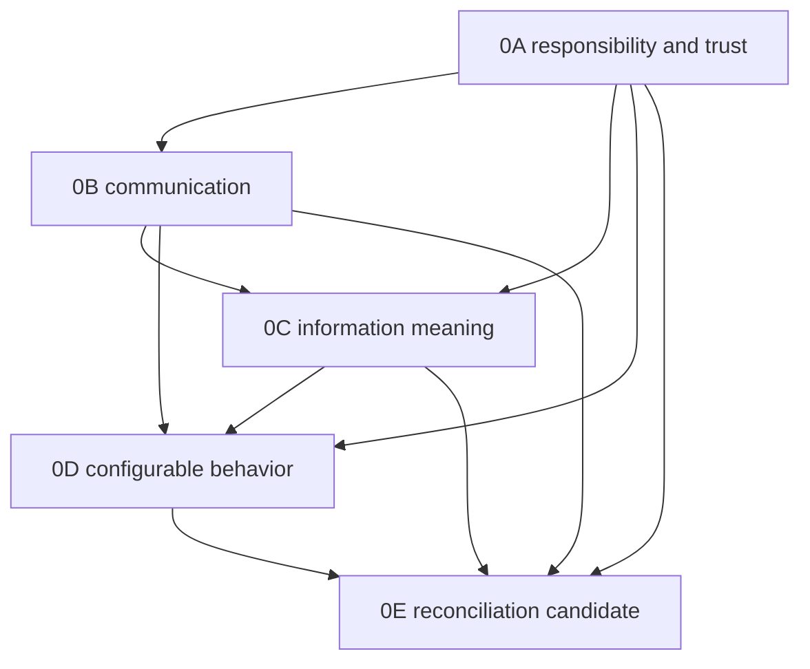

# F7Hub Phase 0E — Foundation Architecture Reconciliation

## Document Control

| Field | Value |
| --- | --- |
| Status | READY_FOR_REVIEW |
| Mode | ARCHITECT / PLAN |
| Authority | UNAPPROVED CANDIDATE |
| Baseline commit | `4c4ecb19022bb2906b56d15f15316f6594bcabcf` |
| Date | 2026-10-07, America/Toronto |
| Scope | Reconcile the exact approved 0A–0D architecture; assess conditional feature-planning readiness |
| Out of scope | Upstream decisions/edits, canonical edits, production implementation, migrations, feature planning, Cloud setup and Git integration |
| Candidate lifecycle | UNSTAGED, UNCOMMITTED, UNPUBLISHED, UNAPPROVED, NOT INTEGRATED |
| Next gate | INDEPENDENT FOUNDATION 0E RECONCILIATION REVIEW |

## Purpose

Determine whether 0A–0D provide coherent ownership and extension rules so downstream features can plan without reinventing shared infrastructure. This document is a reconciliation index. Linked owners retain their authority; condensed positions below do not replace their contracts.

## Scope

Compare ownership, dependencies, interoperability, information semantics, configuration, persistence, security, offline behavior and integrations. Register genuine conflicts, duplicate authority and shared gaps; route unresolved decisions to their owners. Assess architecture depth separately from implementation and runtime evidence.

## Out of Scope

No product functionality, Settings classes, schema, migration, seed, test, dependency, configuration, hotkey, transport, provider or secret mechanism is created or changed. No upstream Foundation/canonical document is edited. No operational database, protected INI, external DynamicHub prototype/backup or real customer/credential data is inspected. No feature architecture, independent approval, staging, commit, push, PR, merge or Cloud configuration is authorized.

## Dependencies

Authoritative source shorthand used throughout the report:

| Key | Authoritative source / sections most relevant to reconciliation |
| --- | --- |
| A | [0A Master Foundation](<0A _Master_Foundation_Architectural_Contract.md#execution-report>); execution report A–O, especially C–F ownership/dependencies, H–I relationships/trust, J configuration, L approved 0A-D1/0A-D2, O downstream contract |
| B | [0B Interoperability](<0B _Global _JSON_Contract_Interoperability_Grammar.md#execution-report>); Contract Principles, Identity / Correlation Rules, Status and Error Model, Validation Architecture, External Provider / Offline Rules, Decision Register |
| C | [0C Information Vocabulary](0C_Taxonomy_Information_Vocabulary.md#execution-report); Classification Decision Tree, Entity/Tag/Relationship Architecture, Shared Operational Vocabulary, Provenance & Confidence, Settings Inputs for Phase 0D |
| D | [0D Settings](0D_Settings_Architecture.md#execution-report); Settings Ownership, Persistence Strategy, Precedence Model, Effective-Value Semantics, Cross-Language Settings Delivery, compatibility and downstream sections |
| G | [Root agent contract](../../../AGENTS.md), [ROOT](../../../ROOT.md), [documentation router](../../19_DocumentationIndex.md), [Planning guidance](../AGENTS.md), [Foundation guidance](AGENTS.md) |
| Scoped | [AltF7Hub instructions](../../../AutoHotkey/Troubleshooting_Sections/AGENTS.md), [PowerShell instructions](../../../PowerShell/AGENTS.md), [Mochi instructions](../../../Mochi/AGENTS.md) |

All four phases are approved inputs, with the exact identities verified below. Historical candidate/result labels describe their earlier execution gates. They do not reverse subsequent user approval and integration. This 0E document has no such approval.

## Reconciliation Method

For each material concept identify owner and consumers, then compare terminology, dependency direction, persistence, security, offline behavior, integration boundary and extension mechanism. The domain-specific tables record conclusions; their source keys resolve through Dependencies. A dimension with no material interaction is NOT RELATED, rather than a fabricated discrepancy. Common safeguards in Security, Offline and Integration apply across the matrices.

Use ALIGNED, SPECIALIZED_COMPATIBLY, DUPLICATED, CONFLICTING, MISSING, DEFERRED_TO_FEATURE, NOT RELATED or NOT VERIFIED. If CONFLICTING, stop deciding that item, record exact evidence/owner/impact and request the owning Foundation review. Continue independent comparisons without selecting a winner. DUPLICATED wording is assessed separately from competing authority.

FACT is inspected source, approved architecture or executed documentation evidence. INFERENCE is the reconciliation conclusion derived from it. ASSUMPTION is a bounded planning premise. RECOMMENDATION is proposed next action. NOT VERIFIED marks missing evidence. APPROVED ARCHITECTURE, IMPLEMENTED STATE, EXECUTED TEST EVIDENCE and PLANNED FEATURE WORK remain separate.

## Acceptance Criteria

The execution mapping later in this document evaluates every criterion individually:

1. Approved 0A–0D source identities and closure status verified.
2. Foundation source links recorded without copying entire upstream documents.
3. Architecture authority matrix completed.
4. Foundation dependency relationships reconciled.
5. Responsibility / technology ownership reconciled.
6. Interoperability boundaries reconciled.
7. Taxonomy / information semantics reconciled.
8. Settings / configuration boundaries reconciled.
9. Persistence assumptions reconciled.
10. Security / secrets boundaries reconciled.
11. Offline-behavior rules reconciled.
12. Integration / external-system boundaries reconciled.
13. Terminology alignment documented.
14. Existing shared architecture reuse assessed.
15. Cross-document conflicts registered and routed.
16. Duplicate concepts / competing ownership assessed.
17. Missing shared architecture assessed and routed.
18. Downstream Foundation contract written.
19. Feature-planning readiness explicitly assessed.
20. No upstream Foundation, production, database or canonical-document implementation change occurred.

## Result Vocabulary

| Candidate result | Required meaning |
| --- | --- |
| READY_FOR_RECONCILIATION_REVIEW | All 20 criteria PASS; no unresolved Foundation conflict or prerequisite upstream change; architecture-depth readiness supported for independent review |
| REQUIRES_FOUNDATION_DECISION | An unresolved cross-Foundation issue requires explicit architecture decision or upstream review before closure |
| BLOCKED | Repository state, source identity, missing authority or evidence integrity prevents reliable reconciliation |

These tokens do not mean APPROVED, INTEGRATED, CLOSED, FOUNDATION_READY_FOR_FEATURE_PLANNING or READY_FOR_IMPLEMENTATION. Foundation readiness follows independent 0E review → explicit USER approval → controlled integration. A successful reconciliation candidate grants no feature-task authority.

---

# EXECUTION REPORT

## Summary

INFERENCE: the verified 0A–0D contracts form a coherent Foundation at architecture-planning depth. A owns responsibilities/trust, B representation/communication, C meaning, and D configurable behavior/resolution. Specialization follows these boundaries; no material unresolved circular authority, duplicate authority or blocking shared gap was identified.

FACT: implementations and deferred designs remain distinct. Shared Settings, active selection coordination, ticketless Case Journal persistence, generalized evidence/attachments, synchronization and external providers are not established implementations by approval. Their architecture supplies owners and constraints; their feature plans still select actual mechanisms. Alt opacity text and older status prose remain owner-specific documentation carry-forwards.

RECOMMENDATION: submit this exact candidate for independent reconciliation review. Do not start downstream feature planning from its self-assessed result.

## Baseline / Candidate Identity

| Gate / item | FRESH observed evidence |
| --- | --- |
| Repository / initial branch | `C:\Dev\F7Hub` / `main` |
| HEAD / local origin/main / live remote main | All `4c4ecb19022bb2906b56d15f15316f6594bcabcf` |
| Origin | `https://github.com/JDecelles1990/F7Hub.git` |
| Tracked / staged changes before authoring | NONE / empty index; diff check clean |
| Initial untracked inventory | Only `AutoHotkey/Troubleshooting_Sections/GuideSettings.ini`; protected, excluded |
| No equivalent 0E artifact | Git tree plus actual Foundation directory list contain only 0A, 0B, 0C, 0D and AGENTS.md; scoped content search found references to a future phase, no equivalent artifact |
| Authorized branch | `docs/foundation-0e-reconciliation-20261007`, created after gates passed; no extra worktree |
| Sole candidate path | `Docs/Planning/Foundation/0E_Foundation_Architecture_Reconciliation.md` |
| New-file tracking | Untracked until separately authorized staging; no intent-to-add/index mutation used to manufacture a tracked diff |
| Whole-file identity | Raw SHA-256, filtered Git blob, bytes and newline-terminated lines reported outside the file after final validation, avoiding a self-changing hash |

Executed initial commands: `git branch --show-current`, `git rev-parse HEAD`, `git rev-parse origin/main`, `git status --short`, `git diff --name-only`, `git diff --cached --name-only`, `git ls-files --others --exclude-standard`, `git diff --check`, `git ls-remote origin refs/heads/main`. Git blob/tree, branch, remotes and directory/content discovery were read-only. No cleanup/recovery was needed.

## Foundation Source Verification

FACT: each expected Git blob matches HEAD. The starting clean tracked checkout establishes no local semantic edits. Subsequent scope checks preserve those inputs.

| Input | Expected = observed Git blob | Approval / integration evidence |
| --- | --- | --- |
| 0A | `b2bfc2f330ea582a224cd6d2c72eb899160725e2` | [PR #66](https://github.com/JDecelles1990/F7Hub/pull/66), MERGED; USER approval and integration review recorded; merge `1a7015b500fc0eccbab749e82585c7936d5cb478` |
| 0B | `e290ba6c9c8cf570f380a10575cb219bdfadfbf4` | [PR #67](https://github.com/JDecelles1990/F7Hub/pull/67), MERGED; independent APPROVE and USER integration approval; merge `41d49d6644727cb324be24e05fda6738cd782eb6` |
| 0C | `8e6fcbfc24b486c92983b13c2488f57a3a0dd2f4` | [PR #68](https://github.com/JDecelles1990/F7Hub/pull/68), MERGED; corrected candidate rereview APPROVE and USER approval; merge `3d0dd673798852941b6fd690cd290dd2ba8c61de` |
| 0D | `26c8ec6e399f7c206717dd156eb4e23b5a73454b` | [PR #70](https://github.com/JDecelles1990/F7Hub/pull/70), MERGED; APPROVE_WITH_NOTES, only Alt opacity note, USER approval; merge is current baseline |
| Foundation AGENTS.md | `16c4c02c541f19d5e8a088d585a3cf27c13d3dfc` | Scoped phase ownership, reconciliation and escalation rules |
| Root AGENTS.md | `714ff3cc2bed24bc246bfd803a0b20d4db1101e4` | Integrated Cloud / Windows-native validation governance; independent of architecture ownership |

Closure status: APPROVED / INTEGRATED / CLOSED for 0A–0D under the explicit user task record; approval and exact-candidate merges independently corroborated by fresh `gh pr view` records and first-parent Git history. The reports preserve historical gate labels rather than retroactively rewriting history. No runtime PASS is inferred from PR approval/merge.

## Repository Areas Inspected

Complete approved Foundation documents were read, including original instructions, execution reports, compatibility tables, deferrals and approval/history distinctions. Bounded current-source checks answered specific reconciliation questions:

| Evidence | Question / inspected sources | Provenance / limitation |
| --- | --- | --- |
| E-G | Initial/final Git gates, input blobs/tree, first-parent log and four PR records | FRESH baseline/approval/scope evidence; no Git publication |
| E-F | Complete A–D and root/Planning/Foundation guidance; applicable subsystem instructions; documentation router | FRESH authority comparison; approved direction separated from historical proposals |
| E-DRIFT | `git diff --name-only 33a246ee5c760356775ed2c31a887f30d82bed42 HEAD -- Python AutoHotkey PowerShell Database Config Tests Mochi` | Empty: production/test areas unchanged since A's inspected base; upstream source findings retained at those identities, no retained runtime tests claimed |
| E-APP | [bootstrap](../../../Python/f7hub/app/bootstrap.py), [database](../../../Python/f7hub/infrastructure/database.py), [logging](../../../Python/f7hub/app/logging_config.py) | FRESH source: dependency-only ApplicationContext, development DB composition, connection guards, process logger; functions not executed |
| E-TAX | [0002 taxonomy](../../../Database/Migrations/0002_taxonomy.sql), [TagRepository](../../../Python/f7hub/repositories/tag_repository.py), migration inventory, bounded class/store searches | FRESH source: scoped categories/global tags; no shared Settings/context/Journal/outbox implementation found in searched Python/migrations |
| E-CASE | [TicketService](../../../Python/f7hub/services/ticket_service.py) note/status/transaction/metadata paths; [0004 tickets](../../../Database/Migrations/0004_tickets.sql) | FRESH targeted source corroborates Ticket activity ownership; broader persistence conclusions use A/C inspected inventory plus E-DRIFT |
| E-PS | [diagnostic results](../../../Python/f7hub/domain/diagnostic_results.py), [PowerShellService](../../../Python/f7hub/services/powershell_service.py) eligibility/pack/strict v1 checks; [Doc12](../../12_PowerShellArchitecture.md) current contract | FRESH source: execution versus collection, literal approval/60-second ceiling, fixed pack; sealed/native guarantees remain retained source findings from A/B/D, not fresh runtime proof |
| E-PET | [MochiService](../../../Python/f7hub/services/mochi_service.py), [protocol](../../../Python/f7hub/domain/mochi_protocol.py), [loader](../../../Mochi/src/mochi/core/config.py), renderer shared imports, relevant README/MVP/Architecture excerpts | FRESH symbol/source checks: targeted subscribers, cosmetic v1 cap, standalone loader; no current business-context authority inferred |
| E-ALT | Tracked [GuideCore](../../../AutoHotkey/Troubleshooting_Sections/GuideCore.ahk) preference/range symbols, [README](../../../AutoHotkey/Troubleshooting_Sections/README.md) overlay section, [Doc11](../../11_AHKArchitecture.md) Slice 046/047 summaries | FRESH source/document comparison only; no protected INI access or native guide execution |
| E-DOC | Relevant [Doc06](../../06_SystemArchitecture.md) services/domain/repos, [Doc13](../../13_PythonArchitecture.md) Settings/logging, [Doc09](../../09_SQLSchema.md) metadata purpose, [Doc01](../../01_Project.md) baseline/offline wording, [CURRENT_STATE](../../Status/CURRENT_STATE.md) opening status | Targeted canonical comparison, not whole-doc/product audit; limitations registered below |
| Skills | `.agents/skills/` inventory and delivery skill applicability | Only vertical-slice-delivery found; slice implementation/review/integration machinery not applied to this documentation-only phase |

NOT VERIFIED: operational database rows/integrity, installed providers/permissions/credentials, employer policy, native desktop/process/ACL behavior, production performance, future APIs/classes/stores, external DynamicHub material. No operational data or runtime application was opened. Architecture findings do not certify deployment.

## Foundation Authority Matrix

Owner keys below reference the precise phase sections in Dependencies. A row's extension route does not authorize work.

| Concern | Authoritative Owner | Consumers / Specializers | Extension Rule | Escalation Rule |
| --- | --- | --- | --- | --- |
| Layer / technology ownership | A C–F | B/C/D; all features | Add within existing direction | A review for ownership/direction change |
| GUI responsibility | A F | D GUI; feature presentation | Inputs/drafts/rendering through services | A for business/SQL/execution leakage |
| Application service responsibility | A C/F | B validation, C assignment, D Settings | Own use cases and authorized effects | A for competing workflow authority |
| Domain logic | A F/G | C meaning; D pure definitions | Owner rules independent of GUI/SDKs | A/C if shared meaning/ownership changes |
| Repository / gateway responsibility | A B/F/I | D persistence; B boundary DTOs | SQL/mechanics or external isolation only | A/security for bypass/transfer |
| SQLite responsibility | A E/F; G integrity | C catalogs; D overrides | Reviewed owner transactions/migrations | A/database owner for relationship/destructive changes |
| AHK responsibility | A F/I | B AHK; D local/config delivery | Desktop interaction, bounded approved contracts | A/B/security for new business/execution IPC |
| PowerShell responsibility | A F/I | B PS; D PS input | Approved technical operations via service/gateway | A/B/execution owner before widening authority |
| Mochi responsibility | A C/F/I | B/C/D Mochi sections | Cosmetic/advisory minimal approved projection | A/B/security for context/action expansion |
| DynamicHub responsibility | A 0A-D1 | B workflow contracts; C vocabulary; D runtime boundary | Coordinate owning services, preserve Diagnostics | A for alternate execution/persistence/domain authority |
| Interoperability grammar | B Contract Principles | C references; D projections; features | Specialize payload/profile | B review for global grammar change |
| Commands / queries / events / results | B Message Classes; C operational meaning | A workflow; D notifications | Preserve intent/read/fact/outcome distinctions | B/C if shared semantics conflict |
| JSON serialization / versioning | B Serialization / Versioning | C keys; D cross-process config | Retained profiles/adapters, tested extensions | B for incompatible shared representation |
| Taxonomy | C Classification/Tag Architecture | A feature owners; B representation; D display | Search/reuse/catalog extension | C for second taxonomy or meaning change |
| Entity / Entity Type | C Entity Architecture | Parsers/domain resolvers; B/D | Profile/occurrence, explicit accepted reference | C/A for identity/ownership change |
| Tags / Categories | C Category/Tag Architecture | Ticket/Knowledge/future assignment owners | Existing catalog, controlled eligibility | C for semantic merge or duplicate authority |
| Status / Priority / Relationship | C vocabulary; owning domain under A | B outcome axes; D presentation | Typed owner values/links | C/A for universalization or ownership change |
| Provenance / confidence | C Provenance & Confidence | B payloads; A evidence; D thresholds | Minimal source/method/acceptance, task-specific uncertainty | C/security for truth/permission reinterpretation |
| Settings definitions | D Definition Model / Ownership | Pure module contributions | Justified typed key, static composition | D for parallel definition/default system |
| Defaults / overrides / precedence | D Defaults / Precedence / Effective semantics | Feature services; GUI | Per-key admitted sources, one shared resolution | D for new hierarchy/global store |
| Secret boundary | A I; D Secrets specializes config; B/C exclusions | Integration/security feature | Reviewed secure reference/transient use only | A/security before credential mechanism |
| Security invariants | A I and G | B/C/D specialized enforcement | Preserve independent authorization | A/security before changing trust/invariants |
| Offline behavior | A cross-cutting/offline table | B provider rules; C local semantics; D startup | Feature class consistent with local guarantees | A if optional remote becomes local prerequisite |
| Integration gateways | A C/I | B provider DTOs; C provenance; D config | Reviewed vendor-neutral adapter | A/B/security for boundary replacement |
| External systems of record | A external authority table | B confirmation; C scoped identity; D references | Feature-reviewed local/remote distinction | A for system-of-record transfer |
| Synchronization / outbox | A cross-cutting; B retry/idempotency semantics | Feature integration owner | Real use case; bounded keys/conflicts/confirmation | A/B for replay/authority/grammar changes |
| Capability / permission distinction | A cross-cutting; B discovery | C vocabulary; D flags | Discover supported/current availability independently | A/security if flag/claim grants authority |
| Shared context | A C/D/H | B refs/freshness; C selected-context; D runtime distinction | App-owned selection, source-service projections | A/B for circular ownership/new global channel |
| Evidence | A E/H; C Evidence/provenance semantics | B bounded refs; D retention inputs | Producer source plus explicit accepted association | A/C for global ledger/authority redefinition |
| Case Journal / Case activity | A 0A-D2 | B optional refs; C relationships; D state distinction | Ticket-optional local work, reuse-first future persistence | A for mandatory Ticket/competing Timeline |
| Audit versus technical logging | A B/I; B Security; D Audit specializes changes | C event/evidence meaning; feature audit | Purpose-owned evidence, reuse safe logging separately | A/security if logs substitute required audit |
| Feature extension versus Foundation change | G Foundation; A O/B/C/D handoffs | All future feature owners | Existing approved mechanisms, explicit owner | Route changed shared meaning/boundary to owning phase |

INFERENCE: no additional Foundation owner is needed. Technical/domain owners specialize phase authority; validation governance is not a fifth architectural subsystem.

## Foundation Dependency Reconciliation

Arrows indicate consumption of approved architectural inputs and review order, not runtime imports or a requirement to build each subsystem serially.

| Phase | Consumed inputs | Reconciliation / boundary |
| --- | --- | --- |
| B from A | Ownership, trust, approved execution, optional Ticket context/local Journal | SPECIALIZED_COMPATIBLY: grammar cannot create new domain/execution authority |
| C from A/B | Source/record owners; typed references, missing/null, naming/version/validation | SPECIALIZED_COMPATIBLY: semantics constrain payloads without taking envelope authority |
| D from A/B/C | Application boundaries, process contracts, semantic/invariant exclusions, C's Settings inputs | SPECIALIZED_COMPATIBLY: definitions configure supported behavior without changing catalogs or wire grammar |
| E from A–D | All four approved contracts and scoped governance | ALIGNED: compares and routes; never replaces or amends |

B reserves domain meaning for C; C supplies permitted vocabulary to B-governed feature profiles. A reserves Settings mechanics for D; D supplies typed inputs within A's boundaries. These are deliberate division of concerns, not circular decision prerequisites. No material unresolved circular authority dependency was found. D's pure module definitions and injected access avoid Settings→feature-operation→Settings construction loops; post-commit notification is runtime flow, not reverse ownership.

## Responsibility / Technology Ownership Reconciliation

| Boundary evaluated | Position across A/B/C/D | Conclusion / downstream constraint |
| --- | --- | --- |
| GUI / application services / domain | A owns layer rules; B ingress maps DTOs; C services own assignment meaning; D GUI drafts/pure definitions | ALIGNED; no UI business/default/SQL authority |
| Repositories / gateways / SQLite | A separates mechanics, persistence and process isolation; B no raw wire ledger; C explicit owner links; D overrides only | SPECIALIZED_COMPATIBLY; repository does not become policy owner |
| AHK / PowerShell | A desktop/technical roles; B retained narrow protocols; C no taxonomy truth; D effective inputs/local exceptions | ALIGNED; no companion core DB writer or alternate executor |
| Mochi / AI | A advisory; B separate bounded expansion; C provenance/acceptance; D flags not capabilities | ALIGNED; no advisory output executes or writes authoritative data |
| DynamicHub / Diagnostics | A-D1 coordination versus definitions/execution/results; B request/result; C evidence meaning; D workflow-state exclusion | ALIGNED; coordinator cannot steal execution authority |
| Shared Settings / catalogs / registries | A delegates mechanics to D and meaning to C/domains; B schemas source-owned; D excludes taxonomy/script/diagnostic registries | ALIGNED; no generic key/value business-definition store |
| External providers | A adapters/system of record; B DTO/confirmation; C namespace/provenance; D conditional safe config | ALIGNED; provider payload/configuration cannot own unrelated domain truth |
| Analytics | A read-oriented derived facts; B no transient IPC as permanent truth; C grain/eligible dimensions; D permitted query/display inputs | ALIGNED; own derived outputs, no operational writes or automatic remediation |
| Clipboard | A lifecycle in Python with desktop adapter; B capture/event/item distinct; C source occurrences; D optional history/retention | SPECIALIZED_COMPATIBLY; capture does not imply persistence, resolution or execution |
| Knowledge / Tickets | A existing services/activity; B metadata not wire grammar; C scoped category/global-tag identity; D state not settings | ALIGNED; domains retain lifecycle/identity/association authority |

No duplicated owner, missing shared authority, technology leakage, service/repository confusion, Settings/domain confusion, UI rule leakage or companion authority expansion is required to consume the approved design. This conclusion evaluates contracts, not every current code path.

## Interoperability Reconciliation

| Comparison | Evidence / result |
| --- | --- |
| Transport versus domain meaning | B Contract Principles and C 0B Compatibility: ALIGNED; transport/framing cannot redefine interpretation or authority |
| Configuration versus IPC | B inventory/File boundary and D Cross-Language Settings Delivery: ALIGNED; standalone JSON/INI are config, not universal message envelopes |
| Settings versus global wire grammar | D projects only admitted effective fields through B when crossing a real process boundary: SPECIALIZED_COMPATIBLY; no second config grammar |
| AHK fixed native bridge | A K/B Existing Interoperability Inventory/D AHK boundary: SPECIALIZED_COMPATIBLY; fixed show/focus v1 remains bounded, not business RPC |
| Mochi cosmetic/context contracts | A I/B Mochi/D Mochi boundary: SPECIALIZED_COMPATIBLY; cosmetic v1 unchanged; future advisory projection requires separate reviewed minimization/trust |
| PowerShell operation results | A E/I, B PowerShell, C operational outcome, D PowerShell: ALIGNED; exact schemaVersion 1 validated first; collection ERROR can be completed result |
| New profile versus legacy spelling/limits | B adapters preserve profiles; C retains legacy IDs/slugs; D cannot expand safety maxima: SPECIALIZED_COMPATIBLY |
| Schema versus semantic validation | B owns structural format, C meaning, D definition validation, A owning-service authorization: ALIGNED; valid shape never grants permission |

Cross-language configuration or new feature integration extends B's approved rules. A new operation-specific profile may differ where B explicitly permits it; it cannot introduce incompatible global messaging semantics. No real incompatibility was identified.

## Taxonomy / Information Reconciliation

| Concept | Owner-consumer comparison | Conclusion |
| --- | --- | --- |
| Category / Type / Kind | A separates formal classification/discriminator; C scopes/owner types; B preserves domain tokens; D display/use only | ALIGNED; no universal Type or preference-defined semantics |
| Entity / Entity Type | A records/source ownership; C occurrences versus canonical records; B owner refs; D context not overrides | ALIGNED; extraction/normalized equality never creates business identity |
| Tag | A existing global catalog; C optional topical meaning and controlled extension; B keys not catalog dumps; D suggestions only | ALIGNED; no literal/secret/state Tags or parallel catalog |
| Status / Priority / Relationship | C domain state/urgency/typed links; B outcome axes; A writers; D UI parameters | ALIGNED; no global PASS/workflow engine or settings-defined link truth |
| Provenance / Confidence | C origin/method/assignment/acceptance and optional uncertainty; B representation; A evidence; D display/calibrated threshold | SPECIALIZED_COMPATIBLY; certainty/acceptance cannot authorize effects |
| Normalization / aliases / labels | C type-specific semantics/raw preservation; B units/encoding; D locale-neutral keys/localized presentation | ALIGNED; no global lowercasing, synonym guessing or translated identity |

Domain services retain business meaning. Approved entry/profile extensions need not reopen Foundation, but behavioral closed-enum or contract changes still follow B's compatibility review. C's illustrative planning examples are refined by its execution report; different sample keys are not competing installed catalogs.

## Settings / Configuration Reconciliation

| Concern | A/B/C constraint consumed by D | Conclusion |
| --- | --- | --- |
| Shared mechanics | A Python application owner; B no config authority; C meaning outside prefs | ALIGNED: D owns typed admission/resolution/change orchestration; modules own permitted definition meaning |
| Persistence / GUI | A repositories mechanics and GUI presentation | ALIGNED: SQLite stores overrides only; GUI edits drafts, not validation/default authority |
| Defaults / precedence | A delegated detail; B missing/null distinctions; C semantic exclusions | SPECIALIZED_COMPATIBLY: D per-key source ranks; default/stored/session for ordinary USER, startup path resolution outside DB |
| Secrets / invariants / registries | A security, B grammar/caps, C catalog/meaning | ALIGNED: all outside ordinary Settings precedence; reference mechanism remains conditional |
| Local companions | A existing ownership, B retained protocols | SPECIALIZED_COMPATIBLY: Alt INI and standalone Mochi JSON remain local; future named adapters require one explicit authority |
| Changes / active work | A context freshness, B truthful outcomes, C source lifetime | ALIGNED: immutable start snapshot; commit versus activation separate; no false rollback/cancel/replay |
| Notifications / dependency | A finite services; B event versus persisted fact | ALIGNED: pure contributions plus targeted post-commit subscribers; no event bus or Settings invocation of feature operations |

No redesign of D is required. Exact keys/defaults, CAS schema, native activation and feature-specific consent/audit remain deferred designs with the existing owner.

## Persistence Reconciliation

Classification describes current mechanism or approved future boundary, never operational database validity. Where one concern has several states, they are identified separately.

| State / concept | Persistence classification | Authority / cross-phase reconciliation |
| --- | --- | --- |
| SQLite Ticket/company/contact/Knowledge records | CURRENTLY IMPLEMENTED | A E plus C inventory; service/repository migrations define source mechanisms; live rows NOT VERIFIED |
| Settings overrides | APPROVED FUTURE ARCHITECTURE | D shared SQLite overrides; A repository direction/B no raw wire persistence/C semantics excluded; no migrated Settings store |
| Categories/global Tags/Knowledge assignments | CURRENTLY IMPLEMENTED | C and E-TAX; families/aliases/stewardship/lifecycle/new module links are FEATURE-OWNED FUTURE DESIGN on existing identity |
| Ticket notes/status/timeline and Knowledge versions | CURRENTLY IMPLEMENTED | A E/C inventories/E-CASE; activity and content revisions retain separate purposes; no general security audit implied |
| Ticketless Case Journal / generated durable draft | APPROVED FUTURE ARCHITECTURE | A-D2 mandates local ticket-optional possibility; FEATURE-OWNED FUTURE DESIGN chooses reuse/extension, physical storage/lifecycle |
| Diagnostic run/pack results | RUNTIME ONLY | A/B current inventory, E-PS; no durable session/result history. Future persistence belongs to Diagnostics feature design |
| Evidence source and accepted Case association | APPROVED FUTURE ARCHITECTURE | A producer authority/C explicit Evidence/provenance; concrete source/result mechanisms exist, general association store is FEATURE-OWNED FUTURE DESIGN |
| Attachments / binary content | FEATURE-OWNED FUTURE DESIGN | A separates metadata/file ownership, B bounded authorized refs; no general attachment facility established |
| Selected context / GUI drafts / session overrides | RUNTIME ONLY | A app selection/B conditional refs/D runtime distinction; future justified restoration remains feature-owned, not automatic Settings |
| Mochi cosmetic state / attachment / playback | RUNTIME ONLY | A/B retained protocol/D state boundary; read-only startup JSON is CURRENTLY IMPLEMENTED configuration, not persistent playback |
| AltF7Hub local preferences | CURRENTLY IMPLEMENTED mechanism | D KEEP SUBSYSTEM-LOCAL; tracked source defines INI reader/writer; live file contents/existence beyond Git pathname NOT VERIFIED |
| Configuration files | CURRENTLY IMPLEMENTED standalone Mochi JSON / guide INI mechanism | D owns their classification; no central config file or universal config exchange mandated |
| Bootstrap values / paths / child environment | CURRENTLY IMPLEMENTED startup and transient mechanisms | D application composition outside DB-dependent Settings; environment is no ordinary secret vault |
| External official records | EXTERNAL SYSTEM OF RECORD, future reviewed provider | A/B rule; no current external integration established. Provider/remote IDs and authoritative adoption NOT VERIFIED |
| Synchronization metadata / outbox | FEATURE-OWNED FUTURE DESIGN | A use-case ownership/B operation keys/retry/uncertainty/C namespace; no generic outbox/mapping table mandated |
| Secret references / credential material | NOT VERIFIED mechanism | A security boundary/D conditional safe reference; secrets excluded from ordinary DB/files/Settings/evidence; no chosen broker/store |
| Technical logs / meaningful audit | CURRENTLY IMPLEMENTED process logging and Ticket activity | A/D separate future audit use cases; durable sensitive-change audit is FEATURE-OWNED FUTURE DESIGN, no universal ledger |

INFERENCE: the approved persistence assumptions are compatible. SQL prose is not proof of applied schema. No table, migration number, schema or data change is produced, and no SQLite connection was opened.

## Security / Secrets Reconciliation

Foundation readiness requires a clear rule denying lower-trust shortcuts; implementation assurance remains a later gate.

| Security concern | Cross-phase evidence / reconciliation | Required downstream enforcement |
| --- | --- | --- |
| Least privilege / technician intent | A I; B Security; C acceptance; D sensitive edits: ALIGNED | Owning use case validates current intent/access; producer claim/UI enablement not permission |
| AI non-authority / automatic remediation | A advisory boundary; B action proposal; C AI provenance; D rejected execution flag: ALIGNED | AI may explain/draft/suggest; approved service and technician authority required for effects |
| PowerShell / registered operations / elevation | A I/B PS/D PS and E-PS: ALIGNED | Exact identity and policy, sealed trusted non-elevated runtime, bounds/cleanup; no registry/checksum-only permission or self-elevation |
| Untrusted input / configuration validation | A input boundary; B admission; C meaning; D definition/load/change checks: SPECIALIZED_COMPATIBLY | Parse/schema/domain/reference/authorization checks remain separate; invalid sensitive config fails closed |
| Secrets / credential references | A I/B Security/C Privacy/D Secrets: ALIGNED | No ordinary Settings/domain/history/log/evidence secret storage; reviewed safe opaque refs only, transient authorized retrieval |
| Capability / permission / authorization | A integration assessment/B discovery/C namespaces/D flags: ALIGNED | Supported operation, granted access, current connectivity/preconditions and technician authorization checked independently |
| External/customer/employer data | A minimization/B DTO containment/C sensitivity/D conservative settings: ALIGNED | Synthetic development; unknown employer/provider policy NOT VERIFIED; no automatic raw disclosure |
| Clipboard privacy / retention | A lifecycle/B eligibility/C promotion/D reset/retention: ALIGNED | Optional persistence; exclude secrets before retention/export; source TTL does not delete accepted durable evidence |
| Logging versus audit | A B/I, B Security, C events, D Audit: ALIGNED | Safe technical classifications, no raw rejected values; required durable audit must exist before sensitive activation |
| IPC trust / companion authority | A I/B peer binding/C no truth grants/D no v1 expansion: ALIGNED | Same-user connection/checkout digest insufficient for sensitive/admin identity; separate threat review before expansion |
| Destructive actions / delayed replay | A offline/external, B idempotency, C Action/Result, D reset/flags: ALIGNED | Fresh context/authorization/preconditions and reviewed confirmation/recovery; no automatic stale administrative replay |

INFERENCE: no approved architecture route permits AHK, Mochi, AI, provider DTOs, taxonomy metadata, Settings flags or valid JSON to bypass the owning security boundary. This is architecture compatibility, not a penetration test or a claim that future enforcement exists. Unknown provider authentication, audit/consent mechanics and real employer policy remain explicit release dependencies for their features.

## Offline-Behavior Reconciliation

Classifications below consume A's approved offline table and B/D rules. They describe obligations, not implemented availability.

| Workflow | Supported classification | Reconciliation / limitation |
| --- | --- | --- |
| Shared Settings definitions/overrides | LOCAL_REQUIRED local mechanism, INFERENCE from D Settings Principles/Persistence | No remote schema/config fetch or provider startup dependency; current shared service/store absent |
| Local Knowledge search | LOCAL_REQUIRED | A local-search table/C existing FTS; optional provider lookup cannot disable local retrieval |
| Local Clipboard workflow | LOCAL_REQUIRED | A offline table/B capture/D optional-history rule; history remains optional/privacy-aware |
| Current local diagnostics | LOCAL_REQUIRED | A/B current operations; installed PS/runtime/permissions needed locally, no online prerequisite |
| Case Journal storage / local note drafting/editing | LOCAL_REQUIRED | Explicit A-D2; no mandatory Ticket/PSA/AI; generalized persistence/generator absent |
| AI enhancement | ONLINE_OPTIONAL product enhancement | A/B; a specific remote request is ONLINE_REQUIRED, preserving local deterministic work |
| External PSA/RMM sync/publication/read | ONLINE_REQUIRED for remote operation/confirmation | A/B; provider/use-case details DEFERRED_TO_FEATURE, no required vendor |
| Credential provider retrieval | ONLINE_REQUIRED when using a remote provider | A table; chosen secure mechanism/caching NOT VERIFIED, local work unaffected |
| Microsoft cloud administration | ONLINE_REQUIRED for an actual remote operation, conditional INFERENCE from A external boundary | Exact use cases/providers/permissions DEFERRED_TO_FEATURE; no invented global tenant service |
| Cosmetic Mochi / local guide/hints | LOCAL_REQUIRED local capability | A/B/Scoped Mochi local guidance rule; pet implemented, reviewed populated guide/recognition remain planned |
| Future remote Diagnostics / provider-assisted workflow | DEFERRED_TO_FEATURE overall composition | A says remote diagnostic operation ONLINE_REQUIRED; feature must classify each local/remote step explicitly |

INFERENCE: A local-required obligations, B remote confirmation/replay and D local configuration/degradation are compatible. C's semantic rules require no online resolver; no match/ambiguous/unavailable reference remains valid. Every future workflow must keep its local component useful when optional providers fail.

## Integration / External-System Reconciliation

Approved direction: F7Hub domain/use case → application service → integration gateway/adapter → provider. Incoming provider DTOs are validated and converted before domain use. This is A ownership specialized by B representation, C namespaces/provenance and D permitted configuration.

| Integration concern | Comparison / result | Detail owner and remaining limit |
| --- | --- | --- |
| Vendor neutrality / DTO containment | A I/B provider rules/C external origin/D config: ALIGNED | Feature adapter; HaloPSA/Ninja/CIPP/Keeper/Microsoft are examples, no selected implementation here |
| Systems of record / remote identity | A authority table/B scoped refs/C occurrence-versus-record/D no settings identity: ALIGNED | Domain/provider plan adopts official remote authority explicitly; preserve local IDs and confirmed mappings |
| Capability discovery / permissions / connectivity | A assessment/B fresh discovery/D flag exclusion: ALIGNED | Integration service observes actual availability; configured provider never implies licensed/permitted/online capability |
| Authentication / credential boundary | A security/B peer/provider validation/D safe refs: ALIGNED | Security/integration review before credentials; actual mechanism NOT VERIFIED |
| Read-only-first / destructive operations | G and A/B controlled operations/D invariants: ALIGNED | Actual provider/use case chooses narrowly permitted operations, reviewed safeguards for mutations |
| Delayed synchronization / outbox | A queueability/B explicit operation identity/D feature state: SPECIALIZED_COMPATIBLY | Feature design when justified; not universal message persistence or scheduler |
| Idempotency / retry / stale-state detection | B External Provider / Offline Rules with A fresh context/C source identity/D snapshot: ALIGNED | Feature keys bind intent/revision/destination and retention; bounded retry/conflicts/confirmation; local delivery ID is not exactly-once |
| Remote timeout / uncertain outcome | B Status and Error Model/D desired-versus-applied/A local drafts: ALIGNED | Preserve draft and uncertainty; reconcile actual remote state, no fabricated success/cancel/replay |

Specific scopes, licenses, providers, identity-mapping schema, outbox implementation and API behavior remain DEFERRED_TO_FEATURE or NOT VERIFIED. These deferrals leave shared ownership intact; 0E selects no provider framework.

## Shared Context Reconciliation

A owns application selection of authoritative references; B governs conditional wire refs/correlation/freshness; C defines Context/Selected Context/Session; D separates selection/runtime from preference. Conclusion: SPECIALIZED_COMPATIBLY.

| Context concept | Permitted meaning / authority | Availability limit |
| --- | --- | --- |
| Technician Workspace | Presentation/tool hosting/lifecycle; consumes services | Current stacked workspaces; richer restoration/hosting feature design deferred |
| Active Technician Context | App-owned selected bounded references, source services own records | Shared selection service not implemented; ApplicationContext is dependency composition |
| Company / User / Contact | Owner-qualified business reference if available; observed user ≠ validated Contact | Companies/Contacts exist; universal technician/user identity not inferred |
| Device / Ticket / Tenant | Optional typed owner reference; TicketService retains local identity | Ticket implemented; no generalized Device/Tenant authority fabricated from hostname/provider token |
| Diagnostic Session | Diagnostics-owned lifetime/reference when defined | Current run/pack memory; no universal Session store |
| Clipboard evidence / Knowledge Article | Source ownership plus explicit accepted/selected reference | Knowledge exists; generalized Clipboard/evidence context deferred |
| Mochi / DynamicHub consumers | Approved minimized advisory or workflow projection | Neither owns selected records; current cosmetic Mochi and absent DynamicHub do not implement shared context |

Absent context values remain valid for profiles that do not require them. Ticketless Journal never fabricates a Ticket/session ID. Bind pending work/drafts to initiating references/revisions; later selection cannot silently retarget. Consumer data flow does not create source-service dependencies back to Mochi/Analytics/DynamicHub. No global context persistence or configuration record is mandated.

## Evidence / Provenance Reconciliation

A E/H assigns source to the producer and association to an explicit Case/use-case owner; C defines Evidence, Observation, Finding, Telemetry and provenance; B carries bounded validated facts or authorized opaque references; D supplies permitted retention/display inputs. Conclusion: ALIGNED.

An observation is not automatically evidence for a claim, a finding is interpretation, and a recommendation grants no action authority. Capture or successful collection cannot establish resolution. Attribution preserves origin, method and later acceptance separately; AI/import origin is not erased by technician acceptance. Confidence is optional method-specific uncertainty, never permission or proof. Evidence access/retention/outbound eligibility remain source/use-case policy, independent of Settings or a reference's possession. Physical attachment storage, durable evidence association and exact provenance fields are FEATURE-OWNED FUTURE DESIGN; no global ledger is required to reconcile these rules.

## Case Journal Reconciliation

FACT: A-D2 explicitly supports local pre-ticket work and records that remain ticketless, with optional Ticket association. Existing Ticket-owned activity stays authoritative; Journal cannot become a competing Timeline. B's conditional context accommodates this; C's typed relationships/provenance preserve source and accepted associations; D forbids workflow/domain records in Settings. Conclusion: ALIGNED.

Local Journal storage and deterministic draft creation/editing cannot require external PSA, AI or a saved Ticket. Later persistence planning must SEARCH → IDENTIFY → REUSE / EXTEND → CREATE ONLY IF NECESSARY, preserving existing ticket authority. Physical schema, templates, association cardinality, retention and publication UX remain feature-owned. No new table/service/repository follows from the architectural requirement; a provider's official published note is distinct from a local working draft.

## DynamicHub Reconciliation

FACT: A-D1 assigns interactive troubleshooting workflow coordination to DynamicHub. Diagnostics owns definitions, execution and results; the established PowerShell service/gateway owns controlled process execution. B request/result semantics, C operational vocabulary and D workflow-state distinction consume that boundary. Conclusion: ALIGNED.

DynamicHub may select context, sequence technician-facing actions and present structured results through owning services. It is no alternate executor, persistence layer, Ticket identity, Analytics, Clipboard, Knowledge or AI authority. Current tracked inventory/source searches and unchanged production identity establish no current tracked DynamicHub implementation in the inspected baseline. No external backup/prototype was inspected or restored. Exact workflow state/preferences/contracts remain DEFERRED_TO_FEATURE.

## Cloud / Windows Validation Governance Compatibility

Root G owns validation-evidence discipline; it is no fifth Foundation architecture owner. A/B/C distinguish source/tests/design from runtime evidence, and D explicitly separates portable and Windows-dependent portions. Conclusion: ALIGNED.

Use PASS, FAIL, NOT RUN, BLOCKED as results; CLOUD_PORTABLE and WINDOWS_NATIVE as environments. A source read on Windows does not prove native runtime behavior. Portable success cannot certify AHK hotkeys, Windows process/ACL/registry/service behavior, native GUI/DPI/tray, Windows paths/locking or native Mochi interaction. Unsupported native behavior in a cloud host is NOT RUN. Actual platform-independent defects remain FAIL. No Settings flag/environment override can change validation authority. Cloud setup remains DEFERRED; no configuration is created.

## Terminology Matrix

These are concise reconciled distinctions, with authority retained by linked A–D. Extension means a reviewed owner mechanism, not permission granted here.

| Term | Authoritative Phase | Meaning | Must Not Be Confused With | Downstream Extension Rule |
| --- | --- | --- | --- | --- |
| Setting | D | Typed admitted supported behavioral variation | Domain semantics, arbitrary key/value | Pure owner definition plus shared mechanics |
| Configuration | D under A | Broader permitted startup/behavior inputs | Automatic IPC or secret store | Per-purpose allowed sources |
| Runtime State | A/D | Current session/workflow facts | Durable preference | Owner lifetime; persistence only if justified |
| Domain Data | A, meaning C/domain | Authoritative business records | DTOs or overrides | Owning service/repository |
| Reference Data | C/domain under A | Controlled reusable definitions/identities | Ordinary Settings | Existing catalog/domain stewardship |
| Registry | A/domain; B for contracts | Inventory of identities/definitions/profiles | Blanket execution permission | Specific registered owner procedure |
| Catalog | C | Shared governed reference identity | Copied per-module lists | Search/alias/reuse/controlled addition |
| Secret | A security; D config exclusion | Authentication material | Sensitive but non-secret observations | Separate approved secure boundary |
| Secret Reference | A/D conditional | Safe purpose-bound non-secret handle if reviewed | Secret value/bearer authorization | Secure owner resolves transiently |
| Capability | A/B | Supported/currently available operation | Preference or permission grant | Provider/use-case discovery, fresh checks |
| Permission | A security/B | Granted access under actual boundary | Supported operation/technician intent | Least privilege, check at use |
| Authorization | A security | Decision permitting current actor/intent/effect | UUID, valid schema, checksum | Owning service with current preconditions |
| Command | B; C operational meaning | Intentional action request | Already occurred fact | Approved operation/payload and authority |
| Query | B | Bounded authorized read request | Mutating command | Owner profile/response |
| Event | B/C | Fact that occurred | Request, terminal result, durable audit | Feature-owned fact; no bus/store mandate |
| Result | B/C | Valid request/operation outcome | Resolution, transport ACK, collection severity | Preserve outcome axes/correlation |
| Entity | C | Concrete referent; occurrence or canonical record distinct | Topic Tag or automatic business identity | Source profile/explicit accepted resolver link |
| Entity Type | C | Recognition/interpretation profile | Universal business Type | Controlled semantic profile addition |
| Tag | C | Optional reusable topical annotation | Literal, secret, workflow status | Existing global catalog/owner eligibility |
| Category | C | Formal scoped classification | Global topical identity | Existing scope/cycle/assignment rules |
| Type / Kind | C, domain owns values | What record is / shape or behavior | Topic or status | Owner enum/reference extension, B compatibility |
| Status | C/domain; B outcome axes | State within declared owner workflow/profile | Universal success or Tag | Owner values, not arbitrary overrides |
| Priority | C/domain | Owner urgency/importance | Script risk or collection severity | Declared owner policy |
| Relationship | C/domain | Typed directed/declared connection | Shared Tag or generic JSON pointer | Explicit endpoint/predicate/integrity review |
| Provenance | C | Origin/method/assignment/acceptance attribution | Confidence or authorization | Minimal owner metadata; provider reference |
| Confidence | C | Optional task/method uncertainty | Objective truth, permission, manual score | Profile/calibration before thresholds |
| Normalization | C | Type-specific derived comparison preserving permitted raw | Identity merge or access | Versioned source profile, B units |
| Evidence | A/C | Source explicitly associated with claim/workflow | Raw telemetry, attachment alone | Source owner and accepted association |
| Audit Event | A/security; D change specialization | Meaningful purpose-owned action/change evidence | Technical log or transient EVENT | Use-case durability/failure requirements |
| Technical Log | A infrastructure; B/D safe metadata | Bounded operational troubleshooting | Domain truth/audit/secret store | Existing process logger, minimize content |
| Context | A/C; B representation | Purpose-bound selected refs/projection | Domain ownership or whole-record dump | App/source owners, freshness/minimization |
| Workspace | A | Presentation/tool lifecycle shell | Business authority or context store | Approved tool/hosting extension |
| Case Journal | A-D2 | Local working/investigative record, Ticket optional | Competing Ticket Timeline | Reuse-first local feature design |
| External System of Record | A | Reviewed authoritative remote record boundary | Local draft/cache/queue | Explicit domain/provider adoption |
| Outbox / Synchronization Operation | A/B | Conditional delayed intent with identity/confirmation | Raw message log/stale admin replay | Real feature keys/retry/conflict policy |

## Existing Architecture Reuse Matrix

Treatments reconcile existing mechanisms recognized by A–D; none creates a replacement architecture. Source evidence and E-DRIFT support availability; runtime fitness still needs relevant future tests.

| Existing mechanism | Treatment | Reconciliation / constraint |
| --- | --- | --- |
| Mochi service/gateway/channel/protocol | REUSE | A FC14/B inventory/D companion: retained cosmetic v1; ADAPT externally only for separately approved projections |
| AltF7Hub service/gateway/host | REUSE | A FC16/B fixed bridge/D local prefs; no context/config RPC expansion |
| PowerShellService/Gateway/WindowsExecution | REUSE | A FC10–11/B PS/D boundaries; EXTEND approved identities only through controlled future slices |
| Diagnostic run/pack results | REUSE | Existing typed memory values; no global result/status or durable-session replacement |
| CategoryRepository/categories | EXTEND | Reuse identity/reads; future management scope/cycle/eligibility checks under C, not assumed implemented |
| TagRepository/tags/Knowledge junction | EXTEND | Existing global identity and explicit assignment; no second Global Tags table |
| Database migration/connection/backup infrastructure | REUSE | Immutable history/checksums, configured connections/short transactions; no second preference DB |
| Application bootstrap / ApplicationContext | REUSE | Composition injects dependencies; active selected context is a separate future concern |
| Logging infrastructure | REUSE | Process-local technical logging; required meaningful audit not substituted |
| Transaction / repository patterns | REUSE | Owner atomic writes/expected-state principle; Settings CAS/schema details later |
| Notification / subscription patterns | ADAPT | Mochi owned subscribers/Qt presentation precedent; no shared Settings→Mochi dependency or global bus |
| Mochi standalone loader / GuideCore local prefs | KEEP SUBSYSTEM-LOCAL | B config≠IPC/D explicit local exceptions; future one-authority mappings require review |
| ServiceTaskRunner | REUSE | Finite service work/GUI-thread callbacks, no durable scheduler/cancellation model inferred |
| External provider/credential/outbox framework | NOT VERIFIED | No current mechanism established; A/B defer to actual use cases, not replacement work |

No DEPRECATE LATER or replacement recommendation is justified by this reconciliation. Planned global Settings is a missing implementation with approved ownership, not a missing Foundation contract.

## Current Implementation vs Approved Foundation Matrix

| Shared concept | APPROVED FOUNDATION ARCHITECTURE | CURRENTLY IMPLEMENTED source state | PLANNED / DEFERRED |
| --- | --- | --- | --- |
| Layers / use cases / persistence | A modular monolith, owning services/repos/gateways | Existing composition/domain services/migrations | Add only justified feature mechanisms |
| Interoperability | B common new-profile rules plus retained legacy | PS schemaVersion 1, Mochi cosmetic v1, fixed Alt bridge | New composite schemas/adapters/runtime library/transport |
| Taxonomy | C distinctions/control, existing identity reuse | Scoped categories, flat global tags/Knowledge associations | Family/alias/lifecycle/new junction/profile management |
| Settings | D Python shared resolution, source definitions/SQLite overrides | Startup inputs, local companion config, runtime Mochi dialog | Shared service/repository/CAS/GUI, exact feature definitions |
| Selected context / Workspace | A app reference selection, shell not business owner | MainWindow/feature pages; local Ticket selection; dependency-only ApplicationContext | Shared active selection/projections/restoration |
| Case Journal / evidence | A-D2 ticket-optional local work; producer source/explicit association | Ticket notes/status/timeline; memory diagnostic results | Journal/draft/association/attachments reuse-first design |
| DynamicHub / Diagnostics | A-D1 coordinator versus execution authority | Diagnostics fixed pack/service; no tracked DynamicHub implementation established | Reviewed workflow/context contracts; no prototype restoration |
| Analytics / advisory AI | A read-derived/advisory, C provenance/eligibility | Cosmetic Mochi only; no Analytics/provider runtime established | Metric definitions, eligible projections, preview/Send integration |
| Integration / synchronization | A systems of record; B scoped refs/uncertainty/retry | Local process gateways only; no external provider/outbox established | Provider/auth/capability/mapping/idempotency implementation |
| Audit / secret handling | A security/B/C exclusions/D sensitive evidence requirement | Technical loggers and Ticket activity | Purpose-owned durable audit/secure mechanism where actual use requires |

FACT: current code presence is source evidence only. Operational readiness and runtime tests are NOT VERIFIED / NOT RUN respectively in this phase.

## Cross-Document Conflict Register

Severity describes the item's impact, not the candidate result: BLOCKING incompatible authority/security; MAJOR material shared ambiguity; MINOR bounded inconsistency; NOTE non-blocking wording/status distinction. No BLOCKING or MAJOR item was found.

| Conflict ID | Documents / owners | Exact concepts in tension | Severity | Evidence | Owning phase | Downstream impact | Resolution requirement | Status |
| --- | --- | --- | --- | --- | --- | --- | --- | --- |
| X01 | A/B/C/D | Separate responsibilities versus consuming/specializing the same concept | NOTE | Authority/dependency/responsibility comparisons | A/B/C/D by concern | No prerequisite upstream change | Retain owner routing; independent review verifies conclusion | NO_CONFLICT |
| X02 | A original ticket context sketch versus approved A-D2, B/C/D | Ticket-focused examples versus ticketless local working record | NOTE | A L approved D2; B conditional ticket_id; C context; D case-state exclusion | A | No mandatory Ticket imposed | Read examples under approved D2; no upstream amendment | NO_CONFLICT |
| X03 | D original concluding wording/result versus G/A/B/C | "Completes the foundation-planning sequence" / READY_FOR_FEATURE_ARCHITECTURE versus later 0E readiness gate | NOTE | D Summary/downstream and PR #70 explicitly preserve 0E | G Foundation, D bounded handoff | Avoid premature feature planning | Historical instruction/result retained; 0E review/approval/integration still required | DOCUMENTATION_INCONSISTENCY, non-blocking and already qualified |
| X04 | GuideCore/README, Doc11 Slice 046/047, D | 60–100% current/later versus historical 70–100% | MINOR | E-ALT, D D23/R15, PR #70 note | A responsibility boundary; AltF7Hub/Doc11 detailed owner | Future central appearance adapter cannot assume historical range | Separately authorized documentation reconciliation; no correction here | DOCUMENTATION_INCONSISTENCY, non-Foundation |
| X05 | Doc01 §29 and A offline rules | Local-first wording versus defined local-required guarantees | NOTE | A B authority reconciliation; E-DOC Doc01 wording | A / Doc01 owner | Canonical concise clarification needed, no new owner decision | Approved explicit local guarantees govern; preserve history | DOCUMENTATION_INCONSISTENCY, non-blocking |
| X06 | CURRENT_STATE/Doc12 older candidate descriptions versus Git | Pending diagnostic-compliance/S053 review prose versus integrated source/history | NOTE | E-DOC opening text, E-G history, E-DRIFT | Canonical status/execution owners under A | Avoid treating old candidate labels as current lifecycle | Scoped current-state synchronization for this implementation-status difference; no runtime re-verification claimed | NO_CONFLICT |
| X07 | Mochi README/MVP/Architecture and source | "Imports no F7Hub application code" / older unresolved renderer/IPC stages versus shared protocol/channel imports | NOTE | E-PET imports; A E13/B inventory; E-DOC scoped excerpts | A / Mochi docs owner; B IPC | Clarify allowed shared infrastructure versus business boundary | Future concise documentation update; no change to renderer authority | DOCUMENTATION_INCONSISTENCY, non-blocking |
| X08 | Canonical service/schema examples versus migrated code | Planned Settings/classes/tables versus actual inventory | NOTE | E-APP/E-TAX/E-DOC; C/D implementation matrices | A/C/D plus canonical owners | Planning assumption cannot become implementation fact | Keep statuses separated; sync delivered mechanisms at later gate | DEFERRED_FEATURE_DETAIL |
| X09 | Future credentials/provider/IPC assurance versus present evidence | Architecture constraints versus unimplemented/untested provider and stronger-peer mechanism | NOTE | A I/B Security/D Secrets; NOT VERIFIED scope | A security; B boundary | Blocks enabling each affected feature until its own review/tests | Route actual feature requirement to owner; do not invent mechanism | NOT_VERIFIED |

INFERENCE: unresolved FOUNDATION_CONFLICT: NONE within the complete approved inputs and bounded comparisons. No IMPLEMENTATION_DRIFT requiring Foundation change was found; E-DRIFT shows source stability. X06 is stale status prose, not source drift. A new real incompatibility discovered in independent review must be routed rather than locally resolved.

## Duplicate-Concept Register

| Suspected duplicate | Classification | Evidence / one-owner reconciliation |
| --- | --- | --- |
| Settings versus module config | SPECIALIZATION | D shared definition/resolution plus explicit standalone/local boundaries; B config is not IPC |
| Tag versus Category | SEPARATE CONCEPTS | C topic identity versus formal scoped classification; equal labels do not merge |
| Entity versus external identity | SEPARATE CONCEPTS | C observed occurrence/canonical record; B provider-qualified references; A domain owner |
| Event versus audit/activity | SEPARATE CONCEPTS | B communication fact; A/D purpose/durability; Ticket activity owner retained |
| Context versus Workspace | SEPARATE CONCEPTS | A selected references versus presentation hosting; C/D no persisted preference assumption |
| Capability versus permission | SEPARATE CONCEPTS | A/B supported availability versus granted access; D flag grants neither |
| Registry versus Setting | SEPARATE CONCEPTS | D definitions/behavior inputs versus diagnostic/script identity/policy |
| Runtime state versus preference | SEPARATE CONCEPTS | D current pause/selection/workflow versus separately defined initial behavior |
| Case Journal versus Ticket activity | SEPARATE CONCEPTS | A-D2 ticket-optional working record; current Ticket Timeline stays authoritative |
| Evidence versus attachment | SEPARATE CONCEPTS | A/C purpose-linked source; binary artifact alone grants no evidentiary meaning/access |
| Result versus workflow status | SEPARATE CONCEPTS | B transport/execution/collection/domain/workflow axes; C resolution separate |
| Safety rules repeated in all phases | SAME CONCEPT / SAME OWNER | A/G invariants specialized by B/C/D, no conflicting opt-out route |
| Global schema and Python semantic validators | SPECIALIZATION | B shared structural spec plus independent service/domain checks; no rival shape authority |
| Pure definitions and post-commit consumers | SPECIALIZATION | D meaning contribution versus shared resolution versus effect activation, no reverse dependency |

DUPLICATE AUTHORITY: NONE identified. Deliberate repeated safeguards and separate concepts do not justify replacement infrastructure.

## Missing-Architecture Register

The question is whether a feature must invent a shared rule, not whether a future component/table exists.

| Gap considered | Evidence | Would a feature need to invent shared infrastructure? | Owning Foundation phase if real | Can feature architecture safely defer it? | Status |
| --- | --- | --- | --- | --- | --- |
| Ownership / dependency | A C–F/decisions | No; established owners/direction | A | Detail yes, ownership no | NO_GAP |
| Communication | B grammar/retained profiles | No new grammar; profile/adapter needed only for actual boundary | B | Transport/library packaging yes | NO_GAP |
| Taxonomy / controlled extension | C architecture/governance | No second catalog; entry/profile design may extend current | C | Physical catalog/assignment mechanics yes | NO_GAP |
| Settings | D definitions/persistence/precedence | No new architecture; approved shared implementation still required | D | API/CAS/schema/exact key design yes | NO_GAP |
| Security / secret boundary | A I, B/C exclusions, D Secrets | No bypass rule/vault invented locally; secure owner review reserved | A/security; D config; B transport | Concrete mechanism deferred; no credentials until reviewed | NO_GAP |
| Offline behavior | A offline table/B/D local rules | No; classify actual feature components under existing guarantees | A | Feature-specific classification yes | NO_GAP |
| Integration boundaries | A adapters/B DTO/C namespace/D config | No generic framework necessary | A/B | Actual provider adapter yes | NO_GAP |
| External-system ownership | A authority table/B confirmation | No; explicit adoption/mapping by real provider use case | A | Provider details yes, no presumed system of record | NO_GAP |
| Synchronization / outbox | A cross-cutting/B operation keys/retry | No; use-case design within shared identity/uncertainty constraints | A/B | Outbox schema/key retention/retry limits yes; unsafe replay forbidden | FEATURE_OWNED |
| Capabilities / permissions | A/B discovery/D flags | No; shared distinction fixed, exact vocabulary/model later | A, B/C specialization | Actual supported operations/availability model yes | FEATURE_OWNED |
| Shared context | A app ownership/B conditional refs/C meaning/D runtime | No; selected-context feature consumes owners | A/B/C | API/projection/revision mechanics yes | FEATURE_OWNED |
| Evidence / attachments | A source/association/C meaning/B refs | No universal ledger required; concrete artifact/link lifecycle later | A/C, B representation | Physical storage/access/history yes | FEATURE_OWNED |
| Provenance / confidence | C distinct attribution/uncertainty | No; minimal owner metadata under shared semantics | C | Fields/calibration/profile yes | NO_GAP |
| Audit/logging distinction | A/B safe logging/D audit | No; sensitive use case designs required durable evidence route | A/security, D change specialization | Audit mechanism yes, activation cannot precede required evidence | FEATURE_OWNED |
| Installed paths / packaging | A/D reuse current resolvers | No new global path rule; actual distribution wiring needed | A/D | Distribution design yes | DEFERRED |
| Employer/provider policy and native assurance | A/B/C/D NOT VERIFIED lists | No architecture invention substitutes external fact/test evidence | Security/integration/validation owners | Facts required before affected release/use | NOT_VERIFIED |

FOUNDATION_GAP blocking multiple feature plans: NONE identified. FEATURE_OWNED/DEFERRED rows have shared rules, explicit owners and conditions; NOT_VERIFIED facts must remain unknown rather than guessed. Any later multi-feature shared gap returns to the named phase before local infrastructure is invented.

## AltF7Hub Non-Blocking Carry-Forward

X04 carries the exact documented inconsistency forward. Tracked GuideCore `LoadSettings` clamps opacity to 60–100 with default 85; its slider/change handler and README also use 60–100%. Historical Doc11 Slice 046 summary says 70–100%; later Slice 047 summary says 60–100%. D already routed this to the AltF7Hub/Doc11 owner.

Classification: DOCUMENTATION_INCONSISTENCY, MINOR, owner-specific, non-Foundation, non-blocking. No source/default/range/README/Doc11 correction occurred. No central range is adopted by 0E. The protected GuideSettings.ini was never read, hashed, statted, edited or managed; its pathname alone was observed in Git inventories. Local runtime values/native behavior remain NOT VERIFIED.

## Feature Extension vs Foundation Change Rule

An approved Tag, Entity Type/profile, setting, diagnostic identity, provider adapter or Workspace tool may extend the existing owner mechanism without reopening Foundation merely because a catalog gains an entry. Search for equivalent identity/meaning first, then reuse/alias/extend/create only when justified. Compatibility, permissions, schema changes and required review still apply to the actual extension.

Changing Tag/Entity meaning, global interoperability semantics, layer/technology or Settings ownership, security/secret rules, offline guarantees, integration boundaries or external systems of record requires owning Foundation review. RECORD GAP → IDENTIFY FOUNDATION OWNER → REQUEST FOUNDATION REVIEW IF REQUIRED. A feature must not patch around the gap with a parallel global system.

## Downstream Foundation Contract

This is conditional on independent 0E review → explicit USER approval → controlled integration. It is not presently a feature-task authorization.

| Future feature MAY assume after those gates | Feature must still decide/verify in its own authorized plan |
| --- | --- |
| A layers/technology/data/execution/context owners | Specific use case, interface, workflow, lifetime and migration need |
| B communication/validation/version/identity/outcome rules, retained protocols | Payload/profile/adapter, supported versions, producer/consumer fixtures, transport/security |
| C taxonomy/entity/provenance/normalization distinctions and controlled extension | Actual entry/profile/alias mapping, source eligibility, calibration, association and history |
| D definitions/defaults/overrides/per-key sources/transaction/activation boundaries | Admitted keys/defaults/CAS/GUI, safe failure, actual consumer activation and consent/audit |
| Security/secret exclusions and independent authorization | Real credential/provider/employer-policy review and required enforcement/tests |
| Local-required guarantees and explicit online operation distinction | Each workflow's local/remote components and degraded behavior |
| Vendor-neutral gateways and adopted systems-of-record boundaries | Provider support/permissions, qualified mapping, publication confirmation/conflicts |
| Controlled feature extension and owner escalation | No silent shared semantics changes; review impacts before implementation |

Features MAY NOT create parallel global Settings, a second global JSON grammar, competing taxonomy, direct GUI/process or companion DB shortcuts, provider DTOs as global domain truth, permission-granting feature flags, optional remote prerequisites for local-required work, or silent Foundation ownership changes. Unknown provider/policy/runtime facts remain NOT VERIFIED. Missing shared implementation is designed as a bounded authorized slice using these owners.

Foundation Ready for Feature Planning does NOT mean READY_FOR_IMPLEMENTATION. Significant features still follow UNDERSTAND → INSPECT → PLAN → REVIEW → APPROVE → small implementation slices → TEST → REVIEW → DOCUMENT. Nothing here authorizes a giant build or starts a named feature plan.

## Feature-Planning Readiness Assessment

Readiness below is the candidate's architecture-depth assessment, conditional on the 0E review/approval/integration gates. It is not an approved current Foundation-ready state.

| Concern | Assessment | Evidence / feature detail still deferred |
| --- | --- | --- |
| 1 Ownership | READY | A owners/decisions plus authority matrix; no competing owner |
| 2 Communication | READY_WITH_FEATURE_DETAIL_DEFERRED | B global grammar; transport/actual profiles/adapters/schema runtime later |
| 3 Taxonomy | READY_WITH_FEATURE_DETAIL_DEFERRED | C stable meaning/catalog extension; actual governance storage/parsers later |
| 4 Settings | READY_WITH_FEATURE_DETAIL_DEFERRED | D mechanics and constraints; service/schema/API/keys/defaults later |
| 5 Security | READY_WITH_FEATURE_DETAIL_DEFERRED | A/G invariant ownership and B/C/D safeguards; feature credentials/consent/audit/native tests later |
| 6 Offline behavior | READY | A supported guarantees, B confirmation/replay, D local startup; classify new components separately |
| 7 Integration boundaries | READY_WITH_FEATURE_DETAIL_DEFERRED | A/B adapters/DTO isolation; no selected provider assumed |
| 8 External-system ownership | READY_WITH_FEATURE_DETAIL_DEFERRED | A local/remote authority distinction; actual provider adoption/mapping later |
| 9 Synchronization | READY_WITH_FEATURE_DETAIL_DEFERRED | A/B operation identity/uncertainty/bounded retries/no stale admin replay; physical outbox when justified |
| 10 Capabilities | READY_WITH_FEATURE_DETAIL_DEFERRED | A/B actual availability versus permission and D flag exclusions; exact provider vocabulary/model later |
| 11 Shared context | READY_WITH_FEATURE_DETAIL_DEFERRED | A selection/source ownership, B optional refs/freshness, C meaning; implementation later |
| 12 Evidence | READY_WITH_FEATURE_DETAIL_DEFERRED | A producer/association, C evidence distinctions, B refs; concrete artifacts/access/history later |
| 13 Provenance | READY_WITH_FEATURE_DETAIL_DEFERRED | C source/method/acceptance/uncertainty; owner metadata/profile/calibration later |

INFERENCE: all thirteen concerns have adequate shared rules, owners and escalation paths. No feature must redefine Foundation to begin a separately authorized architecture plan after 0E's lifecycle gates. Release of any affected implementation still requires its own validation and unresolved external facts.

## Canonical Documentation Impact

Comparison is targeted via the router, not a mechanical re-audit of every canonical document. No canonical owner is edited.

| Owner / exact area | Classification | Future synchronization and condition |
| --- | --- | --- |
| Doc06 services/domain/repositories and Doc13 §88 Settings | ALIGNED; FOUNDATION_APPROVED_BUT_CANONICAL_SYNC_PENDING for richer Foundation detail | After 0E approval, concise links to authoritative owners; describe current implementation separately when delivered |
| Doc09 §30 application_metadata | ALIGNED | Retain exclusion of user preferences; future Settings schema through Docs07/08/09 only after authorized design/delivery |
| Doc11 Slice 046 versus 047 opacity summaries | HISTORICAL_STALE_TEXT | Alt/Doc11 owner clarifies 70–100 historical summary versus 60–100 source/later record; preserve historical meaning, no source/range changes implied |
| CURRENT_STATE diagnostic compliance/S053 opening and Doc12 older candidate prose | IMPLEMENTATION_STATUS_DIFFERENCE | Update current lifecycle from verified merge/source records; preserve historical native/test provenance, no invented fresh runtime PASS |
| Doc01 repository identity and §29 offline prose | HISTORICAL_STALE_TEXT; bounded documentation inconsistency | Correct absent-Git-baseline claim and link precise local-required guarantee after scoped owner review; A already reconciles authority |
| Mochi README architecture paragraph, MVP stage and Architecture status | HISTORICAL_STALE_TEXT / IMPLEMENTATION_STATUS_DIFFERENCE | Clarify shared protocol/channel imports versus prohibited business-service/DB dependency, renderer/IPC implementation versus planned guidance/provider features |
| Doc15 config naming examples, noted by D Definition Model | FOUNDATION_APPROVED_BUT_CANONICAL_SYNC_PENDING, RETAINED D comparison | Clarify admitted dotted namespace/snake_case leaf when documenting shared definitions; no mechanical legacy rename |
| Feature/workflow/UI/persistence owners routed by Doc19 | FOUNDATION_APPROVED_BUT_CANONICAL_SYNC_PENDING only where approved architecture needs a reference; otherwise NOT VERIFIED outside targeted comparison | Actual implementation updates belong to affected Docs03/04/05/06/07/08/09/11/12/13 and status/history at their proper gates, not blanket rewrites |

No CONFLICT_REQUIRING_OWNER_REVIEW that demands upstream Foundation change was identified in inspected canonical areas. Unsampled canonical text remains NOT VERIFIED. Approval of future architecture does not falsify descriptions of still-unimplemented classes/tables; historical or stale status wording does not itself block architectural coherence.

## Reconciliation Decision Register

Rows are author-side reconciliation conclusions, not new upstream decisions or approvals. Alternatives considered were treating differences as shared conflicts, recognizing owner-compatible specialization, or routing bounded future detail; evidence supports the choices below.

| ID | Question / Concern | 0A Position | 0B Position | 0C Position | 0D Position | 0E Reconciliation | Owning Authority | Downstream Consequence | Status |
| --- | --- | --- | --- | --- | --- | --- | --- | --- | --- |
| R01 | One coherent authority map? | Layer/data/trust owners | Grammar owner | Meaning owner | Resolution owner | Orthogonal specialized authorities, no competing owner | A/B/C/D | Consume linked owners; no fifth infrastructure authority | ALIGNED |
| R02 | Legacy protocol versus global grammar? | Reuse process boundaries | Preserve v1/adapt validated outcomes | Retain owner IDs/tokens | No undeclared config fields | Approved compatibility specialization, no flag-day rewrite | B/A security | New actual profiles need owner-compatible adapters/tests | SPECIALIZED_COMPATIBLY |
| R03 | Settings versus domain meaning? | App config, feature authority | Structure not truth | Catalog/normalization semantics | Definitions/use, no catalog/security overrides | Settings cannot redefine semantic truth or permissions | C/D/A | Pure contributions/shared mechanics, consumer checks | ALIGNED |
| R04 | Selected context versus ownership? | App selection/source owner | Conditional refs/freshness | Context meaning/optional source | Runtime not preference | Optional refs and operation binding compatible | A/B/C | No copied records/circular dependencies/retargeting | ALIGNED |
| R05 | Journal versus Ticket activity? | Approved D2 ticket optional | ticket_id only if bound | Explicit source/association | Workflow records excluded | Local ticketless work, existing Timeline authority preserved | A-D2 | Feature reuse analysis; no physical schema here | ALIGNED |
| R06 | DynamicHub versus executor? | Approved D1 coordination | Owning service request/results | Action/result/diagnostic distinctions | Workflow state separate | No alternate execution/persistence authority | A-D1 / Diagnostics | Plan coordinator against existing services | ALIGNED |
| R07 | Outbox/capabilities lack implementation? | Real use-case concepts | Identity/retry/confirmation/fresh checks | Vocabulary/namespace | Flags don't grant support/access | Shared rules exist; actual schema/models remain feature detail | A/B/C | No speculative framework; no stale admin replay | DEFERRED_TO_FEATURE |
| R08 | Evidence/provenance/audit ambiguity? | Producer source/purpose association | Bounded representation/safe logs | Observation/evidence/acceptance | Sensitive change audit requirement | No ledger mandate; required durability precedes feature activation | A/C/security, D specialization | Concrete lifecycle/evidence mechanism in approved feature | SPECIALIZED_COMPATIBLY |
| R09 | Opacity difference blocks Foundation? | Preserve local boundary | Bridge unchanged | No relevant semantic ownership | D23 owner follow-up | Documentation discrepancy, not shared conflict | AltF7Hub/Doc11 under A | Resolve only in separately scoped doc/adapter work | DEFERRED_TO_FEATURE |
| R10 | 0D result bypasses 0E? | Sequence includes E | E separate | E not inferred | Summary/PR explicitly preserve E | Historical phrase cannot grant general readiness | G / 0E | Independent review, user approval, controlled integration required | ALIGNED |
| R11 | Native/cloud evidence conflicts? | Source ≠ runtime | Test strategy/provenance | Separate validation outcomes | Environment-specific checks | Compatible governance; no configurable evidence authority | G validation | Separate portable/native checks in actual slices | ALIGNED |
| R12 | Future secure provider assurance? | Approved security review boundary | Peer/DTO/auth constraints | Privacy/provenance | No mechanism selected | Constraints coherent; provider/policy/native facts unresolved | A/security/integration | Facts and feature review required before activation | NOT_VERIFIED |

No OWNER_CLARIFICATION_REQUIRED or FOUNDATION_REVIEW_REQUIRED conclusion prevents this candidate's review. A later review finding would supersede that assessment through the named owner, never an unrecorded choice inside 0E.

## Risk Register

Likelihood is UNKNOWN where source/document evidence cannot support an operational estimate. All mitigations are architecture requirements or later review/test work, not claims of deployed safeguards.

| Risk | Trigger / Cause | Likelihood | Impact | Mitigation | Residual Risk | Owner | Status |
| --- | --- | --- | --- | --- | --- | --- | --- |
| Ownership ambiguity / duplicated infrastructure | Feature reads shorthand as a new global owner or invents Settings/Tags/bus | UNKNOWN | Split authority and unsafe coupling | Linked owner matrix/search-before-create; independent reconciliation review | Feature implementation discipline still needed | A/B/C/D + feature planner | OPEN, architectural mitigation |
| Terminology drift | Tag/state, observation/identity, result/resolution collapse | UNKNOWN | False records/actions/analytics | C meanings/B outcome axes; named profile reviews | Future schemas/parsers untested | C/B/domain | OPEN |
| Canonical-document drift | Old candidate/history prose treated as current authority | UNKNOWN | Wrong lifecycle/implementation assumptions | X03–X08 and scoped canonical sync conditions | Unsampled docs NOT VERIFIED | Canonical owners / 0E reviewer | OPEN carry-forward |
| Planned versus implemented confusion / bypassed 0E | Approved reports or self-assessed readiness starts a build | UNKNOWN | Unreviewed large implementation | Current/future matrix and conditional downstream gates | Future agents must respect explicit authority | Foundation / feature reviewers | OPEN |
| Feature-local workaround | Real shared gap patched with competing mechanism | UNKNOWN | Fragmented semantics/security | Record/route gap before local decision | New requirements may expose real gaps | Owning Foundation phase | OPEN |
| Cross-language divergence | Legacy/new limits/IDs/version/unit semantics conflated | UNKNOWN | Rejects, corruption, unconfirmed effects | B explicit profiles/adapters; actual producer/consumer fixtures | Adapters/transport/native tests still future | B / integration feature | OPEN |
| Settings/domain or taxonomy leakage | Preference rewrites catalog truth/deletion eligibility | UNKNOWN | Data loss/permission bypass | C/D exclusions, pure definitions, owner-service checks | Shared Settings consumers unimplemented | C/D/domain | OPEN |
| Secret/config leakage | Reference presumed safe or raw config/errors disclosed | UNKNOWN | Credential/customer exposure | A/B/C/D exclusions and reviewed secure boundary | Provider/policy/reference mechanism unknown | Security/integration | OPEN |
| Offline erosion / provider coupling | Remote AI/PSA/license/config fetch becomes local prerequisite | UNKNOWN | Local work unavailable or wrong record authority | A classifications/B confirmation/D local bootstrap | Actual provider behavior awaits tests | A / feature integration | OPEN |
| Stale integration/capability assumptions | Saved bool/checksum/schema is interpreted as current permission | UNKNOWN | Unauthorized operation or disclosure | Independent freshness/capability/permission/use-case validation | Providers/licenses/auth not verified | Security / integration / B | OPEN |
| Over-centralization | Universal entity/graph/ledger/outbox mandated for completeness | UNKNOWN | Cost, lifetime/ownership conflicts | Feature-owned detail plus reuse matrix; no speculative mechanisms | Actual shared need may emerge | A/C / feature design | OPEN |
| Under-specified extension implementation | Conceptual extension treated as an existing writable API | UNKNOWN | Unreviewed seeds/schema/enum changes | Owner mechanism and B compatibility; plan bounded implementation | Catalog APIs/CAS/mappings not delivered | C/D/B / slice owner | OPEN |
| Context/activation uncertainty | Selection changes or lost ACK retargets/replays work | UNKNOWN | Wrong association/duplicate effect | A bound refs/B uncertainty/D start snapshots and desired/applied status | Actual revision/ACK/native recovery future | A/B/D / consumer | OPEN |
| Privacy/audit retention mismatch | Technical log replaces required audit; TTL deletes promoted evidence | UNKNOWN | Missing accountability/data loss | A/C/D purpose ownership; audited activation gate; explicit durable promotion | Actual evidence/retention store policies unknown | Security / source feature | OPEN |
| AltF7Hub range and unknown-key loss | Shared adapter assumes 70–100 or rewrites existing INI | UNKNOWN | Wrong appearance/lost preferences | X04, keep local; owner resolution before adapter/writer change | Live settings intentionally uninspected | AltF7Hub / Doc11 | OPEN non-blocking |
| Evidence provenance overstated | Source/static checks promoted to WINDOWS_NATIVE runtime PASS | UNKNOWN | Unsafe readiness/integration | G environment/result/provenance separation; runtime NOT RUN | Actual deployment assurance absent | Validation/reviewer | OPEN |
| Protected-state damage | Broad scan/test/stage touches INI/operational data | UNKNOWN | State loss/privacy breach | Explicit path-only inventory and sole-write allowlist | Other runtime/user changes outside task unverified | Agent/reviewer/integrator | MITIGATED for this task |

ASSUMPTION carried from D: the initial shared preference use case is one local technician set per selected application profile/database, not an enterprise multi-actor hierarchy. ASSUMPTIONS carried from A: context uses approved references/projections and Analytics starts with eligible facts. These remain bounded design premises, not new 0E infrastructure decisions. Feature evidence may require owner review of them.

## Phase 0E Acceptance Criteria

Environment: WINDOWS_NATIVE host. Provenance: FRESH author-side architecture/documentation comparison and static checks, with explicitly retained upstream source inventory corroborated by E-DRIFT. PASS satisfies a reconciliation criterion; it proves neither implementation nor runtime acceptance nor independent approval.

| # | Criterion | Result | Evidence / limitations |
| --- | --- | --- | --- |
| 1 | Approved 0A–0D source identities and closure status verified | PASS | Exact four blobs, clean inputs, PR66/67/68/70 approval/merge, current baseline/history; closure from explicit user task plus corroboration |
| 2 | Linked sources without full-document copying | PASS | Dependencies and section/key references; no upstream inventories/grammar concatenated |
| 3 | Authority matrix completed | PASS | All required concerns, owners/consumers/extension/escalation; detailed owner authority retained |
| 4 | Dependencies reconciled | PASS | A→B→C→D→E consumption map plus orthogonal cross-inputs; no unresolved circular authority |
| 5 | Responsibility/technology ownership reconciled | PASS | GUI/services/domain/repos/gateways/technologies and all listed feature boundaries |
| 6 | Interoperability reconciled | PASS | Legacy specialization, config≠IPC, B ownership; no new transport selected |
| 7 | Taxonomy/information semantics reconciled | PASS | C meanings, B representation, D exclusions; no seeds/semantic edits |
| 8 | Settings/config boundaries reconciled | PASS | D mechanics/module meaning, local exceptions/bootstrap/secrets/source admission; no redesign |
| 9 | Persistence assumptions reconciled | PASS | Current/future/runtime/external/unknown matrix; no DB opened/schema created |
| 10 | Security/secrets reconciled | PASS | No lower-trust bypass route in approved contracts; actual native/provider assurance NOT VERIFIED |
| 11 | Offline behavior reconciled | PASS | Supported A classes plus explicitly conditional inference/feature deferrals; local-required independent |
| 12 | Integration/external authority reconciled | PASS | Adapter/DTO/record/capability/retry/confirmation boundaries; provider implementation unknown |
| 13 | Terminology documented | PASS | Required confusable terms, owner, distinction and extension rule |
| 14 | Existing architecture reuse assessed | PASS | Reuse/extend/adapt/local treatment, source identity corroboration; no replacement architecture |
| 15 | Conflicts registered/routed | PASS | X01–X09; no unresolved Foundation conflict; opacity/status/canonical carries routed without edits |
| 16 | Duplicate concepts/authority assessed | PASS | Required pairs, intentional safeguards/specialization; no duplicate authority identified |
| 17 | Missing shared architecture assessed/routed | PASS | All required shared concerns; no blocking FOUNDATION_GAP; feature/unknown details named |
| 18 | Downstream contract written | PASS | Conditional MAY/MAY NOT and escalation; review/USER approval/integration precede use |
| 19 | Feature-planning readiness assessed | PASS | All thirteen concerns mapped at architecture depth, no implementation-ready claim |
| 20 | No upstream/production/database/canonical change | PASS | Sole new 0E target, original tracked tree unchanged, empty index, protected path only; no other artifact created |

## Validation

Only read-only Git/PR, source and document checks ran on the WINDOWS_NATIVE Windows/PowerShell host. FRESH checks below are author-side validation; no self-check is described as independent review. RETAINED means upstream source findings at unchanged identities, never current runtime PASS.

| Check | Result | Evidence / limit |
| --- | --- | --- |
| Initial baseline/live remote/input blob/no-equivalent gate | PASS | E-G commands/tree/directory search, all expected values before branch/file creation |
| Approval / exact integrated input records | PASS | Fresh gh PR66/67/68/70 JSON state/body/merge records plus local history/input blobs |
| Architecture consistency / owner and gap assessment | PASS | Complete A–D comparisons and populated matrices/registers; independent review remains next gate |
| Bounded source inspection / drift | PASS | Named E evidence, zero production/test diff since A base; source only |
| Required ordered sections / 20 mappings / table structure | PASS | Read-only document structural validator and complete candidate inspection |
| Relative file links / referenced heading anchors | PASS | Resolve repository-owned file targets and checked phase-section anchors; external web rendering not a document runtime test |
| Markdown fences / Mermaid source consistency | PASS | Balanced fences, unique dependency nodes/defined arrows; one conceptual acyclic consumption map |
| Mermaid compilation / rendering | NOT RUN | No renderer invoked or installed; visual appearance NOT VERIFIED |
| Complete new-file content / diff | PASS | Full file read and `git diff --no-index -- /dev/null <candidate>` inspected as an addition; expected exit 1 denotes differences, not failure |
| Whitespace check including new file | PASS | `git diff --check` plus explicit no-index `--check` for untracked candidate; ordinary Git diff alone omits it |
| Final scope/index/baseline/source identities | PASS | Required final Git inventories; only new candidate plus protected pathname; no staged or tracked modifications |
| Candidate whole-file identity | PASS | Raw SHA-256/filtered hash-object without -w/bytes/LF terminators reported separately after content closes |
| Application / database / GUI / native behavior suites | NOT RUN | Documentation-only, no operational database or native application started |
| PowerShell / AHK / Mochi runtime | NOT RUN | No script/host/renderer execution; no retained tests claimed fresh |
| Operational integrity_check / foreign_key_check | NOT RUN | No DB accessed or validity claimed |
| Independent 0E reconciliation review | NOT RUN | Next gate, not requested within authoring task |
| Git staging / commit / push / PR / merge | NOT RUN | Explicitly excluded; candidate remains available unstaged |

Structural checking uses the existing Python interpreter with `-B`, standard-library reads/parsing only, no F7Hub imports, generated files or dependencies. Final raw identity stays outside this file. Unknown installed provider/employer policy/operational state/native behavior remains NOT VERIFIED. Upstream historical tests are not copied as 0E runtime validation.

## Recommended Next Steps

1. STOP at this exact unstaged candidate; next gate is INDEPENDENT FOUNDATION 0E RECONCILIATION REVIEW of the reported whole-file identity and pinned inputs.
2. Route any real review conflict/gap to its owning Foundation phase; do not change 0A–0D inside reconciliation.
3. Only after independent review, explicit USER approval and separately authorized controlled integration may 0E close and the reconciled Foundation become authoritative for feature planning.
4. Later separately authorized feature plans may resolve their documented detail; canonical carry-forwards remain scoped owner work. No Clipboard, Diagnostics, Analytics, Mochi, Settings, DynamicHub or Cloud task starts here.

## Result

READY_FOR_RECONCILIATION_REVIEW

Author-side reconciliation satisfies 20/20 criteria at architecture depth. No unresolved Foundation conflict, duplicate authority or blocking shared gap was identified. Candidate remains UNAPPROVED, UNSTAGED, UNCOMMITTED, UNPUBLISHED and NOT INTEGRATED. Review record: NOT RUN. Approval record: NONE. Change history: 2026-10-07, sole new planning artifact authored and statically validated. Approved Foundation readiness/closure and implementation readiness are not declared.
