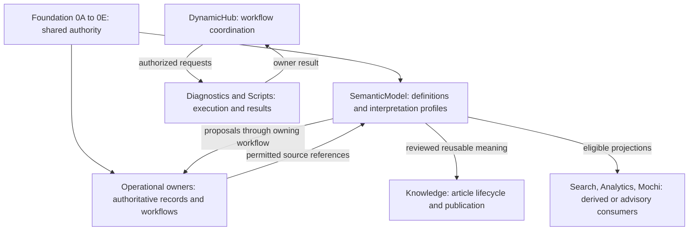
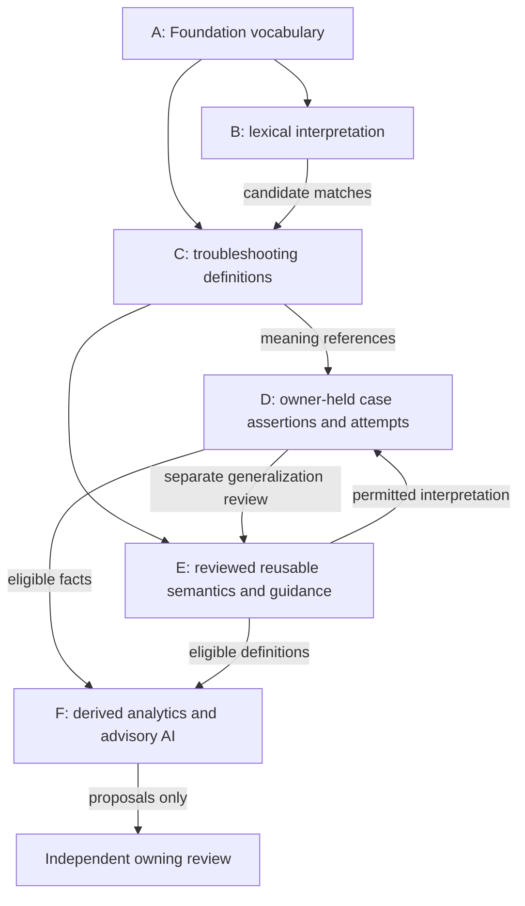
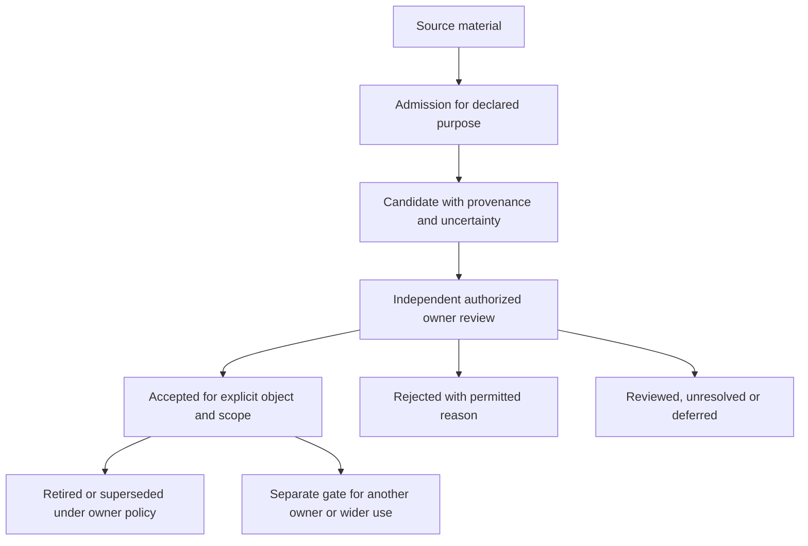
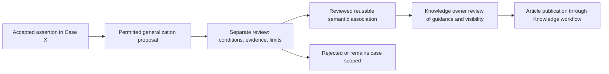
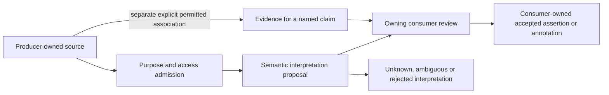

# F7Hub Semantic Model 2A

## Document Control

| Field | Value |
| --- | --- |
| Phase | 2A — Semantic Model Foundation |
| Date | 2026-10-08, America/Toronto |
| Planning status | READY_FOR_REVIEW |
| Authority | Proposed feature architecture; Foundation remains authoritative |
| Workspace | `C:\Dev\F7Hub-SemanticModel-2A` |
| Branch | `docs/semantic-model-2a-planning` |
| Verified baseline / HEAD | `1c753f2556176bd688a5f17db2a016bd01cef641` |
| Authorized write | This document only |
| Review / approval | Independent review NOT RUN; 2A approval NONE |
| Runtime status | No SemanticModel runtime established by inspected repository evidence; none created here |
| Next gate | INDEPENDENT REVIEW OF 2A |

Architecture approval, implementation, and verified runtime behavior are separate. The word “accepted” below describes future semantic governance, not approval of this document. Normative statements are proposed 2A requirements for review, except where explicitly inherited from approved Foundation. No proposed boundary authorizes an operation or creates an interface.

## Purpose

**RECOMMENDATION:** SemanticModel provides a governed semantic connective layer for defining, cross-referencing, proposing, reviewing, and interpreting troubleshooting meaning across F7Hub. It owns reusable troubleshooting semantic definitions and their governed interpretation profiles, while referencing operational records and submitting proposals to their owning workflows.

It answers “what does this mean, in this context, with which supporting source and acceptance scope?” It must distinguish reported symptoms, observations, findings, evidence, cause hypotheses, accepted case causes, diagnostic steps, actions, results, validation, resolution, and recommendations. It does not decide that an operation ran, that a Ticket closed, or that Knowledge was published.

This is a feature specialization of Foundation vocabulary and ownership. It is neither an execution engine nor an alternate application core.

## Scope and Planning Instructions

The authorized workflow is UNDERSTAND → INSPECT → RECONCILE → DECIDE BOUNDARIES → DOCUMENT → VALIDATE. This new document records the planning contract and its execution findings; subsequent review records should be appended without erasing that contract.

2A establishes purpose, ownership, conceptual layers, sources and consumers, semantic authority, definition versus occurrence, candidate versus acceptance, case versus reusable knowledge, provenance, uncertainty, identity, privacy, source admission, offline behavior, interoperability, evolution, escalation, and downstream 2B–2F responsibilities. It evaluates the S0 recommendations against Foundation before carrying them forward.

## Out of Scope

No runtime code, services, repositories, parser/extraction implementation, validators or validator repairs, imports, taxonomy seeds, database schema, tables, indexes, migrations, FTS changes, graph or vector database, embeddings, production schemas, APIs/endpoints, PySide6 GUI, AHK behavior, PowerShell scripts, provider/API selection, external vendor research, training pipeline, corpus rewrite, duplicate cleanup, or runtime component count is authorized or selected.

Detailed troubleshooting predicates, hypothesis lifecycle, complete Root Cause acceptance criteria, bilingual alias rules, parsing algorithms, synthetic corpus schema v2, and benchmark metrics remain downstream. No SemanticModel `AGENTS.md`, second planning artifact, staging, commit, push, PR, merge, or next-phase work is authorized.

## Source of Truth / Dependencies

Explicit user requirements and approved decisions govern this phase. Foundation owns shared rules; this document may specialize them within feature scope. Validated implementation establishes actual availability, not a replacement for intended architecture. Starter artifacts and S0 recommendations are evidence inputs, not approved feature semantics.

| Authority / evidence | Inspected controlling material | Use in 2A |
| --- | --- | --- |
| Governance | [Root contract](../../../AGENTS.md), [ROOT](../../../ROOT.md), [documentation router](../../19_DocumentationIndex.md), [Planning guidance](../AGENTS.md), [Foundation guidance](../Foundation/AGENTS.md) | Scope, progressive inspection, evidence labels, owner escalation and approval separation |
| Foundation 0A | [Master contract](../Foundation/0A_Master_Foundation_Architectural_Contract.md), Execution Report C–I, Data Ownership, approved 0A-D1/0A-D2 | Technology/layer boundaries; DynamicHub coordination; producer evidence; ticket-optional Case Journal |
| Foundation 0B | [Global JSON contract](../Foundation/0B_Global_JSON_Contract_Interoperability_Grammar.md), Contract Principles, Identity, Null/Missing/Unknown, Versioning, Validation and Security | One interoperability grammar; owner-qualified references; validity does not confer authority |
| Foundation 0C | [Information vocabulary](../Foundation/0C_Taxonomy_Information_Vocabulary.md), Classification, Entity/Tag, Aliases, Relationship, Operational Vocabulary, Provenance, Search/Analytics, Privacy and 0B Compatibility | Authoritative shared meaning; no parallel catalogs or universal stores |
| Foundation 0D | [Settings architecture](../Foundation/0D_Settings_Architecture.md), Settings/Non-Settings, Ownership, Definition Model, Security/Privacy and Downstream Contract | Supported behavior configuration; semantic truth and permissions excluded |
| Foundation 0E | [Reconciliation](../Foundation/0E_Foundation_Architecture_Reconciliation.md), Authority, Taxonomy/Persistence, Evidence/Journal/DynamicHub, Missing Architecture, Extension and Downstream Contract | Consume reconciled owners; feature design gaps are not automatic Foundation gaps |
| Feature safeguards | [Clipboard guidance](../Clipboard/AGENTS.md), [PowerShell guidance](../../../PowerShell/AGENTS.md), [system architecture](../../06_SystemArchitecture.md), [execution architecture](../../12_PowerShellArchitecture.md) | Capture/lifecycle/source admission and registered execution remain owner controlled |
| Delivery procedure | [vertical-slice-delivery](../../../.agents/skills/vertical-slice-delivery/SKILL.md) and continuity/Git references | Scope, preservation and evidence only; no implementation lifecycle imposed on this planning phase |
| Current-state context | [CURRENT_STATE](../../Status/CURRENT_STATE.md), local first-parent history, source and migration inspections below | Historical candidate wording is checked against live Git/source, not assumed current |
| S0 | `%LOCALAPPDATA%\F7Hub\CodexCheckpoints\SemanticModel-S0\S0-Reconciliation-Report.md` | Completed reconciliation with open decisions; Crosswalk, Ownership, Layers, Conflicts, Gaps and D01–D16 inspected |

**FACT:** Foundation merges #66/#67/#68/#70/#71 appear in baseline ancestry. 0E's preserved author-side unapproved/unintegrated wording is historical candidate text; it does not negate subsequent approval/integration. The task identifies these contracts as approved, corroborated by local merge history and S0. This phase does not reissue Foundation approval or perform fresh GitHub approval verification. Foundation readiness permits separately authorized feature planning, not implementation.

### Imported evidence references

The tracked starter has 46 files across `Docs/Planning/SemanticModel/Research`, `Data/SemanticModel/Imports`, `Data/SemanticModel/Proposals`, `Data/SemanticModel/Synthetic`, and `Tools/SemanticModel`. Their bytes were read for initial inventory/preservation; selected contents were inspected for the boundaries below. Package snapshots retain historical provenance. Imported briefs are historical requests, not instructions authorizing their deliverables.

| Imported input | Evidence role / limitation |
| --- | --- |
| [Priority draft graph](../../../Data/SemanticModel/Proposals/priority_rca_graph.proposed.json) and [coverage report](Research/PRIORITY_COVERAGE_GAP_REPORT.md) | Alternative hypothesis/check/finding/action proposals; not tested case causes or executable paths |
| [RCA proposal](../../../Data/SemanticModel/Proposals/RCA_RELATIONSHIPS_PROPOSAL.json) | Illustrative typed nodes/edges; exact predicates remain unapproved and incomplete |
| [Coverage candidates](../../../Data/SemanticModel/Proposals/coverage_candidates.json), [audit](../../../Data/SemanticModel/Proposals/COVERAGE_GAP_AUDIT.json), [reconciliation CSV](../../../Data/SemanticModel/Proposals/candidate_reconciliation.csv), [anchor CSV](../../../Data/SemanticModel/Proposals/symptom_anchors_review.csv) | Proposed coverage, editorial retyping and source mappings; no operational catalog IDs established |
| [Taxonomy package README](../../../Data/SemanticModel/Imports/Synthetic-Troubleshooting-Starter-v0.1/Packages/F7Hub_Taxonomy_Planning_v0.1/README.md) | Candidate catalogs, lexical terms, Entity recognition profiles and schemas; no replacement taxonomy |
| [Bilingual package README](../../../Data/SemanticModel/Imports/Synthetic-Troubleshooting-Starter-v0.1/Packages/F7Hub_Troubleshooting_Tools_Bilingual/README.md) | Source-local issue/tool/procedure identities; “canonical” wording does not establish F7Hub authority |
| [Synthetic schema](../../../Data/SemanticModel/Synthetic/synthetic_case_seed_v0_1.schema.json) and [cases](../../../Data/SemanticModel/Synthetic/synthetic_cases.jsonl) | Fictional development fixtures, not operational evidence or a finalized case contract |
| [Synthetic lifecycle research](Research/SYNTHETIC_DATA_LIFECYCLE.md), [reuse assessment](Research/OPEN_SOURCE_REUSE_ASSESSMENT.md), [dataset research brief](Research/CODEX_RESEARCH_AND_DATASET_PLAN.md) | Research/backlog only; no dependency, metric, external audit or training approval adopted |
| [Proposal validator](../../../Tools/SemanticModel/validate_proposals.py) and [starter validator](../../../Tools/SemanticModel/validate_starter.py) | Imported tools inspected statically; relocated input dependencies insufficient; not run or repaired in 2A |

## Execution Report / Current State

**FACT — baseline:** branch and HEAD match Document Control. Entry `git status --short`, tracked diff, staged diff and `git diff --check` were empty. Remote inventory identifies `origin` as `https://github.com/JDecelles1990/F7Hub.git`. Remote branch existence/fresh remote main are NOT VERIFIED and are unnecessary for the explicitly pinned local documentation task. No branch movement or fetch is needed.

**FACT — guidance discovery:** no Docs-root or SemanticModel-scoped `AGENTS.md`/override was found. Planning and Foundation guidance apply as routed. No SemanticModel guidance file is created. The protected pathname `AutoHotkey/Troubleshooting_Sections/GuideSettings.ini` was not individually opened, read, hashed, statted or managed; this phase relies only on Git pathname inventory for protected state. No AltF7Hub source or settings analysis was performed.

**FACT — starter identity:** this checkout's initial 46 files total 914,917 raw bytes and 37 unique SHA-256 contents. S0 reported 892,818 bytes at its earlier inspection. Fresh comparison explains the transport distinction: 42 baseline Git blobs match S0's recorded hashes; the other four CSV occurrences match S0 as raw checkout bytes. For all 46 files, checkout CRLF-to-LF normalization equals the baseline Git blob. Baseline Git blobs total 892,680 bytes. These are separate raw/normalized identities, not starter edits by 2A. Final preservation compares current raw hashes to this phase's entry raw hashes, not to a different checkout convention.

**FACT / bounded absence:** filename and content searches in tracked Python, Database, Tests and Mochi found no SemanticModel runtime feature, schema or tests. The starter Python files are validation tools, not application runtime. No tracked Case Journal or DynamicHub implementation was established by these bounded searches. Their approved architectural owners still apply. This is not a claim about uninspected external prototypes or operational state.

### Reuse assessment

| Existing evidence | Current responsibility / treatment | Boundary for future work |
| --- | --- | --- |
| [Taxonomy migration](../../../Database/Migrations/0002_taxonomy.sql), [CategoryRepository](../../../Python/f7hub/repositories/category_repository.py), [TagRepository](../../../Python/f7hub/repositories/tag_repository.py) | FACT: seven scoped Category values and one flat global Tag catalog; REUSE / EXTEND governed identity | No operational rows, import mapping, seeds or new catalog verified/created |
| [KnowledgeService](../../../Python/f7hub/services/knowledge_service.py), [Knowledge migration](../../../Database/Migrations/0005_knowledge.sql), [search migration](../../../Database/Migrations/0006_knowledge_search.sql) | FACT: owner lifecycle, content revisions, metadata/Tag associations and article-text search; REUSE | Semantic relationships cannot bypass publication/revision or silently alter existing links/search |
| [TicketService](../../../Python/f7hub/services/ticket_service.py) | FACT: owner Ticket use cases, state/priority and note origin flags; REUSE | Case assertions do not imply Ticket transitions; existing activity is not replaced |
| [Diagnostic result types](../../../Python/f7hub/domain/diagnostic_results.py) | FACT: execution classification, collected diagnostic result and pack severity distinct; REUSE / SPECIALIZE interpretation | A semantic finding does not rewrite result data or claim a check ran |
| [Clipboard migration](../../../Database/Migrations/0013_clipboard_items_capture_events.sql), [ClipboardService](../../../Python/f7hub/services/clipboard_service.py) | FACT: separate Items/Events, bounded read-only Recent use case; REUSE | Storage/read availability is not capture, ingestion, retention or disclosure authority |
| Tests/Database taxonomy/Knowledge/Clipboard and Tests/Integration feature-flow filename inventory | FACT: relevant test areas exist; sources/filenames are context, NOT RUN | Future changed owner behavior needs its own meaningful validation |
| Approved 0A-D1/0A-D2 and 0E | REUSE architecture for workflow/working records; concrete interfaces NOT VERIFIED | Defer dependency contracts to their owners, rather than implement Journal/workflow in SemanticModel |
| Foundation 0B/0C/0D | REUSE shared communication/meaning/configuration rules | Missing shared implementation does not justify a parallel local mechanism |

CURRENT_STATE contains historical candidate-gate wording for Clipboard work subsequently present in merge history/source. This is **STALE HANDOFF METADATA** for integration state, not permission to rewrite status in this one-file task. No retained suite counts are reported as fresh 2A results.

### S0 safeguards carried forward

All requested S0 safeguards are compatible with the inspected Foundation; no controlling contradiction was found. The following crosswalk records their disposition without approving imported definitions.

| S0 requirement | Upstream basis | 2A treatment |
| --- | --- | --- |
| A. Foundation 0C authoritative | 0C; 0E authority | Inherit meanings; specialize troubleshooting only |
| B. No second global Tag catalog | 0C Tag Architecture | Reuse existing identities and assignment rules |
| C. No universal Type table | 0C Type/Kind | Keep behavior-bearing owner discriminators |
| D. No universal Entity store | 0C Entity Architecture | Source occurrences and owner records remain distinct |
| E. No generic graph semantic truth store | 0C Relationships; 0E persistence | Define typed meaning, defer justified storage |
| F. Root Cause not taxonomy | 0C Root Cause boundary / Operational Vocabulary | Case causal assertion, never a Tag/Category |
| G. Occurrence not canonical creation | 0C Occurrence vs Canonical Entity | Explicit authorized owner resolution required |
| H. Status/Priority not Tags | 0C Classification | Keep owner state and urgency |
| I. Tags not Relationships | 0C Relationships | Coincident topics do not assert a predicate |
| J. Provenance distinct from Confidence | 0C Provenance & Confidence | Separate attribution from uncertainty |
| K. AI/import origin survives acceptance | 0C; 0E Evidence | Add acceptance attribution, retain origin |
| L. Confidence not permission/proof | 0C; 0D invariants | No score grants effects or truth |
| M. Reviewed bilingual equivalents share identity | 0C Aliases | One identity when equivalence reviewed; ambiguity retained |
| N. Similarity not identity/causality | 0C discovery/identity and results | Discovery can propose; no inferred merge/cause |
| O. Case truth not automatically reusable knowledge | 0A Knowledge/Case owners; S0 G11 | Separate conditioned generalization review |
| P. Automation cannot silently establish authority | 0A/B/C; S0 extraction boundary | Proposal only for causal/canonical/workflow truth; owner acceptance required |

S0's feature gaps are retained: G01 is addressed at 2A boundary depth; G02–G04 causal/predicate detail goes to 2B; G05 lexical detail to 2C; G06–G07 extraction profiles to 2D; G08–G09 corpus/manifests to 2E; G10 resource/execution links to their owners with 2B/2D; G11 generalization to 2B/2F and Knowledge; G12 policy/source facts to source/security owners; G13 operational mapping to separately authorized slices; G14 final reconciliation to 2F. None grants implementation readiness.

## Architectural Principles

Meaning, representation, records, workflows and authorization have distinct owners. Definitions describe reusable concepts; assertions bind a claim to a particular scope and source. Review is not acceptance; acceptance is not proof or global publication. Origin and uncertainty survive every promotion boundary.

Reuse Foundation Category, Type/Kind, Entity/Entity Type, Tag, Status, Priority, Relationship, Provenance and Confidence. SemanticModel must not absorb Ticket lifecycle/status/priority, Knowledge content/publication/revisions, diagnostic or PowerShell execution, script registration/execution, Clipboard capture/lifecycle, provider credentials/permissions, device/user/company creation, Settings truth, Mochi execution authority or an external system's system-of-record authority.

Future implementation preserves `PySide6 GUI → Application Services → Domain Logic → Repositories / Gateways → Infrastructure`. Domain meaning stays independent of Qt, SQLite details and provider SDKs. This phase chooses no component topology or implementation mechanism.

## SemanticModel Responsibility

**OWN, proposed:** reusable troubleshooting semantic definitions; troubleshooting interpretation and typed relationship profiles; lexical mappings for those definitions under 0C; candidate generalized semantic associations; and review/acceptance metadata for these feature-owned objects. Exact ownership is by object and scope, not by containing every datum that mentions a concept.

**REFERENCE:** existing taxonomy, owner records, source snapshots/results, Knowledge content, registered operation/resource references and owner acceptance decisions, through permitted owner access.

**SPECIALIZE:** Foundation vocabulary with troubleshooting-specific meaning, lexical interpretation boundaries, and consumer profiles. Specialization may refine a concept without changing its shared meaning.

**DERIVE:** bounded interpretation and discovery projections with lineage. Search ranking and Analytics calculations retain their consumer owners. Derived outputs are rebuildable interpretations, not an operational source of truth.

**PROPOSE_TO_OWNER:** possible classifications, links, findings, hypotheses, annotations or reusable generalizations. The proposal identifies its intended owner, target/scope and sources; it cannot mutate that owner's records directly.

**MUST_NOT_OWN:** operational records, workflow truth, execution, domain identity, disclosure/publication permission, or credential/provider authority. SemanticModel's own acceptance of a definition cannot accept a case causal assertion or publish an article.

## Ownership Matrix

Acceptance authority means the authorized owning workflow/role, not a new user account system or universal reviewer service. The same technician may perform several reviews, but the object, authority scope and decisions remain distinct.

| Owner | Authoritative data / concepts | SemanticModel may consume | May propose | May specialize | Must never mutate directly | Acceptance authority |
| --- | --- | --- | --- | --- | --- | --- |
| Foundation Taxonomy | Shared meanings; governed Category/Tag identity and profile rules | REFERENCE meanings, eligible identities, approved aliases/profiles | PROPOSE_TO_OWNER justified entry/mapping extensions | SPECIALIZE troubleshooting profiles within 0C | Catalog identities, global meanings, assignments outside owner workflow | Catalog/domain steward; Foundation owner for meaning changes |
| SemanticModel | OWN proposed reusable definitions, interpretation/lexical/predicate profiles and their review metadata | Permitted sources, owner references and accepted semantic definitions | Candidate definitions and generalized semantic associations; cross-owner proposals | Troubleshooting meaning under 0C | Other owners' source records, state, access or publication decisions | Authorized semantic curator for feature objects; no self-acceptance by generating automation |
| Knowledge Base | Article content, revisions, publication/visibility and existing KB links | REFERENCE eligible articles and explicit semantic refs | Definition references, conditioned generalization or draft guidance | Semantic interpretation of content with KB owner agreement | Article body/history/state, existing KB relationships or visibility | Knowledge workflow/authorized publisher; semantic curator separately reviews referenced definitions |
| Diagnostics | Diagnostic definitions, collection, registered execution and results; own findings profiles | REFERENCE purpose, validated results/observations and run context | Interpretation, hypothesis relevance, finding/validation candidates | Finding/validation meaning with Diagnostics criteria | Result bytes/outcomes, registrations, collection behavior or execution | Diagnostics producer for authoritative outcomes; authorized case workflow for accepted relevance/claims |
| DynamicHub | Interactive troubleshooting coordination, selected workflow intent and sequencing | REFERENCE permitted workflow/context projections | Candidate hypotheses, next-step guidance and semantic interpretation | Meaning of coordinated steps/relationships, not workflow engine | Workflow position/intent, invocation binding, step dispatch or completion | Authorized DynamicHub workflow/technician; execution remains with operation owner |
| Case Journal | Local ticket-optional working record, activities, drafts and case-scoped associations | REFERENCE admitted notes/assertions and explicit evidence links | Annotation, case hypothesis, causal/resolution assertion or generalization draft | Assertion meaning under Journal review and 2B | Case storage, timeline, evidence associations, drafts or decisions | Authorized case/Journal workflow; independently checked sources; no automatic knowledge promotion |
| Ticket | Identity, lifecycle, Type, Status, Priority, notes/activity and Ticket associations | REFERENCE eligible Ticket context/notes and owner decisions | Semantic annotations/association requests | Interpretation of issue context, not Ticket fields | Ticket state/priority/identity/notes/timeline or closure | TicketService-owned workflow/authorized technician |
| Clipboard | Item/Event identity, capture, privacy, retention, saved/pinned state and holds | REFERENCE only admitted bounded content/projections | Annotation or explicit durable-source association request | Content interpretation, preserving Item/Event distinction | Capture history, content, retention/holds, lifecycle or associations | Clipboard workflow for source use; target owner separately accepts promotion |
| Search | Retrieval/filtering/ranking and match explanation | REFERENCE declared query/match context | Lexical expansion or semantic match candidates | Match meaning/profiles with Search owner | Existing indexes, filters, ranking policy or authoritative assignments | Search owner for query behavior; semantic/catalog owner for mapping equivalence; matches accept no case facts |
| Analytics | Metrics/Insights and declared populations/grain/time/eligibility | REFERENCE analytic questions and approved aggregate context | Eligible semantic dimensions or interpretation candidates | Meaning of dimensions under 0C; DERIVE inputs for Analytics | Calculations/results policy or operational sources | Analytics owner validates methodology; source owners retain fact/eligibility authority |
| Mochi / AI | Advisory/presentation output; bounded consumer context | REFERENCE permitted proposals and method attribution | Classifications, relationships, summaries, hypotheses | Task-specific advisory meaning with owner review | Ticket/KB/domain state, acceptance, execution or privacy policy | Owning human/workflow accepts independently; AI/Mochi cannot accept their own proposals |
| Scripts / Script Catalog | Source/registration metadata, stable operation identity and reviewed execution policy | REFERENCE permitted documentary/operation metadata | Descriptive semantic links or procedure references | Purpose/resource meaning without capability claims | Source, registry, digests, enabled state, permissions or execution | Scripts/Diagnostics service and reviewed operation policy; explicit technician invocation |
| Integrations / Tools | Provider/resource identity, capabilities, permissions, gateway translation and remote authority | REFERENCE approved resource/provider projections | Resource-kind interpretation and semantic mappings | Documentary descriptions with qualified scope | Credentials, grants, capability assertions, remote records or canonical resources | Resource/integration owner; actual permissions/capabilities and remote acknowledgment independently verified |
| Settings | 0D definition/default/override/effective-value mechanics; module-supported behavior | REFERENCE validated supported display/availability inputs | Justified feature preference definition | Meaning of supported behavior under 0D admission | Preferences, defaults, permission or semantic truth through a parallel store | Settings owner for mechanics; module for allowed behavior; no preference accepts semantics |

Company, Contact, Device, User and Tenant identity remains with its existing or future approved reference-domain/integration owner. An occurrence is not proof that the canonical owner/store exists. SemanticModel may submit a resolver proposal; it cannot create or merge business records.

Arrows indicate conceptual contract relationships, not implemented calls, a central router, circular service dependencies or execution grants.

## Semantic Layers

Adopt S0's six layers as conceptual responsibility views. Privacy, provenance, version context and authority apply throughout. They are not six databases, services, processes, tables, packages or microservices, and are not a mandatory processing sequence.

| Layer | Meaning / contents | Ownership refinement |
| --- | --- | --- |
| A — Foundation Vocabulary | Category, Type/Kind, Entity/Entity Type, Tag, Status, Priority, shared Relationships, Provenance, Confidence | 0C supplies shared meaning; existing catalog/domain owners supply authoritative identities/state; 0A/B/D constrain use |
| B — Lexical Model | Canonical term, localized label, alias, synonym, abbreviation, shorthand, legacy/vendor wording, misspelling/search variant, ambiguity | SemanticModel owns mappings for its definitions; taxonomy/resource owners retain their mappings; 2C profiles discovery versus equivalence |
| C — Troubleshooting Concept Model | Reusable Symptom, Observation/Finding/Evidence roles, Cause Hypothesis/cause definitions, Diagnostic Step, Action, Result, Validation, Resolution and Recommendation | SemanticModel specializes definitions under 0C; producer meanings/execution and case acceptance stay with their owners |
| D — Case Instance Model | Actual reports/observations, case hypotheses, diagnostic/action attempts, results, validation, evidence associations, acceptance/rejection and resolution assertions | Case Journal/Ticket/Diagnostics/DynamicHub retain records and decisions; SemanticModel supplies referenced meaning and candidates |
| E — Reusable Knowledge / Relationship Model | Reviewed recurring concepts, conditioned troubleshooting associations, discriminating observations and reusable guidance | SemanticModel reviews its semantic definitions/associations; Knowledge owns articles/publication and existing KB relationships |
| F — Derived Analytics / AI | Similarity, ranking, candidate extraction/relationships, coverage, suggestions and Insights | Search/Analytics/advisory owners derive bounded outputs; no authority feedback loop or autonomous truth writes |

Root Cause has a role in the concept vocabulary but an accepted Root Cause is a scoped case assertion in D. Layer E may contain reviewed possible-cause guidance, never an automatic universal causal statement inferred from D.

## Definition vs Assertion

A **definition** describes reusable meaning and applicability; an **assertion/occurrence** says something about a specified source, case, time or operation. Sharing a definition does not merge occurrences, prove observations, or move their records to SemanticModel.

| Reusable definition | Synthetic occurrence/assertion | Owner boundary |
| --- | --- | --- |
| VPN connection failure — Symptom | “User could not connect to VPN at 09:43” | Case report preserves reporter/time/context; no cause inferred |
| DNS cache issue — possible cause/hypothesis definition | “DNS cache issue was accepted as the cause of Case X” | Explicit case causal acceptance with evidence/scope; not a Tag or general truth |
| Flush DNS — Action description | “Flush DNS was attempted at 10:02” | Owning execution result determines attempt/outcome; description is no permission |
| Check a connectivity condition — Diagnostic Step | Check planned, attempted, unavailable or completed in Case X | Definition, attempt, raw result, finding and validation remain distinct |

Symptom means reported experience; Observation means attributable statement/value; Finding means criteria-supported interpretation; Evidence means permitted material explicitly associated with a claim. Hypothesis is a possible explanation; Root Cause is an accepted case causal explanation. Result records operation outcome; Validation checks stated conditions; Resolution is an accepted assertion that a scoped issue was addressed. Recommendation remains advice until an authorized workflow adopts an action. These general distinctions bind 2B; complete definitions, predicates and lifecycle rules remain 2B decisions.

## Candidate vs Accepted Semantics

These are governance concepts specialized by object owners, not one universal database Status enum, state machine or mandatory queue.

| Conceptual authority state | Meaning / allowed use |
| --- | --- |
| SOURCE MATERIAL | Attributable input; eligible only under source policy; no accepted semantic claim implied |
| CANDIDATE | Proposed interpretation, identity mapping or relationship; display as proposal with origin/scope |
| REVIEWED | Examined with a recorded disposition; may remain uncertain, rejected or pending; not automatically accepted |
| ACCEPTED | Authorized owner decision for identified object/revision/scope and permitted use; neither proof nor universal authority |
| REJECTED | Proposed claim/mapping declined with reason as policy permits; source itself is not rewritten |
| SUPERSEDED / RETIRED | Justified replacement or withdrawal from current use; historical interpretation and source lineage preserved where permitted |

AI-generated, parser-generated, imported, synthetic and rule-generated do not equal accepted. An approved catalog entry is not an accepted assignment to a case. An accepted association is not acceptance of its endpoint's every claim. A generating rule cannot bypass case causal acceptance, canonical equivalence or publication. Any future automatic annotation rule needs its own approved, limited owner contract; it does not authorize these stronger decisions.

No universal transition order is finalized; re-review, correction and supersession need owner-specific lifecycle design.

## Case Truth vs Reusable Knowledge

**Hard boundary:** acceptance in one case does not establish reusable knowledge. “VPN failed because of stale credentials in Case X” does not imply “VPN failures are caused by stale credentials.” A successful intervention in one case does not become a global recommended procedure.

Promotion creates a separately reviewed proposal, identifying what is generalized, applicable conditions, product/version/context, supporting and contradictory sources, limits, uncertainty, privacy and publication scope. It retains lineage to eligible case sources; it does not copy unrestricted notes or silently broaden their retention/disclosure rights. The semantic curator can accept a feature-owned conditioned association; Knowledge must independently accept article content/visibility/publication through its workflow. If generalization review is inconclusive, case acceptance remains case-scoped.

2B must refine causal and generalization criteria with the case/Knowledge owners. This diagram approves no pipeline or background learning.

## Source / Claim / Evidence / Acceptance

| Concept | Architectural meaning |
| --- | --- |
| Source | Where information originated: permitted record, snapshot, result or reference with owner and version/context |
| Claim | Semantic assertion about a defined subject and scope; may be proposed, disputed or accepted |
| Evidence | Permitted source/result/observation explicitly associated with that claim, with relevance/limits and source authority retained |
| Acceptance | Owning workflow decision to treat that claim as accepted for a specified use/scope/revision |

One source can support several claims without making them equivalent; a claim can have several supporting, refuting or inconclusive evidence associations. Existence, sequence, repeated appearance, co-occurrence, similarity and successful-after cannot alone establish causality. A collection result can be valid while its interpretation remains disputed. Evidence association, causal acceptance, validation, resolution and Ticket closure remain separate decisions.

## Provenance

Preserve 0C's orthogonal axes. A single generic `source` field must not semantically collapse them; exact columns/DTO fields and persistence remain deferred.

| Axis | Required distinction |
| --- | --- |
| Origin | Attributable source owner/namespace and relevant revision/snapshot; declared manual/import/external/synthetic origin |
| Production method | Authoring, parser, rule, model, importer or generator method/version; distinguish declaration from verified authorship |
| Assignment / proposal actor | Who or which approved policy proposed/attached this meaning to this target/scope |
| Acceptance | Authorized reviewer/workflow decision, relevant actor/time/scope and reviewed revision |
| Evidence source | Actual permitted observation/result/document associated with the named claim; method/context/time and fictional status remain explicit |

Origin survives later technician acceptance: “AI-proposed, accepted by technician for Case X” must not become “technician-originated.” Import acceptance likewise retains import source. SYSTEM Tag stewardship is not SYSTEM production origin. Source references remain permission-bound; attribution does not require indefinite raw-text retention or a universal provenance ledger. Unknown authorship stays NOT VERIFIED.

## Confidence / Uncertainty

Confidence is task-specific and may be absent. Missing confidence differs from zero. Deterministic format/profile conformance needs no fake `1.0` score and proves neither existence nor causal truth.

Parser recognition confidence differs from relation confidence, which differs from hypothesis likelihood. Similarity is comparison; ranking is ordering; human certainty is an assessment; model probability requires its stated method/calibration. Sharing a numeric range does not make these interchangeable or aggregatable. Optional qualitative or quantitative assessments require task/method/version, interpretation and limits; no universal 0..1 score is mandated.

Confidence never grants execution, canonical creation, disclosure, publication, permission or acceptance; it never alone establishes Root Cause. A preference threshold can limit suggestion display, not convert a candidate into fact. Preserve contradictory evidence and abstention even when a candidate ranks first.

## Taxonomy Boundary

Do not create `SemanticModelTags`, `SemanticCategories`, `SemanticEntityTypes`, `SemanticPriority` or `SemanticStatus` merely to reuse Foundation concepts. No second global Tag catalog, universal Type/Entity/Domain store or generic graph source of truth is justified.

| Example | Correct conceptual role |
| --- | --- |
| VPN | May be a reviewed Topic Tag; not a VPN failure or permission |
| VPN connection failed | May name a reusable Symptom definition; an actual report is a separate occurrence |
| DNS failure | Finding or hypothesis depending on source/method/context; label alone cannot choose |
| `0x80070005` | Error Code Entity occurrence requiring namespace/context; no causal proof |
| Stale credentials | Possible cause definition or case hypothesis until owner causal acceptance |
| Root Cause accepted in Case X | Case-scoped causal assertion, outside taxonomy |
| Ticket CLOSED | Ticket Status; not a Tag, validation or reusable concept |

0C permits carefully reviewed reusable symptom-topic Tags in a prospective issue family. That permission does not make all Symptom definitions Tags or encode occurrences, hypotheses, Root Cause or Resolution in taxonomy. Topic annotation and troubleshooting definition can coexist with explicit distinct meanings. Existing Category scopes remain formal classification, not technology subject areas; GENERAL is not an automatic wildcard. No new Category scope or installed taxonomy identity is chosen here.

## Semantic Identity

Use stable named namespaces and machine identities. For new vocabulary keys, inherit 0C's ASCII lower_snake_case rules; preserve existing owner IDs/slugs and source-local proposal IDs. Display labels, localized labels and aliases remain separate from identity. This phase chooses no physical semantic ID format, universal key table or database PK convention.

Identity equality requires reviewed meaning/context mapping. Same label does not prove same concept; different labels do not prove different concepts. Bilingual equivalents share an identity only when equivalence is reviewed; missing translation does not require another identity. Version, product scope and lexical namespace may change equivalence. Source proposal IDs remain source proposal IDs until an explicit reviewed mapping; operational database IDs remain owner-specific. Unknown mappings remain unmapped, not fabricated canonical records.

## Relationship Boundary

Relationships require typed meaning and accountable endpoints. Tags do not substitute for relationships; a graph-shaped diagram or JSON edge collection requires no graph database.

2B must profile each future predicate's meaning, source and target endpoint types, direction, symmetry, transitivity, cardinality/uniqueness where applicable, conditions, provenance, uncertainty, acceptance, lifecycle, deletion/history semantics and owner. Separate definition-to-definition suitability from instance evidence and actual outcomes. Inverse views should not invent independently accepted duplicate facts. Existing Ticket–KB and KB–KB predicates retain their owner meanings.

Illustrative distinctions below constrain meaning; they are not a finalized predicate catalog:

- `related_to` ≠ `causes`; `suggests` ≠ `confirms`.
- `supports` ≠ `proves`; `used_during` ≠ `resolved_by`.
- `successful_after` ≠ `caused_by`; `co-occurs_with` ≠ a causal relationship.

S0's composite branch joins cause/check/finding/action templates. It is a planned investigation association, not accepted causal evidence or a runtime workflow. 2B must refine endpoints and criteria without copying unreviewed tokens as authoritative predicates.

## Subject / Domain Terminology

Use the following stable conceptual terms in 2B–2E. They name distinct dimensions, not schema fields or a universal Domain table.

| Term | Meaning / limitation |
| --- | --- |
| Module owner | Architectural responsibility for definitions, records or decisions; e.g. Diagnostics |
| Category scope | Formal admitted F7Hub classification scope; e.g. DIAGNOSTIC; not a technology grouping |
| Subject area | Versioned troubleshooting/technology grouping; e.g. networking; not ownership or permission |
| Product/service reference | Defined affected technology reference with owner/namespace/version context |
| Analytical group | Derived reporting partition with declared scheme/population/grain; not operational identity |
| Lexical namespace | Interpretation boundary for wording, language and context; not a global synonym space |

Imported nine/24/six groupings are different source schemes. Retain their scheme/version and unmapped/ambiguous cases; later reviewed mappings may be many-to-many. An imported `domain_key` or `original_domain` does not select module owner, Category scope or global truth.

## Resource Identity

The starter's “tools” mix resources. Differentiate product, platform, administration portal, application, utility, runtime, diagnostic resource, integration/provider, registered executable operation, procedure and command/invocation. These are conceptual descriptions, not a final Kind enum.

PowerShell as a technology/runtime, an administration portal as an access surface, a product topic, a registered diagnostic operation, a procedure describing steps, and a concrete command with arguments are not equivalent identities. “VPN client unspecified” remains unresolved. SemanticModel can describe/reference their meaning and propose mappings; resource owners validate canonical identity, availability, prerequisites, permission and actual capability separately.

A label, resource association, checksum, copied command or procedure recommendation never grants execution. Commands/arguments remain untrusted and potentially sensitive. Registered operations must pass the existing application-service/PowerShellService/PowerShellGateway boundary; no semantic matcher may launch them.

## Knowledge Boundary

SemanticModel may govern its reusable semantic definitions, lexical/relationship profiles, candidate/generalized associations and explicitly assigned review metadata. Knowledge retains articles, content, revisions, visibility, publication and its existing relationship authority.

Future articles may reference an accepted semantic definition with meaningful revision/applicability. References do not duplicate article content authority, republish private evidence, import whole case notes or freeze the article into semantic storage. Conversely an article's publication does not automatically accept every extracted concept mapping. Conflicts or changed meanings trigger their respective reviews; exact interfaces/history representations remain downstream.

## Case Journal / DynamicHub Boundary

Case Journal remains the approved local working-record owner, before Ticket association or permanently ticketless. Existing ticket-bound activity remains authoritative and is not duplicated into a competing Timeline. SemanticModel supplies meaning/proposals; the case owner accepts and records case assertions/evidence associations. A case need not have a Ticket or accepted Root Cause.

DynamicHub remains interactive troubleshooting coordinator. It consumes definitions, candidate hypotheses, relationship meaning, reviewed guidance and semantic interpretation through owning contracts. SemanticModel must not become case storage, timeline, workflow coordinator, step executor or Ticket surrogate. DynamicHub must not delegate execution authority to semantic advice.

Concrete Journal assertion storage, workflow state, source association, context and review APIs are insufficiently specified for implementation here. This is a downstream owner dependency, not justification for local replacement. Review and operation binding must respect source/target/context revision; later selection cannot retarget accepted work or late results.

## Diagnostics Boundary

Diagnostics owns definitions, registered execution, collection behavior and results. SemanticModel may reference diagnostic purpose, observations, finding semantics, hypothesis relevance and validation meaning. A semantic Finding is criteria-supported interpretation, not necessarily the raw result or collection status.

Interpretation never rewrites an execution result. Valid collection ERROR can be a completed diagnostic outcome; infrastructure failure cannot fabricate collected evidence. A proposed Diagnostic Step is not an attempted run; successful collection is not validated repair, accepted cause or Resolution. 2B must preserve these distinctions and conditions; execution integration remains a separate owner-reviewed task.

## Search / Analytics / AI Boundary

Search may consume accepted identities and lexical mappings with explicit discovery modes and match explanations. Ambiguous/fuzzy matches remain candidates; retrieval/ranking never accepts identity or causal claims. Existing article-text FTS and filters are not silently expanded by this plan.

Analytics may derive metrics from accepted eligible semantic facts. It defines population, grain, time, provenance, unknown handling and privacy. Multiple Tags/relationships cannot accidentally multiply record counts; raw identity-bearing values are not default global dimensions. Fixture/editorial coverage reports remain development analyses, not operational incidence or probability.

Mochi/AI may consume only bounded approved context and propose classifications, relationships, summaries or hypotheses. They may not accept their own proposals, establish Root Cause, publish Knowledge, execute remediation, create canonical entities, change Ticket state, bypass source/privacy rules or obtain SQL/provider authority. External Send requires the approved exact-payload preview/explicit technician workflow; no existing cosmetic Mochi contract is expanded here.

## Settings Boundary

0D owns common Settings mechanics. Later supported semantic-feature preferences may control suggestion display, language/presentation or justified optional task-specific thresholds through its admission mechanism. No keys/defaults/Settings store are created here.

Settings must not define Tag/Root Cause meaning, relationship truth, taxonomy equivalence, canonical identity, permission or execution capability. Semantic truth is not a user preference. Invalid/unavailable privacy-sensitive configuration disables the optional effect safely; a saved preference cannot manufacture fresh consent or weaken invariants.

## Privacy / Sensitivity and Source Admission

Potentially sensitive inputs include case notes, clipboard-derived text, email/account/user names, tenant IDs, device identifiers, hostnames, IP addresses, file/registry paths, URLs, Ticket references, company/customer names, security events, commands and arguments. Derived relationships/context can remain sensitive even when raw text is removed; predictable hashing is not guaranteed anonymization.

Secrets/passwords/tokens/cookies/private keys/recovery material remain excluded from ordinary semantic indexing, Tags, logs, AI context and Analytics. Any exception requires separately approved security design at the owning boundary; this plan grants none. Detection does not authorize retention; retention does not authorize disclosure; possession of a reference does not grant access. Employer/legal/source policy is NOT VERIFIED, so minimize collection/persistence and avoid unnecessary outbound transmission.

A source must be authorized for semantic processing before extraction. Processing admission does not automatically admit persistence, indexing, outbound disclosure or reusable-knowledge promotion: each use needs its owner/purpose/sensitivity gate. Existing presence in F7Hub is not eligibility. Potential sources include Journal/Ticket notes, Knowledge, diagnostic/script results, Clipboard, manual technician input, imported research and synthetic fixtures; none is enabled by 2A.

| Use boundary | Required architectural constraint |
| --- | --- |
| Capture / extraction | Source owner admits declared purpose, eligible source/version and minimal projection; no background harvesting |
| Persistence | Explicit durable purpose/lifetime/access policy; transient processing when sufficient; no automatic copy of raw source |
| Index / local search | Separate eligibility for searchable text/semantics; no secret indexing or assumed access from match result |
| Logging / audit | Safe classified metadata only by default; meaningful review audit is distinct from technical logs; no rejected raw payload echo |
| Analytics | Accepted eligible facts and minimized dimensions; no raw notes by default or fictional-as-operational mixing |
| AI / export | Independent outbound admission, minimization and approved technician-controlled disclosure; local visibility is no consent |
| Knowledge promotion | Separate generalization/content/visibility review; source rights do not expand by copying |
| Deletion / expiry | Source owner controls lifetime; dependent suggestions/indexes invalidated or made explicitly unavailable under policy; no hidden raw retention |

Unauthorized, expired, deleted, redacted, changed or inaccessible sources fail safely with explicit limits. A justified retained acceptance record must not imply that source content remains accessible or that the claim was reverified. History/tombstones and aggregate retention require later owner/privacy design, not an unconditional exemption. Detection accuracy and redaction algorithms remain unverified/deferred.

## Offline-First Behavior

| Future capability | Classification | Offline/degraded behavior |
| --- | --- | --- |
| Concept lookup, local lexical matching and reviewed local relationships | LOCAL_REQUIRED | Use admitted local definitions/profiles; unknown or ambiguous matches stay explicit |
| Semantic review and case-note annotation proposals | LOCAL_REQUIRED | Local source/owner support; drafts and review remain possible without remote services |
| Synthetic development fixtures | LOCAL_REQUIRED | Isolated declared fixture scope; no operational intake or remote dependency |
| Online AI/search suggestion, ranking, summarization, candidate extraction/relationships | ONLINE_OPTIONAL product enhancement | Failure disables enhancement and preserves local definitions, notes and review; no truth/permission fallback |
| A specifically authorized remote request | ONLINE_REQUIRED for that request only | Report unavailable/unconfirmed; do not fabricate remote facts or block unrelated local work |

These are architectural requirements, not delivered capabilities. Essential local functions cannot require OpenAI, Microsoft Graph, HaloPSA, NinjaRMM, external embeddings, remote vector database, cloud ontology or remote graph service. No remote provider, local embedding engine or offline credential cache is selected. Optional future AI stays advisory unless a separate approved design changes its role within Foundation constraints.

## Interoperability

0B owns cross-process JSON grammar, envelopes, classes, serialization, message/correlation identity, versions, missing/null/error rules and transport-profile obligations. 0C and feature/domain owners own meaning; transport and feature profiles own conforming representations. SemanticModel creates no second grammar or endpoints.

Semantic identities, assertions, relationships, provenance and acceptance may later have 0B-compliant payload profiles. Owner-qualified refs are distinct from message/run IDs and display labels; new wire representations follow existing 0B/0C reference rules, while in-process owner IDs remain unchanged. Existing legacy contracts are not rewritten.

Valid JSON shape never equals semantic authorization, accepted identity, causal proof, accessible evidence or permission. Semantic validation checks known meanings, endpoint scope, source revision and owning workflow authority independently. Omitted, null, unknown, redacted and zero/false/empty retain distinct declared meanings; no invented canonical unknown ID or universal field wrapper.

## Versioning / Evolution

Definition changes may be editorial, alias/localization, compatible semantic clarification, meaning-changing revision, retirement or replacement/supersession. Owners must assess which changes affect interpretation, mappings, acceptance and historical claims; every edit is not necessarily a breaking semantic change.

Meaning-changing revisions must not silently reinterpret historical case assertions or previously reviewed generalizations. Preserve a justified reference to the interpreted definition/source context and identify stale acceptance when relevant inputs change. Replacement is explicit; retirement restricts current eligibility without erasing history. Current label display and historical interpretation are separate concerns.

Exact persistence, revision identifiers, version-history mechanism, deletion behavior and migration strategy remain deferred. Imported v0.1 labels are artifact provenance, not production semantic version authority. Wire profile compatibility remains 0B-owned; an added catalog entry is not automatically a compatible closed-enum change.

## Failure / Unknown States

The architecture must permit unknown/unmapped concepts, ambiguous lexical cues, multiple candidate matches, no accepted Root Cause, multiple contributing causes, rejected hypotheses, inconclusive diagnostics, failed actions, partial remediation, validation failure, recurrence, escalation and unresolved cases.

No matcher, schema or review flow may force a false canonical ID, single cause, accepted cause, successful action or Resolution merely to complete a record. Resolution by mitigation can coexist with unknown cause; accepted cause can coexist with unresolved impact. Missing and unavailable evidence are not negative findings. Contradictions and reopened review remain visible; detailed transitions belong to 2B/owning workflows.

## Synthetic Data Boundary

Synthetic data is eligible only for an explicitly declared development, parser/semantic test, search-fixture or evaluation-design lifecycle. Fictional provenance persists after structural/technical review. It never becomes operational evidence, real customer history, automatic production Knowledge, empirical troubleshooting probability, vendor-verified truth or training permission by implication.

S0's narrow success-only fixtures can remain preserved historical input; they are not the general case model. 2E must plan branches, negative/ambiguous/unresolved outcomes, unknown/multiple causes and leakage prevention. Independent reference/technical review and source rights remain separate from schema conformance. This phase selects no corpus schema, split algorithm, benchmark metric, target or training pipeline.

## Extension vs Foundation Change

Ordinary reviewed feature extensions can add troubleshooting definitions, approved lexical aliases, Entity recognition profiles within existing meaning, troubleshooting predicate profiles under shared Relationships, local semantic review workflows or synthetic scenario types. Search/reuse/alias/extend precedes creating a new identity. “Feature extension” still requires owner, compatibility, privacy and actual schema/use-case review; it is not implementation authorization.

| Proposed change | Required escalation owner |
| --- | --- |
| Change Tag meaning; make Root Cause taxonomy; replace global Tags or scoped Categories; universal Type truth | 0C, with 0A for ownership impact |
| Auto-create business Entities from extraction; introduce universal Entity or generic graph truth ownership | 0C/0A and reference-domain/database owners |
| Change provenance axes; turn Confidence into proof/permission | 0C and security/0A |
| Move Journal/Knowledge/Ticket/Diagnostics workflow or record authority into SemanticModel; change runtime technology ownership | 0A and affected owners |
| Change global JSON grammar, reference/version semantics or cross-language boundaries | 0B and affected/security owners |
| Parallel Settings truth or preference-defined semantics/permissions | 0D plus 0C/0A |
| Change privacy/secret/security/offline guarantees, provider authority or external system of record | 0A/security, relevant 0B/0C/0D and integration owner |

On a controlling conflict: stop the local decision, record evidence/current and proposed meaning, identify the Foundation owner, and request architecture review. Do not silently patch around it. No Foundation amendment is proposed in 2A; S0's imported inconsistencies can be reconciled as feature work.

## Downstream Contracts

These contracts become authoritative for downstream planning only after 2A review/approval. They neither start a phase nor authorize implementation.

| Phase | Fixed by 2A | Open / phase may decide | Must not redefine |
| --- | --- | --- | --- |
| 2B — Troubleshooting Concept / Relationship Model | Definitions vs assertions; typed owner links; case vs generalized truth; evidence/acceptance distinction; unknown/multicause support | Detailed concepts/predicates/endpoints, conditions/cardinality/history; hypothesis lifecycle; supporting/refuting evidence and Root Cause/Resolution/generalization acceptance criteria with case/Diagnostics/Knowledge owners; resource/procedure links | 0C meaning; execution/record/workflow ownership; no cause from sequence/similarity; no universal status/graph |
| 2C — Lexical / Alias / Synonym Model | Namespace-bound identity separate from wording; reviewed bilingual equivalence; ambiguous cues cannot auto-assign | Alias/synonym/abbreviation/shorthand/legacy/misspelling profiles; language/fallback/context/version rules, collision review and discovery vs import equivalence | Canonical domain identity; 0C normalization/alias principles; topic/resource distinction; source proposal IDs not canonical by label |
| 2D — Case Note Semantic Extraction Pipeline | Admission before processing/use; source/claim/evidence separate; producer provenance and task uncertainty; proposal-to-owner acceptance | Source snapshot/span units/raw-normalized mapping, revision-safe review profile, extraction stages/validation and privacy enforcement contracts; deterministic vs advisory proposal boundaries; concrete conceptual metadata representations | Automatic cause/domain creation/publication; source/case ownership; 0B grammar; secret/disclosure rules; no authority from parser score |
| 2E — Synthetic Troubleshooting Corpus Architecture | Fictional/non-operational authority, declared lifecycle, multiple/unknown outcomes, preserved starter snapshots | Corpus schema v2, scenario diversity, source/fixture manifests/group mappings, lineage, independent expected outcomes/leakage/evaluation design; explicit tool-input requirements | Fiction becoming empirical/vendor truth, production Knowledge or training permission; no forced one-cause/success contract; no metrics finalized by 2A |
| 2F — Semantic Model Reconciliation | Foundation precedence; bounded owner model; separate approvals and downstream contract boundaries | Reconcile reviewed 2A–2E, cross-owner dependencies/open questions, documentation impacts and readiness for separately authorized slice planning | Replacing upstream authority or hiding unresolved gaps; no automatic implementation/storage/provider/Git authority |

Concrete Case Journal/DynamicHub interfaces, Knowledge references/generalization/publication, Diagnostics finding/validation and resource/operation links require their owning contracts before implementation. 2B–2E can formulate dependency proposals; they cannot implement missing owners locally. Operational ID mapping, storage, migrations, parsers, GUI and validator repair remain separately authorized slices after appropriate architecture gates.

## Decision Register

All statuses below are **RECOMMENDED**, proposed for 2A review. Inherited Foundation safeguards are already authoritative, but their feature specialization is not independently approved here. “Decision” records the proposed 2A choice. Each row includes question, considered alternatives, rationale/evidence, owner and consequence.

| ID / question | Options considered | Decision | Rationale / evidence | Owner | Downstream consequence | Status |
| --- | --- | --- | --- | --- | --- | --- |
| 2A-D01 — What purpose? | Governed connective meaning; alternate application core; label-only search helper | Governed definition/interpretation layer | S0 G01 and 0A/C: shared troubleshooting meaning useful without authority transfer; label-only model cannot separate claims | SemanticModel architect | 2B–2F preserve bounded purpose | RECOMMENDED |
| 2A-D02 — What does it own? | Definitions/profiles/review metadata; all semantic-looking operational data | Own only feature semantic objects; reference/propose to other owners | 0A data matrix/0E; prevents competing Journal/KB/Diagnostics | SemanticModel plus affected owners | No cross-owner writes or duplicate record stores | RECOMMENDED |
| 2A-D03 — How to organize meaning? | Six responsibility views; six runtime modules/stores; flat labels | Adopt refined six conceptual layers | S0 D06; responsibilities cross layers and differ from topology | SemanticModel architect | Later topology requires real use cases, not layer count | RECOMMENDED |
| 2A-D04 — Definition or occurrence? | One issue record; reusable definition plus scoped assertions | Separate definitions from reports/attempts/claims | 0C occurrences/operations; S0 mixed issue labels | SemanticModel with case/Diagnostics | 2B must profile both without identity collapse | RECOMMENDED |
| 2A-D05 — When accepted? | Generated means accepted; universal status; owner-specific review/acceptance | Scoped owner acceptance, review distinct, origin retained | 0C assignment/provenance; S0 draft flags | Each object owner | 2B/2D define local lifecycle; no universal Status enum | RECOMMENDED |
| 2A-D06 — Can a case teach global truth? | Automatic promotion; no reuse; separately reviewed conditioned generalization | Separate generalization then Knowledge publication review | S0 G11; 0A Knowledge/case ownership; single success insufficient | Semantic curator, case owner, Knowledge | 2B criteria; 2F reconciles two acceptance scopes | RECOMMENDED |
| 2A-D07 — What attribution? | Generic source field; orthogonal origin/method/actor/acceptance/evidence | Keep five conceptual axes distinct | 0C Provenance; S0 partial attribution | Producers and reviewing owners | 2D fields/profiles preserve AI/import origin after acceptance | RECOMMENDED |
| 2A-D08 — What uncertainty? | Universal score; deterministic 1.0; optional task-specific assessment | Optional defined uncertainty; score never authority/proof | 0C confidence; S0 no calibrated operational probabilities | Producer/method owner, case reviewer | 2B–2E distinguish scores, likelihood/rank and abstention | RECOMMENDED |
| 2A-D09 — Which sources/use? | All F7Hub content; post-extraction filtering; prior purpose-specific admission | Admit before extraction; separate retention/index/disclosure/promotion gates | 0A/B/C privacy; Clipboard safeguards; S0 G12 | Source/security and target consumer owners | 2D controls source/revision; unknown policy limits use | RECOMMENDED |
| 2A-D10 — Does local work need online AI? | Remote ontology/embedding prerequisite; local essentials with optional advice | Local lookup/matching/review/annotation/relations; optional online enhancement | 0A offline; 0E local/remote distinction | Feature/application owners | No provider failure blocks unrelated local work | RECOMMENDED |
| 2A-D11 — Extension or redesign? | Reopen Foundation for every entry; silent local override; owner-based escalation | Extend existing mechanisms, escalate shared meaning/authority changes | 0C extension; 0E rule; S0 no blocking Foundation gap | Feature steward; relevant 0A–0D owner | 2F records conflicts; no parallel shared system | RECOMMENDED |
| 2A-D12 — How to cross owner boundaries? | Direct shared-store writes; copied records; qualified references and proposals | Owner reference + independent scoped acceptance | 0A producer/use-case authority; 0B refs; existing services | Source and accepting target owner | Concrete interfaces deferred; stale references fail safely | RECOMMENDED |
| 2A-D13 — What does domain mean? | Universal Domain table; imported keys as Category/owner; separate named dimensions | Module owner, Category scope, subject area, product/service reference, analytical group, lexical namespace | S0 nine/24/six groupings; 0C scope distinction | Semantic/lexical/Analytics and catalog owners | 2B–2E preserve schemes and reviewed mappings | RECOMMENDED |
| 2A-D14 — What authority has synthetic data? | Training/production truth by conformance; discard starter; declared development-only lifecycle | Preserve starter; fiction remains non-operational with separate use permissions | S0 fixed-success limits; imported authority flags; 0A synthetic policy | Corpus/evaluation and source owners | 2E revises design only when authorized; no empirical probability | RECOMMENDED |

## Risk Register

Likelihood is UNKNOWN throughout: no empirical incidence study was performed. All risks are OPEN; mitigations are architectural obligations, not verified runtime controls.

| ID / risk | Likelihood | Impact | Mitigation / owner | Residual risk | Status |
| --- | --- | --- | --- | --- | --- |
| R01 — God module | UNKNOWN | HIGH | Bounded ownership/object review; 0A/feature architect | Concrete interfaces still open | OPEN |
| R02 — Duplicate taxonomy | UNKNOWN | HIGH | Reuse/alias/extend existing identities; 0C steward | Operational ID mappings NOT VERIFIED | OPEN |
| R03 — Case assertion becomes universal truth | UNKNOWN | HIGH | Separate conditioned generalization/publication; semantic/KB/case owners | Detailed criteria deferred to 2B | OPEN |
| R04 — AI/import proposal laundering | UNKNOWN | HIGH | Explicit owner acceptance with retained origin; 2D/reviewer | Authorship/automation controls not implemented | OPEN |
| R05 — Causality from sequence/similarity | UNKNOWN | HIGH | Typed predicates/evidence/contradiction criteria; 2B/case owner | Remedy effectiveness unverified | OPEN |
| R06 — Provenance loss | UNKNOWN | HIGH | Orthogonal axes and revision lineage; producer/2D | Starter metadata incomplete | OPEN |
| R07 — Confidence becomes proof/permission | UNKNOWN | HIGH | Task-defined optional uncertainty, independent authority; producer/security | Calibration and UI interpretation deferred | OPEN |
| R08 — Privacy leakage | UNKNOWN | HIGH | Prior source/use admission, secret exclusion/minimization; source/security | Policy and detection accuracy NOT VERIFIED | OPEN |
| R09 — Source-version drift | UNKNOWN | HIGH | Bind reviewed context, invalidate stale interpretation; source/2D | Exact revision/history mechanism deferred | OPEN |
| R10 — Lexical ambiguity / false bilingual equality | UNKNOWN | MEDIUM | Namespaces, reviewed mapping, multiple candidates/abstention; 2C | Imported collisions/translations remain unreviewed | OPEN |
| R11 — Cross-owner writes | UNKNOWN | HIGH | Proposals through owning services, separate acceptance; application owners | New reference interfaces not implemented | OPEN |
| R12 — Synthetic-data leakage | UNKNOWN | HIGH | Fiction markers, isolated lifecycle and evaluation inputs; 2E | Starter success bias and independent references unresolved | OPEN |
| R13 — False forced resolution | UNKNOWN | HIGH | Unknown/rejected/inconclusive/multicause paths; case/2B | Detailed lifecycle transitions deferred | OPEN |
| R14 — Storage over-centralization | UNKNOWN | HIGH | Layers not topology; reuse review before storage; architect/database owner | Future storage temptation remains | OPEN |
| R15 — Resource label implies execution | UNKNOWN | HIGH | Typed resource/operation distinction, existing execution guards; Scripts/Integrations | Provider capability facts unverified | OPEN |
| R16 — Imported validator implies readiness | UNKNOWN | MEDIUM | Separate structural/domain/runtime evidence; tool owner | Relocated dependencies broken per S0/static inspection | OPEN |

## Open Questions / Requires User Decision

No blocking shared Foundation gap was identified at 2A depth. The proposed feature boundary and all recommended decisions require independent architecture review and user approval; this document records none as completed. Deferred questions are design dependencies, not requests to invent implementation now.

| Question | Owner / phase | Gate affected |
| --- | --- | --- |
| Exact concept/predicate criteria, cause rejection/reopening/multicause and case validation versus resolution/generalization acceptance | 2B with Journal/DynamicHub/Diagnostics/Knowledge | Accepted causal/predicate design |
| Exact lexical equivalence, multilingual fallback, collision and context/version rules | 2C with taxonomy/resource/Search owners | Automatic mapping/import design |
| Minimal source projections, spans/revisions, review access and source invalidation contracts | 2D with source/consumer owners | Extraction/persistence/disclosure integration |
| Actual Journal/coordination/Knowledge assertion/reference APIs and storage reuse | Owning feature plans; 2F reconciles dependencies | Implementation slice planning; do not substitute SemanticModel storage |
| Source licensing, underlying authorship, vendor correctness and employer/privacy policy | Source/security/integration owners; 2D/2E backlog | Affected intake, external use, publication/training; all NOT VERIFIED |
| Revised corpus/manifests/group mappings, independent evaluation and explicit validator inputs | 2E/tool owner | Corpus/tool readiness; S0 failures remain uncorrected |
| Actual catalog/domain IDs, schema/interfaces, history/retention mechanisms | Separately authorized owner slices after reconciliation | Operational import/runtime work |

**ASSUMPTION:** the bounded semantic layer can provide useful local meaning without generalized case storage or a graph engine; no performance/runtime claim follows. **INFERENCE:** the identified starter conflicts can be resolved through 2B–2F specializations without changing Foundation. **NOT VERIFIED:** live operational data/database health, external policy/providers/resources, source technical accuracy, actual extraction/redaction quality, GUI/native behavior, runtime performance and new owner-interface availability.

## Architecture / Database / Security / Documentation Impact

This proposal specializes shared vocabulary and object ownership; it changes no runtime, trust boundary, execution authority, database relationship or external system of record. Future implementation must enforce the proposed admission/reference/review rules and test their negative paths. No migration or storage choice is made; database design still belongs to approved owners and canonical 07/08/09 procedures.

Only this planning document is in scope. Canonical documentation, CURRENT_STATE, planning index, imported artifacts and validators remain unchanged. After architecture approval and separately scoped work, documentation routing/feature/workflow owners may need concise links and truthful status; future database/interface changes require their relevant owners. These are follow-ups, not edits authorized here. No blanket canonical synchronization is inferred.

## Acceptance Criteria

The following assesses author-side architectural coverage, not independent approval or runtime validation.

| Criterion | Coverage evidence | Assessment |
| --- | --- | --- |
| AC-2A-01 bounded purpose | Purpose / Responsibility | Covered |
| AC-2A-02 explicit subsystem ownership | Ownership Matrix, all required owners | Covered |
| AC-2A-03 no alternate core | Principles / owner prohibitions | Covered |
| AC-2A-04 layers without topology | Semantic Layers | Covered |
| AC-2A-05 definition vs assertion | Definition vs Assertion | Covered |
| AC-2A-06 candidate/reviewed/accepted | Authority-state distinctions and review diagram | Covered |
| AC-2A-07 case vs reusable knowledge | Hard generalization/publication boundary | Covered |
| AC-2A-08 source/claim/evidence/acceptance | Distinct definitions and owner flow | Covered |
| AC-2A-09 orthogonal provenance | Five axes and retained AI/import origin | Covered |
| AC-2A-10 uncertainty not proof/authority | Confidence / Uncertainty | Covered |
| AC-2A-11 taxonomy reuse | Taxonomy / identity / S0 crosswalk | Covered |
| AC-2A-12 typed Relationships, no graph mandate | Relationship Boundary | Covered |
| AC-2A-13 Root Cause outside taxonomy | Taxonomy / Definition / Layers | Covered |
| AC-2A-14 admission/privacy before use | Privacy / Source Admission | Covered |
| AC-2A-15 offline-first | Local/online classification table | Covered |
| AC-2A-16 0B grammar owner | Interoperability | Covered |
| AC-2A-17 Settings not truth | Settings Boundary | Covered |
| AC-2A-18 unknown/negative/unresolved | Failure / Unknown States | Covered |
| AC-2A-19 synthetic non-authority | Synthetic Data Boundary | Covered |
| AC-2A-20 extension/escalation | Owner-specific trigger table | Covered |
| AC-2A-21 downstream authority | 2B–2F contracts / dependencies | Covered |
| AC-2A-22 no silent implementation choice | Out of Scope / layers / downstream open questions | Covered |
| AC-2A-23 only authorized file | Final Git/path inventory: sole new path is this document | PASS — static scope |
| AC-2A-24 imported bytes untouched | All 46 final raw SHA-256/byte counts equal entry values | PASS — fresh preservation |
| AC-2A-25 protected path untouched | Pathname-only Git audit; no individual access or management | PASS — task preservation boundary |

## Validation

Planning/static validation only. Environment: WINDOWS_NATIVE host; evidence scope: documentation/static checks, not native application behavior. Provenance: FRESH for the checks below. Mermaid rendering/full parser validation is NOT RUN; no renderer/dependency was installed. No imported validator was executed. S0 validator PASS/FAIL/BLOCKED outcomes are retained historical findings, not fresh 2A evidence.

| Executed check | Result | Evidence / limit |
| --- | --- | --- |
| `git branch --show-current`; `git rev-parse HEAD` | PASS | Requested branch and full baseline SHA retained |
| `git status --short --untracked-files=all` | PASS | Sole new path: `Docs/Planning/SemanticModel/2A_Semantic_Model_Foundation.md` |
| `git diff --name-only`; `git diff --cached --name-only`; `git diff --check` | PASS | Empty tracked/staged diffs; no whitespace errors in tracked diff; new-file whitespace checked separately |
| Inline `py -3.14 -B -c` document checks | PASS | 42 local Markdown links resolve, S0 report exists, required headings present, fences balanced, no trailing whitespace; 14 decision rows, 25 acceptance rows, 16 risk rows |
| Inline static Mermaid inspection and author review | PASS — bounded coherence | Five flowcharts; balanced node/label delimiters and declared endpoint references; diagrams reviewed for conceptual ownership/authority separation; no rendering/full grammar certification |
| Inline SHA-256/byte preservation comparison | PASS | All 46 imported starter raw hashes/byte counts equal task-entry inventory; no input added/removed; normalized/S0 identities distinguished above |
| Protected/unrelated path audit | PASS — task boundary | Git pathname inventory only for protected path; no individual access, hashing/statting or mutation; no other tracked/untracked artifact created |

Commands/checks used inline read-only inspection code; no validation script, report, cache, dependency or other artifact was added to the repository. This document alone records the result. Application test categories remain separate:

| Application test category | Result | Applicability |
| --- | --- | --- |
| Database | NOT RUN — NOT REQUIRED | No persistence/schema/code changes; no operational DB touched |
| GUI | NOT RUN — NOT REQUIRED | No interface behavior changed |
| Integration | NOT RUN — NOT REQUIRED | No runtime contract/component changed |
| WINDOWS_NATIVE application | NOT RUN — NOT REQUIRED | Documentation-only; Windows host static checks are not application/native acceptance |

Future implementation tests must cover source denial, redaction/expiry/revision drift, provenance retention, ambiguous identities, independent acceptance/publication, unknown/multicause/unresolved paths, and unchanged execution authority. Their exact matrices belong to later plans and affected owners; none ran here.

## Result / Review Record / Approval Record

**2A_READY_FOR_REVIEW**

Author-side architecture coverage and fresh static/preservation checks are complete. Independent review NOT RUN. Approval NONE. Candidate is unstaged, uncommitted and unpublished. Stop here; next gate is INDEPENDENT REVIEW OF 2A. No next phase or Git integration follows automatically.

## Change History

2026-10-08 — Created and statically validated the sole authorized 2A architecture candidate from pinned baseline; inspected Foundation/S0, preserved all 46 starter inputs and protected-path restrictions, and stopped for independent review.
