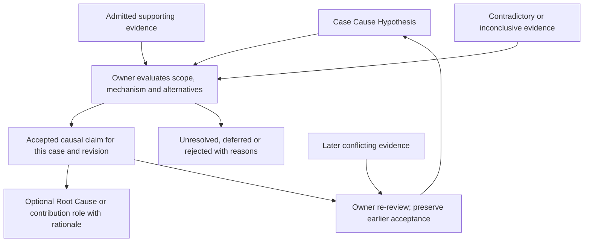
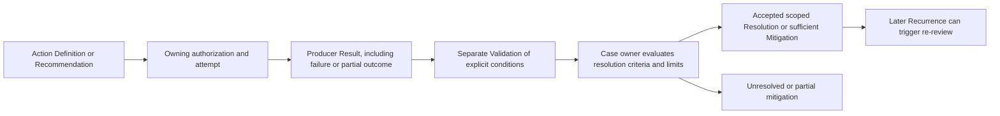
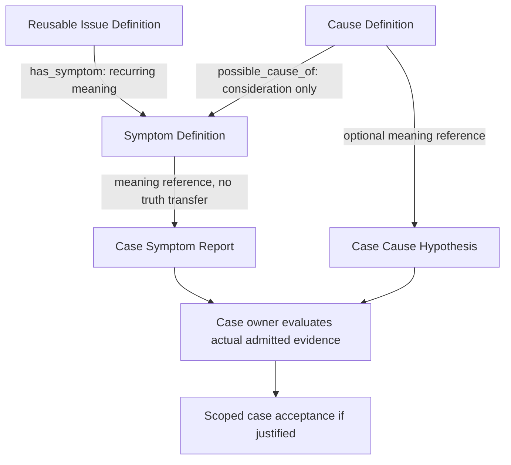
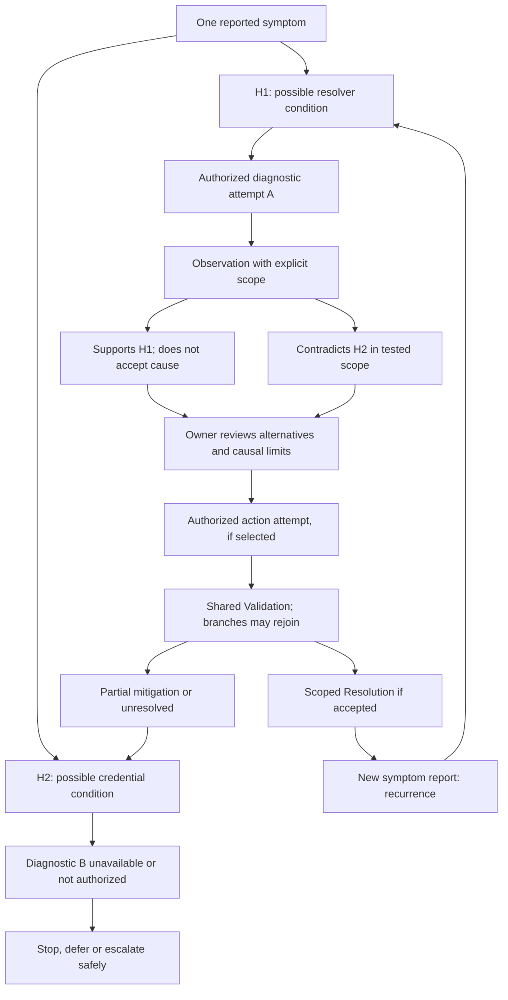
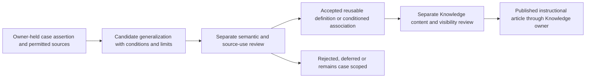

# F7Hub Semantic Model 2B

## Document Control

| Field | Value |
| --- | --- |
| Phase | 2B — Troubleshooting Concept & Relationship Model |
| Date | 2026-10-08, America/Toronto |
| Planning status | CORRECTED_READY_FOR_REREVIEW |
| Authority | Proposed specialization of approved 2A; Foundation and existing domain owners remain authoritative |
| Workspace | `C:\Dev\F7Hub-SemanticModel-2B` |
| Branch | `docs/semantic-model-2b-planning` |
| Verified baseline / HEAD | `8b92fd13dfe340563044acd41ef15c0b905243db` |
| Authorized write | `Docs/Planning/SemanticModel/2B_Troubleshooting_Concept_Relationship_Model.md` only |
| Predecessor | 2A APPROVED + INTEGRATED, supplied by the user; local merge #85 corroborates integration |
| Independent review / approval | F-01 P2, CHANGES_REQUIRED on first review; corrected candidate rereview NOT RUN / approval NONE |
| Implementation / runtime acceptance | None established by this planning document |
| Next gate | INDEPENDENT REREVIEW OF CORRECTED 2B |

“Accepted” below describes a scoped semantic decision by an owning workflow, not approval of this document. All new choices, concept keys and predicate profiles are RECOMMENDATIONS pending independent review and approval. Inherited Foundation/2A invariants remain controlling requirements. No enum, catalog identity, interface or storage structure is installed here.

## Purpose

Define the semantic grammar of troubleshooting: what is experienced, what is observed, how it is interpreted, which claims it bears on, what was attempted, what resulted, which conditions were validated, and what the case owner accepted. This grammar prevents symptoms, hypotheses, causes, work and outcomes from becoming one flat taxonomy.

One symptom can have several possible explanations and several useful investigations. A case can revisit work, stop safely, escalate, mitigate impact, recur or resolve with an unknown cause. Typed meanings and owner references express these distinctions without requiring graph persistence.

## Scope and Planning Instructions

The authorized workflow is UNDERSTAND → INSPECT → DEFINE CONCEPTS → DEFINE ASSERTIONS → DEFINE RELATIONSHIPS → DEFINE CAUSAL GOVERNANCE → DEFINE BRANCHING → TEST EDGE CASES → DOCUMENT → VALIDATE. This new document records that contract and the author-side execution report. Later review records should be appended without erasing these requirements or their historical findings.

Define concepts, reusable versus case roles, claim/disposition semantics, minimal relationships and complete profiles, causal acceptance, multi-cause reasoning, branching, source admission, provenance, ownership, imported-proposal reconciliation and conceptual edge tests. Stop after this document is complete and statically validated, unstaged and uncommitted.

## Out of Scope

SQLite design, tables, junction tables, migrations, indexes, repositories, services, APIs, DTOs, IPC, graph or vector databases, embeddings, parsers, extraction code, AI providers, GUI, workflow engines, Case Journal/DynamicHub implementation, diagnostic execution changes, script changes, taxonomy seeds, validators/repairs, imports, dataset revisions and synthetic corpus rewrites are excluded. No 2C lexical catalog, 2D extraction implementation, 2E corpus revision, 2F reconciliation or SemanticModel AGENTS file is created. No staging, commit, push, PR or merge is authorized.

## Authorities / Dependencies

Authority order: explicit user requirement → approved Foundation → approved 2A → existing owning-domain architecture → inspected implementation evidence → S0/research/proposals. Imported starter material is not semantic authority.

| Source inspected | Controlling use / evidence limitation |
| --- | --- |
| [Root contract](../../../AGENTS.md), [ROOT](../../../ROOT.md), [router](../../19_DocumentationIndex.md), [Planning guidance](../AGENTS.md), [Foundation guidance](../Foundation/AGENTS.md) | Scope, source hierarchy, progressive context, owner escalation and evidence vocabulary |
| [0A Master Foundation](../Foundation/0A_Master_Foundation_Architectural_Contract.md), execution C/E/G and approved 0A-D1/0A-D2 | Producer-owned observations/results; case-owned associations; DynamicHub coordination; local ticket-optional Journal |
| [0B Global JSON](../Foundation/0B_Global_JSON_Contract_Interoperability_Grammar.md), Contract Principles, Identity, Missing/Unknown, Validation and Security | Owner references and context freshness; structural validity is not semantic acceptance; no new wire grammar |
| [0C Information Vocabulary](../Foundation/0C_Taxonomy_Information_Vocabulary.md), Classification, Entity Occurrence, Relationship, Operational Vocabulary, Provenance and Privacy | Shared meanings, controlled specialization, existing predicates, Root Cause outside taxonomy, uncertainty distinct from authority |
| [0D Settings](../Foundation/0D_Settings_Architecture.md), Settings/Non-Settings, Ownership, Security and Downstream Contract | Semantic truth, runtime case state, registries and permission are not Settings |
| [0E Reconciliation](../Foundation/0E_Foundation_Architecture_Reconciliation.md), source verification, Evidence/Journal/DynamicHub, gaps and downstream contract | Reconciled ownership; missing feature implementation does not justify parallel shared infrastructure |
| [2A Semantic Model Foundation](2A_Semantic_Model_Foundation.md) | All concept/assertion, ownership, source/use admission, identity, generalization and downstream boundaries; 2B specializes them |
| S0 reconciliation report | Read from `%LOCALAPPDATA%\F7Hub\CodexCheckpoints\SemanticModel-S0\S0-Reconciliation-Report.md`; concept analysis, predicate/field reconciliation, G02–G04/G11 and downstream decisions are research input |
| [Priority RCA proposal](../../../Data/SemanticModel/Proposals/priority_rca_graph.proposed.json), [RCA illustration](../../../Data/SemanticModel/Proposals/RCA_RELATIONSHIPS_PROPOSAL.json) and their package equivalents | Imported candidate roles, predicates and branches; no operational truths, canonical identities or execution grants |
| [Issue catalog](../../../Data/SemanticModel/Imports/Synthetic-Troubleshooting-Starter-v0.1/Packages/F7Hub_Taxonomy_Planning_v0.1/catalogs/issues.json), [tools](../../../Data/SemanticModel/Imports/Synthetic-Troubleshooting-Starter-v0.1/Packages/F7Hub_Taxonomy_Planning_v0.1/catalogs/tools.json), [procedures](../../../Data/SemanticModel/Imports/Synthetic-Troubleshooting-Starter-v0.1/Packages/F7Hub_Taxonomy_Planning_v0.1/catalogs/procedures.json), corresponding bilingual CSVs | Role tests only; source IDs remain namespace-bound proposals; technical accuracy and source rights NOT VERIFIED |
| [Diagnostic result types](../../../Python/f7hub/domain/diagnostic_results.py) | FACT: process classification, collected diagnostic status and pack collection status are separate values |
| [Ticket migration](../../../Database/Migrations/0004_tickets.sql), [TicketService](../../../Python/f7hub/services/ticket_service.py) | FACT: Ticket identity, Type including PROBLEM, Status and transitions remain Ticket-owned |
| [Taxonomy migration](../../../Database/Migrations/0002_taxonomy.sql), [KnowledgeService](../../../Python/f7hub/services/knowledge_service.py) | REUSE existing catalog ownership and revision-checked publication; do not replace them |

**FACT:** entry branch/HEAD matched; status, tracked diff, staged diff and whitespace check were empty. Remote inventory identifies the existing origin; no fetch or branch movement was needed. Local first-parent history includes Foundation merges #66/#67/#68/#70/#71 and 2A merge #85 at this HEAD. User-supplied approval is the approval authority for this task; no fresh GitHub review audit was performed. Preserved author-side READY_FOR_REVIEW/NONE wording in integrated 2A and historical Foundation reports is historical candidate metadata, not a reversal of later approval/integration.

The non-blocking P3 note from 2A review is carried forward as an explicit predecessor gate:

`2A APPROVED + INTEGRATED → 2B → 2C → 2D → 2E → 2F`.

Each later phase needs the prior reviewed, approved and integrated contract plus separate task authorization. In particular **2C begins only after 2B is independently reviewed, approved and integrated**. 2B neither starts nor preapproves 2C–2F. The P3 note is user-supplied review context; its external review record was not independently retrieved here.

## 2A Contract Carried Forward

Root Cause is not taxonomy; a Tag is not a causal assertion; an Entity occurrence does not establish canonical identity. A definition is not an occurrence, and an occurrence is not reusable general truth. Proposed Action is not executed Action; a Diagnostic Step definition proves no run. Result does not establish Resolution; remediation success does not prove causality; Validation does not automatically establish Root Cause. Case acceptance does not automatically create reusable knowledge. Confidence is neither proof nor authority. AI/automation may propose but cannot self-accept. No generic graph truth store, second taxonomy or SemanticModel execution authority is authorized.

Preserve 2A's six conceptual views rather than choosing six modules or stores. Preserve module owner, Category scope, subject area, product/service reference, analytical group and lexical namespace as distinct dimensions. Preserve source admission separately for processing, persistence, indexing, disclosure, Analytics and generalization. Local lookup/review and ticketless working records must not require external PSA, AI or remote semantic infrastructure.

## Current Starter Findings / Reuse Assessment

**FACT:** all 46 tracked starter paths were inventoried with entry raw SHA-256 hashes for preservation, separately from 2A and Foundation. The two RCA proposal families were parsed in both working and packaged locations. Each priority proposal has 31 symptom anchors and 68 branches; every branch declares `HYPOTHESIS_NOT_TESTED`. Each RCA illustration has 12 nodes, 10 edges and the three named predicates `has_possible_cause`, `investigate_with`, `requires_followup`. The priority family has the composite `POSSIBLE_CAUSE_EVALUATED_BY_CHECK`. None supplies the complete required predicate profile.

**FACT:** imported catalog/CSV inventory contains 46 issue rows, 26 tool rows and 12 procedure rows. “Issue” mixes experiences, technical conditions, security suspicion and support concerns. “Tool” mixes products, platforms, portals, applications, runtimes and providers. Candidate findings are templates, not observations that occurred. Their source-local counts say nothing about operational incidence or cause probability.

| Existing owner / evidence | Treatment | Consequence |
| --- | --- | --- |
| Foundation vocabulary and existing Category/Tag catalog | REUSE / specialize | No causal taxonomy or duplicate shared catalog |
| Diagnostics result types and registered-execution ownership | REUSE | Preserve producer outcomes; semantic interpretation adds a scoped claim, never rewrites result bytes |
| TicketService / existing ticket activity | REUSE | No semantic path closes or retypes a Ticket; Journal does not duplicate its timeline |
| KnowledgeService publication and revision checks | REUSE | Semantic acceptance and instructional publication are separate gates |
| Approved Journal and DynamicHub boundaries | REUSE architecture; concrete interfaces DEFERRED | Searches of tracked Python/Database/Tests/Mochi filenames did not establish a general Journal, DynamicHub or SemanticModel runtime; no substitute is designed here |
| Imported branches and catalogs | REFERENCE_ONLY / reconcile concepts | Preserve all bytes; do not seed, execute, merge identities or repair tooling |

Absence is bounded to inspected repository evidence. No operational database, external prototype, provider capability or native application was inspected. The delivery skill was inspected for available procedures; implementation slice machinery is not applied to this architecture-only document.

## Core Concept Model

The stable roles below are proposed semantic identities. Candidate keys use 2A/0C ASCII lower_snake_case; they are neither physical IDs nor installed enums. Terms in the matrices refer to these roles, regardless of later localized wording. Creating a symmetric pair of runtime records for every role is unnecessary.

### Issue vs Symptom

**2B-D01 RECOMMENDATION:** retain **Troubleshooting Issue Definition** as the fully qualified concept (`troubleshooting_issue_definition`); avoid bare “Issue” in machine contracts and ownership statements. Display wording remains a later 2C decision. “Troubleshooting concern” is a possible clearer label, not a second concept or approved lexical alias.

A Troubleshooting Issue Definition is a curated reusable knowledge/search anchor for a recurring technical condition or support concern, with applicability and limits. It can organize several Symptom Definitions. A Symptom Definition describes a recognizable reported/experienced behavior or impact, without prescribing its explanation. A Symptom Occurrence/Report is an attributable report in a particular case, including reported time, reporter, affected context and permitted original wording. Recording a report accepts that it was reported, not that every technical implication is true.

Issue-to-symptom association is many-to-many. A symptom can occur in several concerns; a concern can involve several symptoms; either can remain unmapped. Case scope is a **case concern** (the identified impact/condition being investigated), which need not match a curated Issue Definition. It is an owner-held subject description/reference, not a new universal Case Issue entity.

The recurring definition has no Ticket identity, Ticket Type, PROBLEM lifecycle, Category, Tag or Status semantics. Ticket PROBLEM remains the existing Ticket-owned discriminator; whether an owning problem-management workflow has accepted an explanation cannot be inferred from that type. Category organizes records; Tag annotates topics; Status tracks owner state. A definition may reference these where admitted, but is not an alternate value in their catalogs.

### Observation / Finding / Evidence

An **Observation** (`observation`) is an attributable statement, value, measurement or event obtained from a source or diagnostic activity under identified method/time/context. “Reporter says access failed” is an observation about a report; its content may remain unverified. Directly collected, reported, imported and simulated observations must remain distinguishable. Units, namespace, target and collection coverage matter. Source validity/availability is separate from interpretive relevance.

A **Finding** (`finding`) interprets one or more observations/results against explicit criteria, recording inputs, method/profile revision, interpretation, scope and limits. An “authentication failed” result may support a finding only within that producer's declared operation/context; it is not a credential-cause conclusion by label. Finding criteria can be reusable profiles; an actual finding belongs to its producer/owning investigative use case.

**Evidence** (`evidence`) is a role of admitted source material explicitly associated with a named Claim for a declared purpose. Its eligible endpoints are producer-owned source references, Observations, Findings or Results. Evidence is not a duplicate raw-content store. Associating an observation as evidence requires source/use admission, specific claim/revision/scope, relevance/method explanation and an accountable association decision; observation collection alone does not do this. One observation can support H1 and contradict H2 through distinct associations. Material that is relevant but inconclusive uses `informs_claim`.

Observation ≠ Finding; Finding is not automatically Evidence; Evidence ≠ proof. A valid producer result may have disputed interpretation. A broken collection attempt creates no negative observation about the target condition. Preserve raw producer results and allowed source lineage; interpretation must not overwrite them. Duplicate notes, translations or copied result summaries are dependent evidence, not independent corroboration.

### Claim Model

A **Claim** (`claim`) is the conceptual unit of a scoped semantic assertion that can be proposed, evaluated, accepted, rejected or left unresolved. It is an interpretation/acceptance abstraction across owners, **not a universal persisted Claim table, workflow or Status catalog**. Pure observations/results are not forced to become claims; assertions about their validity or meaning can be claims.

| Conceptual requirement | Meaning |
| --- | --- |
| Subject and proposition | What is asserted about which bounded concern, occurrence, context or condition; do not use a label alone |
| Scope | Case/target/population, product/version/environment, relevant time/window and applicability; Ticket association optional |
| Definition/reference | Meaning and reviewed definition/profile context if available; unlinked assertions are allowed, with no fake canonical ID |
| Source/provenance | Origin, producing method, proposal/assignment actor, eligible source revision and evidence source |
| Evidence associations | Explicit supporting, contradictory and informing material, rationale and dependencies |
| Acceptance/disposition | Owning decision and reason, actor/workflow authority, time, use and reviewed revision; proposed is not accepted |
| Revision/context | Historical proposition, meaningful changes, fresh target binding and stale/superseded/current distinction |
| Uncertainty | Optional method-specific limits/assessment; unknown, unavailable, not tested and contradicted are different |

Candidate kinds: symptom assertion (report/occurrence, not cause); environment/context assertion (case scope, not automatic canonical identity); hypothesis assertion (possible explanation); causal assertion (contribution/mechanism requiring acceptance); validation assertion (criteria evaluation); resolution assertion (accepted treatment of scoped impact). These are roles specialized by owners, not shared database discriminator values.

### Hypothesis Model / State and Disposition

A **Cause Definition** (`cause_definition`) describes a potentially explanatory technical condition/mechanism and its applicability. It is reusable meaning, not proof it exists in a case. “Hypothesis Definition” is an explanatory use of a Cause Definition, not a parallel type. A **Cause Hypothesis** (`cause_hypothesis`) is a case-scoped possible explanation that instantiates/references that meaning or a still-unmapped proposal.

**2B-D04 RECOMMENDATION:** separate investigation disposition from evidence assessment. A single linear status loses mixed evidence and confuses testedness with acceptance.

| Dimension | Conceptual values / rules |
| --- | --- |
| Hypothesis investigation disposition | ACTIVE, DEFERRED, REJECTED, ACCEPTED_AS_CAUSAL. REOPENED records a return-to-review episode; the current investigation is ACTIVE with prior disposition retained, rather than a permanent fifth terminal state. Reasons identify rejected scope and material changes. |
| Hypothesis evidence assessment | NOT_TESTED (no discriminating assessment performed), INSUFFICIENT (assessment attempted/relevant material insufficient), SUPPORTED, CONTRADICTED, MIXED. Retain individual evidence associations and their quality/limits; labels do not vote or accept claims. |
| Causal claim authority/current applicability | Candidate/unaccepted; accepted for reviewed scope/revision; under review after challenge; rejected or superseded; withdrawn/currently ineligible. Historical acceptance and present eligibility are separate dimensions. |
| Validation progress versus condition outcome | Planned, unavailable, not authorized, cancelled, failed to collect, completed are progress/availability distinctions. PASS, FAIL, PARTIAL or INCONCLUSIVE evaluate declared conditions only where eligible evaluation occurred. A failed invocation is not technical Validation FAIL. |
| Resolution disposition versus coverage | Proposed, accepted, under review/reopened, superseded/withdrawn; separately identify full treatment versus partial mitigation, outstanding impact, criterion/window coverage and cause-known/unknown. Ticket state is independent. |
| Generalization Proposal review versus release eligibility | Candidate, under review, accepted, rejected, deferred or superseded; independently record source-use eligibility and permitted use/visibility. Acceptance does not publish Knowledge. |

These values describe semantics, not automatic enums or a mandatory storage machine. Evidence assessment is scope- and method-specific; mixed evidence can coexist with accepted causal disposition if acceptance explicitly explains the conflict and limits. Accepted causal status must reference an owning acceptance decision; mere SUPPORTED cannot create it. Rejection is scoped and reasoned, not universal disproof. Reopening preserves prior rejected/accepted state, input revision, reason and new review episode. Safe stopping/deferment is valid work, not false rejection or fabricated failure.

## Causal Claim / Root Cause

An **Accepted Causal Claim** (`accepted_causal_claim`) is a case-scoped explanation accepted by the owning case workflow, with supporting evidence, diagnostic relevance, declared context, contradictions and limits. Acceptance does not promise absolute scientific proof.

**Contributing Cause** (`contributing_cause`) and **Root Cause** (`root_cause`) are roles of accepted case causal claims, not globally reusable entity types or taxonomy entries. The orthogonal conceptual `causal_role` has two initial values: `ROOT_CAUSE` and `CONTRIBUTING_CAUSE`. A contributing cause materially participates in producing the scoped issue/impact but is not designated a Root Cause; it may explain part of the impact or participate in a joint explanation, without implying a causal percentage. A Root Cause is the accepted explanatory basis selected for the declared investigative scope, with rationale for why that depth/boundary is useful and supported. “Root” is relative to that boundary, not a declaration of the ultimate cause of everything. Neither role is a second causal predicate, Tag, Entity Type or globally reusable causal object.

| Causal position | Requirements / allowed use |
| --- | --- |
| Possible cause | Reusable conditioned consideration or untested case hypothesis; no current-case existence implied |
| Supported hypothesis | Attributable relevant support assessed; remains a hypothesis without owner causal acceptance |
| Accepted contributing cause | Case acceptance identifies contribution, interactions and limits; may explain a subset of impact |
| Accepted Root Cause | Accepted causal claim plus explicit Root Cause role, explanatory boundary/depth and case-owner decision |

Zero accepted Root Causes is valid. Several contributing causes or several accepted Root Cause roles are valid where the owning workflow explicitly accepts them for declared scopes or a joint explanation; do not duplicate one explanation merely to fill roles. Cause-known does not mean impact-resolved. Mitigated/resolved does not mean cause-known. Root Cause is never inferred from a Tag, Category, Ticket PROBLEM or a selected catalog label.

### Causal Acceptance Criteria

Before accepting a hypothesis as causal, the owning workflow must evaluate and record:

1. Identified proposition, case concern/target, time window and causal scope; bound product/version/environment and source/definition context.
2. Explicit eligible supporting evidence and an explained mechanism or diagnostic interpretation connecting it to the target condition, with method limits.
3. Known contradictory/inconclusive evidence, material collection gaps, dependent/duplicate sources and reasons conflicts do or do not defeat the claim.
4. Material competing explanations considered and why this explanation is sufficiently justified for this scope. Every possible alternative need not be disproven.
5. Source validity/admission and diagnostic relevance; missing permissions, unavailable evidence or untested methods cannot be disguised as negative findings.
6. Authorized case acceptance actor/workflow, acceptance time, reviewed proposition/source revision, rationale, uncertainty and residual limits. Assigning a Root Cause role requires its separate scope/depth rationale.

These are architectural admission criteria, not a numerical threshold or test that automation can self-satisfy. If material evidence/context cannot support acceptance, keep the hypothesis unresolved/deferred/rejected with reasons. Expert judgment can accept a bounded explanation but cannot omit its evidence, contradictions or limits.

Temporal order, correlation, co-occurrence, similarity, frequency, Tag overlap, successful remediation, user confirmation, AI ranking and model confidence **alone** cannot establish cause. A controlled intervention can provide causal evidence under an explicit reviewed method with confounders considered; its SUCCESS result alone cannot. Validation evaluates conditions, not causal mechanism by default.

### Multi-Cause Semantics

Maintain a set of accepted case explanations with independent scopes and an explicit joint interpretation where required. Each accepted cause-to-impact association uses `accepted_cause_of`; `causal_role` records whether the owning workflow designated that accepted claim `ROOT_CAUSE` or `CONTRIBUTING_CAUSE`. For example, the same case impact can have Cause A `accepted_cause_of` it with `ROOT_CAUSE` and Cause B `accepted_cause_of` it with `CONTRIBUTING_CAUSE`; two claims can each carry `ROOT_CAUSE` when explicitly accepted. For fictional case C, condition A and condition B together produce the failure; neither is asserted sufficient alone. The joint proposition is a case claim with component cause references and evidence/limits, not a new global causal taxonomy, arbitrary expression language or graph engine.

“Primary/secondary contributor” may be a case explanation emphasis with an explicit basis, not a universal rank/probability. “Environmental contributor” describes contextual participation, not a weaker acceptance gate. “Necessary condition” is a stronger scoped claim requiring supporting discrimination; occurrence alone does not establish necessity. “Unknown interaction” describes uncertainty about combination/mechanism and cannot be asserted as an accepted causal interaction without evidence. No catalog of speculative causal subtypes is created. Cause-role fields and joint-claim detail remain owner-specific future design.

### Hypothesis / Evidence / Causal Acceptance Diagram

## Diagnostic Semantics

A **Diagnostic Step Definition** (`diagnostic_step_definition`) is a purpose-bearing reusable investigative method. Diagnostics owns authoritative definitions and any operation bindings; SemanticModel specializes investigative relevance and interpretation profiles with Diagnostics agreement. A **Diagnostic Attempt** (`diagnostic_attempt`) is the case occurrence of attempting that method; a planned intent or denied attempt does not claim execution occurred.

**Check** (`check`) and **Test** (`test`) are method roles of Diagnostic Step Definitions, not duplicate runtime records. A Check inspects/collects to establish a condition; a Test deliberately evaluates to discriminate claims or verify a condition. Roles can overlap: no artificial exclusive partition is required. Do not assume Check means read-only.

| Reusable method requirement | Case attempt counterpart |
| --- | --- |
| Purpose and claims/conditions discriminated | Why this attempt was selected for the bound case scope |
| Preconditions, applicability, product/version/context | Actual precondition assessment and context, with unknowns explicit |
| Expected discriminating observations and interpretation criteria | Actual source observations/results; criteria-supported finding with limits |
| State-effect classification: observational, may change state, state-changing or effect unknown | Actual effects/side effects and authorization; unknown effect must not enter a read-only path |
| Resources/prerequisites and owner operation reference if available | Actual owner invocation/run reference where executed; capability/permission checked independently |
| Safety limits, stop/rollback implications and criteria revision | Actual cancellation/failure/recovery circumstances; no replay from a definition |

An attempt can be planned, unavailable, not authorized, cancelled before/during execution, failed to execute, completed with result or completed but inconclusive. Keep execution/collection classification separate from interpretation. Valid collected ERROR can coexist with completed execution; infrastructure failure must not fabricate a collected DiagnosticResult. A cancelled attempt can have partial output; its eligible meaning follows producer coverage. A completed change must not be relabeled cancelled merely because a later step was cancelled.

For discrimination, a reusable profile may say “under these conditions, observation pattern P supports explanation H1 and weakens H2.” The case must supply P, scope, eligible source and a criteria-supported association before it bears on either hypothesis. A permission-denied log lookup says nothing about whether the account condition exists. Expected observations never fill missing actual values.

## Action / Intervention / Remediation

An **Action Definition** (`action_definition`) describes something that could be done, with intent, applicable target/context, expected effects and owning workflow/resources. It is a definition extension, not a reinterpretation of Foundation's operational Action. An **Action Attempt** (`action_attempt`) is an owner-held occurrence of attempting it, including planned/denied/cancelled/failed/completed distinctions and an actual owner result if produced.

A **Recommendation** (`recommendation`) is advice to consider an Action/method, with proposer, rationale, applicability and limits. Adoption through the owning workflow is distinct from authorization, invocation and completion. **Intervention** (`intervention`) is an Action role intended to change user/system/environment state. **Remediation** (`remediation`) is an Intervention role intended to address a case concern, cause or impact. Remediation intent alone does not remove cause, succeed or resolve a case. A diagnostic Test can also be an Intervention; investigative purpose and state effect are independent.

Remediation can fail, partly succeed, succeed without causal proof, produce side effects, require rollback and require Validation. A rollback is another owner-controlled action/attempt linked to the prior work by owner references; a recommendation is no rollback authority. Expected outcomes belong to definitions/plans; actual results and effects belong to attempts/producers.

Candidate remediation association means “consider this intervention under declared conditions,” not “run this script.” It grants no permission, capability, automatic execution, script selection outside policy or provider access. Actual execution remains with approved services/gateways and explicit technician authority, including the existing PowerShellService/PowerShellGateway boundary. This document changes no invocation or execution contract.

## Result / Validation / Resolution

A **Result** (`result`) is the immediate producer-owned outcome of an attempted operation/diagnostic/action/request. It can report completion, failure, partial outcome or uncertainty under its owner contract. A case statement about a result is not a replacement for it. Result profiles belong to the producer; do not create a generic reusable Result entity to mirror definitions.

A **Validation Definition** (`validation_definition`) specifies expected conditions, scope, method, preconditions, required observations, criteria, coverage/window and limits. A **Validation occurrence/assertion** (`validation_assertion`) records actual evaluation of those conditions using eligible observations/results, after or independently of an Action. Outcome is condition-specific; it does not inherit an operation's SUCCESS. The producer owns measurements; the case workflow accepts their case relevance and evaluation, using Diagnostics criteria when applicable.

A **Resolution** (`resolution`) is an accepted case-scoped assertion that identified support concern/impact is addressed or sufficiently mitigated under declared acceptance criteria. A proposed resolution remains a proposal. **Mitigation** (`mitigation`) reduces impact without necessarily removing underlying cause; it is an outcome/coverage role of an intervention or accepted resolution, not a universally separate definition. A partially mitigated case records remaining impact and may remain unresolved; a sufficiently mitigated concern can be accepted as resolved only under explicit owner criteria and limits.

**Recurrence** (`recurrence`) is a later report/assertion that previously addressed symptom/concern has appeared again under a relevant scope. It identifies the prior resolution/validation context and new occurrence, without assuming identical cause or erasing the prior valid time-bounded result. **Escalation** (`escalation`) is an owner workflow decision/request to transfer or seek authorized expertise/resources because of risk, uncertainty or unavailable safe next work; it does not mean the receiving owner acted or accepted a cause. Definitions may contain escalation criteria; case events/decisions belong to Journal/DynamicHub/Ticket as appropriate.

Resolution acceptance identifies concern/coverage, applicable technical criteria and Validation evidence (or an explicit approved owner reason why particular technical evaluation is inapplicable), accepted workaround/mitigation limits, outstanding effects, actor/time/revision and recurrence/monitoring limits. Missing required technical validation cannot be replaced by customer confirmation. Do not invent a universal policy exception; a needed exception is deferred to the owning workflow.

Result ≠ Validation; Validation PASS ≠ Root Cause proof; Action SUCCESS ≠ Resolution; Resolution ≠ Ticket CLOSED. Customer confirmation is a separate source that may contribute evidence about user experience; it does not replace required technical criteria. Existing Ticket resolution/status mechanisms keep their own rules; a semantic resolution assertion neither performs nor mandates a Ticket transition.

## Definition vs Occurrence

| Reusable meaning / profile | Fictional case occurrence/assertion | Boundary |
| --- | --- | --- |
| Symptom “VPN connection fails” | “Reporter could not connect at 09:43” | Accept report separately from technical truth and cause |
| Issue “Remote connectivity concern” | Case concern affecting selected user/device/resource | Optional mapping; no Ticket created or merged |
| Cause “Incorrect resolver configuration” | H1 proposes that condition in this case | Possible-cause knowledge does not accept H1 |
| Diagnostic “Test DNS resolution” | Attempt at 09:49, or permission denial | Definition proves neither invocation nor observed failure |
| Finding interpretation criteria | Actual finding from identified observations and criteria revision | Expected pattern is not observed value |
| Action “Flush DNS cache” | Owner-controlled attempt at 09:54 | Description is no execution permission; outcome is producer-owned |
| Validation “Verify VPN and required resource access” | At 09:58 VPN connects but resource X remains inaccessible | Partial conditions cannot become whole-case PASS |
| Resolution/mitigation acceptance criteria | Accepted scoped treatment with documented remaining limits | Acceptance belongs to case owner, not the reusable criteria |
| Recurrence/escalation criteria in guidance | New report at 11:10; escalation requested | Preserve prior history, distinct cause and receiving-owner acknowledgment |

Observations, evidence associations, claim decisions, results, recommendations and recurrence occurrences do not need standalone reusable definitions merely for symmetry. The Concept Matrix accounts for their profile/role versus occurrence. No case occurrence may silently modify its reusable definition. A meaning-changing revision cannot retroactively reinterpret old assertions; keep the interpreted context and mark stale eligibility when relevant sources/definitions change.

## Troubleshooting Paths / Branching

A troubleshooting path is a purpose- and context-bound investigative history plus current owner-selected next work. Reusable paths describe conditional guidance; actual paths record proposals, attempts, results, evidence, choices and decisions through their owners. They are neither execution schedules nor a physical graph choice.

One symptom can initiate several hypotheses; each hypothesis can have several diagnostic methods. One actual observation can bear differently on several claims. Branch conditions record why work is relevant, preconditions/effect limits, expected discrimination and stopping/escalation criteria. Outcomes can lead to another branch, rejoin on shared validation or return to earlier work. New attempt/review identity distinguishes a revisit from duplicate-result replay; earlier rejection and unavailable diagnostics remain visible.

No simple-tree or DAG requirement applies to a real case. Conceptual paths may revisit hypotheses, including after recurrence. A reusable bounded method may impose its own loop/stop rules through the workflow owner; that does not turn 2B into a universal workflow engine. No unsafe automatic retry follows from a cyclic diagram. If no safe next method is available, stop/defer or escalate and retain uncertainty. Rejoining does not merge causes, erase contradictions or retarget previous results to a newly selected context.

This is a fictional reasoning example, not technical advice, a certified diagnostic sequence, runtime topology or executable workflow.

## Relationship Architecture / Families

**RECOMMENDATION:** nine deliberately narrow candidate predicate profiles below. Keep owner references/fields for context, selection, timing, run/result attribution, validation targets and generalization lineage when they already express the meaning. Graph-shaped reasoning requires no generic graph truth store or graph database. Existing Ticket–KB and KB–KB predicates retain their identities and meanings.

| Family | Proposed predicate(s) | Meaning better represented by fields / owner references |
| --- | --- | --- |
| Descriptive/context | `has_symptom` | Product/component/environment applicability; Category/Tag references; case concern; definition reference. Avoid an unrestricted `related_to` edge. |
| Investigative | `investigated_by` | Case hypothesis proposal rationale from symptom; actual attempt references and observation interpretation criteria. No separate `suggests` or `confirms` predicate needed. |
| Evidential | `supports_claim`, `contradicts_claim`, `informs_claim` | Source admission, claim revision, association assessment and method/limits are part of the relationship context. |
| Causal | `possible_cause_of`, `accepted_cause_of` | `causal_role`, explanation boundary and joint-cause participation stay in the accepted case claim. No second accepted-cause edge or universal `causes` edge. |
| Intervention | `candidate_remediation_for` | Actual action/result ownership and intent, effect, rollback and mitigation coverage. Reusable `addresses`/`mitigates` are not extra near-synonyms. |
| Validation | `validation_method_for` | Requiredness comes from an owner policy/plan; actual validation evaluates named conditions/resolution proposal through owner references. Evidence predicates support its assertion. |
| Generalization | No additional 2B predicate | Proposal's permitted source refs and accepted association's derivation lineage specialize 0C DERIVED_FROM; case acceptance and publication remain distinct. |

Definition-level associations do not imply instance-level truth. For example `CauseDefinition possible_cause_of SymptomDefinition` means consideration under conditions, not a current `accepted_cause_of` assertion. `investigated_by` relates reusable meanings to a method; it establishes neither execution nor test outcome. The imported reverse direction “symptom has possible cause” becomes an inverse read view, not a second accepted predicate.

### Common Predicate Profile Obligations

Each profile below incorporates **P0–P8** in addition to its specific rows. This is a semantic profile inheritance convention in this document, not runtime infrastructure. Machine keys are candidates; inverses are display/read views only, not additional writable predicate keys. All nine are directed, non-symmetric and non-transitive: do not calculate semantic closure or causal inheritance across them.

| Obligation | Required meaning for every profile |
| --- | --- |
| P0 — Identity/status | Candidate machine key; new definition/profile acceptance requires semantic owner review. All profiles currently RECOMMENDED, not approved/installed. Labels do not determine identity. |
| P1 — Provenance | Origin/source owner and permitted source revision; production method/profile revision; proposal/assignment actor; association acceptance actor/workflow/time/reviewed revision; actual evidence/source context. Unknown facts remain unknown. |
| P2 — Applicability | Typed endpoints exist or remain expressly unresolved proposals; declared definition/instance level, scope, target/time/context/product/version and method conditions. Cross-case mismatches cannot be implicitly joined. |
| P3 — Cardinality/identity | Zero-to-many optional links; no forced cause/evidence/validation link. Same endpoint/predicate/scope/revision/method assertion is one logical association with retained source attributions; distinct sources/methods/contexts may carry distinct assessments. Exact storage uniqueness deferred. Self-reference is ineligible for these type-separated profiles. |
| P4 — Authority | Profile review, relationship acceptance, endpoint authority and execution permission are separate. Endpoint publication or acceptance cannot accept an edge automatically. Candidate links display as proposals. |
| P5 — Uncertainty | Optional, explicitly method/task-defined, with limits. No universal numeric weight, vote count or probability. Missing differs from zero. Scores never grant truth, identity, publication or execution. |
| P6 — History/deletion | Preserve permitted rejection/revision/supersession and prior acceptance meaning; meaning/source changes require eligibility review. Source expiry/redaction/access loss makes dependent current use explicitly unavailable/review-required under owner policy, never secretly copies raw content. Retained minimal history needs its own lawful/policy basis. |
| P7 — Privacy | Source admission before relationship processing; separate persistence/index/disclosure/generalization eligibility. Endpoint labels, context, edge existence and reasons can be sensitive. No secret-bearing metadata, ordinary raw-content logs, or implicit access through a reference. |
| P8 — Misuse prohibition | No definition→case truth promotion, transitive causality, automatic execution, case→global promotion, score-based self-acceptance or suppression of contradictory evidence. Profile-specific examples follow. |

### Predicate Profiles

#### P01 — has_symptom

| Profile field | Specification, plus P0–P8 |
| --- | --- |
| Machine key / display | `has_symptom` — recurring concern includes this reported behavior/impact |
| Source / target semantic type | Troubleshooting Issue Definition → Symptom Definition |
| Level / direction / inverse | Definition; Issue → Symptom; inverse view “symptom associated with recurring concern” |
| Symmetric / transitive | No / No |
| Cardinality / uniqueness | Many-to-many, optional; several concerns can share a symptom; P3 contextual identity |
| Conditions / applicability | Curated concern and recognizable experience are distinct, relevant under declared scope |
| Required provenance | P1 plus basis for recurring association and its curated applicability |
| Uncertainty | Qualitative limits where association is tentative; no frequency/likelihood implied |
| Acceptance / owner | SemanticModel accepts its association; domain owner retains product/context identity |
| Lifecycle / history | P6; refinement cannot rewrite prior case reports |
| Privacy | P7, including potentially revealing concern labels |
| Misuse | “This Ticket has that symptom because its Category matches”; “the symptom uniquely identifies the issue/cause” |

#### P02 — possible_cause_of

| Profile field | Specification, plus P0–P8 |
| --- | --- |
| Machine key / display | `possible_cause_of` — consider this explanation under these conditions |
| Source / target semantic type | Cause Definition → Symptom Definition or Troubleshooting Issue Definition; target kind must be explicit |
| Level / direction / inverse | Definition; Cause → recurring Symptom/Issue; inverse view “has a possible cause” |
| Symmetric / transitive | No / No |
| Cardinality / uniqueness | Many-to-many, zero causes allowed; P3 distinguishes different applicable mechanisms/contexts |
| Conditions / applicability | Explain plausibility/mechanism, scope and technical review limits; no current-case existence |
| Required provenance | P1 plus admitted reviewed sources and contradictory examples/limits where known |
| Uncertainty | Explanatory plausibility only; not statistical likelihood without separate measured evidence |
| Acceptance / owner | SemanticModel accepts reusable consideration; case owner independently evaluates any instantiation |
| Lifecycle / history | P6; source change/technical challenge can retire or revise association without changing old cases |
| Privacy | P7; case-derived support requires separate generalization admission |
| Misuse | “VPN failures are usually stale credentials” from fictional counts; adopting this edge as accepted case cause |

#### P03 — investigated_by

| Profile field | Specification, plus P0–P8 |
| --- | --- |
| Machine key / display | `investigated_by` — this method can collect relevant information or discriminate this explanation |
| Source / target semantic type | Symptom Definition, Troubleshooting Issue Definition or Cause Definition → Diagnostic Step Definition; source role explicitly selects descriptive investigation versus explanatory discrimination |
| Level / direction / inverse | Definition; investigated meaning → method; inverse view “method relevant to investigation of” |
| Symmetric / transitive | No / No |
| Cardinality / uniqueness | Many-to-many; several methods per meaning and several claims per method; P3 includes purpose/criteria context |
| Conditions / applicability | Source-role-specific purpose; preconditions, expected discrimination, criteria/effect/resource limits required |
| Required provenance | P1 plus Diagnostics method/criteria reference and suitability rationale; templates distinguished from measured observations |
| Uncertainty | Suitability or interpretive limits, not run confidence or confirmed diagnosis |
| Acceptance / owner | SemanticModel reviews relevance; Diagnostics accepts authoritative method/interpretation criteria; neither decision authorizes a run |
| Lifecycle / history | P6; method revision invalidates affected suitability; old run remains attributed to actual revision |
| Privacy | P7; method availability must not disclose protected resource access/context |
| Misuse | A `check_ref` proves execution; an expected finding becomes actual evidence; an investigated cause is confirmed |

#### P04 — supports_claim

| Profile field | Specification, plus P0–P8 |
| --- | --- |
| Machine key / display | `supports_claim` — material gives a stated reason favoring this proposition within scope |
| Source / target semantic type | Admitted producer source reference, Observation, Finding or Result → scoped Claim, including validation/resolution/hypothesis claims |
| Level / direction / inverse | Instance evidence association; material → Claim; inverse view “claim has supporting evidence” |
| Symmetric / transitive | No / No |
| Cardinality / uniqueness | Many-to-many; P3 plus claim revision, source revision, method and rationale; duplicate-source dependencies retained |
| Conditions / applicability | Specific relevance/mechanism and coverage; eligible source and target/context agreement |
| Required provenance | P1 plus original producer, collection/interpretation context, association reviewer and dependence on other material |
| Uncertainty | Support can be limited; no universal evidentiary weight or automatic threshold |
| Acceptance / owner | Case/Journal workflow accepts case association; producer controls source validity; other claim owners accept their own scope |
| Lifecycle / history | P6; re-review when source/claim/criteria change; prior support remains historical where permitted |
| Privacy | P7; case link and supporting rationale can reveal sensitive facts |
| Misuse | Support proves cause; repeated copies count as independent evidence; accepting support accepts the claim |

#### P05 — contradicts_claim

| Profile field | Specification, plus P0–P8 |
| --- | --- |
| Machine key / display | `contradicts_claim` — material conflicts with this proposition or its expected consequence within scope |
| Source / target semantic type | Same admitted material union as P04 → scoped Claim |
| Level / direction / inverse | Instance; material → Claim; inverse view “claim has contradictory evidence” |
| Symmetric / transitive | No / No |
| Cardinality / uniqueness | Many-to-many; P3 with contradictory consequence and source/method context; support can coexist |
| Conditions / applicability | Explain conflict and tested scope; unavailable/not-collected data cannot be fabricated as contradiction |
| Required provenance | P1 plus conflict criteria, coverage and source-validity limitations |
| Uncertainty | Strength/limits are method-specific; contradiction is not universal disproof |
| Acceptance / owner | Claim-owning case/workflow accepts association and reviews disposition; producer retains source authority |
| Lifecycle / history | P6; can trigger challenge/reopening; never erases earlier acceptance automatically |
| Privacy | P7, including dispute/history sensitivity |
| Misuse | One differing source rejects every related hypothesis globally; suppressing a contradiction after acceptance |

#### P06 — informs_claim

| Profile field | Specification, plus P0–P8 |
| --- | --- |
| Machine key / display | `informs_claim` — relevant material adds context or uncertainty without resolving evidential direction |
| Source / target semantic type | Same admitted material union as P04 → scoped Claim |
| Level / direction / inverse | Instance; material → Claim; inverse view “claim has informing material” |
| Symmetric / transitive | No / No |
| Cardinality / uniqueness | Many-to-many; P3 with relevance/limits; do not use as arbitrary relatedness |
| Conditions / applicability | Explicit relevance and reason support/contradiction is not justified; inconclusive valid collection is allowed |
| Required provenance | P1 plus inconclusive/context rationale, actual collected scope and unavailable portions |
| Uncertainty | Unresolved direction explicit; not numerical midpoint or zero support |
| Acceptance / owner | Claim-owning case/workflow accepts relevance; producer controls underlying source |
| Lifecycle / history | P6; later assessment can revise direction with reasons and retained earlier interpretation |
| Privacy | P7; admitting relevance does not admit general publication |
| Misuse | Inconclusive is a negative result; arbitrary material attached as evidence; permission denial proves a condition absent |

#### P07 — accepted_cause_of

| Profile field | Specification, plus P0–P8 |
| --- | --- |
| Machine key / display | `accepted_cause_of` — owning workflow accepted this scoped causal relationship for a declared subject and condition/impact |
| Source / target semantic type | Accepted case causal Claim → bound case concern or Symptom Occurrence, with target role explicit; source identifies accepted causal condition/mechanism, not merely a label |
| Level / direction / inverse | Case instance / accepted claim; accepted explanatory claim → explained case target; inverse view “target has accepted explanation” |
| Symmetric / transitive | No / No |
| Cardinality / uniqueness | Zero-to-many explanations per target; one explanation may cover several declared targets; multiple accepted causes and Root Cause roles allowed; P3 |
| Conditions / applicability | Causal acceptance criteria satisfied for declared subject, target, context, evidence set, revision and scope; no sole/complete cause required. Assign `causal_role = ROOT_CAUSE` only on explicit owner designation with depth/scope rationale; otherwise an accepted material contributor has `causal_role = CONTRIBUTING_CAUSE`. |
| Required provenance | P1 plus supporting/contradictory/informing evidence, mechanism, alternatives, actor/time/rationale and limits |
| Uncertainty | Acceptance can be bounded/uncertain; not scientific proof or reusable causal certainty |
| Acceptance / owner | Required authorized case/Journal causal decision and separate role designation; SemanticModel only supplies profile/proposals; AI cannot accept |
| Lifecycle / history | P6 plus challenged/current applicability separation; owner can retain, revise, reject or reopen |
| Privacy | P7; accepted accusation/security/identity links can themselves be sensitive |
| Misuse | Successful action creates this link; the link alone means sole cause, complete explanation, Root Cause, scientific certainty, reusable truth, Resolution or Ticket closure; transitive cause closure; historical acceptance remains current forever |

The selection rule is: without owner causal acceptance, use no `accepted_cause_of` link; with acceptance, use this one link. The owning workflow then designates `ROOT_CAUSE` for an explicitly accepted Root Cause or `CONTRIBUTING_CAUSE` for an accepted material contributor not so designated. Both roles use the same predicate. Never also record `contributes_to` for the same claim/target/scope. A joint proposition and each participant require their own justified acceptance; neither co-occurrence nor this role establishes necessity or sufficiency.

#### P08 — candidate_remediation_for

| Profile field | Specification, plus P0–P8 |
| --- | --- |
| Machine key / display | `candidate_remediation_for` — consider this intervention to address this cause/concern under conditions |
| Source / target semantic type | Action Definition with Remediation intent → Cause Definition or Troubleshooting Issue Definition; target role explicit |
| Level / direction / inverse | Definition; candidate intervention → intended causal/concern meaning; inverse view “has candidate remediation” |
| Symmetric / transitive | No / No |
| Cardinality / uniqueness | Many-to-many; optional/no safe action valid; P3 includes applicability/intent |
| Conditions / applicability | Expected mechanism/impact, prerequisites/effects, resource/owner references, risks, validation/rollback needs; no guaranteed cure |
| Required provenance | P1 plus technical suitability review, supporting/contradictory sources and limits |
| Uncertainty | Method-specific expected suitability; no fixture-derived success probability |
| Acceptance / owner | SemanticModel accepts semantic suitability with action/resource-owner review; execution owner independently decides capability/policy/authorization |
| Lifecycle / history | P6; changed action/product/policy affects current suitability; old actual attempts/results retained under owners |
| Privacy | P7; no secret arguments or provider credential data in relationships |
| Misuse | A cause/action link chooses and runs a script; `addresses` implies removal; commonly successful becomes reusable `resolves` |

#### P09 — validation_method_for

| Profile field | Specification, plus P0–P8 |
| --- | --- |
| Machine key / display | `validation_method_for` — this criteria-bearing evaluation is relevant to checking this action's intended conditions |
| Source / target semantic type | Validation Definition → Action Definition with stated intended condition/effect |
| Level / direction / inverse | Definition; validation method → action meaning; inverse view “action has relevant validation method” |
| Symmetric / transitive | No / No |
| Cardinality / uniqueness | Many-to-many; several conditions/methods possible; absence of relation cannot waive owner-required validation; P3 |
| Conditions / applicability | Explicit expected conditions, coverage/window, method/criteria and limitations; independently applicable validation remains possible without Action association |
| Required provenance | P1 plus method/criteria owner reference and suitability rationale; obligation cites its separate owner policy/plan |
| Uncertainty | Evaluation limits; requiredness is a policy fact, not confidence |
| Acceptance / owner | SemanticModel accepts relevance; Diagnostics/validation-method owner accepts criteria; case workflow selects required conditions and accepts actual evaluation/resolution |
| Lifecycle / history | P6; criteria revisions do not change earlier validation outcomes; actual obligation/completion history belongs to owners |
| Privacy | P7; coverage/target details can reveal protected resources |
| Misuse | Association proves validation occurred/passed; generic follow-up creates a workflow engine; PASS confirms Root Cause or closes Ticket |

### Evidence / Investigation / Causal / Intervention Boundaries

Evidential P04–P06 specialize the 0C Evidence/claim association meaning; they do not replace `EVIDENCE_FOR`'s broader source-to-case association or turn telemetry into case evidence. Each relation identifies the named target claim and source/method/scope/acceptance context. Assessment can be revised; the source and earlier assessment are retained only as admitted by policy.

Investigative P03 describes suitability only. An attempt uses an owner-held definition reference and run identity if invoked; no new `executed_by` relationship is needed. Observation discrimination is expressed by Finding criteria and P04–P06 to the actual hypotheses; no independent `discriminates` edge bypasses that interpretation.

Causal P02 is reusable possibility; only P07 asserts an accepted case causal relationship, with its Root Cause or contributor role accepted separately. A Cause Definition `possible_cause_of` a Symptom/Issue Definition does not imply a case causal claim `accepted_cause_of` a case concern/impact. No direct source-result-to-Root-Cause shortcut is admitted. Intervention P08 is suitability, while P09 is validation relevance; actual Action intent, state effect, selected resources, attempt result and Validation target belong to their owner references. Generalization lineage uses existing 0C DERIVED_FROM meaning without approving a new general graph predicate.

### Dangerous Conflations / Temporal Semantics

| Distinction | Required consequence |
| --- | --- |
| `related_to` ≠ `causes`; co-occurrence ≠ cause | Neutral relevance and shared Tags cannot populate causal predicates |
| `possible_cause_of` ≠ `accepted_cause_of` | Definition consideration must pass independent case evidence/acceptance |
| `suggests` ≠ `confirms`; `supports` ≠ `proves` | Candidate rationale/support remains separate from owner acceptance |
| `contradicts` ≠ universal disproof | Scope/criteria/source validity and current review decide its impact |
| `investigated_by` ≠ `executed_by`; `tested_by` ≠ `test_passed` | Method relevance/definition reference is no attempt/result evidence |
| `used_during` ≠ `resolved_by`; `addresses` ≠ `resolves` | Actual use and intended treatment require separate validation/resolution acceptance |
| `successful_after` ≠ `caused_by` | Ordering/success cannot infer explanatory mechanism |
| `validation_passed` ≠ `root_cause_confirmed` | Criteria/window PASS concerns conditions, not causal acceptance |
| Resolved case ≠ reusable solution | Conditioned generalization and Knowledge publication need separate reviews |

`performed_before`/`performed_after` are chronological descriptions derived from owner history, not new 2B predicates. Distinguish reported event time, observation/collection time, invocation/completion time and acceptance time; incomplete/unsynchronized clocks leave order uncertain. Ordered journal entries alone cannot prove physical sequence or cause. `result_of_attempt` is a producer/attempt ownership reference (consistent with 0C RUN_FOR and owner operation identity), not `evidence_for_claim` or `resolves`. A later successful connection can follow several interventions and external changes; causal attribution remains unresolved unless separately justified. No clock-based retargeting or inferred causal closure is allowed.

## Contradiction / Reopening

Later contradictory evidence produces an attributable challenge to the identified claim/scope/revision. The case owner evaluates relevance and source validity, retains the prior acceptance as historical where policy permits, and records a current decision to retain with rationale, revise/supersede, reject/withdraw or reopen investigation. Unreviewed conflict must be visible as challenged/review-required; the model does not silently display an unqualified current truth or automatically reject it.

Reopening does not edit earlier results, erase former acceptance or require all historical claims to remain current. Scope changes can make evidence incomparable rather than contradictory. Loss of source access is an eligibility problem, not proof the claim is false. Reassess dependent resolution/joint-cause/generalization proposals when material inputs change; do not automatically invalidate unrelated accepted scopes. Exact retention/history implementation remains deferred to owners.

## Generalization Boundary / Knowledge Base

Case experience can propose a new symptom definition, possible-cause relationship, diagnostic suitability/discrimination profile, remediation association or validation condition. Even an accepted case cause/resolution produces only **CANDIDATE generalized knowledge**. There is no automatic learning pipeline.

A generalization proposal identifies the exact meaning/association proposed, eligible case/source references, product/version/environment, applicability conditions, mechanism/criteria, supporting and contradictory cases/material, dependence/selection limits, uncertainty, proposed use/visibility, source-use admission and reviewer/revision. A single case may justify consideration but cannot assert prevalence or reusable efficacy. Synthetic fixtures retain fictional provenance and cannot provide empirical causal likelihood or production case evidence.

SemanticModel's authorized curator accepts only its feature-owned definitions/conditioned associations after technical and source-owner input where required. Case owners accept case assertions; source/security owners admit wider use; Knowledge owners independently review instructional content, revision, visibility and publication. The same technician can act in several scopes, but decisions remain distinct and attributable. No universal “Semantic Reviewer” can accept all owners' objects.

Knowledge articles can reference accepted definition/association meaning and revision through owner-approved references. Semantic definitions can reference eligible article content as a source. Neither copies article authority, replaces existing KB relationships nor asserts article truth/causality automatically. Conflicting source/meaning changes trigger their respective owners' reviews. New reference interfaces are dependencies, not created here.

## Ownership / Acceptance Matrix

Acceptance below is a future owner-scoped governance requirement, not a new role/permission system or implemented endpoint. DynamicHub coordinates review/sequence; it does not acquire persistence or producer authority. Ticket-bound records use existing Ticket-owned mechanisms; broader ticketless assertions use approved Journal ownership when interfaces are separately designed.

| Assertion/object | Source/record owner | Who accepts which meaning | SemanticModel role / dependency |
| --- | --- | --- | --- |
| Symptom occurrence/report | Case Journal or existing Ticket activity; reporter source retained | Authorized case workflow accepts report association and interpreted scope; reporting is no causal proof | Supplies definition/interpretation; case assertion/reference interface needed |
| Observation validity | Producing collector, technician/source owner | Producer validates collection/source profile; case reviewer evaluates admissibility/relevance, never rewrites producer outcome | References bounded source/context; producer/Journal association contract needed |
| Finding interpretation | Producing Diagnostics/investigative use case | Method/criteria owner validates interpretation; case workflow accepts case relevance with limits | Specializes meaning; reusable finding-profile agreement needed |
| Evidence association | Producer source; claim-owning case/Journal association | Source owner admits use; claim-owning workflow accepts relationship and scope | Defines P04–P06; new durable association mechanics deferred |
| Hypothesis disposition | Case/Journal; DynamicHub coordinates | Authorized case workflow accepts rejection/deferment/reopening or proposal review | Defines distinctions; no independent workflow engine |
| Case causal claim | Case/Journal | Authorized case workflow under Causal Acceptance Criteria | Profile/proposal only; no model/rule self-acceptance |
| Root Cause / contribution role | Case accepted causal claim and its P07 relationship | Case workflow designates `causal_role = ROOT_CAUSE` or `CONTRIBUTING_CAUSE` with explanatory scope/depth/contribution, not taxonomy steward | Defines role semantics; no second accepted causal predicate; role/history interfaces deferred |
| Diagnostic definition/attempt/result | Diagnostics; case history references actual work | Diagnostics owns method/execution/result authority; technician/owning workflow authorizes invocation independently | Meaning/relevance, never result mutation or execution |
| Action definition/recommendation/attempt | Action/resource/execution owner; proposing advisor; case records relevance | Owner admits definition/operation and authorizes attempt; case workflow separately adopts recommendation | Semantic suitability; resource policy and run references remain owner-bound |
| Validation | Method/measurement producer; case evaluation | Diagnostics/criteria owner controls technical method; case workflow accepts actual evaluation and coverage | Meaning/profile; no inherited SUCCESS/PASS |
| Resolution / mitigation / recurrence | Case/Journal or existing Ticket record responsibility | Authorized case workflow accepts scoped impact treatment or renewed concern; Ticket owner alone controls status/closure | Definition/reference; resolution acceptance interface needed |
| Escalation | DynamicHub/case or Ticket workflow | Initiating owner accepts decision/request; receiving owner separately acknowledges/acts | Criteria/reference only; no implied remote completion |
| Reusable semantic relationship/generalization | SemanticModel for its definitions/associations; sources retain rights | Authorized semantic curator for feature object, with source-use and affected method/domain owner decisions | Owns feature meaning/review, never case authority |
| Knowledge publication | Knowledge | Authorized Knowledge publisher/workflow under article revision and visibility rules | May propose/reference, cannot publish |

## Privacy / Provenance / Uncertainty

Apply approved 2A admission **before** processing any claim, evidence association, relationship or generalization. Permission to view a note does not admit semantic extraction; processing does not admit retention/indexing; retention does not admit disclosure/Analytics/generalization. Owner-qualified references carry identity, not access. Do not enable any source integration in this phase.

Relationships themselves can reveal sensitive facts: a case-linked account compromise explanation may expose security/identity information even without raw notes. Avoid recording secret-bearing endpoints/arguments, copying private labels or echoing disputed raw payloads into normal logs. Predictable hashing is not anonymity. Keep minimal allowed metadata, declared purpose/access/lifetime, safe technical logging separate from meaningful review audit, and independent outbound preview/technician controls as required by owners. Employer/privacy/licensing policy and redaction accuracy are NOT VERIFIED; no invented retention period or deletion exemption is chosen.

Preserve five axes for case assertions and reusable proposals: origin; production method/profile revision; proposal/assignment actor; acceptance actor/workflow/time/scope/revision; evidence source and its actual context. “AI-proposed, technician-accepted” must not become “technician-originated.” Same for imports and synthetic data. Definitions, source snapshots, operation identities and claim revisions must not collapse into one identifier.

Uncertainty belongs to the claim/relationship method and purpose. Support, contradiction and informing relevance need no universal numerical weights. Parser recognition, method suitability, human assessment, similarity/rank and causal likelihood are not interchangeable. Unknown/missing/zero/redacted/not-collected/unavailable retain their declared differences under 0B. Source expiry/change can withdraw current use without pretending the historical assertion was freshly verified. Concrete storage, audit, deletion/tombstones and lawful history policy require later owner design.

## Imported Proposal Reconciliation

The following covers every distinct named relation token and semantic node/state token found in both RCA families, plus their relationship-bearing fields. Dispositions are proposed semantic treatment, not imported-artifact mutations or approved mappings. `REUSE_CONCEPT`, `RENAME`, `SPLIT`, `MERGE`, `REJECT`, `REFERENCE_ONLY`, `NEEDS_DECISION` describe this reconciliation only. Exact source-local IDs and labels are not production identities. All rows remain RECOMMENDED for 2B review; technical eligibility of individual imported records remains unverified.

### Named Predicates

| Imported token / locations | Disposition | Proposed treatment / reason |
| --- | --- | --- |
| `has_possible_cause`, working and packaged RCA illustration | RENAME | P02 `possible_cause_of` with reversed direction Cause Definition → Symptom/Issue Definition. Imported hypothesis nodes are reusable explanatory candidates here, not actual case hypotheses. Reverse read view is not another persisted fact. |
| `investigate_with`, both RCA illustrations | RENAME | P03 `investigated_by`, with explicitly typed source-role union and role-specific investigation/discrimination purpose. Preserve Symptom versus Cause endpoint distinction; no invocation or evidence inferred. |
| `requires_followup`, both RCA illustrations | SPLIT | P09 expresses reusable validation suitability; requiredness is an owner policy/plan reference; actual validation is a separate occurrence/evidence-based assertion. The imported edge proves neither obligation admission nor completion. |
| `POSSIBLE_CAUSE_EVALUATED_BY_CHECK`, working and packaged priority proposals | SPLIT | P02 possibility + P03 method suitability + expected observation/finding criteria + P08 intervention suitability + validation/stop criteria. Actual P04–P07 need case sources/decisions. The composite is not a binary causal/evidential edge; accepted contribution uses P07 with `causal_role = CONTRIBUTING_CAUSE`, never a second accepted causal predicate. |

### Node Kinds, Dispositions and Authority Tokens

| Imported token(s) | Disposition | Proposed interpretation / boundary |
| --- | --- | --- |
| `symptom`, `symptom_anchor` | MERGE | Reusable Symptom Definition candidate role; anchor is discovery packaging, not another semantic type or actual report. |
| `hypothesis`, `cause` | SPLIT | In these untested reusable proposals, candidate Cause Definitions/explanatory templates. A case Cause Hypothesis and accepted causal claim require separate owner-held occurrences/decisions. |
| `diagnostic_check`, `check` | MERGE | Diagnostic Step Definition with Check role; effects/criteria need review. Check is not inherently read-only. |
| `finding` / `discriminating_observation` | SPLIT | Expected observation pattern versus criteria-bearing finding template; neither is measured case content. Some labels are raw statements and cannot become interpreted findings without criteria. |
| `action`, `remediation` | REUSE_CONCEPT | Action Definition, possibly in Intervention/Remediation role; imported remediation label does not prove state effect, authorization or success. |
| `verification` | RENAME | Validation Definition candidate, with explicit expected conditions/method/coverage; no customer-confirmation equivalence or completed validation. |
| `escalation` | REUSE_CONCEPT | Reusable stopping/escalation criteria; actual request/acknowledgment remains owner workflow. |
| `HYPOTHESIS_NOT_TESTED` | REUSE_CONCEPT | Candidate branch testedness corresponds to NOT_TESTED assessment, not global workflow status or absence of cause. |
| `HYPOTHESIS_NOT_CONFIRMED` | SPLIT | Untested, insufficiently supported, mixed or unaccepted are distinct; the label alone cannot determine which. Preserve raw candidate label; actual assessment NEEDS_DECISION by context. |
| `PROPOSED`, `CURATION_DRAFT`, `REQUIRES_TECHNICAL_REVIEW` | MERGE | Candidate/review-needed authority context, not evidence outcome, installed universal Status or completed review. |
| `TECHNICIAN_APPROVAL_REQUIRED` | REFERENCE_ONLY | Imported intention agrees with separate execution authorization; it is not a verified policy binding, capability, approval or invocation. |
| `PASS`, `FAIL`, `INCONCLUSIVE`, `NOT_RUN`, `COLLECTION_ERROR` from finding policy | SPLIT | Distinguish condition assessment, not-tested/unavailable execution and collection failure. Preserve producer values; do not turn these into one global enum or interpret collection failure as condition FAIL. |
| `NOT_APPROVED`, `PLANNING_ONLY`, `PROPOSED_NOT_VERIFIED` | REUSE_CONCEPT | Artifact/candidate authority limitation; never accepted meaning because a file is present. |
| `HUMAN_CURATED_MODEL_DRAFT`, editorial illustration source | REFERENCE_ONLY | Declared production provenance, not verified human-only authorship, technical correctness or acceptance. Retain import origin. |
| `dataset_is_fictional`, no canonical IDs / no numeric confidence guardrails | REUSE_CONCEPT | Preserve fictional/unmapped/uncalibrated boundaries; conformance does not establish operational evidence. |
| `foundation_baseline` approval text / `validation_contract` flags | REFERENCE_ONLY | Source-declared guardrails, not authority to approve Foundation, run validation, write SQLite or create Tags. |
| `canonical_id: null`, `calibrated_confidence: null` | REUSE_CONCEPT | No canonical mapping/calibrated confidence supplied; not zero, negative finding or placeholder identity. |
| Imported implied automatic accepted cause, successful-only resolution or executable-edge interpretation | REJECT | These stronger interpretations are not justified by the proposals or synthetic fixtures. No source token is upgraded to them. |

### Association Fields / Source Mapping

| Imported field/group | Disposition | Semantic treatment |
| --- | --- | --- |
| `cause_ref`, `check_ref`, `finding_ref`, `action_ref` in branch | SPLIT | Definition/template references with roles above; case attempt/result/evidence must be supplied separately. |
| `verification`, `escalation_rule` | SPLIT | Validation criteria candidate and workflow stopping/escalation guidance; no completed evaluation or escalation event. |
| `source_candidate_ids`, `source_reconciliation` | REFERENCE_ONLY | Intake lineage and editorial role mapping; no canonical equivalence without reviewed context mapping. |
| `related_tool_ids`, `related_sop_ids`, `related_issue_ids` | REFERENCE_ONLY | Resource/procedure discovery refs, not approved USES, executed method, capability or RESOLVES. Reverse lookup is derived, not a new causal predicate. |
| `possible_causes` | REUSE_CONCEPT | Candidate P02 consideration requiring technical/applicability review; source placeholders are not causes. |
| `product_mentions`, `products`, `domain`, `domain_code`, `domains` | SPLIT | Product mention versus affected context; subject scheme versus owner/Category scope; qualified source references, no canonical creation. |
| Search phrases/aliases and proposed keys | REFERENCE_ONLY | Later 2C equivalence/discovery decisions; wording cannot merge semantic roles. |
| Synthetic `evidence_step_numbers` mentioned by S0 | REFERENCE_ONLY | Fictional attempt/source lineage needs actual selected observation/result and criteria in later 2E design; not independent empirical evidence. |
| Imported resource operational ID/capability/policy mapping | NEEDS_DECISION | Resource/Diagnostics/integration owners in separate plans; no guess from labels. |

### Issue / Tool / Procedure Role Tests

These are exact inspected source-local examples. Their labels are imported proposals, not current operational conditions or verified vendor guidance. Retyping recommendations below do not edit catalogs or decide 2C aliases.

| Source-local example | Mixed classification | Proposed representable roles |
| --- | --- | --- |
| `EXO-001` Repeated Outlook authentication prompts | Uniform Issue row describes experience | Symptom Definition; associated recurring concern can be a distinct Issue Definition; actual report remains case-scoped. |
| `IAM-003` Account locked out | Label can mean experience or observed account condition | Preserve report separately from permitted account-state Observation/Finding; repeated failed attempts remain possible cause, not implied cause. |
| `IAM-005` Password synchronization failure | Technical-condition label is not uniquely a symptom | Reusable concern or Cause Definition depending on declared mechanism; a case Finding needs explicit diagnostic criteria/evidence. |
| `IAM-011` Microsoft 365 license missing or incorrectly assigned | Condition combined with two alternatives | Candidate concern; observed assignment state versus interpreted incorrect assignment are distinct; possible contribution to access failure requires causal review. |
| `EXO-003` Outlook local profile or mailbox data malfunction | Alternative mechanisms flattened into one row | Concern/condition candidate with distinct explanatory alternatives, methods and criteria; no accepted corruption finding from label alone. |
| `SEC-004` Suspected or confirmed compromised account | Uncertainty/acceptance flattened | Proposed security hypothesis versus accepted scoped finding/claim under security owner workflow; no confirmation or account action by wording. |
| Priority candidate “Available methods do not meet enrollment requirements” | Finding template repeats expected discrimination text | Actual permitted method observations + explicit requirement criteria → Finding; only then separately associated evidence for an identified claim. |
| Priority action “Follow approved identity verification and MFA re-registration SOP” | Action label points to procedure | Action Definition with external owner procedure reference and constraints; SOP identity/approval/permission not verified; actual attempt is separate. |
| `TOOL-003` Microsoft Entra admin center; `TOOL-007` Microsoft 365 service health | Portal / information source under Tool | Typed resource/source reference; no diagnostic method, evidence or permission until an owning use case actually obtains admitted observations. |
| `TOOL-013` Windows 10; `TOOL-022` PowerShell | Platform/runtime under Tool | Product/platform and runtime references; neither is an executable registered operation or cause assertion. |
| `TOOL-018` VPN client (unspecified) | Unresolved resource label | Unmapped resource reference; no guessed product, device instance or capability. |
| `SOP-008` Outlook profile rebuild; `SOP-012` Ticket escalation and handoff | Both Procedure rows, different purposes/effects | Instructional procedure references; first can describe state-changing remediation, second workflow transfer; neither is an actual attempt or successful resolution. |

The model represents imported material through distinct definition, method, source, claim and owner-reference roles, rather than changing shared taxonomy meanings. Technical method/effect correctness, source authorship/rights, operational identity mapping and provider access remain NOT VERIFIED.

## Edge-Case Validation Matrix

All scenarios are fictional conceptual tests of representational adequacy. PASS here means the proposed model preserves distinctions; it is not an empirical causal test, executed application test or operational truth.

| Case | Representation and relationships | Required disposition / avoided false truth | Conceptual result |
| --- | --- | --- | --- |
| A — Report, unknown cause, workaround | Symptom Report, unresolved H1/H2, authorized workaround attempt/Result, explicit scoped Validation, proposed Resolution with mitigation limits | Owner may accept sufficient mitigation; zero accepted Root Causes; workaround success is no P07 cause | PASS |
| B — Two hypotheses, one rejected, one accepted | Separate H1/H2; P04/P05 source associations; method attempts; H1 rejection reason, H2 causal acceptance | Preserve rejected history and its scope; only independently accepted H2 can produce P07 | PASS |
| C — Two contributors jointly required | Two accepted claims/P07, each with `causal_role = CONTRIBUTING_CAUSE`, plus scoped joint proposition and discrimination supporting their combination | Neither is asserted sufficient alone; necessity/interaction claim carries evidence and limits; no exactly-one cause | PASS |
| D — Action succeeds, symptom remains | Producer SUCCESS Result; new symptom Observation; Validation FAIL for required restored condition | Resolution remains unaccepted/unresolved despite action completion; no fabricated cancellation or cure | PASS |
| E — Symptom disappears after success, cause uncertain | SUCCESS Result, time-bound Validation PASS and proposed scoped Resolution; hypotheses remain unresolved/mixed | Resolution may be accepted, causal attribution cannot be inferred from successful-after | PASS |
| F — Validation passes, later recurrence | Prior scoped/time-bound Validation and Resolution; new Report, recurrence reference, fresh case review | Retain earlier valid window; current resolution eligibility reviewed; same symptom need not imply same cause | PASS |
| G — Missing diagnostic permission | Diagnostic Definition plus not-authorized attempt/intent; no collected condition result | Hypothesis NOT_TESTED or otherwise unresolved; defer/escalate; denied collection is no negative finding | PASS |
| H — Support and contradiction coexist | P04 and P05 from distinct attributable source contexts to same hypothesis revision; evidence assessment MIXED | No vote/average, contradiction suppression or forced acceptance; investigate validity/scope differences | PASS |
| I — Customer success, technical failure | Reporter observation supports user-experience claim; technical Result/Finding contradicts required technical validation condition | Required validation is FAIL/PARTIAL; full Resolution cannot be accepted just from confirmation; record narrower mitigation if justified | PASS |
| J — No safe next diagnostic | Explicit effect/precondition limits, unavailable/unacceptable next work, stopping rationale, escalation request | Preserve unknown cause and unresolved/partial impact; no automatic state-changing fallback or implied escalation completion | PASS |
| K — Resolution without Root Cause | Validation covers declared concern, case owner accepts scoped Resolution; no accepted causal claim | Cause-known remains independent; no fake cause ID, taxonomy label or universal solution | PASS |
| L — Accepted Root Cause challenged | Historical P07 claim/role; new P05 association; visible under-review eligibility and reopening episode | Owner retains/revises/rejects/reopens with reasons; old acceptance not erased or silently current | PASS |

Additional causal-role checks: one `ROOT_CAUSE`; a `ROOT_CAUSE` plus a `CONTRIBUTING_CAUSE`; two explicitly accepted `ROOT_CAUSE` claims; and Resolution with no accepted cause all use zero or more P07 links only. Reopening a P07 claim preserves the earlier accepted role as historical while current eligibility is reviewed. These checks introduce no second causal predicate.

Additional negative checks: an expired source cannot remain silently available as evidence; a changed GUI selection cannot retarget an old result; two copied notes are not two independent sources; one successful validation condition cannot satisfy another; a fictional accepted cause cannot become production knowledge; an undefined/unmapped concern cannot force creation of a canonical entity. These are architectural checks, not new fixtures or test code.

## Concept Matrix

Reusable definition “profile” means criteria/interpretation governance without inventing a corresponding runtime entity. Owners and dependencies below are architectural, not availability claims. P01–P09 refer to the complete Predicate Profiles. Owner references supply the other relations.

| Concept / candidate key | Definition | Reusable definition? | Case occurrence? | Foundation/domain owner | SemanticModel role | Acceptance owner | Allowed relationships | Common confusion | Downstream dependency |
| --- | --- | --- | --- | --- | --- | --- | --- | --- | --- |
| Troubleshooting Issue Definition / `troubleshooting_issue_definition` | Recurring condition/support concern anchor | Yes | Case concern is separate subject, not automatic Issue instance | 0C shared meaning; SemanticModel definition | Own meaning | Semantic curator | P01; target P02/P08; source P03; context refs | Ticket PROBLEM/Category/Tag | 2C labels; case meaning refs |
| Symptom Definition / `symptom_definition` | Recognizable reported experience/impact | Yes | Via separate Report | SemanticModel; 0C constraints | Own meaning | Semantic curator | Target P01/P02; source P03 | Cause or diagnostic condition | 2C wording; case reports |
| Symptom Occurrence/Report / `symptom_report` | Attributable case report | Definition reference only | Yes | Journal/existing Ticket activity | Profile/proposal | Case workflow | Source P04–P06 where admitted; target P07; report/context refs | Verified technical truth | Journal/Ticket assertion contract |
| Observation / `observation` | Source statement/value/event with method/context | Profile, not duplicate entity | Yes/source-specific | Producer | Interpretation/reference | Producer validity; case relevance | P04–P06 if admitted; input to Finding/Validation | Finding/proof | Source/collection/admission contract |
| Finding / `finding` | Criteria-supported interpretation of inputs | Interpretation profile | Yes | Producer/Diagnostics or investigative owner | Specialize criteria meaning | Criteria owner plus case relevance | P04–P06; observation/result/criteria refs | Raw result/Evidence automatically | Diagnostics finding profile |
| Evidence / `evidence` | Role of material linked to named claim | Association profile | Yes/claim-specific | Source + case/claim owner | Define P04–P06 | Source-use owner and claim association owner | P04–P06; source/claim revision refs | Proof/global ledger | Journal association/access/history |
| Claim / `claim` | Scoped proposition subject to disposition | Semantic profile only | Yes/owner-specific | Claim's domain | Common interpretation grammar | Object owner | Target P04–P06; specialized P07; meaning/scope refs | Universal Claim table/status | Owner-specific assertion profiles |
| Cause Definition / `cause_definition` | Potential explanatory condition/mechanism | Yes | Hypothesis/claim separate | SemanticModel; technical owner input | Own meaning | Semantic curator | P02/P03; target P08 | Accepted current cause | 2C labels; Diagnostics review |
| Cause Hypothesis / `cause_hypothesis` | Case possible explanation | References Cause Definition | Yes | Case/Journal | Profile/propose | Case workflow | Target P04–P06; definition/attempt refs | Supported means accepted | Case disposition/review |
| Accepted Causal Claim / `accepted_causal_claim` | Owner-accepted scoped causal assertion, with orthogonal `causal_role` | No; generalize separately | Yes | Case/Journal | Define criteria/profile | Case workflow | Target P04–P06; source P07 only | Universal causal truth | Causal acceptance/history |
| Contributing Cause / `contributing_cause` | Accepted material participation, not designated Root Cause | Cause meaning only | `CONTRIBUTING_CAUSE` role on accepted claim | Case/Journal | Role semantics | Case workflow | P07 plus joint-claim/role refs; no second edge | Co-occurrence/sole cause | Case joint explanation |
| Root Cause / `root_cause` | Accepted explanatory basis at declared depth/scope | Role profile, not reusable entity | `ROOT_CAUSE` role on accepted claim | Case/Journal; outside taxonomy | Role semantics | Case workflow | P07 plus scope/depth/role refs; no second edge | Tag/exactly one ultimate cause | Case role/reopening |
| Diagnostic Step Definition / `diagnostic_step_definition` | Purpose-bearing investigative method | Yes, Diagnostics authoritative | Attempt separate | Diagnostics | Relevance/interpretation profile | Diagnostics method; semantic association curator | Target P03; resource/criteria refs | Method implies run | Diagnostics method/operation contract |
| Diagnostic Attempt / `diagnostic_attempt` | Attempted case use of method, possibly denied | Definition ref only | Yes | Diagnostics; case history refs | Reference meaning | Invocation/execution owner; case relevance | Definition/run/result/context refs | Denial proves condition absent | Execution/result/reference owner |
| Check / `check` | Inspection/collection method role | Diagnostic role | Attempt role | Diagnostics | Meaning specialization | Diagnostics | P03 through method; effect/criteria refs | Always read-only | Method effect classification |
| Test / `test` | Discrimination/verification method role | Diagnostic role | Attempt role | Diagnostics | Meaning specialization | Diagnostics | P03 through method; criteria refs | Result proves cause | Method/interpretation contract |
| Action Definition / `action_definition` | Description of possible work | Yes | Attempt separate | Action/operation owner; SemanticModel meaning | Purpose/suitability profile | Action owner; semantic curator for associations | P08; target P09; resources/intent refs | Permission/execution | Action/resource policy |
| Action Attempt / `action_attempt` | Actual case attempt of work | Definition ref only | Yes | Execution/action owner; case references | Reference meaning | Owning execution workflow | Producer result/definition/context refs | Proposed or SUCCESS equals resolution | Owner execution/history |
| Intervention / `intervention` | Action intended to change state | Action role | Attempt intent/effect | Action/Diagnostics owner | Role/effect semantics | Invocation owner | P08/P09 where applicable; state-effect refs | Every diagnostic is read-only | State-changing operation policy |
| Remediation / `remediation` | Intervention intended to address concern/cause/impact | Action role | Attempt intent, not outcome | Action owner/case | Suitability profile | Execution owner; case relevance | P08/P09; validation/rollback refs | Intent guarantees cure | Execution/validation agreement |
| Recommendation / `recommendation` | Attributable advice to consider work | May reference definitions | Yes or guidance-specific proposal | Proposing/advisory feature | Proposal meaning | Case/workflow adopts; owner authorizes independently | Proposed action/method/claim refs | Adoption is invocation | Advisory/adoption contract |
| Result / `result` | Immediate producer outcome | Producer profile only | Yes | Producer/Diagnostics/execution | Reference/interpretation | Producer validity; case relevance | P04–P06 if admitted; attempt ref | Validation/Resolution | Existing producer outcome contract |
| Validation Definition / `validation_definition` | Expected conditions/method/criteria/window | Yes | Evaluation separate | Criteria/Diagnostics owner; semantic profile | Meaning/suitability | Method owner; semantic curator for relevance | P09; expected-condition refs | Requirement proves completion | Validation criteria contract |
| Validation / `validation_assertion` | Actual evaluation of explicit conditions | Definition/profile reference | Yes | Producer plus case workflow | Interpretation/proposal | Criteria owner validity; case evaluation | Target P04–P06; condition/result/resolution refs | PASS proves cause | Case evaluation/reference contract |
| Resolution / `resolution` | Accepted scoped concern treated/mitigated | Acceptance criteria profile | Yes/claim | Case/Journal or existing Ticket responsibility | Meaning/proposal | Case workflow; Ticket closure separate | Target P04–P06; concern/validation/decision refs | Ticket CLOSED | Case resolution/history |
| Mitigation / `mitigation` | Reduced impact without necessary cause removal | Action/outcome role | Yes/coverage assertion | Action/case owner | Coverage meaning | Case workflow | Evidence/coverage/action refs | Partial means fully resolved | Owner acceptance criteria |
| Recurrence / `recurrence` | Addressed concern appears again in relevant scope | Criteria in guidance | Yes/new Report/assertion | Case/workflow | Meaning/profile | Case workflow | Prior resolution/new report/context refs | Same symptom proves same cause | Case review/history |
| Escalation / `escalation` | Seek/transfer authorized work due constraints | Criteria in guidance | Yes/decision/request | DynamicHub/case/Ticket | Criteria/reference | Initiating workflow; receiving owner separately | Stop reason/recipient/ack refs | Resolved or already transferred | Owner handoff contract |

## Relationship Matrix

This is the master vocabulary. P0–P8 and each full profile provide cardinality, inverse, conditions, uncertainty, lifecycle, deletion/privacy and misuse details; the compact matrix is not a competing abbreviated specification. “Acceptance” below accepts a relationship, not every endpoint claim.

| Predicate | Family | Source type | Target type | Definition/instance level | Meaning | Not meaning | Direction | Transitive | Symmetric | Acceptance | Provenance | Owner | Status |
| --- | --- | --- | --- | --- | --- | --- | --- | --- | --- | --- | --- | --- | --- |
| `has_symptom` | Descriptive | Issue Definition | Symptom Definition | Definition | Recurring association | Cause or unique case mapping | Issue → Symptom | No | No | Curator | P1 + recurring basis | SemanticModel | RECOMMENDED |
| `possible_cause_of` | Causal possibility | Cause Definition | Symptom/Issue Definition | Definition | Conditioned explanation to consider | Current-case cause/probability | Cause → meaning | No | No | Curator + technical review | P1 + sources/limits | SemanticModel | RECOMMENDED |
| `investigated_by` | Investigative | Symptom/Issue/Cause Definition, role explicit | Diagnostic Step Definition | Definition | Relevant investigation/discrimination | Run or confirmed finding | Meaning → method | No | No | Curator; Diagnostics criteria | P1 + purpose/criteria | SemanticModel; Diagnostics method | RECOMMENDED |
| `supports_claim` | Evidential | Admitted source/Observation/Finding/Result | Scoped Claim | Instance | Scoped favoring evidence | Proof or accepted claim | Material → Claim | No | No | Claim workflow/source use | P1 + relevance/dependence | Case/claim and source owners | RECOMMENDED |
| `contradicts_claim` | Evidential | Admitted source/Observation/Finding/Result | Scoped Claim | Instance | Scoped conflicting evidence | Universal disproof | Material → Claim | No | No | Claim workflow/source use | P1 + conflict criteria | Case/claim and source owners | RECOMMENDED |
| `informs_claim` | Evidential | Admitted source/Observation/Finding/Result | Scoped Claim | Instance | Relevant unresolved context | Negative result/arbitrary link | Material → Claim | No | No | Claim workflow/source use | P1 + relevance/limits | Case/claim and source owners | RECOMMENDED |
| `accepted_cause_of` | Accepted causal | Accepted causal Claim | Case concern/Symptom Occurrence | Case instance / accepted claim | Causal YES; scoped owner-accepted explanation; multiple accepted causes YES; `causal_role` is `ROOT_CAUSE` or `CONTRIBUTING_CAUSE` | Sole/complete cause NO; automatic Root Cause NO; global truth/Resolution/Ticket closure NO | Claim → explained target | No | No | REQUIRED case causal and role decisions | P1 + supporting/contradictory evidence, alternatives and causal gate | Case/Journal | RECOMMENDED |
| `candidate_remediation_for` | Intervention | Remediation-intent Action Definition | Cause/Issue Definition | Definition | Consider intervention under conditions | Execution or guaranteed resolution | Action → meaning | No | No | Curator + action owner review | P1 + mechanism/effects/limits | SemanticModel; action owner | RECOMMENDED |
| `validation_method_for` | Validation | Validation Definition | Action Definition | Definition | Relevant criteria-bearing evaluation | Required/run/passed by association | Validation → Action | No | No | Curator + method owner | P1 + criteria/policy refs | SemanticModel; method owner | RECOMMENDED |

## Downstream Contracts

`2A APPROVED + INTEGRATED → 2B → 2C → 2D → 2E → 2F` remains the dependency order. A recommendation in this document is not a consumed approved contract until 2B's own independent review, approval and integration. Later phases need separate authorization and sequential predecessor gates.

| Later phase / owner | May later consume | May not redefine / gate |
| --- | --- | --- |
| 2C lexical model | Reviewed/approved stable concept roles and relationship meanings; named namespaces and role distinctions | Begins only after 2B independently reviewed, approved and integrated. May decide localized labels, aliases, synonyms, abbreviations, search cues and collision handling; cannot redefine Symptom, Finding, Evidence, Cause Hypothesis, Root Cause, Action, Result, Validation or Resolution. No lexical catalog created now. |
| 2D extraction | Approved 2A–2C meaning, eligible source and revision-specific proposal targets | Cannot silently establish extracted claims, cause, canonical identity or acceptance; proposes to owning workflows. No extraction implementation starts here. |
| 2E corpus architecture | Approved 2A–2D roles, branches, unknown/multi-cause/negative cases and fictional expected assertions | Cannot redefine production semantics or turn synthetic success into empirical evidence; no fixture/corpus rewrite now. |
| 2F reconciliation | All independently reviewed/approved/integrated predecessors and owner dependencies | Reconcile conflicts/impacts, escalate upstream changes rather than override; no automatic implementation authority. |
| Journal/Ticket/DynamicHub | Proposed occurrence, review, history, coordination and reference needs | Must separately design owner contracts before implementation; no missing API is replaced inside SemanticModel. |
| Diagnostics/action/resource owners | Method purpose/effect/criteria, actual attempt/result refs and independent authorization | Existing execution/result authority retained; no semantic edge grants invocation or capability. |
| Knowledge/source/security | Conditioned generalization lineage, source-use eligibility and separate instructional publication | New reference/retention/access interfaces require owner agreement; semantic review cannot bypass publication/privacy. |

## Decision Register

All new choices below are RECOMMENDED pending review. Evidence is the inspected Foundation/2A/S0 and starter findings recorded above; no choice changes approved Foundation ownership or authorizes runtime/storage work.

| ID / question | Options considered | Decision / recommendation | Rationale / evidence | Owner | Downstream consequence | Status |
| --- | --- | --- | --- | --- | --- | --- |
| 2B-D01 — Issue versus Symptom? | One flat issue type; qualified recurring concern plus symptom; introduce another Problem identity | Qualified Troubleshooting Issue Definition separate from experience/report | Imported mixed issue rows; 2A definition/report and Ticket boundary | SemanticModel + Ticket | 2C wording cannot merge roles | RECOMMENDED |
| 2B-D02 — Observation/Finding/Evidence? | One record/label; source statement, interpretation, claim-associated role | Separate three roles with explicit association | 0C/2A producer authority and claim evidence | Producer + case | 2D cannot fabricate findings/evidence | RECOMMENDED |
| 2B-D03 — Claim semantic unit? | Universal persisted table; owner-scoped assertion abstraction | Scoped proposition with concept/reference/provenance/revision/decision | 2A source/claim/acceptance, 0B refs | Each claim owner | Owner-specific later profiles/storage | RECOMMENDED |
| 2B-D04 — Hypothesis state? | Linear status; independent disposition and assessment | Orthogonal axes; REOPENED as episode returning ACTIVE | Mixed support/conflict and retained rejection | Case/Journal | Separate evidence from acceptance | RECOMMENDED |
| 2B-D05 — Causal claim/Root Cause? | Taxonomy entry; one global cause; case accepted role | Scoped causal acceptance and optional Root Cause role/depth | Foundation Root Cause exclusion; 2A criteria boundary | Case | No automatic cause from success/Tag | RECOMMENDED |
| 2B-D06 — Multiple/contributing causes? | Exactly one; speculative causal subtype catalog; scoped set/joint claim | Several accepted explanations/roles and explicit joint interpretation | 2A unknown/multiple; case C | Case + Diagnostics | No forced one cause or fake necessity | RECOMMENDED |
| 2B-D07 — Step/Attempt? | One diagnostic node; definition and owner occurrence | Separate purpose/method from actual intent/attempt/run/result | Imported check templates; producer types | Diagnostics | Method link proves no run | RECOMMENDED |
| 2B-D08 — Check/Test and effects? | Check always read-only; separate duplicate types; overlapping method roles | Roles with explicit state effect/preconditions | 2A safety; denied/state-changing diagnostics | Diagnostics/action owner | Execution policy independent | RECOMMENDED |
| 2B-D09 — Action/Intervention/Remediation? | Symmetric new entities; definition/attempt and intent roles | Recommendation separate; Intervention/Remediation roles | 0C operational meaning and imported action refs | Action owner/case | No semantic execution grant | RECOMMENDED |
| 2B-D10 — Result/Validation/Resolution? | SUCCESS closes case; distinct producer/evaluation/acceptance | Independent concepts, criteria/coverage and optional mitigation | 0C/2A and result classification source | Producer/case/Ticket | Closure and cause remain separate | RECOMMENDED |
| 2B-D11 — Path/branch semantics? | Tree; DAG; owner reasoning history with revisits | Conditional reusable guidance plus cyclic case revisits/rejoining/stops | Imported alternatives and edge cases F/J/L | DynamicHub/case | No workflow engine or auto retries | RECOMMENDED |
| 2B-D12 — Definition/case relationships? | Same edges for both; explicit levels | Separate D profiles from accepted I evidence/causal claims | 2A relationship boundary | SemanticModel + case | No template-to-truth conversion | RECOMMENDED |
| 2B-D13 — Evidence predicates? | Support/refute only; many scores; three directed relations | P04–P06 support/contradict/inform | Inconclusive and mixed scenarios | Claim/source owner | Preserve relevance/limits/dependence | RECOMMENDED |
| 2B-D14 — Investigative predicates? | Blind imported keys; split many synonyms; typed-role union | P03 with source-role-specific purpose/criteria | S0 ambiguity and imported endpoints | SemanticModel + Diagnostics | Narrow union, no run/confirmation | RECOMMENDED |
| 2B-D15 — Causal predicates? | Generic causes; duplicate accepted-cause/contribution edges; definition possibility plus one case causal predicate | P02 for reusable possibility; P07 alone for accepted case causality, with owner-designated `ROOT_CAUSE` or `CONTRIBUTING_CAUSE` role; no duplicate accepted edge | 0C/2A causal acceptance and F-01 overlap correction | SemanticModel; case accepts instances and roles | Selection rule in P07; no transitive causal truth store | RECOMMENDED |
| 2B-D16 — Intervention/validation predicates? | Reusable resolves; many addresses/mitigates synonyms; suitability profiles | P08/P09; owner fields for actual result/obligation/evaluation | Imported follow-up conflation; case D/E/I | SemanticModel/action/criteria owner | Suitability never completion/permission | RECOMMENDED |
| 2B-D17 — Case-to-reusable generalization? | Automatic learning; no reuse; separate conditioned proposal | Separate source-use and semantic review, then KB publication | 2A hard boundary; S0 G11 | SemanticModel + case/source/KB | Case acceptance cannot publish or generalize | RECOMMENDED |
| 2B-D18 — Relationship profile requirements? | Bare edge names; generic graph schema; overlapping accepted causal profiles | P0–P8 plus nine typed profiles; P07 is sole accepted case causal predicate and `causal_role` refines its claim; no physical design | 0C/2A, missing imported profiles and F-01 correction | SemanticModel + endpoint owners | Later representation must preserve the P07 selection rule without a second causal edge | RECOMMENDED |
| 2B-D19 — Contradiction/reopening? | Erase earlier acceptance; permanent truth; historical/current separation | Attributable challenge, visible review eligibility, owner revision/reopen | Edge L; 2A revision/admission | Case/claim owner | Preserve permitted history and reassess dependents | RECOMMENDED |
| 2B-D20 — Acceptance authority? | Universal Semantic Reviewer; AI threshold; object-scoped owners | Ownership/Acceptance Matrix, independent producer/use/claim/publication decisions | 0A ownership + 2A matrix | Each owning workflow | Missing interfaces remain dependencies | RECOMMENDED |

## Risk Register

Likelihood is UNKNOWN: no operational incidence study was performed. All risks remain OPEN; mitigations are architectural obligations, not implemented controls.

| Risk | Likelihood | Impact | Mitigation / owner | Residual risk | Status |
| --- | --- | --- | --- | --- | --- |
| Symptom/cause collapse | UNKNOWN | HIGH | Definition/report/explanation separation; SemanticModel/case | Ambiguous imported wording; 2C review pending | OPEN |
| Finding/evidence collapse | UNKNOWN | HIGH | Criteria and explicit P04–P06 association; producer/case | Source/criteria interfaces deferred | OPEN |
| Successful-action causal overclaim | UNKNOWN | HIGH | Causal gate separate from SUCCESS/Validation; case/Diagnostics | Human attribution bias | OPEN |
| One-cause assumption | UNKNOWN | HIGH | Zero/many accepted claims and scoped joint explanation; case | Later storage/UI can still constrain incorrectly | OPEN |
| Linear happy-path bias | UNKNOWN | HIGH | Revisits, unavailable work, stops, partial mitigation/recurrence; DynamicHub | Runtime branching not designed | OPEN |
| Predicate explosion | UNKNOWN | MEDIUM | Nine profiles, one accepted causal predicate plus orthogonal causal role, owner refs for other meanings; semantic owner | New use cases need reuse review; duplicate causal edges remain a downstream misuse risk | OPEN |
| Generic graph creep | UNKNOWN | HIGH | Typed semantics independent of storage; architect/database owner | Future physical design temptation | OPEN |
| Case/global truth leakage | UNKNOWN | HIGH | Distinct levels and generalization gate; SemanticModel/case/KB | Consumer misuse of accepted case data | OPEN |
| Hypothesis history loss | UNKNOWN | HIGH | Scoped rejection/reopening with permitted lineage; case | Retention/history representation open | OPEN |
| Contradictory evidence suppression | UNKNOWN | HIGH | Mixed assessment and visible challenged eligibility; claim owner | Reviewer bias and access loss | OPEN |
| Resolution/Ticket closure conflation | UNKNOWN | HIGH | Separate case acceptance/Ticket workflow; Ticket/case | Future presentation can imply equivalence | OPEN |
| Resource semantics grant execution | UNKNOWN | HIGH | Separate policy/capability/invocation and effect classification; execution owner | Imported resource mappings unverified | OPEN |
| AI self-acceptance | UNKNOWN | HIGH | Owner-scoped independent acceptance, origin retained; owners | Automation rules need separate review | OPEN |
| Synthetic causal leakage | UNKNOWN | HIGH | Fictional provenance, no probabilities/operational truth; 2E/evaluation owner | Preserved starter success bias | OPEN |
| Privacy through relationships | UNKNOWN | HIGH | Admission/minimization per use and endpoint/link sensitivity; source/security | Employer policy and detection accuracy unverified | OPEN |
| Unbounded generalization | UNKNOWN | HIGH | Conditions, contradictions, lineage, source-use and publication gates; semantic/KB | Technical validity/source rights unverified | OPEN |
| Stale source/definition/target interpretation | UNKNOWN | HIGH | Revision/context binding, current eligibility review; source/case | Concrete freshness contracts deferred | OPEN |
| Unsupported necessary/sufficient claims or evidence voting | UNKNOWN | HIGH | Joint-scope criteria, dependence/limits, no universal score; case/Diagnostics | Strong causal discrimination can remain unavailable | OPEN |

## Open Questions / Assumptions / Not Verified

No blocking Foundation or approved 2A conflict was identified. The proposed 2B concept grammar and all twenty decisions require independent review/approval. Open implementation questions do not authorize substitute infrastructure.

| Open decision | Owner / later gate | Current disposition |
| --- | --- | --- |
| Final display wording for fully qualified Issue concept, EN/FR labels and collisions | 2C after approved/integrated 2B | DEFERRED; stable meaning/key candidate fixed for 2B review, no lexical catalog |
| Exact case assertion/review authority bindings, criteria exception policy, history/retention and source-invalidation interfaces | Journal/Ticket/Diagnostics/source/security plans; 2F before affected slices | DEFERRED; owning responsibilities and required semantics identified, APIs/storage not chosen |
| Resource and method canonical IDs, exact operation/effect/policy bindings | Diagnostics/action/integration owners | NOT VERIFIED; labels do not grant access |
| Technical correctness, authorship/license and admissibility of specific imported causal/remediation guidance | Source/technical/security owners | NOT VERIFIED; relationship profiles do not approve individual imported records |
| Source projections, spans, snapshot/revision representation and concrete task uncertainty | 2D after approved predecessors | DEFERRED; semantics/source gates cannot be weakened |
| Revised corpus scenario/fixture schemas, missing input profiles and validator repair | 2E/tool owner and separately authorized implementation | DEFERRED; no dataset/tool mutation |

**ASSUMPTION:** owner-held assertions and typed semantic references can represent these cases without centralized graph storage; no performance or runtime feasibility test establishes that yet. **INFERENCE:** imported flattening can be reconciled through roles and scoped relationships without changing Foundation. **NOT VERIFIED:** operational data/DB integrity, native GUI/runtime, provider permissions, empirical causal probabilities, licensing/employer policy, redaction quality, reviewer authority implementation, new owner interfaces, full Mermaid rendering and imported validator correctness. Independent review of 2B is NOT RUN.

## Architecture / Security / Database / Documentation Impact

This document proposes troubleshooting meaning and review obligations within approved owners. It changes no trust boundary, technology ownership, execution route, external system of record, database relationship or runtime behavior. No physical table/junction/history scheme or graph persistence choice is made. Security impact is a future requirement to enforce source/use admission, sensitive relationship metadata, retained provenance and independent execution/acceptance controls; runtime enforcement is not verified here.

Only this planning document changes. Foundation, 2A, all starter artifacts, canonical numbered docs, CURRENT_STATE and planning indexes remain untouched. After approval and separately scoped work, routing and owning feature docs may need concise truthful references. Later persistence work belongs to Docs 07/08/09; workflows to owning feature/case contracts; execution to Diagnostics/PowerShell owners; publication to Knowledge; history/status to their existing owners. None is updated speculatively here.

Future implementation needs meaningful tests for source denial/expiry/revision drift, no causal acceptance from success/score, mixed and dependent evidence, multi-cause/unknown-cause resolution, context-safe attempts/results, state-changing diagnostics, owner authority, rollback/cancellation and recurrence/reopening. Exact unit/database/integration/GUI/native matrices belong to those separately authorized slices.

## Acceptance Criteria

Coverage below is an author-side conceptual/static assessment, not independent approval or implemented controls.

| Criterion | Evidence in this document | Assessment |
| --- | --- | --- |
| AC-2B-01 Issue/Symptom unambiguous | Issue vs Symptom; Concept Matrix | PASS — conceptual |
| AC-2B-02 Observation/Finding/Evidence distinct | Strict three-role definitions and association conditions | PASS — conceptual |
| AC-2B-03 Hypothesis/accepted cause distinct | Orthogonal hypothesis model and causal gate | PASS — conceptual |
| AC-2B-04 Root Cause case-scoped, outside taxonomy | Causal role/depth model | PASS — conceptual |
| AC-2B-05 Unknown/multiple causes | Zero/many and joint claims; A/C/K | PASS — conceptual |
| AC-2B-06 Rejected/reopened history | Dispositions and contradiction review; B/L | PASS — conceptual |
| AC-2B-07 Diagnostic definition/attempt distinct | Diagnostic Semantics and profile P03 | PASS — conceptual |
| AC-2B-08 Action/recommendation/attempt distinct | Action roles and owner adoption/authorization | PASS — conceptual |
| AC-2B-09 Result/Validation/Resolution distinct | Independent definitions; separation diagram | PASS — conceptual |
| AC-2B-10 Resolution not Ticket closure | Ownership matrix and Ticket boundary | PASS — conceptual |
| AC-2B-11 Success not causal proof | Causal gate; D/E | PASS — conceptual |
| AC-2B-12 Definitions do not imply case truth | Level boundary; definition/occurrence diagram | PASS — conceptual |
| AC-2B-13 No automatic generalization | Separate proposal/source-use/semantic/publication gates | PASS — conceptual |
| AC-2B-14 Branch/rejoin/recurrence/escalation | Path model; F/J/L and cyclic diagram | PASS — conceptual |
| AC-2B-15 Minimal explicit families | Nine candidate profiles; P07 selection rule and owner-reference alternatives | COVERED — READY_FOR_REREVIEW; author-side only |
| AC-2B-16 Complete typed predicate profiles | P0–P8 and P01–P09; P07 role rule and Relationship Matrix | COVERED — READY_FOR_REREVIEW; author-side only |
| AC-2B-17 Support/contradict/inconclusive | P04–P06; mixed assessment H | PASS — conceptual |
| AC-2B-18 No graph storage requirement | Relationship architecture / exclusions | PASS — conceptual |
| AC-2B-19 No execution authority from relationships | Action boundary; P03/P08/P09 | PASS — conceptual |
| AC-2B-20 Owner-scoped acceptance | Ownership/Acceptance Matrix | PASS — conceptual |
| AC-2B-21 Provenance/uncertainty distinct | Five axes and method-specific assessments | PASS — conceptual |
| AC-2B-22 Relationship privacy | P7 and admission/privacy section | PASS — conceptual |
| AC-2B-23 Imported predicates reconciled | Every named predicate in both families; token/field reconciliation | PASS — inspection/coverage |
| AC-2B-24 Non-happy-path edge matrix | A–L and additional negatives | PASS — conceptual |
| AC-2B-25 Explicit 2C–2F gates | Authorities / Downstream Contracts | PASS — conceptual |
| AC-2B-26 No silent implementation/storage choice | Out of Scope / Open Questions / Impact | PASS — scope |
| AC-2B-27 Sole authorized changed path | Final Git/path audit in Validation | PASS — static scope |
| AC-2B-28 2A/starter untouched | Entry/final raw hash comparison; tracked diffs | PASS — preservation |
| AC-2B-29 Protected pathname untouched | Git inventory only; no individual access/mutation | PASS — task boundary |

## Validation

The table below records the initial author-side validation before F-01 correction; corrected-candidate checks are recorded in the appended correction record. Environment: WINDOWS_NATIVE host. Evidence scope: documentation/static analysis only, **not WINDOWS_NATIVE application validation**. Provenance: FRESH for checks when performed; prior S0/2A tool or suite results remain RETAINED research context and are not rerun/reclassified. No imported validator ran, no tool was repaired and no repository validation artifact/dependency/cache was created.

| Executed check | Result / scope |
| --- | --- |
| `git branch --show-current`; `git rev-parse HEAD` | PASS — exact requested branch/baseline retained |
| `git status --short --untracked-files=all` | PASS — sole new path is this 2B document |
| `git diff --name-only`; `git diff --cached --name-only`; `git diff --check` | PASS — tracked/staged diffs empty; tracked whitespace check clean |
| Inline `py -3.14 -B -` document checks | PASS — local Markdown targets resolve; fences/headings/matrix rows complete; no trailing whitespace; new-file diff whitespace checked separately because untracked files are omitted from ordinary diff |
| Inline static Mermaid review | PASS — bounded coherence: five conceptual flowcharts, declared endpoints, balanced labels/delimiters; conceptual ownership and no false acceptance arrows reviewed |
| Full Mermaid parser/rendering | NOT RUN — NOT REQUIRED for practical static coherence; no renderer installed/invoked |
| Entry/final inline SHA-256 comparison | PASS — all 46 starter files, 2A and inventoried Foundation files preserve raw bytes; tracked inventory unchanged. Raw-to-raw comparison avoids checkout CRLF versus Git LF ambiguity. |
| Protected/unrelated audit | PASS — protected pathname observed only by Git inventory if present; no individual open/read/hash/stat/manage operation. No unrelated file changed or staged. |
| Author-side edge cases A–L and additional negatives | PASS — conceptual representational adequacy only; no empirical/product execution claim |

Validation uses read-only inline logic and Git inventory, with evidence recorded only in this document. No separate script, report, manifest or cache is written into the repository. The baseline, sole-path allowlist and reproducible file content identify the review candidate; this task does not create implementation-slice artifacts.

| Application tests | Result | Reason |
| --- | --- | --- |
| Database | NOT RUN — NOT REQUIRED | No database/schema/persistence changes; operational DB not opened |
| GUI | NOT RUN — NOT REQUIRED | No runtime presentation changes |
| Integration | NOT RUN — NOT REQUIRED | No runtime component/interface changes |
| WINDOWS_NATIVE application | NOT RUN — NOT REQUIRED | Planning/static validation only |

## Result / Review Record / Approval Record

**2B_READY_FOR_REVIEW** — initial author-side state before independent review and F-01 correction.

Initial author-side model, imported reconciliation, conceptual edge tests and static preservation checks were complete. Independent 2B review then returned CHANGES_REQUIRED for F-01; its correction is recorded below. Approval remains NONE. Candidate remains unstaged, uncommitted and unpublished. No 2C–2F or implementation work began. Next gate: **INDEPENDENT REREVIEW OF CORRECTED 2B**; subsequent approval/integration and phase authorization remain separate.

## Change History

2026-10-08 — Created the sole authorized 2B planning candidate from the pinned baseline, carried forward approved Foundation/2A, reconciled imported proposals without edits, and stopped after planning/static validation for independent review.

## F-01 Bounded Correction Record

2026-10-08 — Independent review returned `2B_CHANGES_REQUIRED` for F-01 P2: P07 and the former P08 both admitted an accepted partial causal explanation for the same case target. This bounded correction keeps `accepted_cause_of` as the sole accepted case causal predicate and removes `contributes_to` as a candidate predicate. `causal_role = ROOT_CAUSE` or `CONTRIBUTING_CAUSE` refines the owner-accepted claim; it is conceptual, with no storage, enum, API or runtime representation chosen. Former P09/P10 are renumbered P08/P09. AC-2B-15 and AC-2B-16 are author-side COVERED / READY_FOR_REREVIEW, not independently approved. All other initial review conclusions remain subject to independent rereview. No other document, starter artifact, code or dataset was changed.
