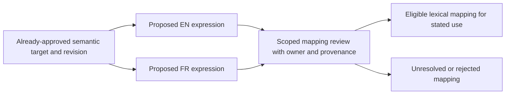
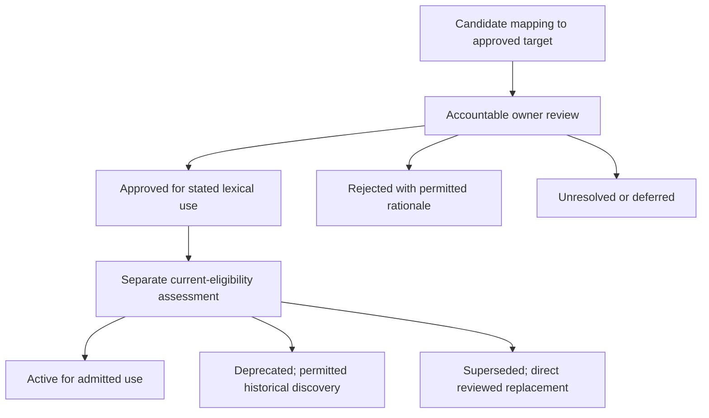
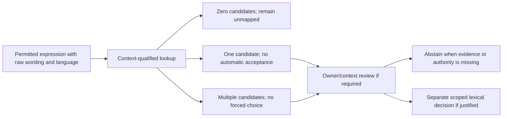
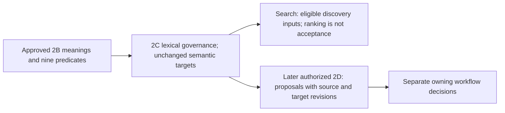
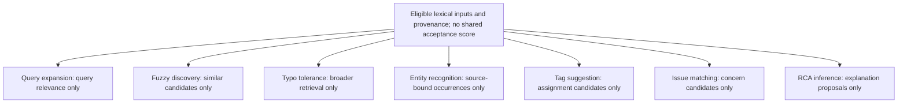

# Semantic Model 2C: Troubleshooting Lexical Model

## Document Control

| Field | Value |
| --- | --- |
| Phase | Semantic Model 2C — Troubleshooting Lexical Model |
| Date | 2026-10-08, America/Toronto |
| Planning status | READY_FOR_REVIEW; author-side architecture candidate only |
| Authority | Proposed specialization of approved Foundation and Semantic Model 2A–2B |
| Worktree | `C:\Dev\F7Hub-SemanticModel-2C` |
| Branch | `docs/semantic-model-2c-planning` |
| Base / HEAD | `3bfe27729e3a7027006b99dca4d7addfcaa5c889` |
| Authorized repository path | This document only |
| Authoring inputs | USER-approved 2C_AUTHORING_PLAN_READY plan and S0 lexical reconciliation addendum |
| Predecessors | 2A and 2B APPROVED / INTEGRATED / CLOSED under explicit USER task authority |
| Independent 2C review | NOT RUN |
| USER approval of this architecture candidate | NONE; approval of the authoring plan is distinct |
| Integration | NOT AUTHORIZED; candidate unstaged and uncommitted |
| Runtime implementation / validation | None established by this document |
| Next gate | Independent architecture review of the exact candidate |

All new 2C architectural choices are **RECOMMENDATIONS** pending independent review and USER approval. Approval of predecessor semantic meanings does not approve the lexical expressions proposed here. An “approved mapping” in normative prose means a future accountable lexical decision for an identified target, revision, scope and use; it is not a declaration that any row in this candidate has already been approved.

## Purpose

2B defines WHAT troubleshooting concepts mean and HOW relationships behave. 2C defines HOW those stable meanings may be named, localized, referred to, abbreviated, searched, disambiguated, proposed, reviewed, approved for lexical uses, deprecated and superseded. It supplies a governed lexical layer without redefining the semantic layer.

The audience is architecture reviewers and later Search, extraction, taxonomy, Diagnostics and case-workflow planners. The deliverable is an architecture contract and bounded evidence matrices, not a runtime dictionary.

## Scope and Preserved Planning Instructions

The authorized authoring sequence is INSPECT → REUSE / SPECIALIZE → DEFINE LEXICAL MODEL → RECONCILE S0 EVIDENCE → DEFINE CONSUMER BOUNDARIES → TEST CONCEPTUAL CASES → DOCUMENT → STATIC VALIDATION → PREPARE INDEPENDENT REVIEW. Preserve this planning contract and append later corrections/review history rather than erasing it.

Create one isolated worktree and branch from freshly verified integrated remote main. Author only this document. Keep required evidence outside the candidate repository. Leave canonical main, the completed 2B worktree, unrelated state, predecessor documents and source artifacts unchanged. Stop at `2C_READY_FOR_INDEPENDENT_REVIEW`; no same-session independent review, staging, commit, push, PR, merge or later phase is authorized.

Cover preferred/localized wording; aliases and reviewed equivalence; abbreviations, shorthand, variants, misspellings and legacy vendor terms; namespaces, multilingual/locale handling, collision/disambiguation, search-only normalization, provenance/privacy, candidate governance, lifecycle, Search and 2D consumption, and advisory ML/vector limits. Verify every stable 2B key and predicate. Account for all 20 S0 collision records and all nine tool ambiguity reports independently, preserving source bytes.

USER direction: keep `troubleshooting_issue_definition`; recommend **Troubleshooting Concern** as English display wording. Preserve **Troubleshooting Issue** as a candidate alternate/search expression, not an automatically preferred or approved synonym. Use EN/FR terminology with locale-aware architecture; add en-CA/fr-CA differences only when evidence supports them.

## Out of Scope

SQLite design, tables/junctions, migrations, indexes, repositories, services, APIs, DTOs, IPC implementation, runtime classes/enums, graph/vector databases, sqlite-vec, embedding models/embeddings, clustering, ML/text-mining implementation, parsers, tokenizers, extraction code, automatic tagging and Search implementation are excluded.

No GUI, DynamicHub, Mochi, Case Journal implementation, diagnostic execution, PowerShell/AHK change, provider integration, taxonomy seed, runtime lexical catalog, import, dataset revision, synthetic corpus rewrite, validator/repair tool, SemanticModel AGENTS file, 2D implementation, 2E revision or 2F reconciliation is created. Canonical numbered documentation, CURRENT_STATE, indexes, Foundation, 2A, 2B and all starter/proposal artifacts remain inputs, not write targets.

## Core Invariants

- Different wording ≠ different semantic concept.
- Similar wording ≠ semantic equivalence.
- Lexical similarity ≠ semantic authority.
- Search relevance ≠ identity acceptance.
- Translation ≠ approved equivalence.
- Machine semantic identity ≠ display label.
- Normalization ≠ identity resolution.
- Recognition ≠ canonical Entity resolution.
- Matching ≠ case acceptance.
- Similarity score ≠ approval.
- Lexical equivalence ≠ causality.
- `possible_cause_of` ≠ `accepted_cause_of`.

2C cannot merge semantic roles, create canonical semantic identity through wording, or redefine 2B meaning. Labels for Observation, Finding, Evidence, Hypothesis, accepted Cause, Result, Validation and Resolution must retain their distinctions even when ordinary technician language overlaps.

## Authorities Inspected

Authority order: explicit USER requirement → approved Foundation → approved 2A → approved 2B → existing owning-domain architecture → validated implementation evidence → S0/research/imported proposals → engineering inference. Inspection of implementation below establishes source facts, not new runtime acceptance.

| Source / reference | Inspected controlling content / limitation |
| --- | --- |
| [Root contract](../../../AGENTS.md), [ROOT](../../../ROOT.md), [documentation router](../../19_DocumentationIndex.md) | Scope, ownership, source hierarchy, progressive context and preservation |
| [Planning instructions](../AGENTS.md), [Foundation instructions](../Foundation/AGENTS.md) | Architecture lifecycle, evidence classifications, owner escalation and preserved contracts |
| [0A Master Foundation](../Foundation/0A_Master_Foundation_Architectural_Contract.md#e-data-ownership-matrix) | Producing domains own records; case owners accept assertions; Journal remains ticket-optional; no SemanticModel execution authority |
| [0B Global JSON](../Foundation/0B_Global_JSON_Contract_Interoperability_Grammar.md#identity--correlation-rules) | Owner-qualified references, context/revision, structural validation versus authorization, missing/unknown distinctions; no new wire shape |
| [0C Vocabulary](../Foundation/0C_Taxonomy_Information_Vocabulary.md#aliases--multilingual-labels) | Direct aliases, reviewed equivalence, collision review, identity versus label and multilingual fallback |
| [0C normalization](../Foundation/0C_Taxonomy_Information_Vocabulary.md#normalization-architecture), [provenance](../Foundation/0C_Taxonomy_Information_Vocabulary.md#provenance--confidence) | Originals preserved; type-specific literal rules; source/method/acceptance and confidence remain separate |
| [0D Settings](../Foundation/0D_Settings_Architecture.md#bilingual--localization-model) | Stable meaning/value versus display resources; locale/preferences do not change semantic truth |
| [0E Reconciliation](../Foundation/0E_Foundation_Architecture_Reconciliation.md#taxonomy--information-reconciliation) | Reconciled shared authority and controlled specialization; no parallel taxonomy/Settings infrastructure |
| [2A identity](2A_Semantic_Model_Foundation.md#semantic-identity), [ownership](2A_Semantic_Model_Foundation.md#ownership-matrix), [downstream](2A_Semantic_Model_Foundation.md#downstream-contracts) | Namespace-bound meanings, lexical ownership, source/use admission, Search ranking versus acceptance, sequential gates |
| [2B concepts](2B_Troubleshooting_Concept_Relationship_Model.md#concept-matrix), [predicates](2B_Troubleshooting_Concept_Relationship_Model.md#predicate-profiles), [handoff](2B_Troubleshooting_Concept_Relationship_Model.md#downstream-contracts) | Exact stable keys, typed roles, nine predicates, F-01 sole causal predicate and lexical deferrals |
| [System Search architecture](../../06_SystemArchitecture.md#31-search-architecture), [implemented Knowledge search](../../13_PythonArchitecture.md#implemented-knowledge-search-boundary--slice-015) | Search owns retrieval/ranking; existing Knowledge FTS is article-text search, not this lexical catalog |
| [TicketService](../../../Python/f7hub/services/ticket_service.py), [Ticket migration](../../../Database/Migrations/0004_tickets.sql) | FACT: PROBLEM remains Ticket-owned, not a Troubleshooting Concern identity |
| [KnowledgeService](../../../Python/f7hub/services/knowledge_service.py), [KnowledgeRepository](../../../Python/f7hub/repositories/knowledge_repository.py) | FACT: existing search and revision-checked publication remain owner workflows; lexical approval publishes nothing |
| [Taxonomy migration](../../../Database/Migrations/0002_taxonomy.sql) | FACT: existing scoped Categories and global Tags; reuse catalog ownership, no duplicate identity catalog |
| [Diagnostic result types](../../../Python/f7hub/domain/diagnostic_results.py), [Diagnostic planning](../Diagnostics/2A_Diagnostic_Domain_Registry_Architecture.md) | FACT: producer execution/result axes stay distinct. Diagnostics planning is dependency-gated material, not newly approved by this task |
| [Delivery skill](../../../.agents/skills/vertical-slice-delivery/SKILL.md) and continuity/Git/review references | Candidate identity, evidence, scope and independent review apply; runtime implementation lifecycle/test gates are NOT APPLICABLE |

S0 was inspected at `%LOCALAPPDATA%\F7Hub\CodexCheckpoints\SemanticModel-S0\S0-Reconciliation-Report.md`, especially Lexical / Bilingual Reconciliation, G05 and D09. It is external research evidence, not a competing approved semantic owner. Exact input identities and inspection metadata are in external `inspection-baseline.json`.

### Source Evidence References

| Code | Source inspected | Use |
| --- | --- | --- |
| S1 | [Lookup expressions](../../../Data/SemanticModel/Imports/Synthetic-Troubleshooting-Starter-v0.1/Packages/F7Hub_Taxonomy_Planning_v0.1/vocabulary/search_terms.json) | 277 unreviewed records, original language/wording/usages, 20 collision flags |
| S2 | [Tool ambiguity reports](../../../Data/SemanticModel/Imports/Synthetic-Troubleshooting-Starter-v0.1/Packages/F7Hub_Taxonomy_Planning_v0.1/vocabulary/tool_alias_ambiguities.json) | Nine source-local tool reports |
| S3 | [Taxonomy package](../../../Data/SemanticModel/Imports/Synthetic-Troubleshooting-Starter-v0.1/Packages/F7Hub_Taxonomy_Planning_v0.1/README.md), [review decisions](../../../Data/SemanticModel/Imports/Synthetic-Troubleshooting-Starter-v0.1/Packages/F7Hub_Taxonomy_Planning_v0.1/REVIEW_DECISIONS.md), [lookup schema](../../../Data/SemanticModel/Imports/Synthetic-Troubleshooting-Starter-v0.1/Packages/F7Hub_Taxonomy_Planning_v0.1/schemas/search_terms.schema.json) | Proposal authority, structural versus semantic validity; no import readiness |
| S4 | [Bilingual issues](../../../Data/SemanticModel/Imports/Synthetic-Troubleshooting-Starter-v0.1/Packages/F7Hub_Troubleshooting_Tools_Bilingual/issues_bilingual.csv), [tools](../../../Data/SemanticModel/Imports/Synthetic-Troubleshooting-Starter-v0.1/Packages/F7Hub_Troubleshooting_Tools_Bilingual/tools.csv), [procedures](../../../Data/SemanticModel/Imports/Synthetic-Troubleshooting-Starter-v0.1/Packages/F7Hub_Troubleshooting_Tools_Bilingual/procedures.csv) | Source-local bilingual wording and English detail gaps |
| S5 | [Priority proposals](../../../Data/SemanticModel/Proposals/priority_rca_graph.proposed.json), [illustrative RCA](../../../Data/SemanticModel/Proposals/RCA_RELATIONSHIPS_PROPOSAL.json), [anchor review](../../../Data/SemanticModel/Proposals/symptom_anchors_review.csv), [reconciliation](../../../Data/SemanticModel/Proposals/candidate_reconciliation.csv) | Unverified role/phrase examples, source lineage, bilingual scope mismatch |
| S6 | [Synthetic lifecycle research](Research/SYNTHETIC_DATA_LIFECYCLE.md) | Fictional/advisory provenance; corpus, empirical correctness and training permission remain separate |

## Verified Baseline / Git State

**FACT:** canonical root is `C:\Dev\F7Hub`; local main remains `8b92fd13dfe340563044acd41ef15c0b905243db`. Live remote main and origin/main were freshly observed at the required base `3bfe27729e3a7027006b99dca4d7addfcaa5c889`. The sole committed delta from local main is the added integrated 2B document. No canonical synchronization was attempted.

**FACT:** PR #86 is MERGED into main at that base; its body reports corrected F-01, independent rereview and USER approval. USER explicitly supplies 2A/2B approval and closure authority. The raw underlying independent-review record was not separately retrieved. Historical pending-review text preserved in integrated 2B is candidate history, not a reversal of the later disposition.

**FACT:** the preferred 2C path and branch were absent at entry. The authorized `git worktree add -b docs/semantic-model-2c-planning C:\Dev\F7Hub-SemanticModel-2C 3bfe27729e3a7027006b99dca4d7addfcaa5c889` succeeded. Entry 2C status/index were empty. Canonical status showed only protected `AutoHotkey/Troubleshooting_Sections/GuideSettings.ini`; it was observed only by Git inventory and was not individually accessed. The completed 2B worktree was recorded by read-only Git inventory and left untouched.

## Existing Lexical Evidence / Reuse Assessment

| Finding | Evidence class | Treatment / consequence |
| --- | --- | --- |
| 0C already owns aliases, multilingual identity, provenance and literal normalization | FACT | REUSE / specialize; no alternate global vocabulary |
| 2A assigns feature lexical mappings to SemanticModel and other mappings to their owners | FACT | REUSE object-specific ownership |
| 2B defers wording/aliases/search phrases and prohibits lexical role merging | FACT | Consume exact target meanings and keys |
| S1 has 277 records: en 168, fr 58, und 51, and 388 source usages | FACT | Candidate evidence, not 277 canonical expressions |
| S1 has 20 collision-review records; S2 has nine reports | FACT | Separate 20/20 and 9/9 accounting; overlap does not reduce either obligation |
| Source catalogs contain 46 issue, 26 tool and 12 procedure records | FACT | Mixed reusable-role evidence, not accepted case truth or approved lexical mapping |
| Imported lookup values use NFKC + casefold + whitespace according to S0/package | FACT about source behavior | Preserve derived research values; do not adopt algorithm as F7Hub policy |
| Source roles include issue label, possible-cause phrase, product mention and tool hint | FACT | Preserve roles; structural schema validity cannot prove target existence/equivalence |
| S5 English “device replacement” and French “phone replacement” differ in scope | FACT | Leave proposed equivalence unresolved; do not silently narrow English or broaden French |
| Missing-source wording is shared across 22 issue records | FACT | Source incompleteness metadata; exclude from approved semantic cue eligibility |
| Existing Knowledge FTS and publication, Ticket types and diagnostic producer outcomes have owners | FACT | REUSE; no Search, Ticket, Knowledge or Diagnostics implementation change |
| Three lexical roles plus qualifiers and independent assessment can cover S0 distinctions | INFERENCE | Smaller coherent model than a permanent class per phrase type |
| No blocking Foundation/2A/2B meaning change is required | INFERENCE | Feature specialization; independent review must verify this conclusion |
| Physical representation can later preserve these dimensions without one table/class per dimension | ASSUMPTION | No storage/performance feasibility claim |
| Source rights, vendor correctness, native French technical review and operational ID mappings | NOT VERIFIED | No canonicalization, runtime acceptance or license/permission inference |

## Lexical Model

**RECOMMENDATION:** separate three conceptual elements. This is not a schema, DTO, class model or installed enum.

| Element | Required meaning |
| --- | --- |
| Semantic Target | Already-approved owner-qualified concept key/reference and relevant interpreted revision; approval evidence attributable to the semantic owner |
| Expression | Permitted raw wording, actual language, optional locale, form qualifiers, source provenance and applicability |
| Mapping Assessment | Target/candidate targets, lexical role, reviewed equivalence status, scope, permitted uses, ambiguity, review disposition and current eligibility |

An expression may have one reviewed target, several candidates, ambiguity, no mapping, discovery-only use or rejected equivalence. A mapping decision is expression-to-target, not text-wide authority. The same expression can be equivalent in one reviewed scope and only a cue elsewhere; never infer transitive equivalence across scopes.

### Approved Target Prerequisite

Every approved lexical mapping requires: target key; owner/namespace; attributable target approval; target revision; expression/language; mapping role/disposition; applicability; provenance; reviewer and approving authority; allowed uses. Proposed/imported/source-local/missing/unverified targets cannot support approval. Keep them CANDIDATE or UNRESOLVED, without a fabricated canonical ID.

Refer to approved **concept roles**, not assumed production records. The 28 keys below are document-approved 2B meanings, not installed enums, database rows or universal claim identities. Concrete product/Tag/Entity references need their own owner-approved identity evidence; this task does not inspect operational database rows.

When wording exposes a genuinely missing semantic concept, record a semantic proposal for the owning phase. Do not create it in 2C merely to complete a lexical row. A changed target meaning/revision needs owner compatibility review; approval of an old expression mapping cannot silently transfer to a changed target.

### Preferred Concern Wording

**2C-D01 RECOMMENDATION:** use **Troubleshooting Concern** for the English preferred display label of `troubleshooting_issue_definition`. Its technical concept remains Troubleshooting Issue Definition; no second Concern identity is introduced. This recommendation follows approved USER authoring direction but the actual lexical candidate remains unapproved.

“Troubleshooting Issue” is a candidate alternate expression/search cue with qualified scope; neither bare “Issue” nor “Problem” automatically equates it with a case concern, Symptom Report, Category/Tag or Ticket PROBLEM. No historical key, Ticket discriminator or 2B definition is renamed.

## Lexical Roles, Forms and Equivalence

| Role | Meaning / approval boundary |
| --- | --- |
| PREFERRED LABEL | Designated display wording for an approved target, language and applicability; designation requires lexical review |
| ALTERNATE EXPRESSION / ALIAS | Alternate wording that can refer to a target; an approved exact alias requires direct, explicitly scoped mapping review |
| SEARCH CUE | Related query expression useful for discovery; approval for discovery does not claim semantic equivalence |

“Exact” means the reviewed expression and declared scope match under an explicitly admitted recognition rule. It excludes fuzzy resemblance, typo proximity, an embedding neighbor and unreviewed normalization expansion. A search-comparison form may locate that mapping; its equality alone cannot approve equivalence, resolve an Entity or accept a case. No matcher algorithm is selected.

Synonym/equivalence is a reviewed property of a mapping: wording is semantically interchangeable with the target **for the explicitly reviewed scope**. An alias need not be a synonym; an abbreviation need not be an approved alias; a cue is not equivalent by being useful. Preserve reasons and limits rather than treating “synonym” as universal equality of all possible senses.

| S0 distinction | Representation / constraint |
| --- | --- |
| Canonical namespace/key | Semantic target identity, not lexical class |
| Localized label | Expression language/locale qualification |
| Approved exact alias | Approved scoped alias mapping |
| Synonym/equivalence | Explicit reviewed mapping status with scope and evidence |
| Abbreviation / acronym | Form qualifier; can be candidate alias or discovery cue |
| Technician shorthand | Informal usage qualifier; reviewed context may narrow meaning |
| Lexical variant | Spelling/typographic/grammatical form qualifier; resemblance confers no authority |
| Legacy vendor term | Historical/product/version-qualified form; source lineage retained |
| Misspelling | Discovery-only qualifier by default; never preferred solely because frequent |
| Related query cue | SEARCH CUE |
| Ambiguous cue | Interpretation state, not canonical equivalence |

Qualifiers may coexist. Localized wording, abbreviation and legacy use are not mutually exclusive classes. Candidate, rejected, deprecated, superseded and unmapped are governance/interpretation dimensions, not lexical roles. This simplification preserves distinctions even if future storage shares a representation.

## Candidate Governance / Lifecycle

**RECOMMENDATION:** retain independent dimensions; these are conceptual values, not a universal runtime enum or mandatory central queue.

| Dimension | Values / interpretation |
| --- | --- |
| Review disposition | PROPOSED, UNDER_REVIEW, APPROVED_FOR_STATED_USE, REJECTED, UNRESOLVED/DEFERRED; reviewed records an examination, not necessarily approval |
| Current eligibility | ACTIVE for admitted use; DEPRECATED discourages new use under owner policy; SUPERSEDED names direct reviewed replacement; none implies review approval |
| Interpretation | UNMAPPED, AMBIGUOUS, REVIEWED_EQUIVALENT, DISCOVERY_ONLY; equivalence is bounded, ambiguity is valid |

Interpretation is not an exclusive enumeration: candidate resolution and equivalence assessment describe different properties. A DISCOVERY_ONLY cue may also be AMBIGUOUS. Separate scoped assessments can coexist; no single status field may discard either property.

For example, an approved discovery cue can remain ambiguous; an approved old alias can be deprecated; a proposed label cannot become approved merely because someone marks it active. Approved targets do not approve new expressions automatically. Rejected equivalence can coexist with a separately reviewed discovery-only mapping, preserving each decision's purpose and reason.

### Acceptance Authority

| Object / decision | Accountable owner | Lexical review cannot replace |
| --- | --- | --- |
| Feature-owned troubleshooting expression/mapping | Authorized SemanticModel curator, with relevant technical/language review | Approval of target semantics or case assertions |
| Category/Tag wording and mapping | Existing taxonomy/catalog steward | Tag identity/eligibility or assignment workflow |
| Product/resource/operation terminology | Resource/domain owner with contextual review | Canonical resource identity, availability, provider capability or execution permission |
| Diagnostic method/criteria wording | Diagnostics owner; semantic curator only for relevant feature associations | Method effects, criteria validity, actual result or run authorization |
| Search projection/query behavior | Search owner | Canonical mapping equivalence or source disclosure rights |
| Extracted candidate interpretation | Source/target owners and extraction contract | Entity resolution, Tag assignment, case/causal acceptance or Knowledge publication |

Originating automation may propose but cannot approve its own lexical output. Owner review must identify expression, target/revision, language/context, permitted use, sources, conflicts, reviewer, decision/time and limitations. Concrete authorization interfaces and persistence remain deferred to owner slices; no universal Semantic Reviewer supersedes them.

### Direct Mapping, Deprecation and Supersession

Aliases reference targets directly. Never require expression A → expression B → expression C to discover identity. A deprecated expression may retain a direct historical mapping for admitted discovery; a superseded expression identifies a direct reviewed replacement and its target/scope, not an unrestricted redirect.

Reject replacement cycles and unresolved chains. A label replacement with unchanged meaning preserves machine key and permitted previous wording/history. Changing meaning, splitting/merging concepts or changing product scope needs semantic owner review, not a lexical redirect. Historical wording must remain marked historical where used; it cannot silently become current terminology. Retained history/source text requires its own purpose and privacy basis.

## Multilingual / Localization Model

**RECOMMENDATION:** one language-neutral identity supports independently reviewed expressions in English and French and later additional languages. English is the proposed canonical fallback language for this document, not part of target identity. The existing approved canonical wording remains fallback until a proposed replacement is approved.

At most one currently eligible preferred label per target/language/declared applicability scope. Scope-specific labels can coexist only with explicit applicability; they are not competing global defaults. Proper/product terminology may remain untranslated with honest attribution. `und` means source language undetermined; it does not mean universal across languages or approved equivalence.

Fallback for presentation: approved exact-locale label → approved base-language label → approved canonical fallback label. Retain the actual language of displayed text and disclose missing requested-language detail as appropriate. Never relabel fallback English as approved French. If no eligible approved wording is available, present an explicit missing-label condition or known approved technical key/reference; do not invent a translation or identity.

Support en-CA/fr-CA specialization only when evidence demonstrates a meaningful expression difference. No separate Canadian terminology set or Settings key is required now. Regional fallback cannot broaden applicability or select a different semantic target. 0D owns language preference/precedence mechanics; presentation tooling, live language switching and resource storage are deferred.

Machine translation is a candidate source, never equivalence authority. Plausible French and English labels still need role/product/context review. Missing French causes, actions, diagnostics or validation detail remains explicit or uses admitted fallback; no duplicated concept fills the gap. Mixed French/English technician text and bilingual shorthand can yield multiple candidates with source language preserved; no forced monolingual interpretation.

## Lexical Namespace and Normalization

Reuse 2A's lexical namespace: a boundary for interpretation of wording, language and context. It differs from module owner, Category scope, subject area, product/service reference, analytical group and source artifact namespace. No global namespace registry or physical namespace syntax is selected.

In this document, stable keys are qualified by the approved 2B role vocabulary/document and actual owner responsibilities. “Troubleshooting role vocabulary” is an interpretation scope, not an installed registry key. Product/resource namespaces remain with their owners. S1/S2 source IDs are artifact-qualified proposals, never canonical target references by spelling. Cross-namespace equivalence requires explicit reviewed target mapping.

**RECOMMENDATION:** a versioned lookup profile can conceptually describe allowed case, whitespace, punctuation, Unicode, accent and compatible-text comparison categories, language/context applicability, preserved source form, transformation rationale, collision behavior and change impact. Profile identity/revision must be attributable; exact syntax, algorithms and libraries are deferred.

Its sole purpose is SEARCH COMPARISON / DISCOVERY. Preserve permitted raw wording and actual language separately; derived forms never overwrite originals. Equivalent normalized forms may still denote different meanings. Neither equality nor normalization success establishes semantic, Tag, causal or concrete Entity identity. No automatic NFKC, casefold, accent removal or punctuation stripping is adopted from S1.

Commands, paths, URLs, emails, error codes and external IDs retain owning type-specific rules; no generic lexical fold is an Entity resolver. Source offsets, if later needed, must bind snapshot/coordinate units and cannot reuse raw offsets after transformation without a reviewed mapping; exact span handling belongs to 2D. Profile changes require collision/relevance review, not automatic retroactive mapping approval.

## Ambiguity / Collision Model

A lookup may return ZERO, ONE or MULTIPLE candidates. None grants semantic acceptance; one candidate can still lack approved mapping/context. Multiple candidates and abstention are valid outcomes. Preserve incompatible roles and scopes rather than forcing a record-completion choice.

Collision review compares keys, labels, aliases and derived lookup forms within declared language/namespace/profile and product/version/time context. Exact target identity, raw expression, equivalent mapping, related cue and case interpretation remain distinct match explanations. Source presence, highest similarity/embedding score, source frequency, imported ordering, preferred product or most-common historical mapping cannot approve equivalence.

Use explicit contextual evidence and accountable owner review to narrow candidate relevance. Missing context, stale target revision, inadequate translation evidence or unapproved resource identity leaves the mapping unresolved. A permitted search result can explain why a candidate was returned without exposing inaccessible source text or asserting a case diagnosis. A shared product mention across concerns is source reuse, not necessarily a defective duplicate term.

### Collision Rules

| Rule | Architecture disposition |
| --- | --- |
| C1 — Shared explanatory cue | Keep each source use/concern separate; possible-cause phrasing supplies no accepted causality or concern merge |
| C2 — Source incompleteness | Reject as approved semantic cue; preserve missing-source metadata/lineage without converting it to a cause |
| C3 — Repeated resource/topic reference | Preserve separate concerns and owner-qualified resource candidates; no concrete Entity resolution |
| C4 — Product versus tool-label use | Require typed/contextual owner mapping; matching names/roles are insufficient for equivalence |
| C5 — Broad versus narrow tool hint | Preserve product/client/portal/version alternatives and abstain where context/approval is missing |

## S0 20-Collision Reconciliation

**FACT:** S1 has exactly 20 records with `collision_review=true`. Rows below use exact source wording/language and source usage roles. `U` means UNRESOLVED canonical target/equivalence; no approved mapping asserted. All source-local references stay proposals. Evidence limitation for every row: source usage/collision flag is not target approval, vendor validation, empirical causality or source-rights verification.

| Case | S1 reference: language / original wording | Category / source role and context | Applicable rule / architectural outcome | Mapping disposition / evidence limitation |
| --- | --- | --- | --- | --- |
| L01 | en / cache-related issues | Shared possible_cause_phrase; WEB-002, WEB-004 | C1; retain both concern uses, no issue merge/accepted cause | U; broad mechanism wording, no approved cause target |
| L02 | en / extension conflicts | Shared possible_cause_phrase; WEB-001, WEB-002, WEB-004 | C1; distinct applicable hypotheses remain possible, not accepted | U; no technical mechanism/equivalence approval |
| L03 | en / not specified in source | Missing-source possible_cause_phrase; 22 refs listed below | C2; ineligible semantic cue, retain source incompleteness | REJECT_EQUIVALENCE; no cause/target exists by placeholder wording |
| L04 | und / Entra ID | product_mention IAM/SEC records; tool hint TOOL-003 | C5; topic/product versus admin portal stays separate | U; context/resource approval absent |
| L05 | und / Exchange Online | product_mention across EXO/SEC concerns | C3; common product reference does not merge concerns | U; product identity mapping not approved here |
| L06 | und / Google Chrome | product_mention WEB concerns; tool_label TOOL-016 | C4; candidate typed product/application reference | U; source name equality does not approve target |
| L07 | und / Microsoft 365 | product_mention IAM/SEC concerns; tool hint TOOL-007 | C5; suite/service context differs from service-health surface | U; no equivalent tool target established |
| L08 | und / Microsoft Authenticator | product_mention IAM/SEC concerns; tool_label TOOL-012 | C4; app/topic use needs typed context; distinguish MFA | U; application mapping unapproved |
| L09 | und / Microsoft Defender | product_mention EXO/SEC concerns; tool hint TOOL-004 | C5; suite/product family differs from portal | U; no product/version/portal equivalence approval |
| L10 | und / Microsoft Edge | product_mention WEB concerns; tool_label TOOL-015 | C4; preserve application/topic and concern distinctions | U; resource target unverified |
| L11 | und / Microsoft Teams | product_mention TMS concerns; tool_label TOOL-010 | C4; preserve service/client/topic context | U; no owner-approved target mapping |
| L12 | und / Mozilla Firefox | product_mention WEB concerns; tool_label TOOL-017 | C4; typed application/topic review needed | U; shared label alone insufficient |
| L13 | und / OneDrive | product_mention OD concerns; tool hint TOOL-011 | C5; service/product versus sync-client scope | U; broad hint does not select client |
| L14 | und / Outlook | product_mention EXO concerns; tool hint TOOL-008 | C5; client/web/mail context stays qualified | U; no automatic desktop target |
| L15 | und / Outlook on the web | product_mention EXO-002; tool_label TOOL-009 | C4; typed web surface/context requires review | U; source-local tool is not canonical approval |
| L16 | und / Printer | product_mention PRN-001, PRN-002 | C3; generic resource class, distinct concerns, no device resolution | U; no concrete printer identity |
| L17 | und / VPN client | product_mention VPN-001, VPN-002 | C3; unspecified resource reference, not a known installed client | U; no guessed product/instance |
| L18 | und / Windows | product_mention multiple concerns; tool hints TOOL-013/014 | C5; broad platform does not select Windows 10/11 | U; version context and approval absent |
| L19 | und / Windows 10 | product_mention IAM/WIN concerns; tool_label TOOL-013 | C4; retain version qualification and separate concerns | U; source-local platform mapping unapproved |
| L20 | und / Windows 11 | product_mention IAM/WIN concerns; tool_label TOOL-014 | C4; retain version qualification and separate concerns | U; source-local platform mapping unapproved |

L03 refs: EXO-004, EXO-005, EXO-009, OD-004, PRN-001, PRN-002, SEC-001, SEC-002, SEC-003, SEC-004, SEC-005, TMS-001, TMS-002, VPN-001, VPN-002, WIN-001, WIN-002, WIN-003, WIN-004, WIN-005, WIN-006, WIN-007. Missing information is not a common causal explanation.

Coverage by architecture category: C1 2; C2 1; C3 3; C4 8; C5 6. Total 20. These are documentation dispositions, not source repairs. Nineteen candidate identity mappings remain unresolved; L03 rejects semantic-cue equivalence while retaining missing-source lineage. Operational mappings, technical correctness and bilingual equivalence remain NOT VERIFIED.

## Nine Tool Ambiguity Reports

S2 contains nine reports; each source hint has language `und` in the corresponding source-tool search-hint material. These rows account for reports independently of overlapping S1 cases. Each outcome is candidate discovery plus contextual owner review/abstention, not canonical equivalence or tool availability.

| Case | S2 source ref / original hint | Proposed source-local tool | Applicable rule / architectural outcome | Mapping disposition / limitation |
| --- | --- | --- | --- | --- |
| T01 | TOOL-003 / Entra ID | Microsoft Entra admin center | C5; product/directory concept differs from administrative portal | UNRESOLVED; tool presence grants no target approval/access |
| T02 | TOOL-004 / Microsoft Defender | Microsoft Defender portal | C5; product family differs from portal | UNRESOLVED; product/version scope unverified |
| T03 | TOOL-007 / Microsoft 365 | Microsoft 365 service health | C5; suite differs from service-health information surface | UNRESOLVED; no capability/identity approval |
| T04 | TOOL-008 / Outlook | Outlook desktop | C5; broad term does not select desktop versus web | UNRESOLVED; client scope unknown |
| T05 | TOOL-011 / OneDrive | OneDrive sync client | C5; service/product term does not select installed client | UNRESOLVED; no concrete client identity |
| T06 | TOOL-012 / MFA | Microsoft Authenticator | C5; authentication method/capability differs from named app | UNRESOLVED; not an approved exact alias |
| T07 | TOOL-013 / Windows | Windows 10 | C5; retain alternative versions | UNRESOLVED; no default version selection |
| T08 | TOOL-014 / Windows | Windows 11 | C5; retain alternative versions | UNRESOLVED; ranking cannot choose identity |
| T09 | TOOL-018 / VPN | VPN client (unspecified) | C5; capability/topic does not resolve unspecified resource | UNRESOLVED; no invented vendor/client/operation |

No report supplies an already-approved canonical target mapping. All nine remain unresolved for equivalence; lexical relevance can be considered by later separately reviewed discovery profiles. No source artifact is canonicalized, repaired or imported.

## Stable Target Coverage / Canonical Candidate Matrix

Fresh parsing of integrated 2B's Concept Matrix found **28 unique stable keys**. Exact comparison is part of external static validation; this count is not accepted merely because the plan supplied it.

Every row inherits these explicit evidence columns:

- **B1 target approval evidence:** explicit USER statement that integrated 2B is APPROVED / INTEGRATED / CLOSED; [PR #86](https://github.com/JDecelles1990/F7Hub/pull/86) corroborates integration and reports approval, but is not a newly retrieved raw review report.
- **RB target revision:** approved 2B document at base `3bfe27729e3a7027006b99dca4d7addfcaa5c889`, Git blob `52209fb9e8b3329c1b4fa3285bdc454448baf473`. Concept-specific subsections below bind interpreted meaning; no new physical concept revision scheme is created.
- **Namespace qualification:** 2B troubleshooting role vocabulary, document-qualified semantic keys, with actual owner shown; runtime namespace identifiers remain deferred. This does not transfer case/domain records to SemanticModel.
- **Expression provenance/disposition:** new 2C editorial proposals grounded in B1/RB definitions and USER direction; all EN/FR wording is CANDIDATE / RECOMMENDED, not approved lexical material. French wording, including proposed phrases below, has **LANGUAGE_REVIEW_UNRESOLVED**. No translation is asserted equivalent here.
- **Evidence limitation:** architecture approval of the target is established by task authority; no operational record, actual case acceptance, installed enum, native language review or runtime catalog is established.

| Semantic key | Owner / namespace responsibility | Role and definition/occurrence distinction | 2B authority | Approval / revision | Proposed English preferred label | Proposed French label / language review | Alternate expression candidate | Ambiguity risk / mapping disposition |
| --- | --- | --- | --- | --- | --- | --- | --- | --- |
| `troubleshooting_issue_definition` | SemanticModel definition; 0C shared meaning | Reusable recurring concern; case concern is separate | Issue vs Symptom | B1 / RB | Troubleshooting Concern | Préoccupation de dépannage; LANGUAGE_REVIEW_UNRESOLVED | Troubleshooting Issue; qualified cue/alias candidate | Issue/Problem/Ticket/symptom collapse; CANDIDATE |
| `symptom_definition` | SemanticModel definition under 0C | Reusable recognizable experience, not actual report | Issue vs Symptom | B1 / RB | Symptom Definition | Définition de symptôme; LANGUAGE_REVIEW_UNRESOLVED | None justified | Symptom versus cause/condition; CANDIDATE |
| `symptom_report` | Case/Journal or existing Ticket activity | Attributable occurrence/report; definition optional | Issue vs Symptom | B1 / RB | Symptom Report | Signalement de symptôme; LANGUAGE_REVIEW_UNRESOLVED | Symptom occurrence; qualified candidate | Report not verified technical truth; CANDIDATE |
| `observation` | Producer; case relevance separate | Source statement/value/event with method/time/context | Observation / Finding / Evidence | B1 / RB | Observation | Observation; LANGUAGE_REVIEW_UNRESOLVED | None justified | Same spelling cannot turn collection into interpretation; CANDIDATE |
| `finding` | Producer/Diagnostics or investigative owner | Criteria-supported interpretation of inputs | Observation / Finding / Evidence | B1 / RB | Finding | Constat; LANGUAGE_REVIEW_UNRESOLVED | None justified | Raw statement versus interpreted conclusion; CANDIDATE |
| `evidence` | Source plus case/claim owner | Role of admitted material associated with named claim | Observation / Finding / Evidence | B1 / RB | Evidence | Élément de preuve; LANGUAGE_REVIEW_UNRESOLVED | Supporting material; cue candidate only | “Preuve” must not imply conclusive proof; CANDIDATE |
| `claim` | Claim-owning domain | Scoped proposition/profile; no universal claim record | Claim Model | B1 / RB | Claim | Assertion; LANGUAGE_REVIEW_UNRESOLVED | Scoped assertion; qualified candidate | Assertion versus accepted fact; CANDIDATE |
| `cause_definition` | SemanticModel definition; technical owner input | Reusable possible explanatory mechanism, not case truth | Hypothesis Model / State and Disposition | B1 / RB | Cause Definition | Définition de cause; LANGUAGE_REVIEW_UNRESOLVED | None justified | Definition not accepted cause; CANDIDATE |
| `cause_hypothesis` | Case/Journal | Case-scoped possible explanation; may reference definition | Hypothesis Model / State and Disposition | B1 / RB | Cause Hypothesis | Hypothèse causale; LANGUAGE_REVIEW_UNRESOLVED | Possible explanation; cue candidate | Supported not accepted; CANDIDATE |
| `accepted_causal_claim` | Case/Journal | Owner-accepted scoped causal assertion; separate role | Causal Claim / Root Cause | B1 / RB | Accepted Causal Claim | Assertion causale acceptée; LANGUAGE_REVIEW_UNRESOLVED | None justified | Acceptance not universal proof; CANDIDATE |
| `contributing_cause` | Case/Journal | CONTRIBUTING_CAUSE role on accepted claim, not new edge | Causal Claim / Root Cause | B1 / RB | Contributing Cause | Cause contributive; LANGUAGE_REVIEW_UNRESOLVED | None justified | Co-occurrence not accepted contribution; CANDIDATE |
| `root_cause` | Case/Journal; outside taxonomy | ROOT_CAUSE designation at declared depth/scope | Causal Claim / Root Cause | B1 / RB | Root Cause | Cause racine; LANGUAGE_REVIEW_UNRESOLVED | None justified | Tag/sole ultimate cause/global truth; CANDIDATE |
| `diagnostic_step_definition` | Diagnostics method owner | Reusable investigative method; no run | Diagnostic Semantics | B1 / RB | Diagnostic Step Definition | Définition d’étape diagnostique; LANGUAGE_REVIEW_UNRESOLVED | None justified | Method definition versus attempt; CANDIDATE |
| `diagnostic_attempt` | Diagnostics invocation/execution owner; case references | Actual attempted use; may be denied/unavailable | Diagnostic Semantics | B1 / RB | Diagnostic Attempt | Tentative diagnostique; LANGUAGE_REVIEW_UNRESOLVED | None justified | Attempt does not prove completed collection; CANDIDATE |
| `check` | Diagnostics | Inspection/collection method role; overlaps Test | Diagnostic Semantics | B1 / RB | Check | Contrôle; LANGUAGE_REVIEW_UNRESOLVED | None justified | “Check” does not guarantee read-only; CANDIDATE |
| `test` | Diagnostics | Discrimination/verification method role; overlaps Check | Diagnostic Semantics | B1 / RB | Test | Test; LANGUAGE_REVIEW_UNRESOLVED | None justified | Test not causal confirmation; CANDIDATE |
| `action_definition` | Action/operation owner; semantic suitability | Reusable description of possible work | Action / Intervention / Remediation | B1 / RB | Action Definition | Définition d’action; LANGUAGE_REVIEW_UNRESOLVED | None justified | Description not operational Action/permission; CANDIDATE |
| `action_attempt` | Execution/action owner; case references | Actual owner-controlled attempt, not proposal | Action / Intervention / Remediation | B1 / RB | Action Attempt | Tentative d’action; LANGUAGE_REVIEW_UNRESOLVED | None justified | Attempt/completion/resolution differ; CANDIDATE |
| `intervention` | Action/Diagnostics owner | State-change intent/effect role | Action / Intervention / Remediation | B1 / RB | Intervention | Intervention; LANGUAGE_REVIEW_UNRESOLVED | None justified | Investigation can also change state; CANDIDATE |
| `remediation` | Action owner/case | Intervention intended to address impact/cause/concern | Action / Intervention / Remediation | B1 / RB | Remediation | Mesure corrective; LANGUAGE_REVIEW_UNRESOLVED | None justified | Intent does not guarantee cure; CANDIDATE |
| `recommendation` | Proposing/advisory feature; adopting workflow | Advice/guidance proposal, not authorized attempt | Action / Intervention / Remediation | B1 / RB | Recommendation | Recommandation; LANGUAGE_REVIEW_UNRESOLVED | None justified | Adoption not invocation; CANDIDATE |
| `result` | Producer/Diagnostics/execution | Immediate producer outcome/profile, no generic definition mirror | Result / Validation / Resolution | B1 / RB | Result | Résultat; LANGUAGE_REVIEW_UNRESOLVED | None justified | Outcome not validation/resolution; CANDIDATE |
| `validation_definition` | Criteria/Diagnostics owner; semantic relevance | Reusable expected conditions/method/criteria/window | Result / Validation / Resolution | B1 / RB | Validation Definition | Définition de validation; LANGUAGE_REVIEW_UNRESOLVED | None justified | Criteria not completed evaluation; CANDIDATE |
| `validation_assertion` | Producer/criteria owner plus case workflow | Actual evaluation/assertion of stated conditions | Result / Validation / Resolution | B1 / RB | Validation Assertion | Assertion de validation; LANGUAGE_REVIEW_UNRESOLVED | Validation; qualified candidate | PASS not cause proof; CANDIDATE |
| `resolution` | Case/Journal or existing Ticket responsibility | Accepted scoped treatment; separate Ticket closure | Result / Validation / Resolution | B1 / RB | Resolution | Résolution; LANGUAGE_REVIEW_UNRESOLVED | None justified | User confirmation/result not sufficient by label; CANDIDATE |
| `mitigation` | Action/case owner | Reduced-impact outcome/coverage role | Result / Validation / Resolution | B1 / RB | Mitigation | Atténuation; LANGUAGE_REVIEW_UNRESOLVED | None justified | Partial impact reduction not whole resolution; CANDIDATE |
| `recurrence` | Case/workflow owner | New report/assertion with prior context; no identical cause assumed | Result / Validation / Resolution | B1 / RB | Recurrence | Réapparition; LANGUAGE_REVIEW_UNRESOLVED | None justified | Similar wording not same cause; CANDIDATE |
| `escalation` | DynamicHub/case/Ticket workflow | Request/decision to seek or transfer work; receipt separate | Result / Validation / Resolution | B1 / RB | Escalation | Escalade; LANGUAGE_REVIEW_UNRESOLVED | None justified | Requested handoff not receiving-owner action; CANDIDATE |

No hundreds of source entries are filled. This matrix covers role vocabulary; individual domain-specific concern/cause/product identities require their own already-approved targets before any mapping approval. Every alternate above is proposed only; similarity in this table installs no synonym.

## Predicate Lexical Matrix / 2B Compatibility

The nine primary rows inherit B1/RB approval and revision evidence, P0–P8 requirements, original acceptance owners and provenance obligations. New wording provenance is 2C editorial interpretation of the cited profile; each row has lexical review disposition CANDIDATE, French LANGUAGE_REVIEW_UNRESOLVED. All nine remain directed, non-symmetric and non-transitive. Definition associations do not become case facts through wording. The table is a lexical view of the approved profiles, not a replacement profile specification.

| Stable machine key / 2B profile | Endpoints / level / direction | Proposed English forward wording | Proposed French wording / review | Optional inverse DISPLAY wording | Modal qualifier / prohibited alternatives | Provenance / disposition / limitation |
| --- | --- | --- | --- | --- | --- | --- |
| `has_symptom` / P01 | Issue Definition → Symptom Definition; definition | has associated symptom | a un symptôme associé; LANGUAGE_REVIEW_UNRESOLVED | symptom associated with recurring concern | Recurring association; not unique diagnosis or “causes” | B1/RB + P01; CANDIDATE; no current-case mapping |
| `possible_cause_of` / P02 | Cause Definition → explicit Symptom/Issue Definition; definition | is a possible cause of | est une cause possible de; LANGUAGE_REVIEW_UNRESOLVED | has a possible cause | POSSIBLE under conditions; not confirmed/accepted cause or probability | B1/RB + P02; CANDIDATE; target role must remain explicit |
| `investigated_by` / P03 | Explicit Symptom/Issue/Cause Definition → Diagnostic Step Definition; definition | can be investigated using | peut être examiné au moyen de; LANGUAGE_REVIEW_UNRESOLVED | method relevant to investigation of | Method relevance/discrimination; not run, “confirmed by” or completed finding | B1/RB + P03; CANDIDATE; Diagnostics criteria/effects retained |
| `supports_claim` / P04 | Admitted source/Observation/Finding/Result → scoped Claim; instance | supports this claim within scope | appuie cette assertion dans le périmètre déclaré; LANGUAGE_REVIEW_UNRESOLVED | claim has supporting material | Scoped support; not proves/accepts | B1/RB + P04; CANDIDATE; dependence/limits retained |
| `contradicts_claim` / P05 | Same admitted material union → scoped Claim; instance | contradicts this claim within scope | contredit cette assertion dans le périmètre déclaré; LANGUAGE_REVIEW_UNRESOLVED | claim has contradictory material | Scoped conflict; not universally disproves or automatically rejects | B1/RB + P05; CANDIDATE; failed collection not contradiction |
| `informs_claim` / P06 | Same admitted material union → scoped Claim; instance | informs this claim without resolving support | apporte du contexte à cette assertion sans trancher son appui; LANGUAGE_REVIEW_UNRESOLVED | claim has relevant unresolved context | Relevant unresolved direction; not negative result/arbitrary link | B1/RB + P06; CANDIDATE; no midpoint score |
| `accepted_cause_of` / P07 | Accepted case causal Claim → explicit bound case concern/Symptom Occurrence; case instance | is accepted as a cause of this scoped concern | est accepté comme cause de cette préoccupation circonscrite; LANGUAGE_REVIEW_UNRESOLVED | target has an owner-accepted explanation | ACCEPTED by case owner; not sole/complete/global cause, automatic Root Cause or closure | B1/RB + P07; CANDIDATE; separate ROOT_CAUSE/CONTRIBUTING_CAUSE designation |
| `candidate_remediation_for` / P08 | Remediation-intent Action Definition → explicit Cause/Issue Definition; definition | is a candidate remediation for | est une mesure corrective candidate pour; LANGUAGE_REVIEW_UNRESOLVED | has a candidate remediation | CANDIDATE suitability; not resolves, guarantees cure or authorizes execution | B1/RB + P08; CANDIDATE; independent action-owner policy |
| `validation_method_for` / P09 | Validation Definition → Action Definition with stated effect/conditions; definition | is a relevant validation method for | est une méthode de validation pertinente pour; LANGUAGE_REVIEW_UNRESOLVED | action has a relevant validation method | RELEVANT criteria-bearing method; not required, performed or passed | B1/RB + P09; CANDIDATE; owner criteria/coverage retained |

Inverse wording is presentation/read perspective only. It preserves the original semantic direction and introduces no writable inverse key. P0–P8 provenance, applicability, cardinality, authority, uncertainty, history/deletion, privacy and misuse prohibitions remain controlling.

### F-01 Preservation

`accepted_cause_of` is the sole accepted case-level causal predicate. `ROOT_CAUSE` and `CONTRIBUTING_CAUSE` are orthogonal owner-designated roles on the accepted causal claim. Do not restore `contributes_to` as an active predicate or machine alias. An imported phrase “contributes to” can remain historical/source text or a discovery cue with explicit limits; it cannot encode acceptance, infer the role or introduce a second edge. Role display wording must state accepted scope when applicable. Multiple accepted causes, unknown cause, rejected/reopened hypotheses and resolution without Root Cause remain representable exactly as 2B requires.

## Legacy Terminology

**RECOMMENDATION:** legacy vendor wording is a historical/product/version-qualified expression, not an automatic new concept or unconditional alias. Record original name, source revision/date if known, interpreted product/scope, proposed target, evidence of unchanged meaning and permitted current/historical uses.

A rename may preserve one already-approved owner identity only when the owner confirms same meaning/scope. A product consolidation, split, licensing/service-scope change or unresolved historical term cannot be treated as a rename solely from resemblance. O365/Office 365/Microsoft 365 are source-aware review examples from 0C, not equivalence approved here; no current vendor-history claim is made. M365 may be considered under its approved owner search mapping where one exists, without inventing one from the source artifact.

Deprecated wording may remain discoverable when admitted, with historical annotation. Preferred-label churn requires rationale and compatibility review; it changes presentation, not keys or old assertions. Actual vendor facts/versions need current official evidence at the owning future decision; no vendor research, canonical rename or provider integration occurs here.

## Provenance / Privacy and Imported Candidates

Preserve origin, source owner/artifact namespace, source record/field, relevant revision/snapshot, production method, proposer, reviewer, decision purpose/scope/time, target approval and limitations. Reuse owner-held metadata/references when sufficient; no universal provenance store is introduced. Source presence and JSON/CSV validity establish neither rights nor approved target mapping.

Keep import, synthetic and AI origin after acceptance; acceptance attribution is separate. Optional uncertainty is task/method-defined, not a universal score or synthetic frequency probability. Duplicate translations/copies remain dependent source material, not independent corroboration.

Source admission precedes processing. Processing, retention, indexing, disclosure, Analytics and generalization each need an appropriate owner/purpose/sensitivity gate; local visibility or lexical approval grants none automatically. Expressions, context, target links and review reasons may reveal sensitive facts. Minimize metadata; no credential-bearing expression or unrestricted customer/provider text in normal lexical material, logs or examples. Use synthetic examples and safe failure feedback without echoing rejected secret content.

Expired/deleted/redacted/inaccessible or revised sources require eligibility reassessment of dependent current uses. Permitted minimal history must not imply raw source availability, replayability or fresh verification. Actual retention/redaction/security mechanisms and employer policy are NOT VERIFIED/deferred; no secret-management boundary is selected.

S1–S6 source IDs, arbitrary source roles, proposed keys and bilingual labels remain candidate evidence. Do not rewrite source classifications, repair validators, bulk map Tags/Categories, import records or revise corpus. Fictional material may illustrate architecture, but never becomes operational evidence, empirical success probability, real customer history or automatic reusable Knowledge/training permission. Exact target approval is required even when a synthetic phrase looks correct.

## Search Boundary

Search may later consume admitted current preferred labels, approved aliases/equivalents, reviewed discovery cues (including qualified abbreviations, shorthand, legacy terms and misspellings), comparison forms and namespace/context. It owns retrieval, ranking, result ordering and query strategy, not equivalence/identity acceptance. Unknown/unapproved mappings may appear only in explicitly identified candidate/review contexts, not as approved operational expansion rules.

Match explanations distinguish approved direct lexical mapping, related cue, typo/fuzzy discovery and unresolved alternatives, preserving actual language and scope. A query hit accepts no case fact, Entity, Tag assignment, causal claim or Knowledge publication. Search/index eligibility and source access are independent of lexical approval; references cannot reveal inaccessible source content.

Existing article-text FTS, filters, ordering, query safety and publication services remain unchanged. This document designs no tokenizer, ranking formula, engine, query API or index. Local lookup/review remains LOCAL_REQUIRED under 2A; optional online suggestions are ONLINE_OPTIONAL and cannot replace or gate local meaning/reference access.

## Seven Downstream Mechanisms

These are seven distinct consumers/tasks, not an implemented pipeline, seven new modules or transferable confidence scales. Each retains its own task scope, source admission, provenance, target/context/revision, uncertainty interpretation and accountable owner. Do not average/transfer a score or match disposition between mechanisms without a separately approved task-specific basis; even a valid basis supplies no stronger authority.

| Mechanism | Lexical inputs / scope | Output / uncertainty | Authority boundary / owner |
| --- | --- | --- | --- |
| QUERY EXPANSION | Eligible labels/aliases/cues and declared query context | Proposed additional expressions; expansion relevance distinct from equivalence | Search owns query strategy; expansion assigns/accepts nothing |
| FUZZY DISCOVERY | Admitted expressions and context-limited comparison | Similar candidate meanings; method-specific similarity/ambiguity | Search/discovery owner; similarity is not identity approval |
| TYPO TOLERANCE | Reviewed misspelling/variant cues and lookup profile | Broadened retrieval; spelling proximity can yield several targets | Search owner; no approved alias or preferred display from proximity |
| ENTITY RECOGNITION | Owning type profiles and permitted source wording; lexical cues only where relevant | Typed source-bound occurrence proposals; syntax/profile uncertainty distinct from reference identity | Source/type owner, later 2D; canonical resolver/workflow separately accepts existing Entity links |
| TAG SUGGESTION | Existing eligible Tag references and governed lexical cues | Candidate annotation with task-specific rationale/uncertainty | Taxonomy retains identity; target-domain workflow owns assignment; no automatic Tag creation/assignment |
| ISSUE MATCHING | Approved Troubleshooting Concern targets/revisions, eligible expressions and case context | Relevant concern candidates; match relevance not case truth | Semantic target owner plus case workflow; no case/cause acceptance |
| RCA INFERENCE | 2B meanings, admitted case evidence and lexical proposals | Possible explanations/relationships with causal uncertainty and contradictions | Accountable case owner accepts cause/role under 2B; lexical/vector match accepts none |

For example, exact abbreviation recognition cannot become “high-confidence RCA”; fuzzy relevance cannot become Entity resolution; a high-ranked issue match cannot become a Tag assignment. Confidence belongs to the producing task/method, and approval belongs to the accountable object owner.

## ML / Vector Boundary

Future text mining, embeddings/vector similarity, clustering or machine translation may propose terms, candidate mappings, translations and collision review input. They remain advisory with source/method attribution, scope, relevant revision, uncertainty and abstention. Similarity/frequency/co-occurrence cannot approve lexical equivalence, create identity, establish causal truth, authorize execution or publish Knowledge.

No engine, model, provider, algorithm, threshold, vector storage, benchmark or training pipeline is selected. Synthetic counts and translated copies cannot imply empirical probabilities or independent evidence. Optional model unavailability leaves local lookup and accountable review possible, without a stronger automatic acceptance fallback.

## 2D Handoff / Later Gates

The exact conceptual handoff is a set of eligibility and interpretation obligations, not an API, DTO or wire shape.

| Handoff content | Required interpretation by 2D |
| --- | --- |
| Stable target key, owner/namespace, approval evidence and target revision | Consume an already-approved meaning; unavailable/proposed target prevents approved mapping use |
| Raw expression, actual language, optional locale and form qualifiers | Preserve source wording/attribution; fallback is not translated evidence |
| Mapping role and reviewed equivalence | Distinguish label, exact scoped alias and discovery cue; cue cannot become equivalence |
| Permitted uses and applicability | Enforce declared product/version/context/time and source-use limits; one use does not admit another |
| Ambiguity/candidate targets | Preserve zero/one/multiple/unmapped outcomes; abstain where context or authority is missing |
| Namespace and lookup-profile identity/revision | Search comparison only; no Entity resolution/semantic acceptance from normalized equality |
| Provenance, review disposition and current eligibility | Retain origin, reviewer and decision scope; do not treat deprecated/superseded or stale mappings as silently active |
| Candidate/unresolved material | Proposal/review context only; no laundering into approved extraction rules |
| Source/target change or missing required evidence | Make dependent interpretation unavailable/review-required under owner policy; preserve permitted history |

2D must admit source processing before extraction and recheck source/target revision/applicability at owner review. It may propose recognized expressions, typed occurrences, concern matches and interpretation/relationship candidates. It cannot automatically approve semantic identity, resolve ambiguous targets or concrete Entities, assign Tags, accept case claims, Root Cause/contributing cause, create canonical terminology, execute work or publish Knowledge. A reviewed lexical mapping is only one input to those stronger owner decisions.

Span/snapshot representation, recognition/tokenization, parser implementation, source interfaces, task-specific thresholds and physical contracts remain 2D/owner design questions. 2C does not fill them with speculative DTOs. If a new concept or changed predecessor meaning is needed, submit a separate owning-semantic proposal; never accept it through an extraction or lexical shortcut.

Required order remains **2A APPROVED + INTEGRATED → 2B → 2C → 2D → 2E → 2F**. Each authoritative phase consumes reviewed, approved and integrated predecessors and needs separate USER task authorization. 2E owns later corpus architecture/revision; 2F owns cross-phase reconciliation. Neither begins here. Architecture approval never means runtime implementation readiness.

## 0C Compatibility / Escalations

| Owning contract | Compatibility conclusion / 2C specialization | Escalation trigger |
| --- | --- | --- |
| 0C identity, labels and aliases | ALIGNED; approved target first, direct scoped mapping, no translation/normalization-created key | Change shared identity/alias meaning or invent global synonym authority |
| 0C Category/Tag/Entity semantics | ALIGNED; lexical references preserve topic, literal occurrence and domain records | Root Cause as Tag, cue-as-Tag, automatic Entity creation or duplicate catalog |
| 0C normalization/provenance/confidence | SPECIALIZED_COMPATIBLY; search-only comparison and independent mapping review | Global literal folding or confidence/provenance becoming acceptance/permission |
| 0A ownership/security/offline | ALIGNED; object owners accept, source gates retained, local lookup/review | Transfer domain records/decisions, weaken privacy or require remote semantic authority |
| 0B interoperability | ALIGNED; conceptual references only; no new envelope/API/DTO | Change identity/version/missing semantics or cross-language contract |
| 0D preferences/localization | ALIGNED; preferred language is presentation, not truth | Settings redefine meaning/equivalence or create parallel locale/default authority |
| 0E reconciliation | ALIGNED; one owning contract per concern | Patch an upstream conflict locally or treat deferred implementation as a Foundation gap |
| 2A/2B meanings | SPECIALIZED_COMPATIBLY; wording overlays existing roles/profiles | Add/merge concepts, alter endpoints/modal qualifiers, revive contributes_to |

No blocking owning-contract conflict was identified by author inspection. These conclusions are INFERENCES requiring independent review. For a genuine conflict: stop the affected local decision → RECORD GAP with exact current/proposed meaning and impact → IDENTIFY FOUNDATION/SEMANTIC OWNER → REQUEST FOUNDATION/OWNER REVIEW IF REQUIRED. Continue only unrelated work that does not assume the disputed decision. No upstream amendment is authorized.

## Decision Register

All statuses below are RECOMMENDED. USER-approved authoring direction for D01/D10 is recorded as input, not approval of the final candidate. B1/RB means inspected approved 2B; C means approved 0C; S means S0/S1–S6 candidate evidence. Consequences are architectural requirements, not implemented controls.

| Decision | Options considered | Recommendation | Evidence / rationale | Owner / consequence | Status |
| --- | --- | --- | --- | --- | --- |
| 2C-D01 — Concern display | Issue; Concern; technical Definition label | Troubleshooting Concern, same key; Issue alternate candidate | USER direction; B1 Issue vs Symptom; avoid Ticket confusion | Semantic curator; no second concept | RECOMMENDED |
| 2C-D02 — Target/expression | Text identifies meaning; separate target/expression/assessment | Three separable conceptual elements | 2A identity/C; same wording can differ | Semantic/catalog owner; no physical model | RECOMMENDED |
| 2C-D03 — Role count | Permanent class per term type; three roles plus qualifiers | Preferred label, alternate expression, search cue | S0 distinctions can be preserved without class explosion | SemanticModel; future storage preserves axes | RECOMMENDED |
| 2C-D04 — Synonym | All aliases synonymous; scope-reviewed equivalence | Synonym is reviewed mapping property | C/S ambiguity; language/product/time affects meaning | Target owner; no transitive equivalence | RECOMMENDED |
| 2C-D05 — Exact alias | Fuzzy/normalized neighbor accepted; explicit scoped mapping | Reviewed expression and admitted rule only | C direct aliases; core invariants | Lexical owner; resemblance grants no approval | RECOMMENDED |
| 2C-D06 — Forms | Exclusive classes; composable qualifiers | Locale, abbreviation, shorthand, variant, misspelling, legacy qualifiers | S0 complete distinction set | Lexical owner; misspelling discovery-only by default | RECOMMENDED |
| 2C-D07 — Governance | One linear status; independent dimensions | Review, eligibility, interpretation orthogonal | 2A candidate/accepted boundary | Owners; reviewed/active not approval | RECOMMENDED |
| 2C-D08 — Approval owner | Global reviewer; generating automation; object-scoped owners | Accountable owner review with language/technical input | 0A/2A ownership | No self-approval or cross-owner takeover | RECOMMENDED |
| 2C-D09 — EN/FR | Separate identities; machine translation equivalence; reviewed expressions | One target with independently reviewed wording | C/S partial translations | Lexical/language owners; proposed FR remains unresolved | RECOMMENDED |
| 2C-D10 — Locale/fallback | Separate mandatory Canadian catalog; locale support with evidence | Exact locale → base language → approved canonical label; actual language retained | USER direction; C/0D | Presentation owner; English fallback proposed, no new Settings | RECOMMENDED |
| 2C-D11 — Namespace | Universal synonym space; registry; existing interpretation boundary | Reuse 2A scope, owner-qualified targets | 2A subject/domain dimensions | No category/owner/source namespace conflation | RECOMMENDED |
| 2C-D12 — Ambiguity | Top candidate forced; contextual review/abstention | Zero/one/multiple candidates, unresolved valid | S1/S2; all nine broad hints | Search/target owner; no automatic tool selection | RECOMMENDED |
| 2C-D13 — Normalization | Imported recipe globalized; versioned comparison categories | Search-only conceptual profile, originals preserved | C normalization/S0 | Exact algorithms deferred; no literal identity authority | RECOMMENDED |
| 2C-D14 — Alias mapping | Chained aliases; direct target references | Direct scoped mappings | C direct alias contract | Reject cycles/chains; no duplicate identity | RECOMMENDED |
| 2C-D15 — Retirement | Erase history; automatic redirect; explicit eligibility/replacement | Deprecated/superseded with direct reviewed replacement | 2A evolution/C | Preserve permitted history; changed meaning escalates | RECOMMENDED |
| 2C-D16 — Legacy terms | New identity per rename; blanket synonym; scoped evidence | Historical/product/version-qualified expression | C O365 example | Resource owner; vendor facts unverified here | RECOMMENDED |
| 2C-D17 — Imported/synthetic | Source truth; bulk canonicalization; candidate evidence | Bounded dispositions preserving source lineage | S1–S6 authority flags | No source repair/import/corpus change | RECOMMENDED |
| 2C-D18 — Approved target | Wording creates key; approved target prerequisite | B1/RB or equivalent owner evidence mandatory | USER/S0 and 2A | Missing target remains candidate; semantic gap routes upstream | RECOMMENDED |
| 2C-D19 — Search | Mapping owner controls ranking; Search consumes eligible projections | Search owns retrieval/ranking, hit accepts nothing | 2A/canonical Search/Knowledge source | No FTS/filter/query implementation change | RECOMMENDED |
| 2C-D20 — Mechanisms | Shared confidence/one matcher; task-specific boundaries | Seven distinct mechanism scopes/uncertainty/authority | S0 handoff | No score/match-authority transfer | RECOMMENDED |
| 2C-D21 — ML/vector | Similarity accepts; advisory candidate proposals | Origin-bearing suggestions with independent owner review | 2A/2B/S0 | No engine/provider/model/threshold selected | RECOMMENDED |
| 2C-D22 — 2D handoff | Lexicon implies extraction acceptance; conceptual obligations | Approved targets/revisions plus eligible mappings, cues and unresolved limits | 2B downstream/approved plan | Extraction produces proposals, not stronger owner decisions | RECOMMENDED |
| 2C-D23 — Foundation conflict | Local workaround; recorded owner escalation | Stop affected decision and request owning review | 0E/Planning instructions | No upstream edit or parallel infrastructure | RECOMMENDED |

## Risk Register

Likelihood is UNKNOWN for every row: no operational incidence study was performed. All rows remain OPEN. Mitigations are architectural obligations awaiting implementation and review, not delivered enforcement.

| Risk | Likelihood | Impact | Mitigation / owner | Residual risk | Status |
| --- | --- | --- | --- | --- | --- |
| R01 Semantic role collapse | UNKNOWN | HIGH | Full 28-role coverage and 2B definition reference; semantic/case owners | Informal wording remains overloaded | OPEN |
| R02 False synonymy | UNKNOWN | HIGH | Explicit scoped equivalence; lexical owner | Technical review may remain inconclusive | OPEN |
| R03 False bilingual equivalence | UNKNOWN | HIGH | Independent role/scope language review | FR candidate accuracy not verified | OPEN |
| R04 Translation drift | UNKNOWN | HIGH | Target/source revision binding; lexical/source owner | Stale translations need later tooling | OPEN |
| R05 Regional fallback broadens meaning | UNKNOWN | MEDIUM | Same target/applicability, actual language retained; localization owner | Region-specific evidence incomplete | OPEN |
| R06 Ambiguous abbreviations | UNKNOWN | HIGH | Context/multiple candidates/abstention | PS/MFA shorthand lacks enough context | OPEN |
| R07 Namespace collision | UNKNOWN | HIGH | Owner-qualified keys, reviewed cross-namespace mapping | Concrete namespace identifiers deferred | OPEN |
| R08 Normalization collision | UNKNOWN | HIGH | Search-only profile and originals; Search/lexical owner | Algorithm collision behavior untested | OPEN |
| R09 Over-normalization | UNKNOWN | HIGH | No generic fold for literals; type/source owners | Later consumer may misuse lookup form | OPEN |
| R10 Retrieval fragmentation | UNKNOWN | MEDIUM | Reviewed useful cues with explained modes; Search | No empirical recall/relevance study | OPEN |
| R11 Imported authority laundering | UNKNOWN | HIGH | Approved-target gate plus persistent origin | Source-rights/target mappings unverified | OPEN |
| R12 Synthetic frequency misuse | UNKNOWN | HIGH | No corpus counts as probability/authority | Consumer analytics bias remains possible | OPEN |
| R13 Placeholder contamination | UNKNOWN | HIGH | L03 rejected as semantic cue; source owner | Preserved source still contains placeholder | OPEN |
| R14 Canonical-label churn | UNKNOWN | MEDIUM | Rationale/revision/history with stable key | No runtime historical presentation model | OPEN |
| R15 Supersession changes identity | UNKNOWN | HIGH | Direct mapping, no cycles; semantic owner for changed meaning | Future storage/reassignment deferred | OPEN |
| R16 Predicate direction/modal drift | UNKNOWN | HIGH | Nine profile-bound rows; inverse display only | FR wording needs review; consumer rendering untested | OPEN |
| R17 Stale target mapping | UNKNOWN | HIGH | Target revision/eligibility review | Freshness interfaces unimplemented | OPEN |
| R18 Sensitive lexical provenance | UNKNOWN | HIGH | Purpose admission/minimized safe metadata; source/security | Employer policy/redaction not verified | OPEN |
| R19 AI self-approval | UNKNOWN | HIGH | Independent accountable owner decision | Exact reviewer authorization binding deferred | OPEN |
| R20 Vector score as authority | UNKNOWN | HIGH | Task uncertainty separate from acceptance | Model calibration not evaluated | OPEN |
| R21 Search cue as equivalence | UNKNOWN | HIGH | Role/mode explanations and permitted-use gate | Consumer UX may still imply equality | OPEN |
| R22 Recognition as Entity resolution | UNKNOWN | HIGH | Typed occurrence versus owner resolver/workflow | Operational reference context unverified | OPEN |
| R23 Mechanism-confidence transfer | UNKNOWN | HIGH | Seven separate tasks/provenance/uncertainty | Future adapters may collapse assessments | OPEN |
| R24 New concept smuggled through lexicon | UNKNOWN | HIGH | Approved-target prerequisite; separate semantic proposal | Missing concepts can delay mappings | OPEN |
| R25 Duplicate taxonomy | UNKNOWN | HIGH | Reuse Category/Tag/owner identities; 0C escalation | Future schema temptation remains | OPEN |
| R26 Cross-owner wording override | UNKNOWN | HIGH | Object-specific authority and technical review | Owner coordination interfaces absent | OPEN |
| R27 Candidate-volume explosion | UNKNOWN | MEDIUM | Bounded evidence, no bulk lexicon/canonicalization | Future queues/triage not designed | OPEN |

## Conceptual Edge Cases

All scenarios are synthetic architectural thought tests. Author-side COVERED means the proposed contract provides a safe representation/disposition; it is not empirical or runtime PASS, lexical approval or independent architecture review.

| Case | Scenario | Required architecture outcome / author-side assessment |
| --- | --- | --- |
| E01 | Troubleshooting Concern / Issue / Ticket PROBLEM | Same qualified 2B concern key; Ticket type and case/symptom roles separate. COVERED |
| E02 | Two exact English synonyms proposed for one target | Each needs direct scoped review; two approved mappings could reference one existing target, without creating an identity. COVERED |
| E03 | EN/FR equivalents supported by owner/language review | Approved mappings share target but retain independent expressions/languages/review evidence. COVERED |
| E04 | French label/detail missing | Explicit gap or approved fallback with actual language; no second concept. COVERED |
| E05 | Plausible machine translation unapproved | Candidate, LANGUAGE_REVIEW_UNRESOLVED; no equivalence inferred. COVERED |
| E06 | Mixed FR/EN shorthand | Preserve source wording/language context, qualified candidates and abstention. COVERED |
| E07 | PS maps to several possible concepts | No global alias; keep namespace/context and multiple candidates. COVERED |
| E08 | One related cue returns several concerns | Discovery relevance preserves all candidate identities, no merge. COVERED |
| E09 | Legacy product rename | Owner must establish unchanged approved identity/scope; otherwise unresolved historical cue. COVERED |
| E10 | Frequent misspelling | Discovery-only by default; never preferred from frequency. COVERED |
| E11 | Normalized forms equal but meanings differ | Retain originals, collision and distinct targets; equality does not accept mapping. COVERED |
| E12 | High embedding similarity of non-synonyms | Advisory relevance, no equivalence approval/causal assertion. COVERED |
| E13 | Imported alias has uncertain target authority | Source-local candidate; cannot approve until target and mapping evidence exist. COVERED |
| E14 | Wording reveals missing semantic concept | Record semantic-owner proposal, leave mapping unresolved; no new 2C target. COVERED |
| E15 | Replace canonical display label | Same key if meaning unchanged; explicit lexical approval/history and old-label eligibility. COVERED |
| E16 | Broad product versus portal/client/tool | Apply C4/C5 and T01–T09; no resemblance-based tool selection. COVERED |
| E17 | Technician calls raw observation a finding | Wording cannot manufacture criteria-supported interpretation or admitted Evidence. COVERED |
| E18 | Result SUCCESS called validation/resolution | Producer outcome, criteria evaluation, accepted treatment and Ticket closure remain separate. COVERED |
| E19 | Historical contributes_to phrase after F-01 | No active predicate/machine alias; P07 alone plus explicit accepted causal role. COVERED |
| E20 | Search hit on exact approved expression | Lexical match explains reference only; no semantic/case acceptance. COVERED |
| E21 | Recognized hostname | Source-bound occurrence, no concrete Device/Entity equality. COVERED |
| E22 | Suggested existing Tag | Owning assignment workflow required; no automatic assignment or new Tag. COVERED |
| E23 | High-ranked concern match | Candidate concern relevance; no accepted case fact/diagnosis. COVERED |
| E24 | RCA explanation suggested from a phrase | 2B case evidence/causal owner gate; no Root Cause/contribution from lexical match. COVERED |
| E25 | Target revision changes or evidence expires | Current mapping use review-required/unavailable; permitted historical interpretation retained. COVERED |
| E26 | Secret-bearing expression/provenance | Ineligible ordinary retention/index/disclosure; safe classified feedback without echo. COVERED |

L01–L20 and T01–T09 supplement these tests with exact source evidence. Coverage does not approve technical product mappings, translation or causal guidance. No corpus or fixture file is changed.

## Mermaid Diagrams

All five diagrams are conceptual meaning/review flows, not runtime topology, storage or execution pipelines. Arrows do not create canonical identity or waive source/owner gates.

### Stable Meaning and Expressions

### Review and Independent Eligibility

### Ambiguity and Abstention

### Predecessors and Consumers

### Seven Independent Mechanisms

## Acceptance Criteria

The original 26 criteria are retained/refined; the six approved S0 additions follow. All assessments are author-side architecture coverage, subject to independent review. Structural checks and conceptual assessment are different evidence; neither is runtime validation.

| Identifier | Requirement | Evidence / author-side assessment |
| --- | --- | --- |
| AC-2C-01 | Purpose and all lexical invariants explicit | Purpose/Core Invariants; COVERED |
| AC-2C-02 | All 28 stable concept keys covered without meaning changes | Stable Target Coverage; exact static comparison plus E01/E17/E18; COVERED |
| AC-2C-03 | All nine predicates preserve endpoints, levels, direction and qualifiers | Predicate matrix/P0–P8; exact static comparison; COVERED |
| AC-2C-04 | Corrected P07 sole accepted causal predicate | F-01/E19; COVERED |
| AC-2C-05 | Concern wording preserves unchanged key/ownership | Preferred Concern Wording/D01/E01; COVERED |
| AC-2C-06 | Synonym, alias, abbreviation, shorthand, variant and cue precise | Lexical Roles, Forms and Equivalence; COVERED |
| AC-2C-07 | Simplification avoids unnecessary permanent classes | Three roles plus qualifiers/D03; COVERED |
| AC-2C-08 | Review, eligibility and ambiguity orthogonal | Candidate Governance/D07; COVERED |
| AC-2C-09 | Scoped lexical approval separate from case/domain acceptance | Approved Target Prerequisite/Acceptance Authority/E20–E24; COVERED |
| AC-2C-10 | EN/FR share identity only through reviewed equivalence; missing detail explicit | Multilingual/E03–E06; all proposed FR unresolved; COVERED |
| AC-2C-11 | Missing translation/detail and regional fallback preserve meaning/language | Multilingual/D10/E04; COVERED |
| AC-2C-12 | Zero/multiple candidates and abstention valid | Ambiguity/C1–C5/E07/E08; COVERED |
| AC-2C-13 | Namespace distinct from owner/category/subject schemes | Lexical Namespace and Normalization/D11; COVERED |
| AC-2C-14 | Normalization preserves raw wording/language and grants no identity authority | Normalization/E11/E21; COVERED |
| AC-2C-15 | Deprecation/supersession preserve permitted history/direct mapping | Direct Mapping/D14/D15/E15/E25; COVERED |
| AC-2C-16 | Imported/synthetic evidence stays attributed candidate material | Source Evidence/Provenance/L/T matrices; COVERED |
| AC-2C-17 | Missing-source placeholders not approved semantic cues | L03/C2/R13; COVERED |
| AC-2C-18 | Privacy/source admission covers intended uses | Provenance / Privacy/E26; COVERED |
| AC-2C-19 | ML/vector grants no lexical/semantic/execution authority | ML / Vector/E12/E24; COVERED |
| AC-2C-20 | Search ranking distinct from acceptance | Search Boundary/E20; COVERED |
| AC-2C-21 | 2D eligibility/revision/ambiguity/proposal contract explicit | 2D Handoff/E14/E21–E25; COVERED |
| AC-2C-22 | 0C compatibility/escalation explicit | Compatibility table/D23; COVERED |
| AC-2C-23 | Registers/cases/diagrams agree with normative prose | D01–D23/R01–R27/E01–E26/Mermaid; author self-check; COVERED |
| AC-2C-24 | Exact candidate static evidence/limitations recorded | Validation/external manifest and results; author-side COVERED, final candidate-bound checks recorded externally |
| AC-2C-25 | Sole authorized path; predecessors/starter preserved | Entry/final Git audit and 75-input snapshot; author-side COVERED, final candidate-bound checks recorded externally |
| AC-2C-26 | Review/integration and 2C→2D→2E→2F gates separate | Document Control/Planning Instructions/Later Gates/Review Preparation; COVERED |
| AC-2C-27 | Approved mapping references approved target/key with attributable evidence; otherwise candidate/unresolved | B1/RB/Approved Target Prerequisite; all proposed wording explicitly unapproved; COVERED |
| AC-2C-28 | All 20 S0 records have traceable disposition/unresolved mapping | L01–L20; exact source comparison; COVERED |
| AC-2C-29 | All nine tool reports accounted without forced equivalence | T01–T09; exact source comparison; COVERED |
| AC-2C-30 | Legacy wording keeps history/product/version without changing identity | Legacy Terminology/D16/E09; COVERED |
| AC-2C-31 | Lookup profiles search-only, never Entity identity/semantic acceptance | Normalization/D13/E11/E21; COVERED |
| AC-2C-32 | Seven mechanisms retain separate scope/uncertainty/provenance/authority | Mechanism matrix/D20/E20–E24; exact inventory check; COVERED |

## Static Validation and Tests

Environment: WINDOWS_NATIVE host. Evidence scope: documentation/static checks only, **not Windows-native application validation**. Provenance is FRESH for executed checks bound to this candidate; inspected S0 historical checks are research context, not fresh execution or retained runtime PASS.

External evidence root: `%LOCALAPPDATA%\F7Hub\CodexCheckpoints\SemanticModel-2C\authoring-20261008T220931Z`. `inspection-baseline.json` records input identities and preservation entry state; `static-validation.result.json` records actual checks/outcomes; `candidate-manifest.json` binds exact candidate raw/Git/aggregate identity. These are outside the worktree and are not candidate paths or self-hashed document fields.

Required documentation checks: branch/HEAD/base/live remote; exact sole-path scope/index; raw SHA-256/bytes/lines/Git-normalized blob; explicit new-file trailing whitespace; balanced fences; local Markdown links/anchors and heading uniqueness; unique D/R/AC IDs; exact 28-key and nine-predicate inventories; exact 20/9 source wording/report coverage and rule categories; seven mechanism coverage; target approval/revision representation; 26 conceptual cases; Mermaid source coherence; 75-input raw/Git preservation and unchanged canonical/2B Git state.

The author executed 24 documentation/static checks using inline `py -3.14 -B -` and read-only Git commands; the initial pass returned PASS for all 24. A final candidate-bound rerun after status-wording clarification is recorded in the external result, which is authoritative for actual execution outcomes. No missing check becomes PASS by prose. Mermaid source coherence is bounded delimiter/node/flow and author meaning inspection, not full parser/rendering validation. `Get-Command mmdc -ErrorAction SilentlyContinue` returned no available renderer; full rendering is NOT RUN — NOT REQUIRED. No dependency was installed.

| Check category | Required reporting |
| --- | --- |
| Documentation/static checks | Actual final commands, exit status and PASS/FAIL in external result; candidate-bound FRESH evidence |
| Conceptual edge cases | Author-side architecture COVERED assessment; independent review NOT RUN |
| Full Mermaid rendering | NOT RUN — NOT REQUIRED when no already available renderer is used |
| Database | NOT RUN — NOT REQUIRED; no schema/persistence changes, operational database not opened |
| GUI | NOT RUN — NOT REQUIRED |
| Integration application suites | NOT RUN — NOT REQUIRED |
| Windows-native application | NOT RUN — NOT REQUIRED |
| PowerShell | NOT RUN — NOT REQUIRED |
| AHK | NOT RUN — NOT REQUIRED |
| ML/vector | NOT RUN — NOT REQUIRED |

No imported validator is run or repaired, no application process started, and no test/corpus fixture or runtime catalog is written. No fresh empirical translation, vendor or model-performance result is claimed.

## Preservation / Architecture and Documentation Impact

Only this untracked Markdown candidate is allowed to change. External evidence is the sole additional write scope. Entry raw identities cover 75 relevant tracked inputs including Foundation, 2A/2B, all tracked SemanticModel source/research artifacts, root/scoped guidance and inspected owner evidence. Final Git inventory and identity comparison verify their preservation. Git inventory is the only observation of the protected INI; no individual read/hash/stat/metadata/manage operation is authorized.

Canonical local main remains behind remote intentionally; no reset/pull/merge/rebase/clean/stash/restore occurs. The completed 2B worktree is not reused. No branch/worktree cleanup is implied. Staging/commit/push/PR/merge are unauthorized.

Architecture impact is proposed lexical specialization under existing owners; no technology, trust/execution, system-of-record, database or shared taxonomy ownership changes. Security impact is future enforcement of already-owned admission, attribution and review boundaries; those controls are not implemented here. No persistence representation is selected, so database integrity/application tests are not applicable.

After this candidate is independently reviewed, approved and integrated under separate authority, later owner plans may reference its lexical contract. Canonical routing/status/history updates need their own relevant scope; this task does not rewrite CURRENT_STATE or claim planned mechanisms implemented. Future persistence belongs to Docs 07/08/09, Search implementation to Search/Knowledge owners, localization preference mechanics to 0D and owning presentation plans, extraction to 2D, corpus work to 2E, and final reconciliation to 2F.

## Open Questions / Remaining Risks

No USER decision is required to finish this bounded architecture candidate. USER-selected display and locale directions are reflected as recommendations. The proposed decisions and author coverage still require independent review and final USER architecture approval.

| Question / limitation | Owner / disposition |
| --- | --- |
| Final EN/FR wording and native technical-language equivalence | Lexical/language owner; all candidate wording remains unapproved, French review explicit |
| Actual canonical product/resource/Tag mappings for S1/S2 | Existing domain/catalog owners; UNRESOLVED, no operational DB lookup or canonicalization |
| Specific legacy vendor identity/time/version evidence | Resource owner; NOT VERIFIED, no blanket synonym claim |
| Exact namespace identifiers, revision representation and lexical storage | Later feature/owner design; no new registry/schema |
| Algorithms/libraries/normalization and source-coordinate handling | 2D/implementation slice after approved predecessors; deferred |
| Reviewer authorization, retention, source invalidation and privacy enforcement | Owning workflow/source/security plans; architecture constraints fixed, mechanisms unimplemented |
| Empirical recall, translation accuracy, fuzzy/vector calibration/performance | Separately authorized evaluation; NOT VERIFIED |
| Concrete regional wording differences | Evidence-driven future lexical review; no artificial regional entries |
| Full Mermaid parsing/rendering | NOT RUN unless available renderer is actually used; static coherence does not imply render success |

The largest remaining risks are consumer misuse of discovery as acceptance, unreviewed bilingual/product scope, source-rights uncertainty and deferred authority/freshness enforcement. Keeping these mappings unresolved is an intentional safe outcome, not a promise that later runtime behavior has been verified.

## Independent Review Preparation / Reconciliation

Next gate is a separate read-only architecture reviewer/session. Provide this raw candidate, B1/RB and Foundation/2A sources, S0 and S1/S2 inventories, external inspection snapshot, final static result and reproducible manifest. Reviewer independently checks exact candidate/base/scope, all 32 ACs, decision/risk/edge meaning, 20/9 dispositions, owner authority and preserved state. Author self-checks are not independent review.

For bounded findings, change only this authorized candidate; preserve planning instructions and review history. Record finding-to-section/AC mapping, old/new candidate identities and changed/unchanged relevant inputs. Rerun affected checks and retain unaffected evidence only with proven applicability. Narrow rereview covers changed sections and their dependent obligations; expand it when a shared rule or consumer boundary changes. No prior approval silently survives affected drift. Owning-contract conflicts route upstream without editing predecessor artifacts.

Only separately authorized integration may stage the exact approved document after base/content/preservation checks. Main advancement or conflicts require explicit compatibility/review disposition, not silent repair/rebase. Normal merge and content/ancestry verification follow delivery Git governance when authorized; no integration starts now.

## Result / Review Record / Approval Record

**2C_READY_FOR_INDEPENDENT_REVIEW**.

One architecture candidate exists; author-side model, evidence reconciliation and conceptual coverage are complete. Exact identity and executed checks are external to avoid circular hashing. Candidate remains unstaged and uncommitted. Independent review NOT RUN. USER architecture approval NONE. Integration NOT AUTHORIZED. 2D NOT STARTED; no 2E corpus revision, 2F reconciliation or upstream implementation begins.

## Change History

2026-10-08 — Created the sole authorized 2C architecture candidate in an isolated worktree from integrated 2B. Preserved approved authoring direction and S0 addendum, all 28 stable roles/nine predicates including F-01, complete 20/9 source accounting and seven mechanism boundaries. Prepared external static/preservation/identity evidence for a separate independent-review gate; no integration or runtime change authorized.
